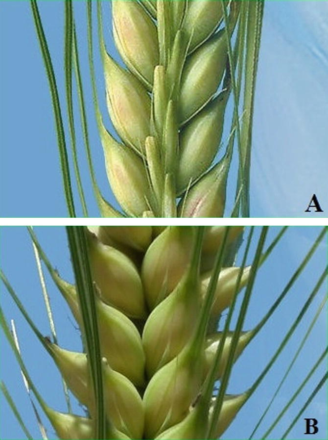

```{r setup, include=FALSE}
library(reticulate)
library(knitr)

# <!-- Copies an HTML dependency to a subdirectory of the given directory. The subdirectory name willbename-version(for example, "outputDir/jquery-1.11.0"). You may setoptions(htmltools.dir.version= FALSE)to suppress the version number in the subdirectory name. -->
options(htmltools.dir.version = FALSE)
knitr::opts_chunk$set(echo = FALSE)
```

class: inverse

<div class="row">
  <div class="column" style="max-width:44%">
    <!-- <a href="https://www.thescottishfarmer.co.uk/arable/14364703.hybrid-barley-pays-off-for-mixed-farming-too/" target="_blank"></a> -->
    <a href="https://cereal.interreg-npa.eu/subsites/CEREAL/Barley_cultivation-Norway_Presentation_2018.pdf" target="_blank"></a>
    <a href="https://www.resilience.org/stories/2020-03-09/the-last-crop-before-the-desert/" target="_blank"></a>
    <a href="https://ipad.fas.usda.gov/highlights/2008/11/eth_25nov2008/" target="_blank"></a>
  </div>
  <div class="column" style="max-width:44%">
    <a href="https://kizilvest.ru/20150827-v-kizilskom-rajone-nachalas-uborochnaya-strada/" target="_blank"></a>
    <a href="https://www.bloomberg.com/news/articles/2020-09-13/iraq-to-offer-first-ever-barley-exports-as-rains-yield-surplus" target="_blank"></a>
    <a href="https://thewire.in/agriculture/covid-19-lockdown-crop-harvest-farmers" target="_blank"></a>
  </div>
  <div class="column" style="max-width:8%; font-size: 15px;">
    <p style="text-align: center; font-size: 30px; line-height: 1em;"> <strong> Barley across the world </strong></p>
    <p>Tjøtta (Nordland, Norway)</p>
    <p>Kiliskoye (Chelyabinsk, Russia)</p>
    <p>Marchouch (Rabat, Morocco)</p>
    <p>Bagdad (Iraq) </p>
    <p>Aksum (Tigray, Ethiopia) </p>
    <p>Hanumangarh (Rajasthan, India) </p>
    <p style="font-size:9px;line-height: 1em;">Click on any picture for more details and credits</p>
  </div>
</div>

---

# Morphological seed diversity of lines

<div class="row">
  <div class="column" style="max-width:45%">
    <a href="https://www.nationalgeographic.co.uk/travel/2020/05/photo-story-from-barley-fields-to-whisky-barrels-in-rural-scotland" target="_blank"></a>
  </div>
  <div class="column" style="max-width:55%">
    <a href="https://www.tibettravel.org/tibetan-culture/highland-barley.html" target="_blank"></a>
    <a href="https://www.doi.org/10.1007/978-1-4419-0465-2_2168" target="_blank"></a>
    <p style="font-size: 15px; line-height: 1em"> Barley seeds from Scotland and Tibet. </p>
    <p style="font-size: 15px; line-height: 1em"> Historical expansion of the barley as a crop. </p>
    <p style="font-size:9px;line-height: 1em;">Click on any picture for more details and credits</p>
  </div>
</div>


---

# 2 row vs 6 row

.pull-left[
- Wild barley is 2 row; 6-row selected early in domestication
- Row malted barley has more protein and enzyme content than 2-row malted barley & is thinner than two-row malt and contains less carbohydrate
- Flavor differences between 2-row and 6-row—most brewers feel 2-row malt produces a fuller, maltier flavor and 6-row malt produces a grainier flavor in the finished beer
- Row barley is only grown in North America
- Genetical switch to abort flowering
]
.pull-right[

]

---

# Genome structure

.pull-left[
- 20 years of work
- Multiple European institutions
- Old fashioned way with BACs! 87K BACs. Oh My!
- Anchored to the 7 chromosomes
]
.pull-right[

]

---

# Chromosome structure

.pull-left[
- What is the distribution of genes?
- TEs? RNA vs DNA TEs differ
- What is the relationship between genes, TEs, &
- Recombination rate?
- What are the Zones?
- Median 20-mer frequencies
- Distal: Zone 1: low copy regions, genes, meiotic recomb.
- Interstitial: Zone 2; Highest 20-mer frequency, intermediate gene #
- Proximal: Zone 3: lower abundance of 20-mers (decayed TEs)
]
.pull-right[

]

---

# Horse shoes!


---

# Winter vs Spring barley

.pull-left[
- Spring and Winter barley: Two gene pools
- 96 elite cultivars, genotyped
- Examined diversity in 2 gene pools across the 7 chromosomes
- Key gene for seasonal growth habit (of 8 genes examined) was locked in the pericentromere with no variation!
- Winter: Blue barley
- Red: Spring barley
]
.pull-right[

]

---

# Quantifying diveristy

.pull-left[
- So what else can you do with a barley genome?
- Measure all of the genetic diversity you can!
- Why?
- See what is in your collection
- See what is missing in your collection
- See what is duplicated in your collection; errors or true duplicates
- Make a more manageable, truly genetically diverse/respresentative for functional work
- What did they do in this paper?
- Had 22,626 DNA samples from:
    - 405 accessions
    - CAS
    - Swiss
    - Previous
- Domesticated and wild
- Did 2 enzyme GBS
]
.pull-right[

]

---

# Quantifying diveristy

.pull-left[
- Barley actually changes very little
- Single Nucleotide Polymorphisms
]
.pull-right[

]

---

# PCA on SNPs

.pull-left[

]
.pull-right[

]

---

# Admixture dependent on geography


---

# How much diversity?


- IBS values within germplasm
- Know what is unique in your collection
- The relationship of genotypes within the collection
- What is missing from your collection 

---

# Now what? GWAS

.pull-left[
- Find genes associated with traits!
- Genome-wide association study
- 2- vs 6-row barley: VRS1
- Then score a bunch of other traits
- Flowering time using grow outs at IPK since 1946
- And disease resistance
- Awn type
- Long, bristling awns—a nuisance for farmers during manual harvesting and for animals chewing the barley grain.Why are awns still there?
- Cereal awns are considered beneficial for seed dispersal in the wild
- In domesticated barley awns contribute photosynthetic activity, whose loss is accompanied by significant yield penalties.
- Barbless awns exist. Can they map this trait?
]
.pull-right[

]

---

