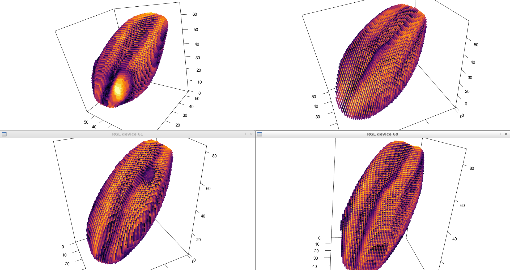
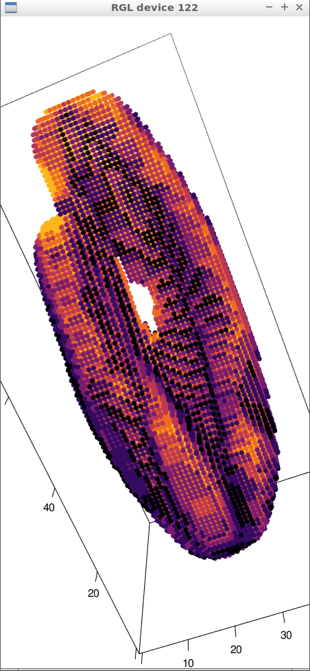
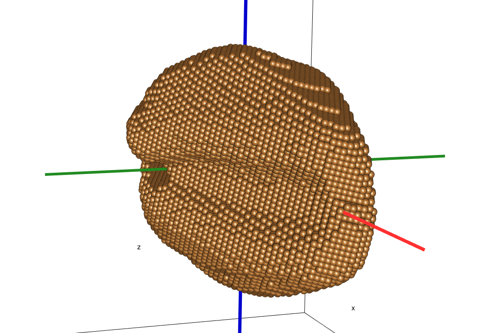

```{r setup, include=FALSE}
library(reticulate)
library(knitr)

# <!-- Copies an HTML dependency to a subdirectory of the given directory. The subdirectory name willbename-version(for example, "outputDir/jquery-1.11.0"). You may setoptions(htmltools.dir.version= FALSE)to suppress the version number in the subdirectory name. -->
options(htmltools.dir.version = FALSE)
knitr::opts_chunk$set(echo = FALSE)
knitr::opts_chunk$set(fig.align = 'center')
```

background-image: url("../../img/endlessforms.png")
background-size: 150px
background-position: 89% 7%

class: inverse

# Plant morphology

<div class="row">
  <div class="column" style="max-width:50%">
    <iframe width="375" height="210" src="https://www.youtube-nocookie.com/embed/oM9kAq0PBvw?controls=0" frameborder="0" allow="accelerometer; autoplay; encrypted-media; gyroscope; picture-in-picture" allowfullscreen></iframe>
    <iframe width="375" height="210" src="https://www.youtube-nocookie.com/embed/V39K58evWlU?controls=0" frameborder="0" allow="accelerometer; autoplay; encrypted-media; gyroscope; picture-in-picture" allowfullscreen></iframe>
  </div>
  <div class="column" style="max-width:50%">
    <iframe width="375" height="210" src="https://www.youtube-nocookie.com/embed/4GBgPIEDoa0?controls=0" frameborder="0" allow="accelerometer; autoplay; encrypted-media; gyroscope; picture-in-picture" allowfullscreen></iframe>
    <iframe width="375" height="210" src="https://www.youtube-nocookie.com/embed/qkOjHHuoUhA?controls=0" frameborder="0" allow="accelerometer; autoplay; encrypted-media; gyroscope; picture-in-picture" allowfullscreen></iframe>
  </div>
</div>

<p style="font-size: 24px; text-align: right; font-family: 'Yanone Kaffeesatz'">Check out more 3D X-ray CT scans at <a href="https://www.youtube.com/@endlessforms6756">youtube.com/@endlessforms6756</a></p>

---

# Topological Data Analysis (TDA)

<div class="row">
  <div class="column" style="max-width:25%; font-size: 15px;">
    
    <p style="font-size: 25px; text-align: center; color: DarkRed;"> Raw Data </p>
    <ul>
      <li> X-ray CT </li>
      <li> Point clouds </li>
      <li> Time series </li>
    <ul>
  </div>
  <div class="column" style="max-width:40%; padding: 0 25px 0 25px; font-size: 15px;">
    
    <p style="font-size: 23px; text-align: center; color: DarkRed;"> Topological Summary </p>
    <ul>
      <li> Euler Characteristic </li>
      <li> Persistence diagrams </li>
      <li> Mapper/Reeb graphs </li>
    <ul>
  </div>
  <div class="column" style="max-width:35%; font-size: 15px;">
    
    <p style="font-size: 25px; text-align: center; color: DarkRed;"> Analysis </p>
    <ul>
      <li> Statistics </li>
      <li> Machine learning </li>
      <li> Classification/prediction </li>
    <ul>
  </div>
</div>

---

background-image: url("../figs/seed.png")
background-size: 400px
background-position: 99% 99%

# Roadmap for today

### Split into modules

1. Plant biology: barley

1. Image processing

1. TDA and Euler Characteristic Transform

1. Machine Learning & Results

1. Looking beyond a single generation

---

class: center, middle, inverse

# 1. Plant biology: barley

---

class: inverse

<div class="row">
  <div class="column" style="max-width:44%">
    <a href="https://kizilvest.ru/20150827-v-kizilskom-rajone-nachalas-uborochnaya-strada/" target="_blank"></a>
    <a href="https://ipad.fas.usda.gov/highlights/2008/11/eth_25nov2008/" target="_blank"></a>
    <a href="https://www.doi.org/10.1007/978-1-4419-0465-2_2168" target="_blank"></a>
  </div>
  <div class="column" style="max-width:44%">
    <a href="https://www.resilience.org/stories/2020-03-09/the-last-crop-before-the-desert/" target="_blank"></a>
    <a href="https://www.tibettravel.org/tibetan-culture/highland-barley.html" target="_blank"></a>
    <a href="https://www.nationalgeographic.co.uk/travel/2020/05/photo-story-from-barley-fields-to-whisky-barrels-in-rural-scotland" target="_blank"></a>
  </div>
  <div class="column" style="max-width:8%; font-size: 15px;">
    <p style="text-align: center; font-size: 30px; line-height: 1em;"> <strong> Barley across the world </strong></p>
    <p>Kiliskoye (Chelyabinsk, Russia)</p>
    <p>Marchouch (Rabat, Morocco)</p>
    <p>Aksum (Tigray, Ethiopia)</p>
    <p>Salar (Tsetang, Tibet)</p>
    <p>Expansion of the barley. </p>
    <p>Turriff (Aberdeenshire, Scotland)</p>
    <p style="font-size:9px;line-height: 1em;">Click on any picture for more details and credits</p>
  </div>
</div>

---

# Going beyond morphometrics

<p style="font-size: 15px; text-align: left; color: DimGrey;"> Geometric Modern Morphometrics (GMM) has been used before to study the shape of barley grains.</p>
<div class="row">
  <div class="column" style="max-width:35%;padding: 0 20px 0 0;">
    
    
    <p style="font-size: 15px; text-align: left; color: DimGrey;padding: 20px 0 0 0;"> Distinguish ancient 2-row vs 6-row barley seeds <a href="http://dx.doi.org/10.1016/j.jas.2013.09.015" target="_blank">(Ros et al. 2014)</a>.</p>
  </div>
  <div class="column" style="max-width:35%;padding: 0 15px 0 15px;">
    
    <p style="font-size: 15px; text-align: center; color: DimGrey;padding: 10px 0 0 0;"> Distinguish charred, domesticated einkorn, emmer, and barley grains <a href="http://dx.doi.org/10.1016/j.jas.2017.09.010" target="_blank">(Bonhomme et al. 2017)</a>.</p>
  </div>
  <div class="column" style="max-width:30%;padding: 0 0 0 20px;">
    
    <p style="font-size: 15px; text-align: right; color: DimGrey;padding: 20px 0 0 0;">Uncover the origins of the <i>bere</i> barley landrace <a href="https://doi.org/10.1007/s10816-018-9402-2" target="_blank">(Wallace et al 2018)</a>.</p>
  </div>
</div>

---

background-image: url("../figs/composite_hybrid_mixture.jpg")
background-size: 400px
background-position: 95% 5%


# Composite Cross II (CC II) 

<div class="row">
  <div class="column" style="max-width:50%">
    
    <p style="font-size: 15px; text-align: center; color: DimGrey;"> Mary Martini, Harry Harlan, Coit Suneson, G.A. Wiebe, Robert Allard, Dan Koenig  </p>
  </div>
  <div class="column" style="max-width:50%">
    
    <p style="font-size: 15px; text-align: center; color: DimGrey;"> 28 parental lines </p>
  </div>
</div>


- Experiment started in 1929, Aberdeen, Idaho
- Maintenance by a number of people at UC Riverside.

---

background-image: url("../figs/composite_cross_experiment.jpg")
background-size: 450px
background-position: 95% 50%

# Cross Composite II experiment

.pull-left[
- **28 parent** genotypes (F0s)

- ${28 \choose 2} = 378$ hybrids (F1s)

- Self throughout **58 generations**
    - Measure **morphology**
    
    - **DNA** sequencing
    
    - RADseq to score over 200,000 polymorphic sites in each individual.
    
    - Which genes are selected for?
    
    - How did morphology change?
]

---

class: center, middle, inverse

# 2. Image processing

## Traditional shape descriptors

---

background-image: url("../figs/barley_lab_composition.jpg")
background-size: 750px
background-position: 99% 99%

# Raw data: X-ray CT scans

.pull-left[
Voxel-based images

$\sim127\mu$m resolution

Batch scans - 4 per tray

2Gb+ per raw scan
]

---

# _ad-hoc_ image processing

<div class="row">
  <div class="column" style="max-width:12%; color: Yellow; font-size: 15px;">
    
    <p style="text-align: center; background-color: #808080;"> Original </p>
  </div>
  <div class="column" style="max-width:12%; color: Yellow; font-size: 15px;">
    
    <p style="text-align: center; background-color: #808080;"> Normalized </p>
  </div>
  <div class="column" style="max-width:12%; color: Yellow; font-size: 15px;">
    
    <p style="text-align: center; background-color: #808080;"> Cleaned </p>
  </div>
  <div class="column" style="max-width:12%; color: Yellow; font-size: 15px;">
    
    <p style="text-align: center; background-color: #808080;"> Pruned </p>
  </div>
  <div class="column" style="max-width:26%; color: Yellow; font-size: 15px;">
    
    <p style="text-align: center; background-color: #808080;"> Labeled </p>
  </div>
  <div class="column" style="max-width:20%; color: Yellow; font-size: 15px;">
    
    <p style="text-align: center; background-color: #808080;"> Analysis! </p>
  </div>
</div>

--

- 224 raw scans

- 875 individual spikes

- 3 generations: $F_0, F_{18}, F_{58}$

---

# Focus on individual grains...

...rather than the spike as a whole

<div class="row">
  <div class="column" style="max-width:63%; padding: 0px 50px;">
    
    
  </div>
  <div class="column" style="max-width:12%; color: Yellow; font-size: 15px; background-color: DarkRed; padding: 5px; border-radius: 15px 0px 0px 30px;">
    
    
  </div>
  <div class="column" style="max-width:12%; color: Yellow; text-align: center; font-size: 15px; background-color: DarkRed; padding: 5px;">
    
    
    <p><strong>Outilers</strong></p>
  </div>
  <div class="column" style="max-width:12%; color: Yellow; text-align: center; font-size: 15px; background-color: DarkRed; padding: 5px; border-radius: 0px 15px 30px 0px;">
    
    
  </div>
  
</div>

- $\sim38,000$ clean seeds.

---

## Image processing &rarr; Traditional descriptors

.pull-left[
- Length
- Width
- Height
- Surface area
- Volume


]

.pull-right[


]

---

# Allometry to pick up outliers

<p style="font-size: 15px; text-align: left; color: DimGrey;"> Make sure that we are not removing one genotype in particular.</p>
<div class="row">
  <div class="column" style="max-width:33%;padding: 0 20px 0 0;">
    
    
    
  </div>
  <div class="column" style="max-width:34%;padding: 0 15px 0 15px;">
    
    
    
  </div>
  <div class="column" style="max-width:33%;padding: 0 0 0 20px;">
    
    
    
  </div>
</div>

---

class: center, middle, inverse

# 3. Topolgical Data Analysis

## Two basic ingredients

## Euler Characteristic Transform (ECT)

## Uncovering "hidden" shape information

---

# 1st TDA Ingredient: Complexes

- Think the data as a collection of elementary building blocks ( _cells_ )

Vertices | Edges | Faces | Cubes
---------|-------|-------|-------
  0-dim  | 1-dim | 2-dim | 3-dim

- A collection of cells is a _cubical complex_

- Count the number of topological features ( _holes_ ):

Connected components | Loops | Voids
---------------------|-------|-------
       0-dim         | 1-dim | 2-dim

--

- Example with 2 connected components, 1 loop, 0 voids

```{r, out.width=500}
knitr::include_graphics("../../tda/figs/binary_to_cubical_complex_textless.png")
```

---

# 2nd TDA Ingredient: Filters

- Each cell is assigned a real value which defines how the complex is constructe.

- Observe how the number of topological features change as the complex grows.

.pull-left[
```{r, out.width="250px"}
knitr::include_graphics(c("../figs/eigcurv_filter.gif", "../figs/gaussian_density_filter.gif"))
```
]

.pull-right[
```{r, out.width="250px"}
knitr::include_graphics(c("../figs/eccentricity_filter.gif", "../figs/vrips_ver2.gif"))
```
]

---

# Topology: The Euler characteristic $\chi$

$$\chi = \#(\text{Vertices}) - \#(\text{Edges}) + \#(\text{Faces}) - \#(\text{Cubes}).$$
```{r, out.width=400}
knitr::include_graphics("../../tda/figs/euler_characteristic_2.png")
```

--
- Summarize **topological features** with the Euler-Poincaré formula

$$\chi = \#(\text{Connected Components}) - \#(\text{Loops}) + \#(\text{Voids}).$$

---

class: center
background-image: url("../../tda/figs/euler_characteristic_variety.jpg")
background-size: 900px
background-position: 50% 80%

# Euler characteristic for different shapes

- The Euler characteristic is a **topological invariant**.

.pull-left[
If the Euler characteristic is **different**, then the two shapes are topologically different.
]

.pull-right[
However, two topologically different shapes **could** have the same Euler characteristic.
]

---

background-image: url("../figs/ecc_ver2.gif")
background-size: 750px
background-position: 50% 90%

# Euler Characteristic Curve (ECC)

- Consider a cubical complex $X\subset\mathbb{R}^d$
- And a unit-length direction $\nu\in S^{d-1}$

- And the subcomplex containing all cubical cells below height $h$ in the direction $\nu$
$$X(\nu)_h =\{\Delta \in X\::\:\langle x,\nu\rangle\leq h\text{ for all }x\in\Delta\}$$

- The Euler Characteristic Curve (ECC) of direction $\nu$ is defined as the sequence $$\{\chi(X(\nu)_h)\}_{h\in\mathbb{R}}$$
---

background-image: url("../figs/ect_ver2.gif")
background-size: 800px
background-position: 50% 88%

# Euler Characteristic Transform (ECT)

- Repeat and concatenate for all possible directions.

- More formally, the ECT can be thought as a function

$$
\begin{split}
ECT(X):\; & S^{d-1} \to \mathbb{Z}^{\mathbb{R}}\\
&\nu\mapsto\{\chi(X(\nu)_h)\}_{h\in\mathbb{R}}.
\end{split}
$$

---

# Why choose the ECT?

--

- Easy to compute: a quick alternating sum.

--

[**Theorem _(Turner, Mukherjee, Boyer 2014)_**](https://doi.org/10.1093/imaiai/iau011): The ECT is injective for finite simplicial complexes in 3D.

[**Theorem _(ibid)_**](https://arxiv.org/abs/1310.1030): The ECT is a sufficient statistic for finite simplicial complexes in 3D.

--

*Translation:* 

- Given all the (infinite) ECCs corresponding to all possible directions,

- *Different* simplicial complexes correspond to *different* ECTs.

- The ECT effectively summarizes all possible information related to shape.

--

There is math research on computationally efficient reconstruction algorithms for 3D shapes ([Turner, Curry](https://arxiv.org/abs/1805.09782), [Fasy](https://arxiv.org/abs/1912.12759), [Ghrist](https://doi.org/10.1007/s41468-018-0017-1)) but this remains elusive.

---

# Injectivity proof outline

```{r, out.width="775px", out.height="475px"}
knitr::include_graphics("../../tda/slides/lab200330.pdf")
```

---

class: inverse, center, middle

# 4. Results

## Evaluating the descriptiveness of the ECTs

## Use of Support Vector Machines (SVMs)

---

background-image: url("../figs/parameters_vert_combined_laplacedot_12.jpg")
background-size: 350px
background-position: 90% 50%

# The ECT of every seed

.pull-left[
- Align all seeds on the same axes

- 158 directions

- 8 thresholds per directions

- Each seed is assigned a $158\times8=1264$-dimensional vector.

```{r, out.width="300px"}
knitr::include_graphics("../figs/pole_directions_p7_m12_crop.jpg")
```
]

---

# Dimension reduction is necessary

```{r, out.width="600px"}
knitr::include_graphics("../../demat/figs/curse_of_dimensionality.png")
```

- To fill the _d_-dimensional cube of side length $1$ with $N$ sub-cubes, these sub-cubes must be of side length  $\ell=\left(\frac1N\right)^{\frac1d}$

--

- Since $\ell\to1$ as $d\to\infty$, we can fit infinite sub-cubes of length $1$ inside a cube of length $1$.

--

- Sparsity blows up with dimension: Our intuition of "near" and "far" breaks down

--

- **Reduce the dimension of the ECT vectors with kernel PCA (KPCA.)**

---

background-image: url("../../demat/figs/separable-svm.svg")
background-size: 650px
background-position: 50% 90%

## Classification: Support Vector Machines (SVM)

- **Training**: $n$ _labeled_ points $\{\mathbf x_i,y_i\}_{i=1}^n$ with $y_i\in\{-1,+1\}$ 

- Determine the best hyperplane $H (\mathbf w, b)$ that separates the classes

- **Test**: $m$ _unlabeled_ points $\{\mathbf z_j\}_{j=1}^m$ : the class is given by $\mathrm{sgn}(\langle\mathbf z_j, \mathbf w\rangle)$


---

background-image: url("../figs/S012_L2_Blue_33.png")
background-size: 150px
background-position: 99% 50%

# Game plan

- **Goal:** Classify 28 barley parental genotypes using solely grain morphology information.

- **3121** grains in total

--

- Compare **3** sets of morphological descriptors

Descriptor | No. of descriptors
-----------|--------------------
Traditional | 11
Topological (ECT + KPCA) | 12
Combined (Trad + Topo) | 23

- Sample randomly 80/20 training/testing sample for each genotype.

- Repeat the sampling and SVM computation 100 and consider the average.

---

# Classification of 28 lines with SVM

<style type="text/css">
.tg  {border-collapse:collapse;border-color:#93a1a1;border-spacing:0;margin:0px auto;}
.tg td{background-color:#fdf6e3;border-bottom-width:1px;border-color:#93a1a1;border-style:solid;border-top-width:1px;
  border-width:0px;color:#002b36;font-family:Arial, sans-serif;font-size:14px;overflow:hidden;padding:10px 5px;
  word-break:normal;}
.tg th{background-color:#657b83;border-bottom-width:1px;border-color:#93a1a1;border-style:solid;border-top-width:1px;
  border-width:0px;color:#fdf6e3;font-family:Arial, sans-serif;font-size:14px;font-weight:normal;overflow:hidden;
  padding:10px 5px;word-break:normal;}
.tg .tg-2bhk{background-color:#eee8d5;border-color:inherit;text-align:left;vertical-align:top}
.tg .tg-0pky{border-color:inherit;text-align:left;vertical-align:top}
.tg .tg-gyvr{background-color:#eee8d5;border-color:inherit;font-size:100%;text-align:left;vertical-align:top}
</style>
<table class="tg">
<thead>
  <tr>
    <th class="tg-0pky">Shape descriptors</th>
    <th class="tg-0pky">No. of descriptors</th>
    <th class="tg-0pky">Precision</th>
    <th class="tg-0pky">Recall</th>
    <th class="tg-0pky">F1</th>
  </tr>
</thead>
<tbody>
  <tr>
    <td class="tg-2bhk">Traditional</td>
    <td class="tg-2bhk">11</td>
    <td class="tg-2bhk">0.57 &plusmn; 0.058</td>
    <td class="tg-2bhk">0.56 &plusmn; 0.019</td>
    <td class="tg-2bhk">0.55 &plusmn; 0.019</td>
  </tr>
  <tr>
    <td class="tg-0pky">Topological</td>
    <td class="tg-0pky">12</td>
    <td class="tg-0pky">0.51 &plusmn; 0.063</td>
    <td class="tg-0pky">0.51 &plusmn; 0.020</td>
    <td class="tg-0pky">0.50 &plusmn; 0.020</td>
  </tr>
  <tr>
    <td class="tg-2bhk">Combined</td>
    <td class="tg-2bhk">23</td>
    <td class="tg-2bhk">0.72 &plusmn; 0.055</td>
    <td class="tg-2bhk">0.71 &plusmn; 0.018</td>
    <td class="tg-2bhk">0.71 &plusmn; 0.018</td>
  </tr>
</tbody>
</table>

```{r, out.width=700}
knitr::include_graphics('../figs/avg_accuracy_normalized_size_combined_158_8_laplacedot_12_horz_transp.png')
```

---

class: inverse, center, middle

# 5. Future work

## Barley scratched the surface

## The quest for phenotype &harr; genotype

---

# Into semi-supervised territory

- Train an SVM with 100% of the founders

- Classify the progeny to detect genotype enrichment

.pull-left[

]

.pull-right[

]

---

# Analyze individual selection lines

More than 30K seeds for $F_{18}$


---

# Analyze individual selection lines

More than 6K seeds for $F_{58}$


---

# Beyond barley

**Citrus**: Hybridization

- In collaboration with Dr. Danelle Seymour (UC Riverside)
- Segment and study separately different tissues
    - Endocarp, rind, exocarp

**Walnuts**: Functional shape traits

- In collaboration with Dr. Pat Brown (UC Davis)
- Relate the shape of the walnut shell to its "crackability"

<div class="row">
  <div class="column" style="max-width:50%">
    <iframe width="375" height="210" src="https://www.youtube-nocookie.com/embed/ikhuvGpJbeA?controls=0" frameborder="0" allow="accelerometer; autoplay; encrypted-media; gyroscope; picture-in-picture" allowfullscreen></iframe>
  </div>
  <div class="column" style="max-width:50%">
    <iframe width="375" height="210" src="https://www.youtube-nocookie.com/embed/a7JCIJRpF8U?controls=0" frameborder="0" allow="accelerometer; autoplay; encrypted-media; gyroscope; picture-in-picture" allowfullscreen></iframe>
  </div>
</div>

---

class: right, bottom, inverse

background-image: url("../figs/acknowledgments.jpg")
background-size: 1000px
background-position: 50% 40%

Grab these slides at [`bit.ly/shape_gac2021`](http://bit.ly/shape_gac2021)
