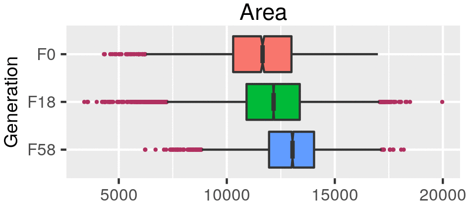
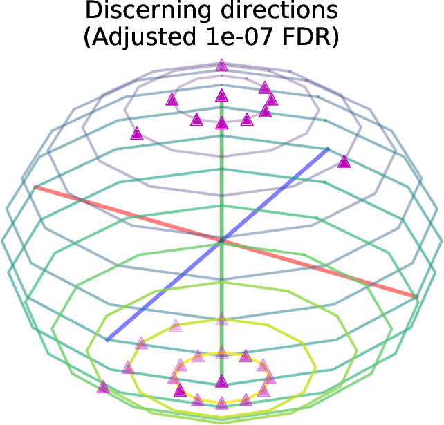

```{r setup, include=FALSE}
library(reticulate)
library(knitr)

# <!-- Copies an HTML dependency to a subdirectory of the given directory. The subdirectory name willbename-version(for example, "outputDir/jquery-1.11.0"). You may setoptions(htmltools.dir.version= FALSE)to suppress the version number in the subdirectory name. -->
options(htmltools.dir.version = FALSE)
knitr::opts_chunk$set(echo = FALSE)
knitr::opts_chunk$set(fig.align = 'center')
```

# Topological Data Analysis

<div class="row">
  <div class="column" style="max-width:25%; font-size: 15px;">
    
    <p style="font-size: 25px; text-align: center; color: DarkRed;"> Raw Data </p>
    <ul>
      <li> X-ray CT </li>
      <li> Point clouds </li>
      <li> Time series </li>
    <ul>
  </div>
</div>

---

# Topological Data Analysis

<div class="row">
  <div class="column" style="max-width:25%; font-size: 15px;">
    
    <p style="font-size: 25px; text-align: center; color: DarkRed;"> Raw Data </p>
    <ul>
      <li> X-ray CT </li>
      <li> Point clouds </li>
      <li> Time series </li>
    <ul>
  </div>
  <div class="column" style="max-width:40%; padding: 0 25px 0 25px; font-size: 15px;">
    
    <p style="font-size: 23px; text-align: center; color: DarkRed;"> Topological Summary </p>
    <ul>
      <li> Euler Characteristic </li>
      <li> Persistence diagrams </li>
      <li> Mapper/Reeb graphs </li>
    <ul>
  </div>
</div>

---

# Topological Data Analysis

<div class="row">
  <div class="column" style="max-width:25%; font-size: 15px;">
    
    <p style="font-size: 25px; text-align: center; color: DarkRed;"> Raw Data </p>
    <ul>
      <li> X-ray CT </li>
      <li> Point clouds </li>
      <li> Time series </li>
    <ul>
  </div>
  <div class="column" style="max-width:40%; padding: 0 25px 0 25px; font-size: 15px;">
    
    <p style="font-size: 23px; text-align: center; color: DarkRed;"> Topological Summary </p>
    <ul>
      <li> Euler Characteristic </li>
      <li> Persistence diagrams </li>
      <li> Mapper/Reeb graphs </li>
    <ul>
  </div>
  <div class="column" style="max-width:35%; font-size: 15px;">
    
    <p style="font-size: 25px; text-align: center; color: DarkRed;"> Analysis </p>
    <ul>
      <li> Statistics </li>
      <li> Machine learning </li>
      <li> Classification/prediction </li>
    <ul>
  </div>
</div>

---

# Cross Composite II experiment

.pull-right[

]

---

# Cross Composite II experiment

.pull-left[


- **28 parents/accessions** $(F_0)$
]

.pull-right[

]

---

background-image: url("../figs/composite_cross_experiment.jpg")
background-size: 450px
background-position: 95% 90%

# Cross Composite II experiment

.pull-left[


- **28 parents/accessions** $(F_0)$

- Do ${28 \choose 2}$ **hybrids** $(F_1)$

- **Self-fertilize** the resulting 379 hybrids $(F_2\to F_{58})$
]

.pull-right[

]

---

# Raw Data: X-rays &rarr; Image Processing

<div class="row">
  <div class="column" style="max-width:51%; color: Navy; font-size: 15px;">
    
    <p style="text-align: center;"> Proprietary X-Ray CT scan reconstruction </p>
  </div>
</div>

---

# Raw Data: X-rays &rarr; Image Processing

<div class="row">
  <div class="column" style="max-width:51%; color: Navy; font-size: 15px;">
    
    <p style="text-align: center;"> Proprietary X-Ray CT scan reconstruction </p>
  </div>
  <div class="column" style="max-width:17.5%; color: Navy; font-size: 15px;">
    
    <p style="text-align: center;"> 975 spikes </p>
  </div>
</div>

---

# Raw Data: X-rays &rarr; Image Processing

<div class="row">
  <div class="column" style="max-width:51%; color: Navy; font-size: 15px;">
    
    <p style="text-align: center;"> Proprietary X-Ray CT scan reconstruction </p>
  </div>
  <div class="column" style="max-width:17.5%; color: Navy; font-size: 15px;">
    
    <p style="text-align: center;"> 975 spikes </p>
  </div>
  <div class="column" style="max-width:20.5%; color: Navy; font-size: 15px;">
    
    <p style="text-align: center;"> 38,000 seeds </p>
  </div>
</div>

---

# Raw Data: X-rays &rarr; Image Processing

<div class="row">
  <div class="column" style="max-width:51%; color: Navy; font-size: 15px;">
    
    <p style="text-align: center;"> Proprietary X-Ray CT scan reconstruction </p>
  </div>
  <div class="column" style="max-width:17.5%; color: Navy; font-size: 15px;">
    
    <p style="text-align: center;"> 975 spikes </p>
  </div>
  <div class="column" style="max-width:20.5%; color: Navy; font-size: 15px;">
    
    <p style="text-align: center;"> 38,000 seeds </p>
  </div>
</div>

<div class="row">
  <div class="column" style="max-width:35%; color: Navy; font-size: 15px;">
    
    <p style="text-align: center;"> Align all the seeds </p>
  </div>
</div>

---

# Raw Data: X-rays &rarr; Image Processing

<div class="row">
  <div class="column" style="max-width:51%; color: Navy; font-size: 15px;">
    
    <p style="text-align: center;"> Proprietary X-Ray CT scan reconstruction </p>
  </div>
  <div class="column" style="max-width:17.5%; color: Navy; font-size: 15px;">
    
    <p style="text-align: center;"> 975 spikes </p>
  </div>
  <div class="column" style="max-width:20.5%; color: Navy; font-size: 15px;">
    
    <p style="text-align: center;"> 38,000 seeds </p>
  </div>
</div>

<div class="row">
  <div class="column" style="max-width:35%; color: Navy; font-size: 15px;">
    
    <p style="text-align: center;"> Align all the seeds </p>
  </div>
  <div class="column" style="max-width:55%; color: Navy; font-size: 15px;">
    
    <p style="text-align: center;"> Traditional shape descriptors </p>
  </div>
</div>

---

# The Euler Characteristic Transform (ECT)

$$\chi = \#(\text{Vertices}) - \#(\text{Edges}) + \#(\text{Faces}).$$

--

- ECT is the record of how the EC changes as we chop/reconstruct a given object in all possible directions.

--


--

- [**Theorem _(Turner, Mukherjee, Boyer 2014)_**](https://doi.org/10.1093/imaiai/iau011):  Mathematically speaking, the ECT summarizes all shape information.

---


# Hidden topological shape information

- **Goal:** Classify 28 barley accessions using solely grain morphology information.

- **3121** grains in total

--

.pull-left[

]

.pull-right[
```{r, out.width=150}
knitr::include_graphics('../figs/pole_directions_p7_m12_crop.jpg')
```
]

---

# Hidden topological shape information

- **Goal:** Classify 28 barley accessions using solely grain morphology information.

- **3121** grains in total

.pull-left[


```{r, out.width=300}
knitr::include_graphics(c('../figs/kruskal_wallis_topo_summary.jpg'))
```
]

.pull-right[
```{r, out.width=150}
knitr::include_graphics('../figs/pole_directions_p7_m12_crop.jpg')
```
]

---

# Hidden topological shape information

- **Goal:** Classify 28 barley accessions using solely grain morphology information.

- **3121** grains in total

.pull-left[


```{r, out.width=300}
knitr::include_graphics(c('../figs/kruskal_wallis_topo_summary.jpg'))
```
]

.pull-right[
```{r, out.width=150}

```


]

---

# Into semi-supervised territory

- Train an SVM with 100% of the founders $(F_0)$

- Classify the progeny $(F_{18}\text{ and }F_{58})$ to detect genotype enrichment

--

.pull-left[

]

.pull-right[

]


---
class: right, bottom, inverse

background-image: url("../figs/acknowledgments.jpg")
background-size: 1000px
background-position: 50% 40%

Grab these slides at [`bit.ly/eccb21_barley`](http://bit.ly/eccb21_barley)
