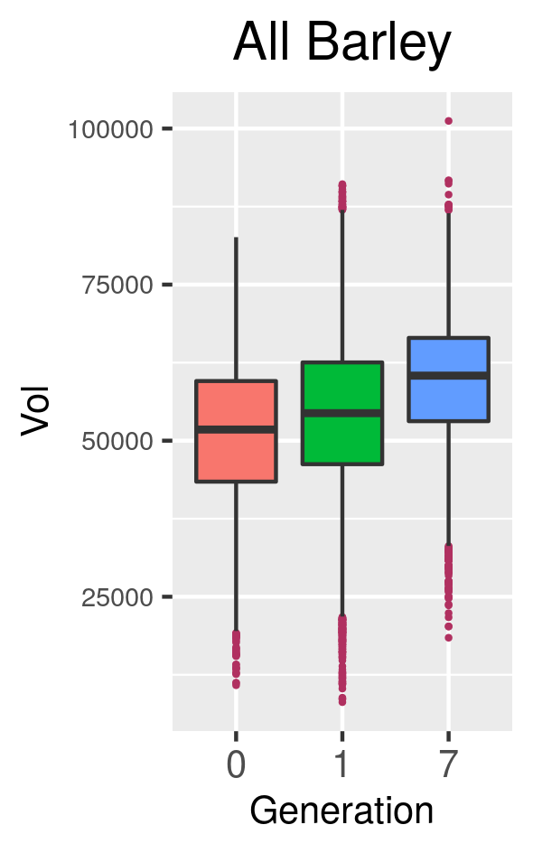

```{r, include=FALSE}
library(knitr)
knitr::opts_chunk$set(results = 'asis',
                      echo = FALSE,
                      warning = FALSE,
                      tidy = FALSE,
                      message = FALSE,
                      include = TRUE,
                      fig.align = 'center',
                      out.width = "100%")
options(knitr.table.format = "html") 
```

## Experimental Design


```{r experimental_design, out.width='80%'}
knitr::include_graphics(c('../figs/composite_cross_experiment.jpg'), dpi=5)
```

- Composite cross. 28 founders. 58 generations.

## Image processing to measure seeds

{width=30%} {width=31%} {width=31%}

- 3D X-ray CT scan data: 875 barley spikes.

- 38,000 seeds comprising generations F0, F18, and F58.

- Automatically measured and observed distribution of
    - Length, height, width
    - Volume, surface area
    - Convex hull volume and surface area

<br>

## Euler characteristic transform (ECT)

```{r coffee, out.width='80%'}
knitr::include_graphics(c('../figs/coffee.png'), dpi=5)
```

- The Euler characteristic is a topological invariant: it doesn't change under smooth transformations

$$\chi = \#(\text{Vertices}) - \#(\text{Edges}) + \#(\text{Faces})$$

- ECT is the record of how the EC changes as we reconstruct a given object in all possible directions. 
- The ECT summarizes all shape information [@Turner2014].

```{r ect}
knitr::include_graphics('../figs/ect.gif')
```

## Results

```{r confusion}
knitr::include_graphics('../figs/confusion.jpg')
```


- SVM to classify the seeds from the 28 founders
- (80% training vs 20% testing)$\times$50 times
- 54% (traditional) and 45% (ECT) accuracy

#### Acknowldegements

IMPACTS NSF DGE-1828149

#### References
