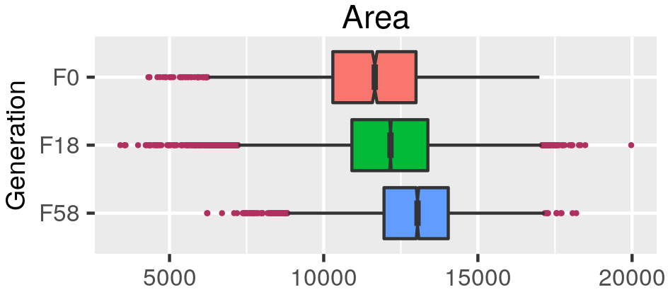

```{r setup, include=FALSE}
library(reticulate)
library(knitr)

# <!-- Copies an HTML dependency to a subdirectory of the given directory. The subdirectory name willbename-version(for example, "outputDir/jquery-1.11.0"). You may setoptions(htmltools.dir.version= FALSE)to suppress the version number in the subdirectory name. -->
options(htmltools.dir.version = FALSE)
knitr::opts_chunk$set(echo = FALSE)
knitr::opts_chunk$set(fig.align = 'center')
```
class: inverse

# Plant morphology

<div class="row">
  <div class="column" style="max-width:50%">
    <iframe width="375" height="210" src="https://www.youtube-nocookie.com/embed/oM9kAq0PBvw?controls=0" frameborder="0" allow="accelerometer; autoplay; encrypted-media; gyroscope; picture-in-picture" allowfullscreen></iframe>
    <iframe width="375" height="210" src="https://www.youtube-nocookie.com/embed/V39K58evWlU?controls=0" frameborder="0" allow="accelerometer; autoplay; encrypted-media; gyroscope; picture-in-picture" allowfullscreen></iframe>
  </div>
  <div class="column" style="max-width:50%">
    <iframe width="375" height="210" src="https://www.youtube-nocookie.com/embed/4GBgPIEDoa0?controls=0" frameborder="0" allow="accelerometer; autoplay; encrypted-media; gyroscope; picture-in-picture" allowfullscreen></iframe>
    <iframe width="375" height="210" src="https://www.youtube-nocookie.com/embed/qkOjHHuoUhA?controls=0" frameborder="0" allow="accelerometer; autoplay; encrypted-media; gyroscope; picture-in-picture" allowfullscreen></iframe>
  </div>
</div>

---

# Topological Data Analysis (TDA)

<div class="row">
  <div class="column" style="max-width:25%; font-size: 15px;">
    
    <p style="font-size: 25px; text-align: center; color: DarkRed;"> Raw Data </p>
    <ul>
      <li> X-ray CT </li>
      <li> Point clouds </li>
      <li> Time series </li>
    <ul>
  </div>
  <div class="column" style="max-width:40%; padding: 0 25px 0 25px; font-size: 15px;">
    
    <p style="font-size: 23px; text-align: center; color: DarkRed;"> Topological Summary </p>
    <ul>
      <li> Euler Characteristic </li>
      <li> Persistence diagrams </li>
      <li> Mapper/Reeb graphs </li>
    <ul>
  </div>
  <div class="column" style="max-width:35%; font-size: 15px;">
    
    <p style="font-size: 25px; text-align: center; color: DarkRed;"> Analysis </p>
    <ul>
      <li> Statistics </li>
      <li> Machine learning </li>
      <li> Classification/prediction </li>
    <ul>
  </div>
</div>

---

class: inverse

<div class="row">
  <div class="column" style="max-width:44%">
    <a href="https://kizilvest.ru/20150827-v-kizilskom-rajone-nachalas-uborochnaya-strada/" target="_blank"></a>
    <a href="https://ipad.fas.usda.gov/highlights/2008/11/eth_25nov2008/" target="_blank"></a>
    <a href="https://www.doi.org/10.1007/978-1-4419-0465-2_2168" target="_blank"></a>
  </div>
  <div class="column" style="max-width:44%">
    <a href="https://www.resilience.org/stories/2020-03-09/the-last-crop-before-the-desert/" target="_blank"></a>
    <a href="https://www.tibettravel.org/tibetan-culture/highland-barley.html" target="_blank"></a>
    <a href="https://www.nationalgeographic.co.uk/travel/2020/05/photo-story-from-barley-fields-to-whisky-barrels-in-rural-scotland" target="_blank"></a>
  </div>
  <div class="column" style="max-width:8%; font-size: 15px;">
    <p style="text-align: center; font-size: 30px; line-height: 1em;"> <strong> Barley across the world </strong></p>
    <p>Kiliskoye (Chelyabinsk, Russia)</p>
    <p>Marchouch (Rabat, Morocco)</p>
    <p>Aksum (Tigray, Ethiopia)</p>
    <p>Salar (Tsetang, Tibet)</p>
    <p>Expansion of the barley. </p>
    <p>Turriff (Aberdeenshire, Scotland)</p>
    <p style="font-size:9px;line-height: 1em;">Click on any picture for more details and credits</p>
  </div>
</div>

---

# Cross Composite II experiment

.pull-right[

]

---

background-image: url("../figs/composite_cross_v_01.png")
background-size: 425px
background-position: 95% 90%

# Cross Composite II experiment

.pull-left[


- **28 parents/accessions** $(F_0)$
]

.pull-right[

]

---

background-image: url("../figs/composite_cross_v_02.png")
background-size: 425px
background-position: 95% 90%

# Cross Composite II experiment

.pull-left[


- **28 parents/accessions** $(F_0)$

- Do ${28 \choose 2}$ **hybrids** $(F_1)$

]

.pull-right[

]

---

background-image: url("../figs/composite_cross_v_03.png")
background-size: 425px
background-position: 95% 90%

# Cross Composite II experiment

.pull-left[


- **28 parents/accessions** $(F_0)$

- Do ${28 \choose 2}$ **hybrids** $(F_1)$

- **Self-fertilize** the resulting 379 hybrids
]

.pull-right[

]

---

background-image: url("../figs/composite_cross_v_04.png")
background-size: 425px
background-position: 95% 90%

# Cross Composite II experiment

.pull-left[


- **28 parents/accessions** $(F_0)$

- Do ${28 \choose 2}$ **hybrids** $(F_1)$

- **Self-fertilize** the resulting 379 hybrids

- Each line grows in a different part of an open field
]

.pull-right[

]

---

background-image: url("../figs/composite_cross_v_05.png")
background-size: 425px
background-position: 95% 90%

# Cross Composite II experiment

.pull-left[


- **28 parents/accessions** $(F_0)$

- Do ${28 \choose 2}$ **hybrids** $(F_1)$

- **Self-fertilize** the resulting 379 hybrids

- Each line grows in a different part of an open field **for 58 generations**
]

.pull-right[

]

---

# Raw Data: X-rays &rarr; Image Processing

<div class="row">
  <div class="column" style="max-width:37.5%; color: Navy; font-size: 15px;">
    
    <p style="text-align: center;">Barley shipped from California</p>
  </div>
</div>

---

# Raw Data: X-rays &rarr; Image Processing

<div class="row">
  <div class="column" style="max-width:37.5%; color: Navy; font-size: 15px;">
    
    <p style="text-align: center;">Barley shipped from California</p>
  </div>
  <div class="column" style="max-width:50%; color: Navy; font-size: 15px;">
    
    <p style="text-align: center;">Proprietary X-Ray CT scan reconstruction</p>
  </div>
</div>

---

# Raw Data: X-rays &rarr; Image Processing

<div class="row">
  <div class="column" style="max-width:37.5%; color: Navy; font-size: 15px;">
    
    <p style="text-align: center;">Barley shipped from California</p>
  </div>
  <div class="column" style="max-width:50%; color: Navy; font-size: 15px;">
    
    <p style="text-align: center;">Proprietary X-Ray CT scan reconstruction</p>
  </div>
</div>

<div class="row">
  <div class="column" style="max-width:38%; color: Navy; font-size: 15px;">
    
    <p style="text-align: center;">Creative setup</p>
  </div>
</div>

---

# Raw Data: X-rays &rarr; Image Processing

<div class="row">
  <div class="column" style="max-width:37.5%; color: Navy; font-size: 15px;">
    
    <p style="text-align: center;">Barley shipped from California</p>
  </div>
  <div class="column" style="max-width:50%; color: Navy; font-size: 15px;">
    
    <p style="text-align: center;">Proprietary X-Ray CT scan reconstruction</p>
  </div>
</div>

<div class="row">
  <div class="column" style="max-width:38%; color: Navy; font-size: 15px;">
    
    <p style="text-align: center;">Creative setup</p>
  </div>
  <div class="column" style="max-width:17.5%; color: Navy; font-size: 15px;">
    
    <p style="text-align: center;"> 975 spikes </p>
  </div>
  <div class="column" style="max-width:17%; color: Navy; font-size: 15px;">
    
    <p style="text-align: center;"> 3 generations </p>
  </div>
</div>

---

# Raw Data: X-rays &rarr; Image Processing

<div class="row">
  <div class="column" style="max-width:37.5%; color: Navy; font-size: 15px;">
    
    <p style="text-align: center;">Barley shipped from California</p>
  </div>
  <div class="column" style="max-width:50%; color: Navy; font-size: 15px;">
    
    <p style="text-align: center;">Proprietary X-Ray CT scan reconstruction</p>
  </div>
</div>

<div class="row">
  <div class="column" style="max-width:38%; color: Navy; font-size: 15px;">
    
    <p style="text-align: center;">Creative setup</p>
  </div>
  <div class="column" style="max-width:17.5%; color: Navy; font-size: 15px;">
    
    <p style="text-align: center;"> 975 spikes </p>
  </div>
  <div class="column" style="max-width:17%; color: Navy; font-size: 15px;">
    
    <p style="text-align: center;"> 3 generations </p>
  </div>
  <div class="column" style="max-width:20.5%; color: Navy; font-size: 15px;">
    
    <p style="text-align: center;"> 38,000 seeds </p>
  </div>
</div>

---

## Image processing &rarr; Traditional descriptors

.pull-left[
- Length
- Width
- Height
- Surface area
- Volume


]

--

.pull-right[



]

---

# Topology: The Euler characteristic $\chi$

$$\chi = \#(\text{Vertices}) - \#(\text{Edges}) + \#(\text{Faces}).$$
```{r, out.width=400}
knitr::include_graphics("../figs/euler_characteristic_2.png")
```

--

- Summarize **topological features** with the Euler-Poincaré formula

$$\chi = \#(\text{Connected Components}) - \#(\text{Loops}) + \#(\text{Voids}).$$

--

- The Euler characteristic is a **topological invariant**.

---

# Euler Characteristic Curve (ECC)

- Consider a cubical complex $X\subset\mathbb{R}^d$


- And a unit-length direction $\nu\in S^{d-1}$

--

- And the subcomplex containing all cubical cells below height $h$ in the direction $\nu$
$$X(\nu)_h =\{\Delta \in X\::\:\langle x,\nu\rangle\leq h\text{ for all }x\in\Delta\}$$

--

- The Euler Characteristic Curve (ECC) of direction $\nu$ is defined as the sequence $$\{\chi(X(\nu)_h)\}_{h\in\mathbb{R}}$$

---

background-image: url("../figs/ecc_ver2.gif")
background-size: 750px
background-position: 50% 90%

# Euler Characteristic Curve (ECC)

- Consider a cubical complex $X\subset\mathbb{R}^d$
- And a unit-length direction $\nu\in S^{d-1}$

- And the subcomplex containing all cubical cells below height $h$ in the direction $\nu$
$$X(\nu)_h =\{\Delta \in X\::\:\langle x,\nu\rangle\leq h\text{ for all }x\in\Delta\}$$

- The Euler Characteristic Curve (ECC) of direction $\nu$ is defined as the sequence $$\{\chi(X(\nu)_h)\}_{h\in\mathbb{R}}$$
---

# Euler Characteristic Transform (ECT)

- Repeat and concatenate for all possible directions.

- More formally, the ECT can be thought as a function

$$
\begin{split}
ECT(X):\; & S^{d-1} \to \mathbb{Z}^{\mathbb{R}}\\
&\nu\mapsto\{\chi(X(\nu)_h)\}_{h\in\mathbb{R}}.
\end{split}
$$

---

background-image: url("../figs/ect_ver2.gif")
background-size: 800px
background-position: 50% 88%

# Euler Characteristic Transform (ECT)

- Repeat and concatenate for all possible directions.

- More formally, the ECT can be thought as a function

$$
\begin{split}
ECT(X):\; & S^{d-1} \to \mathbb{Z}^{\mathbb{R}}\\
&\nu\mapsto\{\chi(X(\nu)_h)\}_{h\in\mathbb{R}}.
\end{split}
$$

---

# Why choose the ECT?

--

- Easy to compute: a quick alternating sum.

--

[**Theorem _(Turner, Mukherjee, Boyer 2014)_**](https://doi.org/10.1093/imaiai/iau011): The ECT is injective for finite simplicial complexes in 3D.

[**Theorem _(ibid)_**](https://arxiv.org/abs/1310.1030): The ECT is a sufficient statistic for finite simplicial complexes in 3D.

--

*Translation:*

- Given all the (infinite) ECCs corresponding to all possible directions,

- *Different* simplicial complexes correspond to *different* ECTs.

- The ECT effectively summarizes all possible information related to shape.

--

Efficient reconstruction algorithms for 3D shapes ([Betthauser 2018](https://people.clas.ufl.edu/peterbubenik/files/Betthauser_Thesis.pdf); [Curry, Mukherjee, Turner 2018](https://arxiv.org/abs/1805.09782); [Fasy et al. 2019](https://arxiv.org/abs/1912.12759)) remains elusive.

---

background-image: url("../figs/S012_L2_Blue_33.png")
background-size: 150px
background-position: 99% 50%

# Game plan

- **Goal:** Classify 28 barley parental accessions using solely grain morphology information.

- **3121** grains in total

--

.pull-left[
```{r, out.width=150}
knitr::include_graphics('../figs/pole_directions_p7_m12_crop.jpg')
```
]

.pull-right[
- 158 directions
- 16 thresholds per direction
- Every seed is associated a $158\times16=2528$-dim vector
- Dimensions reduced with UMAP
]


--

- Compare **3** sets of morphological descriptors

Descriptor | No. of descriptors
-----------|--------------------
Traditional | 11
Topological (ECT &rarr; UMAP) | ~~2528~~ &rarr; 12
Combined (Trad &oplus; Topo) | 23

--

- Sample randomly 75/25 training/testing sample for each accession.

- Repeat the sampling and SVM computation 100 times and consider the average.

---

# Classification of 28 lines with SVM

<style type="text/css">
.tg  {border-collapse:collapse;border-color:#93a1a1;border-spacing:0;margin:0px auto;}
.tg td{background-color:#fdf6e3;border-bottom-width:1px;border-color:#93a1a1;border-style:solid;border-top-width:1px;
  border-width:0px;color:#002b36;font-family:Arial, sans-serif;font-size:14px;overflow:hidden;padding:10px 5px;
  word-break:normal;}
.tg th{background-color:#657b83;border-bottom-width:1px;border-color:#93a1a1;border-style:solid;border-top-width:1px;
  border-width:0px;color:#fdf6e3;font-family:Arial, sans-serif;font-size:14px;font-weight:normal;overflow:hidden;
  padding:10px 5px;word-break:normal;}
.tg .tg-2bhk{background-color:#eee8d5;border-color:inherit;text-align:left;vertical-align:top}
.tg .tg-0pky{border-color:inherit;text-align:left;vertical-align:top}
.tg .tg-gyvr{background-color:#eee8d5;border-color:inherit;font-size:100%;text-align:left;vertical-align:top}
</style>
<table class="tg">
<thead>
  <tr>
    <th class="tg-0pky">Shape descriptors</th>
    <th class="tg-0pky">No. of descriptors</th>
    <th class="tg-0pky">Precision</th>
    <th class="tg-0pky">Recall</th>
    <th class="tg-0pky">F1</th>
  </tr>
</thead>
<tbody>
  <tr>
    <td class="tg-2bhk">Traditional</td>
    <td class="tg-2bhk">11</td>
    <td class="tg-2bhk">0.57 &plusmn; 0.058</td>
    <td class="tg-2bhk">0.56 &plusmn; 0.019</td>
    <td class="tg-2bhk">0.55 &plusmn; 0.019</td>
  </tr>
  <tr>
    <td class="tg-0pky">Topological</td>
    <td class="tg-0pky">12</td>
    <td class="tg-0pky">0.75 &plusmn; 0.047</td>
    <td class="tg-0pky">0.75 &plusmn; 0.016</td>
    <td class="tg-0pky">0.74 &plusmn; 0.016</td>
  </tr>
  <tr>
    <td class="tg-2bhk">Combined</td>
    <td class="tg-2bhk">23</td>
    <td class="tg-2bhk">0.87 &plusmn; 0.031</td>
    <td class="tg-2bhk">0.86 &plusmn; 0.010</td>
    <td class="tg-2bhk">0.86 &plusmn; 0.010</td>
  </tr>
</tbody>
</table>

```{r, out.width=700}
knitr::include_graphics('../figs/avg_f1_combined_158_16_12_umap_horz.png')
```

---

# Traditional shape descriptors


---

# Topological shape descriptors + UMAP


---

# Topological shape descriptors + KPCA


---

# Hidden topological shape information

.pull-left[
- Analysis of variance to determine the most discerning directions and slices/thresholds.

- The top crease on the seed is highly descriptive!

```{r, out.width=300}
knitr::include_graphics(c('../figs/kruskal_wallis_topo_summary.jpg'))
```
]

--

.pull-right[
```{r, out.width=225}
knitr::include_graphics(c('../figs/discerning_directions.png'))#, '../figs/arrow_seed_09_0.gif'))
```


]

---

# Into semi-supervised territory

- Train an SVM with 100% of the founders $(F_0)$

- Classify the progeny $(F_{18}\text{ and }F_{58})$ to detect genotype enrichment

.pull-left[

]

.pull-right[

]


---
class: right, bottom, inverse

background-image: url("../figs/acknowledgments.jpg")
background-size: 1000px
background-position: 50% 40%

- [`egr.msu.edu/~amezqui3/barley/slides/fwcg_2021.html`](https://www.egr.msu.edu/~amezqui3/barley/slides/fwcg_2021.html)
