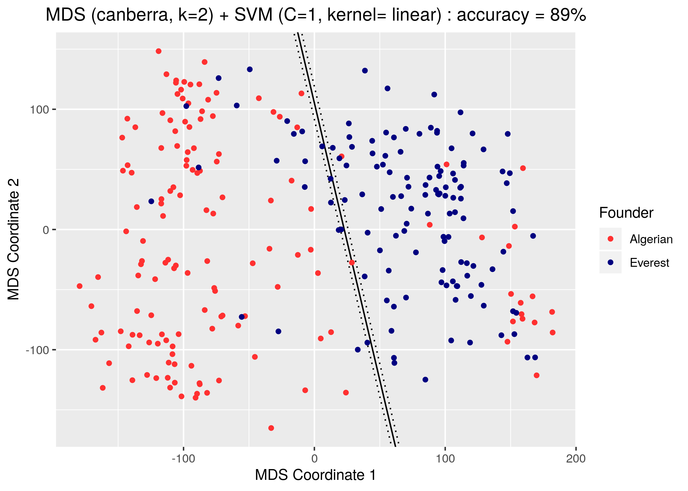

```{r setup, include=FALSE}
library(reticulate)
library(knitr)

# <!-- Copies an HTML dependency to a subdirectory of the given directory. The subdirectory name willbename-version(for example, "outputDir/jquery-1.11.0"). You may setoptions(htmltools.dir.version= FALSE)to suppress the version number in the subdirectory name. -->
options(htmltools.dir.version = FALSE)
knitr::opts_chunk$set(echo = FALSE)
knitr::opts_chunk$set(fig.align = 'center')
```

class: center

## Measuring plant **shape** with <br> Topological Data Analysis (TDA)

<div class="row" style="margin-top: -10px;">
  <div class="column" style="max-width:12%; font-size: 15px;">
    
    <p style="font-size: 25px; text-align: center; color: DarkRed;"> Data </p>
  </div>
  <div class="column" style="max-width:24%; padding: 0 0 0 25px; font-size: 15px;">
    
    <p style="font-size: 25px; text-align: center; color: DarkRed;"> Barley Scans </p>
  </div>
  <div class="column" style="max-width:37%; padding: 0 25px 0 25px; font-size: 15px;">
    
    <p style="font-size: 23px; text-align: center; color: DarkRed;"> Topological Summary </p>
  </div>
  <div class="column" style="max-width:27%; font-size: 15px;">
    
    
    <p style="font-size: 25px; text-align: center; color: DarkRed;"> Analysis </p>
  </div>
</div>

Erik Amézquita @ Comp Math, Science & Engineering, Michigan State University