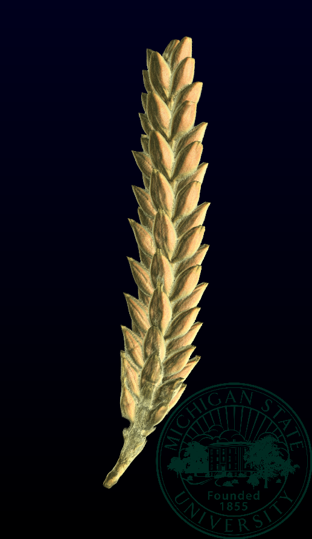

```{r setup, include=FALSE}
library(reticulate)
library(knitr)

# <!-- Copies an HTML dependency to a subdirectory of the given directory. The subdirectory name willbename-version(for example, "outputDir/jquery-1.11.0"). You may setoptions(htmltools.dir.version= FALSE)to suppress the version number in the subdirectory name. -->
options(htmltools.dir.version = FALSE)
knitr::opts_chunk$set(echo = FALSE)
knitr::opts_chunk$set(fig.align = 'center')
```
class: inverse

# Plant morphology

<div class="row">
  <div class="column" style="max-width:50%">
    <iframe width="375" height="210" src="https://www.youtube-nocookie.com/embed/oM9kAq0PBvw?controls=0" frameborder="0" allow="accelerometer; autoplay; encrypted-media; gyroscope; picture-in-picture" allowfullscreen></iframe>
    <iframe width="375" height="210" src="https://www.youtube-nocookie.com/embed/V39K58evWlU?controls=0" frameborder="0" allow="accelerometer; autoplay; encrypted-media; gyroscope; picture-in-picture" allowfullscreen></iframe>
  </div>
  <div class="column" style="max-width:50%">
    <iframe width="375" height="210" src="https://www.youtube-nocookie.com/embed/4GBgPIEDoa0?controls=0" frameborder="0" allow="accelerometer; autoplay; encrypted-media; gyroscope; picture-in-picture" allowfullscreen></iframe>
    <iframe width="375" height="210" src="https://www.youtube-nocookie.com/embed/qkOjHHuoUhA?controls=0" frameborder="0" allow="accelerometer; autoplay; encrypted-media; gyroscope; picture-in-picture" allowfullscreen></iframe>
  </div>
</div>

Grab the animated slides at [`bit.ly/shape_gac21`](https://www.egr.msu.edu/~amezqui3/barley/slides/gac2021_slides_dynamic.html)

---

# Topological Data Analysis

<div class="row">
  <div class="column" style="max-width:25%; font-size: 15px;">
    
    <p style="font-size: 25px; text-align: center; color: DarkRed;"> Raw Data </p>
    <ul>
      <li> X-ray CT </li>
      <li> Point clouds </li>
      <li> Time series </li>
    <ul>
  </div>
  <div class="column" style="max-width:40%; padding: 0 25px 0 25px; font-size: 15px;">
    
    <p style="font-size: 23px; text-align: center; color: DarkRed;"> Topological Summary </p>
    <ul>
      <li> Euler Characteristic </li>
      <li> Persistence diagrams </li>
      <li> Mapper/Reeb graphs </li>
    <ul>
  </div>
  <div class="column" style="max-width:35%; font-size: 15px;">
    
    <p style="font-size: 25px; text-align: center; color: DarkRed;"> Analysis </p>
    <ul>
      <li> Statistics </li>
      <li> Machine learning </li>
      <li> Classification/prediction </li>
    <ul>
  </div>
</div>

---

class: inverse

<div class="row">
  <div class="column" style="max-width:44%">
    <a href="https://kizilvest.ru/20150827-v-kizilskom-rajone-nachalas-uborochnaya-strada/" target="_blank"></a>
    <a href="https://ipad.fas.usda.gov/highlights/2008/11/eth_25nov2008/" target="_blank"></a>
    <a href="https://www.doi.org/10.1007/978-1-4419-0465-2_2168" target="_blank"></a>
  </div>
  <div class="column" style="max-width:44%">
    <a href="https://www.resilience.org/stories/2020-03-09/the-last-crop-before-the-desert/" target="_blank"></a>
    <a href="https://www.tibettravel.org/tibetan-culture/highland-barley.html" target="_blank"></a>
    <a href="https://www.nationalgeographic.co.uk/travel/2020/05/photo-story-from-barley-fields-to-whisky-barrels-in-rural-scotland" target="_blank"></a>
  </div>
  <div class="column" style="max-width:8%; font-size: 15px;">
    <p style="text-align: center; font-size: 30px; line-height: 1em;"> <strong> Barley across the world </strong></p>
    <p>Kiliskoye (Chelyabinsk, Russia)</p>
    <p>Marchouch (Rabat, Morocco)</p>
    <p>Aksum (Tigray, Ethiopia)</p>
    <p>Salar (Tsetang, Tibet)</p>
    <p>Expansion of the barley. </p>
    <p>Turriff (Aberdeenshire, Scotland)</p>
    <p style="font-size:9px;line-height: 1em;">Click on any picture for more details and credits</p>
  </div>
</div>

---

background-image: url("../figs/composite_cross_experiment.jpg")
background-size: 450px
background-position: 95% 90%

# Cross Composite II experiment

.pull-left[
- Cross all possilbe **28 parent** combinations (F1s)
- Self-fertilize the resulting 379 hybrids (F2s)
- Plant the progeny of hybrids in different plots and let nature do the rest
- Mostly self-fertilization was carried out throughout **58 generations**
- We have records of all plots throughout generations
    - Measure **morphology**
    - **DNA** sequencing
    - Which genes are selected for?
    - How did morphology change?
]

.pull-right[

]

---

background-image: url("../figs/barley_lab_composition.jpg")
background-size: 750px
background-position: 99% 99%

# Raw data: X-ray CT scans

.pull-left[
Voxel-based images

$\sim30\mu m$ resolution

Batch scans - 4 per tray

2Gb+ per raw scan
]

---

## Image processing &rarr; Traditional descriptors

.pull-left[
- Length
- Width
- Height
- Surface area
- Volume


]

.pull-right[


]

---

# Topology: The Euler characteristic $\chi$

$$\chi = \#(\text{Vertices}) - \#(\text{Edges}) + \#(\text{Faces}).$$
```{r, out.width=400}
knitr::include_graphics("../figs/euler_characteristic_2.png")
```

- Summarize **topological features** with the Euler-Poincaré formula

$$\chi = \#(\text{Connected Components}) - \#(\text{Loops}) + \#(\text{Voids}).$$


- The Euler characteristic is a **topological invariant**.

---

background-image: url("../figs/ect_filter_48.png")
background-size: 700px
background-position: 50% 90%

# Euler Characteristic Transform (ECT)

- Slice the seed along a chosen direction.


- Record how $\chi$ changes as we add slices.


- Repeat and concatenate for all possible directions.

---

# Why choose the ECT?


- Easy to compute: a quick alternating sum.


[**Theorem _(Turner, Mukherjee, Boyer 2014)_**](https://doi.org/10.1093/imaiai/iau011): 

- Given all the (infinite) ECCs corresponding to all possible directions, *different* simplicial complexes correspond to *different* ECTs.


- The ECT effectively summarizes all possible information related to shape.


```{r, out.width=400, out.height=5}
knitr::include_graphics("../figs/alleles.jpg")
```


.pull-left[
- We used 158 directions


- 8 thresholds per direction


- Every seed is associated a $158\times8=1264$-dimensional vector


- Reduce dimensions with nonlinear PCA
]

.pull-right[
```{r, out.width=300}
knitr::include_graphics('../figs/pole_directions_p7_m12_crop.jpg')
```

]

---

# Classification of 28 lines with SVM

<style type="text/css">
.tg  {border-collapse:collapse;border-color:#93a1a1;border-spacing:0;margin:0px auto;}
.tg td{background-color:#fdf6e3;border-bottom-width:1px;border-color:#93a1a1;border-style:solid;border-top-width:1px;
  border-width:0px;color:#002b36;font-family:Arial, sans-serif;font-size:14px;overflow:hidden;padding:10px 5px;
  word-break:normal;}
.tg th{background-color:#657b83;border-bottom-width:1px;border-color:#93a1a1;border-style:solid;border-top-width:1px;
  border-width:0px;color:#fdf6e3;font-family:Arial, sans-serif;font-size:14px;font-weight:normal;overflow:hidden;
  padding:10px 5px;word-break:normal;}
.tg .tg-2bhk{background-color:#eee8d5;border-color:inherit;text-align:left;vertical-align:top}
.tg .tg-0pky{border-color:inherit;text-align:left;vertical-align:top}
.tg .tg-gyvr{background-color:#eee8d5;border-color:inherit;font-size:100%;text-align:left;vertical-align:top}
</style>
<table class="tg">
<thead>
  <tr>
    <th class="tg-0pky">Shape descriptors</th>
    <th class="tg-0pky">No. of descriptors</th>
    <th class="tg-0pky">Classification accuracy</th>
  </tr>
</thead>
<tbody>
  <tr>
    <td class="tg-2bhk">Traditional</td>
    <td class="tg-2bhk">11</td>
    <td class="tg-2bhk">54.7% --- 57.1%</td>
  </tr>
  <tr>
    <td class="tg-0pky">Topological (ECT + KPCA)</td>
    <td class="tg-0pky">12</td>
    <td class="tg-0pky">53.9% --- 56.9%</td>
  </tr>
  <tr>
    <td class="tg-2bhk">Combined (Traditional + Topological)</td>
    <td class="tg-2bhk">23</td>
    <td class="tg-2bhk">70.0% --- 72.4%</td>
  </tr>
</tbody>
</table>

```{r, out.width=700}

```

---
class: right, bottom, inverse

background-image: url("../figs/acknowledgments.jpg")
background-size: 1000px
background-position: 50% 40%

Grab the animated slides at [`bit.ly/shape_gac21`](https://www.egr.msu.edu/~amezqui3/barley/slides/gac2021_slides_dynamic.html)
