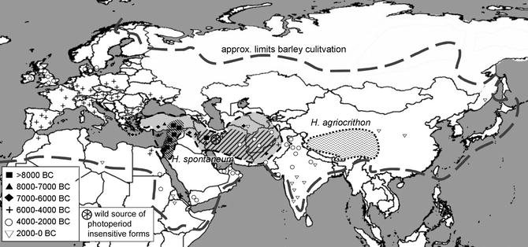
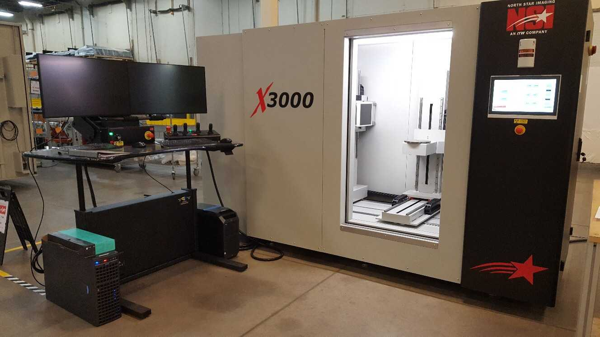

```{r setup, include=FALSE}
library(reticulate)
library(knitr)

# <!-- Copies an HTML dependency to a subdirectory of the given directory. The subdirectory name willbename-version(for example, "outputDir/jquery-1.11.0"). You may setoptions(htmltools.dir.version= FALSE)to suppress the version number in the subdirectory name. -->
options(htmltools.dir.version = FALSE)
knitr::opts_chunk$set(echo = FALSE)
knitr::opts_chunk$set(fig.align = 'center')
```

class: inverse

# Plant morphology

<div class="row">
  <div class="column" style="max-width:50%">
    <iframe width="375" height="210" src="https://www.youtube-nocookie.com/embed/oM9kAq0PBvw?controls=0" frameborder="0" allow="accelerometer; autoplay; encrypted-media; gyroscope; picture-in-picture" allowfullscreen></iframe>
    <iframe width="375" height="210" src="https://www.youtube-nocookie.com/embed/V39K58evWlU?controls=0" frameborder="0" allow="accelerometer; autoplay; encrypted-media; gyroscope; picture-in-picture" allowfullscreen></iframe>
  </div>
  <div class="column" style="max-width:50%">
    <iframe width="375" height="210" src="https://www.youtube-nocookie.com/embed/4GBgPIEDoa0?controls=0" frameborder="0" allow="accelerometer; autoplay; encrypted-media; gyroscope; picture-in-picture" allowfullscreen></iframe>
    <iframe width="375" height="210" src="https://www.youtube-nocookie.com/embed/qkOjHHuoUhA?controls=0" frameborder="0" allow="accelerometer; autoplay; encrypted-media; gyroscope; picture-in-picture" allowfullscreen></iframe>
  </div>
</div>

---

# Topological Data Analysis (TDA)

<div class="row">
  <div class="column" style="max-width:25%; font-size: 15px;">
    
    <p style="font-size: 25px; text-align: center; color: DarkRed;"> Raw Data </p>
    <ul>
      <li> X-ray CT </li>
      <li> Point clouds </li>
      <li> Time series </li>
    <ul>
  </div>
</div>

---

# Topological Data Analysis (TDA)

<div class="row">
  <div class="column" style="max-width:25%; font-size: 15px;">
    
    <p style="font-size: 25px; text-align: center; color: DarkRed;"> Raw Data </p>
    <ul>
      <li> X-ray CT </li>
      <li> Point clouds </li>
      <li> Time series </li>
    <ul>
  </div>
  <div class="column" style="max-width:40%; padding: 0 25px 0 25px; font-size: 15px;">
    
    <p style="font-size: 23px; text-align: center; color: DarkRed;"> Topological Summary </p>
    <ul>
      <li> Euler Characteristic </li>
      <li> Persistence diagrams </li>
      <li> Mapper/Reeb graphs </li>
    <ul>
  </div>
</div>

---

# Topological Data Analysis (TDA)

<div class="row">
  <div class="column" style="max-width:25%; font-size: 15px;">
    
    <p style="font-size: 25px; text-align: center; color: DarkRed;"> Raw Data </p>
    <ul>
      <li> X-ray CT </li>
      <li> Point clouds </li>
      <li> Time series </li>
    <ul>
  </div>
  <div class="column" style="max-width:40%; padding: 0 25px 0 25px; font-size: 15px;">
    
    <p style="font-size: 23px; text-align: center; color: DarkRed;"> Topological Summary </p>
    <ul>
      <li> Euler Characteristic </li>
      <li> Persistence diagrams </li>
      <li> Mapper/Reeb graphs </li>
    <ul>
  </div>
  <div class="column" style="max-width:35%; font-size: 15px;">
    
    <p style="font-size: 25px; text-align: center; color: DarkRed;"> Analysis </p>
    <ul>
      <li> Statistics </li>
      <li> Machine learning </li>
      <li> Classification/prediction </li>
    <ul>
  </div>
</div>

---

class: inverse

<div class="row">
  <div class="column" style="max-width:44%">
    <a href="https://kizilvest.ru/20150827-v-kizilskom-rajone-nachalas-uborochnaya-strada/" target="_blank"></a>
    <a href="https://ipad.fas.usda.gov/highlights/2008/11/eth_25nov2008/" target="_blank"></a>
    <a href="https://www.doi.org/10.1007/978-1-4419-0465-2_2168" target="_blank"></a>
  </div>
  <div class="column" style="max-width:44%">
    <a href="https://www.resilience.org/stories/2020-03-09/the-last-crop-before-the-desert/" target="_blank"></a>
    <a href="https://www.tibettravel.org/tibetan-culture/highland-barley.html" target="_blank"></a>
    <a href="https://www.nationalgeographic.co.uk/travel/2020/05/photo-story-from-barley-fields-to-whisky-barrels-in-rural-scotland" target="_blank"></a>
  </div>
  <div class="column" style="max-width:8%; font-size: 15px;">
    <p style="text-align: center; font-size: 30px; line-height: 1em;"> <strong> Barley across the world </strong></p>
    <p>Kiliskoye (Chelyabinsk, Russia)</p>
    <p>Marchouch (Rabat, Morocco)</p>
    <p>Aksum (Tigray, Ethiopia)</p>
    <p>Salar (Tsetang, Tibet)</p>
    <p>Expansion of the barley. </p>
    <p>Turriff (Aberdeenshire, Scotland)</p>
    <p style="font-size:9px;line-height: 1em;">Click on any picture for more details and credits</p>
  </div>
</div>

---

# The Euler Characteristic Transform FTW!

<div class="row">
  <div class="column" style="max-width:51%; color: Navy; font-size: 15px;">
    
    <p style="text-align: center;"> Proprietary X-Ray CT scan reconstruction </p>
  </div>
</div>

---

# The Euler Characteristic Transform FTW!

<div class="row">
  <div class="column" style="max-width:51%; color: Navy; font-size: 15px;">
    
    <p style="text-align: center;"> Proprietary X-Ray CT scan reconstruction </p>
  </div>
  <div class="column" style="max-width:17.5%; color: Navy; font-size: 15px;">
    
    <p style="text-align: center;"> 975 spikes </p>
  </div>
</div>

---

# The Euler Characteristic Transform FTW!

<div class="row">
  <div class="column" style="max-width:51%; color: Navy; font-size: 15px;">
    
    <p style="text-align: center;"> Proprietary X-Ray CT scan reconstruction </p>
  </div>
  <div class="column" style="max-width:17.5%; color: Navy; font-size: 15px;">
    
    <p style="text-align: center;"> 975 spikes </p>
  </div>
  <div class="column" style="max-width:20.5%; color: Navy; font-size: 15px;">
    
    <p style="text-align: center;"> 38,000 seeds </p>
  </div>
</div>

---

# The Euler Characteristic Transform FTW!

<div class="row">
  <div class="column" style="max-width:51%; color: Navy; font-size: 15px;">
    
    <p style="text-align: center;"> Proprietary X-Ray CT scan reconstruction </p>
  </div>
  <div class="column" style="max-width:17.5%; color: Navy; font-size: 15px;">
    
    <p style="text-align: center;"> 975 spikes </p>
  </div>
  <div class="column" style="max-width:20.5%; color: Navy; font-size: 15px;">
    
    <p style="text-align: center;"> 38,000 seeds </p>
  </div>
</div>

<div class="row">
  <div class="column" style="max-width:65%; color: Navy; font-size: 15px;">
    
    <p style="text-align: center;"> The ECT to summarize all the seed morphology  </p>
  </div>
</div>

---

# The Euler Characteristic Transform FTW!

<div class="row">
  <div class="column" style="max-width:51%; color: Navy; font-size: 15px;">
    
    <p style="text-align: center;"> Proprietary X-Ray CT scan reconstruction </p>
  </div>
  <div class="column" style="max-width:17.5%; color: Navy; font-size: 15px;">
    
    <p style="text-align: center;"> 975 spikes </p>
  </div>
  <div class="column" style="max-width:20.5%; color: Navy; font-size: 15px;">
    
    <p style="text-align: center;"> 38,000 seeds </p>
  </div>
</div>

<div class="row">
  <div class="column" style="max-width:65%; color: Navy; font-size: 15px;">
    
    <p style="text-align: center;"> The ECT to summarize all the seed morphology </p>
  </div>
  <div class="column" style="max-width:35%; color: Navy; font-size: 15px;">
    
    <p style="text-align: center;"> SVM classification results based on seed morphology alone for 28 different barley varieties.</p>
  </div>
</div>

---
class: right, bottom, inverse

background-image: url("../figs/acknowledgments.jpg")
background-size: 1000px
background-position: 50% 40%

Grab these slides at [`bit.ly/eccb21_barley`](http://bit.ly/eccb21_barley)
