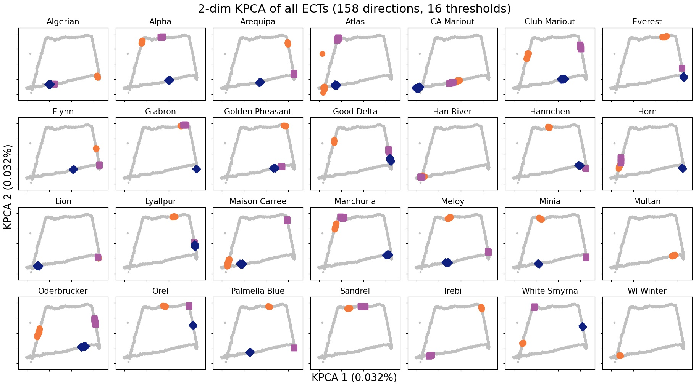
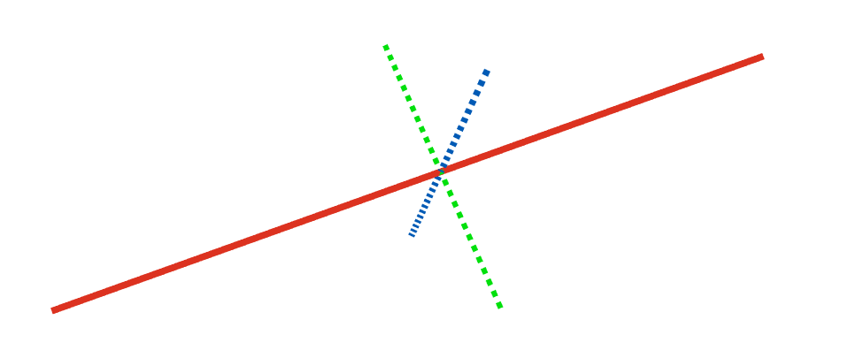
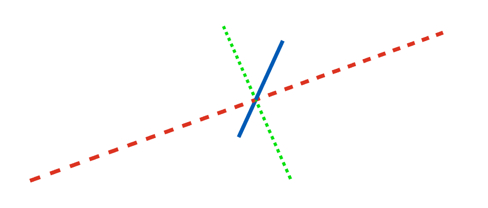
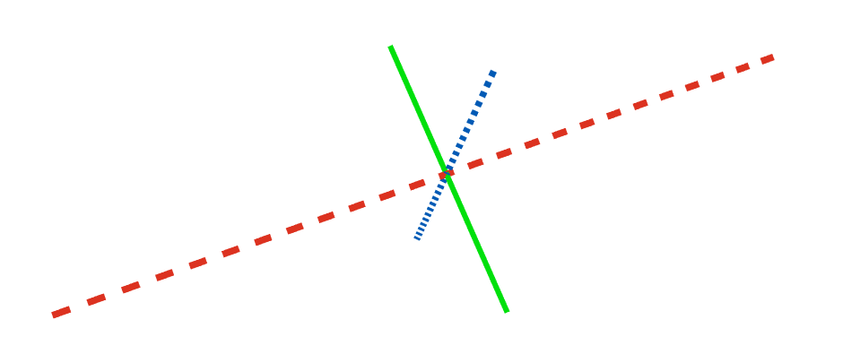

```{r setup, include=FALSE}
library(reticulate)
library(knitr)

options(htmltools.dir.version = FALSE)
knitr::opts_chunk$set(echo = FALSE)
knitr::opts_chunk$set(fig.align = 'center')
```

background-image: url("../../img/endlessforms.png")
background-size: 150px
background-position: 89% 7%

class: inverse

# Plant morphology

<div class="row">
  <div class="column" style="max-width:50%">
    <iframe width="375" height="210" src="https://www.youtube-nocookie.com/embed/oM9kAq0PBvw?controls=0" frameborder="0" allow="accelerometer; autoplay; encrypted-media; gyroscope; picture-in-picture" allowfullscreen></iframe>
    <iframe width="375" height="210" src="https://www.youtube-nocookie.com/embed/V39K58evWlU?controls=0" frameborder="0" allow="accelerometer; autoplay; encrypted-media; gyroscope; picture-in-picture" allowfullscreen></iframe>
  </div>
  <div class="column" style="max-width:50%">
    <iframe width="375" height="210" src="https://www.youtube-nocookie.com/embed/4GBgPIEDoa0?controls=0" frameborder="0" allow="accelerometer; autoplay; encrypted-media; gyroscope; picture-in-picture" allowfullscreen></iframe>
    <iframe width="375" height="210" src="https://www.youtube-nocookie.com/embed/qkOjHHuoUhA?controls=0" frameborder="0" allow="accelerometer; autoplay; encrypted-media; gyroscope; picture-in-picture" allowfullscreen></iframe>
  </div>
</div>

<p style="font-size: 24px; text-align: right; font-family: 'Yanone Kaffeesatz'">Check out more 3D X-ray CT scans at <a href="https://www.youtube.com/@endlessforms6756">youtube.com/@endlessforms6756</a></p>

---

# Traditional Morphometry

```{r, out.width=650}
knitr::include_graphics('https://nph.onlinelibrary.wiley.com/cms/asset/e0e8b362-efee-410a-a293-947c2d57acb9/nph16286-fig-0003-m.jpg')
```
<p style="font-size: 10px; text-align: right; color: Grey;"> Credits: <a href=" https://doi.org/10.1111/nph.16286">Gupta <em>et al.</em> (2019)</a></p>

---

# Modern Morphometric Methods might not be enough

.pull-left[
Elliptical Fourier Descriptor (EFD)

<p style="font-size: 10px; text-align: right; color: Grey;"> Credits: <a href="https://doi.org/10.1016/j.cub.2016.02.033">Chitwood and Sinha (2016)</a></p>
]

.pull-right[
Landmark-based morphometrics (GMM)

<p style="font-size: 10px; text-align: right; color: Grey;"> Credits: <a href=" https://doi.org/10.1002/ppp3.10157">Chitwood  (2020)</a></p>
]

---

background-image: url("../../img/endlessforms.png")
background-size: 150px
background-position: 89% 7%

class: inverse

# Something more robust is needed

<div class="row">
  <div class="column" style="max-width:50%">
    <iframe width="375" height="210" src="https://www.youtube-nocookie.com/embed/j0R9mMs5E50?controls=0" title="YouTube video player" frameborder="0" allow="accelerometer; autoplay; clipboard-write; encrypted-media; gyroscope; picture-in-picture" allowfullscreen></iframe>
    <iframe width="375" height="210" src="https://www.youtube-nocookie.com/embed/2FmwkEA3tsY?controls=0" title="YouTube video player" frameborder="0" allow="accelerometer; autoplay; clipboard-write; encrypted-media; gyroscope; picture-in-picture" allowfullscreen></iframe>
  </div>
  <div class="column" style="max-width:50%">
    <iframe width="375" height="210" src="https://www.youtube-nocookie.com/embed/vxcSZsCs5BU?controls=0" title="YouTube video player" frameborder="0" allow="accelerometer; autoplay; clipboard-write; encrypted-media; gyroscope; picture-in-picture" allowfullscreen></iframe>
    <iframe width="375" height="210" src="https://www.youtube-nocookie.com/embed/KXt-C-_OA3o?controls=0" title="YouTube video player" frameborder="0" allow="accelerometer; autoplay; clipboard-write; encrypted-media; gyroscope; picture-in-picture" allowfullscreen></iframe>
  </div>
</div>

---

# Topological Data Analysis (TDA)

<div class="row">
  <div class="column" style="max-width:25%; font-size: 15px;">
    
    <p style="font-size: 25px; text-align: center; color: DarkRed;"> Raw Data </p>
    <ul>
      <li> X-ray CT </li>
      <li> Point clouds </li>
      <li> Time series </li>
    <ul>
  </div>
  <div class="column" style="max-width:40%; padding: 0 25px 0 25px; font-size: 15px;">
    
    <p style="font-size: 23px; text-align: center; color: DarkRed;"> Topological Summary </p>
    <ul>
      <li> Euler Characteristic </li>
      <li> Persistence diagrams </li>
      <li> Mapper/Reeb graphs </li>
    <ul>
  </div>
  <div class="column" style="max-width:35%; font-size: 15px;">
    
    <p style="font-size: 25px; text-align: center; color: DarkRed;"> Analysis </p>
    <ul>
      <li> Statistics </li>
      <li> Machine learning </li>
      <li> Classification/prediction </li>
    <ul>
  </div>
</div>

---

background-image: url("../figs/seed.png")
background-size: 325px
background-position: 99% 99%

# Roadmap for today

### Split into modules

1. The Euler Characteristic Transform

1. Quantifying barley morphology using TDA

1. Current work on modeling citrus and arabidopsis

---

class: inverse, middle, center

# 1. Foucusing on the Euler Characteristic

## The Euler Characteristic Transform (ECT)

---

# Topology: The Euler characteristic

$$\chi = \#(\text{Vertices}) - \#(\text{Edges}) + \#(\text{Faces}).$$
```{r, out.width=400}
knitr::include_graphics("../../tda/figs/euler_characteristic_2.png")
```

--

- Summarize **topological features** with the Euler-Poincaré formula

$$\chi = \#(\text{Connected Components}) - \#(\text{Loops}) + \#(\text{Voids}).$$

--

- The Euler characteristic is a **topological invariant**.

---

# Euler Characteristic Curve (ECC)

- Consider a cubical complex $X\subset\mathbb{R}^d$


- And a unit-length direction $\nu\in S^{d-1}$

- And the subcomplex containing all cubical cells below height $h$ in the direction $\nu$
$$X(\nu)_h =\{\Delta \in X\::\:\langle x,\nu\rangle\leq h\text{ for all }x\in\Delta\}$$

- The Euler Characteristic Curve (ECC) of direction $\nu$ is defined as the sequence $$\{\chi(X(\nu)_h)\}_{h\in\mathbb{R}}$$

---

background-image: url("../figs/ecc_ver2.gif")
background-size: 750px
background-position: 50% 90%

# Euler Characteristic Curve (ECC)

- Consider a cubical complex $X\subset\mathbb{R}^d$
- And a unit-length direction $\nu\in S^{d-1}$

- And the subcomplex containing all cubical cells below height $h$ in the direction $\nu$
$$X(\nu)_h =\{\Delta \in X\::\:\langle x,\nu\rangle\leq h\text{ for all }x\in\Delta\}$$

- The Euler Characteristic Curve (ECC) of direction $\nu$ is defined as the sequence $$\{\chi(X(\nu)_h)\}_{h\in\mathbb{R}}$$
---

background-image: url("../figs/ect_ver2.gif")
background-size: 800px
background-position: 50% 88%

## Euler Characteristic Transform (ECT)

- Repeat and concatenate for all possible directions.

$$
\begin{split}
ECT(X):\; & S^{d-1} \to \mathbb{Z}^{\mathbb{R}}\\
&\nu\mapsto\{\chi(X(\nu)_h)\}_{h\in\mathbb{R}}.
\end{split}
$$

- [**Theorem** (Turner, Mukherjee, Boyer 2014) & (Curry, Mukherjee, Turner, 2018)](http://arxiv.org/abs/1805.09782):  The ECT is injective with a finite bound of necessary directions.

---

# More on the ECT

- Easy to compute: a quick alternating sum.

[**Theorem _(Turner, Mukherjee, Boyer 2014)_**](https://doi.org/10.1093/imaiai/iau011): The ECT is injective for finite simplicial complexes in 3D.

[**Theorem _(ibid)_**](https://arxiv.org/abs/1310.1030): The ECT is a sufficient statistic for finite simplicial complexes in 3D.

*Translation:* 

- Given all the (infinite) ECCs corresponding to all possible directions,

- *Different* simplicial complexes correspond to *different* ECTs.

- The ECT effectively summarizes all possible information related to shape.


There is elusive math research on computationally efficient reconstruction algorithms:
- [Turner, Mukherjee, Curry (2021)](https://arxiv.org/abs/1805.09782): Finite no. of directions
- [Betthauser (2018)](https://people.clas.ufl.edu/peterbubenik/files/Betthauser_Thesis.pdf): 2D reconstruction
- [Fasy, Micka, Millman, Schenfisch, Williams (2022)](https://arxiv.org/abs/1912.12759): 3D reconstruction

Alternative takes:
- [Crawford, Monod, Chen, Mukherjee, Rabadan (2020)](https://doi.org/10.1080/01621459.2019.1671198): Smooth ECT
- [Jiang, Kurtek, Needham (2020)](https://openaccess.thecvf.com/content_CVPRW_2020/papers/w50/Jiang_The_Weighted_Euler_Curve_Transform_for_Shape_and_Image_Analysis_CVPRW_2020_paper.pdf): Weighted ECT


---

class: inverse, middle, center

# 2. Quantifying barley morphology

## Using the Euler Characteristic Transform

---

class: inverse

<div class="row">
  <div class="column" style="max-width:44%">
    <a href="https://kizilvest.ru/20150827-v-kizilskom-rajone-nachalas-uborochnaya-strada/" target="_blank"></a>
    <a href="https://ipad.fas.usda.gov/highlights/2008/11/eth_25nov2008/" target="_blank"></a>
    <a href="https://www.doi.org/10.1007/978-1-4419-0465-2_2168" target="_blank"></a>
  </div>
  <div class="column" style="max-width:44%">
    <a href="https://www.resilience.org/stories/2020-03-09/the-last-crop-before-the-desert/" target="_blank"></a>
    <a href="https://www.tibettravel.org/tibetan-culture/highland-barley.html" target="_blank"></a>
    <a href="https://www.nationalgeographic.co.uk/travel/2020/05/photo-story-from-barley-fields-to-whisky-barrels-in-rural-scotland" target="_blank"></a>
  </div>
  <div class="column" style="max-width:8%; font-size: 15px;">
    <p style="text-align: center; font-size: 30px; line-height: 1em;"> <strong> Barley across the world </strong></p>
    <p>Kiliskoye (Chelyabinsk, Russia)</p>
    <p>Marchouch (Rabat, Morocco)</p>
    <p>Aksum (Tigray, Ethiopia)</p>
    <p>Salar (Tsetang, Tibet)</p>
    <p>Expansion of the barley. </p>
    <p>Turriff (Aberdeenshire, Scotland)</p>
    <p style="font-size:9px;line-height: 1em;">Click on any picture for more details and credits</p>
  </div>
</div>

---

background-image: url("../figs/composite_cross_v_02.png")
background-size: 425px
background-position: 95% 90%

# Cross Composite II experiment

.pull-left[


- **28 parents/accessions** $(F_0)$

- Do ${28 \choose 2}$ **hybrids** $(F_1)$

]

.pull-right[

]

---

background-image: url("../figs/composite_cross_v_05.png")
background-size: 425px
background-position: 95% 90%

# Cross Composite II experiment

.pull-left[


- **28 parents/accessions** $(F_0)$

- Do ${28 \choose 2}$ **hybrids** $(F_1)$

- **Self-fertilize** the resulting 379 hybrids

- Each line grows in a different part of an open field **for 58 generations**
]

.pull-right[

]

---

# Raw Data: X-rays &rarr; Image Processing

<div class="row">
  <div class="column" style="max-width:51%; color: Navy; font-size: 15px;">
    
    <p style="text-align: center;"> Proprietary X-Ray CT scan reconstruction </p>
  </div>
  <div class="column" style="max-width:17.5%; color: Navy; font-size: 15px;">
    
    <p style="text-align: center;"> 975 spikes </p>
  </div>
  <div class="column" style="max-width:20.5%; color: Navy; font-size: 15px;">
    
    <p style="text-align: center;"> 38,000 seeds </p>
  </div>
</div>

--

<div class="row">
  <div class="column" style="max-width:35%; color: Navy; font-size: 15px;">
    
    <p style="text-align: center;"> Align all the seeds </p>
  </div>
  <div class="column" style="max-width:55%; color: Navy; font-size: 15px;">
    <div class="row">
      <div class="column" style="max-width:24%; color: Navy; font-size: 15px;">
        
      </div>
      <div class="column" style="max-width:24%; color: Navy; font-size: 15px;">
        
      </div>
      <div class="column" style="max-width:24%; color: Navy; font-size: 15px;">
        
      </div>
      <div class="column" style="max-width:24%; color: Navy; font-size: 15px;">
        
      </div>
    </div>
    <p style="text-align: center;"> Remove outliers </p>
  </div>
</div>

---

# Traditional shape descriptors

<div class="row">
  <div class="column" style="max-width:55%">
    
    
  </div>
  <div class="column" style="max-width:45%">
    
    
    
  </div>
</div>

---

background-image: url("../figs/S012_L2_Blue_33.png")
background-size: 150px
background-position: 99% 50%

# Game plan

- **Goal:** Classify 28 barley parental accessions using solely grain morphology information.

- **3121** grains in total

--

.pull-left[
```{r, out.width=150}
knitr::include_graphics('../figs/pole_directions_p7_m12_crop.jpg')
```
]

.pull-right[
- 158 directions
- 16 thresholds per direction
- Every seed is associated a $158\times16=2528$-dim vector
- Dimensions reduced with UMAP
]

--

- Compare **3** sets of morphological descriptors

Descriptor | No. of descriptors
-----------|--------------------
Traditional | 11
Topological (ECT &rarr; UMAP) | ~~2528~~ &rarr; 12
Combined (Trad &oplus; Topo) | 23

--

- Sample randomly 75/25 training/testing sample for each accession.

- Repeat the sampling and SVM computation 100 times and consider the average.

---

# Classification of 28 lines with SVM

<style type="text/css">
.tg  {border-collapse:collapse;border-color:#93a1a1;border-spacing:0;margin:0px auto;}
.tg td{background-color:#fdf6e3;border-bottom-width:1px;border-color:#93a1a1;border-style:solid;border-top-width:1px;
  border-width:0px;color:#002b36;font-family:Arial, sans-serif;font-size:14px;overflow:hidden;padding:10px 5px;
  word-break:normal;}
.tg th{background-color:#657b83;border-bottom-width:1px;border-color:#93a1a1;border-style:solid;border-top-width:1px;
  border-width:0px;color:#fdf6e3;font-family:Arial, sans-serif;font-size:14px;font-weight:normal;overflow:hidden;
  padding:10px 5px;word-break:normal;}
.tg .tg-2bhk{background-color:#eee8d5;border-color:inherit;text-align:left;vertical-align:top}
.tg .tg-0pky{border-color:inherit;text-align:left;vertical-align:top}
.tg .tg-gyvr{background-color:#eee8d5;border-color:inherit;font-size:100%;text-align:left;vertical-align:top}
</style>
<table class="tg">
<thead>
  <tr>
    <th class="tg-0pky">Shape descriptors</th>
    <th class="tg-0pky">No. of descriptors</th>
    <th class="tg-0pky">F1</th>
  </tr>
</thead>
<tbody>
  <tr>
    <td class="tg-2bhk">Traditional</td>
    <td class="tg-2bhk">11</td>
    <td class="tg-2bhk">0.55 &plusmn; 0.019</td>
  </tr>
  <tr>
    <td class="tg-0pky">Topological + UMAP</td>
    <td class="tg-0pky">12</td>
    <td class="tg-0pky">0.74 &plusmn; 0.016</td>
  </tr>
  <tr>
    <td class="tg-2bhk">Combined</td>
    <td class="tg-2bhk">23</td>
    <td class="tg-2bhk">0.86 &plusmn; 0.010</td>
  </tr>
</tbody>
</table>

```{r, out.width=700}
knitr::include_graphics('../figs/avg_f1_combined_158_16_12_umap_horz.png')
```

---

# Traditional shape descriptors


---

# Topological shape descriptors + UMAP


---

# Topological shape descriptors + KPCA



---

# Hidden topological shape information

.pull-left[
- Analysis of variance to determine the most discerning directions and slices/thresholds.

- The top crease on the seed is highly descriptive!

```{r, out.width=300}
knitr::include_graphics(c('../figs/kruskal_wallis_topo_summary.jpg'))
```
]

--

.pull-right[
```{r, out.width=225}
knitr::include_graphics(c('../figs/discerning_directions.png'))#, '../figs/arrow_seed_09_0.gif'))
```


]

---

# Into semi-supervised territory

- Train an SVM with 100% of the founders $(F_0)$

- Classify the progeny $F_{58}$: DNA (genotype) &harr; shape (phenotype) enrichment

.pull-left[

]

.pull-right[

]

---

class: center, inverse, middle

# 3. But wait, there is more!

## If life gives you lemons, make salad with the plant guinea pig

---

## Raw Data: X-rays &rarr; Image Processing

<div class="row">
  <div class="column" style="max-width:38%; color: Navy; font-size: 15px;">
    
    <p style="text-align: center;"> UCR Collaboration </p>
  </div>
  <div class="column" style="max-width:38%; color: Navy; font-size: 15px;">
    
    <p style="text-align: center;"> 3D X-Ray CT scan </p>
  </div>
  <div class="column" style="max-width:23%; color: Navy; font-size: 15px;">
    
    <p style="text-align: center;"> Raw </p>
  </div>
</div>

--

<div class="row" style="margin: 0 auto;">
  <div class="column" style="max-width:20%; color: Navy; font-size: 15px;">
    
    <p style="text-align: center;"> Spine </p>
  </div>
  <div class="column" style="max-width:20%; color: Navy; font-size: 15px;">
    
    <p style="text-align: center;"> Endocarp </p>
  </div>
  <div class="column" style="max-width:20%; color: Navy; font-size: 15px;">
    
    <p style="text-align: center;"> Rind </p>
  </div>
  <div class="column" style="max-width:20%; color: Navy; font-size: 15px;">
    
    <p style="text-align: center;"> Exocarp </p>
  </div>
  <div class="column" style="max-width:20%; color: Navy; font-size: 15px;">
    
    <p style="text-align: center;"> Oil glands</p>
  </div>
</div>

---

### Understanding the distribution of oil glands in citrus fruits

.pull-left[

- About 6K&rarr;20K individual oil glands detected

- Number in the right ballpark

- **We have a point cloud in $\mathbb{R}^3$.**

- Key to understand fruit development in citrus
]

.pull-right[

<p style="font-size: 8px; text-align: right; color: Grey;"> Credits: <a href="https://www.boredpanda.com/life-cycles-pics/">BoredPanda</a></p>

- Huge perfume and food industry behind essential oils

]

---

### Grand challenge: genotype (DNA) &harr; phenotype (shape)

Leaf development in Arabidopsis: the guinea pig of plant biology

.pull-left[
```{r, out.width=225}
knitr::include_graphics(c('../../arabidopsis/figs/Day7_110921_Col_0_X_pot3_leaf_X.gif',
                          '../../arabidopsis/figs/Day7_110921_U112-3_pot0_leaf_X.gif'))
```
]

.pull-right[



]

---

background-image: url("../../cmse/figs/institutional_logos.jpg")
background-size: 500px
background-position: 95% 1%

class: inverse

## Thank you!

<div class="row" style="margin-top: -25px;">
  <div class="column" style="max-width:19.5%; font-size: 13px;">
    
    <p style="text-align: center; color: White">Elizabeth Munch<br>(MSU)</p>
    
    <p style="text-align: center; color: White">Tim Ophelders<br>(Utrecht)</p>
    
  </div>
  <div class="column" style="max-width:19.5%; font-size: 13px;">
    
    <p style="text-align: center; color: White">Dan Chitwood<br>(MSU)</p>
    
    <p style="text-align: center; color: White">Michelle Quigley<br>(MSU)</p>
    
    <p style="text-align: center; color: White">Jacob Landis<br>(Cornell)</p>
  </div>
  <div class="column" style="max-width:14%; font-size: 13px;">
  
  <p style="text-align: center; color: White">Dan Koenig<br>(UC Riverside)</p>
  
  <p style="text-align: center; color: White">Danelle Seymour<br>(UC Riverside)</p>
  
  </div>
  <div class="column" style="width:10%; font-size: 24px;">
  </div>
  <div class="column" style="max-width:30%; font-size: 24px; line-height:1.25; padding: 0 0 0 0;">
  <p style="text-align: center; color: White"><strong>Email</strong></p>
  <p style="text-align: center; color: Yellow">amezqui3@msu.edu</p>
  <p style="text-align: center; color: White"><strong>Website/slides</strong></p>
  <p style="text-align: center; color: Yellow"><a href="https://egr.msu.edu/~amezqui3/aboutme.html" target="_blank">egr.msu.edu/~amezqui3</a></p>
  <p style="text-align: center; color: White"><strong>References</strong></p>
  <p style="font-size: 15px; color: Yellow; line-height:1.1; font-family: 'Yanone Kaffeesatz'">
  <strong>E.J. Amézquita</strong>, M.Y. Quigley, T. Ophelders, J.B. Landis, D. Koenig, E. Munch, D.H. Chitwood (2022) <a href="https://doi.org/10.1093/insilicoplants/diab033" target="_blank">Measuring hidden phenotype: Quantifying the shape of barley seeds using the Euler Characteristic Transform"</a>. <em>in Silico Plants</em> 4(1); diab033
  </p>
  <p style="font-size: 15px; color: Yellow; line-height:1.1; font-family: 'Yanone Kaffeesatz'">
  <strong>E.J. Amézquita</strong>, M.Y. Quigley, T. Ophelders, D. Seymour, E. Munch, D.H. Chitwood <a href="" target="_blank">The shape of aroma: measuring and modeling citrus oil gland distribution"</a>. In preparation. 
  </p>
  <p style="font-size: 15px; color: Yellow; line-height:1.1; font-family: 'Yanone Kaffeesatz'">
      K. Turner, S. Mukherjee, D.M. Boyer (2014) <a href="https://doi.org/10.1093/imaiai/iau011" target="_blank">"Persistent homology transform for modeling shapes and surfaces,"</a> <em>Information and Inference</em>, 3(4) 310–344
  </p>
  <p style="text-align: center; color: White; font-size:10px; line-height:1.1">Slides made in xaringan and rmarkdown</p>
  
  </div>
</div>
