```{r setup, include=FALSE}
library(reticulate)
library(knitr)

# <!-- Copies an HTML dependency to a subdirectory of the given directory. The subdirectory name willbename-version(for example, "outputDir/jquery-1.11.0"). You may setoptions(htmltools.dir.version= FALSE)to suppress the version number in the subdirectory name. -->
options(htmltools.dir.version = FALSE)
knitr::opts_chunk$set(echo = FALSE)
knitr::opts_chunk$set(fig.align = 'center')
```
class: inverse

# Plant morphology

<div class="row">
  <div class="column" style="max-width:50%">
    <iframe width="375" height="210" src="https://www.youtube-nocookie.com/embed/oM9kAq0PBvw?controls=0" frameborder="0" allow="accelerometer; autoplay; encrypted-media; gyroscope; picture-in-picture" allowfullscreen></iframe>
    <iframe width="375" height="210" src="https://www.youtube-nocookie.com/embed/V39K58evWlU?controls=0" frameborder="0" allow="accelerometer; autoplay; encrypted-media; gyroscope; picture-in-picture" allowfullscreen></iframe>
  </div>
  <div class="column" style="max-width:50%">
    <iframe width="375" height="210" src="https://www.youtube-nocookie.com/embed/4GBgPIEDoa0?controls=0" frameborder="0" allow="accelerometer; autoplay; encrypted-media; gyroscope; picture-in-picture" allowfullscreen></iframe>
    <iframe width="375" height="210" src="https://www.youtube-nocookie.com/embed/qkOjHHuoUhA?controls=0" frameborder="0" allow="accelerometer; autoplay; encrypted-media; gyroscope; picture-in-picture" allowfullscreen></iframe>
  </div>
</div>

---

# Topological Data Analysis (TDA)

<div class="row">
  <div class="column" style="max-width:25%; font-size: 15px;">
    
    <p style="font-size: 25px; text-align: center; color: DarkRed;"> Raw Data </p>
    <ul>
      <li> X-ray CT </li>
      <li> Point clouds </li>
      <li> Time series </li>
    <ul>
  </div>
  <div class="column" style="max-width:40%; padding: 0 25px 0 25px; font-size: 15px;">
    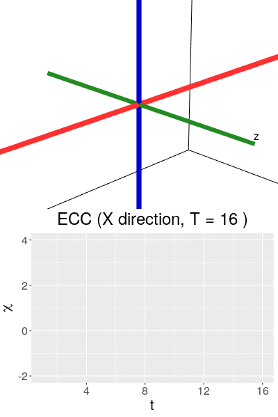
    <p style="font-size: 23px; text-align: center; color: DarkRed;"> Topological Summary </p>
    <ul>
      <li> Euler Characteristic </li>
      <li> Persistence diagrams </li>
      <li> Mapper/Reeb graphs </li>
    <ul>
  </div>
  <div class="column" style="max-width:35%; font-size: 15px;">
    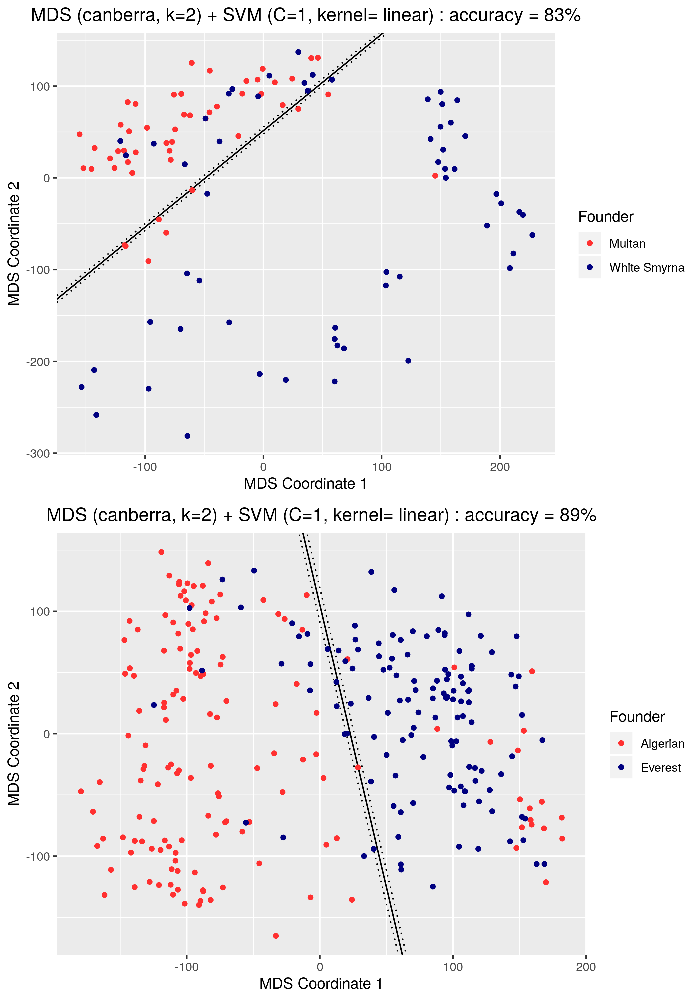
    <p style="font-size: 25px; text-align: center; color: DarkRed;"> Analysis </p>
    <ul>
      <li> Statistics </li>
      <li> Machine learning </li>
      <li> Classification/prediction </li>
    <ul>
  </div>
</div>

---

background-image: url("../../cmse/figs/cmse logo file-01.svg")
background-size: 150px
background-position: 5% 60%

class: center

# My research: Crossing and merging bridges

<div class="row">
  <div class="column" style="width:15%">
  </div>
  <div class="column" style="max-width:19%">
    <a href="https://doi.org/10.1093/insilicoplants/diab033" target="_blank"></a>
  </div>
  <div class="column" style="max-width:25%">
    
  </div>
  <div class="column" style="max-width:32%">
    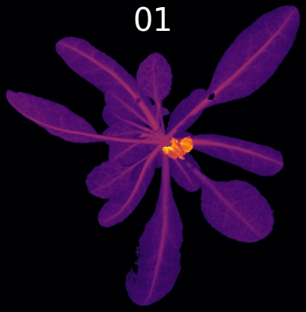
  </div>
</div>

<div class="row">
  <div class="column" style="width:15%">
  </div>
  <div class="column" style="max-width:45%">
    <a href="https://github.com/amezqui3/demeter" target="_blank">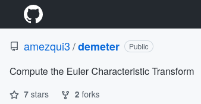</a>
  </div>
  <div class="column" style="max-width:28%">
    <!---
    <a href="https://plantsandpython.github.io/PlantsAndPython/00_Opening_page.html" target="_blank"></a>
    --->
    <a href="https://plantsandpython.github.io/PlantsAndPython/00_Opening_page.html" target="_blank">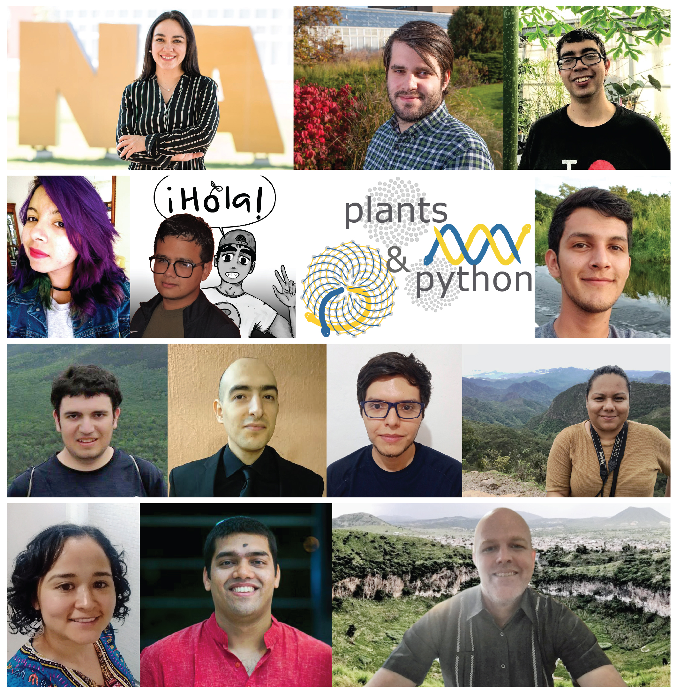</a>
  </div>
</div>

---

class: inverse

<div class="row">
  <div class="column" style="max-width:44%">
    <a href="https://cereal.interreg-npa.eu/subsites/CEREAL/Barley_cultivation-Norway_Presentation_2018.pdf" target="_blank">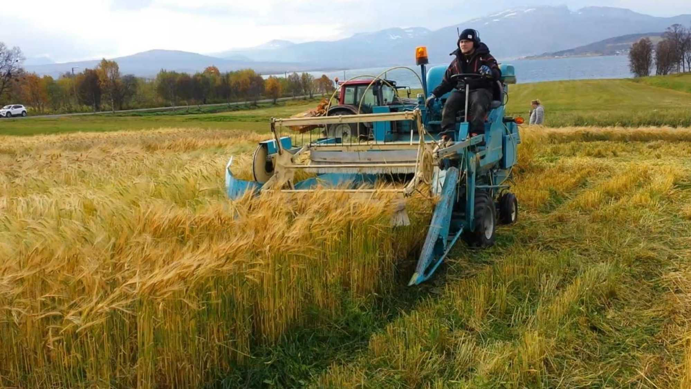</a>
    <a href="https://www.resilience.org/stories/2020-03-09/the-last-crop-before-the-desert/" target="_blank">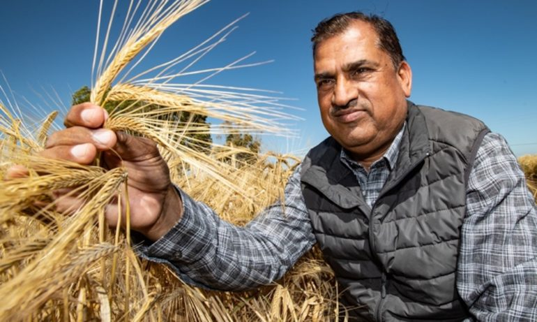</a>
    <a href="https://www.doi.org/10.1007/978-1-4419-0465-2_2168" target="_blank">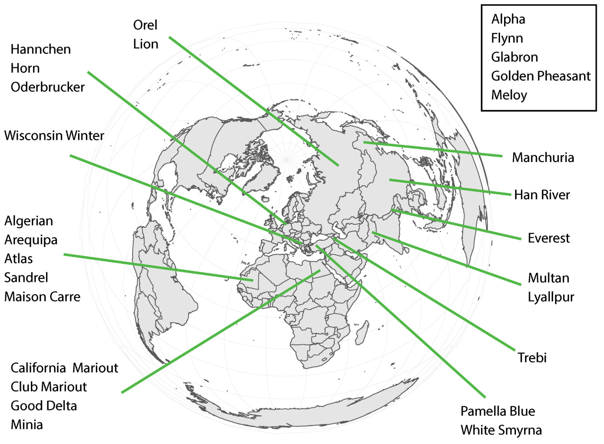</a>
  </div>
  <div class="column" style="max-width:44%">
    <a href="https://www.bloomberg.com/news/articles/2020-09-13/iraq-to-offer-first-ever-barley-exports-as-rains-yield-surplus" target="_blank">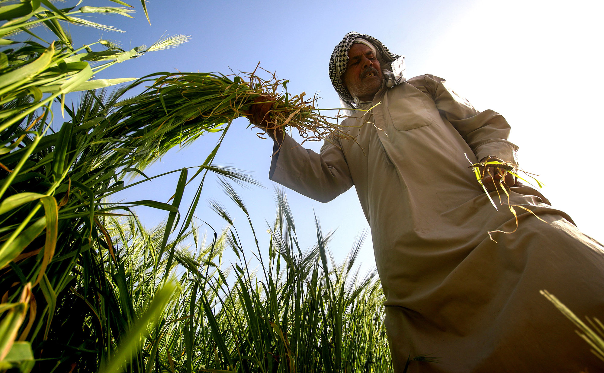</a>
    <a href="https://www.tibettravel.org/tibetan-culture/highland-barley.html" target="_blank">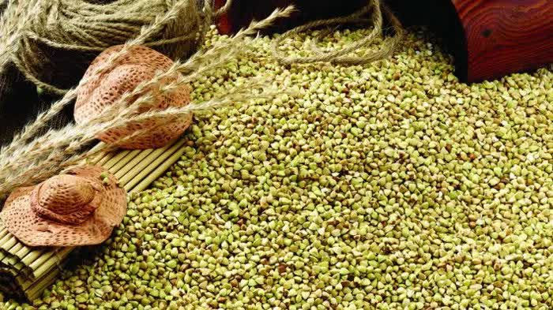</a>
    <div class="row">
      <div class="column" style="max-width:46%">
        
      </div>
      <div class="column" style="max-width:55%">
        
      </div>
    </div>
  </div>
  <div class="column" style="max-width:8%; font-size: 15px;">
    <p style="text-align: center; font-size: 30px; line-height: 1em;"> <strong> Barley from across the world </strong></p>
    <p>28 collected barley varieties</p>
    <p>Brought to California in 1929</p>
    <p>Artificial evolution experiment for 58 generations</p>
    <p>975 panicles scanned</p>
    <p>38,000 seeds isolated</p>
  </div>
</div>

---

# Topology: The Euler characteristic $\chi$

$$\chi = \#(\text{Vertices}) - \#(\text{Edges}) + \#(\text{Faces}).$$

<div class="row">
  <div class="column" style="width:5%">
  </div>
  <div class="column" style="max-width:30%">
    
  </div>
  <div class="column" style="max-width:30%">
    
  </div>
  <div class="column" style="max-width:30%">
    
  </div>
  <div class="column" style="width:5%">
  </div>
</div>

<div class="row">
  <div class="column" style="width:5%">
  </div>
  <div class="column" style="max-width:30%">
    
  </div>
  <div class="column" style="max-width:30%">
    
  </div>
  <div class="column" style="max-width:30%">
    <p style="padding: 50px 0 0 10px; font-size: 48px; text-align: center; color: #18453B; line-height: 1.25; font-family: 'Yanone Kaffeesatz';"> V - E + F = 2</p>
  </div>
  <div class="column" style="width:5%">
  </div>
</div>

---

## The Euler Characteristic Curve (ECC)

```{r, out.width=650}
knitr::include_graphics("../figs/ecc_ver2.gif")
```

## The Euler Characteristic Transform (ECT)

```{r, out.width=650}
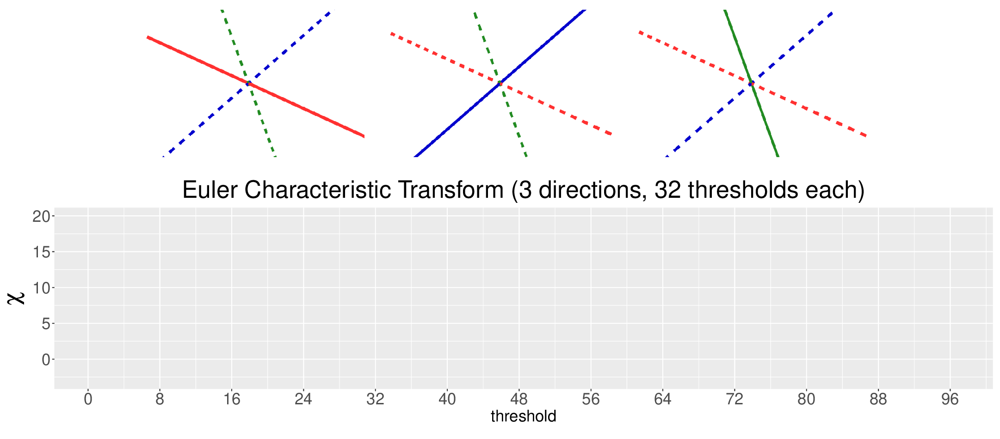
```

---

## The Euler Characteristic Curve (ECC)

```{r, out.width=650}
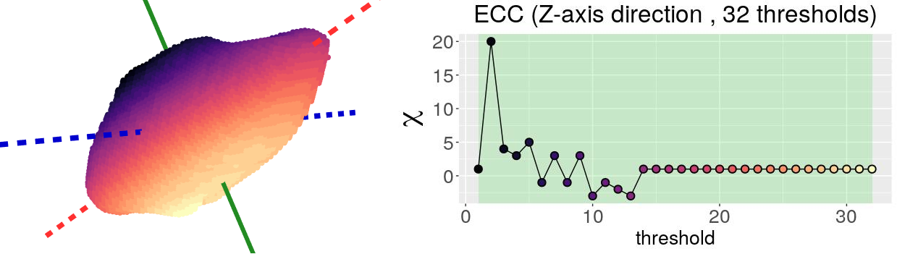
```

## The Euler Characteristic Transform (ECT)

```{r, out.width=650}
knitr::include_graphics("../figs/ect_ver2.gif")
```

---

# Quantify the shape of barley

**Goal:** Classify the **28** founding barley varieties solely by grain morphology information.

<style type="text/css">
.tg  {border-collapse:collapse;border-color:#93a1a1;border-spacing:0;margin:0px auto;}
.tg td{background-color:#fdf6e3;border-bottom-width:1px;border-color:#93a1a1;border-style:solid;border-top-width:1px;
  border-width:0px;color:#002b36;font-family:Arial, sans-serif;font-size:14px;overflow:hidden;padding:10px 5px;
  word-break:normal;}
.tg th{background-color:#657b83;border-bottom-width:1px;border-color:#93a1a1;border-style:solid;border-top-width:1px;
  border-width:0px;color:#fdf6e3;font-family:Arial, sans-serif;font-size:14px;font-weight:normal;overflow:hidden;
  padding:10px 5px;word-break:normal;}
.tg .tg-2bhk{background-color:#eee8d5;border-color:inherit;text-align:left;vertical-align:top}
.tg .tg-0pky{border-color:inherit;text-align:left;vertical-align:top}
.tg .tg-gyvr{background-color:#eee8d5;border-color:inherit;font-size:100%;text-align:left;vertical-align:top}
</style>
<table class="tg">
<thead>
  <tr>
    <th class="tg-0pky">Shape descriptors</th>
    <th class="tg-0pky">No. of descriptors</th>
    <th class="tg-0pky">F1</th>
  </tr>
</thead>
<tbody>
  <tr>
    <td class="tg-2bhk">Traditional</td>
    <td class="tg-2bhk">11</td>
    <td class="tg-2bhk">0.55 &plusmn; 0.019</td>
  </tr>
  <tr>
    <td class="tg-0pky">Topological</td>
    <td class="tg-0pky">12</td>
    <td class="tg-0pky">0.74 &plusmn; 0.016</td>
  </tr>
  <tr>
    <td class="tg-2bhk">Combined</td>
    <td class="tg-2bhk">23</td>
    <td class="tg-2bhk"><strong>0.86 &plusmn; 0.010</strong></td>
  </tr>
</tbody>
</table>

### What does topology actually measure?

.pull-left[
```{r, out.width=225}
knitr::include_graphics(c('../figs/discerning_directions.png'))#, '../figs/arrow_seed_09_0.gif'))
```
]

.pull-right[

]

---

# Into semi-supervised territory

- Train an SVM with 100% of the founders $(F_0)$

- Classify the progeny $F_{58}$: DNA (genotype) &harr; shape (phenotype) enrichment

.pull-left[
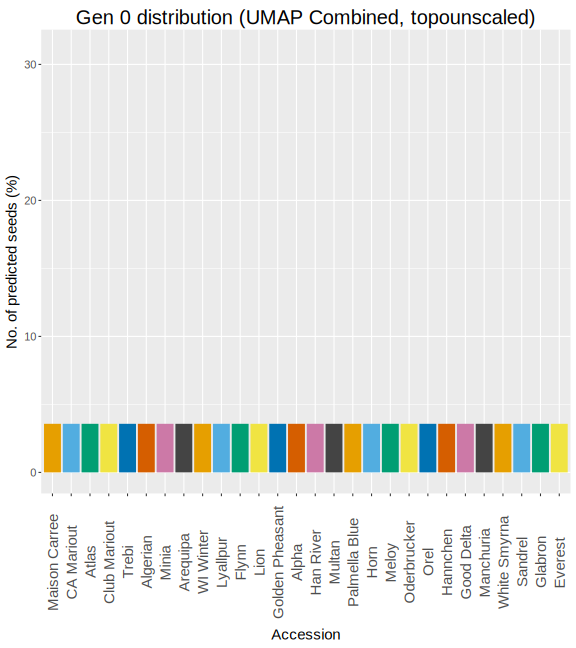
]

.pull-right[
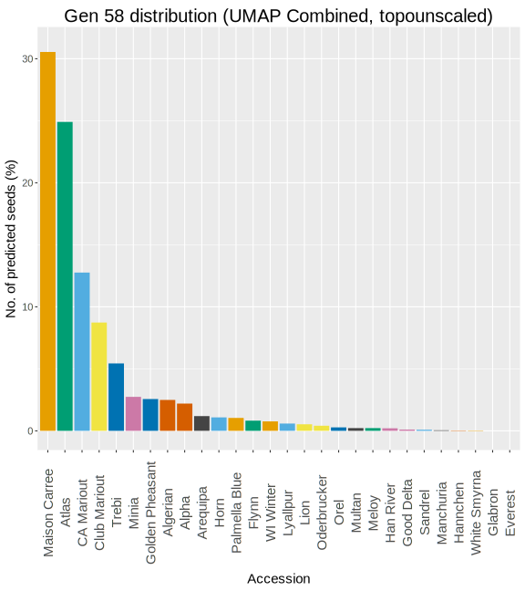
]

---

## A different crop: If life gives you lemons...

<div class="row">
  <div class="column" style="max-width:38%; color: Navy; font-size: 15px;">
    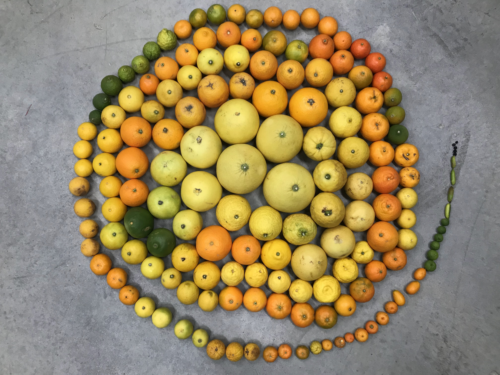
    <p style="text-align: center;"> UCR Collaboration </p>
  </div>
  <div class="column" style="max-width:38%; color: Navy; font-size: 15px;">
    
    <p style="text-align: center;"> 3D X-Ray CT scan </p>
  </div>
  <div class="column" style="max-width:23%; color: Navy; font-size: 15px;">
    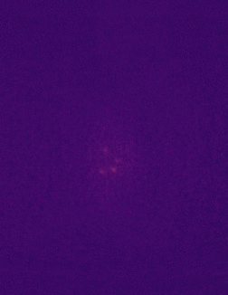
    <p style="text-align: center;"> Raw </p>
  </div>
</div>

<div class="row" style="margin: 0 auto;">
  <div class="column" style="max-width:20%; color: Navy; font-size: 15px;">
    
    <p style="text-align: center;"> Spine </p>
  </div>
  <div class="column" style="max-width:20%; color: Navy; font-size: 15px;">
    
    <p style="text-align: center;"> Endocarp </p>
  </div>
  <div class="column" style="max-width:20%; color: Navy; font-size: 15px;">
    
    <p style="text-align: center;"> Rind </p>
  </div>
  <div class="column" style="max-width:20%; color: Navy; font-size: 15px;">
    
    <p style="text-align: center;"> Exocarp </p>
  </div>
  <div class="column" style="max-width:20%; color: Navy; font-size: 15px;">
    
    <p style="text-align: center;"> Oil glands</p>
  </div>
</div>

---

## Quantifying the shape of citrus and their oil glands

<div class="row" style="margin: 0 auto;">
  <div class="column" style="max-width:44%; color: Navy; font-size: 15px;">
    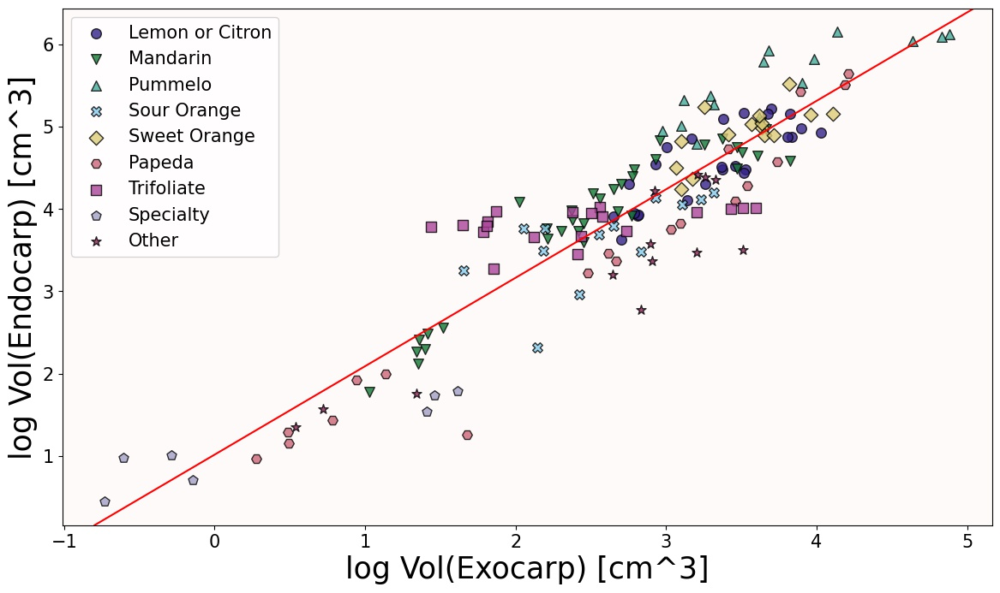
    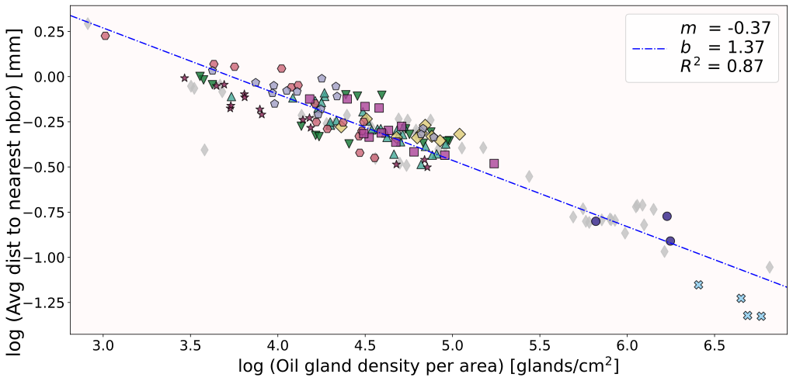
    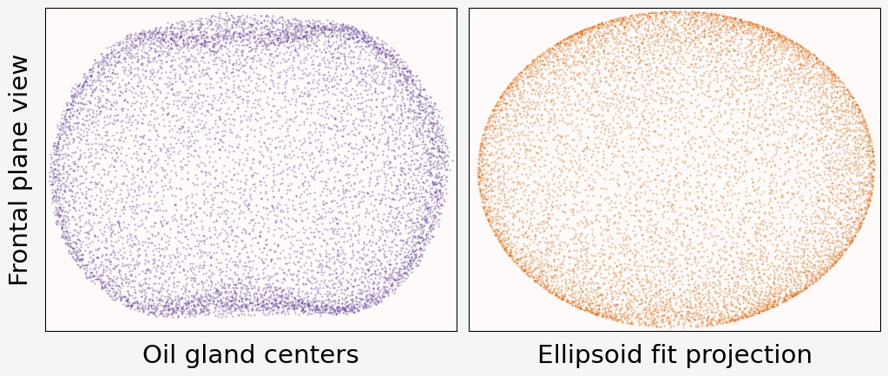
  </div>
  <div class="column" style="max-width:54%; color: Navy; font-size: 15px;">
    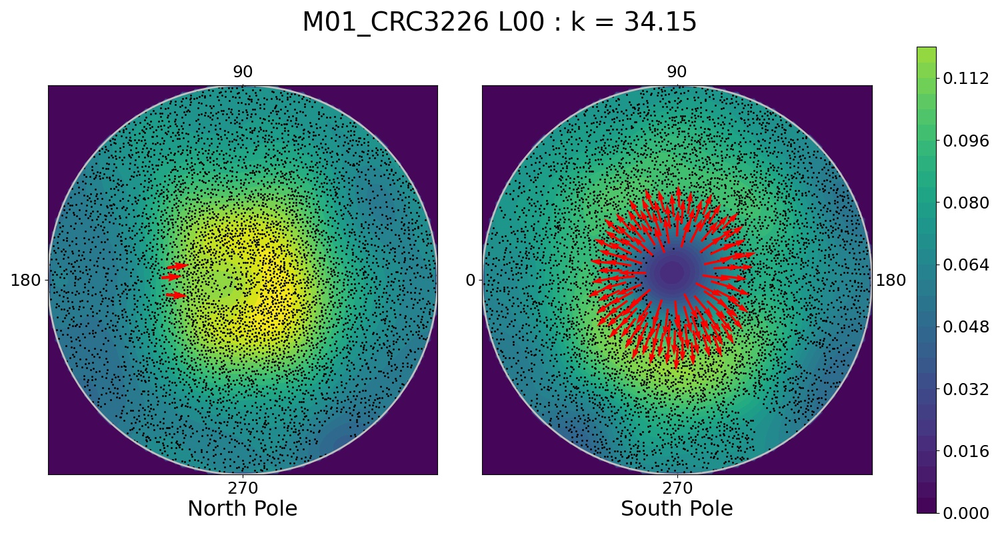
    
  </div>
</div>

---

### Grand challenge: genotype (DNA) &harr; phenotype (shape)

Leaf development in Arabidopsis: the guinea pig of plant biology

.pull-left[
```{r, out.width=225}
knitr::include_graphics(c('../../arabidopsis/figs/Day7_110921_Col_0_X_pot3_leaf_X.gif',
                          '../../arabidopsis/figs/Day7_110921_U112-3_pot0_leaf_X.gif'))
```
]

.pull-right[
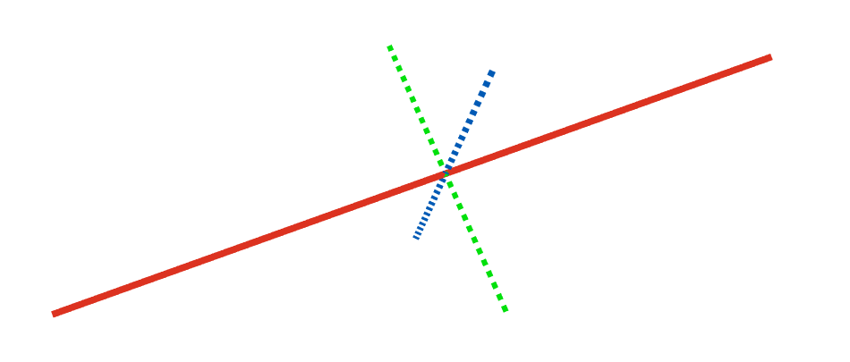
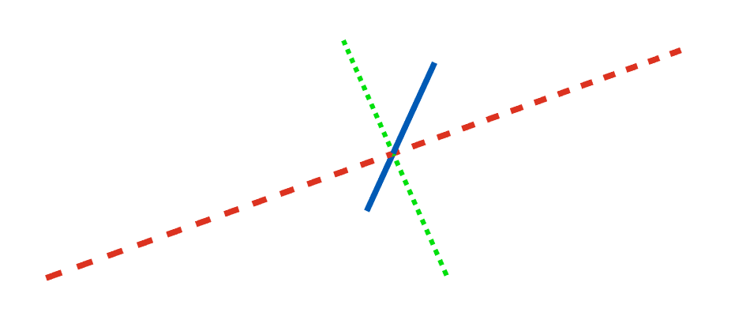
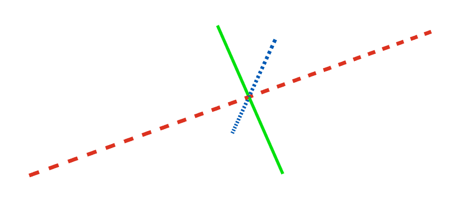
]

---

background-image: url("../../cmse/figs/institutional_logos.jpg")
background-size: 500px
background-position: 95% 1%

class: inverse

## Thank you!

<div class="row" style="margin-top: -25px;">
  <div class="column" style="max-width:19.5%; font-size: 13px;">
    
    <p style="text-align: center; color: White">Elizabeth Munch<br>(MSU)</p>
    
    <p style="text-align: center; color: White">Tim Ophelders<br>(Utrecht)</p>
    
  </div>
  <div class="column" style="max-width:19.5%; font-size: 13px;">
    
    <p style="text-align: center; color: White">Dan Chitwood<br>(MSU)</p>
    
    <p style="text-align: center; color: White">Michelle Quigley<br>(MSU)</p>
    
    <p style="text-align: center; color: White">Jacob Landis<br>(Cornell)</p>
  </div>
  <div class="column" style="max-width:14%; font-size: 13px;">
  
  <p style="text-align: center; color: White">Dan Koenig<br>(UC Riverside)</p>
  
  <p style="text-align: center; color: White">Danelle Seymour<br>(UC Riverside)</p>
  
  </div>
  <div class="column" style="width:10%; font-size: 24px;">
  </div>
  <div class="column" style="max-width:30%; font-size: 24px; line-height:1.25; padding: 0 0 0 0;">
  <p style="text-align: center; color: White"><strong>Email</strong></p>
  <p style="text-align: center; color: Yellow">amezqui3@msu.edu</p>
  <p style="text-align: center; color: White"><strong>Website/slides</strong></p>
  <p style="text-align: center; color: Yellow"><a href="https://egr.msu.edu/~amezqui3/aboutme.html" target="_blank">egr.msu.edu/~amezqui3</a></p>
  <p style="text-align: center; color: White"><strong>References</strong></p>
  <p style="font-size: 15px; color: Yellow; line-height:1.1; font-family: 'Yanone Kaffeesatz'">
  <strong>E.J. Amézquita</strong>, M.Y. Quigley, T. Ophelders, J.B. Landis, D. Koenig, E. Munch, D.H. Chitwood (2022) <a href="https://doi.org/10.1093/insilicoplants/diab033" target="_blank">Measuring hidden phenotype: Quantifying the shape of barley seeds using the Euler Characteristic Transform"</a>. <em>in Silico Plants</em> 4(1); diab033
  </p>
  <p style="font-size: 15px; color: Yellow; line-height:1.1; font-family: 'Yanone Kaffeesatz'">
  <strong>E.J. Amézquita</strong>, M.Y. Quigley, T. Ophelders, D. Seymour, E. Munch, D.H. Chitwood <a href="" target="_blank">The shape of aroma: measuring and modeling citrus oil gland distribution"</a>. BiorXiv. 
  </p>
  <p style="font-size: 15px; color: Yellow; line-height:1.1; font-family: 'Yanone Kaffeesatz'">
      K. Turner, S. Mukherjee, D.M. Boyer (2014) <a href="https://doi.org/10.1093/imaiai/iau011" target="_blank">"Persistent homology transform for modeling shapes and surfaces,"</a> <em>Information and Inference</em>, 3(4) 310–344
  </p>
  <p style="text-align: center; color: White; font-size:10px; line-height:1.1">Slides made in xaringan and rmarkdown</p>
  
  </div>
</div>
