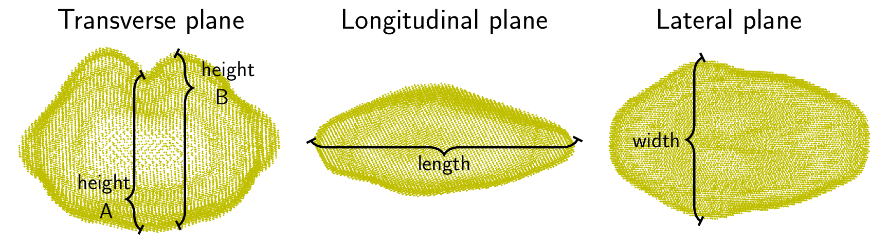

```{r setup, include=FALSE}
library(reticulate)
library(knitr)

# <!-- Copies an HTML dependency to a subdirectory of the given directory. The subdirectory name willbename-version(for example, "outputDir/jquery-1.11.0"). You may setoptions(htmltools.dir.version= FALSE)to suppress the version number in the subdirectory name. -->
options(htmltools.dir.version = FALSE)
knitr::opts_chunk$set(echo = FALSE)
knitr::opts_chunk$set(fig.align = 'center')
```

class: inverse

# Plant morphology

<div class="row">
  <div class="column" style="max-width:50%">
    <iframe width="375" height="210" src="https://www.youtube-nocookie.com/embed/oM9kAq0PBvw?controls=0" frameborder="0" allow="accelerometer; autoplay; encrypted-media; gyroscope; picture-in-picture" allowfullscreen></iframe>
    <iframe width="375" height="210" src="https://www.youtube-nocookie.com/embed/V39K58evWlU?controls=0" frameborder="0" allow="accelerometer; autoplay; encrypted-media; gyroscope; picture-in-picture" allowfullscreen></iframe>
  </div>
  <div class="column" style="max-width:50%">
    <iframe width="375" height="210" src="https://www.youtube-nocookie.com/embed/4GBgPIEDoa0?controls=0" frameborder="0" allow="accelerometer; autoplay; encrypted-media; gyroscope; picture-in-picture" allowfullscreen></iframe>
    <iframe width="375" height="210" src="https://www.youtube-nocookie.com/embed/qkOjHHuoUhA?controls=0" frameborder="0" allow="accelerometer; autoplay; encrypted-media; gyroscope; picture-in-picture" allowfullscreen></iframe>
  </div>
</div>

---

# Topological Data Analysis (TDA)

<div class="row">
  <div class="column" style="max-width:25%; font-size: 15px;">
    
    <p style="font-size: 25px; text-align: center; color: DarkRed;"> Raw Data </p>
    <ul>
      <li> X-ray CT </li>
      <li> Point clouds </li>
      <li> Time series </li>
    <ul>
  </div>
</div>

---

# Topological Data Analysis (TDA)

<div class="row">
  <div class="column" style="max-width:25%; font-size: 15px;">
    
    <p style="font-size: 25px; text-align: center; color: DarkRed;"> Raw Data </p>
    <ul>
      <li> X-ray CT </li>
      <li> Point clouds </li>
      <li> Time series </li>
    <ul>
  </div>
  <div class="column" style="max-width:40%; padding: 0 25px 0 25px; font-size: 15px;">
    
    <p style="font-size: 23px; text-align: center; color: DarkRed;"> Topological Summary </p>
    <ul>
      <li> Euler Characteristic </li>
      <li> Persistence diagrams </li>
      <li> Mapper/Reeb graphs </li>
    <ul>
  </div>
</div>

---

# Topological Data Analysis (TDA)

<div class="row">
  <div class="column" style="max-width:25%; font-size: 15px;">
    
    <p style="font-size: 25px; text-align: center; color: DarkRed;"> Raw Data </p>
    <ul>
      <li> X-ray CT </li>
      <li> Point clouds </li>
      <li> Time series </li>
    <ul>
  </div>
  <div class="column" style="max-width:40%; padding: 0 25px 0 25px; font-size: 15px;">
    
    <p style="font-size: 23px; text-align: center; color: DarkRed;"> Topological Summary </p>
    <ul>
      <li> Euler Characteristic </li>
      <li> Persistence diagrams </li>
      <li> Mapper/Reeb graphs </li>
    <ul>
  </div>
  <div class="column" style="max-width:35%; font-size: 15px;">
    
    <p style="font-size: 25px; text-align: center; color: DarkRed;"> Analysis </p>
    <ul>
      <li> Statistics </li>
      <li> Machine learning </li>
      <li> Classification/prediction </li>
    <ul>
  </div>
</div>

---

<div class="row">
  <div class="column" style="max-width:44%">
    <a href="https://www.bloomberg.com/news/articles/2020-09-13/iraq-to-offer-first-ever-barley-exports-as-rains-yield-surplus" target="_blank"></a>
  </div>
</div>

---

<div class="row">
  <div class="column" style="max-width:44%">
    <a href="https://www.bloomberg.com/news/articles/2020-09-13/iraq-to-offer-first-ever-barley-exports-as-rains-yield-surplus" target="_blank"></a>
  </div>
  <div class="column" style="max-width:44%">
    <a href="https://cereal.interreg-npa.eu/subsites/CEREAL/Barley_cultivation-Norway_Presentation_2018.pdf" target="_blank"></a>
  </div>
</div>

---

<div class="row">
  <div class="column" style="max-width:44%">
    <a href="https://www.bloomberg.com/news/articles/2020-09-13/iraq-to-offer-first-ever-barley-exports-as-rains-yield-surplus" target="_blank"></a>
    <a href="https://www.resilience.org/stories/2020-03-09/the-last-crop-before-the-desert/" target="_blank"></a>
  </div>
  <div class="column" style="max-width:44%">
    <a href="https://cereal.interreg-npa.eu/subsites/CEREAL/Barley_cultivation-Norway_Presentation_2018.pdf" target="_blank"></a>
  </div>
</div>

---

<div class="row">
  <div class="column" style="max-width:44%">
    <a href="https://www.bloomberg.com/news/articles/2020-09-13/iraq-to-offer-first-ever-barley-exports-as-rains-yield-surplus" target="_blank"></a>
    <a href="https://www.resilience.org/stories/2020-03-09/the-last-crop-before-the-desert/" target="_blank"></a>
  </div>
  <div class="column" style="max-width:44%">
    <a href="https://cereal.interreg-npa.eu/subsites/CEREAL/Barley_cultivation-Norway_Presentation_2018.pdf" target="_blank"></a>
    <a href="https://www.tibettravel.org/tibetan-culture/highland-barley.html" target="_blank"></a>
  </div>
</div>

---

<div class="row">
  <div class="column" style="max-width:44%">
    <a href="https://www.bloomberg.com/news/articles/2020-09-13/iraq-to-offer-first-ever-barley-exports-as-rains-yield-surplus" target="_blank"></a>
    <a href="https://www.resilience.org/stories/2020-03-09/the-last-crop-before-the-desert/" target="_blank"></a>
    <a href="https://www.nationalgeographic.co.uk/travel/2020/05/photo-story-from-barley-fields-to-whisky-barrels-in-rural-scotland" target="_blank"></a>
  </div>
  <div class="column" style="max-width:44%">
    <a href="https://cereal.interreg-npa.eu/subsites/CEREAL/Barley_cultivation-Norway_Presentation_2018.pdf" target="_blank"></a>
    <a href="https://www.tibettravel.org/tibetan-culture/highland-barley.html" target="_blank"></a>
  </div>
</div>

---

<div class="row">
  <div class="column" style="max-width:44%">
    <a href="https://www.bloomberg.com/news/articles/2020-09-13/iraq-to-offer-first-ever-barley-exports-as-rains-yield-surplus" target="_blank"></a>
    <a href="https://www.resilience.org/stories/2020-03-09/the-last-crop-before-the-desert/" target="_blank"></a>
    <a href="https://www.nationalgeographic.co.uk/travel/2020/05/photo-story-from-barley-fields-to-whisky-barrels-in-rural-scotland" target="_blank"></a>
  </div>
  <div class="column" style="max-width:44%">
    <a href="https://cereal.interreg-npa.eu/subsites/CEREAL/Barley_cultivation-Norway_Presentation_2018.pdf" target="_blank"></a>
    <a href="https://www.tibettravel.org/tibetan-culture/highland-barley.html" target="_blank"></a>
    <a href="https://www.doi.org/10.1007/978-1-4419-0465-2_2168" target="_blank"></a>
  </div>
  <div class="column" style="max-width:8%; font-size: 15px;">
    <p style="text-align: center; font-size: 30px; line-height: 1em; color:#18453B"> <strong> Barley across the world:<br><br>28 different accessions</strong></p>
  </div>
</div>

---

# Raw Data: X-rays &rarr; Image Processing

<div class="row">
  <div class="column" style="max-width:51%; color: Navy; font-size: 15px;">
    
    <p style="text-align: center;"> Proprietary X-Ray CT scan reconstruction </p>
  </div>
</div>

---

# Raw Data: X-rays &rarr; Image Processing

<div class="row">
  <div class="column" style="max-width:51%; color: Navy; font-size: 15px;">
    
    <p style="text-align: center;"> Proprietary X-Ray CT scan reconstruction </p>
  </div>
  <div class="column" style="max-width:17.5%; color: Navy; font-size: 15px;">
    
    <p style="text-align: center;"> 975 spikes </p>
  </div>
</div>

---

# Raw Data: X-rays &rarr; Image Processing

<div class="row">
  <div class="column" style="max-width:51%; color: Navy; font-size: 15px;">
    
    <p style="text-align: center;"> Proprietary X-Ray CT scan reconstruction </p>
  </div>
  <div class="column" style="max-width:17.5%; color: Navy; font-size: 15px;">
    
    <p style="text-align: center;"> 975 spikes </p>
  </div>
  <div class="column" style="max-width:20.5%; color: Navy; font-size: 15px;">
    
    <p style="text-align: center;"> 38,000 seeds </p>
  </div>
</div>

---

# Raw Data: X-rays &rarr; Image Processing

<div class="row">
  <div class="column" style="max-width:51%; color: Navy; font-size: 15px;">
    
    <p style="text-align: center;"> Proprietary X-Ray CT scan reconstruction </p>
  </div>
  <div class="column" style="max-width:17.5%; color: Navy; font-size: 15px;">
    
    <p style="text-align: center;"> 975 spikes </p>
  </div>
  <div class="column" style="max-width:20.5%; color: Navy; font-size: 15px;">
    
    <p style="text-align: center;"> 38,000 seeds </p>
  </div>
</div>

```{r, out.width=650}

```

---

# Topology: The Euler characteristic $\chi$

$$\chi = \#(\text{Vertices}) - \#(\text{Edges}) + \#(\text{Faces}).$$
```{r, out.width=400}
knitr::include_graphics("../figs/euler_characteristic_2.png")
```

--
- Summarize **topological features** with the Euler-Poincaré formula

$$\chi = \#(\text{Connected Components}) - \#(\text{Loops}) + \#(\text{Voids}).$$

--
- The Euler characteristic is a **topological invariant**.

---

background-image: url("../figs/ecc_ver2.gif")
background-size: 750px
background-position: 50% 90%

# Euler Characteristic Curve (ECC)

- Consider a voxel-based image $X\subset\mathbb{R}^d$.

--

- Slice it along a fixed direction.

--

- Keep track of how the Euler Characteristic changes as we keep adding slices.

---

background-image: url("../figs/ect_ver2.gif")
background-size: 800px
background-position: 50% 88%


# Euler Characteristic Transform (ECT)

- Repeat and concatenate for all possible directions.

--

- [**Theorem** (Curry, Mukherjee, Turner, 2018)](http://arxiv.org/abs/1805.09782):  The ECT is injective.

--

- [**Theorem** (Turner, Mukherjee, Boyer, 2014)](https://arxiv.org/abs/1310.1030):  The ECT is a sufficient statistic in 3D.

---

# Hidden topological shape information

- **Goal:** Classify 28 barley accessions using solely grain morphology information.

- **3121** grains in total

--

.pull-left[

]

.pull-right[
```{r, out.width=150}
knitr::include_graphics('../figs/pole_directions_p7_m12_crop.jpg')
```
]

---

# Hidden topological shape information

- **Goal:** Classify 28 barley accessions using solely grain morphology information.

- **3121** grains in total

.pull-left[


```{r, out.width=300}
knitr::include_graphics(c('../figs/kruskal_wallis_topo_summary.jpg'))
```
]

.pull-right[
```{r, out.width=150}
knitr::include_graphics('../figs/pole_directions_p7_m12_crop.jpg')
```
]

---

# Hidden topological shape information

- **Goal:** Classify 28 barley accessions using solely grain morphology information.

- **3121** grains in total

.pull-left[


```{r, out.width=300}
knitr::include_graphics(c('../figs/kruskal_wallis_topo_summary.jpg'))
```
]

.pull-right[
```{r, out.width=150}
knitr::include_graphics('../figs/discerning_directions.png')
```


]


---
class: right, bottom, inverse

background-image: url("../figs/acknowledgments.jpg")
background-size: 1000px
background-position: 50% 40%
