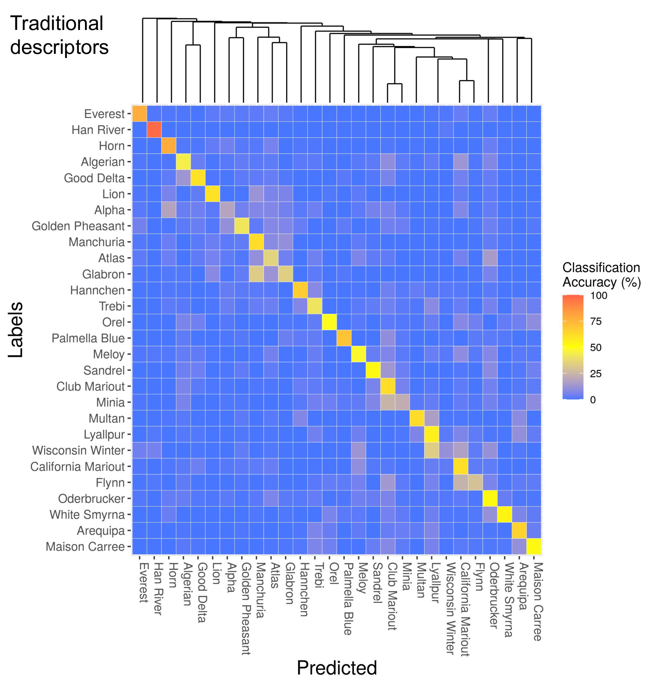
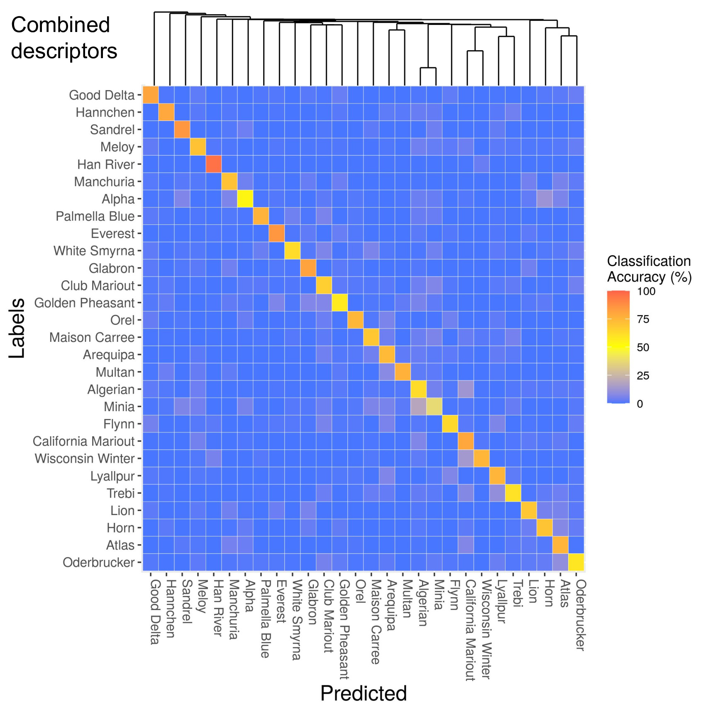

```{r setup, include=FALSE}
library(reticulate)
library(knitr)

# <!-- Copies an HTML dependency to a subdirectory of the given directory. The subdirectory name willbename-version(for example, "outputDir/jquery-1.11.0"). You may setoptions(htmltools.dir.version= FALSE)to suppress the version number in the subdirectory name. -->
options(htmltools.dir.version = FALSE)
knitr::opts_chunk$set(echo = FALSE)
```

class: inverse

<div class="row">
  <div class="column" style="max-width:44%">
    <!-- <a href="https://www.thescottishfarmer.co.uk/arable/14364703.hybrid-barley-pays-off-for-mixed-farming-too/" target="_blank"></a> -->
    <a href="https://cereal.interreg-npa.eu/subsites/CEREAL/Barley_cultivation-Norway_Presentation_2018.pdf" target="_blank"></a>
    <a href="https://www.resilience.org/stories/2020-03-09/the-last-crop-before-the-desert/" target="_blank"></a>
    <a href="https://ipad.fas.usda.gov/highlights/2008/11/eth_25nov2008/" target="_blank"></a>
  </div>
  <div class="column" style="max-width:44%">
    <a href="https://kizilvest.ru/20150827-v-kizilskom-rajone-nachalas-uborochnaya-strada/" target="_blank"></a>
    <a href="https://www.bloomberg.com/news/articles/2020-09-13/iraq-to-offer-first-ever-barley-exports-as-rains-yield-surplus" target="_blank"></a>
    <a href="https://thewire.in/agriculture/covid-19-lockdown-crop-harvest-farmers" target="_blank"></a>
  </div>
  <div class="column" style="max-width:8%; font-size: 15px;">
    <p style="text-align: center; font-size: 30px; line-height: 1em;"> <strong> Barley across the world </strong></p>
    <p>Tjøtta (Nordland, Norway)</p>
    <p>Kiliskoye (Chelyabinsk, Russia)</p>
    <p>Marchouch (Rabat, Morocco)</p>
    <p>Bagdad (Iraq) </p>
    <p>Aksum (Tigray, Ethiopia) </p>
    <p>Hanumangarh (Rajasthan, India) </p>
    <p style="font-size:9px;line-height: 1em;">Click on any picture for more details and credits</p>
  </div>
</div>

---

# Morphological seed diversity of lines

<div class="row">
  <div class="column" style="max-width:45%">
    <a href="https://www.nationalgeographic.co.uk/travel/2020/05/photo-story-from-barley-fields-to-whisky-barrels-in-rural-scotland" target="_blank"></a>
  </div>
  <div class="column" style="max-width:55%">
    <a href="https://www.tibettravel.org/tibetan-culture/highland-barley.html" target="_blank"></a>
    <a href="https://www.doi.org/10.1007/978-1-4419-0465-2_2168" target="_blank"></a>
    <p style="font-size: 15px; line-height: 1em"> Barley seeds from Scotland and Tibet. </p>
    <p style="font-size: 15px; line-height: 1em"> Historical expansion of the barley as a crop. </p>
    <p style="font-size:9px;line-height: 1em;">Click on any picture for more details and credits</p>
  </div>
</div>


---

# Topological Data Analysis

<div class="row" style="margin-top: -30px;">
  <div class="column" style="max-width:25%; font-size: 15px;">
    
    <p style="font-size: 25px; text-align: center; color: DarkRed;"> Raw Data </p>
    <ul>
      <li> X-ray CT </li>
      <li> Point clouds </li>
      <li> Time series </li>
    <ul>
  </div>
  <div class="column" style="max-width:40%; padding: 0 25px 0 25px; font-size: 15px;">
    
    <p style="font-size: 23px; text-align: center; color: DarkRed;"> Topological Summary </p>
    <ul>
      <li> Euler Characteristic </li>
      <li> Persistence diagrams </li>
      <li> Mapper/Reeb graphs </li>
    <ul>
  </div>
  <div class="column" style="max-width:35%; font-size: 15px;">
    
    
    <p style="font-size: 25px; text-align: center; color: DarkRed;"> Analysis </p>
    <ul>
      <li> Statistics </li>
      <li> Machine learning </li>
      <li> Classification/prediction </li>
    <ul>
  </div>
</div>

---

# Classification of 28 lines with SVM

<div class="row" style="margin-top: -30px;">
  <div class="column" style="max-width:50%; font-size: 15px;">
    
    <p style="line-height: 1em"> Average classification accuracy: 53%. </p>
    <ul>
      <li> Length </li>
      <li> Surface area </li>
      <li> 11 traditional shape descriptors in total </li>
    </ul>
  </div>
  <div class="column" style="max-width:50%; font-size: 15px;" >
    
    <p style="font-size: 15px; line-height: 1em"> Average classification accuracy: 70%. </p>
      <li> 11 traditional shape descriptors </li>
      <li> ECT reduced  to 12 dimensions with KPCA</li>
      <li> 23 shape descriptors in total </li>
    </ul>
  </div>
</div>

[**Come see my ANIMATED poster for more details!**](./neurips2020_dynamic.html)