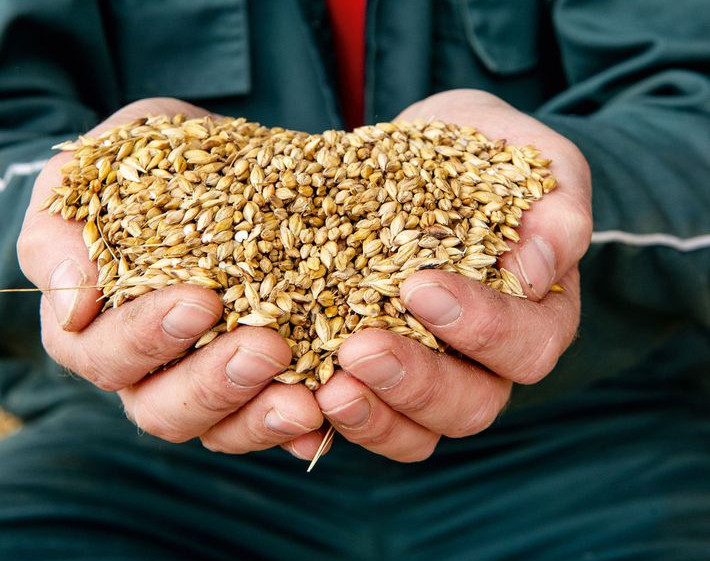
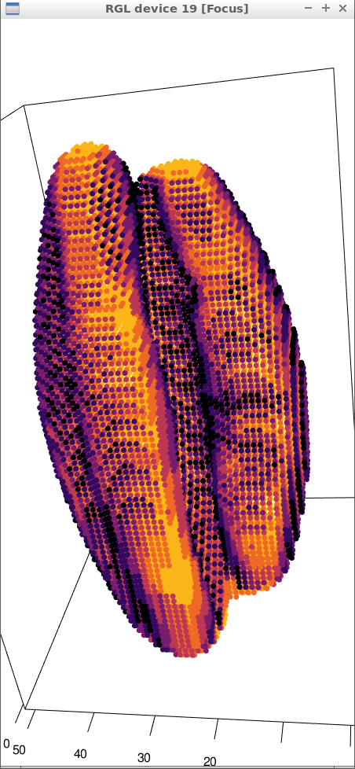
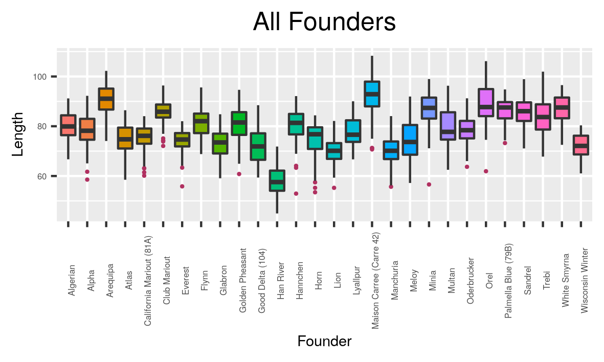
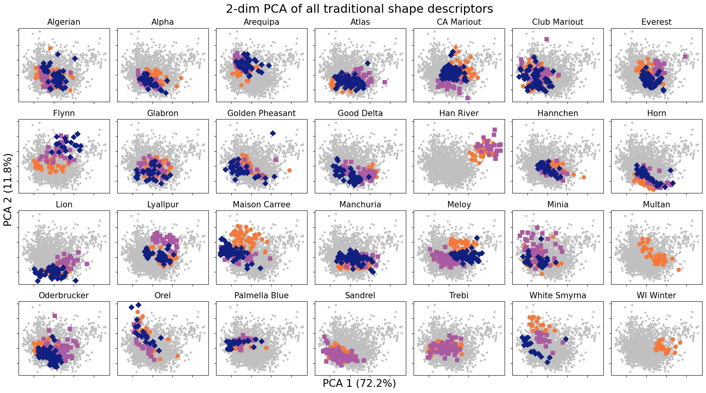
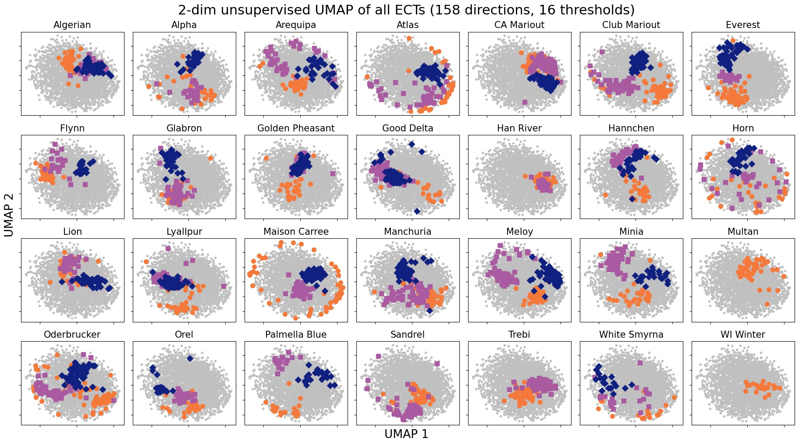
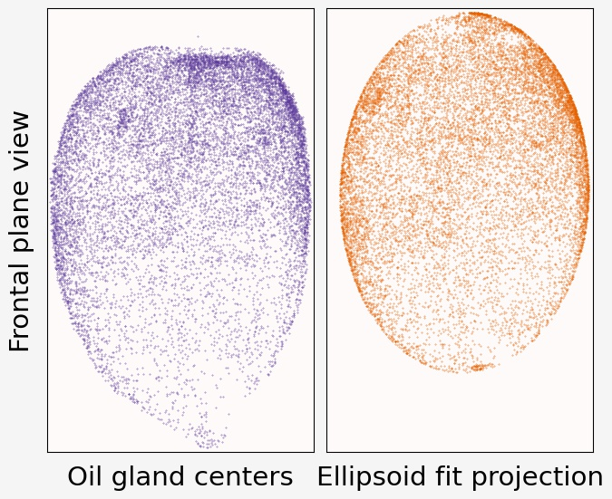
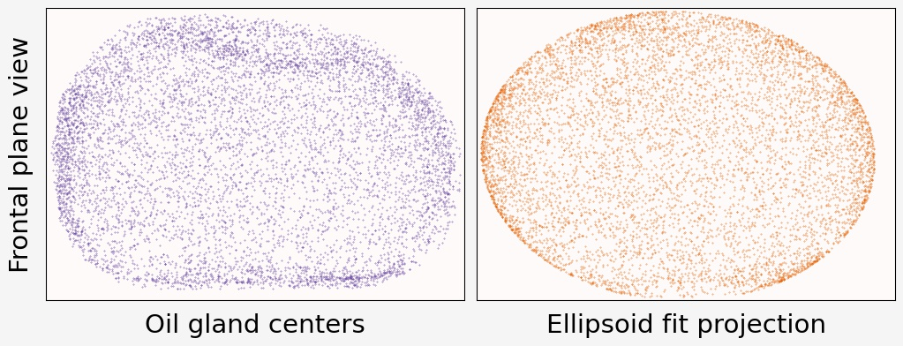

```{r setup, include=FALSE}
library(reticulate)
library(knitr)

options(htmltools.dir.version = FALSE)
knitr::opts_chunk$set(echo = FALSE)
knitr::opts_chunk$set(fig.align = 'center')
```

background-image: url("../../img/endlessforms.png")
background-size: 150px
background-position: 89% 7%

class: inverse

# Plant morphology

<div class="row">
  <div class="column" style="max-width:50%">
    <iframe width="375" height="210" src="https://www.youtube-nocookie.com/embed/oM9kAq0PBvw?controls=0" frameborder="0" allow="accelerometer; autoplay; encrypted-media; gyroscope; picture-in-picture" allowfullscreen></iframe>
    <iframe width="375" height="210" src="https://www.youtube-nocookie.com/embed/V39K58evWlU?controls=0" frameborder="0" allow="accelerometer; autoplay; encrypted-media; gyroscope; picture-in-picture" allowfullscreen></iframe>
  </div>
  <div class="column" style="max-width:50%">
    <iframe width="375" height="210" src="https://www.youtube-nocookie.com/embed/4GBgPIEDoa0?controls=0" frameborder="0" allow="accelerometer; autoplay; encrypted-media; gyroscope; picture-in-picture" allowfullscreen></iframe>
    <iframe width="375" height="210" src="https://www.youtube-nocookie.com/embed/qkOjHHuoUhA?controls=0" frameborder="0" allow="accelerometer; autoplay; encrypted-media; gyroscope; picture-in-picture" allowfullscreen></iframe>
  </div>
</div>

<p style="font-size: 24px; text-align: right; font-family: 'Yanone Kaffeesatz'">Check out more 3D X-ray CT scans at <a href="https://www.youtube.com/@endlessforms6756">youtube.com/@endlessforms6756</a></p>

---

# Traditional Morphometry

```{r, out.width=650}
knitr::include_graphics('https://nph.onlinelibrary.wiley.com/cms/asset/e0e8b362-efee-410a-a293-947c2d57acb9/nph16286-fig-0003-m.jpg')
```
<p style="font-size: 10px; text-align: right; color: Grey;"> Credits: <a href=" https://doi.org/10.1111/nph.16286">Gupta <em>et al.</em> (2019)</a></p>

---

# Modern Morphometric Methods might not be enough

.pull-left[
Elliptical Fourier Descriptor (EFD)

<p style="font-size: 10px; text-align: right; color: Grey;"> Credits: <a href="https://doi.org/10.1016/j.cub.2016.02.033">Chitwood and Sinha (2016)</a></p>
]

.pull-right[
Landmark-based morphometrics (GMM)

<p style="font-size: 10px; text-align: right; color: Grey;"> Credits: <a href=" https://doi.org/10.1002/ppp3.10157">Chitwood  (2020)</a></p>
]

---

background-image: url("../../img/endlessforms.png")
background-size: 150px
background-position: 89% 7%

class: inverse

# Something more robust is needed

<div class="row">
  <div class="column" style="max-width:50%">
    <iframe width="375" height="210" src="https://www.youtube-nocookie.com/embed/j0R9mMs5E50?controls=0" title="YouTube video player" frameborder="0" allow="accelerometer; autoplay; clipboard-write; encrypted-media; gyroscope; picture-in-picture" allowfullscreen></iframe>
    <iframe width="375" height="210" src="https://www.youtube-nocookie.com/embed/2FmwkEA3tsY?controls=0" title="YouTube video player" frameborder="0" allow="accelerometer; autoplay; clipboard-write; encrypted-media; gyroscope; picture-in-picture" allowfullscreen></iframe>
  </div>
  <div class="column" style="max-width:50%">
    <iframe width="375" height="210" src="https://www.youtube-nocookie.com/embed/vxcSZsCs5BU?controls=0" title="YouTube video player" frameborder="0" allow="accelerometer; autoplay; clipboard-write; encrypted-media; gyroscope; picture-in-picture" allowfullscreen></iframe>
    <iframe width="375" height="210" src="https://www.youtube-nocookie.com/embed/KXt-C-_OA3o?controls=0" title="YouTube video player" frameborder="0" allow="accelerometer; autoplay; clipboard-write; encrypted-media; gyroscope; picture-in-picture" allowfullscreen></iframe>
  </div>
</div>

<p style="font-size: 24px; text-align: right; font-family: 'Yanone Kaffeesatz'">Check out more 3D X-ray CT scans at <a href="https://www.youtube.com/@endlessforms6756">youtube.com/@endlessforms6756</a></p>

---

# Topological Data Analysis (TDA)

<div class="row">
  <div class="column" style="max-width:25%; font-size: 15px;">
    
    <p style="font-size: 25px; text-align: center; color: DarkRed;"> Raw Data </p>
    <ul>
      <li> X-ray CT </li>
      <li> Point clouds </li>
      <li> Time series </li>
    <ul>
  </div>
  <div class="column" style="max-width:40%; padding: 0 25px 0 25px; font-size: 15px;">
    
    <p style="font-size: 23px; text-align: center; color: DarkRed;"> Topological Summary </p>
    <ul>
      <li> Euler Characteristic </li>
      <li> Persistence diagrams </li>
      <li> Mapper/Reeb graphs </li>
    <ul>
  </div>
  <div class="column" style="max-width:35%; font-size: 15px;">
    
    <p style="font-size: 25px; text-align: center; color: DarkRed;"> Analysis </p>
    <ul>
      <li> Statistics </li>
      <li> Machine learning </li>
      <li> Classification/prediction </li>
    <ul>
  </div>
</div>

---

background-image: url("../figs/seed.png")
background-size: 325px
background-position: 99% 99%

# Roadmap for today

### Split into modules

1. Survey of TDA in biology applications

1. The Euler Characteristic Transform

1. Quantifying barley morphology using TDA

1. Current work on modeling citrus (with TDA in the horizon)

---

class: inverse, middle, center

# 1. TDA meets biology in a number of ways

## Quick TDA recap

## The significance of detecting connected components and holes

---

# 1st TDA Ingredient: Complexes

- Think the data as a collection of elementary building blocks ( _cells_ )

Vertices | Edges | Faces | Cubes
---------|-------|-------|-------
  0-dim  | 1-dim | 2-dim | 3-dim

- A collection of cells is a _cubical complex_

- Count the number of topological features ( _holes_ ):

Connected components | Loops | Voids
---------------------|-------|-------
       0-dim         | 1-dim | 2-dim

- Example with 2 connected components, 1 loop, 0 voids

```{r, out.width=500}
knitr::include_graphics("../../tda/figs/binary_to_cubical_complex_textless.svg")
```

---

# 2nd TDA Ingredient: Filters

- Each cell is assigned a real value which defines how the complex is constructed.

- Observe how the number of topological features change as the complex grows.

.pull-left[
```{r, out.width="250px"}
knitr::include_graphics(c("../figs/eigcurv_filter.gif", "../figs/gaussian_density_filter.gif"))
```
]

.pull-right[
```{r, out.width="250px"}
knitr::include_graphics(c("../figs/eccentricity_filter.gif", "../figs/vrips_ver2.gif"))
```
]

---

## Example 1

### Detecting holes &rarr; detect cancerous tissue

.pull-left[

]

.pull-right[

]

<p style="font-size: 10px; text-align: right; color: Grey;"> Credits: <a href="https://doi.org/10.1016/j.media.2019.03.014">Qaiser <em>et al.</em> (2019)</a></p>

---

## Example 2

### Detect holes &rarr; detect reassortment and horizontal evolution

.pull-left[

]

.pull-right[

]

<p style="font-size: 10px; text-align: right; color: Grey;"> Credits: <a href="https://doi.org/10.1073/pnas.1313480110">Chan <em>et al.</em> (2013)</a></p>

---

## Example 3

### Detect holes &rarr; detect open and closed conformations

.pull-left[


]

.pull-right[

]

<p style="font-size: 10px; text-align: right; color: Grey;"> Credits: <a href="https://doi.org/10.1515/sagmb-2015-0057">Kovacev-Nikolic <em>et al.</em> (2016)</a></p>

---

## Example 4

### Detect connected components across slices &rarr; detect panicle structure

```{r, out.width=375}
knitr::include_graphics('https://media.springernature.com/original/springer-static/image/chp%3A10.1007%2F978-3-030-20867-7_7/MediaObjects/484957_1_En_7_Fig1_HTML.png')
```

<p style="font-size: 10px; text-align: right; color: Grey;"> Credits: <a href="https://doi.org/10.1007/978-3-030-20867-7_7">Chitwood <em>et al.</em> (2019)</a></p>

---

## Example 5

### Detect componets across the morphospace &rarr; detect leaf development

```{r, out.width=450}
knitr::include_graphics('../../tda/figs/g86.png')
```

<p style="font-size: 10px; text-align: right; color: Grey;"> Credits: Percival <em>et al.</em> (in preparation)</p>

---

# Advertisement

- More content, references, and examples

> Amézquita _et al._ (2020) "The shape of things to come: Topological data analysis and biology, from molecules to organisms". _Developmental Dynamics_ **249**(7) pp. 816-833. DOI: [10.1002/dvdy.175](https://doi.org/10.1002/dvdy.175)


---

class: inverse, middle, center

# 2. Foucusing on the Euler Characteristic

## The Euler Characteristic Transform (ECT)

---

# Topology: The Euler characteristic $\chi$

$$\chi = \#(\text{Vertices}) - \#(\text{Edges}) + \#(\text{Faces}).$$
```{r, out.width=400}
knitr::include_graphics("../../tda/figs/euler_characteristic_2.png")
```

--

- Summarize **topological features** with the Euler-Poincaré formula

$$\chi = \#(\text{Connected Components}) - \#(\text{Loops}) + \#(\text{Voids}).$$

--

- The Euler characteristic is a **topological invariant**.

---

# Euler Characteristic Curve (ECC)

- Consider a cubical complex $X\subset\mathbb{R}^d$


- And a unit-length direction $\nu\in S^{d-1}$

- And the subcomplex containing all cubical cells below height $h$ in the direction $\nu$
$$X(\nu)_h =\{\Delta \in X\::\:\langle x,\nu\rangle\leq h\text{ for all }x\in\Delta\}$$

- The Euler Characteristic Curve (ECC) of direction $\nu$ is defined as the sequence $$\{\chi(X(\nu)_h)\}_{h\in\mathbb{R}}$$

---

background-image: url("../figs/ecc_ver2.gif")
background-size: 750px
background-position: 50% 90%

# Euler Characteristic Curve (ECC)

- Consider a cubical complex $X\subset\mathbb{R}^d$
- And a unit-length direction $\nu\in S^{d-1}$

- And the subcomplex containing all cubical cells below height $h$ in the direction $\nu$
$$X(\nu)_h =\{\Delta \in X\::\:\langle x,\nu\rangle\leq h\text{ for all }x\in\Delta\}$$

- The Euler Characteristic Curve (ECC) of direction $\nu$ is defined as the sequence $$\{\chi(X(\nu)_h)\}_{h\in\mathbb{R}}$$
---

background-image: url("../figs/ect_ver2.gif")
background-size: 800px
background-position: 50% 88%

## Euler Characteristic Transform (ECT)

- Repeat and concatenate for all possible directions.

$$
\begin{split}
ECT(X):\; & S^{d-1} \to \mathbb{Z}^{\mathbb{R}}\\
&\nu\mapsto\{\chi(X(\nu)_h)\}_{h\in\mathbb{R}}.
\end{split}
$$

- [**Theorem** (Turner, Mukherjee, Boyer 2014) & (Curry, Mukherjee, Turner, 2018)](http://arxiv.org/abs/1805.09782):  The ECT is injective with a finite bound of necessary directions.

---

# More on the ECT

- Easy to compute: a quick alternating sum.

[**Theorem _(Turner, Mukherjee, Boyer 2014)_**](https://doi.org/10.1093/imaiai/iau011): The ECT is injective for finite simplicial complexes in 3D.

[**Theorem _(ibid)_**](https://arxiv.org/abs/1310.1030): The ECT is a sufficient statistic for finite simplicial complexes in 3D.

*Translation:* 

- Given all the (infinite) ECCs corresponding to all possible directions,

- *Different* simplicial complexes correspond to *different* ECTs.

- The ECT effectively summarizes all possible information related to shape.


There is elusive math research on computationally efficient reconstruction algorithms:
- [Turner, Mukherjee, Curry (2021)](https://arxiv.org/abs/1805.09782): Finite no. of directions
- [Betthauser (2018)](https://people.clas.ufl.edu/peterbubenik/files/Betthauser_Thesis.pdf): 2D reconstruction
- [Fasy, Micka, Millman, Schenfisch, Williams (2022)](https://arxiv.org/abs/1912.12759): 3D reconstruction

Alternative takes:
- [Crawford, Monod, Chen, Mukherjee, Rabadan (2020)](https://doi.org/10.1080/01621459.2019.1671198): Smooth ECT
- [Jiang, Kurtek, Needham (2020)](https://openaccess.thecvf.com/content_CVPRW_2020/papers/w50/Jiang_The_Weighted_Euler_Curve_Transform_for_Shape_and_Image_Analysis_CVPRW_2020_paper.pdf): Weighted ECT


---

# Injectivity proof outline

```{r, out.width="775px", out.height="475px"}
knitr::include_graphics("../../tda/slides/lab200330.pdf")
```
---

class: inverse, middle, center

# 3. Quantifying barley morphology

## Using the Euler Characteristic Transform

---

class: inverse

<div class="row">
  <div class="column" style="max-width:44%">
    <a href="https://kizilvest.ru/20150827-v-kizilskom-rajone-nachalas-uborochnaya-strada/" target="_blank"></a>
    <a href="https://ipad.fas.usda.gov/highlights/2008/11/eth_25nov2008/" target="_blank"></a>
    <a href="https://www.doi.org/10.1007/978-1-4419-0465-2_2168" target="_blank"></a>
  </div>
  <div class="column" style="max-width:44%">
    <a href="https://www.resilience.org/stories/2020-03-09/the-last-crop-before-the-desert/" target="_blank"></a>
    <a href="https://www.tibettravel.org/tibetan-culture/highland-barley.html" target="_blank"></a>
    <a href="https://www.nationalgeographic.co.uk/travel/2020/05/photo-story-from-barley-fields-to-whisky-barrels-in-rural-scotland" target="_blank"></a>
  </div>
  <div class="column" style="max-width:8%; font-size: 15px;">
    <p style="text-align: center; font-size: 30px; line-height: 1em;"> <strong> Barley across the world </strong></p>
    <p>Kiliskoye (Chelyabinsk, Russia)</p>
    <p>Marchouch (Rabat, Morocco)</p>
    <p>Aksum (Tigray, Ethiopia)</p>
    <p>Salar (Tsetang, Tibet)</p>
    <p>Expansion of the barley. </p>
    <p>Turriff (Aberdeenshire, Scotland)</p>
    <p style="font-size:9px;line-height: 1em;">Click on any picture for more details and credits</p>
  </div>
</div>

---

background-image: url("../figs/composite_cross_v_02.svg")
background-size: 425px
background-position: 95% 90%

# Cross Composite II experiment

.pull-left[


- **28 parents/accessions** $(F_0)$

- Do ${28 \choose 2}$ **hybrids** $(F_1)$

]

.pull-right[

]

---

background-image: url("../figs/composite_cross_v_05.svg")
background-size: 425px
background-position: 95% 90%

# Cross Composite II experiment

.pull-left[


- **28 parents/accessions** $(F_0)$

- Do ${28 \choose 2}$ **hybrids** $(F_1)$

- **Self-fertilize** the resulting 379 hybrids

- Each line grows in a different part of an open field **for 58 generations**
]

.pull-right[

]

---

# Raw Data: X-rays &rarr; Image Processing

<div class="row">
  <div class="column" style="max-width:51%; color: Navy; font-size: 15px;">
    
    <p style="text-align: center;"> Proprietary X-Ray CT scan reconstruction </p>
  </div>
  <div class="column" style="max-width:17.5%; color: Navy; font-size: 15px;">
    
    <p style="text-align: center;"> 975 spikes </p>
  </div>
  <div class="column" style="max-width:20.5%; color: Navy; font-size: 15px;">
    
    <p style="text-align: center;"> 38,000 seeds </p>
  </div>
</div>

---

# Raw Data: X-rays &rarr; Image Processing

<div class="row">
  <div class="column" style="max-width:51%; color: Navy; font-size: 15px;">
    
    <p style="text-align: center;"> Proprietary X-Ray CT scan reconstruction </p>
  </div>
  <div class="column" style="max-width:17.5%; color: Navy; font-size: 15px;">
    
    <p style="text-align: center;"> 975 spikes </p>
  </div>
  <div class="column" style="max-width:20.5%; color: Navy; font-size: 15px;">
    
    <p style="text-align: center;"> 38,000 seeds </p>
  </div>
</div>

<div class="row">
  <div class="column" style="max-width:35%; color: Navy; font-size: 15px;">
    
    <p style="text-align: center;"> Align all the seeds </p>
  </div>
  <div class="column" style="max-width:55%; color: Navy; font-size: 15px;">
    <div class="row">
      <div class="column" style="max-width:24%; color: Navy; font-size: 15px;">
        
      </div>
      <div class="column" style="max-width:24%; color: Navy; font-size: 15px;">
        
      </div>
      <div class="column" style="max-width:24%; color: Navy; font-size: 15px;">
        
      </div>
      <div class="column" style="max-width:24%; color: Navy; font-size: 15px;">
        
      </div>
    </div>
    <p style="text-align: center;"> Remove outliers </p>
  </div>
</div>

---

# Traditional shape descriptors

<div class="row">
  <div class="column" style="max-width:55%">
    
    
  </div>
  <div class="column" style="max-width:45%">
    
    
    
  </div>
</div>

---

background-image: url("../figs/S012_L2_Blue_33.png")
background-size: 150px
background-position: 99% 50%

# Game plan

- **Goal:** Classify 28 barley parental accessions using solely grain morphology information.

- **3121** grains in total

--

.pull-left[
```{r, out.width=150}
knitr::include_graphics('../figs/pole_directions_p7_m12_crop.jpg')
```
]

.pull-right[
- 158 directions
- 16 thresholds per direction
- Every seed is associated a $158\times16=2528$-dim vector
- Dimensions reduced with UMAP
]

--

- Compare **3** sets of morphological descriptors

Descriptor | No. of descriptors
-----------|--------------------
Traditional | 11
Topological (ECT &rarr; UMAP) | ~~2528~~ &rarr; 12
Combined (Trad &oplus; Topo) | 23

--

- Sample randomly 75/25 training/testing sample for each accession.

- Repeat the sampling and SVM computation 100 times and consider the average.

---

# Classification of 28 lines with SVM

<style type="text/css">
.tg  {border-collapse:collapse;border-color:#93a1a1;border-spacing:0;margin:0px auto;}
.tg td{background-color:#fdf6e3;border-bottom-width:1px;border-color:#93a1a1;border-style:solid;border-top-width:1px;
  border-width:0px;color:#002b36;font-family:Arial, sans-serif;font-size:14px;overflow:hidden;padding:10px 5px;
  word-break:normal;}
.tg th{background-color:#657b83;border-bottom-width:1px;border-color:#93a1a1;border-style:solid;border-top-width:1px;
  border-width:0px;color:#fdf6e3;font-family:Arial, sans-serif;font-size:14px;font-weight:normal;overflow:hidden;
  padding:10px 5px;word-break:normal;}
.tg .tg-2bhk{background-color:#eee8d5;border-color:inherit;text-align:left;vertical-align:top}
.tg .tg-0pky{border-color:inherit;text-align:left;vertical-align:top}
.tg .tg-gyvr{background-color:#eee8d5;border-color:inherit;font-size:100%;text-align:left;vertical-align:top}
</style>
<table class="tg">
<thead>
  <tr>
    <th class="tg-0pky">Shape descriptors</th>
    <th class="tg-0pky">No. of descriptors</th>
    <th class="tg-0pky">F1</th>
  </tr>
</thead>
<tbody>
  <tr>
    <td class="tg-2bhk">Traditional</td>
    <td class="tg-2bhk">11</td>
    <td class="tg-2bhk">0.55 &plusmn; 0.019</td>
  </tr>
  <tr>
    <td class="tg-0pky">Topological + UMAP</td>
    <td class="tg-0pky">12</td>
    <td class="tg-0pky">0.74 &plusmn; 0.016</td>
  </tr>
  <tr>
    <td class="tg-2bhk">Combined</td>
    <td class="tg-2bhk">23</td>
    <td class="tg-2bhk">0.86 &plusmn; 0.010</td>
  </tr>
</tbody>
</table>

```{r, out.width=700}
knitr::include_graphics('../figs/avg_f1_combined_158_16_12_umap_horz.png')
```

---

# Traditional shape descriptors



---

# Topological shape descriptors + UMAP



---

# Topological shape descriptors + KPCA


---

# Hidden topological shape information

.pull-left[
- Analysis of variance to determine the most discerning directions and slices/thresholds.

- The top crease on the seed is highly descriptive!

```{r, out.width=300}
knitr::include_graphics(c('../figs/kruskal_wallis_topo_summary.jpg'))
```
]

--

.pull-right[
```{r, out.width=225}
knitr::include_graphics(c('../figs/discerning_directions.png'))#, '../figs/arrow_seed_09_0.gif'))
```


]

---

# Into semi-supervised territory

- Train an SVM with 100% of the founders $(F_0)$

- Classify the progeny $(F_{18}\text{ and }F_{58})$ to detect genotype enrichment

.pull-left[

]

.pull-right[

]

---

class: center, inverse, middle

# 5. If life gives you lemons...

## Looking to strike some oil

### Modeling citrus oil gland distribution

---

## Think of citrus as lego blocks


<p style="font-size: 8px; text-align: right; color: Grey;"> Credits: <a href="https://doi.org/10.1038/nature25447">Wu <em>et al.</em> (2018)</a></p>

---

## Oil glands are closely linked to fruit development

.pull-left[

<p style="font-size: 8px; text-align: right; color: Grey;"> Credits: <a href="https://www.boredpanda.com/life-cycles-pics/">BoredPanda</a></p>

Developing cycle of a lemon
]

.pull-right[
<iframe width="560" height="300" src="https://static-movie-usa.glencoesoftware.com/webm/10.1073/956/d916befc88029defb1ecef6c4a2fd83db89428d9/pnas.1720809115.sm02.webm" frameborder="0" allowfullscreen></iframe>
<p style="font-size: 8px; text-align: right; color: Grey;"> Credits: <a href="https://doi.org/10.1073/pnas.1720809115">Smith <em>et al.</em> (2018)</a></p>

- Cross-sectional view of a navel orange peel bending to the point of jetting. 

- Huge perfume and food industry behind essential oils

]

---

## Raw Data: X-rays &rarr; Image Processing

<div class="row">
  <div class="column" style="max-width:38%; color: Navy; font-size: 15px;">
    
    <p style="text-align: center;"> UCR Collaboration </p>
  </div>
  <div class="column" style="max-width:38%; color: Navy; font-size: 15px;">
    
    <p style="text-align: center;"> 3D X-Ray CT scan </p>
  </div>
  <div class="column" style="max-width:23%; color: Navy; font-size: 15px;">
    
    <p style="text-align: center;"> Raw </p>
  </div>
</div>

--

<div class="row" style="margin: 0 auto;">
  <div class="column" style="max-width:20%; color: Navy; font-size: 15px;">
    
    <p style="text-align: center;"> Spine </p>
  </div>
  <div class="column" style="max-width:20%; color: Navy; font-size: 15px;">
    
    <p style="text-align: center;"> Endocarp </p>
  </div>
  <div class="column" style="max-width:20%; color: Navy; font-size: 15px;">
    
    <p style="text-align: center;"> Rind </p>
  </div>
  <div class="column" style="max-width:20%; color: Navy; font-size: 15px;">
    
    <p style="text-align: center;"> Exocarp </p>
  </div>
  <div class="column" style="max-width:20%; color: Navy; font-size: 15px;">
    
    <p style="text-align: center;"> Oil glands</p>
  </div>
</div>

---

# Allometry

+ Linear relationship between size-related measurements.

<div class="row" style="margin: 0 auto;">
  <div class="column" style="max-width:49%; color: Navy; font-size: 15px;">
    
    
  </div>
  <div class="column" style="max-width:49%; color: Navy; font-size: 15px;">
    
    
  </div>
</div>

+ Total number of glands seems to be decoupled

---

## The centers will be just fine

.pull-left[

- About 6K&rarr;20K individual oil glands detected

- Number in the right ballpark

- **We have a typical point cloud in $\mathbb{R}^3$.**
]

.pull-right[

<p style="font-size: 8px; text-align: right; color: Grey;"> Credits: <a href="https://doi.org/10.1006/anbo.2001.1546">Knight <em>et al.</em> (2001)</a></p>
]

---

## Size and average distance between closest oil glands


- Smaller fruits report higher density of oil glands
- Similar results when looking at the average distance between each oil gland and its 2nd, 3rd, ..., 25th nearest neighbors

---

## Average distance from each gland to its $k$-th nearest neighbor


+ $\text{Avg.dist}(k) = \sqrt{Mk + B}$
+ Oil glands might be distributing themselves following **normal diffusion** mechanics
+ The **outliers** for citrus groups usually correspond to hybrids.

---

background-image: url("../../citrus/ellipsoids/Li_and_Griffiths_2004.png")
background-size: 400px
background-position: 95% 3%

# Best ellipsoid fitting

- A general quadratic surface is defined by the equation

$$\eqalignno{ & ax^{2}+by^{2}+cz^{2}+2fxy+2gyz+2hzy\ \ \ \ \ \ \ \ \ &\hbox{(1)}\cr &+2px+2qy+2rz+d=0.}$$

- Let $$\rho = \frac{4J-I}{a^2 + b^2 + c^2},$$

$$\eqalignno{ &I = a+b+c &\hbox{(2)}\cr &J =ab+bc+ac-f^{2}-g^{2}-h^{2}&\hbox {(3)}\cr & K=\left[\matrix{ a & h & g \cr h & b & f \cr g & f & c }\right] &\hbox{(4)}}.$$

- These values are invariant under rotation and translation and equation (1) represents an ellipsoid if $J > 0$ and $IK>0$.

---

background-image: url("../../citrus/ellipsoids/Li_and_Griffiths_2004.png")
background-size: 400px
background-position: 95% 3%

# Best ellipsoid fitting

With our observations $\{(x_i,y_i,z_i)\}_i$, we would ideally want a vector of parameters $(a,b,c,f,g,h,p,q,r,d)$ such that

$$
\begin{pmatrix}
x_1^2 & y_1^2 & z_1^2 & 2x_1y_1 & 2y_1z_1 & 2x_1z_1 & x_1 & y_1 & z_1 & 1\\
x_2^2 & y_2^2 & z_2^2 & 2x_2y_2 & 2y_2z_2 & 2x_2z_2 & x_2 & y_2 & z_2 & 1\\
\vdots& \vdots& \vdots& \vdots & \vdots & \vdots & \vdots & \vdots & \vdots \\
x_n^2 & y_n^2 & z_n^2 & 2x_ny_n & 2y_nz_n & 2x_nz_n & x_n & y_n & z_n & 1
\end{pmatrix}
\begin{pmatrix}
a \\ b \\ \vdots \\ d
\end{pmatrix}
=
\begin{pmatrix}
0 \\ 0 \\ \vdots \\ 0
\end{pmatrix}
$$
or
$$
\mathbf{D}\mathbf{v} = 0
$$

The solution to the system above can be obtained via Lagrange multipliers

$$\min_{\mathbf{v}\in\mathbb{R}^{10}}\left\|\mathbf{D}\mathbf{v}\right\|^2, \quad \mathrm{s.t.}\; kJ - I^2 = 1$$

If $k=4$, the resulting vector $\mathbf{v}$ is guaranteed to be an ellipsoid. 

Experimental results suggest that the optimization problem also yields ellipsoids for higher $k$'s if there are enough sample points.

---

background-image: url("../../citrus/ellipsoids/Li_and_Griffiths_2004.png")
background-size: 200px
background-position: 95% 3%

## Model the whole fruit as an ellipsoid

.pull-left[


]

.pull-right[


]

---

## How spherical _is_ a round orange?


.pull-left[
- No unique way to compute sphericity
- Most formulas in terms of the longest, intermediate, and shortest $A,B,C$ semi-axes lengths of the best-fit ellipsoid.
- **Most citrus are highly spherical**
]

.pull-right[
+ $\sqrt[3]{\frac{BC}{A^2}}$ (Krumbein, 1941)
+ $\frac{C}{\sqrt{AB}}$ (Corey, 1949)
+ $\sqrt[3]{\frac{C^2}{AB}}$ (Sneed and Folk, 1958)
+ $\frac{C}{\sqrt{\frac13 (A^2+B^2+C^2)}}$ (Janke, 1966)
]

---

## Oil gland modeling with directional statistics

.left-column[

<p style="font-size: 14px; color: Black;">Visualize in 2D with Lambert azimuthal equal-area projections</p>
<p style="font-size: 14px; color: Black;">Project from north and south poles</p>


<p style="font-size: 8px; text-align: right; color: Grey;"> Credits: <a href="https://en.wikipedia.org/wiki/Lambert_azimuthal_equal-area_projection">Wikipedia</a></p>
]

.right-column[


- Points on the ellipsoid surface can be described in terms of ellipsoidal longitudes and latitudes.
- Re-interpret these coordinates on a sphere
- All **directional statistics machinery** is available!
- E.g. oil glands **do not** distribute uniformly on the fruit surface
]


---

background-image: url("../../citrus/ellipsoids/GarciaPortugues_2013.png")
background-size: 250px
background-position: 95% 3%

## Spherical Kernel Density Estimation


- Oil glands of a mandarin

- Red arrows indicate the most significant gradient values for the density function

- Statistical tool to model oil gland distribution!

---

# Future directions

.pull-left[

]

.pull-right[
- **Quantify oil gland distribution using persistence homology** (or any other TDA tools)

- Compare differences in oil gland density distribution
    - Between "species"
    - Between wild types and domesticated fruits
    
- Propose a distribution model

- Insights into fruit development
]

---

background-image: url("../../img/phd_institutional_logos.jpg")
background-size: 500px
background-position: 95% 1%

class: inverse

## Thank you!

<div class="row" style="margin-top: -25px;">
  <div class="column" style="max-width:19.5%; font-size: 13px;">
    
    <p style="text-align: center; color: White">Liz Munch<br>(MSU)</p>
    
    <p style="text-align: center; color: White">Tim Ophelders<br>(Utrecht)</p>
    
  </div>
  <div class="column" style="max-width:19.5%; font-size: 13px;">
    
    <p style="text-align: center; color: White">Dan Chitwood<br>(MSU)</p>
    
    <p style="text-align: center; color: White">Michelle Quigley<br>(MSU)</p>
    
    <p style="text-align: center; color: White">Jacob Landis<br>(Cornell)</p>
  </div>
  <div class="column" style="max-width:14%; font-size: 13px;">
  
  <p style="text-align: center; color: White">Dan Koenig<br>(UC Riverside)</p>
  
  <p style="text-align: center; color: White">Danelle Seymour<br>(UC Riverside)</p>
  
  </div>
  <div class="column" style="width:10%; font-size: 24px;">
  </div>
  <div class="column" style="max-width:30%; font-size: 24px; line-height:1.25; padding: 0 0 0 0;">
  <p style="text-align: center; color: White"><strong>Email</strong></p>
  <p style="text-align: center; color: Yellow">amezqui3@msu.edu</p>
  <p style="text-align: center; color: White"><strong>Website/slides</strong></p>
  <p style="text-align: center; color: Yellow"><a href="https://egr.msu.edu/~amezqui3/aboutme.html" target="_blank">egr.msu.edu/~amezqui3</a></p>
  <p style="text-align: center; color: White"><strong>References</strong></p>
  <p style="font-size: 15px; color: Yellow; line-height:1.1; font-family: 'Yanone Kaffeesatz'">
  <strong>E.J. Amézquita</strong>, M.Y. Quigley, T. Ophelders, J.B. Landis, D. Koenig, E. Munch, D.H. Chitwood (2022) <a href="https://doi.org/10.1093/insilicoplants/diab033" target="_blank">Measuring hidden phenotype: Quantifying the shape of barley seeds using the Euler Characteristic Transform"</a>. <em>in Silico Plants</em> 4(1); diab033
  </p>
  <p style="font-size: 15px; color: Yellow; line-height:1.1; font-family: 'Yanone Kaffeesatz'">
  <strong>E.J. Amézquita</strong>, M.Y. Quigley, T. Ophelders, D. Seymour, E. Munch, D.H. Chitwood <a href="" target="_blank">The shape of aroma: measuring and modeling citrus oil gland distribution"</a>. In preparation. 
  </p>
  <p style="font-size: 15px; color: Yellow; line-height:1.1; font-family: 'Yanone Kaffeesatz'">
      K. Turner, S. Mukherjee, D.M. Boyer (2014) <a href="https://doi.org/10.1093/imaiai/iau011" target="_blank">"Persistent homology transform for modeling shapes and surfaces,"</a> <em>Information and Inference</em>, 3(4) 310–344
  </p>
  <p style="text-align: center; color: White; font-size:10px; line-height:1.1">Slides made in xaringan and rmarkdown</p>
  
  </div>
</div>