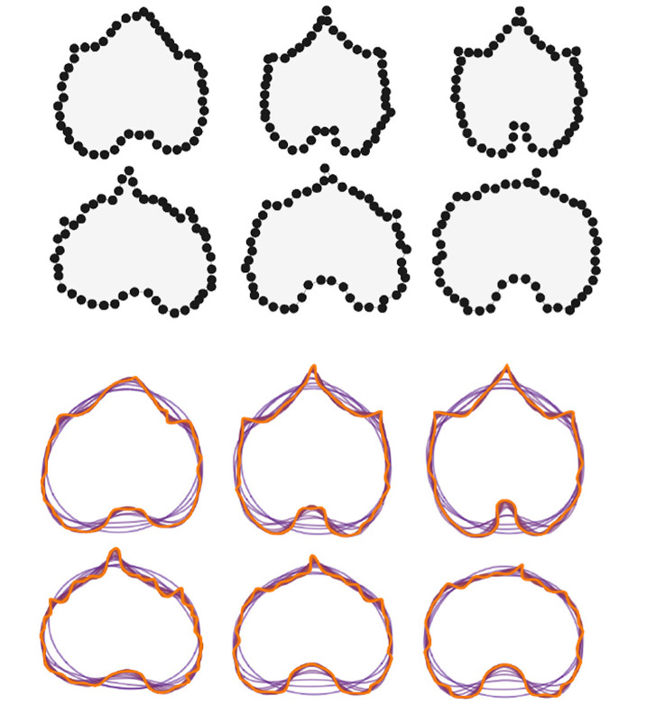
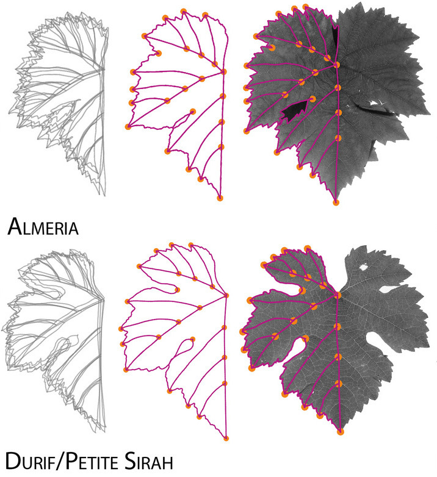
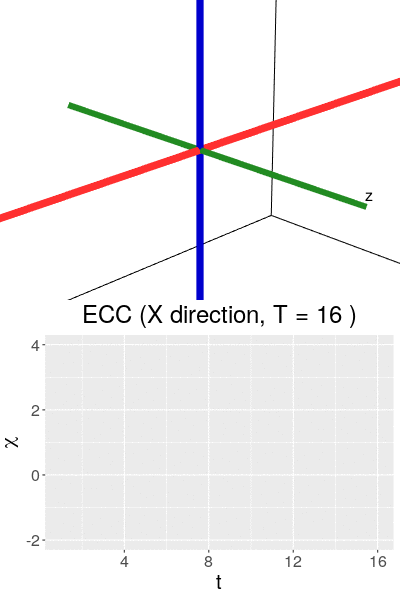
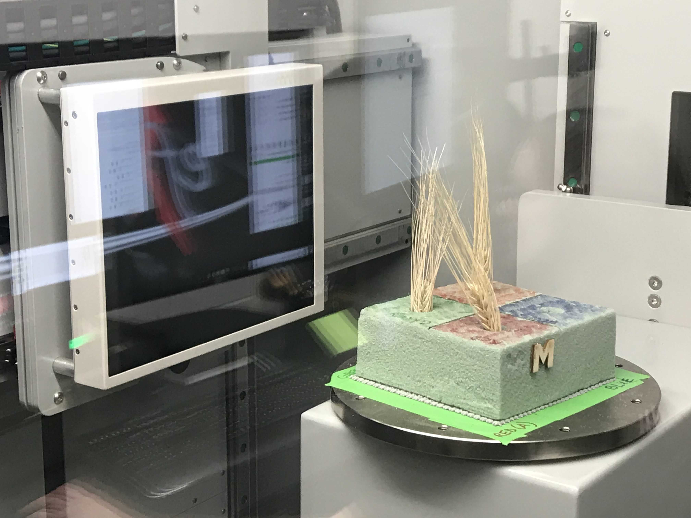
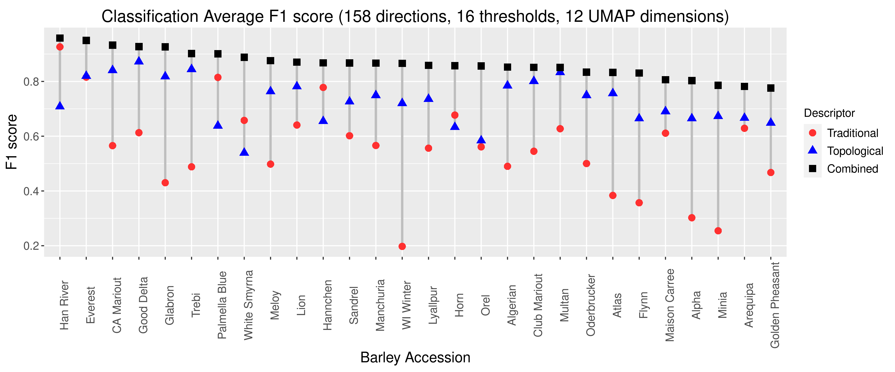

```{r setup, include=FALSE}
library(knitr)

# <!-- Copies an HTML dependency to a subdirectory of the given directory. The subdirectory name willbename-version(for example, "outputDir/jquery-1.11.0"). You may setoptions(htmltools.dir.version= FALSE)to suppress the version number in the subdirectory name. -->
options(htmltools.dir.version = FALSE)
knitr::opts_chunk$set(echo = FALSE)
knitr::opts_chunk$set(fig.align = 'center')
```

background-image: url("../../img/endlessforms.png")
background-size: 150px
background-position: 89% 7%

class: inverse

# Morfología del reino vegetal

<div class="row">
  <div class="column" style="max-width:50%">
    <iframe width="375" height="210" src="https://www.youtube-nocookie.com/embed/oM9kAq0PBvw?controls=0" frameborder="0" allow="accelerometer; autoplay; encrypted-media; gyroscope; picture-in-picture" allowfullscreen></iframe>
    <iframe width="375" height="210" src="https://www.youtube-nocookie.com/embed/V39K58evWlU?controls=0" frameborder="0" allow="accelerometer; autoplay; encrypted-media; gyroscope; picture-in-picture" allowfullscreen></iframe>
  </div>
  <div class="column" style="max-width:50%">
    <iframe width="375" height="210" src="https://www.youtube-nocookie.com/embed/4GBgPIEDoa0?controls=0" frameborder="0" allow="accelerometer; autoplay; encrypted-media; gyroscope; picture-in-picture" allowfullscreen></iframe>
    <iframe width="375" height="210" src="https://www.youtube-nocookie.com/embed/qkOjHHuoUhA?controls=0" frameborder="0" allow="accelerometer; autoplay; encrypted-media; gyroscope; picture-in-picture" allowfullscreen></iframe>
  </div>
</div>

<p style="font-size: 24px; text-align: right; font-family: 'Yanone Kaffeesatz'">Mira más tomografías 3D en <a href="https://www.youtube.com/@endlessforms6756">youtube.com/@endlessforms6756</a></p>

---

# Morfometría Tradicional

```{r, out.width=650}
knitr::include_graphics('https://nph.onlinelibrary.wiley.com/cms/asset/e0e8b362-efee-410a-a293-947c2d57acb9/nph16286-fig-0003-m.jpg')
```
<p style="font-size: 10px; text-align: right; color: Grey;"> Credits: <a href=" https://doi.org/10.1111/nph.16286">Gupta <em>et al.</em> (2019)</a></p>

---

# Métodos morfométricos usuales no son suficientes

.pull-left[
Descriptores Elípticos de Fourier (EFD)

<p style="font-size: 10px; text-align: right; color: Grey;"> Credits: <a href="https://doi.org/10.1016/j.cub.2016.02.033">Chitwood and Sinha (2016)</a></p>
]

.pull-right[
Morfometría Geométrica (GMM)

<p style="font-size: 10px; text-align: right; color: Grey;"> Credits: <a href=" https://doi.org/10.1002/ppp3.10157">Chitwood  (2020)</a></p>
]

---

class: inverse

# Necesitamos algo más robusto para datos más diversos

<div class="row">
  <div class="column" style="max-width:50%">
    <iframe width="375" height="210" src="https://www.youtube-nocookie.com/embed/j0R9mMs5E50?controls=0" title="YouTube video player" frameborder="0" allow="accelerometer; autoplay; clipboard-write; encrypted-media; gyroscope; picture-in-picture" allowfullscreen></iframe>
    <iframe width="375" height="210" src="https://www.youtube-nocookie.com/embed/2FmwkEA3tsY?controls=0" title="YouTube video player" frameborder="0" allow="accelerometer; autoplay; clipboard-write; encrypted-media; gyroscope; picture-in-picture" allowfullscreen></iframe>
  </div>
  <div class="column" style="max-width:50%">
    <iframe width="375" height="210" src="https://www.youtube-nocookie.com/embed/vxcSZsCs5BU?controls=0" title="YouTube video player" frameborder="0" allow="accelerometer; autoplay; clipboard-write; encrypted-media; gyroscope; picture-in-picture" allowfullscreen></iframe>
    <iframe width="375" height="210" src="https://www.youtube-nocookie.com/embed/KXt-C-_OA3o?controls=0" title="YouTube video player" frameborder="0" allow="accelerometer; autoplay; clipboard-write; encrypted-media; gyroscope; picture-in-picture" allowfullscreen></iframe>
  </div>
</div>

<p style="font-size: 24px; text-align: right; font-family: 'Yanone Kaffeesatz'">Mira más tomografías 3D en <a href="https://www.youtube.com/@endlessforms6756">youtube.com/@endlessforms6756</a></p>

---

# Análisis Topológico de Datos (ATD, TDA)

<div class="row">
  <div class="column" style="max-width:25%; font-size: 15px;">
    
    <p style="font-size: 25px; text-align: center; color: DarkRed;"> Datos </p>
    <ul>
      <li> Escanes rayos X </li>
      <li> Nubes de puntos </li>
      <li> Series de tiempo </li>
    <ul>
  </div>
  <div class="column" style="max-width:40%; padding: 0 25px 0 25px; font-size: 15px;">
    
    <p style="font-size: 25px; text-align: center; color: DarkRed;"> Resumen Topológico </p>
    <ul>
      <li> Característica de Euler </li>
      <li> Diagramas de persistencia </li>
      <li> Mapper </li>
    <ul>
  </div>
  <div class="column" style="max-width:35%; font-size: 15px;">
    
    <p style="font-size: 25px; text-align: center; color: DarkRed;"> Análisis </p>
    <ul>
      <li> Estadística </li>
      <li> Aprendizaje de máquina </li>
      <li> Clasificación y predicción </li>
    <ul>
  </div>
</div>

---

class: inverse, middle, center

# 1. Análisis Topológico de Datos

## La Transformada de Característica de Euler (ECT)

---

# 1er ingrediente: Complejos

- Nuestros datos como una colección de bloques elementales ( _células_ )

Vértices | Aristas | Caras | Volúmenes
---------|-------|-------|-------
  0-dim  | 1-dim | 2-dim | 3-dim

- Una colección bien pegada de células: _complejo simplicial_ o _complejo cúbico_

- Contar el número de rasgos topológicos ( _agujeros_ )

Componentes conexas | Ciclos | Vacíos
--------------------|--------|-------
       0-dim        | 1-dim  | 2-dim
    
.pull-left[
```{r, out.width="250px"}
knitr::include_graphics("../../tda/figs/complex-good.svg")
```
- 3 componentes, 1 ciclo, 1 vacío
]

.pull-right[
```{r, out.width="250px"}
knitr::include_graphics("../../tda/figs/cubical_complex_example.svg")
```
- 2 componentes, 3 ciclos, 1 vacío
]


---

# 2do ingrediente: Filtración

- Asignamos un valor real cada simplejo y construimos el complejo poco a poco.

- Observamos cómo cambia el número de rasgos topológicos a medida que crece el complejo

.pull-left[
```{r, out.width="220px"}
knitr::include_graphics(c("../figs/eigcurv_filter.gif", "../figs/gaussian_density_filter.gif"))
```
]

.pull-right[
```{r, out.width="220px"}
knitr::include_graphics(c("../figs/eccentricity_filter.gif", "../figs/vrips_ver2.gif"))
```
]

--

- **Homología persistente**

---

# Ejemplo 1

## Detectar agujeros &rarr; detectar tejido cancerígeno

.pull-left[

]

.pull-right[

]

<p style="font-size: 10px; text-align: right; color: Grey;"> Credits: <a href="https://doi.org/10.1016/j.media.2019.03.014">Qaiser <em>et al.</em> (2019)</a></p>

---

# Ejemplo 2

## Detectar agujeros &rarr; detectar recombinaciones

.pull-left[

]

.pull-right[

]

<p style="font-size: 10px; text-align: right; color: Grey;"> Credits: <a href="https://doi.org/10.1073/pnas.1313480110">Chan <em>et al.</em> (2013)</a></p>

---

# Ejemplo 3

## Detectar agujeros &rarr; detectar conformaciones abiertas y cerradas

.pull-left[


]

.pull-right[

]

<p style="font-size: 10px; text-align: right; color: Grey;"> Credits: <a href="https://doi.org/10.1515/sagmb-2015-0057">Kovacev-Nikolic <em>et al.</em> (2016)</a></p>

---

class: inverse

# Interludio comercial

- Más información y referencias sobre la teoría matemática de ATD y sus aplicaciones a biología

> Amézquita _et al._ (2020) "The shape of things to come: Topological data analysis and biology, from molecules to organisms". _Developmental Dynamics_ 249(7) pp. 816-833. DOI: [10.1002/dvdy.175](https://doi.org/10.1002/dvdy.175)


--

- Más herramientas de ATD: mapper, panoramas de persistencia, viñedos de persistencia, imágenes de persistencia, etc.

---

# La característica de Euler

$$\chi = \#(\text{Vértices}) - \#(\text{Aristas}) + \#(\text{Caras}).$$
```{r, out.width=400}
knitr::include_graphics("../../tda/figs/euler_characteristic_2.png")
```

- Resumimos todos los rasgos topológicos con la fórmula de Euler-Poincaré,

$$\chi = \#(\text{Componentes Conexas}) - \#(\text{Ciclos}) + \#(\text{Vacíos}).$$


- La característica de Euler es un **invariante topológico**.

---

background-image: url("../figs/ecc_ver2.gif")
background-size: 750px
background-position: 50% 90%

# Curva de Característica de Euler (ECC)

- Consideramos un complejo $X\subset\mathbb{R}^d$
- Una dirección unitaria $\nu\in S^{d-1}$

- Y el subcomplejo que contiene todas las células debajo de la altura $h$ respecto a la dirección $\nu$
$$X(\nu)_h =\{\Delta \in X\::\:\langle x,\nu\rangle\leq h\text{ for all }x\in\Delta\}$$

- La Curva de Característica de Euler de dirección $\nu$ se define como la sucesión $$\{\chi(X(\nu)_h)\}_{h\in\mathbb{R}}$$

---

background-image: url("../figs/ect_ver2.gif")
background-size: 800px
background-position: 50% 88%

## Transformada de Característica de Euler (ECT)

- Repetimos para todas las direcciones posibles.

- Más formalmente, la ECT es una función

$$
\begin{split}
ECT(X):\; & S^{d-1} \to \mathbb{Z}^{\mathbb{R}}\\
&\nu\mapsto\{\chi(X(\nu)_h)\}_{h\in\mathbb{R}}.
\end{split}
$$


---

# ¿Porqué la transformada ECT?

--

- Es fácil de calcular: una simple sucesión de sumas

--

[**Teorema _(Turner, Mukherjee, Boyer 2014)_**](https://doi.org/10.1093/imaiai/iau011): La ECT es inyectiva para complejos simpliciales finitos en 3D

[**Teorema _(ibid)_**](https://arxiv.org/abs/1310.1030): La ECT es una estadística suficiente para complejos simpliciales finitos en 3D

--

_Traducción:_ 

- Dada todas las (infinitas) ECCs correspondientes a todas las direcciónes

- Complejos simpliciales *distintos* corresponden a ECTs *distintas*

- La ECT en efecto resume toda la información posible respecto a la forma de nuestro complejo

--

Desarrollar un algoritmo eficiente de reconstrucción de objetos en 3D a partir de una colección finita de direcciones sigue siendo un problema abierto ([Betthauser 2018](https://people.clas.ufl.edu/peterbubenik/files/Betthauser_Thesis.pdf); [Curry et al. 2018](https://arxiv.org/abs/1805.09782); [Fasy et al. 2019](https://arxiv.org/abs/1912.12759)).

---

class: inverse, middle, center

# 2. Cebada

## Cuantificando la morfología de la cebada usando la Característica de Euler

### Amézquita et al. (2021) [Measuring hidden phenotype: Quantifying the shape of barley seeds using the Euler Characteristic Transform](https://doi.org/10.1093/insilicoplants/diab033)

---

class: inverse

<div class="row">
  <div class="column" style="max-width:44%">
    <a href="https://kizilvest.ru/20150827-v-kizilskom-rajone-nachalas-uborochnaya-strada/" target="_blank"></a>
    <a href="https://ipad.fas.usda.gov/highlights/2008/11/eth_25nov2008/" target="_blank"></a>
    <a href="https://www.doi.org/10.1007/978-1-4419-0465-2_2168" target="_blank"></a>
  </div>
  <div class="column" style="max-width:44%">
    <a href="https://www.resilience.org/stories/2020-03-09/the-last-crop-before-the-desert/" target="_blank"></a>
    <a href="https://www.tibettravel.org/tibetan-culture/highland-barley.html" target="_blank"></a>
    <a href="https://www.nationalgeographic.co.uk/travel/2020/05/photo-story-from-barley-fields-to-whisky-barrels-in-rural-scotland" target="_blank"></a>
  </div>
  <div class="column" style="max-width:8%; font-size: 15px;">
    <p style="text-align: center; font-size: 30px; line-height: 1em;"><strong>Cebada del mundo</strong></p>
    <p>Kiliskoye (Chelyabinsk, Rusia)</p>
    <p>Marchouch (Rabat, Marruecos)</p>
    <p>Aksum (Tigray, Etiopía)</p>
    <p>Salar (Tsetang, Tíbet)</p>
    <p>Expansión de la cebada</p>
    <p>Turriff (Aberdeenshire, Scotland)</p>
    <p style="font-size:9px;line-height: 1em;">Click on any picture for more details and credits</p>
  </div>
</div>

---

# Experimento Cross Composite II

.pull-right[

]

---

background-image: url("../figs/composite_cross_v_01.png")
background-size: 425px
background-position: 95% 90%

# Experimento Cross Composite II

.pull-left[


- **28 fundadores/variedades** $(F_0)$
]

.pull-right[

]

---

background-image: url("../figs/composite_cross_v_02.png")
background-size: 425px
background-position: 95% 90%

# Experimento Cross Composite II

.pull-left[


- **28 fundadores/variedades** $(F_0)$

- Cruzamos ${28 \choose 2}$ **híbridos** $(F_1)$
]

.pull-right[

]

---

background-image: url("../figs/composite_cross_v_03.png")
background-size: 425px
background-position: 95% 90%

# Experimento Cross Composite II

.pull-left[


- **28 fundadores/variedades** $(F_0)$

- Cruzamos ${28 \choose 2}$ **híbridos** $(F_1)$

- **Auto-polinizar** los 379 híbridos resultantes
]

.pull-right[

]

---

background-image: url("../figs/composite_cross_v_04.png")
background-size: 425px
background-position: 95% 90%

# Experimento Cross Composite II

.pull-left[


- **28 fundadores/variedades** $(F_0)$

- Cruzamos ${28 \choose 2}$ **híbridos** $(F_1)$

- **Auto-polinizar** los 379 híbridos resultantes

- Cada línea crece en un área distinta en un terreno abierto.
]

.pull-right[

]

---

background-image: url("../figs/composite_cross_v_05.svg")
background-size: 425px
background-position: 95% 90%

# Experimento Cross Composite II

.pull-left[


- **28 fundadores/variedades** $(F_0)$

- Cruzamos ${28 \choose 2}$ **híbridos** $(F_1)$

- **Auto-polinizar** los 379 híbridos resultantes

- Cada línea crece en un área distinta en un terreno abierto **por 58 generaciones**.
]

.pull-right[

]

---

## Datos: rayos X &rarr; Procesamiento de imágenes

<div class="row">
  <div class="column" style="max-width:37.5%; color: Navy; font-size: 15px;">
    
    <p style="text-align: center;">Cebada enviada desde California</p>
  </div>
</div>

---

## Datos: rayos X &rarr; Procesamiento de imágenes

<div class="row">
  <div class="column" style="max-width:37.5%; color: Navy; font-size: 15px;">
    
    <p style="text-align: center;">Cebada enviada desde California</p>
  </div>
  <div class="column" style="max-width:50%; color: Navy; font-size: 15px;">
    
    <p style="text-align: center;">Reconstrucción de tomografías 3D &reg;</p>
  </div>
</div>

---

## Datos: rayos X &rarr; Procesamiento de imágenes

<div class="row">
  <div class="column" style="max-width:37.5%; color: Navy; font-size: 15px;">
    
    <p style="text-align: center;">Cebada enviada desde California</p>
  </div>
  <div class="column" style="max-width:50%; color: Navy; font-size: 15px;">
    
    <p style="text-align: center;">Reconstrucción de tomografías 3D &reg;</p>
  </div>
</div>

<div class="row">
  <div class="column" style="max-width:38%; color: Navy; font-size: 15px;">
    
    <p style="text-align: center;">Creatividad para escanear</p>
  </div>
</div>

---

## Datos: rayos X &rarr; Procesamiento de imágenes

<div class="row">
  <div class="column" style="max-width:37.5%; color: Navy; font-size: 15px;">
    
    <p style="text-align: center;">Cebada enviada desde California</p>
  </div>
  <div class="column" style="max-width:50%; color: Navy; font-size: 15px;">
    
    <p style="text-align: center;">Reconstrucción de tomografías 3D &reg;</p>
  </div>
</div>

<div class="row">
  <div class="column" style="max-width:38%; color: Navy; font-size: 15px;">
    
    <p style="text-align: center;">Creatividad para escanear</p>
  </div>
  <div class="column" style="max-width:17.5%; color: Navy; font-size: 15px;">
    
    <p style="text-align: center;"> 975 espigas </p>
  </div>
  <div class="column" style="max-width:17%; color: Navy; font-size: 15px;">
    
    <p style="text-align: center;"> 3 generaciones </p>
  </div>
</div>

---

## Datos: rayos X &rarr; Procesamiento de imágenes

<div class="row">
  <div class="column" style="max-width:37.5%; color: Navy; font-size: 15px;">
    
    <p style="text-align: center;">Cebada enviada desde California</p>
  </div>
  <div class="column" style="max-width:50%; color: Navy; font-size: 15px;">
    
    <p style="text-align: center;">Reconstrucción de tomografías 3D &reg;</p>
  </div>
</div>

<div class="row">
  <div class="column" style="max-width:38%; color: Navy; font-size: 15px;">
    
    <p style="text-align: center;">Creatividad para escanear</p>
  </div>
  <div class="column" style="max-width:17.5%; color: Navy; font-size: 15px;">
    
    <p style="text-align: center;"> 975 espigas </p>
  </div>
  <div class="column" style="max-width:17%; color: Navy; font-size: 15px;">
    
    <p style="text-align: center;"> 3 generaciones </p>
  </div>
  <div class="column" style="max-width:20.5%; color: Navy; font-size: 15px;">
    
    <p style="text-align: center;"> 38,000 semillas </p>
  </div>
</div>

---

## Procesamiento de imágenes &rarr; Descriptores tradicionales

.pull-left[
- Longitud
- Ancho
- Altura
- Área de superficie
- Volumen


]

--

.pull-right[


]

---

background-image: url("../figs/S012_L2_Blue_33.png")
background-size: 150px
background-position: 99% 50%

# Juego y estrategia

- **Meta:** Clasificar 28 variedades de cebada usando únicamente información morfológica de los granos.

- **3121** granos en total

--

.pull-left[
```{r, out.width=150}
knitr::include_graphics('../figs/pole_directions_p7_m12_crop.jpg')
```
]

.pull-right[
- 158 direcciones
- 16 rebanadas por dirección
- Cada semilla es asociada a un vector $158\times16=2528$-dim
- Dimensiones reducidas por separado con KPCA y UMAP
]


--

- Comparamos **3** conjuntos de descriptores morfológicos

Descriptor | No. of descriptors
-----------|--------------------
Tradicional | 11
Topológico (ECT &rarr; KPCA/UMAP) | ~~2528~~ &rarr; 12
Combinado (Trad &oplus; Topo) | 23

--

- Muestreamos aleatoriamente 75/25 para entrenamiento y prueba.

- Repetimos el muestreo y SVM 100 veces y consideramos el promedio.

---

# Clasificación de 28 líneas con SVM

<style type="text/css">
.tg  {border-collapse:collapse;border-color:#93a1a1;border-spacing:0;margin:0px auto;}
.tg td{background-color:#fdf6e3;border-bottom-width:1px;border-color:#93a1a1;border-style:solid;border-top-width:1px;
  border-width:0px;color:#002b36;font-family:Arial, sans-serif;font-size:14px;overflow:hidden;padding:10px 5px;
  word-break:normal;}
.tg th{background-color:#657b83;border-bottom-width:1px;border-color:#93a1a1;border-style:solid;border-top-width:1px;
  border-width:0px;color:#fdf6e3;font-family:Arial, sans-serif;font-size:14px;font-weight:normal;overflow:hidden;
  padding:10px 5px;word-break:normal;}
.tg .tg-2bhk{background-color:#eee8d5;border-color:inherit;text-align:left;vertical-align:top}
.tg .tg-0pky{border-color:inherit;text-align:left;vertical-align:top}
.tg .tg-gyvr{background-color:#eee8d5;border-color:inherit;font-size:100%;text-align:left;vertical-align:top}
</style>
<table class="tg">
<thead>
  <tr>
    <th class="tg-0pky">Descriptores</th>
    <th class="tg-0pky">No. de descriptores</th>
    <th class="tg-0pky">Precisión</th>
    <th class="tg-0pky">Recall</th>
    <th class="tg-0pky">F1</th>
  </tr>
</thead>
<tbody>
  <tr>
    <td class="tg-2bhk">Tradicional</td>
    <td class="tg-2bhk">11</td>
    <td class="tg-2bhk">0.57 &plusmn; 0.058</td>
    <td class="tg-2bhk">0.56 &plusmn; 0.019</td>
    <td class="tg-2bhk">0.55 &plusmn; 0.019</td>
  </tr>
  <tr>
    <td class="tg-0pky">Topológico</td>
    <td class="tg-0pky">12</td>
    <td class="tg-0pky">0.75 &plusmn; 0.047</td>
    <td class="tg-0pky">0.75 &plusmn; 0.016</td>
    <td class="tg-0pky">0.74 &plusmn; 0.016</td>
  </tr>
  <tr>
    <td class="tg-2bhk">Combinado</td>
    <td class="tg-2bhk">23</td>
    <td class="tg-2bhk">0.87 &plusmn; 0.031</td>
    <td class="tg-2bhk">0.86 &plusmn; 0.010</td>
    <td class="tg-2bhk">0.86 &plusmn; 0.010</td>
  </tr>
</tbody>
</table>

```{r, out.width=700}

```

---

# Descriptores morfológicos tradicionales


---

# Descriptores morfólogicos topológicos + UMAP


---

# Descriptores morfológicos topológicos + KPCA


---

# Información topológica al descubierto

.pull-left[
- Análisis de varianzar para determinar las direcciones y rebanadas más relevantes.

- La hendidura central y la parte inferior de la semilla es bastante descriptiva!

```{r, out.width=300}
knitr::include_graphics(c('../figs/kruskal_wallis_topo_summary.jpg'))
```
]

--

.pull-right[
```{r, out.width=225}
knitr::include_graphics(c('../figs/discerning_directions.png'))#, '../figs/arrow_seed_09_0.gif'))
```


]

---

# Moviéndonos a terreno semi-supervisado

- Entrenamos un SVM con el 100% de los fundadores $(F_0)$

- Clasificamos a la progenie $(F_{18}\text{ and }F_{58})$ para detectar enriquecimiento de genotipo.

.pull-left[

]

.pull-right[

]


---
class: right, bottom, inverse

background-image: url("../figs/acknowledgments.jpg")
background-size: 1000px
background-position: 50% 40%

- [`https://bit.ly/cebada_atd`](https://www.egr.msu.edu/~amezqui3/barley/slides/sembiomat_2021.html)