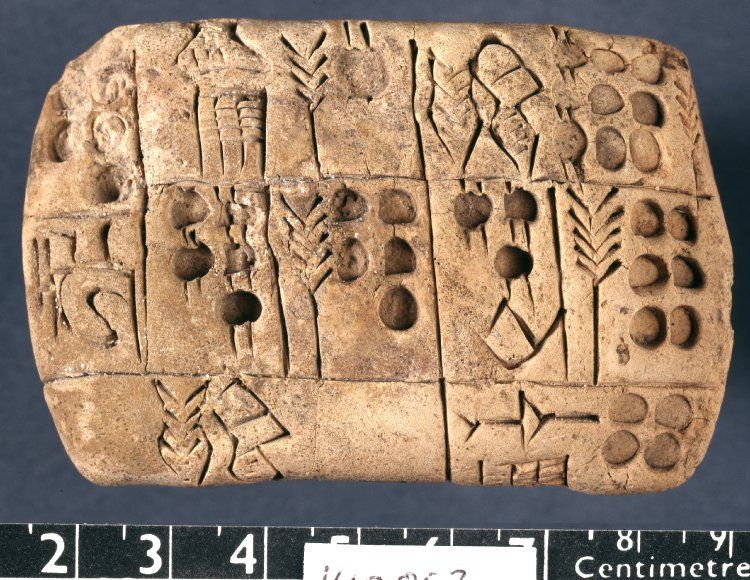
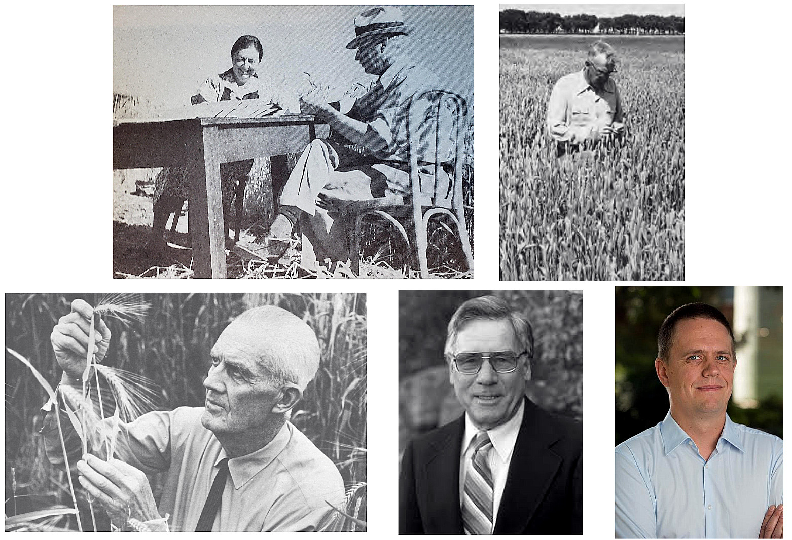
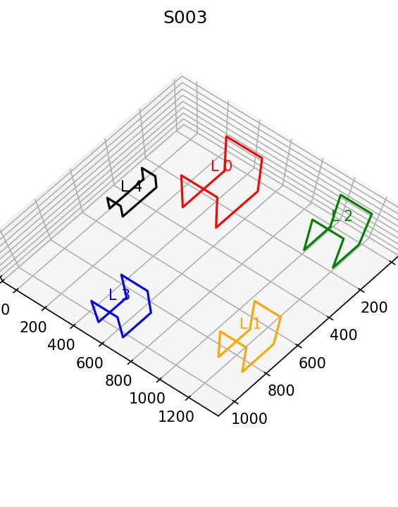
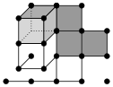
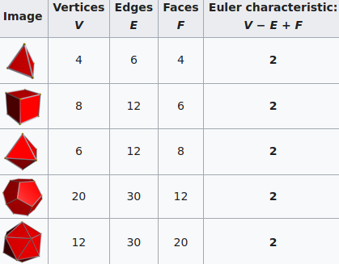

background-image: url("../figs/fam9_3.png")
background-size: 150px
background-position: 95% 5%

# Cómo inició todo...

- Fragmento de febrero 2016. (Énfasis propio)

> Estimados Estudiantes de Licenciaturas de Demat,
>
> Se les hace una cordial invitación a participar como estudiantes de verano (con posibilidad de comenzar a pensar en una tesis en el futuro), en el proyecto interdisciplinario de Análisis Topológico de Datos-ATD aplicado a objetos Arqueológicos en 3D. 
>
> Se anticipa que partes de este proyecto requerirán de elementos de **análisis funcional, análisis armónico, topología/geometría diferencial, probabilidad y estadística, homología y programación**. Algunos elementos se tendrán que aprender sobre cómo parte de la participación.

--

- Fui el único que manifestó interes

--

- Sabía prácticamente nada de los requisitos.

---

```{r setup, include=FALSE}
library(reticulate)
library(knitr)

# <!-- Copies an HTML dependency to a subdirectory of the given directory. The subdirectory name willbename-version(for example, "outputDir/jquery-1.11.0"). You may setoptions(htmltools.dir.version= FALSE)to suppress the version number in the subdirectory name. -->
options(htmltools.dir.version = FALSE)

knitr::opts_chunk$set(echo = FALSE)
knitr::opts_chunk$set(fig.align = 'center')
knitr::opts_chunk$set(engine.path = list(
  python = '/usr/bin/python3',
  ruby = '/usr/bin/ruby'
))
```

class: inverse

# Ahora: Morfología botánica

<div class="row">
  <div class="column" style="max-width:50%">
    <iframe width="375" height="210" src="https://www.youtube-nocookie.com/embed/oM9kAq0PBvw?controls=0" frameborder="0" allow="accelerometer; autoplay; encrypted-media; gyroscope; picture-in-picture" allowfullscreen></iframe>
    <iframe width="375" height="210" src="https://www.youtube-nocookie.com/embed/V39K58evWlU?controls=0" frameborder="0" allow="accelerometer; autoplay; encrypted-media; gyroscope; picture-in-picture" allowfullscreen></iframe>
  </div>
  <div class="column" style="max-width:50%">
    <iframe width="375" height="210" src="https://www.youtube-nocookie.com/embed/4GBgPIEDoa0?controls=0" frameborder="0" allow="accelerometer; autoplay; encrypted-media; gyroscope; picture-in-picture" allowfullscreen></iframe>
    <iframe width="375" height="210" src="https://www.youtube-nocookie.com/embed/qkOjHHuoUhA?controls=0" frameborder="0" allow="accelerometer; autoplay; encrypted-media; gyroscope; picture-in-picture" allowfullscreen></iframe>
  </div>
</div>

---

# Análisis Topológico de Datos (ATD)

<div class="row">
  <div class="column" style="max-width:25%; font-size: 15px;">
    
    <p style="font-size: 25px; text-align: center; color: DarkRed;"> Datos </p>
    <ul>
      <li> Escanes rayos X </li>
      <li> Nubes de puntos </li>
      <li> Series de tiempo </li>
    <ul>
  </div>
  <div class="column" style="max-width:40%; padding: 0 25px 0 25px; font-size: 15px;">
    
    <p style="font-size: 25px; text-align: center; color: DarkRed;"> Resumen Topológico </p>
    <ul>
      <li> Característica de Euler </li>
      <li> Diagramas de persistencia </li>
      <li> Mapper </li>
    <ul>
  </div>
  <div class="column" style="max-width:35%; font-size: 15px;">
    
    <p style="font-size: 25px; text-align: center; color: DarkRed;"> Análisis </p>
    <ul>
      <li> Estadística </li>
      <li> Aprendizaje de máquina </li>
      <li> Clasificación y predicción </li>
    <ul>
  </div>
</div>

---

background-image: url("../figs/seed.png")
background-size: 400px
background-position: 99% 99%

# Resumen de hoy

### La charla será muy modular

1. Botánica: cebada

1. ~~Genética: Zigosidad~~

1. Procesamiento de imágenes

1. Transformada de característica de Euler

1. Aprendizaje de máquina y resultados

1. Genética en el horizonte

### Aventuras interdisciplinarias 

---

class: center, middle, inverse

# 1. Botánica: Cebada

---

class: inverse

<div class="row">
  <div class="column" style="max-width:44%">
    <!-- <a href="https://www.thescottishfarmer.co.uk/arable/14364703.hybrid-barley-pays-off-for-mixed-farming-too/" target="_blank"></a> -->
    <a href="https://cereal.interreg-npa.eu/subsites/CEREAL/Barley_cultivation-Norway_Presentation_2018.pdf" target="_blank"></a>
    <a href="https://www.resilience.org/stories/2020-03-09/the-last-crop-before-the-desert/" target="_blank"></a>
    <a href="https://ipad.fas.usda.gov/highlights/2008/11/eth_25nov2008/" target="_blank"></a>
  </div>
  <div class="column" style="max-width:44%">
    <a href="https://kizilvest.ru/20150827-v-kizilskom-rajone-nachalas-uborochnaya-strada/" target="_blank"></a>
    <a href="https://www.bloomberg.com/news/articles/2020-09-13/iraq-to-offer-first-ever-barley-exports-as-rains-yield-surplus" target="_blank"></a>
    <a href="https://thewire.in/agriculture/covid-19-lockdown-crop-harvest-farmers" target="_blank"></a>
  </div>
  <div class="column" style="max-width:8%; font-size: 15px;">
    <p style="text-align: center; font-size: 25px; line-height: 1em;"> <strong> Cebada en todo el mundo </strong></p>
    <p>Tjøtta (Nordland, Noruega)</p>
    <p>Kiliskoye (Chelyabinsk, Rusia)</p>
    <p>Marchouch (Rabat, Marruecos)</p>
    <p>Bagdad (Bagdad, Irak) </p>
    <p>Aksum (Tigray, Etiopía) </p>
    <p>Hanumangarh (Rajasthan, India) </p>
    <p style="font-size:9px;line-height: 1em;">Creditos y detalles al dar click en cada imagen</p>
  </div>
</div>

---

# ¡Semillas con morfología diversa!

<div class="row">
  <div class="column" style="max-width:45%">
    <a href="https://www.nationalgeographic.co.uk/travel/2020/05/photo-story-from-barley-fields-to-whisky-barrels-in-rural-scotland" target="_blank"></a>
  </div>
  <div class="column" style="max-width:55%">
    <a href="https://www.tibettravel.org/tibetan-culture/highland-barley.html" target="_blank"></a>
    <a href="https://www.doi.org/10.1007/978-1-4419-0465-2_2168" target="_blank"></a>
    <p style="font-size: 15px; line-height: 1em"> Cebada de Escocia y el Tibet. </p>
    <p style="font-size: 15px; line-height: 1em"> Expansión histórica de la cebada como cultivo. </p>
    <p style="font-size:9px;line-height: 1em;">Créditos y detalles al dar click en cada imagen</p>
  </div>
</div>


---

# Cebada: con nosotros desde el inicio

<p style="font-size: 15px; text-align: left; color: DimGrey;"> Tabletas cuneiformes de Mesopotamia con espigas de cebada </p>
<div class="row">
  <div class="column" style="max-width:30%">
    
    
  </div>
  <div class="column" style="max-width:35%">
    
    <p style="font-size: 15px; text-align: center; color: DimGrey;"> Registro egipcio del consumo de cerveza </p>
  </div>
  <div class="column" style="max-width:35%">
    
    <p style="font-size: 15px; text-align: center; color: DimGrey;"> Cebada y arqueobotánica (Cueva Yoram, Israel. <a href="http://dx.doi.org/10.1038/ng.3611" target="_blank">Mascher et al 2016)</a></p>
  </div>
</div>

--

- La cebada es el 4to grano más cultivado, después del maíz, arroz y trigo. [(FAO 2020)](https://doi.org/10.4060/cb1993en)

---

background-image: url("../figs/composite_hybrid_mixture.jpg")
background-size: 400px
background-position: 95% 5%


# Cruce Compuesto II (CC II)

<div class="row">
  <div class="column" style="max-width:50%">
    
    <p style="font-size: 15px; color: DimGrey;"> Esquina superior izquierda:  </p>
    <p style="font-size: 15px; text-align: center; color: DimGrey;"> Mary Martini, Harry Harlan, Coit Suneson, G.A. Wiebe, Robert Allard, Dan Koenig  </p>
  </div>
  <div class="column" style="max-width:50%">
    
    <p style="font-size: 15px; text-align: center; color: DimGrey;"> 28 sepas fundadoras </p>
  </div>
</div>

- Experimento iniciado en 1929 en Aberdeen, Idaho
- En búsqueda del mejor cruce posible para California
- Enfoque y mantenimiento en UC Davis y UC Riverside

---

background-image: url("../figs/composite_cross_v_05.svg")
background-size: 450px
background-position: 95% 50%

# Diseño del experimento

.pull-left[
- 28 variedades fundadoras
- Consideramos todos los posibles cruces de los fundadores ( $F_1$ )
- Autopolinizamos cada uno de los híbridos ( $F_2$ )
- Plantamos la progenie y les permitimos autopolinizarse
- Vemos pasar casi 60 generaciones
- Contamos con semillas de cada generación y linaje
    - Cuantificar la morfología
    - Secuenciar el ADN
    - ¿Cuáles genes fueron favorecidos?
    - ¿Cómo cambió la morfología?
]

---

background-image: url("../figs/composite_cross_v_05.svg")
background-size: 450px
background-position: 95% 50%

# Diseño del experimento

.pull-left[
- **28 variedades** fundadoras
- Consideramos todos los posibles cruces de los fundadores ( $F_1$ )
- Autopolinizamos cada uno de los híbridos ( $F_2$ )
- Plantamos la progenie y les permitimos autopolinizarse
- Vemos pasar casi 60 generaciones
- Contamos con semillas de cada generación y linaje
    - **Cuantificar la morfología**
    - Secuenciar el ADN
    - ¿Cuáles genes fueron favorecidos?
    - ¿Cómo cambió la morfología?
]

---

class: center, middle, inverse

# ~~2. Genética: Zigosidad~~

---

class: inverse, center, middle

# 3. Procesamiento de imágenes

## Escanes 3D de rayos X

---

background-image: url("../figs/barley_lab_composition.jpg")
background-size: 750px
background-position: 99% 99%

# Tomografías 3D

.pull-left[
Imágenes voxelizadas

Resolución de ~30 micras

En tandas de 4

¡2Gb+ por cada escán!
]

---

class: inverse, right
background-image: url("../figs/barley_hpcc.png")
background-size: 1300px
background-position: 0% 0%


# Procesamiento de imágenes _ad-hoc_

<div class="row">
  <div class="column" style="max-width:12%; color: Yellow; font-size: 15px;">
    
    <p style="text-align: center; background-color: #808080;"> Original </p>
  </div>
  <div class="column" style="max-width:12%; color: Yellow; font-size: 15px;">
    
    <p style="text-align: center; background-color: #808080;"> Estándar </p>
  </div>
  <div class="column" style="max-width:12%; color: Yellow; font-size: 15px;">
    
    <p style="text-align: center; background-color: #808080;"> Limpio </p>
  </div>
  <div class="column" style="max-width:12%; color: Yellow; font-size: 15px;">
    
    <p style="text-align: center; background-color: #808080;"> Podado </p>
  </div>
  <div class="column" style="max-width:26%; color: Yellow; font-size: 15px;">
    
    <p style="text-align: center; background-color: #808080;"> Etiquetado </p>
  </div>
  <div class="column" style="max-width:20%; color: Yellow; font-size: 15px;">
    
    <p style="text-align: center; background-color: #808080;"> ¡Análisis! </p>
  </div>
</div>

--

- 224 escanes

- 875 espigas

- 3 generaciones

---

# Interés en la distribución de semillas

<div class="row">
  <div class="column" style="max-width:63%; padding: 0px 50px;">
    
    
  </div>
  <div class="column" style="max-width:12%; color: Yellow; font-size: 15px; background-color: DarkRed; padding: 5px; border-radius: 15px 0px 0px 30px;">
    
    
    <p style="text-align: right;"><strong> Semillas</strong></p>
  </div>
  <div class="column" style="max-width:12%; color: Yellow; text-align: center; font-size: 15px; background-color: DarkRed; padding: 5px;">
    
    
    <p><strong>atípicas</strong></p>
  </div>
  <div class="column" style="max-width:12%; color: Yellow; text-align: center; font-size: 15px; background-color: DarkRed; padding: 5px; border-radius: 0px 15px 30px 0px;">
    
    
    <p><strong> (Outliers) </strong></p>
  </div>
  
</div>

- $\sim38,000$ semillas limpias.
- Se vale descartar el 10% de la muestra.
- Verificamos que las semillas atípicas no están concentradas.

---

background-image: url("../figs/seed_mesh.png")
background-size: 250px
background-position: 80% 60%

# Medidas tradicionales

Todas las semillas son elipsoides: alineamiento basado en componentes principales

.pull-left[
- Longitud
- Altura
- Ancho
- Área superficial
- Volumen
- Superficie convexa
- Volumen convexo


]

---

# Evolución morfológica y alometría

<div class="row">
  <div class="column" style="max-width:16%; color: Yellow; font-size: 15px;">
    
    
  </div>
  <div class="column" style="max-width:16%; color: Yellow; font-size: 15px;">
    
    
  </div>
  <div class="column" style="max-width:16%; color: Yellow; font-size: 15px;">
    
    
  </div>
  <div class="column" style="max-width:16%; color: Yellow; font-size: 15px;">
    
    
  </div>
  <div class="column" style="max-width:41%; color: Yellow; font-size: 15px;">
    
    
    
  </div>
</div>

---

# El tamaño sí importa

<div class="row">
  <div class="column" style="max-width:50%">
    
    
  </div>
  <div class="column" style="max-width:50%">
    
    
  </div>
</div>

---

class: inverse, middle, center

# 4. Análisis Topológico de Datos

## La Transformada de Característica de Euler (ECT)

---

# 1er ingrediente: Complejos

- Nuestro conjunto de puntos/datos como una colección de vértices, aristas, triángulos, tetrahedros

- _Simplejos_ de dimensión $0,1,2,3$ respectivamente.

- Una colección bien pegada: _complejo simplicial_

- Contar el número de rasgos topológicos
    - Componentes conexas
    - Ciclos
    - Vacíos
    
.pull-left[
```{r, out.width="250px"}
knitr::include_graphics("../../tda/figs/complex-good.svg")
```
- 3 componentes, 1 ciclo, 1 vacío
]

.pull-right[
```{r, out.width="250px"}

```
- 2 componentes, 3 ciclos, 1 vacío
]

---

# 2do ingrediente: Filtración

- Asignamos un valor real cada simplejo y construimos el complejo poco a poco.

- Observamos como cambia el número de rasgos topológicos a medida que crece el complejo

.pull-left[
```{r, out.width="250px"}
knitr::include_graphics(c("../figs/eigcurv_filter.gif", "../figs/gaussian_density_filter.gif"))
```
]

.pull-right[
```{r, out.width="250px"}
knitr::include_graphics(c("../figs/eccentricity_filter.gif", "../figs/vrips_ver2.gif"))
```
]

---

# La característica de Euler

$$\chi = \#(\text{Vértices}) - \#(\text{Aristas}) + \#(\text{Caras}).$$
```{r, out.width=400}

```

- Resumimos todos los rasgos topológicos con la fórmula de Euler-Poincaré,

$$\chi = \#(\text{Componentes Conexas}) - \#(\text{Ciclos}) + \#(\text{Vacíos}).$$


- La característica de Euler es un **invariante topológico**.
---

# Imágenes como complejos cúbicos

- Misma idea para otras _celdas_ regulares: _complejo cúbico_

--

```{r, out.width="600px"}
knitr::include_graphics("../../tda/figs/binary_to_cubical_complex_es.svg", auto_pdf = TRUE)
```

---

class: center
background-image: url("../../tda/figs/euler_characteristic_variety.jpg")
background-size: 900px
background-position: 50% 80%

# Característica de Euler para formas diferentes

La característica de Euler es un invariante topológico: invariante ante transformaciones suaves

.pull-left[
Si la característica de Euler es **diferente**, los dos espacios/figuras son topológicamente distintos
]

.pull-right[
Si los espacios son topológicamente distintos, la característica de Euler **puede ser igual.**
]

---

background-image: url("../figs/ecc_X.gif")
background-size: 300px
background-position: 90% 60%

# Curva de característica de Euler (ECC)

.pull-left[
- Un complejo simplicial/cúbico finito $M\subset\mathbb{R}^d$
- Una dirección $\nu\in S^{d-1}$

- La función de altura $f_{\nu}: M\to\mathbb R$ 

- Definida como $f_{\nu}: x\mapsto\langle x,\nu\rangle$.

- La filtración asociada
$f_{\nu}^{-1}(-\infty,r\rbrack\simeq\{\Delta \in M : \langle x, \nu\rangle\leq r\:\forall	\,x\in\Delta \}$

- Definimos la curva de característica de Euler $\chi(M,\nu):\mathbb{R}\to\mathbb{Z}$ 

$\chi(M,\nu)(r) = \chi(f_\nu^{-1}((-\infty,r\rbrack)).$
]

---

background-image: url("../figs/ect.gif")
background-size: 700px
background-position: 50% 90%

## Transformada de característica de Euler (ECT)

- Definimos $ECT(M): S^{d-1}\to\mathbb{Z}^{\mathbb{R}}$ con $\nu\mapsto\chi(M,\nu)$
- Concatenamos una cantidad infinita de ECCs.

---

# ¿Porqué la transformada ECT?

--

- Es fácil de calcular: una simple sucesión de sumas

--

[**Teorema _(Turner, Mukherjee, Boyer 2014)_**](https://doi.org/10.1093/imaiai/iau011): La ECT es inyectiva para complejos simpliciales finitos en 3D

--

[**Teorema _(ibid)_**](https://arxiv.org/abs/1310.1030): La ECT es una estadística suficiente para complejos simpliciales finitos en 3D

--

_Traducción:_ 

- Dada todas las (infinitas) ECCs correspondientes a todas las direcciónes

- Complejos simpliciales *distintos* corresponden a ECTs *distintas*

- La ECT en efecto resume toda la información posible respecto a la forma de nuestro complejo

--

Avances en reconstrucción práctica: construir un complejo simplicial a partir de una colección finita de ECCs. ([Turner, Curry](https://arxiv.org/abs/1805.09782), [Fasy](https://arxiv.org/abs/1912.12759), [Ghrist](https://doi.org/10.1007/s41468-018-0017-1))

---

# Idea de inyectividad

```{r, out.width="775px", out.height="475px"}
knitr::include_graphics("../../tda/slides/lab200330.pdf")
```

---

class: inverse, center, middle

# 5. Aprendizaje de máquina

## Resultados de ECT

---

background-image: url("../figs/pole_directions_102.png")
background-size: 350px
background-position: 90% 50%

# Calculando la ECT de cada semilla

.pull-left[
- Con los ejes alineados, podemos asociar las mismas direcciónes a las mismas imágenes

- 158 direcciones

- 8 umbrales por dirección

- Cada semilla es asociada a un vector $158\times8=1264$ dimensional.


]

---

# Maldición de la Dimensión # 1

- Datos súper esparsos cuando la dimensión incrementa

```{r, out.width="600px"}

```

--

- Para cubrir el cubo unitario _d_-dimensional con $N$ cubos sub-unitarios, éstos deben ser de longitud $d=\left(\frac1N\right)^{\frac1n}$

--

- Como $d\to1$ cuando $n\to\infty$, ¡podemos meter infinitos cubos unitarios dentro de un cubo unitario en dimensión infinita!

--

- La intuición de _cercano_ y _lejano_ deja de funcionar.

---

# Maldición de la Dimensión # 2

- Los puntos tienden a concentrarse en una esfera

```{r, out.width="270px"}

```

--

- Si contamos con $N$ puntos $n$-dimensionales distribuidos de manera uniforme en el disco unitario, la media de la distancia $d$ del origen al punto más cercano es $d = \left(1-\frac12^{\frac1N}\right)^{\frac1n}$.

--

- Es más difícil hacer predicciones significativas cuando todos nuestros datos están en la frontera.


---

background-image: url("../figs/pca_figure.jpg")
background-size: 290px
background-position: 99% 90%

## No supervisado: Principal Component Analysis (PCA)

- Consideremos un datos $\mathbf x_1,\ldots,\mathbf x_n\in\mathbb R^d$ (digamos $d=2368$)

--

- Sea $1\leq k \leq d$ fijo. Supongamos $k=2$.

--

- Queremos hallar la _mejor_ aproximación afín $k$-dimensional $U\beta + \mu$ tal que las columnas $U = [u_1, \ldots, u_k]\in\mathbb R^{d\times k}$ forman una base ortonormal.

--

- Problema de optimización:
$$\min_{\beta,\mu, U} \sum_{i=1}^n\|x_i - (U\beta_i + \mu)\|^2$$ 
tal que $U^\top U=I$ y $\sum_i\beta_i=0$.

--

- **Reducción de dimensiones**

---

background-image: url("../../demat/figs/kernel_trick.png")
background-size: 500px
background-position: 50% 90%

# Caso no lineal: Truco del kernel

- Mapeamos nuestros datos a un espacio de dimensión alta donde su comportamiento sea lineal

--

- $\Phi:\mathbb R^d\to\mathcal H$, con $\mathcal H$ espacio de Hilbert de dimensión mayor.
- Pensamos en una función **kernel** $K:\mathbb R^d\times\mathbb R^d\to\mathbb R$.
	
	$$K(\mathbf{x,y})=\langle\Phi(\mathbf x), \Phi(\mathbf y)\rangle_{\mathcal{H}}$$
--

- El truco consiste en formular nuestro problema en términos de producto interno $K$ y **nunca** lidiar directamente con $\mathcal H$ ni $\Phi$.

---

background-image: url("../../demat/figs/separable-svm.svg")
background-size: 450px
background-position: 50% 99%

## Supervisado: Support Vector Machines (SVM)

- $n$ puntos etiquetados $\{\mathbf x_i,y_i\}_{i=1}^n \subset \mathbb R^d$ con $y_i\in\{-1,+1\}$. 

--

- Debemos hallar el __hiperplano H__ que los separa _mejor_, con $\mathbf H = \{\mathbf x\,:\,\langle\mathbf{x,w}\rangle+b=0\}$.

--

- Problema de optimización
$$\begin{align}
	\min_{(\mathbf w,b)\in\mathbb R^d\times\mathbb R}\;\; &\frac12||\mathbf w||^2, \\
	\textrm{tal que }\;\;& y_i(\langle \mathbf x_i,\mathbf w\rangle + b)\geq 1 \textrm{ para todo } i=1,\ldots,n.
\end{align}$$

---

background-image: url("../figs/S012_L2_Blue_33.png")
background-size: 150px
background-position: 99% 50%

# Metodología

- **Meta:** Clasificar 28 variedades distintas de cebada basados únicamente en la morfología de sus granos

- **3121** granos en total

--

- Comparamos **3** conjuntos de descriptores morfológicos

Descriptor | No. de descriptores
-----------|--------------------
Tradicional | 11
Topológico (ECT + KPCA) | 12
Combinado (Trad + Topo) | 23

--

- Muestreamos sin remplazo 80% de semillas de cada sepa y entrenamos una SVM

--

- Verificamos nuestra SVM con el 20% restante

--

- Repetimos 100 veces y tomamos el promedio

---

# Clasificación de 28 genotipos con SVM

<style type="text/css">
.tg  {border-collapse:collapse;border-color:#93a1a1;border-spacing:0;margin:0px auto;}
.tg td{background-color:#fdf6e3;border-bottom-width:1px;border-color:#93a1a1;border-style:solid;border-top-width:1px;
  border-width:0px;color:#002b36;font-family:Arial, sans-serif;font-size:14px;overflow:hidden;padding:10px 5px;
  word-break:normal;}
.tg th{background-color:#657b83;border-bottom-width:1px;border-color:#93a1a1;border-style:solid;border-top-width:1px;
  border-width:0px;color:#fdf6e3;font-family:Arial, sans-serif;font-size:14px;font-weight:normal;overflow:hidden;
  padding:10px 5px;word-break:normal;}
.tg .tg-2bhk{background-color:#eee8d5;border-color:inherit;text-align:left;vertical-align:top}
.tg .tg-0pky{border-color:inherit;text-align:left;vertical-align:top}
.tg .tg-gyvr{background-color:#eee8d5;border-color:inherit;font-size:100%;text-align:left;vertical-align:top}
</style>
<table class="tg">
<thead>
  <tr>
    <th class="tg-0pky">Shape descriptors</th>
    <th class="tg-0pky">No. of descriptors</th>
    <th class="tg-0pky">Classification accuracy</th>
  </tr>
</thead>
<tbody>
  <tr>
    <td class="tg-2bhk">Traditional</td>
    <td class="tg-2bhk">11</td>
    <td class="tg-2bhk">54.7% --- 57.1%</td>
  </tr>
  <tr>
    <td class="tg-0pky">Topological (ECT + KPCA)</td>
    <td class="tg-0pky">12</td>
    <td class="tg-0pky">53.9% --- 56.9%</td>
  </tr>
  <tr>
    <td class="tg-2bhk">Combined (Traditional + Topological)</td>
    <td class="tg-2bhk">23</td>
    <td class="tg-2bhk">70.0% --- 72.4%</td>
  </tr>
</tbody>
</table>

```{r, out.width=700}
knitr::include_graphics('../figs/avg_accuracy_normalized_size_combined_158_8_laplacedot_12_horz_transp.png')
```

---

class: inverse, center, middle

# 6. Horizontes Genéticos

## Trabajo a futuro

---

background-image: url("../figs/barley_domestication.jpg")
background-size: 910px
background-position: 50% 70%

# Diversificación de la morfología floral

---

background-image: url("../figs/BarleyEars_2_vs_6.jpg")
background-size: 420px
background-position: 0% 99%

# Cebada de 2 vs 6 hileras

<div class="row">
  <div class="column" style="max-width:50%; margin-left:auto; margin-right:0;">
    <p> El evento evolutivo de 2 vs 6 hileras es de suma importancia </p>
    
    <p style="font-size: 15px; color: DimGrey;"> <a href="http://dx.doi.org/10.1094/TQ-50-1-0331-01">Hertrich J. 2013</a>, <a href="https://doi.org/10.1016/j.jas.2013.09.015">Ros et al 2014</a> </p>
  </div>
</div>

<div class="row">
  <div class="column" style="max-width:10%; margin-left:auto; margin-right:-350px;">
    
  </div>
  <div class="column" style="max-width:10%; margin-left:auto; margin-right:50px;">
    
  </div>
</div>

---

# Genome Wide Association Study (GWAS)

```{r}

```

- Ejemplo de [Milner et al 2019](https://doi.org/10.1038/s41588-018-0266-x)

---

# Genome Wide Association Study (GWAS)

```{r}

```

- Hallar los SNPs (Single Nucleotide Polymorphism) relevantes al rasgo

---

# Genome Wide Association Study (GWAS)

```{r}

```

--

- En principio, buscamos hallar los SNPs correspondientes a la forma

---

class: inverse

# Trabajo futuro

- ¿Podemos usar la espiga entera?

--

- Bailar la macarena con genética poblacional

--

- Hallar un vínculo más concreto entre la variación morfológica y la variación genética

--

- Si algo nos sobra, son imágenes botánicas


<div class="row">
  <div class="column" style="max-width:50%">
    <iframe width="375" height="210" src="https://www.youtube-nocookie.com/embed/ikhuvGpJbeA?controls=0" frameborder="0" allow="accelerometer; autoplay; encrypted-media; gyroscope; picture-in-picture" allowfullscreen></iframe>
  </div>
  <div class="column" style="max-width:50%">
    <iframe width="375" height="210" src="https://www.youtube-nocookie.com/embed/a7JCIJRpF8U?controls=0" frameborder="0" allow="accelerometer; autoplay; encrypted-media; gyroscope; picture-in-picture" allowfullscreen></iframe>
  </div>
</div>

---

class: right, bottom

background-image: url("../figs/acknowledgments.jpg")
background-size: 1000px
background-position: 50% 40%

Diapositivas disponibles en `https://bit.ly/cebada_fest`