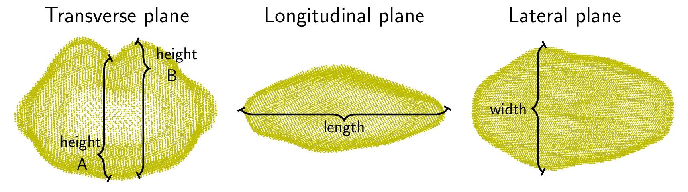

```{r setup, include=FALSE}
library(reticulate)
library(knitr)

# <!-- Copies an HTML dependency to a subdirectory of the given directory. The subdirectory name willbename-version(for example, "outputDir/jquery-1.11.0"). You may setoptions(htmltools.dir.version= FALSE)to suppress the version number in the subdirectory name. -->
options(htmltools.dir.version = FALSE)
knitr::opts_chunk$set(echo = FALSE)
knitr::opts_chunk$set(fig.align = 'center')
```

<div class="row">
  <div class="column" style="max-width:44%">
    <a href="https://www.bloomberg.com/news/articles/2020-09-13/iraq-to-offer-first-ever-barley-exports-as-rains-yield-surplus" target="_blank"></a>
  </div>
</div>

---

<div class="row">
  <div class="column" style="max-width:44%">
    <a href="https://www.bloomberg.com/news/articles/2020-09-13/iraq-to-offer-first-ever-barley-exports-as-rains-yield-surplus" target="_blank"></a>
  </div>
  <div class="column" style="max-width:44%">
    <a href="https://cereal.interreg-npa.eu/subsites/CEREAL/Barley_cultivation-Norway_Presentation_2018.pdf" target="_blank"></a>
  </div>
</div>

---

<div class="row">
  <div class="column" style="max-width:44%">
    <a href="https://www.bloomberg.com/news/articles/2020-09-13/iraq-to-offer-first-ever-barley-exports-as-rains-yield-surplus" target="_blank"></a>
    <a href="https://www.resilience.org/stories/2020-03-09/the-last-crop-before-the-desert/" target="_blank"></a>
  </div>
  <div class="column" style="max-width:44%">
    <a href="https://cereal.interreg-npa.eu/subsites/CEREAL/Barley_cultivation-Norway_Presentation_2018.pdf" target="_blank"></a>
  </div>
</div>

---

<div class="row">
  <div class="column" style="max-width:44%">
    <a href="https://www.bloomberg.com/news/articles/2020-09-13/iraq-to-offer-first-ever-barley-exports-as-rains-yield-surplus" target="_blank"></a>
    <a href="https://www.resilience.org/stories/2020-03-09/the-last-crop-before-the-desert/" target="_blank"></a>
  </div>
  <div class="column" style="max-width:44%">
    <a href="https://cereal.interreg-npa.eu/subsites/CEREAL/Barley_cultivation-Norway_Presentation_2018.pdf" target="_blank"></a>
    <a href="https://www.tibettravel.org/tibetan-culture/highland-barley.html" target="_blank"></a>
  </div>
</div>

---

<div class="row">
  <div class="column" style="max-width:44%">
    <a href="https://www.bloomberg.com/news/articles/2020-09-13/iraq-to-offer-first-ever-barley-exports-as-rains-yield-surplus" target="_blank"></a>
    <a href="https://www.resilience.org/stories/2020-03-09/the-last-crop-before-the-desert/" target="_blank"></a>
    <a href="https://www.nationalgeographic.co.uk/travel/2020/05/photo-story-from-barley-fields-to-whisky-barrels-in-rural-scotland" target="_blank"></a>
  </div>
  <div class="column" style="max-width:44%">
    <a href="https://cereal.interreg-npa.eu/subsites/CEREAL/Barley_cultivation-Norway_Presentation_2018.pdf" target="_blank"></a>
    <a href="https://www.tibettravel.org/tibetan-culture/highland-barley.html" target="_blank"></a>
  </div>
</div>

---

<div class="row">
  <div class="column" style="max-width:44%">
    <a href="https://www.bloomberg.com/news/articles/2020-09-13/iraq-to-offer-first-ever-barley-exports-as-rains-yield-surplus" target="_blank"></a>
    <a href="https://www.resilience.org/stories/2020-03-09/the-last-crop-before-the-desert/" target="_blank"></a>
    <a href="https://www.nationalgeographic.co.uk/travel/2020/05/photo-story-from-barley-fields-to-whisky-barrels-in-rural-scotland" target="_blank"></a>
  </div>
  <div class="column" style="max-width:44%">
    <a href="https://cereal.interreg-npa.eu/subsites/CEREAL/Barley_cultivation-Norway_Presentation_2018.pdf" target="_blank"></a>
    <a href="https://www.tibettravel.org/tibetan-culture/highland-barley.html" target="_blank"></a>
    <a href="https://www.doi.org/10.1007/978-1-4419-0465-2_2168" target="_blank"></a>
  </div>
  <div class="column" style="max-width:8%; font-size: 15px;">
    <p style="text-align: center; font-size: 30px; line-height: 1em; color:#18453B"> <strong> Barley across the world:<br><br>28 different accessions</strong></p>
  </div>
</div>

---

# Raw Data: X-rays &rarr; Image Processing

<div class="row">
  <div class="column" style="max-width:37.5%; color: Navy; font-size: 15px;">
    
    <p style="text-align: center;">Barley shipped from California</p>
  </div>
</div>

---

# Raw Data: X-rays &rarr; Image Processing

<div class="row">
  <div class="column" style="max-width:37.5%; color: Navy; font-size: 15px;">
    
    <p style="text-align: center;">Barley shipped from California</p>
  </div>
  <div class="column" style="max-width:50%; color: Navy; font-size: 15px;">
    
    <p style="text-align: center;">Proprietary X-Ray CT scan reconstruction</p>
  </div>
</div>

---

# Raw Data: X-rays &rarr; Image Processing

<div class="row">
  <div class="column" style="max-width:37.5%; color: Navy; font-size: 15px;">
    
    <p style="text-align: center;">Barley shipped from California</p>
  </div>
  <div class="column" style="max-width:50%; color: Navy; font-size: 15px;">
    
    <p style="text-align: center;">Proprietary X-Ray CT scan reconstruction</p>
  </div>
</div>

<div class="row">
  <div class="column" style="max-width:38%; color: Navy; font-size: 15px;">
    
    <p style="text-align: center;">Creative setup</p>
  </div>
</div>

---

# Raw Data: X-rays &rarr; Image Processing

<div class="row">
  <div class="column" style="max-width:37.5%; color: Navy; font-size: 15px;">
    
    <p style="text-align: center;">Barley shipped from California</p>
  </div>
  <div class="column" style="max-width:50%; color: Navy; font-size: 15px;">
    
    <p style="text-align: center;">Proprietary X-Ray CT scan reconstruction</p>
  </div>
</div>

<div class="row">
  <div class="column" style="max-width:38%; color: Navy; font-size: 15px;">
    
    <p style="text-align: center;">Creative setup</p>
  </div>
  <div class="column" style="max-width:17.5%; color: Navy; font-size: 15px;">
    
    <p style="text-align: center;"> 975 spikes </p>
  </div>
  <div class="column" style="max-width:17%; color: Navy; font-size: 15px;">
    
    <p style="text-align: center;"> 28 accessions </p>
  </div>
</div>

---

# Raw Data: X-rays &rarr; Image Processing

<div class="row">
  <div class="column" style="max-width:37.5%; color: Navy; font-size: 15px;">
    
    <p style="text-align: center;">Barley shipped from California</p>
  </div>
  <div class="column" style="max-width:50%; color: Navy; font-size: 15px;">
    
    <p style="text-align: center;">Proprietary X-Ray CT scan reconstruction</p>
  </div>
</div>

<div class="row">
  <div class="column" style="max-width:38%; color: Navy; font-size: 15px;">
    
    <p style="text-align: center;">Creative setup</p>
  </div>
  <div class="column" style="max-width:17.5%; color: Navy; font-size: 15px;">
    
    <p style="text-align: center;"> 975 spikes </p>
  </div>
  <div class="column" style="max-width:17%; color: Navy; font-size: 15px;">
    
    <p style="text-align: center;"> 28 accessions </p>
  </div>
  <div class="column" style="max-width:20.5%; color: Navy; font-size: 15px;">
    
    <p style="text-align: center;"> 38,000 seeds </p>
  </div>
</div>

---

### Shape extraction: Traditional

```{r, out.width=500}

```

--

### Topological description: Euler Characteristic Transform (ECT)

```{r, out.width=500}
knitr::include_graphics('../figs/ect_ver2.gif')
```

--

- [**Theorem** (Turner, Mukherjee, Boyer, 2014)](https://arxiv.org/abs/1310.1030):  The ECT is a sufficient statistic in 3D.

---

# Hidden topological shape information

- **Goal:** Classify 28 barley accessions using solely grain morphology information.

--

.pull-left[

]

.pull-right[
```{r, out.width=200}
knitr::include_graphics('../figs/pole_directions_p7_m12_crop.jpg')
```
]

---

# Hidden topological shape information

- **Goal:** Classify 28 barley accessions using solely grain morphology information.

.pull-left[


```{r, out.width=400}
knitr::include_graphics(c('../figs/kruskal_wallis_topo_summary.jpg'))
```
]

.pull-right[
```{r, out.width=200}
knitr::include_graphics('../figs/pole_directions_p7_m12_crop.jpg')
```
]

---

# Hidden topological shape information

- **Goal:** Classify 28 barley accessions using solely grain morphology information.

.pull-left[


```{r, out.width=400}
knitr::include_graphics(c('../figs/kruskal_wallis_topo_summary.jpg'))
```
]

.pull-right[
```{r, out.width=200}
knitr::include_graphics('../figs/discerning_directions.png')
```


]


---
class: right, bottom, inverse

background-image: url("../figs/acknowledgments.jpg")
background-size: 1000px
background-position: 50% 40%
