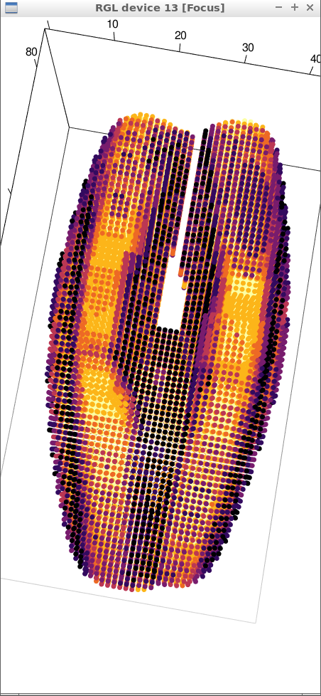
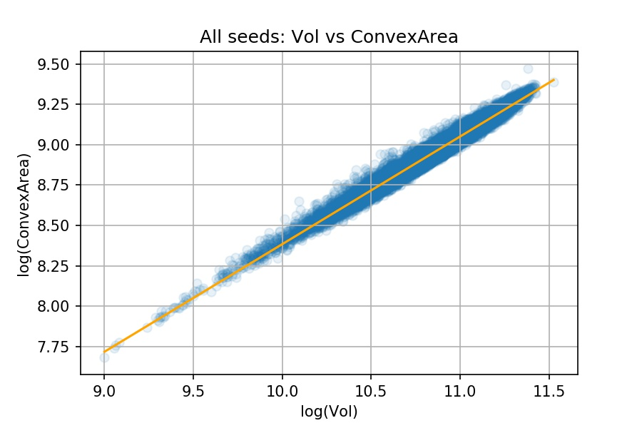

```{r setup, include=FALSE}
library(reticulate)
library(knitr)

# <!-- Copies an HTML dependency to a subdirectory of the given directory. The subdirectory name willbename-version(for example, "outputDir/jquery-1.11.0"). You may setoptions(htmltools.dir.version= FALSE)to suppress the version number in the subdirectory name. -->
options(htmltools.dir.version = FALSE)

knitr::opts_chunk$set(echo = FALSE)
knitr::opts_chunk$set(engine.path = list(
  python = '/usr/bin/python3',
  ruby = '/usr/bin/ruby'
))
```

class: inverse

# Plant morphology

<div class="row">
  <div class="column" style="max-width:50%">
    <iframe width="375" height="210" src="https://www.youtube-nocookie.com/embed/oM9kAq0PBvw?controls=0" frameborder="0" allow="accelerometer; autoplay; encrypted-media; gyroscope; picture-in-picture" allowfullscreen></iframe>
    <iframe width="375" height="210" src="https://www.youtube-nocookie.com/embed/V39K58evWlU?controls=0" frameborder="0" allow="accelerometer; autoplay; encrypted-media; gyroscope; picture-in-picture" allowfullscreen></iframe>
  </div>
  <div class="column" style="max-width:50%">
    <iframe width="375" height="210" src="https://www.youtube-nocookie.com/embed/4GBgPIEDoa0?controls=0" frameborder="0" allow="accelerometer; autoplay; encrypted-media; gyroscope; picture-in-picture" allowfullscreen></iframe>
    <iframe width="375" height="210" src="https://www.youtube-nocookie.com/embed/qkOjHHuoUhA?controls=0" frameborder="0" allow="accelerometer; autoplay; encrypted-media; gyroscope; picture-in-picture" allowfullscreen></iframe>
  </div>
</div>

---

# Topological Data Analysis

<div class="row">
  <div class="column" style="max-width:25%; font-size: 15px;">
    
    <p style="font-size: 25px; text-align: center; color: DarkRed;"> Raw Data </p>
    <ul>
      <li> X-ray CT </li>
      <li> Point clouds </li>
      <li> Time series </li>
    <ul>
  </div>
  <div class="column" style="max-width:40%; padding: 0 25px 0 25px; font-size: 15px;">
    
    <p style="font-size: 23px; text-align: center; color: DarkRed;"> Topological Summary </p>
    <ul>
      <li> Euler Characteristic </li>
      <li> Persistence diagrams </li>
      <li> Mapper/Reeb graphs </li>
    <ul>
  </div>
  <div class="column" style="max-width:35%; font-size: 15px;">
    
    
    <p style="font-size: 25px; text-align: center; color: DarkRed;"> Analysis </p>
    <ul>
      <li> Statistics </li>
      <li> Machine learning </li>
      <li> Classification/prediction </li>
    <ul>
  </div>
</div>

---

class: center, middle, inverse

# 1. Plant Biology: Barley

---

# Barley: since the dawn of agriculture

- It is the 4th most cultivated grain in the world, behind rice, wheat, and maize.

<div class="row">
  <div class="column" style="max-width:35%">
    
    
  </div>
  <div class="column" style="max-width:30%">
  <p style="font-size: 15px; text-align: center; color: DimGrey;"> Cuneiform tablets from Mesopotamia depicting barley </p>
    
    
  </div>
  <div class="column" style="max-width:35%">
    
    <p style="font-size: 15px; text-align: center; color: DimGrey;"> Beer consumption in ancient Egypt </p>
  </div>
</div>

---

background-image: url("../figs/barley_domestication.jpg")
background-size: 910px
background-position: 50% 70%

# Diversification of floral morphology

---

background-image: url("../figs/BarleyEars_2_vs_6.jpg")
background-size: 420px
background-position: 0% 99%

# Important divide: 2-row vs 6-row barley

<div class="row">
  <div class="column" style="max-width:50%; margin-left:auto; margin-right:0;">
    <p> Ancient barley split into two families: 2-row and 6-row </p>
    <p> Important evolutive event to understand</p>
    
    <p style="font-size: 15px; color: DimGrey;"> Hertrich J. “Topics in Brewing: Malting Barley” MBAA TQ 50(1) 2013, pp. 29--41 </p>
  </div>
</div>

---

background-image: url("../figs/composite_hybrid_mixture.jpg")
background-size: 400px
background-position: 95% 5%


# Composite Cross (CC II)

<div class="row">
  <div class="column" style="max-width:50%">
    
    <p style="font-size: 15px; color: DimGrey;"> From top-left:  </p>
    <p style="font-size: 15px; text-align: center; color: DimGrey;"> Mary Martini, Harry Harlan, Coit Suneson, G.A. Wiebe, Robert Allard, Dan Koenig  </p>
  </div>
  <div class="column" style="max-width:50%">
    
    <p style="font-size: 15px; text-align: center; color: DimGrey;"> 28 founder lines </p>
  </div>
</div>

- Experiment started in 1929, Aberdeen, Idaho
- Creation and maintenance by a number of people at UC Riverside and UC Davis.

---

background-image: url("../figs/composite_cross_experiment.jpg")
background-size: 450px
background-position: 95% 50%

# Experimental design

.pull-left[
- Cross all possilbe 28 parent combinations (F1s)
- Self-fertilize the resulting 379 hybrids (F2s)
- Plant the progeny of hybrids in different plots and let nature do the rest
- Mostly self-fertilization was carried out throughout almost 58 generations
- We have records of all plots throughout generations
    - Measure morphology
    - DNA sequencing
    - Which genes are selected for?
    - How did morphology change?
]

---

class: inverse, center, middle

# 2. Image procesing

## X-ray CT scan 3D images

---

background-image: url("../figs/barley_lab_composition.jpg")
background-size: 750px
background-position: 99% 99%

# Raw data: X-ray CT scans

.pull-left[
Voxel-based images

$\sim30\mu m$ resolution

Batch scans - 4 per tray

2Gb+ per raw scan
]

---

class: inverse
background-image: url("../figs/barley_hpcc.png")
background-size: 1300px
background-position: 0% 0%


# _Ad-hoc_ image processing

<div class="row">
  <div class="column" style="max-width:12%; color: Yellow; font-size: 15px;">
    
    <p style="text-align: center"> Original </p>
  </div>
  <div class="column" style="max-width:12%; color: Yellow; font-size: 15px;">
    
    <p style="text-align: center"> Normalized </p>
  </div>
  <div class="column" style="max-width:12%; color: Yellow; font-size: 15px;">
    
    <p style="text-align: center"> Clean </p>
  </div>
  <div class="column" style="max-width:12%; color: Yellow; font-size: 15px;">
    
    <p style="text-align: center"> Prunned </p>
  </div>
  <div class="column" style="max-width:27%; color: Yellow; font-size: 15px;">
    
    <p style="text-align: center"> Labeled </p>
  </div>
  <div class="column" style="max-width:21%; color: Yellow; font-size: 15px;">
    
    <p style="text-align: center"> Analysis! </p>
  </div>
</div>

--

- 224 raw scans in total
- 875 individual barley spikes

---

# Analyze seed distribution

<div class="row">
  <div class="column" style="max-width:63%; padding: 0px 50px;">
    
    
  </div>
  <div class="column" style="max-width:12%; background-color: DarkRed; padding: 5px; border-radius: 15px 0px 0px 30px;">
    
    
  </div>
  <div class="column" style="max-width:12%; color: Yellow; text-align: center; font-size: 15px; background-color: DarkRed; padding: 5px;">
    
    
    <p><strong> Outliers </strong></p>
  </div>
  <div class="column" style="max-width:12%; background-color: DarkRed; padding: 5px; border-radius: 0px 15px 30px 0px;">
    
    
  </div>
  
</div>

- $\sim38,000$ clean seeds.

---

background-image: url("../figs/seed_mesh.png")
background-size: 250px
background-position: 80% 60%

# Traditional measures

All seeds are oblong: align them based on SVD

.pull-left[
- Length
- Width
- Height
- Surface area
- Volume
- Convex surface area
- Convex volume

]

---

# Allometry and Morphological evolution

<div class="row">
  <div class="column" style="max-width:35%; color: Yellow; font-size: 15px;">
    
    
    
  </div>
  <div class="column" style="max-width:22%; color: Yellow; font-size: 15px;">
    
    
  </div>
  <div class="column" style="max-width:22%; color: Yellow; font-size: 15px;">
    
    
  </div>
  <div class="column" style="max-width:22%; color: Yellow; font-size: 15px;">
    
    
  </div>
</div>

---

class: inverse, middle, center

# 3. Topology

## Euler Characteristic Transform (ECT)

---

background-image: url("../figs/euler_characteristic_2.png")
background-size: 450px
background-position: 97% 50%

# La característica de Euler

.pull-left[
Give a 3D object with $V_0$ vertices, $V_1$ edges, and $V_2$ faces.

$$\chi = V_0 - V_1 + V_2$$
**Betti numbers:** Number of homologically different holes.
- $\beta_0$: Number of component components
- $\beta_1$: Number of cycles
- $\beta_2$: Number of voids

$\chi = \beta_0 - \beta_1 + \beta_2$

In general:

$\chi = \sum_{i=0}^n (-1)^iV_i = \sum_{i=0}^n (-1)^i\beta_i$
]

---

background-image: url("../figs/ecc_X.gif")
background-size: 300px
background-position: 90% 60%

# Curva de característica de Euler (ECC)

.pull-left[
- Given a finite simplicial complex $M\subset\mathbb{R}^d$

- A direction $\nu\in S^{d-1}$

- Height filtration
$M(\nu)_r = \{x\in M: \langle x,\nu\rangle \leq r\}$ 
$\simeq 	\{\Delta\in M : \langle x, \nu\rangle\leq r\:\forall	\,x\in\Delta\}$

- Define the ECC as $\chi(M,\nu):\mathbb{R}\to\mathbb{Z}$ 

$$\chi(M,\nu)(r) = \chi(M(\nu)_r).$$
]

---

background-image: url("../figs/ect.gif")
background-size: 700px
background-position: 50% 90%

# Euler Characteristic Transform (ECT)

- Define $ECT(M): S^{d-1}\to\mathbb{Z}^{\mathbb{R}}$ with $\nu\mapsto\chi(M,\nu)$
- Concatenate an infinite number of ECCs.

---

# Why choose the ECT?

--

- Easy to compute: a quick alternating sum.

--

[**Theorem _(Turner, Mukherjee, Boyer 2014)_**](https://doi.org/10.1093/imaiai/iau011): The ECT is injective for finite simplicial complexes in 3D.

--

[**Theorem _(ibid)_**](https://arxiv.org/abs/1310.1030): The ECT is a sufficient statistic for finite simplicial complexes in 3D.

--

_Translation:_ 

- Given all the (infinite) ECCs corresponding to all possible directions,

- *Different* simplicial complexes correspond to *different* ECTs.

- The ECT effectively summarizes all possible information related to shape.

---

class: inverse, center, middle

# 4. Results on barley seeds

---

background-image: url("../figs/pole_directions_102.png")
background-size: 350px
background-position: 90% 50%

# Computing the ECT of seeds

.pull-left[
- All seeds are centered and aligned so we can associate directions across images

- 74 directions

- 32 thresholds per direction

- Every seed is associated a $74\times32=2368$-dimensional vector.


]

---

# MDS + SVM

.pull-left[

- Focus on two founders at a time

- Project each ECT to 2D with a metric MDS.
    - $d(\mathbf x, \mathbf z) = \sum_i\frac{|x_i-y_i|}{|x_i|+|y_i|}$

- Compute a linear SVM to gauge the separability of the ECT+MDS signals.

- Used 100% of the data set as training.
]

.pull-right[


]

---

background-image: url("../figs/heatmap_svm_linear_C1_mds_canberra_k4.png")
background-size: 450px
background-position: 98% 50%

# Accuracy heatmap

.pull-left[

Idea:

- If two founders are easy to separate, then their morphology must be significantly different.

- Thus, such founders ought to be distant in the phylogenetic tree.

- The reverse must be true as well.
]

---

background-image: url("../figs/hclust_ward.D2_svm_radial_C1_mds_manhattan_k4.png")
background-size: 450px
background-position: 99% 50%

# Hierarchical clustering

.pull-left[
- 2-row barley founders tend to cluster

- The behavior is mantained as we modify:
    - Number of projected dimensions with MDS: $k=2,4,8$ 
    - Canberra or Manhattan distance for metric MDS
    - Radial or linear SVM
    - Different hierarchical clustering criteria (complete, average, ward, mcquitty)
]

---

background-image: url("../figs/founders_rownums2_pca_d74_T32.png")
background-size: 450px
background-position: 99% 60%

# PCA suggests a slight asymmetry.

.pull-left[
- It seems that the 6-row barley is slightly more spread along the PC2 axis.

- Hypothesis: The lateral seeds in the 6-row barley present a natural asymmetry/handedness.


]

---

class: inverse

# Future work

- Do a Procrustes analysis to measure seed handedness 

--

- Figure out how to use the barley spike as a whole

--

- Find a more concrete link between morphology and genomics

--

- Many more plant morphology data sets to be analyzed!


<div class="row">
  <div class="column" style="max-width:50%">
    <iframe width="375" height="210" src="https://www.youtube-nocookie.com/embed/ikhuvGpJbeA?controls=0" frameborder="0" allow="accelerometer; autoplay; encrypted-media; gyroscope; picture-in-picture" allowfullscreen></iframe>
  </div>
  <div class="column" style="max-width:50%">
    <iframe width="375" height="210" src="https://www.youtube-nocookie.com/embed/a7JCIJRpF8U?controls=0" frameborder="0" allow="accelerometer; autoplay; encrypted-media; gyroscope; picture-in-picture" allowfullscreen></iframe>
  </div>
</div>

---

background-image: url("../figs/acknowledgements.jpg")
background-size: 1000px
background-position: 50% 50%
