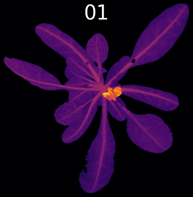
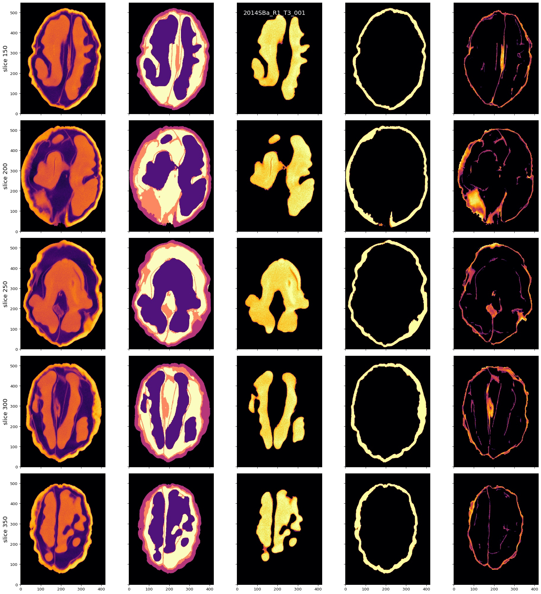

```{r setup, include=FALSE}
library(reticulate)
library(knitr)

options(htmltools.dir.version = FALSE)
knitr::opts_chunk$set(echo = FALSE)
knitr::opts_chunk$set(fig.align = 'center')
```

background-image: url("../../img/endlessforms.png")
background-size: 150px
background-position: 89% 7%

class: inverse

# Plant morphology

<div class="row">
  <div class="column" style="max-width:50%">
    <iframe width="375" height="210" src="https://www.youtube-nocookie.com/embed/oM9kAq0PBvw?controls=0" frameborder="0" allow="accelerometer; autoplay; encrypted-media; gyroscope; picture-in-picture" allowfullscreen></iframe>
    <iframe width="375" height="210" src="https://www.youtube-nocookie.com/embed/V39K58evWlU?controls=0" frameborder="0" allow="accelerometer; autoplay; encrypted-media; gyroscope; picture-in-picture" allowfullscreen></iframe>
  </div>
  <div class="column" style="max-width:50%">
    <iframe width="375" height="210" src="https://www.youtube-nocookie.com/embed/efF5PSvFQ2A?controls=0" frameborder="0" allow="accelerometer; autoplay; encrypted-media; gyroscope; picture-in-picture" allowfullscreen></iframe>
    <iframe width="375" height="210" src="https://www.youtube-nocookie.com/embed/qkOjHHuoUhA?controls=0" frameborder="0" allow="accelerometer; autoplay; encrypted-media; gyroscope; picture-in-picture" allowfullscreen></iframe>
  </div>
</div>
<p style="font-size: 24px; text-align: right; font-family: 'Yanone Kaffeesatz'">Check out more 3D X-ray CT scans at <a href="https://www.youtube.com/@endlessforms6756">youtube.com/@endlessforms6756</a></p>

---

# Topological Data Analysis (TDA)

<div class="row" style="font-family: 'Yanone Kaffeesatz'">
  <div class="column" style="max-width:25%; font-size: 20px;">
    
    <p style="font-size: 30px; text-align: center; color: DarkRed;"> Raw Data </p>
    <ul>
      <li> X-ray CT </li>
      <li> Point clouds </li>
      <li> Time series </li>
    <ul>
  </div>
  <div class="column" style="max-width:40%; padding: 0 25px 0 25px; font-size: 20px;">
    
    <p style="font-size: 28px; text-align: center; color: DarkRed;"> Topological Summary </p>
    <ul>
      <li> Euler Characteristic </li>
      <li> Persistence diagrams </li>
      <li> Mapper/Reeb graphs </li>
    <ul>
  </div>
  <div class="column" style="max-width:35%; font-size: 20px;">
    
    <p style="font-size: 30px; text-align: center; color: DarkRed;"> Analysis </p>
    <ul>
      <li> Statistics </li>
      <li> Machine learning </li>
      <li> Classification/prediction </li>
    <ul>
  </div>
</div>

---

background-image: url("../../cmse/figs/cmse logo file-01.svg")
background-size: 150px
background-position: 1% 50%

class: center

# My research: Crossing and merging bridges

<div class="row">
  <div class="column" style="width:15%">
  </div>
  <div class="column" style="max-width:15%">
    <a href="https://doi.org/10.1093/insilicoplants/diab033" target="_blank"></a>
  </div>
  <div class="column" style="max-width:18%">
    <a href="https://doi.org/10.1002/ppp3.10333" target="_blank"></a>
  </div>
  <div class="column" style="max-width:25%">
    
  </div>
  <div class="column" style="max-width:25%">
    
  </div>
</div>

<div class="row">
  <div class="column" style="width:15%">
  </div>
  <div class="column" style="max-width:28%">
    <a href="https://plantsandpython.github.io/PlantsAndPython/00_Opening_page.html" target="_blank"></a>
  </div>
  <div class="column" style="max-width:60%">
    <a href="https://doi.org/10.1101/2022.10.15.512190" target="_blank"></a>
  </div>
</div>

<div class="list" style="font-size: 10px; text-align: left;">
    <ul>
      <li>R.A. Marks <em>et al.</em> (2022) Global disparities in plant science: a legacy of colonialism, patriarchy, and exclusion. DOI: <a href="https://doi.org/10.1101/2022.10.15.512190" target="_blank">10.1101/2022.10.15.512190</a></li>
        <li><strong>E.A.</strong> <em>et al.</em> (2022) The shape of aroma: measuring and modeling citrus oil gland distribution. <a href="https://doi.org/10.1002/ppp3.10333" target="_blank">DOI: 10.1002/ppp3.10333</a></li>
        <li>R. VanBuren <em>et al.</em> (2022) Teaching Tools in Plant Biology. Plants and Python, Coding from Scratch in the Plant Sciences. <a href="https://doi.org/10.1093/plcell/koac187" target="_blank">DOI: 10.1093/plcell/koac187</a>.</li>
        <li><strong>E.A.</strong> <em>et al.</em> (2021) Measuring hidden phenotype: Quantifying the shape of barley seeds using the Euler Characteristic Transform. <a href="https://doi.org/10.1093/insilicoplants/diab033" target="_blank">DOI: 10.1093/insilicoplants/diab033</a></li>
    </ul>
</div>

---

background-image: url("../figs/seed.png")
background-size: 325px
background-position: 99% 99%

# Roadmap for today

### Split into modules

1. Survey of TDA in biology applications

1. The Euler Characteristic Transform and barley morphology

1. Modeling citrus oil glands with directional statistics

1. All about shape, in a nutshell

---

class: inverse, middle, center

# 1. TDA meets biology in a number of ways

## Shape is data and data is shape

### The significance of detecting connected components and holes

---

# 1st TDA Ingredient: Complexes

- Think the data as a collection of elementary building blocks ( _cells_ )

Vertices | Edges | Faces | Cubes
---------|-------|-------|-------
  0-dim  | 1-dim | 2-dim | 3-dim

- A collection of cells is a _cubical complex_

- Count the number of topological features ( _holes_ ):

Connected components | Loops | Voids
---------------------|-------|-------
       0-dim         | 1-dim | 2-dim

- Example with 2 connected components, 1 loop, 0 voids

```{r, out.width=500}

```

---

# 2nd TDA Ingredient: Filters

- Each cell is assigned a real value which defines how the complex is constructed.

- Observe how the number of topological features change as the complex grows.

.pull-left[
```{r, out.width="250px"}
knitr::include_graphics(c("../figs/eigcurv_filter.gif", "../figs/gaussian_density_filter.gif"))
```
]

.pull-right[
```{r, out.width="250px"}
knitr::include_graphics(c("../figs/eccentricity_filter.gif", "../figs/vrips_ver2.gif"))
```
]

---

# TDA + Biology in the literature

<div class="row">
  <div class="column" style="max-width:25%">
    
    
    <p style="font-size: 10px; text-align: right; color: Grey;"> Credits: <a href="https://doi.org/10.1016/j.media.2019.03.014">Qaiser <em>et al.</em> (2019)</a></p>
  </div>
  <div class="column" style="max-width:25%">
    
    
    <p style="font-size: 10px; text-align: right; color: Grey;"> Credits: <a href="https://doi.org/10.1073/pnas.1313480110">Chan <em>et al.</em> (2013)</a></p>
  </div>
  <div class="column" style="max-width:22%">
    
    
    
    <p style="font-size: 10px; text-align: right; color: Grey;"> Credits: <a href="https://doi.org/10.1515/sagmb-2015-0057">Kovacev-Nikolic <em>et al.</em> (2016)</a></p>
  </div>
  <div class="column" style="max-width:28%">
    
    <p style="font-size: 10px; text-align: right; color: Grey;"> Credits: <a href="https://doi.org/10.1007/978-3-030-20867-7_7">Chitwood <em>et al.</em> (2019)</a></p>
  </div>
</div>

<div class="row" style="font-family: 'Yanone Kaffeesatz'; font-size:25px;">
  <div class="column" style="width:25%;">
    <p style="text-align: center;">Holes</p>
    <p style="text-align: center;">&darr;</p>
    <p style="text-align: center;">Cancerous tissue</p>
  </div>
  <div class="column" style="width:25%;">
    <p style="text-align: center;">Holes</p>
    <p style="text-align: center;">&darr;</p>
    <p style="text-align: center;">Horizontal Reassortment</p>
  </div>
  <div class="column" style="width:25%;">
    <p style="text-align: center;">Holes</p>
    <p style="text-align: center;">&darr;</p>
    <p style="text-align: center;">Open/closed conformations</p>
  </div>
  <div class="column" style="width:25%;">
    <p style="text-align: center;">Components</p>
    <p style="text-align: center;">&darr;</p>
    <p style="text-align: center;">Panicle structure</p>
  </div>
</div>

---

# Advertisement

- More content, references, and examples

> Amézquita _et al._ (2020) "The shape of things to come: Topological data analysis and biology, from molecules to organisms". _Developmental Dynamics_ **249**(7) pp. 816-833. DOI: [10.1002/dvdy.175](https://doi.org/10.1002/dvdy.175)


---

class: inverse, middle, center

# 2. Focusing on the Euler Characteristic

## The Euler Characteristic Transform (ECT)

---

# Topology: The Euler characteristic $\chi$

$$\chi = \#(\text{Vertices}) - \#(\text{Edges}) + \#(\text{Faces}).$$

<div class="row">
  <div class="column" style="width:5%">
  </div>
  <div class="column" style="max-width:30%">
    
  </div>
  <div class="column" style="max-width:30%">
    
  </div>
  <div class="column" style="max-width:30%">
    
  </div>
  <div class="column" style="width:5%">
  </div>
</div>

<div class="row">
  <div class="column" style="width:5%">
  </div>
  <div class="column" style="max-width:30%">
    
  </div>
  <div class="column" style="max-width:30%">
    
  </div>
  <div class="column" style="max-width:30%">
    <p style="padding: 50px 0 0 10px; font-size: 48px; text-align: center; color: #18453B; line-height: 1.25; font-family: 'Yanone Kaffeesatz';"> V - E + F = 2</p>
  </div>
  <div class="column" style="width:5%">
  </div>
</div>

---

background-image: url("../figs/ecc_ver2.gif")
background-size: 750px
background-position: 50% 90%

# Euler Characteristic Curve (ECC)

- Consider a cubical complex $X\subset\mathbb{R}^d$
- And a unit-length direction $\nu\in S^{d-1}$

- And the subcomplex containing all cubical cells below height $h$ in the direction $\nu$
$$X(\nu)_h =\{\Delta \in X\::\:\langle x,\nu\rangle\leq h\text{ for all }x\in\Delta\}$$

- The Euler Characteristic Curve (ECC) of direction $\nu$ is defined as the sequence $$\{\chi(X(\nu)_h)\}_{h\in\mathbb{R}}$$
---

background-image: url("../figs/ect_ver2.gif")
background-size: 800px
background-position: 50% 88%

## Euler Characteristic Transform (ECT)

- Repeat and concatenate for all possible directions.

$$
\begin{split}
ECT(X):\; & S^{d-1} \to \mathbb{Z}^{\mathbb{R}}\\
&\nu\mapsto\{\chi(X(\nu)_h)\}_{h\in\mathbb{R}}.
\end{split}
$$

- [**Theorem** (Turner, Mukherjee, Boyer 2014) & (Curry, Mukherjee, Turner, 2018)](http://arxiv.org/abs/1805.09782):  The ECT is injective with a finite bound of necessary directions.

---

background-image: url("../figs/turner_etal_2014.png")
background-size: 280px
background-position: 99% 1%


# More on the ECT

- Easy to compute: a quick alternating sum.

- *Different* simplicial complexes correspond to *different* ECTs.

- [**Theorem _(ibid)_**](https://arxiv.org/abs/1310.1030): The ECT effectively summarizes all possible information related to shape.

There is elusive math research on computationally efficient reconstruction algorithms:
- [Turner, Mukherjee, Curry (2021)](https://arxiv.org/abs/1805.09782): Finite number of directions
- [Betthauser (2018)](https://people.clas.ufl.edu/peterbubenik/files/Betthauser_Thesis.pdf): 2D reconstruction
- [Fasy, Micka, Millman, Schenfisch, Williams (2022)](https://arxiv.org/abs/1912.12759): 3D reconstruction
- [Crawford, Monod, Chen, Mukherjee, Rabadan (2020)](https://doi.org/10.1080/01621459.2019.1671198): Smooth ECT
- [Jiang, Kurtek, Needham (2020)](https://openaccess.thecvf.com/content_CVPRW_2020/papers/w50/Jiang_The_Weighted_Euler_Curve_Transform_for_Shape_and_Image_Analysis_CVPRW_2020_paper.pdf): Weighted ECT

```{r, out.width="500px"}
knitr::include_graphics(c("../../arabidopsis/figs/ect_col-0_pot0_leaf0.gif"))
```


---

background-image: url("../figs/amezquita_etal_2021.png")
background-size: 400px
background-position: 50% 95%

class: inverse, middle, center

# Quantifying barley morphology

## Using the Euler Characteristic Transform

---

<div class="row">
  <div class="column" style="max-width:44%">
    <a href="https://cereal.interreg-npa.eu/subsites/CEREAL/Barley_cultivation-Norway_Presentation_2018.pdf" target="_blank"></a>
    <a href="https://www.resilience.org/stories/2020-03-09/the-last-crop-before-the-desert/" target="_blank"></a>
    <a href="https://www.doi.org/10.1007/978-1-4419-0465-2_2168" target="_blank"></a>
  </div>
  <div class="column" style="max-width:44%">
    <a href="https://doi.org/10.2134/agronj1929.00021962002100040014x" target="_blank"></a>
    <div class="row">
      <div class="column" style="max-width:46%">
        
      </div>
      <div class="column" style="max-width:55%">
        
      </div>
    </div>
  </div>
  <div class="column" style="max-width:8%; font-size: 15px;">
    <p style="text-align: center; font-size: 30px; line-height: 1em; color: #18453B;"> <strong> Barley from across the world </strong></p>
    <p>28 collected barley varieties</p>
    <p>Brought to California in 1929</p>
    <p>Artificial evolution experiment for 58 generations</p>
    <p>975 panicles scanned</p>
    <p>38,000 seeds isolated</p>
  </div>
</div>

---

background-image: url("../figs/S017_L0_seed_10_0.gif")
background-size: 85px
background-position: 90% 2%

# Traditional shape descriptors

<div class="row">
  <div class="column" style="max-width:55%">
    
    
  </div>
  <div class="column" style="max-width:45%">
    
    
    
  </div>
</div>

---

background-image: url("../figs/ect_ver2.gif")
background-size: 600px
background-position: 50% 98%

# Topological shape descriptors

.pull-left[
```{r, out.width=250}
knitr::include_graphics('../figs/pole_directions_p7_m12_crop.jpg')
```
]

.pull-right[
- 158 directions

- 16 slices per direction

- Every seed is associated a $158\times16=2528$-dim vector

- Reduced to 12 dimensions with UMAP
]


---

# Supervised Learning


---

# Quantify the shape of barley

**Goal:** Classify the **28** founding barley varieties solely by grain morphology information.

<style type="text/css">
.tg  {border-collapse:collapse;border-color:#93a1a1;border-spacing:0;margin:0px auto;}
.tg td{background-color:#fdf6e3;border-bottom-width:1px;border-color:#93a1a1;border-style:solid;border-top-width:1px;
  border-width:0px;color:#002b36;font-family:Arial, sans-serif;font-size:14px;overflow:hidden;padding:10px 5px;
  word-break:normal;}
.tg th{background-color:#657b83;border-bottom-width:1px;border-color:#93a1a1;border-style:solid;border-top-width:1px;
  border-width:0px;color:#fdf6e3;font-family:Arial, sans-serif;font-size:14px;font-weight:normal;overflow:hidden;
  padding:10px 5px;word-break:normal;}
.tg .tg-2bhk{background-color:#eee8d5;border-color:inherit;text-align:left;vertical-align:top}
.tg .tg-0pky{border-color:inherit;text-align:left;vertical-align:top}
.tg .tg-gyvr{background-color:#eee8d5;border-color:inherit;font-size:100%;text-align:left;vertical-align:top}
</style>
<table class="tg">
<thead>
  <tr>
    <th class="tg-0pky">Shape descriptors</th>
    <th class="tg-0pky">No. of descriptors</th>
    <th class="tg-0pky">F1</th>
  </tr>
</thead>
<tbody>
  <tr>
    <td class="tg-2bhk">Traditional</td>
    <td class="tg-2bhk">11</td>
    <td class="tg-2bhk">0.55 &plusmn; 0.019</td>
  </tr>
  <tr>
    <td class="tg-0pky">Topological</td>
    <td class="tg-0pky">12</td>
    <td class="tg-0pky">0.74 &plusmn; 0.016</td>
  </tr>
  <tr>
    <td class="tg-2bhk">Combined</td>
    <td class="tg-2bhk">23</td>
    <td class="tg-2bhk"><strong>0.86 &plusmn; 0.010</strong></td>
  </tr>
</tbody>
</table>

### What does topology actually measure?

.pull-left[
```{r, out.width=225}
knitr::include_graphics(c('../figs/discerning_directions.png'))#, '../figs/arrow_seed_09_0.gif'))
```
]

.pull-right[

]

---

# Traditional shape descriptors


---

# Topological shape descriptors + UMAP


---

# Predicting with Semi-Supervised Learning


---

# Prediction into semi-supervised territory

- Train an SVM with 100% of the founders $(F_0)$

- Classify the progeny $(F_{18}\text{ and }F_{58})$ to detect genotype enrichment

.pull-left[

]

.pull-right[

]

---

background-image: url("../figs/comparison_lines_combined_topounscaled_d158_T16_horz.png")
background-size: 900px
background-position: 50% 70%

## Observe shape distribution across lines

---

# Future directions

.left-column[


]

.right-column[
- Identify specific molecular markers corresponding to morphological differences across the diverse barley population.

- Develop a high-throughput pipeline to produce 3D images of individual barley seeds and quantify comprehensively their morphology.

- Formalize a method for promising seedling selection to further crop breeeding.

- Extend such pipeline and population genetics studies to other crops and grains.
]

---

background-image: url("../../citrus/figs/ppp3.png")
background-size: 400px
background-position: 50% 90%

class: center, inverse, middle

# 3. If life gives you lemons...

## Modeling citrus oil gland distribution

---

## Think of citrus as lego blocks


<p style="font-size: 8px; text-align: right; color: Grey;"> Credits: <a href="https://doi.org/10.1038/nature25447">Wu <em>et al.</em> (2018)</a></p>

---

## Raw Data: X-rays &rarr; Image Processing

<div class="row">
  <div class="column" style="max-width:38%; color: Navy; font-size: 15px;">
    
    <p style="text-align: center;"> UCR Collaboration </p>
  </div>
  <div class="column" style="max-width:38%; color: Navy; font-size: 15px;">
    
    <p style="text-align: center;"> 3D X-Ray CT scan </p>
  </div>
  <div class="column" style="max-width:23%; color: Navy; font-size: 15px;">
    
    <p style="text-align: center;"> Raw </p>
  </div>
</div>

<div class="row" style="margin: 0 auto;">
  <div class="column" style="max-width:20%; color: Navy; font-size: 15px;">
    
    <p style="text-align: center;"> Spine </p>
  </div>
  <div class="column" style="max-width:20%; color: Navy; font-size: 15px;">
    
    <p style="text-align: center;"> Endocarp </p>
  </div>
  <div class="column" style="max-width:20%; color: Navy; font-size: 15px;">
    
    <p style="text-align: center;"> Rind </p>
  </div>
  <div class="column" style="max-width:20%; color: Navy; font-size: 15px;">
    
    <p style="text-align: center;"> Exocarp </p>
  </div>
  <div class="column" style="max-width:20%; color: Navy; font-size: 15px;">
    
    <p style="text-align: center;"> Oil glands</p>
  </div>
</div>

---

## Size and average distance between closest oil glands


- Smaller fruits report higher density of oil glands
- Similar results when looking at the average distance between each oil gland and its 2nd, 3rd, ..., 25th nearest neighbors

---

## Average distance from each gland to its $k$-th nearest neighbor


+ $\text{Avg.dist}(k) = \sqrt{Mk + B}$
+ Oil glands might be distributing themselves following **normal diffusion** mechanics
+ The **outliers** for citrus groups usually correspond to hybrids.

---

## Model the whole fruit as an ellipsoid

.pull-left[


]

.pull-right[


]

---

background-image: url("../../citrus/figs/lambert_equal_area_N.gif")
background-size: 150px
background-position: 98% 1%

## Citrus modeling: Sour orange


```{r, out.width=550, fig.align='center'}
knitr::include_graphics('../../citrus/figs/SR01_CRC3289_12B-19-9_L00_geocentric_lazi.jpg')
```

---

background-image: url("../../citrus/figs/lambert_equal_area_N.gif")
background-size: 150px
background-position: 98% 1%

## Citrus modeling: Mandarin


```{r, out.width=550, fig.align='center'}
knitr::include_graphics('../../citrus/figs/M01_CRC3226_12B-27-1_L00_geocentric_lazi.jpg')
```

---

background-image: url("../../citrus/figs/lambert_equal_area_N.gif")
background-size: 150px
background-position: 98% 1%

## Citrus modeling: Kumquat


```{r, out.width=550, fig.align='center'}
knitr::include_graphics('../../citrus/figs/WR02_CRC3877_12B-44-13_L00_geocentric_lazi.jpg')
```

---

background-image: url("../../citrus/figs/lambert_equal_area_N.gif")
background-size: 150px
background-position: 98% 1%

# Citrus modeling: Finger lime


```{r, out.width=550, fig.align='center'}
knitr::include_graphics('../../citrus/figs/WR08_CRC3661_18B-16-5_L00_geocentric_lazi.jpg')
```

---

background-image: url("../../citrus/figs/WR11_CR3228_12B-30-9_L02_frontal_ell_projection.jpg")
background-size: 400px
background-position: 50% 90%

class: inverse, center, middle

# Directional statistics

## Perform statistics directly on a sphere surface

### Most of the citrus are nearly spherical, anyway

---

# Citrus projections


---

background-image: url("../../citrus/ellipsoids/GarciaPortugues_etal_2020a.png")
background-size: 200px
background-position: 99% 1%

# Uniform and rotationally symmetric spherical distributions


- A battery of tests reveal that citrus oil glands are neither uniformly nor rotationally symmetrically distributed.

---

# Kernel Density Estimators


<p style="font-size: 8px; text-align: right; color: Grey;"> Credits: <a href="https://www.statsmodels.org/dev/examples/notebooks/generated/kernel_density.html">Statsmodels</a></p>

- The choice of bandwidth is crucial
- Large bandwidths tend to oversmooth
- Small bandwidths tend to overfit
- Plenty of literature on $\mathbb{R}$ on how to choose an adequate value

---

background-image: url("../ellipsoids/GarciaPortugues_2013.png")
background-size: 300px
background-position: 95% 3%

# Spherical KDE


- Oil glands of a papeda
- Red arrows indicate the most significant gradient values for the density function
- Concentration parameter $k$ is chosen to be optimal

---

background-image: url("../../citrus/ellipsoids/Vuollo_and_Holmstrom_2018.png")
background-size: 300px
background-position: 95% 3%

# More exploratory analysis

## SphereSiZer: Pummelo


---

# Side view of a sweet orange


---

# Side view of a mandarin


---

# Side view of a kumquat


---

# Side view of a finger lime


---

class: inverse, center, middle

# Future topological directions

## Obligatory TDA plug

---

### Quantify the distribution of oil glands using Persistent Homology

<div class="row">
  <div class="column" style="max-width:30%">
    
    
  </div>
  <div class="column" style="max-width:30%">
    
    
  </div>
  <div class="column" style="max-width:30%">
    
    
  </div>
</div>

Persistent Homology ( $H_0$ and $H_1$) computed with Ripser in `scikit-tda`.

---

### Quantify the distribution of oil glands using Persistent Homology

<div class="row">
  <div class="column" style="max-width:30%">
    
    
  </div>
  <div class="column" style="max-width:30%">
    
    
  </div>
  <div class="column" style="max-width:30%">
    
    
  </div>
</div>

Persistent Homology ( $H_0$ and $H_1$) computed with Ripser in `scikit-tda`.
---

### Quantify the distribution of oil glands using Persistent Homology

<div class="row">
  <div class="column" style="max-width:30%">
    
    
  </div>
  <div class="column" style="max-width:30%">
    
    
  </div>
  <div class="column" style="max-width:30%">
    
    
  </div>
</div>

Persistent Homology ( $H_0$ and $H_1$) computed with Ripser in `scikit-tda`.
---

### Quantify the distribution of oil glands using Persistent Homology

<div class="row">
  <div class="column" style="max-width:30%">
    
    
  </div>
  <div class="column" style="max-width:30%">
    
    
  </div>
  <div class="column" style="max-width:30%">
    
    
  </div>
</div>

Persistent Homology ( $H_0$ and $H_1$) computed with Ripser in `scikit-tda`.
---

### Quantify the distribution of oil glands using Persistent Homology

<div class="row">
  <div class="column" style="max-width:30%">
    
    
  </div>
  <div class="column" style="max-width:30%">
    
    
  </div>
  <div class="column" style="max-width:30%">
    
    
  </div>
</div>

Persistent Homology ( $H_0$ and $H_1$) computed with Ripser in `scikit-tda`.

---

# Future directions

.left-column[


]

.right-column[

- Locate, segment, and phenotype seed tissue.

- Explore more on normal diffusion mechanics and their possible relationship to oil gland distribution.

- Define a measure of similarity of oil gland distributions and compute a pairwise distance matrix for all citrus fruits.

- Compare such distances between distributions to phylogenetic distances.

- Explore alternative ellipsoid-to-sphere algorithms to minimize distortion.

]

---

class: inverse, center, middle

# All about cracks and shapes

## In a nutshell

```{r, out.width=200, fig.align='center'}
knitr::include_graphics('https://upload.wikimedia.org/wikipedia/commons/3/39/Benutzung_eines_Nussknackers.gif')
```

---

# The wal(nu)tzing nutcracker!

.pull-left[

]

.pull-right[
- 172 batches &rarr; ~1300 walnuts

- Individual walnuts manually separated

- **Plenty of image processing**
]

<div class="row" style="margin: 0 auto;">
  <div class="column" style="max-width:25%; color: Navy; font-size: 15px;">
    
    <p style="text-align: center;"> Shell </p>
  </div>
  <div class="column" style="max-width:25%; color: Navy; font-size: 15px;">
    
    <p style="text-align: center;"> Air </p>
  </div>
  <div class="column" style="max-width:25%; color: Navy; font-size: 15px;">
    
    <p style="text-align: center;"> Packing </p>
  </div>
  <div class="column" style="max-width:25%; color: Navy; font-size: 15px;">
    
    <p style="text-align: center;"> Kernel </p>
  </div>
</div>

---

## Watershed segmentation


---

## Watershed segmentation



---

## Watershed segmentation


---

## Orientation


---

## Orientation


---

## Shell interior protrusions


---

## Shell interior protrusions


---

## Future directions

.pull-left[

Bertrand _et al_ (2020)
]

.pull-right[
Some of measurements of the table are duplicates.

Additional measurements we can make

- Relationship to convex hull volume and convex hull surface area (shell and kernel)

- Other sphericity indices

- Volume of packing tissue

- Percentage of volume for each tissue wrt to the total volume

- Volume and percentage of protruding shell
]

---

background-image: url("../../cmse/figs/institutional_logos.jpg")
background-size: 500px
background-position: 95% 1%

class: inverse

## Thank you!

<div class="row" style="margin-top: -25px;">
  <div class="column" style="max-width:17.5%; font-size: 13px;">
    
    <p style="text-align: center; color: White">Liz Munch<br>(MSU)</p>
    
    <p style="text-align: center; color: White">Tim Ophelders<br>(Utrecht)</p>
    
    <p style="text-align: center; color: White">Jacob Landis<br>(Cornell)</p>
  </div>
  <div class="column" style="max-width:17.5%; font-size: 13px;">
    
    <p style="text-align: center; color: White">Dan Chitwood<br>(MSU)</p>
    
    <p style="text-align: center; color: White">Michelle Quigley<br>(MSU)</p>
    
    <p style="text-align: center; color: White">Pat Brown<br>(UC Davis)</p>
  </div>
  <div class="column" style="max-width:13%; font-size: 13px;">
  
  <p style="text-align: center; color: White">Dan Koenig<br>(UC Riverside)</p>
  
  <p style="text-align: center; color: White">Danelle Seymour<br>(UC Riverside)</p>
  </div>
  <div class="column" style="width:10%; font-size: 24px;">
  </div>
  <div class="column" style="max-width:30%; font-size: 24px; line-height:1.25">
  <p style="text-align: center; color: White"><strong>Email</strong></p>
  <p style="text-align: center; color: Yellow">amezqui3@msu.edu</p>
  <p style="text-align: center; color: White"><strong>Slides</strong></p>
  <p style="text-align: center; color: Yellow">bit.ly/mu_22</p>
  <p style="text-align: center; color: White"><strong>References</strong></p>
  <p style="text-align: center; color: White; font-size: 12px; text-align:left">
    <strong>E.A.</strong> <em>et al.</em> (2022) The shape of aroma: measuring and modeling citrus oil gland distribution. <a href="https://doi.org/10.1002/ppp3.10333" target="_blank">DOI: 10.1002/ppp3.10333</a>
  </p>
  <p style="text-align: center; color: White; font-size: 12px; text-align:left">
    <strong>E.A.</strong> <em>et al.</em> (2021) Measuring hidden phenotype: Quantifying the shape of barley seeds using the Euler Characteristic Transform. <a href="https://doi.org/10.1093/insilicoplants/diab033" target="_blank">DOI: 10.1093/insilicoplants/diab033</a>
  </p>
  <p style="text-align: center; color: White; font-size: 12px; text-align:left">
    VanBuren, R. <em>et al.</em> (2022) Plants & Python: A series of lessons in coding, plant biology, computation, and bioinformatics. <a href="https://doi.org/10.1093/plcell/koac187" target="_blank">DOI: 10.1093/plcell/koac187</a>
  </p>
    <p style="text-align: center; color: White; font-size:15px; line-height:1.1">Slides made in <a href="https://bookdown.org/yihui/rmarkdown/xaringan.html" target="_blank">xaringan</a>.</p>
  </div>
</div>
