```{r setup, include=FALSE}
library(reticulate)
library(knitr)

options(htmltools.dir.version = FALSE)
knitr::opts_chunk$set(echo = FALSE)
knitr::opts_chunk$set(fig.align = 'center')
```

background-image: url("../../img/endlessforms.png")
background-size: 150px
background-position: 89% 7%

class: inverse

# Plant morphology

<div class="row">
  <div class="column" style="max-width:50%">
    <iframe width="375" height="210" src="https://www.youtube-nocookie.com/embed/oM9kAq0PBvw?controls=0" frameborder="0" allow="accelerometer; autoplay; encrypted-media; gyroscope; picture-in-picture" allowfullscreen></iframe>
    <iframe width="375" height="210" src="https://www.youtube-nocookie.com/embed/V39K58evWlU?controls=0" frameborder="0" allow="accelerometer; autoplay; encrypted-media; gyroscope; picture-in-picture" allowfullscreen></iframe>
  </div>
  <div class="column" style="max-width:50%">
    <iframe width="375" height="210" src="https://www.youtube-nocookie.com/embed/efF5PSvFQ2A?controls=0" frameborder="0" allow="accelerometer; autoplay; encrypted-media; gyroscope; picture-in-picture" allowfullscreen></iframe>
    <iframe width="375" height="210" src="https://www.youtube-nocookie.com/embed/qkOjHHuoUhA?controls=0" frameborder="0" allow="accelerometer; autoplay; encrypted-media; gyroscope; picture-in-picture" allowfullscreen></iframe>
  </div>
</div>
<p style="font-size: 24px; text-align: right; font-family: 'Yanone Kaffeesatz'">Check out more 3D X-ray CT scans at <a href="https://www.youtube.com/@endlessforms6756">youtube.com/@endlessforms6756</a></p>

---

# Topological Data Analysis (TDA)

<div class="row" style="font-family: 'Yanone Kaffeesatz'">
  <div class="column" style="max-width:25%; font-size: 20px;">
    
    <p style="font-size: 30px; text-align: center; color: DarkRed;"> Raw Data </p>
    <ul>
      <li> X-ray CT </li>
      <li> Point clouds </li>
      <li> Time series </li>
    <ul>
  </div>
  <div class="column" style="max-width:40%; padding: 0 25px 0 25px; font-size: 20px;">
    
    <p style="font-size: 28px; text-align: center; color: DarkRed;"> Topological Summary </p>
    <ul>
      <li> Euler Characteristic </li>
      <li> Persistence diagrams </li>
      <li> Mapper/Reeb graphs </li>
    <ul>
  </div>
  <div class="column" style="max-width:35%; font-size: 20px;">
    
    <p style="font-size: 30px; text-align: center; color: DarkRed;"> Analysis </p>
    <ul>
      <li> Statistics </li>
      <li> Machine learning </li>
      <li> Classification/prediction </li>
    <ul>
  </div>
</div>

---

background-image: url("../../cmse/figs/cmse logo file-01.svg")
background-size: 150px
background-position: 1% 50%

class: center

# My research: Crossing and merging bridges

<div class="row">
  <div class="column" style="width:15%">
  </div>
  <div class="column" style="max-width:15%">
    <a href="https://doi.org/10.1093/insilicoplants/diab033" target="_blank"></a>
  </div>
  <div class="column" style="max-width:18%">
    <a href="https://doi.org/10.1002/ppp3.10333" target="_blank"></a>
  </div>
  <div class="column" style="max-width:25%">
    
  </div>
  <div class="column" style="max-width:25%">
    
  </div>
</div>

<div class="row">
  <div class="column" style="width:15%">
  <p style="font-size:5px">&mdash;</p>
  </div>
  <div class="column" style="max-width:28%">
    <a href="https://plantsandpython.github.io/PlantsAndPython/00_Opening_page.html" target="_blank"></a>
  </div>
  <div class="column" style="max-width:50%">
    <a href="https://doi.org/10.1073/pnas.2217564120" target="_blank">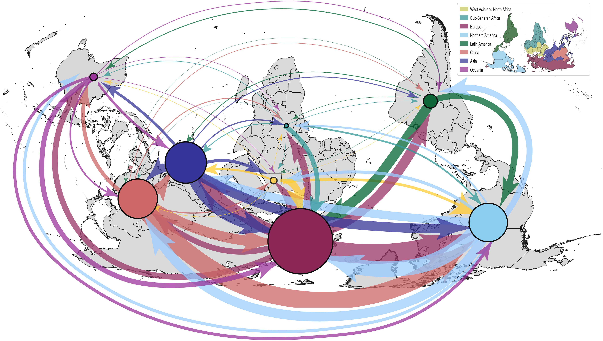</a>
  </div>
</div>

<div class="list" style="font-size: 10px; text-align: left;">
    <ul>
      <li>Marks <em>et al.</em> (2023) A critical analysis of plant science literature reveals ongoing inequities. DOI: <a href="https://doi.org/10.1073/pnas.2217564120" target="_blank">10.1101/2022.10.15.512190</a></li>
      <li><strong>A</strong> <em>et al.</em> (2022) The shape of aroma: measuring and modeling citrus oil gland distribution. DOI: <a href="https://doi.org/10.1002/ppp3.10333" target="_blank">10.1002/ppp3.10333</a></li>
      <li><strong>A</strong> <em>et al.</em> (2022) Genomics data analysis via spectral shape and topology. DOI: <a href="https://doi.org/10.48550/arXiv.2211.00938" target="_blank">10.48550/arXiv.2211.00938</a></li>
      <li>VanBuren<em>et al.</em> (2022) Teaching tools in plant biology. Plants and Python, coding from scratch in the plant sciences. DOI: <a href="https://doi.org/10.1093/plcell/koac187" target="_blank">10.1093/plcell/koac187</a>.</li>
      <li><strong>A</strong> <em>et al.</em> (2021) Measuring hidden phenotype: Quantifying the shape of barley seeds using the Euler Characteristic Transform. DOI: <a href="https://doi.org/10.1093/insilicoplants/diab033" target="_blank">10.1093/insilicoplants/diab033</a></li>
      <li><strong>A</strong> <em>et al.</em> (2020) The shape of things to come: Topological data analysis and biology, from molecules to organisms. DOI: <a href="https://doi.org/10.1002/dvdy.175" target="_blank">10.1002/dvdy.175</a></li>
    </ul>
</div>

---

# The shape of things to come

<div class="row" style="font-family: 'Yanone Kaffeesatz'; font-size:22px;">
  <div class="column" style="max-width:33%">
    <p style="line-height:0;font-size:28px;text-align: center;">The shape of data</p>
    </img>
    </img>
    <p style="text-align: center;">Ultra quick introduction</p>
    <p style="text-align: center;">TDA + Biology in literature</p>
  </div>
  <div class="column" style="max-width:33%">
    <p style="line-height:0;font-size:28px;text-align: center;">The shape of development</p>
    </img>
    </img>
    <p style="text-align: center;">Oil gland distributions</p>
    <p style="text-align: center;">Persistent Homology</p>
  </div>
  <div class="column" style="max-width:33%">
    <p style="line-height:0;text-align: center; font-size:28px">The shape of adaptability</p>
    </img>
    </img>
    <p style="text-align: center;">Seed phenotyping</p>
    <p style="text-align: center;">Euler Characteristic Transform</p>
  </div>
</div>

---

class: inverse, middle, center

# 1. Shape is data and data is shape

## TDA meets biology in a number of ways

### The significance of detecting connected components and holes

---

# 1st TDA Ingredient: Complexes

- Think the data as a collection of elementary building blocks ( _cells_ )

Vertices | Edges | Faces | Cubes
---------|-------|-------|-------
  0-dim  | 1-dim | 2-dim | 3-dim

- A collection of cells is a _cubical complex_

- Count the number of topological features ( _holes_ ):

Connected components | Loops | Voids
---------------------|-------|-------
       0-dim         | 1-dim | 2-dim

- Example with 2 connected components, 1 loop, 0 voids

```{r, out.width=500}
knitr::include_graphics("../../tda/figs/binary_to_cubical_complex_textless.png")
```

---

# 2nd TDA Ingredient: Filters

- Each cell is assigned a real value which defines how the complex is constructed.

- Observe how the number of topological features change as the complex grows.

.pull-left[
```{r, out.width="250px"}
knitr::include_graphics(c("../figs/eigcurv_filter.gif", "../figs/gaussian_density_filter.gif"))
```
]

.pull-right[
```{r, out.width="250px"}
knitr::include_graphics(c("../figs/eccentricity_filter.gif", "../figs/vrips_ver2.gif"))
```
]

---

# TDA + Biology in the literature

<div class="row">
  <div class="column" style="max-width:25%">
    
    
    <p style="font-size: 10px; text-align: right; color: Grey;"> Credits: <a href="https://doi.org/10.1016/j.media.2019.03.014">Qaiser <em>et al.</em> (2019)</a></p>
  </div>
  <div class="column" style="max-width:25%">
    
    
    <p style="font-size: 10px; text-align: right; color: Grey;"> Credits: <a href="https://doi.org/10.1073/pnas.1313480110">Chan <em>et al.</em> (2013)</a></p>
  </div>
  <div class="column" style="max-width:22%">
    
    
    
    <p style="font-size: 10px; text-align: right; color: Grey;"> Credits: <a href="https://doi.org/10.1515/sagmb-2015-0057">Kovacev-Nikolic <em>et al.</em> (2016)</a></p>
  </div>
  <div class="column" style="max-width:28%">
    
    <p style="font-size: 10px; text-align: right; color: Grey;"> Credits: <a href="https://doi.org/10.1007/978-3-030-20867-7_7">Chitwood <em>et al.</em> (2019)</a></p>
  </div>
</div>

<div class="row" style="font-family: 'Yanone Kaffeesatz'; font-size:25px;">
  <div class="column" style="width:25%;">
    <p style="text-align: center;">Holes</p>
    <p style="text-align: center;">&darr;</p>
    <p style="text-align: center;">Cancerous tissue</p>
  </div>
  <div class="column" style="width:25%;">
    <p style="text-align: center;">Holes</p>
    <p style="text-align: center;">&darr;</p>
    <p style="text-align: center;">Horizontal Reassortment</p>
  </div>
  <div class="column" style="width:25%;">
    <p style="text-align: center;">Holes</p>
    <p style="text-align: center;">&darr;</p>
    <p style="text-align: center;">Open/closed conformations</p>
  </div>
  <div class="column" style="width:25%;">
    <p style="text-align: center;">Components</p>
    <p style="text-align: center;">&darr;</p>
    <p style="text-align: center;">Panicle structure</p>
  </div>
</div>

---

## Persistent Homology: the Vietoris-Rips Complex

.pull-left[
Given:
- Point cloud $X$
- Distance $r$

The Vietoris-Rips complex, $VR(X, r)$, is a simplicial complex where:

- If $n$ points have pairwise distances $\leq r$ , then the $n − 1$ simplex formed by those points is added.
]

.pull-right[

<p style="font-size: 10px; text-align: right; color: Grey; line-height:0; margins:0;padding:0;"> Credits: Sarah Percival</p>
]

---

## Persistent Homology: Persistence Diagrams


<p style="font-size: 10px; text-align: right; color: Grey; line-height:0; margins:0;padding:0;"> Credits: Sarah Percival</p>

- Keep track of the birth and death of topological features in a death-vs-birth time diagram

- Handwavily: it is the multiset $\text{dgm} = \bigcup_{d\geq0}\{(\text{birth},\,\text{death})_d\}\cup\text{diagonal}.$

---

## Compare PDs via the Bottleneck distance


Given two persistence diagrams $\text{dgm}_1$ and $\text{dgm}_2$, consider $\Gamma$ the set of all bijections between these two multisets and

$$d_B(\text{dgm}(X),\text{dgm}(Y)) = \inf_{\gamma\in\Gamma}\sup_{p\in\text{dgm}(X)}\| p - \gamma(p)\|_\infty$$

---

## The motivation

- TL;DR: If the original point cloud wiggles a tiny bit, then the elements of its Vietoris-Rips-related persistence diagram will wiggle only a tiny bit as well.

<hr>

- **Theorem (Chazal, de Silva, Oudot, 2013)**: The bottleneck distance is stable with respect to the Gromov-Hausdorff distance. For $X$ and $Y$ totally bounded metric spaces,
$$d_B(\text{dgm}(X),\text{dgm}(Y)) \leq 2d_{GH}(X, Y).$$
Where $d_{GH}$ is the Gromov-Hausdorff distance.

- The GH distance is a generalization of the Hausdorff distance: If $X$, $Y$ are two subsets of the same metric space, then

$$d_H(X,Y) = \inf\{\varepsilon > 0 | X\subset Y^\varepsilon, \; Y\subset X^\varepsilon\}$$

- If $X$, $Y$ are any two spaces, then

$$d_{GH}(X,Y)  = \inf_{\text{isometric embeddings}\;X\hookrightarrow Z,\:Y\hookrightarrow Z}\{d_H^Z(X,Y)\}$$

---

# Topology: The Euler characteristic

$$\begin{align} \chi &= \#(\text{Vertices}) - \#(\text{Edges}) + \#(\text{Faces}) \\ &= \#(\text{Connected Components}) - \#(\text{Loops}) + \#(\text{Voids}). \end{align}$$

<div class="row">
  <div class="column" style="width:5%">
  </div>
  <div class="column" style="max-width:30%">
    
  </div>
  <div class="column" style="max-width:30%">
    
  </div>
  <div class="column" style="max-width:30%">
    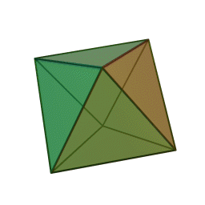
  </div>
  <div class="column" style="width:5%">
  </div>
</div>

<div class="row">
  <div class="column" style="width:5%">
  </div>
  <div class="column" style="max-width:30%">
    
  </div>
  <div class="column" style="max-width:30%">
    
  </div>
  <div class="column" style="max-width:30%">
    <p style="padding: 50px 0 0 10px; font-size: 48px; text-align: center; color: #18453B; line-height: 1.25; font-family: 'Yanone Kaffeesatz';"> V - E + F = 2</p>
  </div>
  <div class="column" style="width:5%">
  </div>
</div>

---

background-image: url("../figs/ecc_ver2.gif")
background-size: 750px
background-position: 50% 90%

# Euler Characteristic Curve (ECC)

- Consider a cubical complex $X\subset\mathbb{R}^d$
- And a unit-length direction $\nu\in S^{d-1}$

- And the subcomplex containing all cubical cells below height $h$ in the direction $\nu$
$$X(\nu)_h =\{\Delta \in X\::\:\langle x,\nu\rangle\leq h\text{ for all }x\in\Delta\}$$

- The Euler Characteristic Curve (ECC) of direction $\nu$ is defined as the sequence $$\{\chi(X(\nu)_h)\}_{h\in\mathbb{R}}$$

---

background-image: url("../figs/ect_ver2.gif")
background-size: 800px
background-position: 50% 88%

## Euler Characteristic Transform (ECT)

- Repeat and concatenate for all possible directions.

$$
\begin{split}
ECT(X):\; & S^{d-1} \to \mathbb{Z}^{\mathbb{R}}\\
&\nu\mapsto\{\chi(X(\nu)_h)\}_{h\in\mathbb{R}}.
\end{split}
$$

- [**Theorem** (Turner, Mukherjee, Boyer 2014) & (Curry, Mukherjee, Turner, 2018)](http://arxiv.org/abs/1805.09782):  The ECT is injective with a finite bound of necessary directions.

---

background-image: url("../figs/turner_etal_2014.png")
background-size: 280px
background-position: 99% 1%


# The motivation

- Easy to compute: a quick alternating sum.

- *Different* simplicial complexes correspond to *different* ECTs.

- [**Theorem _(ibid)_**](https://arxiv.org/abs/1310.1030): The ECT effectively summarizes all possible information related to shape.

There is elusive math research on computationally efficient reconstruction algorithms:
- [Turner, Mukherjee, Curry (2021)](https://arxiv.org/abs/1805.09782): Finite number of directions
- [Betthauser (2018)](https://people.clas.ufl.edu/peterbubenik/files/Betthauser_Thesis.pdf): 2D reconstruction
- [Fasy, Micka, Millman, Schenfisch, Williams (2022)](https://arxiv.org/abs/1912.12759): 3D reconstruction
- [Crawford, Monod, Chen, Mukherjee, Rabadan (2020)](https://doi.org/10.1080/01621459.2019.1671198): Smooth ECT
- [Jiang, Kurtek, Needham (2020)](https://openaccess.thecvf.com/content_CVPRW_2020/papers/w50/Jiang_The_Weighted_Euler_Curve_Transform_for_Shape_and_Image_Analysis_CVPRW_2020_paper.pdf): Weighted ECT

```{r, out.width="500px"}
knitr::include_graphics(c("../../arabidopsis/figs/ect_col-0_pot0_leaf0.gif"))
```

---

# Shameless plug

- [Review paper](https://doi.org/10.1002/dvdy.175) with more content, references, and examples

```{r, out.width="550px"}
knitr::include_graphics(c("../../tda/figs/amezquita_etal_2020.png"))
```

- [Jupyter notebook](https://github.com/amezqui3/demeter/blob/main/tutorial/nappn2022_shape_of_things_to_come.ipynb) with even more links and resources: `bit.ly/nappn22`

```{r, out.width="250px"}
knitr::include_graphics(c("../figs/github_demeter.png"))
```

- This slides: `bit.ly/ustars23`

---

class: center, inverse, middle

# 2. If life gives you lemons...

## Modeling citrus oil gland distribution

### Comparing limes to oranges with directional statistics

---

## Think of citrus as lego blocks


<p style="font-size: 10px; text-align: right; color: Grey;"> Credits: <a href="https://doi.org/10.1038/nature25447">Wu <em>et al.</em> (2018)</a></p>

---

## X-rays &rarr; Image Processing &rarr; Oil glands

<div class="row">
  <div class="column" style="max-width:37%; color: Navy; font-size: 15px;">
    
    <p style="text-align: center;">UCR Collaboration</p>
  </div>
  <div class="column" style="max-width:37%; color: Navy; font-size: 15px;">
    
    <p style="text-align: center;">3D X-Ray CT scan</p>
  </div>
  <div class="column" style="max-width:25%; color: Navy; font-size: 15px;">
    
    <p style="text-align: center;">Fruit development</p>
  </div>
</div>

<div class="row" style="color: black; font-size: 20px; font-family: 'Yanone Kaffeesatz'; margin: 0 auto;">
  <div class="column" style="max-width:20%;">
    
    <p style="text-align: center;"> Endocarp </p>
  </div>
  <div class="column" style="max-width:20%;">
    
    <p style="text-align: center; padding:5px 0;"> Rind </p>
  </div>
  <div class="column" style="max-width:20%;">
    
    <p style="text-align: center;"> Exocarp </p>
  </div>
  <div class="column" style="max-width:20%;">
    
    <p style="text-align: center;"> Oil glands</p>
  </div>
  <div class="column" style="max-width:20%;padding: 10px 0 0 20px;">
    <p>
      <li>53 different citrus species</li><br>
      <li>All fundamental lego blocks and several relatives and hybrids of interest</li><br>
      <li>166 individual fruits</li>
    </p>
  </div>
</div>

---

background-image: url("../../citrus/figs/lambert_equal_area_N.gif")
background-size: 150px
background-position: 98% 1%

class: middle

## Citrus modeling: Sour and sweet orange

```{r, out.width=800, fig.align='center'}
knitr::include_graphics(c('../../citrus/figs/SR01_CRC3289_12B-19-9_L00_lambproj.jpg',
                          '../../citrus/figs/SW03_CRC1241-B_12B-4-3_L00_lambproj.jpg'))
```

---

background-image: url("../../citrus/figs/lambert_equal_area_N.gif")
background-size: 150px
background-position: 98% 1%

class: middle

## Distortions: Kumquat and finger lime

```{r, out.width=800, fig.align='center'}
knitr::include_graphics(c('../../citrus/figs/WR02_CRC3877_12B-44-13_L00_lambproj.jpg',
                          '../../citrus/figs/WR08_CRC3661_18B-16-5_L00_lambproj.jpg'))
```

---

background-image: url("../../citrus/crc_pics/som_keowan_mandarin.jpg")
background-size: 150px
background-position: 98% 1%


## Persistent Homology for Mandarins

<div class="row">
  <div class="column" style="max-width:30%">
    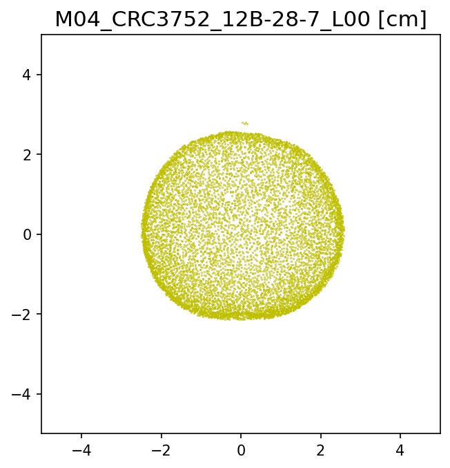
    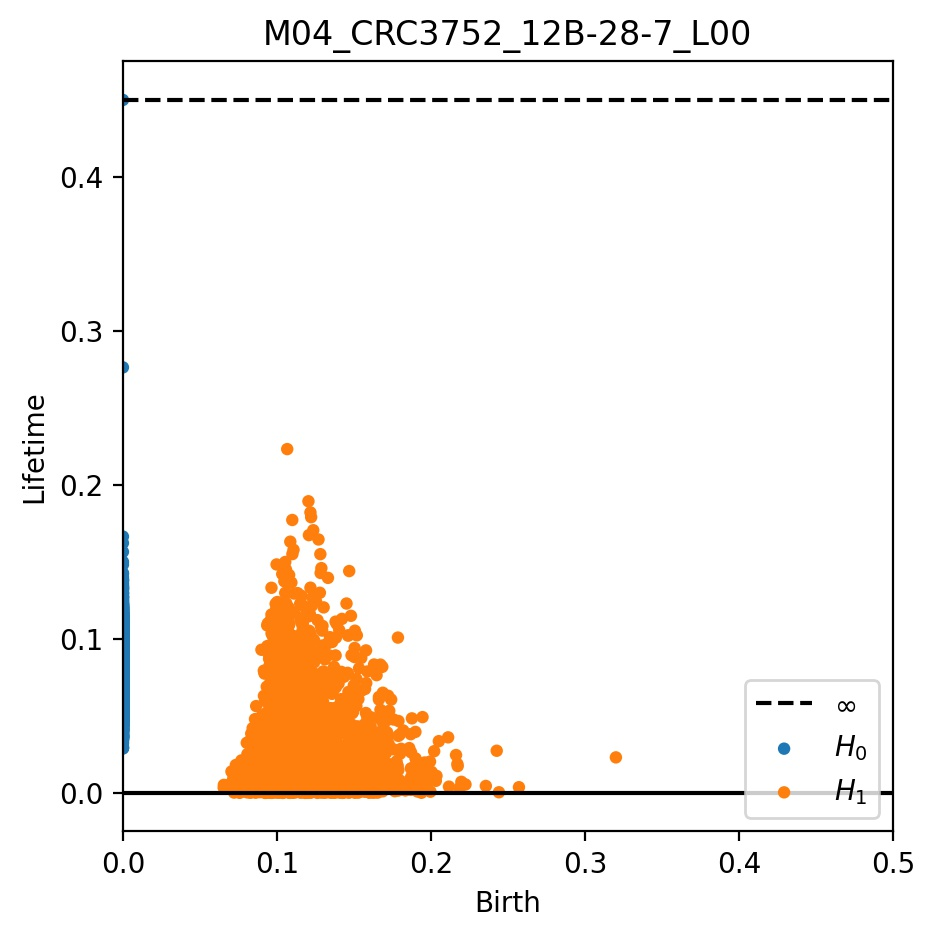
  </div>
  <div class="column" style="max-width:30%">
    
    
  </div>
  <div class="column" style="max-width:30%">
    
    
  </div>
</div>

Persistent Homology ( $H_0$ and $H_1$) computed with Ripser in `scikit-tda`.

---

background-image: url("../../citrus/crc_pics/scarlet_emperor_mandarin.jpg")
background-size: 150px
background-position: 98% 1%

## Persistent Homology for other Mandarins

<div class="row">
  <div class="column" style="max-width:30%">
    
    
  </div>
  <div class="column" style="max-width:30%">
    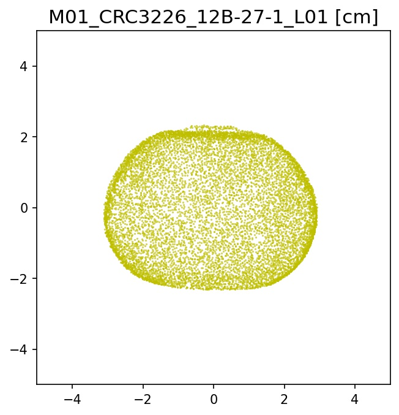
    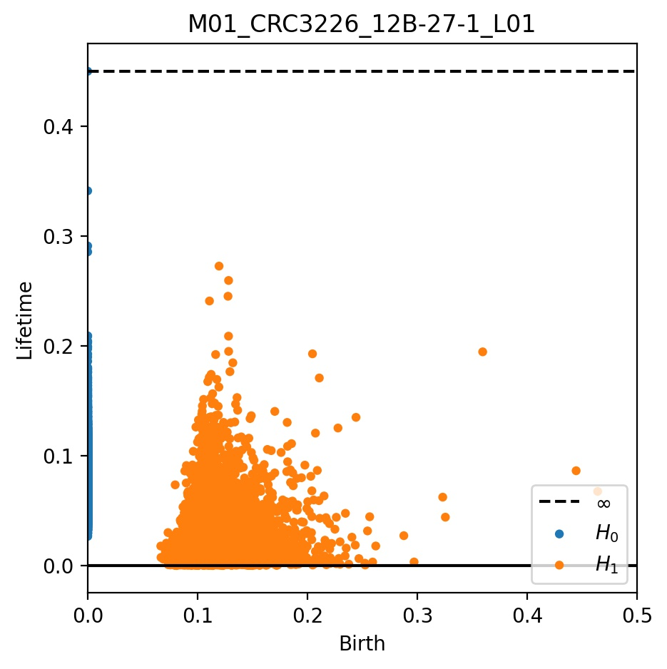
  </div>
  <div class="column" style="max-width:30%">
    
    
  </div>
</div>

Persistent Homology ( $H_0$ and $H_1$) computed with Ripser in `scikit-tda`.

---

background-image: url("../../citrus/crc_pics/lamas_lemons.jpg")
background-size: 150px
background-position: 98% 1%

## PH of Lamas Lemons

<div class="row">
  <div class="column" style="max-width:30%">
    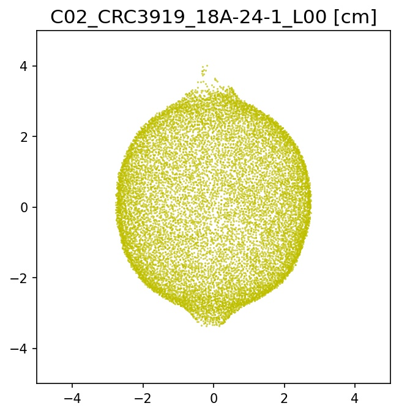
    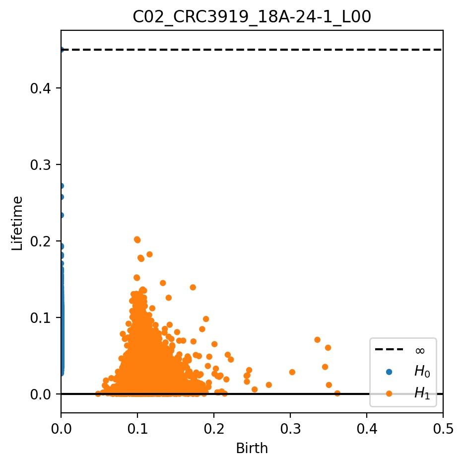
  </div>
  <div class="column" style="max-width:30%">
    
    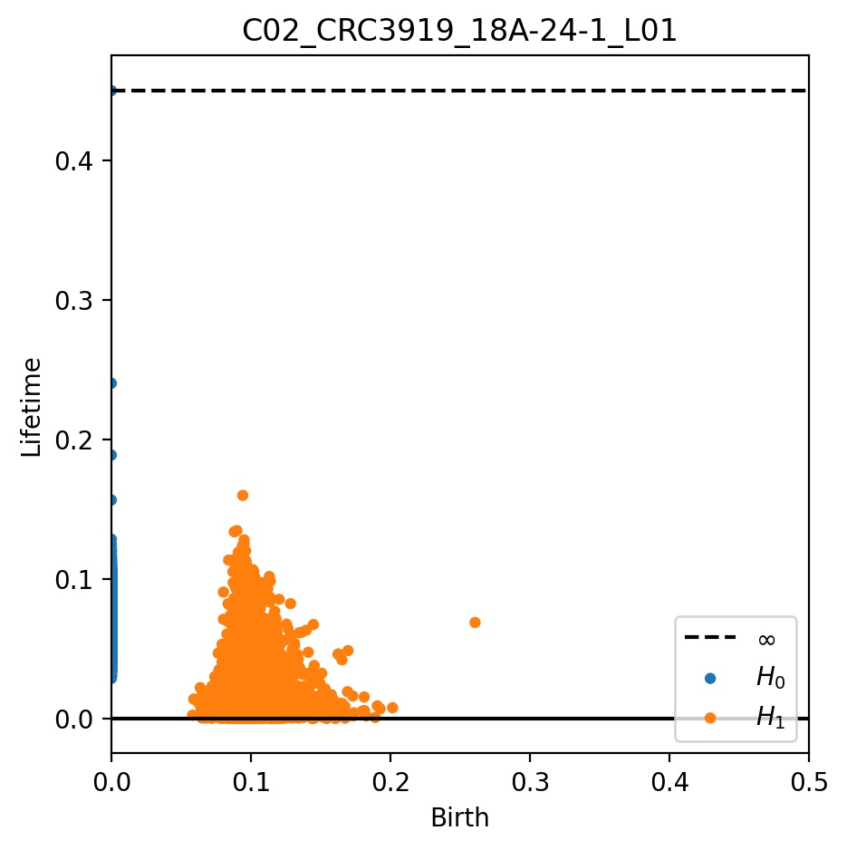
  </div>
  <div class="column" style="max-width:30%">
    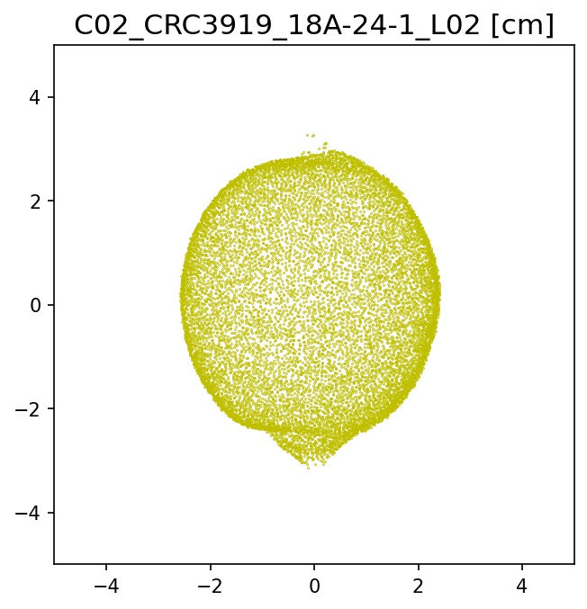
    
  </div>
</div>

Persistent Homology ( $H_0$ and $H_1$) computed with Ripser in `scikit-tda`.

---

background-image: url("../../citrus/crc_pics/nagami_kumquat.jpg")
background-size: 150px
background-position: 98% 1%

## PH of Nagami kumquats

<div class="row">
  <div class="column" style="max-width:30%">
    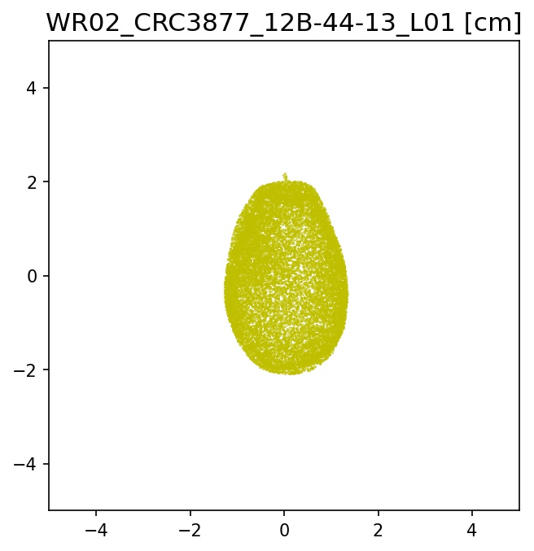
    
  </div>
  <div class="column" style="max-width:30%">
    
    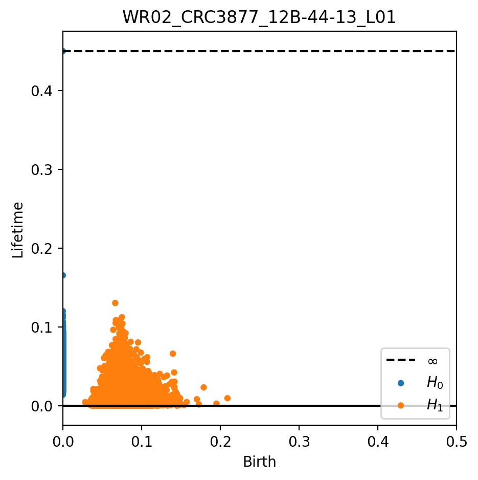
  </div>
  <div class="column" style="max-width:30%">
    
    
  </div>
</div>

Persistent Homology ( $H_0$ and $H_1$) computed with Ripser in `scikit-tda`.


---

background-image: url("../../citrus/crc_pics/finger_lime.jpg")
background-size: 150px
background-position: 98% 1%


## PH for finger limes

<div class="row">
  <div class="column" style="max-width:30%">
    
    
  </div>
  <div class="column" style="max-width:30%">
    
    
  </div>
  <div class="column" style="max-width:30%">
    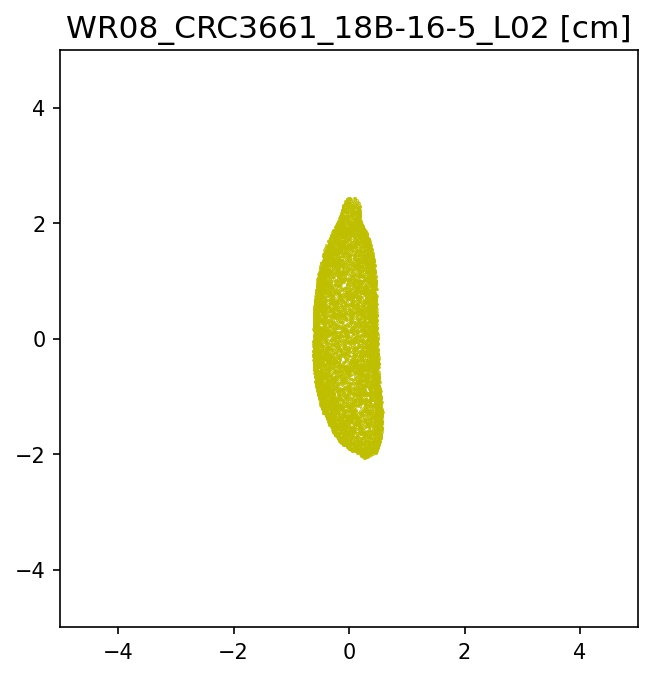
    
  </div>
</div>

Persistent Homology ( $H_0$ and $H_1$) computed with Ripser in `scikit-tda`.

---

# Summary

.left-column[

```{r, out.width=150, fig.align='center'}
knitr::include_graphics(c('../../citrus/crc_pics/citrus_amblycarpa.jpg',
                          '../../citrus/figs/SR01_L01_black_exocarp.gif',
                          '../../citrus/figs/SW03_CRC1241-B_12B-4-3_L00_lambproj_v.jpg'))
```

]

.right-column[

- It is possible to **compare** ~~apples~~ limes to oranges, despite diversity in shapes and sizes.

- We can define the non-parametrical **distributions** of oil glands for most of the citrus.

- **First** time citrus shape has been examined using X-ray CT scans.

- This is also the **first** time TDA has been **applied** to this sort of contexts.
]

---

class: inverse, middle, center

# 3. Quantifying the barley morphology

## Brewing with the Euler Characteristic Transform

---

<div class="row">
  <div class="column" style="max-width:44%">
    <a href="https://kizilvest.ru/20150827-v-kizilskom-rajone-nachalas-uborochnaya-strada/" target="_blank"></a>
    <a href="https://ipad.fas.usda.gov/highlights/2008/11/eth_25nov2008/" target="_blank">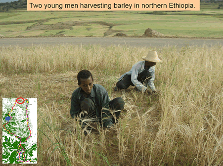</a>
    <a href="https://www.doi.org/10.1007/978-1-4419-0465-2_2168" target="_blank"></a>
  </div>
  <div class="column" style="max-width:44%">
    <a href="https://www.resilience.org/stories/2020-03-09/the-last-crop-before-the-desert/" target="_blank"></a>
    <a href="https://www.tibettravel.org/tibetan-culture/highland-barley.html" target="_blank"></a>
    <a href="https://www.nationalgeographic.co.uk/travel/2020/05/photo-story-from-barley-fields-to-whisky-barrels-in-rural-scotland" target="_blank"></a>
  </div>
  <div class="column" style="max-width:8%; font-size: 15px;">
    <p style="text-align: center; font-size: 30px; line-height: 1em;"> <strong> Barley across the world </strong></p>
    <p>Kiliskoye (Chelyabinsk, Russia)</p>
    <p>Marchouch (Rabat, Morocco)</p>
    <p>Aksum (Tigray, Ethiopia)</p>
    <p>Salar (Tsetang, Tibet)</p>
    <p>Expansion of the barley. </p>
    <p>Turriff (Aberdeenshire, Scotland)</p>
  </div>
</div>

---

## Evolution in real time &rarr; X-rays &rarr; Image Processing

<div class="row">
  <div class="column" style="max-width:41%; color: Navy; font-size: 15px;">
    
    <p style="text-align: center;">28 accessions around the world</p>
  </div>
  <div class="column" style="max-width:50%; color: Navy; font-size: 15px;">
    
    <p style="text-align: center;">58 generations in California</p>
  </div>
</div>

<div class="row">
  <div class="column" style="max-width:51%; color: Navy; font-size: 15px;">
    
    <p style="text-align: center;"> Proprietary X-Ray CT scan reconstruction </p>
  </div>
  <div class="column" style="max-width:17.5%; color: Navy; font-size: 15px;">
    
    <p style="text-align: center;"> 975 spikes </p>
  </div>
  <div class="column" style="max-width:20.5%; color: Navy; font-size: 15px;">
    
    <p style="text-align: center;"> 38,000 seeds </p>
  </div>
</div>

---

background-image: url("../figs/S017_L0_seed_10_0.gif")
background-size: 85px
background-position: 90% 2%

# Traditional shape descriptors

<div class="row">
  <div class="column" style="max-width:55%">
    
    
  </div>
  <div class="column" style="max-width:45%">
    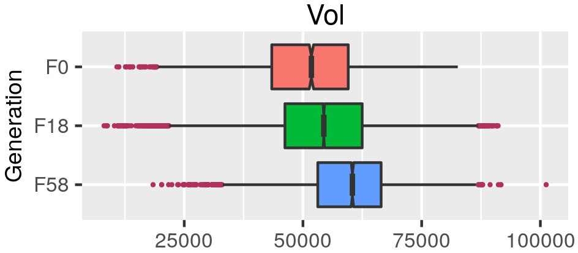
    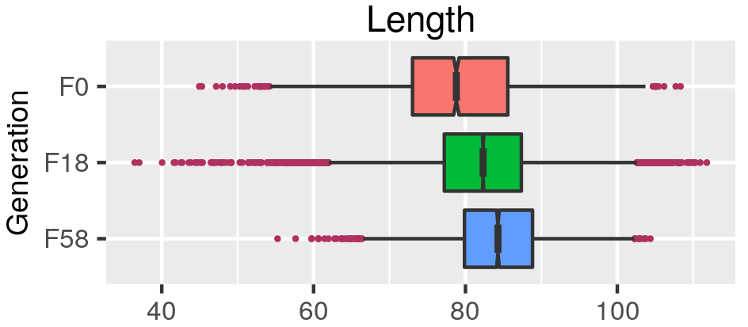
    
  </div>
</div>

---

background-image: url("../figs/ect_ver2.gif")
background-size: 600px
background-position: 50% 98%

# Topological shape descriptors

.pull-left[
```{r, out.width=250}
knitr::include_graphics('../figs/pole_directions_p7_m12_crop.jpg')
```
]

.pull-right[
- 158 directions

- 16 slices per direction

- Every seed is associated a $158\times16=2528$-dim vector

- Reduced to 12 dimensions with UMAP
]


---

# Supervised Learning


---

# Quantify the shape of barley

**Goal:** Classify the **28** founding barley varieties solely by grain morphology information.

<style type="text/css">
.tg  {border-collapse:collapse;border-color:#93a1a1;border-spacing:0;margin:0px auto;}
.tg td{background-color:#fdf6e3;border-bottom-width:1px;border-color:#93a1a1;border-style:solid;border-top-width:1px;
  border-width:0px;color:#002b36;font-family:Arial, sans-serif;font-size:14px;overflow:hidden;padding:10px 5px;
  word-break:normal;}
.tg th{background-color:#657b83;border-bottom-width:1px;border-color:#93a1a1;border-style:solid;border-top-width:1px;
  border-width:0px;color:#fdf6e3;font-family:Arial, sans-serif;font-size:14px;font-weight:normal;overflow:hidden;
  padding:10px 5px;word-break:normal;}
.tg .tg-2bhk{background-color:#eee8d5;border-color:inherit;text-align:left;vertical-align:top}
.tg .tg-0pky{border-color:inherit;text-align:left;vertical-align:top}
.tg .tg-gyvr{background-color:#eee8d5;border-color:inherit;font-size:100%;text-align:left;vertical-align:top}
</style>
<table class="tg">
<thead>
  <tr>
    <th class="tg-0pky">Shape descriptors</th>
    <th class="tg-0pky">No. of descriptors</th>
    <th class="tg-0pky">F1</th>
  </tr>
</thead>
<tbody>
  <tr>
    <td class="tg-2bhk">Traditional</td>
    <td class="tg-2bhk">11</td>
    <td class="tg-2bhk">0.55 &plusmn; 0.019</td>
  </tr>
  <tr>
    <td class="tg-0pky">Topological</td>
    <td class="tg-0pky">12</td>
    <td class="tg-0pky">0.74 &plusmn; 0.016</td>
  </tr>
  <tr>
    <td class="tg-2bhk">Combined</td>
    <td class="tg-2bhk">23</td>
    <td class="tg-2bhk"><strong>0.86 &plusmn; 0.010</strong></td>
  </tr>
</tbody>
</table>

### What does topology actually measure?

.pull-left[
```{r, out.width=225}
knitr::include_graphics(c('../figs/discerning_directions.png'))#, '../figs/arrow_seed_09_0.gif'))
```
]

.pull-right[

]

---

# Predicting with Semi-Supervised Learning


---

# Prediction into semi-supervised territory

- Train an SVM with 100% of the founders $(F_0)$

- Classify the progeny $(F_{18}\text{ and }F_{58})$ to detect genotype enrichment

.pull-left[

]

.pull-right[
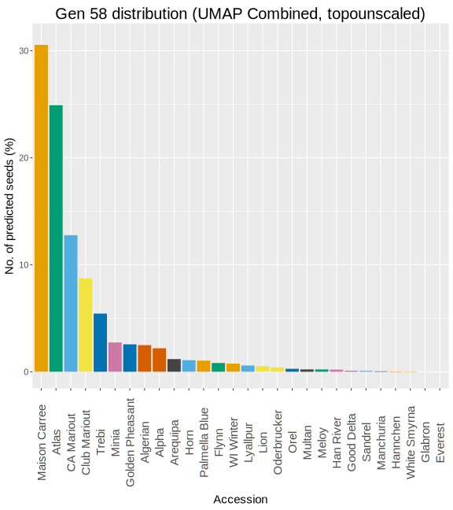
]

---

background-image: url("../figs/comparison_lines_combined_topounscaled_d158_T16_horz.png")
background-size: 900px
background-position: 50% 70%

## Observe shape distribution across lines

---

## Barley scratching the surface: Future directions

.left-column[


]

.right-column[
- Identify specific molecular markers corresponding to morphological differences across the diverse barley population.

- Develop a high-throughput pipeline to produce 3D images of individual barley seeds and quantify comprehensively their morphology.

- Formalize a method for promising seedling selection to further crop breeeding.

- Extend such pipeline and population genetics studies to other crops and grains.
]

---

background-image: url("https://media.istockphoto.com/id/1253437873/vector/yellow-warning-sign-work-in-progress-background.jpg?s=612x612&w=0&k=20&c=n4Mx6V6PNufYx6jTI-RzLsUHCjOLx-ypUxb5w7RKDuo=")
background-size: 150px
background-position: 50% 2%

class: inverse, center, middle

# 4. All about cracks, kernels, and domestication

## In a nutshell

```{r, out.width=200, fig.align='center'}
knitr::include_graphics('https://upload.wikimedia.org/wikipedia/commons/3/39/Benutzung_eines_Nussknackers.gif')
```

---

# The wal(nu)tzing nutcracker!

<div class="row" style="font-family: 'Yanone Kaffeesatz'; margin: 0 auto; font-size:22px">
  <div class="column" style="max-width:25%;">
    
    <p style="text-align: center;">148 accessions</p>
  </div>
  <div class="column" style="max-width:42%;">
    
    <p style="text-align: center;">1301 walnuts scanned</p>
  </div>
  <div class="column" style="max-width:33%;">
    
    <p style="text-align: center;">Qualitative data for crackability</p>
  </div>
</div>

<div class="row" style="font-size: 22px; font-family: 'Yanone Kaffeesatz'; margin: 0 auto;">
  <div class="column" style="max-width:20%;">
    
    <p style="text-align: center; margin: 0.5ex;">Shell</p>
  </div>
  <div class="column" style="max-width:20%;">
    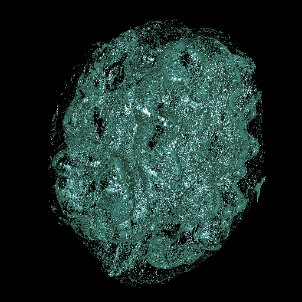
    <p style="text-align: center;margin: 0.5ex; ">Air</p>
  </div>
  <div class="column" style="max-width:20%;">
    
    <p style="text-align: center;margin: 0.5ex; ">Packing tissue</p>
  </div>
  <div class="column" style="max-width:20%;">
    
    <p style="text-align: center;margin: 0.5ex;">Kernel</p>
  </div>
  <div class="column" style="max-width:20%; padding: 0 0 0 5px">
    <p style="margin:5px 0 0 0; text-align:left">
      &#9656;&ensp;Individuals separated manually<br>
      &#9656;&ensp;Tissues separated with watershed segmentation<br>
      &#9656;&ensp;38 traditional shape and size descriptors
    </p>
  </div>
</div>

---

## Can you spot the Earliest Himalayan accession?

```{r, out.width=500, fig.align='center'}

```

This one accession is the most heterozygous wild type of the bunch

---

## The Earliest Himalayan accession breaks the pattern

```{r, out.width=725, fig.align='center'}
knitr::include_graphics(c('../../walnuts/figs/NewStuke_R1_T18_vs_2014SBa_R7_T26.png'))
```

--

```{r, out.width=725, fig.align='center'}
knitr::include_graphics(c('../../walnuts/figs/qual_85-023-2_scatter.jpg'))
```

- The kernel of Earliest has deeper, wider cavities
- Does it refer to the cavity located at the proximal end?

---

class: center, inverse, middle

# 5. Future directions

## Barley scratching the surface

---

# Grains, oranges, and nuts oh my!

.left-column[

```{r, out.width=100, fig.align='center'}
knitr::include_graphics(c('../figs/S017_L3_1.gif',
                          '../../citrus/figs/SR01_L01_black_exocarp.gif',
                          '../../walnuts/figs/2014SBa_R5_T81_meat_2.gif'))
```

]

.right-column[
- Identify specific **molecular markers** corresponding to topological traits of **barley seeds**.
- Develop a high-throughput **seed phenotyping** pipeline for seed morphology.

- Compute a pairwise distance matrix for citrus oil gland **distributions**.
- Use **persistent homology** as an alternative to quantify the distribution of such oil glands.

- Measure the size and volume of the central **cavity** of the walnut kernel.
- Use the ECT or a similar approach to quantify **nuances** present in the kernel.
]


---

background-image: url("../../cmse/figs/institutional_logos.jpg")
background-size: 500px
background-position: 95% 1%

class: inverse

## Thank you!

<div class="row" style="margin-top: -25px;">
  <div class="column" style="max-width:17.5%; font-size: 13px;">
    
    <p style="text-align: center; color: White">Liz Munch<br>(MSU)</p>
    
    <p style="text-align: center; color: White">Tim Ophelders<br>(Utrecht)</p>
    
    <p style="text-align: center; color: White">Jacob Landis<br>(Cornell)</p>
  </div>
  <div class="column" style="max-width:17.5%; font-size: 13px;">
    
    <p style="text-align: center; color: White">Dan Chitwood<br>(MSU)</p>
    
    <p style="text-align: center; color: White">Michelle Quigley<br>(MSU)</p>
    
    <p style="text-align: center; color: White">Pat Brown<br>(UC Davis)</p>
  </div>
  <div class="column" style="max-width:13%; font-size: 13px;">
  
  <p style="text-align: center; color: White">Dan Koenig<br>(UC Riverside)</p>
  
  <p style="text-align: center; color: White">Danelle Seymour<br>(UC Riverside)</p>
  </div>
  <div class="column" style="width:10%; font-size: 24px;">
  </div>
  <div class="column" style="max-width:40%; font-size: 24px; line-height:1.25">
  <p style="text-align: center; color: White"><strong>Committee Members</strong></p>
  <p style="text-align: center; color: White; font-size: 18px;">Liz Munch<br>Dan Chitwood<br>José Perea<br>Addie Thompson</p>
  <p style="text-align: center; color: White"><strong>References</strong></p>
  <p style="color: White; font-size: 12px; text-align:left">
    <strong>A</strong> <em>et al.</em> (202?) The shape of walnuts, kernels, and domestication, in a nutshell. <em>In preparation</em>
  </p>
  <p style="color: White; font-size: 12px; text-align:left">
    <strong>A</strong> <em>et al.</em> (2022) The shape of aroma: measuring and modeling citrus oil gland distribution. <a href="https://doi.org/10.1002/ppp3.10333" target="_blank">DOI: 10.1002/ppp3.10333</a>
  </p>
  <p style="color: White; font-size: 12px; text-align:left">
    <strong>A</strong> <em>et al.</em> (2021) Measuring hidden phenotype: Quantifying the shape of barley seeds using the Euler Characteristic Transform. <a href="https://doi.org/10.1093/insilicoplants/diab033" target="_blank">DOI: 10.1093/insilicoplants/diab033</a>
  </p>
  <p style="color: White; font-size: 12px; text-align:left">
    <strong>A</strong> <em>et al.</em> (2020) The shape of things to come: Topological data analysis and biology, from molecules to organisms. <a href="https://doi.org/10.1002/dvdy.175" target="_blank">DOI: 10.1002/dvdy.175</a>
  </p>
    <p style="text-align: center; color: White; font-size:15px; line-height:1.1">Slides made in RStudio <a href="https://bookdown.org/yihui/rmarkdown/xaringan.html" target="_blank">xaringan</a>.</p>
  </div>
</div>
