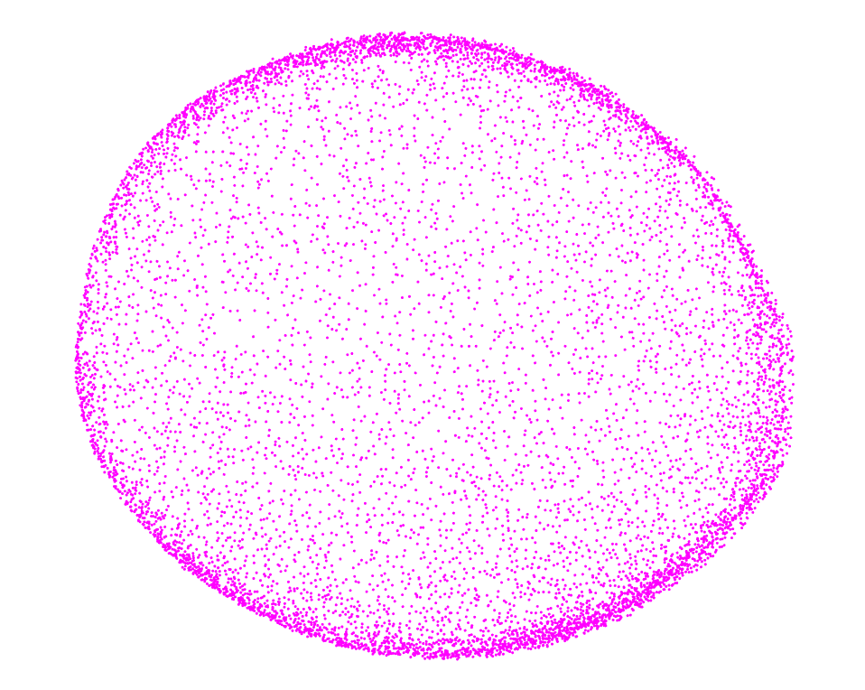
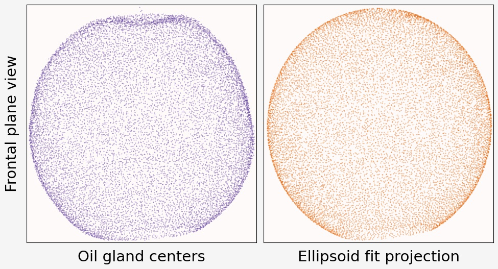
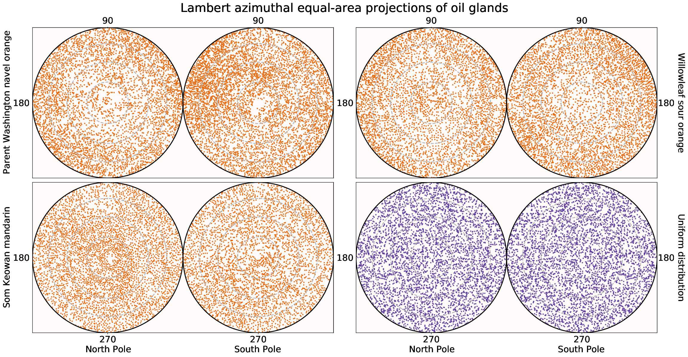

```{r setup, include=FALSE}
library(knitr)

# <!-- Copies an HTML dependency to a subdirectory of the given directory. The subdirectory name willbename-version(for example, "outputDir/jquery-1.11.0"). You may setoptions(htmltools.dir.version= FALSE)to suppress the version number in the subdirectory name. -->
options(htmltools.dir.version = FALSE)
knitr::opts_chunk$set(echo = FALSE)
knitr::opts_chunk$set(fig.align = 'center')
```
class: inverse, center

# When life gives you lemons...

<div class="row">
  <div class="column" style="max-width:50%">
    <iframe width="375" height="210" src="https://www.youtube-nocookie.com/embed/khRS5AuleIM?controls=0" frameborder="0" allow="accelerometer; autoplay; encrypted-media; gyroscope; picture-in-picture" allowfullscreen></iframe>
    <iframe width="375" height="210" src="https://www.youtube-nocookie.com/embed/HAIaektvV3Q?controls=0" frameborder="0" allow="accelerometer; autoplay; encrypted-media; gyroscope; picture-in-picture" allowfullscreen></iframe>
  </div>
  <div class="column" style="max-width:50%">
    <iframe width="375" height="210" src="https://www.youtube-nocookie.com/embed/Xo2HULkkm3s?controls=0" frameborder="0" allow="accelerometer; autoplay; encrypted-media; gyroscope; picture-in-picture" allowfullscreen></iframe>
    <iframe width="375" height="210" src="https://www.youtube-nocookie.com/embed/EwTwSNrBuIo?controls=0" frameborder="0" allow="accelerometer; autoplay; encrypted-media; gyroscope; picture-in-picture" allowfullscreen></iframe>
  </div>
</div>

---

## Think of citrus as lego blocks


<p style="font-size: 8px; text-align: right; color: Grey;"> Credits: <a href="https://doi.org/10.1038/nature25447">Wu <em>et al.</em> (2018)</a></p>

---

## Oil glands are closely linked to fruit development

.pull-left[

<p style="font-size: 8px; text-align: right; color: Grey;"> Credits: <a href="https://www.boredpanda.com/life-cycles-pics/">BoredPanda</a></p>

Developing cycle of a lemon
]

.pull-right[
<iframe width="560" height="300" src="https://static-movie-usa.glencoesoftware.com/webm/10.1073/956/d916befc88029defb1ecef6c4a2fd83db89428d9/pnas.1720809115.sm02.webm" frameborder="0" allowfullscreen></iframe>
<p style="font-size: 8px; text-align: right; color: Grey;"> Credits: <a href="https://doi.org/10.1073/pnas.1720809115">Smith <em>et al.</em> (2018)</a></p>

- Cross-sectional view of a navel orange peel bending to the point of jetting. 

- Huge perfume and food industry behind essential oils

]

---

class: inverse, center, middle

# Scan it all!

---

## Raw Data: X-rays &rarr; Image Processing

<div class="row">
  <div class="column" style="max-width:38%; color: Navy; font-size: 15px;">
    
    <p style="text-align: center;"> UCR Collaboration </p>
  </div>
  <div class="column" style="max-width:38%; color: Navy; font-size: 15px;">
    
    <p style="text-align: center;"> 3D X-Ray CT scan </p>
  </div>
  <div class="column" style="max-width:23%; color: Navy; font-size: 15px;">
    
    <p style="text-align: center;"> Raw </p>
  </div>
</div>

--

<div class="row" style="margin: 0 auto;">
  <div class="column" style="max-width:20%; color: Navy; font-size: 15px;">
    
    <p style="text-align: center;"> Spine </p>
  </div>
  <div class="column" style="max-width:20%; color: Navy; font-size: 15px;">
    
    <p style="text-align: center;"> Endocarp </p>
  </div>
  <div class="column" style="max-width:20%; color: Navy; font-size: 15px;">
    
    <p style="text-align: center;"> Rind </p>
  </div>
  <div class="column" style="max-width:20%; color: Navy; font-size: 15px;">
    
    <p style="text-align: center;"> Exocarp </p>
  </div>
  <div class="column" style="max-width:20%; color: Navy; font-size: 15px;">
    
    <p style="text-align: center;"> Oil glands</p>
  </div>
</div>

---

# Allometry

+ Linear relationship between size-related measurements.

<div class="row" style="margin: 0 auto;">
  <div class="column" style="max-width:49%; color: Navy; font-size: 15px;">
    
    
  </div>
  <div class="column" style="max-width:49%; color: Navy; font-size: 15px;">
    
    
  </div>
</div>

+ Total number of glands seems to be decoupled

---

## The centers will be just fine

.pull-left[

- About 6K&rarr;20K individual oil glands detected

- Number in the right ballpark

- **We have a typical point cloud in $\mathbb{R}^3$.**
]

.pull-right[

<p style="font-size: 8px; text-align: right; color: Grey;"> Credits: <a href="https://doi.org/10.1006/anbo.2001.1546">Knight <em>et al.</em> (2001)</a></p>
]

---

## Size and average distance between closest oil glands


- Smaller fruits report higher density of oil glands
- Similar results when looking at the average distance between each oil gland and its 2nd, 3rd, ..., 25th nearest neighbors

---

## Average distance from each gland to its $k$-th nearest neighbor


+ $\text{Avg.dist}(k) = \sqrt{Mk + B}$
+ Oil glands might be distributing themselves following **normal diffusion** mechanics
+ The **outliers** for citrus groups usually correspond to hybrids.

---

background-image: url("../ellipsoids/Li_and_Griffiths_2004.png")
background-size: 400px
background-position: 95% 3%

# Best ellipsoid fitting

- A general quadratic surface is defined by the equation

$$\eqalignno{ & ax^{2}+by^{2}+cz^{2}+2fxy+2gyz+2hzy\ \ \ \ \ \ \ \ \ &\hbox{(1)}\cr &+2px+2qy+2rz+d=0.}$$

- Let $$\rho = \frac{4J-I}{a^2 + b^2 + c^2},$$

$$\eqalignno{ &I = a+b+c &\hbox{(2)}\cr &J =ab+bc+ac-f^{2}-g^{2}-h^{2}&\hbox {(3)}\cr & K=\left[\matrix{ a & h & g \cr h & b & f \cr g & f & c }\right] &\hbox{(4)}}.$$

- These values are invariant under rotation and translation and equation (1) represents an ellipsoid if $J > 0$ and $IK>0$.

---

background-image: url("../ellipsoids/Li_and_Griffiths_2004.png")
background-size: 400px
background-position: 95% 3%

# Best ellipsoid fitting

With our observations $\{(x_i,y_i,z_i)\}_i$, we would ideally want a vector of parameters $(a,b,c,f,g,h,p,q,r,d)$ such that

$$
\begin{pmatrix}
x_1^2 & y_1^2 & z_1^2 & 2x_1y_1 & 2y_1z_1 & 2x_1z_1 & x_1 & y_1 & z_1 & 1\\
x_2^2 & y_2^2 & z_2^2 & 2x_2y_2 & 2y_2z_2 & 2x_2z_2 & x_2 & y_2 & z_2 & 1\\
\vdots& \vdots& \vdots& \vdots & \vdots & \vdots & \vdots & \vdots & \vdots \\
x_n^2 & y_n^2 & z_n^2 & 2x_ny_n & 2y_nz_n & 2x_nz_n & x_n & y_n & z_n & 1
\end{pmatrix}
\begin{pmatrix}
a \\ b \\ \vdots \\ d
\end{pmatrix}
=
\begin{pmatrix}
0 \\ 0 \\ \vdots \\ 0
\end{pmatrix}
$$
or
$$
\mathbf{D}\mathbf{v} = 0
$$

The solution to the system above can be obtained via Lagrange multipliers

$$\min_{\mathbf{v}\in\mathbb{R}^{10}}\left\|\mathbf{D}\mathbf{v}\right\|^2, \quad \mathrm{s.t.}\; kJ - I^2 = 1$$

If $k=4$, the resulting vector $\mathbf{v}$ is guaranteed to be an ellipsoid. 

Experimental results suggest that the optimization problem also yields ellipsoids for higher $k$'s if there are enough sample points.

---

background-image: url("../ellipsoids/Li_and_Griffiths_2004.png")
background-size: 200px
background-position: 95% 3%

## Model the whole fruit as an ellipsoid

.pull-left[


]

.pull-right[


]

---

## How spherical _is_ a round orange?


.pull-left[
- No unique way to compute sphericity
- Most formulas in terms of the longest, intermediate, and shortest $A,B,C$ semi-axes lengths of the best-fit ellipsoid.
- **Most citrus are highly spherical**
]

.pull-right[
+ $\sqrt[3]{\frac{BC}{A^2}}$ (Krumbein, 1941)
+ $\frac{C}{\sqrt{AB}}$ (Corey, 1949)
+ $\sqrt[3]{\frac{C^2}{AB}}$ (Sneed and Folk, 1958)
+ $\frac{C}{\sqrt{\frac13 (A^2+B^2+C^2)}}$ (Janke, 1966)
]

---

## Oil gland modeling with directional statistics

.left-column[

<p style="font-size: 14px; color: Black;">Visualize in 2D with Lambert azimuthal equal-area projections</p>
<p style="font-size: 14px; color: Black;">Project from north and south poles</p>


<p style="font-size: 8px; text-align: right; color: Grey;"> Credits: <a href="https://en.wikipedia.org/wiki/Lambert_azimuthal_equal-area_projection">Wikipedia</a></p>
]

.right-column[


- Points on the ellipsoid surface can be described in terms of ellipsoidal longitudes and latitudes.
- Re-interpret these coordinates on a sphere
- All **directional statistics machinery** is available!
- E.g. oil glands **do not** distribute uniformly on the fruit surface
]


---

background-image: url("../ellipsoids/GarciaPortugues_2013.png")
background-size: 250px
background-position: 95% 3%

## Spherical Kernel Density Estimation


- Oil glands of a mandarin

- Red arrows indicate the most significant gradient values for the density function

- Statistical tool to model oil gland distribution!

---

# Future directions

.pull-left[

<p style="font-size: 8px; text-align: right; color: Grey;"> Credits: <a href="https://www.boredpanda.com/life-cycles-pics/">BoredPanda</a></p>

Developing cycle of a lemon
]

.pull-right[
- Compare differences in oil gland density distribution
    - Between "species"
    - Between wild types and domesticated fruits
    
- Propose a distribution model

- Insights into fruit development
]

---

background-image: url("../../cmse/figs/institutional_logos.jpg")
background-size: 500px
background-position: 95% 5%

class: inverse

# Thank you!

<div class="row">
  <div class="column" style="max-width:23%; font-size: 15px;">
    
    <p style="text-align: center; color: White">Liz Munch (MSU)</p>
    
    <p style="text-align: center; color: White">Tim Ophelders (Utrecht)</p>
  </div>
  <div class="column" style="max-width:23%; font-size: 15px;">
    
    <p style="text-align: center; color: White">Dan Chitwood<br>(MSU)</p>
    
    <p style="text-align: center; color: White">Michelle Quigley<br>(MSU)</p>
  </div>
  <div class="column" style="max-width:16%; font-size: 15px;">
  
  <p style="text-align: center; color: White">Danelle Seymour<br>(UC Riverside)</p>
  
  </div>
  <div class="column" style="width:10%; font-size: 24px;">
  </div>
  <div class="column" style="max-width:30%; font-size: 24px; line-height:1.25">
  <p style="text-align: center; color: White"><strong>Email</strong></p>
  <p style="text-align: center; color: Yellow">amezqui3@msu.edu</p>
  <p style="text-align: center; color: White"><strong>Website and slides</strong></p>
  <p style="text-align: center; color: Yellow">egr.msu.edu/~amezqui3</p>
  <p style="text-align: center; color: White"><strong>Submitted</strong></p>
  <p style="text-align: center; color: Yellow;">The shape of aroma: measuring and modeling citrus oil gland distribution</p>
  <p style="text-align: center; color: White; font-size:12px; line-height:1.1">Slides made in xaringan and rmarkdown</p>
  </div>
</div>

