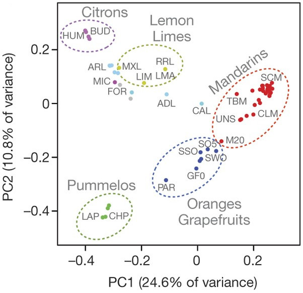
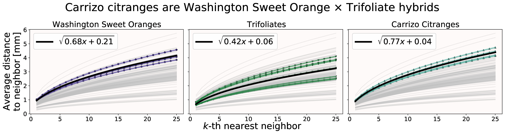
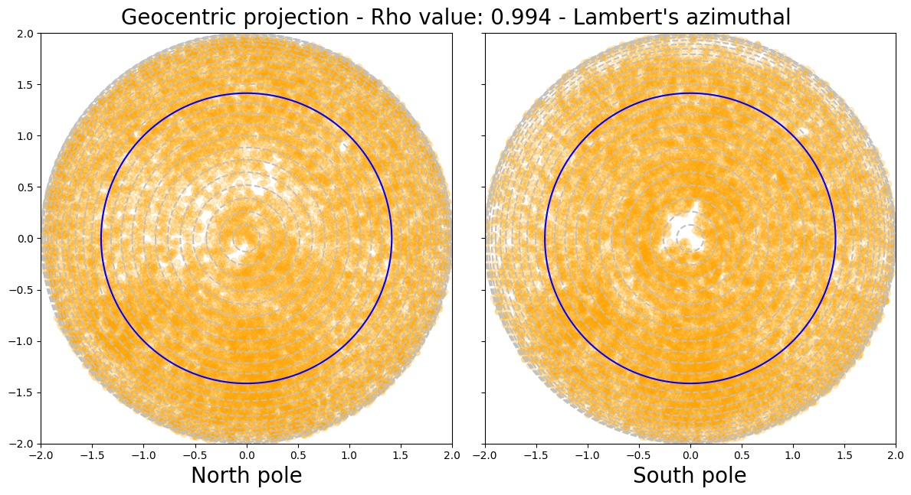
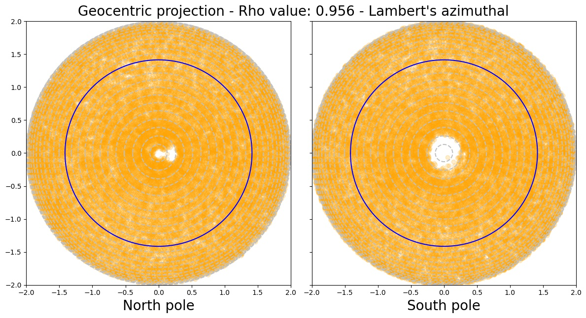
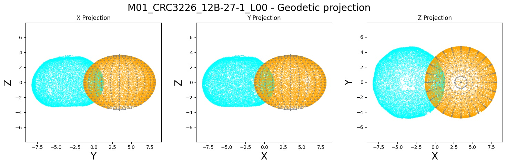
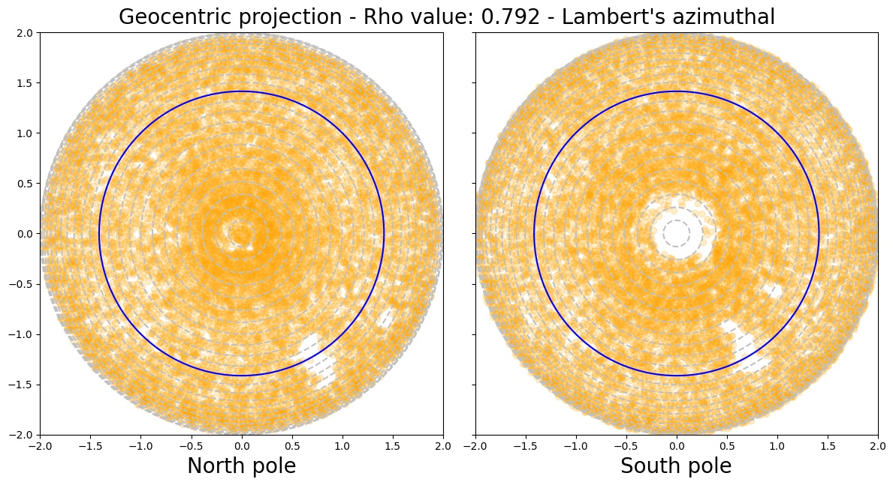
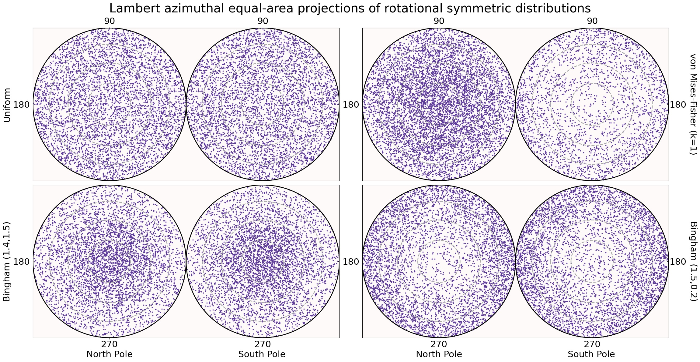
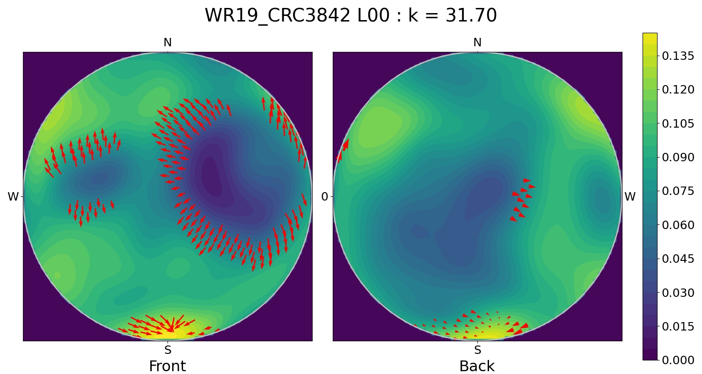
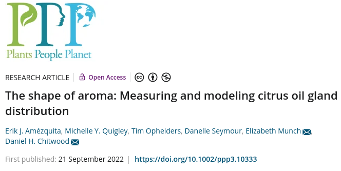

```{r setup, include=FALSE}
library(knitr)

# <!-- Copies an HTML dependency to a subdirectory of the given directory. The subdirectory name willbename-version(for example, "outputDir/jquery-1.11.0"). You may setoptions(htmltools.dir.version= FALSE)to suppress the version number in the subdirectory name. -->
options(htmltools.dir.version = FALSE)
knitr::opts_chunk$set(echo = FALSE)
knitr::opts_chunk$set(fig.align = 'center')
```
class: inverse, center

# When life gives you lemons...

<div class="row">
  <div class="column" style="max-width:50%">
    <iframe width="375" height="210" src="https://www.youtube-nocookie.com/embed/khRS5AuleIM?controls=0" frameborder="0" allow="accelerometer; autoplay; encrypted-media; gyroscope; picture-in-picture" allowfullscreen></iframe>
    <iframe width="375" height="210" src="https://www.youtube-nocookie.com/embed/HAIaektvV3Q?controls=0" frameborder="0" allow="accelerometer; autoplay; encrypted-media; gyroscope; picture-in-picture" allowfullscreen></iframe>
  </div>
  <div class="column" style="max-width:50%">
    <iframe width="375" height="210" src="https://www.youtube-nocookie.com/embed/Xo2HULkkm3s?controls=0" frameborder="0" allow="accelerometer; autoplay; encrypted-media; gyroscope; picture-in-picture" allowfullscreen></iframe>
    <iframe width="375" height="210" src="https://www.youtube-nocookie.com/embed/EwTwSNrBuIo?controls=0" frameborder="0" allow="accelerometer; autoplay; encrypted-media; gyroscope; picture-in-picture" allowfullscreen></iframe>
  </div>
</div>

---

# Citrus origins are... complicated

- 10* _fundamental_ citrus gave rise to all citrus diversity we see today

- Originated in South and South East Asia, and Australia.

- Still some debate as to what exactly is a citrus

.pull-left[

<p style="font-size: 8px; text-align: right; color: Grey;"> Credits: <a href="https://doi.org/10.1038/nature25447">Wu <em>et al.</em> (2018)</a></p>
]

.pull-right[

<p style="font-size: 8px; text-align: right; color: Grey;"> Credits: <a href="https://doi.org/10.1038/nature25447">Wu <em>et al.</em> (2018)</a></p>
]

---

## Think of citrus as lego blocks


<p style="font-size: 8px; text-align: right; color: Grey;"> Credits: <a href="https://doi.org/10.1038/nature25447">Wu <em>et al.</em> (2018)</a></p>

---

## Oil glands are closely linked to fruit development

.pull-left[

<p style="font-size: 8px; text-align: right; color: Grey;"> Credits: <a href="https://www.boredpanda.com/life-cycles-pics/">BoredPanda</a></p>

Developing cycle of a lemon
]

.pull-right[
<iframe width="560" height="300" src="https://static-movie-usa.glencoesoftware.com/webm/10.1073/956/d916befc88029defb1ecef6c4a2fd83db89428d9/pnas.1720809115.sm02.webm" frameborder="0" allowfullscreen></iframe>
<p style="font-size: 8px; text-align: right; color: Grey;"> Credits: <a href="https://doi.org/10.1073/pnas.1720809115">Smith <em>et al.</em> (2018)</a></p>

- Cross-sectional view of a navel orange peel bending to the point of jetting. 

- Huge perfume and food industry behind essential oils

]

---

## Previous work on nucleome-based phylogeny

- 360K + SNPs in non-genic, non-pericentromeric regions

- **SNP**: Single Nucleotide Polymorphism

- Do a PCA of pairwise nuclear genome distance

.pull-left[

]

.pull-right[

<p style="font-size: 8px; text-align: right; color: Grey;"> Credits: <a href="https://doi.org/10.1038/nature25447">Wu <em>et al.</em> (2018)</a></p>
]

---

### Relationships can be stronger amongst certain groups

```{r, out.width=450}
knitr::include_graphics('https://media.springernature.com/full/springer-static/image/art%3A10.1038%2Fnature25447/MediaObjects/41586_2018_Article_BFnature25447_Fig3_HTML.jpg?as=webp')
```
<p style="font-size: 8px; text-align: right; color: Grey;"> Credits: <a href="https://doi.org/10.1038/nature25447">Wu <em>et al.</em> (2018)</a></p>

---

class: inverse, center, middle

# Scan it all!

---

## Raw Data: X-rays &rarr; Image Processing

<div class="row">
  <div class="column" style="max-width:38%; color: Navy; font-size: 15px;">
    
    <p style="text-align: center;"> UCR Collaboration </p>
  </div>
  <div class="column" style="max-width:38%; color: Navy; font-size: 15px;">
    
    <p style="text-align: center;"> 3D X-Ray CT scan </p>
  </div>
  <div class="column" style="max-width:23%; color: Navy; font-size: 15px;">
    
    <p style="text-align: center;"> Raw </p>
  </div>
</div>

<div class="row" style="margin: 0 auto;">
  <div class="column" style="max-width:20%; color: Navy; font-size: 15px;">
    
    <p style="text-align: center;"> Spine </p>
  </div>
  <div class="column" style="max-width:20%; color: Navy; font-size: 15px;">
    
    <p style="text-align: center;"> Endocarp </p>
  </div>
  <div class="column" style="max-width:20%; color: Navy; font-size: 15px;">
    
    <p style="text-align: center;"> Rind </p>
  </div>
  <div class="column" style="max-width:20%; color: Navy; font-size: 15px;">
    
    <p style="text-align: center;"> Exocarp </p>
  </div>
  <div class="column" style="max-width:20%; color: Navy; font-size: 15px;">
    
    <p style="text-align: center;"> Oil glands</p>
  </div>
</div>

---

background-image: url("../figs/citrus_diagnostic.gif")
background-size: 650px
background-position: 50% 70%

## Rich tissue collection


---

background-image: url("https://insideucr.ucr.edu/sites/default/files/2020-02/givaudan%20taste%20trek_0.jpg")
background-size: 850px
background-position: 50% 50%

### Citrus provided by the Givaudan Citrus Variety Collection @ UC Riverside

---

class: inverse, center, middle

# Looking to strike some oil

## Phenotyping all the citrus

---

# Allometry

+ Linear relationship between size-related measurements.

<div class="row" style="margin: 0 auto;">
  <div class="column" style="max-width:49%; color: Navy; font-size: 15px;">
    
    
  </div>
  <div class="column" style="max-width:49%; color: Navy; font-size: 15px;">
    
    
  </div>
</div>

+ Total number of glands seems to be decoupled

---

## Isolating the oil glands of a sweet orange

.pull-left[

]

.pull-right[

]

- Explore gland sizes, distribution, locations, patterns, etc.

- 500,000 voxels per orange

---

## The centers will be just fine

.pull-left[

- About 6K&rarr;20K individual oil glands detected

- Number in the right ballpark

- **We have a typical point cloud in $\mathbb{R}^3$.**
]

.pull-right[

<p style="font-size: 8px; text-align: right; color: Grey;"> Credits: <a href="https://doi.org/10.1006/anbo.2001.1546">Knight <em>et al.</em> (2001)</a></p>
]

---

## Size and average distance between closest oil glands


- Smaller fruits report higher density of oil glands
- Similar results when looking at the average distance between each oil gland and its 2nd, 3rd, ..., 25th nearest neighbors

---

## Average distance from each gland to its $k$-th nearest neighbor


+ $\text{Avg.dist}(k) = \sqrt{Mk + B}$
+ Oil glands might be distributing themselves following **normal diffusion** mechanics
+ The **outliers** for citrus groups usually correspond to hybrids.

---

## Hybrids show interesting behavior



- Carrizo citranges are a hybrid of Trifoliates and Washington sweet orange.

- Oil glands seem to diffuse faster in the citranges than in the parents

---

class: inverse, center, middle

# Citrus are quite spherical

## Ellipsoidal to be more precise

---

background-image: url("../ellipsoids/Li_and_Griffiths_2004.png")
background-size: 250px
background-position: 95% 3%

## Best ellipsoid fitting &mdash; least squares

- A general quadratic surface is defined by the equation

$$\eqalignno{ & ax^{2}+by^{2}+cz^{2}+2fxy+2gyz+2hzy\ \ \ \ \ \ \ \ \ &\hbox{(1)}\cr &+2px+2qy+2rz+d=0.}$$

With our observations $\{(x_i,y_i,z_i)\}_i$, 

$$
\begin{pmatrix}
x_1^2 & y_1^2 & z_1^2 & 2x_1y_1 & 2y_1z_1 & 2x_1z_1 & x_1 & y_1 & z_1 & 1\\
x_2^2 & y_2^2 & z_2^2 & 2x_2y_2 & 2y_2z_2 & 2x_2z_2 & x_2 & y_2 & z_2 & 1\\
\vdots& \vdots& \vdots& \vdots & \vdots & \vdots & \vdots & \vdots & \vdots \\
x_n^2 & y_n^2 & z_n^2 & 2x_ny_n & 2y_nz_n & 2x_nz_n & x_n & y_n & z_n & 1
\end{pmatrix}
\begin{pmatrix}
a \\ b \\ \vdots \\ d
\end{pmatrix}
=
\begin{pmatrix}
0 \\ 0 \\ \vdots \\ 0
\end{pmatrix}
$$
or
$$
\mathbf{D}\mathbf{v} = 0
$$

The solution to the system above can be obtained via Lagrange multipliers

$$\min_{\mathbf{v}\in\mathbb{R}^{10}}\left\|\mathbf{D}\mathbf{v}\right\|^2, \quad \mathrm{s.t.}\; \text{ some ellipsoid-specific conditions hold}$$

---

background-image: url("../ellipsoids/DiazToca_etal_2020.png")
background-size: 250px
background-position: 99% 6%

# Projecting points to the ellipsoid

## Geocentric vs Geodetic

```{r, out.width=400}
knitr::include_graphics("https://ars.els-cdn.com/content/image/1-s2.0-S0098300420305410-gr1_lrg.jpg")
```
<p style="font-size: 8px; text-align: right; color: Grey;"> Credits: <a href="https://doi.org/10.1016/j.cageo.2020.104551">Diaz-Toca <em>et al.</em> (2020)</a></p>

- Geocentric projections preserve better the original shape

---

## Model the whole fruit as an ellipsoid

.pull-left[


]

.pull-right[


]

---

## How spherical _is_ a round orange?


.pull-left[
- No unique way to compute sphericity
- Most formulas in terms of the longest, intermediate, and shortest $A,B,C$ semi-axes lengths of the best-fit ellipsoid.
- **Most citrus are highly spherical**
]

.pull-right[
+ $\sqrt[3]{\frac{BC}{A^2}}$ (Krumbein, 1941)
+ $\frac{C}{\sqrt{AB}}$ (Corey, 1949)
+ $\sqrt[3]{\frac{C^2}{AB}}$ (Sneed and Folk, 1958)
+ $\frac{C}{\sqrt{\frac13 (A^2+B^2+C^2)}}$ (Janke, 1966)
]

---

# Statistics on a ellipsoid is hard

## Project geocentrically, coordinate geodetically

- An ellipsoid is just an sphere under an affine transformation.

```{r, out.width=550, fig.align='center'}
knitr::include_graphics("https://upload.wikimedia.org/wikipedia/commons/0/0e/Ellipsoid-affin.svg")
```
<p style="font-size: 8px; text-align: right; color: Grey;"> Credits: <a href="https://en.wikipedia.org/wiki/Ellipsoid">Wikipedia: Ellipsoid</a></p>

- Geodetic coordinates are a deformation of the geocentric (spherical) coordinates.

### Now we can think of the oil glands as if lying on a sphere

---

# Lambert equal-area projection


.pull-left[

<p style="font-size: 8px; text-align: right; color: Grey;"> Credits: <a href="https://en.wikipedia.org/wiki/Lambert_azimuthal_equal-area_projection">Wikipedia</a></p>
]

.pull-right[

<p style="font-size: 8px; text-align: right; color: Grey;"> Credits: <a href="https://en.wikipedia.org/wiki/Lambert_azimuthal_equal-area_projection">Wikipedia</a></p>
]

Helps to visualize better a sphere in 2D

---

# Citrus modeling: Sweet orange



---

# Citrus modeling: Pummelo


---

# Citrus modeling: Pummelo




---

# Citrus modeling: Mandarin




---

# Citrus modeling: Mandarin



---

# Citrus modeling: Kumquat


---

# Citrus modeling: Kumquat


---

# Citrus modeling: Finger lime


---

# Citrus modeling: Finger lime


---

class: inverse, center, middle

# Dancing the macarena with directional statistics

## Perform statistics directly on a sphere surface

### Most of the citrus are nearly spherical, anyway

---

# Statistics, but on the sphere surface

- It is possible to compute
    - Mean direction and variance
    - Kernel density estimation (KDE)
    - Parameter estimation for especific spherical distributions
    - Hypothesis testing
    - Test for uniformity
    - Test for symmetry
    - Test if two samples come from the same distribution

- Directional statistics was established circa 1975

- Spherical study cases didn't really take off until very recently

- Very recent support to do testing in R

- Nothing advanced available in python

---

background-image: url("../ellipsoids/GarciaPortugues_etal_2020a.png")
background-size: 200px
background-position: 95% 3%

# Uniformity tests

- A battery of tests all **reject strongly** the hypothesis that oil glands are uniformly distributed

.pull-left[

]
.pull-right[

]

- Another battery of tests **rejected strongly** the hypothesis that oil gland distribution is rotationally symmetric

---

# Citrus projections


---

# Uniform and rotationally symmetric spherical distributions



---

# Kernel Density Estimators


<p style="font-size: 8px; text-align: right; color: Grey;"> Credits: <a href="https://www.statsmodels.org/dev/examples/notebooks/generated/kernel_density.html">Statsmodels</a></p>

- The choice of bandwidth is crucial
- Large bandwidths tend to oversmooth
- Small bandwidths tend to overfit
- Plenty of literature on $\mathbb{R}$ on how to choose an adequate value

---

background-image: url("../ellipsoids/GarciaPortugues_2013.png")
background-size: 300px
background-position: 95% 3%

# Spherical KDE


- Oil glands of a papeda
- Red arrows indicate the most significant gradient values for the density function
- Concentration parameter $k$ is chosen to be optimal

---

# Lateral view of a papeda



- The original has holes throughout its skin

- We have densities to compare citrus!

---

background-image: url("../ellipsoids/Vuollo_and_Holmstrom_2018.png")
background-size: 300px
background-position: 95% 3%

# More exploratory analysis

## SphereSiZer


---

# Side view of a pummelo


---

# Polar view of a sweet orange


---

# Side view of a sweet orange


---

# Polar view of a mandarin


---

# Side view of a mandarin


---

# Polar view of a kumquat


---

# Side view of a kumquat


---

# Polar view of a finger lime


---

# Side view of a finger lime


---

# Future directions

.pull-left[

<p style="font-size: 12px; text-align: right; color: Grey;"> Credits: <a href="https://citrusaustralia.com.au/wp-content/uploads/Citrus-picking-guide.pdf">Citrus Australia</a></p>
]

.pull-right[
- Compare differences in oil gland density distribution
    - Between "species"
    - Between wild types and domesticated fruits
    
- Propose a distribution model

- Insights into fruit development

- Think of smarter ways to go from an ellipsoid to a sphere
    - And thus exploit more tools from directional statistics
]

---

background-image: url("../../cmse/figs/institutional_logos.jpg")
background-size: 500px
background-position: 95% 5%

class: inverse

# Thank you!

<div class="row">
  <div class="column" style="max-width:23%; font-size: 15px;">
    
    <p style="text-align: center; color: White">Elizabeth Munch (MSU)</p>
    
    <p style="text-align: center; color: White">Tim Ophelders (Utrecht)</p>
  </div>
  <div class="column" style="max-width:23%; font-size: 15px;">
    
    <p style="text-align: center; color: White">Dan Chitwood<br>(MSU)</p>
    
    <p style="text-align: center; color: White">Michelle Quigley<br>(MSU)</p>
  </div>
  <div class="column" style="max-width:16%; font-size: 15px;">
  
  <p style="text-align: center; color: White">Danelle Seymour<br>(UC Riverside)</p>
  
  </div>
  <div class="column" style="width:10%; font-size: 24px;">
  </div>
  <div class="column" style="max-width:30%; font-size: 24px; line-height:1.25">
  <p style="text-align: center; color: White"><strong>Email</strong></p>
  <p style="text-align: center; color: Yellow">amezqui3@msu.edu</p>
  <p style="text-align: center; color: White"><strong>Website and slides</strong></p>
  <p style="text-align: center; color: Yellow">egr.msu.edu/~amezqui3</p>
  
  </div>
</div>
