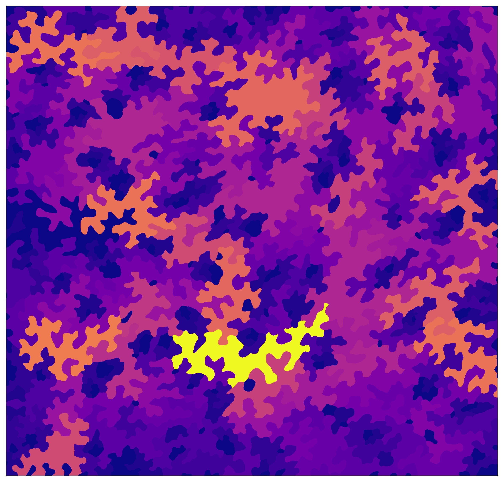

```{r setup, include=FALSE}
library(knitr)

# <!-- Copies an HTML dependency to a subdirectory of the given directory. The subdirectory name willbename-version(for example, "outputDir/jquery-1.11.0"). You may setoptions(htmltools.dir.version= FALSE)to suppress the version number in the subdirectory name. -->
options(htmltools.dir.version = FALSE)
knitr::opts_chunk$set(echo = FALSE)
knitr::opts_chunk$set(fig.align = 'center')
```
class: inverse, center

# The shape of things to come

<div class="row">
  <div class="column" style="max-width:50%">
    <iframe width="375" height="210" src="https://www.youtube-nocookie.com/embed/oM9kAq0PBvw?controls=0" frameborder="0" allow="accelerometer; autoplay; encrypted-media; gyroscope; picture-in-picture" allowfullscreen></iframe>
    <iframe width="375" height="210" src="https://www.youtube-nocookie.com/embed/V39K58evWlU?controls=0" frameborder="0" allow="accelerometer; autoplay; encrypted-media; gyroscope; picture-in-picture" allowfullscreen></iframe>
  </div>
  <div class="column" style="max-width:50%">
    <iframe width="375" height="210" src="https://www.youtube-nocookie.com/embed/4GBgPIEDoa0?controls=0" frameborder="0" allow="accelerometer; autoplay; encrypted-media; gyroscope; picture-in-picture" allowfullscreen></iframe>
    <iframe width="375" height="210" src="https://www.youtube-nocookie.com/embed/qkOjHHuoUhA?controls=0" frameborder="0" allow="accelerometer; autoplay; encrypted-media; gyroscope; picture-in-picture" allowfullscreen></iframe>
  </div>
</div>

---

# Mathematics to quantify shape

<div class="row">
  <div class="column" style="max-width:25%; font-size: 15px;">
    
    <p style="font-size: 25px; text-align: center; color: DarkRed;"> Raw Data </p>
    <ul>
      <li> X-ray CT </li>
      <li> Point clouds </li>
      <li> Time series </li>
    <ul>
  </div>
  <div class="column" style="max-width:40%; padding: 0 25px 0 25px; font-size: 15px;">
    
    <p style="font-size: 23px; text-align: center; color: DarkRed;"> Topological Summary </p>
    <ul>
      <li> Euler Characteristic </li>
      <li> Persistence diagrams </li>
      <li> Mapper/Reeb graphs </li>
    <ul>
  </div>
  <div class="column" style="max-width:35%; font-size: 15px;">
    
    <p style="font-size: 25px; text-align: center; color: DarkRed;"> Analysis </p>
    <ul>
      <li> Statistics </li>
      <li> Machine learning </li>
      <li> Classification/prediction </li>
    <ul>
  </div>
</div>

---

class: inverse

<div class="row">
  <div class="column" style="max-width:44%">
    <a href="https://cereal.interreg-npa.eu/subsites/CEREAL/Barley_cultivation-Norway_Presentation_2018.pdf" target="_blank"></a>
    <a href="https://www.resilience.org/stories/2020-03-09/the-last-crop-before-the-desert/" target="_blank"></a>
    <a href="https://www.doi.org/10.1007/978-1-4419-0465-2_2168" target="_blank"></a>
  </div>
  <div class="column" style="max-width:44%">
    <a href="https://www.bloomberg.com/news/articles/2020-09-13/iraq-to-offer-first-ever-barley-exports-as-rains-yield-surplus" target="_blank"></a>
    <a href="https://www.tibettravel.org/tibetan-culture/highland-barley.html" target="_blank"></a>
    <div class="row">
      <div class="column" style="max-width:46%">
        
      </div>
      <div class="column" style="max-width:55%">
        
      </div>
    </div>
  </div>
  <div class="column" style="max-width:8%; font-size: 15px;">
    <p style="text-align: center; font-size: 30px; line-height: 1em;"> <strong> More than just beer </strong></p>
    <p>28 collected barley varieties</p>
    <p>Brought to California in 1929</p>
    <p>Artificial evolution experiment for 58 generations</p>
    <p>975 panicles scanned</p>
    <p>38,000 seeds isolated</p>
  </div>
</div>

---

## If life gives you lemons...

<div class="row">
  <div class="column" style="max-width:38%; color: Navy; font-size: 15px;">
    
    <p style="text-align: center;"> UCR Collaboration </p>
  </div>
  <div class="column" style="max-width:38%; color: Navy; font-size: 15px;">
    
    <p style="text-align: center;"> 3D X-Ray CT scan </p>
  </div>
  <div class="column" style="max-width:23%; color: Navy; font-size: 15px;">
    
    <p style="text-align: center;"> Raw </p>
  </div>
</div>

<div class="row" style="margin: 0 auto;">
  <div class="column" style="max-width:20%; color: Navy; font-size: 15px;">
    
    <p style="text-align: center;"> Spine </p>
  </div>
  <div class="column" style="max-width:20%; color: Navy; font-size: 15px;">
    
    <p style="text-align: center;"> Endocarp </p>
  </div>
  <div class="column" style="max-width:20%; color: Navy; font-size: 15px;">
    
    <p style="text-align: center;"> Rind </p>
  </div>
  <div class="column" style="max-width:20%; color: Navy; font-size: 15px;">
    
    <p style="text-align: center;"> Exocarp </p>
  </div>
  <div class="column" style="max-width:20%; color: Navy; font-size: 15px;">
    
    <p style="text-align: center;"> Oil glands</p>
  </div>
</div>

---

background-image: url("../figs/citrus_diagnostic.gif")
background-size: 650px
background-position: 50% 70%

## Rich tissue collection


---

## Think of citrus as lego blocks


<p style="font-size: 8px; text-align: right; color: Grey;"> Credits: <a href="https://doi.org/10.1038/nature25447">Wu <em>et al.</em> (2018)</a></p>

---

# The wal(nu)tzing nutcracker!

<div class="row" style="margin: 0 auto;">
  <div class="column" style="max-width:25%; color: Navy; font-size: 15px;">
    
    <p style="text-align: center;"> Shell </p>
  </div>
  <div class="column" style="max-width:25%; color: Navy; font-size: 15px;">
    
    <p style="text-align: center;"> Air </p>
  </div>
  <div class="column" style="max-width:25%; color: Navy; font-size: 15px;">
    
    <p style="text-align: center;"> Packing </p>
  </div>
  <div class="column" style="max-width:25%; color: Navy; font-size: 15px;">
    
    <p style="text-align: center;"> Kernel </p>
  </div>
</div>

.pull-left[

- The walnuts were later cracked open and the force required was recorded

- Breeding walnuts that are easy to crack open

]

.pull-right[

]

---

# The shape of things to come

<div class="row" style="margin: 0 auto;">
  <div class="column" style="max-width:38%; color: Navy; font-size: 15px;">
    
    <p style="text-align: center;"> Arabidopsis leaves</p>
  </div>
  <div class="column" style="max-width:53%; color: Navy; font-size: 15px;">
    
    <p style="text-align: center;"> Passiflora leaves</p>
  </div>
</div>
<div class="row" style="margin: 0 auto;">
  <div class="column" style="max-width:45%; color: Navy; font-size: 15px;">
    
    <p style="text-align: center;"> Cannabis leaves</p>
  </div>
  <div class="column" style="max-width:25%; color: Navy; font-size: 15px;">
    
    <p style="text-align: center;"> Leaf cells </p>
  </div>
  <div class="column" style="max-width:24%; color: Navy; font-size: 15px;">
    
    <p style="text-align: center;"> Proteins </p>
  </div>
</div>
