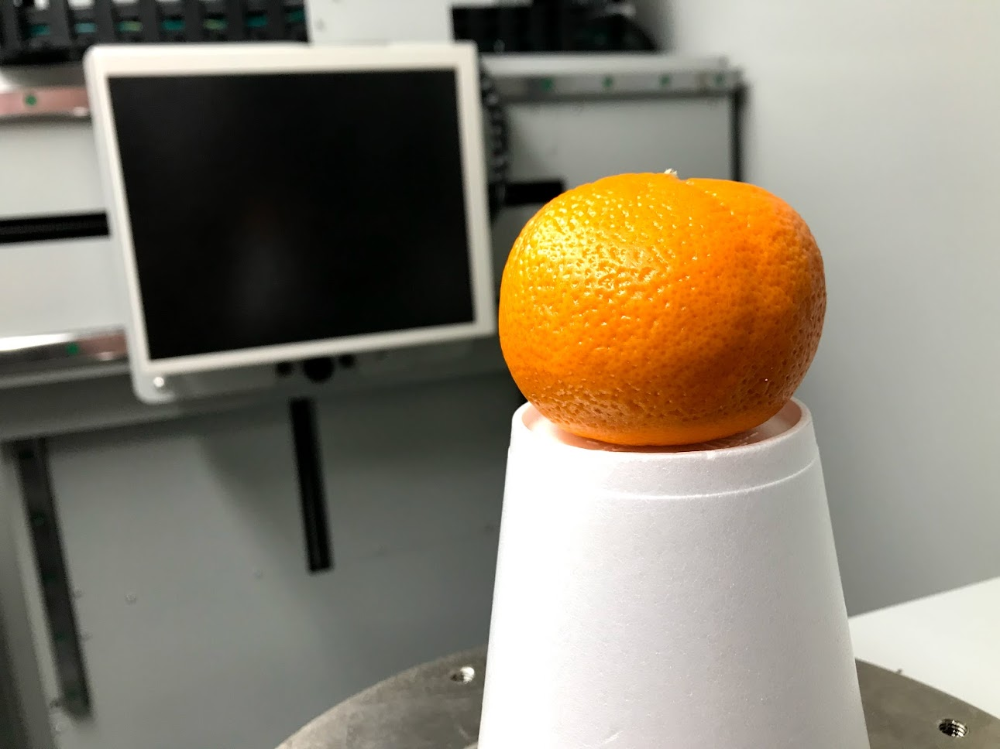
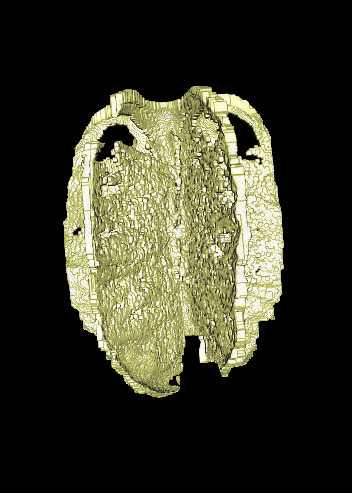

```{r setup, include=FALSE}
library(knitr)

# <!-- Copies an HTML dependency to a subdirectory of the given directory. The subdirectory name willbename-version(for example, "outputDir/jquery-1.11.0"). You may setoptions(htmltools.dir.version= FALSE)to suppress the version number in the subdirectory name. -->
options(htmltools.dir.version = FALSE)
knitr::opts_chunk$set(echo = FALSE)
knitr::opts_chunk$set(fig.align = 'center')
```
class: inverse, center

# Scan all (the citrus)

<div class="row">
  <div class="column" style="max-width:50%">
    <iframe width="375" height="210" src="https://www.youtube-nocookie.com/embed/khRS5AuleIM?controls=0" frameborder="0" allow="accelerometer; autoplay; encrypted-media; gyroscope; picture-in-picture" allowfullscreen></iframe>
    <iframe width="375" height="210" src="https://www.youtube-nocookie.com/embed/HAIaektvV3Q?controls=0" frameborder="0" allow="accelerometer; autoplay; encrypted-media; gyroscope; picture-in-picture" allowfullscreen></iframe>
  </div>
  <div class="column" style="max-width:50%">
    <iframe width="375" height="210" src="https://www.youtube-nocookie.com/embed/Xo2HULkkm3s?controls=0" frameborder="0" allow="accelerometer; autoplay; encrypted-media; gyroscope; picture-in-picture" allowfullscreen></iframe>
    <iframe width="375" height="210" src="https://www.youtube-nocookie.com/embed/EwTwSNrBuIo?controls=0" frameborder="0" allow="accelerometer; autoplay; encrypted-media; gyroscope; picture-in-picture" allowfullscreen></iframe>
  </div>
</div>

---

# Citrus taxonomy is... complicated

- 10* _fundamental_ citrus gave rise to all citrus diversity we see today

- Originated in South and South East Asia, and Australia.

- Still some debate as to what exactly is a citrus

.pull-left[

<p style="font-size: 8px; text-align: right; color: Grey;"> Credits: <a href="https://doi.org/10.1038/nature25447">Wu <em>et al.</em> (2018)</a></p>
]

.pull-right[

<p style="font-size: 8px; text-align: right; color: Grey;"> Credits: <a href="https://doi.org/10.1038/nature25447">Wu <em>et al.</em> (2018)</a></p>
]

---

## Think of citrus as lego blocks


<p style="font-size: 8px; text-align: right; color: Grey;"> Credits: <a href="https://doi.org/10.1038/nature25447">Wu <em>et al.</em> (2018)</a></p>

---

class: inverse, center, middle

# Scan it all!
]

---

## Raw Data: X-rays &rarr; Image Processing

<div class="row">
  <div class="column" style="max-width:38%; color: Navy; font-size: 15px;">
    
    <p style="text-align: center;"> UCR Collaboration </p>
  </div>
  <div class="column" style="max-width:38%; color: Navy; font-size: 15px;">
    
    <p style="text-align: center;"> 3D X-Ray CT scan </p>
  </div>
  <div class="column" style="max-width:23%; color: Navy; font-size: 15px;">
    
    <p style="text-align: center;"> Raw </p>
  </div>
</div>

--

<div class="row" style="margin: 0 auto;">
  <div class="column" style="max-width:20%; color: Navy; font-size: 15px;">
    
    <p style="text-align: center;"> Spine </p>
  </div>
  <div class="column" style="max-width:20%; color: Navy; font-size: 15px;">
    
    <p style="text-align: center;"> Endocarp </p>
  </div>
  <div class="column" style="max-width:20%; color: Navy; font-size: 15px;">
    
    <p style="text-align: center;"> Rind </p>
  </div>
  <div class="column" style="max-width:20%; color: Navy; font-size: 15px;">
    
    <p style="text-align: center;"> Exocarp </p>
  </div>
  <div class="column" style="max-width:20%; color: Navy; font-size: 15px;">
    
    <p style="text-align: center;"> Oil glands</p>
  </div>
</div>

---

background-image: url("../figs/citrus_diagnostic.gif")
background-size: 650px
background-position: 50% 70%

## Rich tissue collection

---

class: inverse, center, middle

# Looking to strike some oil

---

# Allometry


---

# Allometry


---

# Allometry


---

background-image: url("../ellipsoids/Li_and_Griffiths_2004.png")
background-size: 200px
background-position: 95% 3%

## Model the whole fruit as an ellipsoid

.pull-left[


]

.pull-right[


]

---

# How round _is_ a round orange?


---

## Oil gland modeling with directional statistics

### Lambert Azimuthal Projection

.pull-left[

<p style="font-size: 8px; text-align: right; color: Grey;"> Credits: <a href="https://en.wikipedia.org/wiki/Lambert_azimuthal_equal-area_projection">Wikipedia</a></p>
]

.pull-right[

<p style="font-size: 8px; text-align: right; color: Grey;"> Credits: <a href="https://en.wikipedia.org/wiki/Lambert_azimuthal_equal-area_projection">Wikipedia</a></p>
]

Helps to visualize better a sphere in 2D

---

background-image: url("../ellipsoids/GarciaPortugues_2013.png")
background-size: 250px
background-position: 95% 3%

## Spherical Kernel Density Estimation


- Oil glands of a mandarin

- Red arrows indicate the most significant gradient values for the density function

--

- Statistical tool to model oil gland distribution!

---

background-image: url("../figs/SW03_CRC1241-B_12B-4-3_L00_uniform_comparison.jpg")
background-size: 600px
background-position: 50% 90%

## Distribution of oil glands is NOT uniform

---

# Future directions

.pull-left[

<p style="font-size: 8px; text-align: right; color: Grey;"> Credits: <a href="https://www.boredpanda.com/life-cycles-pics/">BoredPanda</a></p>

Developing cycle of a lemon
]

.pull-right[
- Compare differences in oil gland density distribution
    - Between "species"
    - Between wild types and domesticated fruits
    
- Propose a distribution model

- Insights into fruit development
]

---

class: inverse, middle

# Thank you!

.pull-left[

<p style="font-size: 12px; text-align: right; color: Grey;"> Credits: <a href="https://citrusaustralia.com.au/wp-content/uploads/Citrus-picking-guide.pdf">Citrus Australia</a></p>
]

.pull-right[
Joint work with:

- Michelle Quigley (MSU Hort)

- Tim Ophelders (TU Eidhoven)

- Danelle Seymour (UC Riverside)

- Liz Munch (MSU CMSE/Math)

- Dan Chitwood (MSU Hort/CMSE)

```{r, out.width=200}
knitr::include_graphics(c('../../cmse/figs/cmse_image002.jpg'))
```
]
--

### Slides made with [RMarkdown + xaringan](https://bookdown.org/yihui/rmarkdown/xaringan-preview.html)