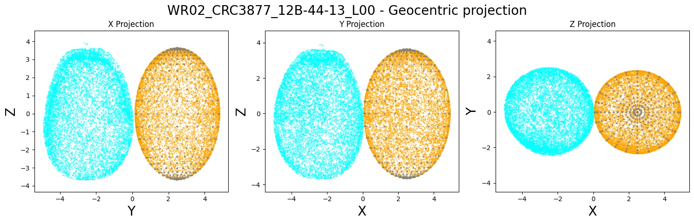
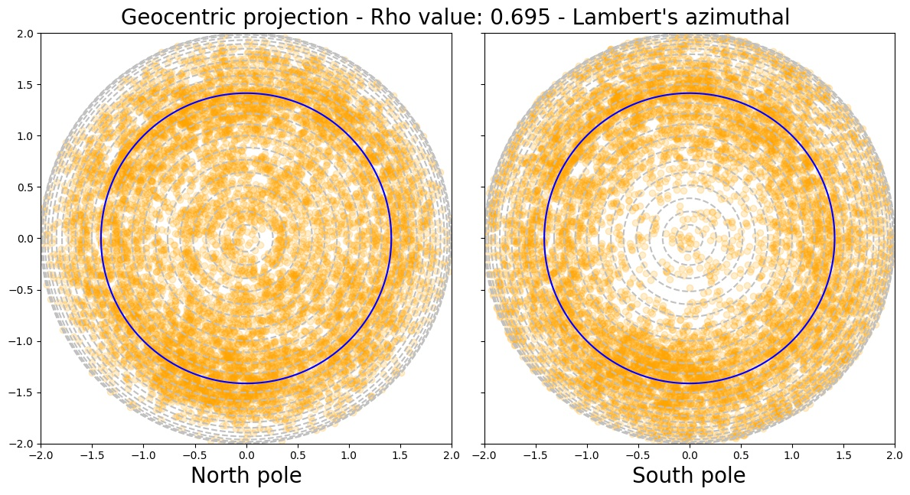
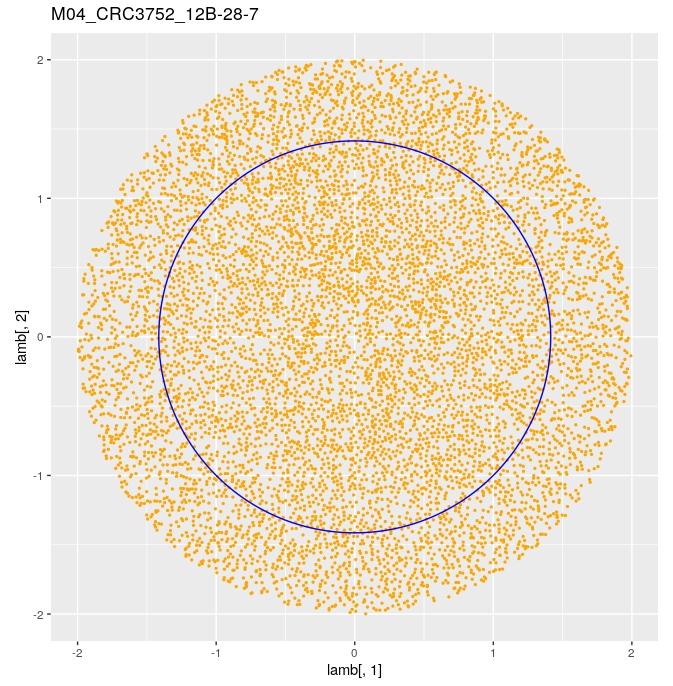
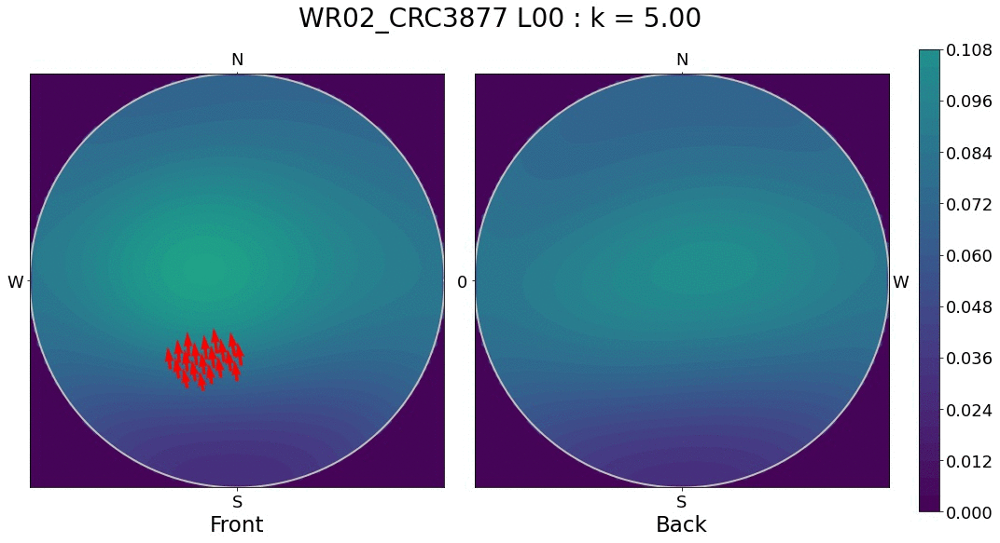
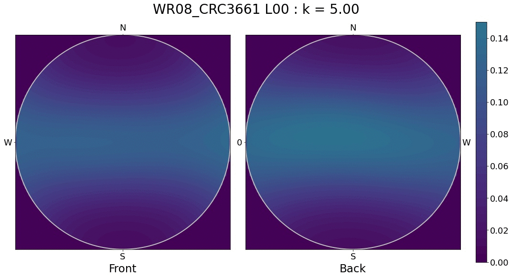

```{r setup, include=FALSE}
library(knitr)

# <!-- Copies an HTML dependency to a subdirectory of the given directory. The subdirectory name willbename-version(for example, "outputDir/jquery-1.11.0"). You may setoptions(htmltools.dir.version= FALSE)to suppress the version number in the subdirectory name. -->
options(htmltools.dir.version = FALSE)
knitr::opts_chunk$set(echo = FALSE)
knitr::opts_chunk$set(fig.align = 'center')
```
class: inverse, center

# Scan all the citrus

<div class="row">
  <div class="column" style="max-width:50%">
    <blockquote class="twitter-tweet" data-conversation="none" data-lang="es" data-dnt="true">
      <p lang="in" dir="ltr">Citrus nippokoreana specimens <a href="https://t.co/HjrMlBcXQK">pic.twitter.com/HjrMlBcXQK</a></p>&mdash; de la parra (@hojasyhelechos) <a href="https://twitter.com/hojasyhelechos/status/1079144843773952000?ref_src=twsrc%5Etfw">December 29, 2018</a>
      </blockquote> 
      <script async src="https://platform.twitter.com/widgets.js" charset="utf-8"></script> 
  </div>
  <div class="column" style="max-width:50%">
    <blockquote class="twitter-tweet" data-conversation="none" data-lang="es" data-dnt="true">
      <p lang="in" dir="ltr">Citrus nippokoreana <a href="https://t.co/B2FKOqQhK1">pic.twitter.com/B2FKOqQhK1</a></p>&mdash; de la parra (@hojasyhelechos) <a href="https://twitter.com/hojasyhelechos/status/1079144306630422529?ref_src=twsrc%5Etfw">December 29, 2018</a>
      </blockquote>
      <script async src="https://platform.twitter.com/widgets.js" charset="utf-8"></script> 
  </div>
</div>

---

## Raw Data: X-rays &rarr; Image Processing

<div class="row">
  <div class="column" style="max-width:51%; color: Navy; font-size: 15px;">
    
    <p style="text-align: center;"> Proprietary X-Ray CT scan 3D reconstruction </p>
  </div>
  <div class="column" style="max-width:23%; color: Navy; font-size: 15px;">
    
    <p style="text-align: center;"> Raw </p>
  </div>
  <div class="column" style="max-width:23%; color: Black; font-size: 15px;">
    <ul>
      <li> 63 raw scans </li>
      <li> 51 different citrus species </li>
      <li> 166 different individuals </li>
      <li> Usually three samples per species </li>
      <li> All ancestors and crosses of interest included </li>
    <ul>
  </div>
</div>

--

<div class="row" style="margin: 0 auto;">
  <div class="column" style="max-width:22%; color: Navy; font-size: 15px;">
    
    <p style="text-align: center;"> Exocarp </p>
  </div>
  <div class="column" style="max-width:22%; color: Navy; font-size: 15px;">
    
    <p style="text-align: center;"> Mesocarp </p>
  </div>
  <div class="column" style="max-width:22%; color: Navy; font-size: 15px;">
    
    <p style="text-align: center;"> Endocarp </p>
  </div>
  <div class="column" style="max-width:22%; color: Navy; font-size: 15px;">
    
    <p style="text-align: center;"> Spine </p>
  </div>
</div>

---

background-image: url("../figs/citrus_diagnostic.gif")
background-size: 650px
background-position: 50% 70%

## Rich tissue collection

---

class: inverse, center, middle

# Looking to strike some oil

---

## Oil glands in citrus

- Huge perfume and food industry behind essential oils

.pull-left[

<p style="font-size: 8px; text-align: right; color: Grey;"> Credits: <a href="https://www.boredpanda.com/life-cycles-pics/">BoredPanda</a></p>

Developing cycle of a lemon
]

.pull-right[
<iframe width="560" height="300" src="https://static-movie-usa.glencoesoftware.com/webm/10.1073/956/d916befc88029defb1ecef6c4a2fd83db89428d9/pnas.1720809115.sm02.webm" frameborder="0" allowfullscreen></iframe>
<p style="font-size: 8px; text-align: right; color: Grey;"> Credits: <a href="https://doi.org/10.1073/pnas.1720809115">Smith <em>et al.</em> (2018)</a></p>

- Cross-sectional view of a navel orange peel bending to the point of jetting. 

Slowed 133x
]

---

## Serious money from the perfume industry

<p align="center">
<iframe width="700" height="400" src="https://insideucr.ucr.edu/stories/2020/02/11/givaudan-brings-its-virtual-taste-trek-riverside" title="W3Schools Free Online Web Tutorials">
</iframe>
</p>
<p style="font-size: 8px; text-align: right; color: Grey;"><a href="https://insideucr.ucr.edu/stories/2020/02/11/givaudan-brings-its-virtual-taste-trek-riverside">Original link</a></p>

---

## Isolating the oil glands of a sweet orange

.pull-left[

]

.pull-right[

]

- Explore gland sizes, distribution, locations, patterns, etc.

--

- 500,000 voxels per orange

---

## The centers will be just fine

.pull-left[

- About 18,000 gland centers detected

- Number in the right ballpark

- **We have a typical point cloud in $\mathbb{R}^3$.**
]

.pull-right[

<p style="font-size: 8px; text-align: right; color: Grey;"> Credits: <a href="https://doi.org/10.1006/anbo.2001.1546">Knight <em>et al.</em> (2001)</a></p>
]

---

class: inverse, center, middle

# Spheres and ellipsoids to model

---

background-image: url("../ellipsoids/Li_and_Griffiths_2004.png")
background-size: 400px
background-position: 95% 3%

# Best ellipsoid fitting

- A general quadratic surface is defined by the equation

$$\eqalignno{ & ax^{2}+by^{2}+cz^{2}+2fxy+2gyz+2hzy\ \ \ \ \ \ \ \ \ &\hbox{(1)}\cr &+2px+2qy+2rz+d=0.}$$

--

- Let $$\rho = \frac{4J-I}{a^2 + b^2 + c^2},$$

$$\eqalignno{ &I = a+b+c &\hbox{(2)}\cr &J =ab+bc+ac-f^{2}-g^{2}-h^{2}&\hbox {(3)}\cr & K=\left[\matrix{ a & h & g \cr h & b & f \cr g & f & c }\right] &\hbox{(4)}}.$$

- These values are invariant under rotation and translation and equation (1) represents an ellipsoid if $J > 0$ and $IK>0$.

---

background-image: url("../ellipsoids/Li_and_Griffiths_2004.png")
background-size: 400px
background-position: 95% 3%

# Best ellipsoid fitting

With our observations $\{(x_i,y_i,z_i)\}_i$, we would ideally want a vector of parameters $(a,b,c,f,g,h,p,q,r,d)$ such that

$$
\begin{pmatrix}
x_1^2 & y_1^2 & z_1^2 & 2x_1y_1 & 2y_1z_1 & 2x_1z_1 & x_1 & y_1 & z_1 & 1\\
x_2^2 & y_2^2 & z_2^2 & 2x_2y_2 & 2y_2z_2 & 2x_2z_2 & x_2 & y_2 & z_2 & 1\\
\vdots& \vdots& \vdots& \vdots & \vdots & \vdots & \vdots & \vdots & \vdots \\
x_n^2 & y_n^2 & z_n^2 & 2x_ny_n & 2y_nz_n & 2x_nz_n & x_n & y_n & z_n & 1
\end{pmatrix}
\begin{pmatrix}
a \\ b \\ \vdots \\ d
\end{pmatrix}
=
\begin{pmatrix}
0 \\ 0 \\ \vdots \\ 0
\end{pmatrix}
$$
or
$$
\mathbf{D}\mathbf{v} = 0
$$

The solution to the system above can be obtained via Lagrange multipliers

$$\min_{\mathbf{v}\in\mathbb{R}^{10}}\left\|\mathbf{D}\mathbf{v}\right\|^2, \quad \mathrm{s.t.}\; kJ - I^2 = 1$$

--

If $k=4$, the resulting vector $\mathbf{v}$ is guaranteed to be an ellipsoid. 

Experimental results suggest that the optimization problem also yields ellipsoids for higher $k$'s if there are enough sample points.

---

background-image: url("../ellipsoids/Li_and_Griffiths_2004.png")
background-size: 400px
background-position: 95% 3%

# Best ellipsoid fitting

```{r, out.width=400}
knitr::include_graphics("https://ieeexplore.ieee.org/mediastore_new/IEEE/content/media/9058/28744/1290055/1290055-fig-1-source-large.gif")
```
<p style="font-size: 8px; text-align: right; color: Grey;"> Credits: <a href="https://doi.org/10.1016/10.1109/GMAP.2004.1290055">Li and Griffiths (2004)</a></p>

---

background-image: url("../ellipsoids/DiazToca_etal_2020.png")
background-size: 300px
background-position: 99% 6%

# Projecting points to the ellipsoid

## Geocentric vs Geodetic

```{r, out.width=400}
knitr::include_graphics("https://ars.els-cdn.com/content/image/1-s2.0-S0098300420305410-gr1_lrg.jpg")
```
<p style="font-size: 8px; text-align: right; color: Grey;"> Credits: <a href="https://doi.org/10.1016/j.cageo.2020.104551">Diaz-Toca <em>et al.</em> (2020)</a></p>

- Geocentric projections preserve better the original shape

---

# Project geocentrically, coordinate geodetically

- An ellipsoid is just an sphere under an affine transformation.

```{r, out.width=550}
knitr::include_graphics("https://upload.wikimedia.org/wikipedia/commons/0/0e/Ellipsoid-affin.svg")
```
<p style="font-size: 8px; text-align: right; color: Grey;"> Credits: <a href="https://en.wikipedia.org/wiki/Ellipsoid">Wikipedia: Ellipsoid</a></p>

- Geodetic coordinates are a deformation of the geocentric (spherical) coordinates.

---

# Citrus modeling: Sweet orange


---

# Lambert equal-area projection


.pull-left[

<p style="font-size: 8px; text-align: right; color: Grey;"> Credits: <a href="https://en.wikipedia.org/wiki/Lambert_azimuthal_equal-area_projection">Wikipedia</a></p>
]

.pull-right[

<p style="font-size: 8px; text-align: right; color: Grey;"> Credits: <a href="https://en.wikipedia.org/wiki/Lambert_azimuthal_equal-area_projection">Wikipedia</a></p>
]

Helps to visualize better a sphere in 2D

---

# Citrus modeling: Sweet orange


---

# Citrus modeling: Pummelo


---

# Citrus modeling: Pummelo


---

# Citrus modeling: Mandarin


---

# Citrus modeling: Mandarin


---

# Citrus modeling: Kumquat




---

# Citrus modeling: Kumquat




---

# Citrus modeling: Finger lime


---

# Citrus modeling: Finger lime


---

class: inverse, center, middle

# Directional Statistics

---

# Statistics, but on the sphere surface

- It is possible to compute
    - Mean direction and variance
    - Kernel density estimation (KDE)
    - Parameter estimation for especific spherical distributions
    - Hypothesis testing
    - Test for uniformity
    - Test for symmetry
    - Test if two samples come from the same distribution

--

- Directional statistics was established circa 1975

- Spherical study cases didn't really take off until very recently

- Very recent support to do testing in R

- Nothing advanced available in python

---
background-image: url("../ellipsoids/GarciaPortugues_etal_2020a.png")
background-size: 300px
background-position: 95% 3%

# Uniformity tests

- A battery of tests all **reject strongly** the hypothesis that oil glands are uniformly distributed

.pull-left[

]
.pull-right[

]
---

# Kernel Density Estimation (KDE)

- Kernel density estimation is the process of estimating an unknown probability density function using a kernel function $K$. 
- A histogram counts the number of data points in fixed regions.
- A KDE is a function defined as the sum of a kernel function on every data point

Possible kernel functions on $\mathbb{R}$


<p style="font-size: 8px; text-align: right; color: Grey;"> Credits: <a href="https://www.statsmodels.org/dev/examples/notebooks/generated/kernel_density.html">Statsmodels</a></p>

---

# KDE: Add functions on every data point


<p style="font-size: 8px; text-align: right; color: Grey;"> Credits: <a href="https://www.statsmodels.org/dev/examples/notebooks/generated/kernel_density.html">Statsmodels</a></p>

---

# KDE: Estimate an unknown probability density function


<p style="font-size: 8px; text-align: right; color: Grey;"> Credits: <a href="https://www.statsmodels.org/dev/examples/notebooks/generated/kernel_density.html">Statsmodels</a></p>

---

# KDE: Bandwidth/concentration parameter is crucial


<p style="font-size: 8px; text-align: right; color: Grey;"> Credits: <a href="https://www.statsmodels.org/dev/examples/notebooks/generated/kernel_density.html">Statsmodels</a></p>

- Large bandwidths tend to oversmooth
- Small bandwidths tend to overfit
- Plenty of literature on $\mathbb{R}$ on how to choose an adequate value

---

background-image: url("../ellipsoids/GarciaPortugues_2013.png")
background-size: 300px
background-position: 95% 3%

# Spherical KDE


- Oil glands of a papeda
- Red arrows indicate the most significant gradient values for the density function
- Concentration parameter $k$ is chosen to be optimal

---

# Lateral view of a papeda


- The original has holes throughout its skin

- We have densities to compare citrus!

---

background-image: url("../ellipsoids/Vuollo_and_Holmstrom_2018.png")
background-size: 300px
background-position: 95% 3%

# More exploratory analysis: SphereSiZer

--


---

# Side view of a pummelo


---

# Polar view of a sweet orange


---

# Side view of a sweet orange


---

# Polar view of a mandarin


---

# Side view of a mandarin


---

# Polar view of a kumquat


---

# Side view of a kumquat



---

# Polar view of a finger lime


---

# Side view of a finger lime



---

class: inverse, center, middle

# TDA in the lime-light

---

```{r, out.width=550}

```

<p align="center">
<iframe width="650" height="350" src="https://www.youtube-nocookie.com/embed/TzxkYdGT-3E?start=72" title="YouTube video player" frameborder="0" allow="accelerometer; autoplay; clipboard-write; encrypted-media; gyroscope; picture-in-picture" allowfullscreen></iframe>
</p>

[Link to paper](https://doi.org/10.1016/j.physd.2018.05.005)

---

## Local features quantified with persistence homology

```{r, out.width=550}
knitr::include_graphics("https://ars.els-cdn.com/content/image/1-s2.0-S0167278917306851-gr2_lrg.jpg")
```
<p style="font-size: 8px; text-align: right; color: Grey;"> Credits: <a href="https://doi.org/10.1016/j.physd.2018.05.005">Motta <em>et al.</em> (2018)</a></p>

---

## Small bars carry geometric information

```{r, out.width=550}
knitr::include_graphics("https://ars.els-cdn.com/content/image/1-s2.0-S0167278917306851-gr3_lrg.jpg")
```
<p style="font-size: 8px; text-align: right; color: Grey;"> Credits: <a href="https://doi.org/10.1016/j.physd.2018.05.005">Motta <em>et al.</em> (2018)</a></p>

---

## Traditional characterization of hexagonal order

```{r, out.width=450}
knitr::include_graphics("https://ars.els-cdn.com/content/image/1-s2.0-S0167278917306851-gr1_lrg.jpg")
```
<p style="font-size: 8px; text-align: right; color: Grey;"> Credits: <a href="https://doi.org/10.1016/j.physd.2018.05.005">Motta <em>et al.</em> (2018)</a></p>

Based on the Delaunay triangulation

- **Nearest Neighbor Number $N^3$:**  $\mathrm{var}(N_i) − 6$
    - $N_i$ is the number of nearest neighbors of the $i$-th lattice point _according to the Delaunay triangulation_.


- **Delaunay triangulation measure (DT):** Average of $L_{i,dev}$ over all triangles.
    - $L_{dom}$ is the average triangle edge length
    
    - $L_{i,k}$ length of the $k$th edge and $i$th triangle
    
    - Each triangle has score $L_{i,dev} = \sum_{i=1}^3|L_{i,k} - L_{dom}|$
    
---

## Topological characterization of hexagonal order

Based on persistance barcodes

- **Using the $H_0$ bars:** The total variance of $0$-bars: $\mathrm{var}(H_0)$


- **Using the $H_1$ bars:** The total sum of $1$-bars: $\sum H_{1}$


- **Combining both dimensions:** Linear combination of the two above

$$\displaystyle CPH = 2\mathrm{var}(H_0) + \frac{1}{2-\sqrt2}\sum H_1$$
- Chosen such that the max value of either $c_1\mathrm{var}(H_0)$ or $c_2\sum H_1$ is $\frac12$ in $R$.
- $R$ the region of possible triangles such that the largest side is of length $1$.

```{r, out.width=420}
knitr::include_graphics("https://ars.els-cdn.com/content/image/1-s2.0-S0167278917306851-gr4_lrg.jpg")
```
<p style="font-size: 8px; text-align: right; color: Grey;"> Credits: <a href="https://doi.org/10.1016/j.physd.2018.05.005">Motta <em>et al.</em> (2018)</a></p>

---

## Latices perturbed at one point

```{r, out.width=700}
knitr::include_graphics("https://ars.els-cdn.com/content/image/1-s2.0-S0167278917306851-gr7_lrg.jpg")
```
<p style="font-size: 8px; text-align: right; color: Grey;"> Credits: <a href="https://doi.org/10.1016/j.physd.2018.05.005">Motta <em>et al.</em> (2018)</a></p>

- Measures of order as functions of the position of the perturbed point. 

- The point at the center of the hexagon represents a perfect, unperturbed lattice. 

- $N^3$ is discrete.

- The DT measure thus carries a small discontinuity. 

- $\mathrm{var}(H_0)$ is insensitive to changes in the position of the central lattice point when that point is near the center of the hexagon.

- $\sum H_1$  appears to be most sensitive to perturbations of the lattice point when that point is near to the center.

---

## Randomly perturbed lattices

```{r, out.width=700}
knitr::include_graphics("https://ars.els-cdn.com/content/image/1-s2.0-S0167278917306851-gr8_lrg.jpg")
```
<p style="font-size: 8px; text-align: right; color: Grey;"> Credits: <a href="https://doi.org/10.1016/j.physd.2018.05.005">Motta <em>et al.</em> (2018)</a></p>

---

## Ion bombardment of solid surfaces

- Shenoy, Chan and Chason first studied the coupling between the surface topography and composition that arises during ion bombardment of a binary compound. 

- Bradley and Shipman (BS) extended this theory to include the effect of mass redistribution. 

- The BS equations govern the behavior of the deviations of the 
    - Surface height $u(x,y,t)$ 
    - Surface concentration of one of the two atomic species $\varphi(x,y,t)$
    
$$\begin{align}
\frac{\partial u}{\partial t} &= \varphi - \nabla^2u - \nabla^2\nabla^2u + \lambda(\nabla u)^2,\\
\frac{\partial\varphi}{\partial t} &= -a\varphi + b\nabla^2u+c\nabla^2\varphi + \nu\varphi^2 + \eta\varphi^3.
\end{align}$$

- Bifurcation parameter $b$ is of interest when very close to a critical threshold $b_T$.
    - Determines regularity of pattern

- Increase of $\nu$ increases the average height disparity between defect and defect-free regions of the surface.

---

### Dependence of order on $b$

```{r, out.width=525}
knitr::include_graphics("https://ars.els-cdn.com/content/image/1-s2.0-S0167278917306851-gr10_lrg.jpg")
```
<p style="font-size: 8px; text-align: right; color: Grey;"> Credits: <a href="https://doi.org/10.1016/j.physd.2018.05.005">Motta <em>et al.</em> (2018)</a></p>

---

### 50 simulations on a $256\times256$ grid

```{r, out.width=700}
knitr::include_graphics("https://ars.els-cdn.com/content/image/1-s2.0-S0167278917306851-gr9_lrg.jpg")
```
<p style="font-size: 8px; text-align: right; color: Grey;"> Credits: <a href="https://doi.org/10.1016/j.physd.2018.05.005">Motta <em>et al.</em> (2018)</a></p>

---

### Dependence of order on $\nu$

```{r, out.width=700}
knitr::include_graphics("https://ars.els-cdn.com/content/image/1-s2.0-S0167278917306851-gr11_lrg.jpg")
```
<p style="font-size: 8px; text-align: right; color: Grey;"> Credits: <a href="https://doi.org/10.1016/j.physd.2018.05.005">Motta <em>et al.</em> (2018)</a></p>

---

## Templated patterns

- Prepattern the surface before bombardment
$$u_{\sin,0}(x,y) = 10^{-2}\sin(k_0x)+\xi(x,y)$$
- where
   - $k_0 = 2\pi/\lambda_0$ is the wave number of the template
   - $\lambda_0$ is the wavelength of the initial sinusoid
   - $\xi$ is a small perturbation

- Simulate a domain $0\leq x,y\leq L$, with $L=400$.

- Set $N = L/\lambda_0$, the number of wavelengths that fit across the spatial domain.
    - $N = 0$ is no patterning
    - Vary $N$ all the way to $42$

- 150 trials per set of hyperparameters

- Best ordered results expected around $N\approx 39$ and $N\approx 20$.

---

## Templated patterns

```{r, out.width=700}
knitr::include_graphics("https://ars.els-cdn.com/content/image/1-s2.0-S0167278917306851-gr12_lrg.jpg")
```
<p style="font-size: 8px; text-align: right; color: Grey;"> Credits: <a href="https://doi.org/10.1016/j.physd.2018.05.005">Motta <em>et al.</em> (2018)</a></p>

---

class: inverse, center, middle

# Follow-up: Persistence Images

---

```{r, out.width=550}

```

<p align="center">
<iframe width="700" height="425" src="https://www.youtube-nocookie.com/embed/Z9lnifRJGcE" title="YouTube video player" frameborder="0" allow="accelerometer; autoplay; clipboard-write; encrypted-media; gyroscope; picture-in-picture" allowfullscreen></iframe>
</p>

[Link to paper](http://jmlr.org/papers/v18/16-337.html)

---

class: inverse, center, middle

# Questions?

--

### Slides made with [RMarkdown + xaringan](https://bookdown.org/yihui/rmarkdown/xaringan-preview.html)