```{r setup, include=FALSE}
library(knitr)

# <!-- Copies an HTML dependency to a subdirectory of the given directory. The subdirectory name willbename-version(for example, "outputDir/jquery-1.11.0"). You may setoptions(htmltools.dir.version= FALSE)to suppress the version number in the subdirectory name. -->
options(htmltools.dir.version = FALSE)
knitr::opts_chunk$set(echo = FALSE)
knitr::opts_chunk$set(fig.align = 'center')
```

background-image: url("../../img/endlessforms.png")
background-size: 150px
background-position: 89% 7%

class: inverse

# When life gives you lemons...

<div class="row">
  <div class="column" style="max-width:50%">
    <iframe width="375" height="210" src="https://www.youtube-nocookie.com/embed/khRS5AuleIM?controls=0" frameborder="0" allow="accelerometer; autoplay; encrypted-media; gyroscope; picture-in-picture" allowfullscreen></iframe>
    <iframe width="375" height="210" src="https://www.youtube-nocookie.com/embed/HAIaektvV3Q?controls=0" frameborder="0" allow="accelerometer; autoplay; encrypted-media; gyroscope; picture-in-picture" allowfullscreen></iframe>
  </div>
  <div class="column" style="max-width:50%">
    <iframe width="375" height="210" src="https://www.youtube-nocookie.com/embed/Xo2HULkkm3s?controls=0" frameborder="0" allow="accelerometer; autoplay; encrypted-media; gyroscope; picture-in-picture" allowfullscreen></iframe>
    <iframe width="375" height="210" src="https://www.youtube-nocookie.com/embed/EwTwSNrBuIo?controls=0" frameborder="0" allow="accelerometer; autoplay; encrypted-media; gyroscope; picture-in-picture" allowfullscreen></iframe>
  </div>
</div>

<p style="font-size: 24px; text-align: right; font-family: 'Yanone Kaffeesatz'">Check out more 3D X-ray CT scans at <a href="https://www.youtube.com/@endlessforms6756">youtube.com/@endlessforms6756</a></p>

---

background-image: url(https://imagensemoldes.com.br/wp-content/uploads/2020/07/Imagem-Lego-PNG.png)
background-size: 300px
background-position: 100% 0%

## Think of citrus as lego blocks


<p style="font-size: 8px; text-align: right; color: Grey;"> Credits: <a href="https://doi.org/10.1038/nature25447">Wu <em>et al.</em> (2018)</a></p>

---

background-image: url("../crc_pics/cvc3.jpg")
background-size: 350px
background-position: 100% 0%

## Citrus originated 8M* years ago

Originated in South and South East Asia, and Australia.

```{r, out.width=570, fig.align='center'}
knitr::include_graphics(c('../figs/precursor_citrus_geo_distribution.jpg'))
```
<p style="font-size: 8px; text-align: right; color: Grey;"> Credits: <a href="https://doi.org/10.1038/nature25447">Wu <em>et al.</em> (2018)</a></p>

---

background-image: url("../crc_pics/cvc2.jpg")
background-size: 850px
background-position: 50% 40%


## Genetic distances between citrus

```{r, out.width=550, fig.align='left'}
knitr::include_graphics(c('../figs/../figs/precursor_citrus_phylogenetic.jpg'))
```
<p style="font-size: 8px; text-align: center; color: Grey;"> Credits: <a href="https://doi.org/10.1038/nature25447">Wu <em>et al.</em> (2018)</a></p>

10* _fundamental_ citrus gave rise to all citrus diversity we see today

---

class: inverse, middle, center

# More than just oranges

## Not part of my own research

## (but citrus are too cool to not mention these)

```{r, out.width=400}
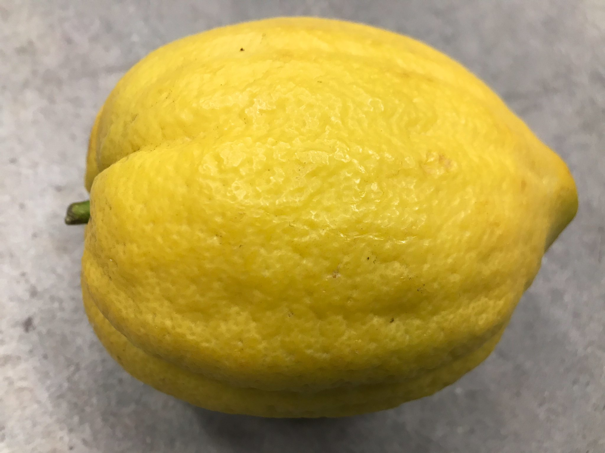
```

---

background-image: url("../crc_pics/citrus_webberii.jpg")
background-size: 300px
background-position: 100% 0%

# A fruit of a goodly tree

<div class="row">
  <div class="column" style="max-width:46%; font-size: 15px;">
    
    
  </div>
  <div class="column" style="max-width:54%; font-size: 15px;">
    
    
  </div>
</div>

---

background-image: url("../crc_pics/palestine_sweet_lime.jpg")
background-size: 250px
background-position: 100% 0%


# Western medicine and nutrition

<div class="row">
  <div class="column" style="max-width:50%; font-size: 15px;">
    
  </div>
  <div class="column" style="max-width:50%; font-size: 15px;">
    
    
  </div>
</div>

---

background-image: url("../crc_pics/rubidoux_trifoliate.jpg")
background-size: 250px
background-position: 100% 0%

## Rise of the Mafia


<div class="row">
  <div class="column" style="max-width:50%; font-size: 15px;">
    
    
  </div>
  <div class="column" style="max-width:50%; font-size: 15px;">
    
  </div>
</div>

---

background-image: url(https://citrusvariety.ucr.edu/sites/default/files/IMG_8379_0.JPG)
background-size: 950px
background-position: 50% 0%

# Citrus Variety Collection @ UC Riverside

<div class="row">
  <div class="column" style="max-width:25%; font-size: 15px;">
    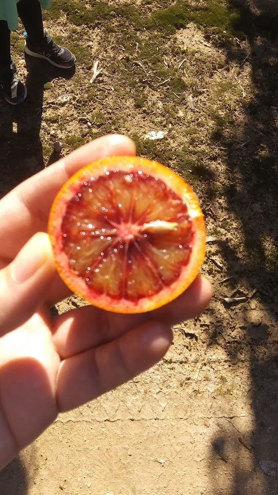
    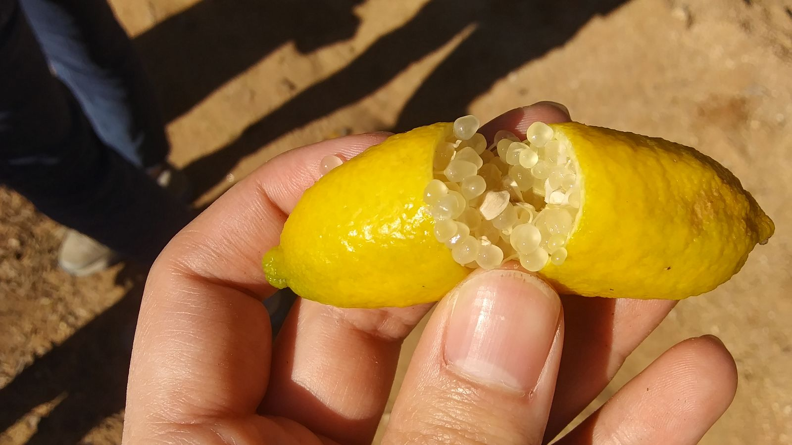
    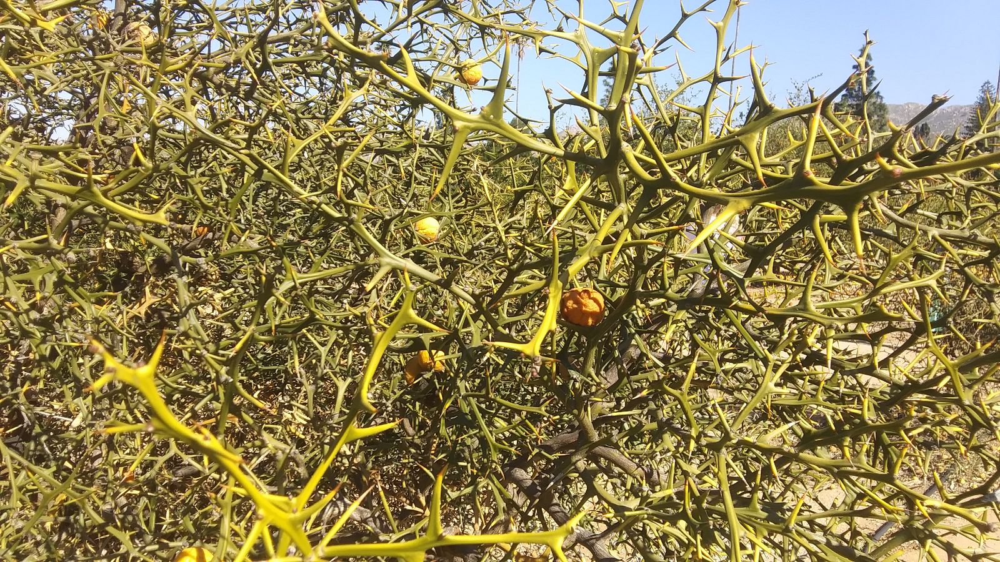
  </div>
  <div class="column" style="max-width:25%; font-size: 15px;">
    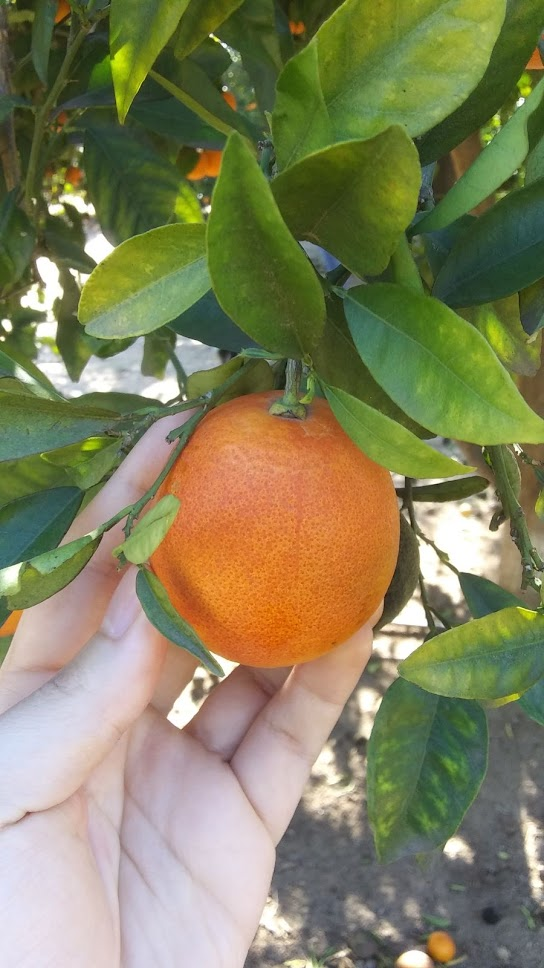
    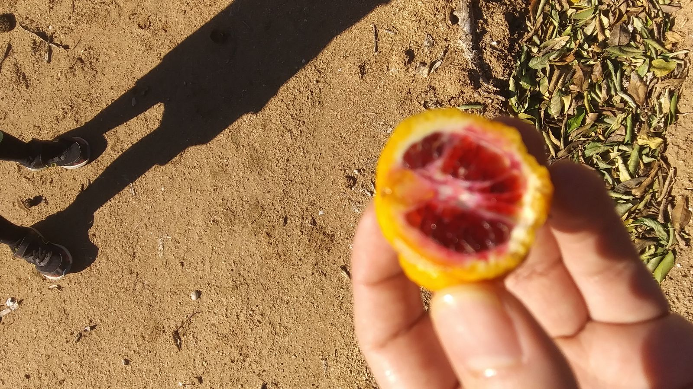
    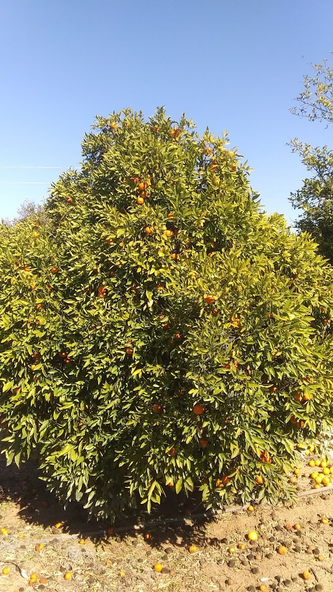
  </div>
  <div class="column" style="max-width:25%; font-size: 15px;">
    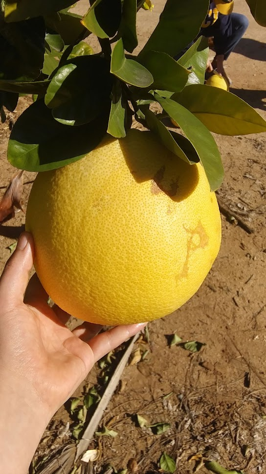
    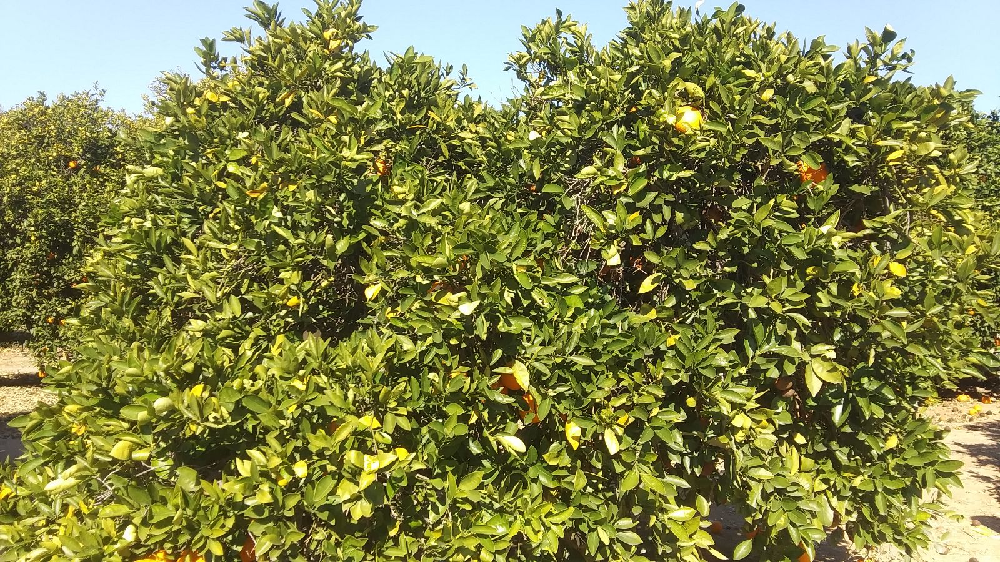
    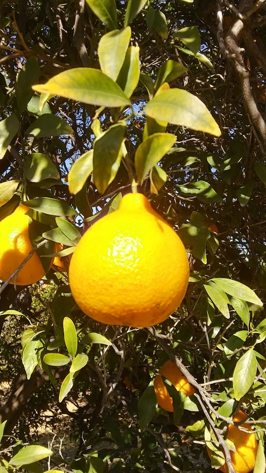
  </div>
  <div class="column" style="max-width:25%; font-size: 15px;">
    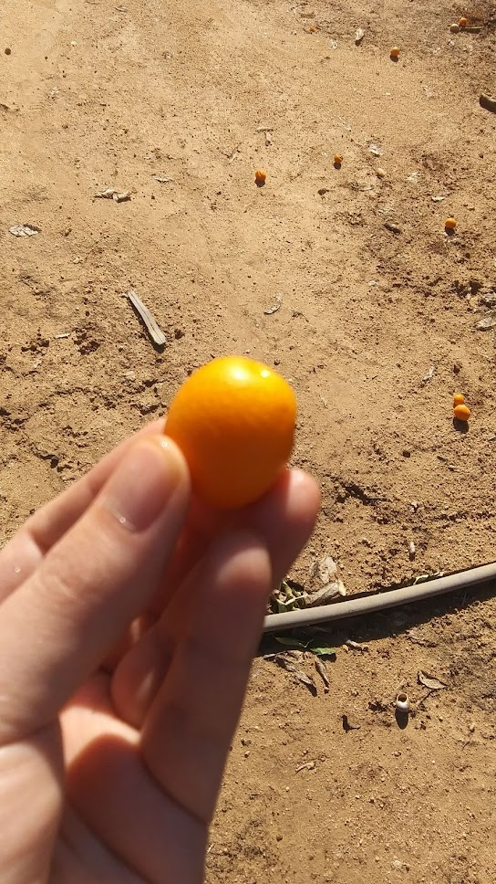
    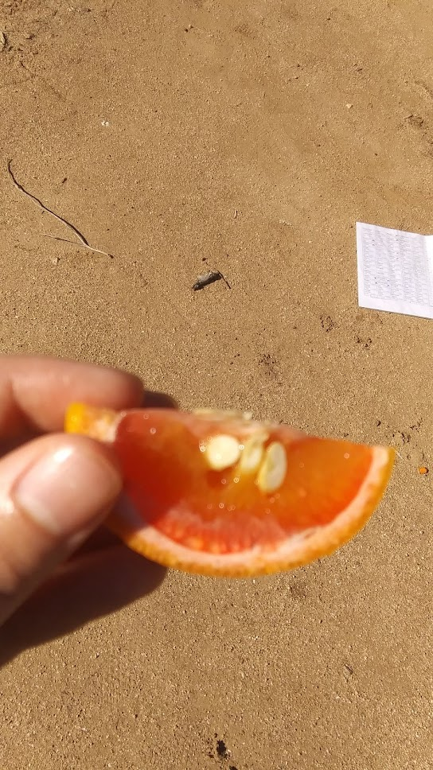
    
  </div>
</div>

---

class: inverse, middle, center

# Back on track

## Now some cool mathematics

```{r, out.width=400}
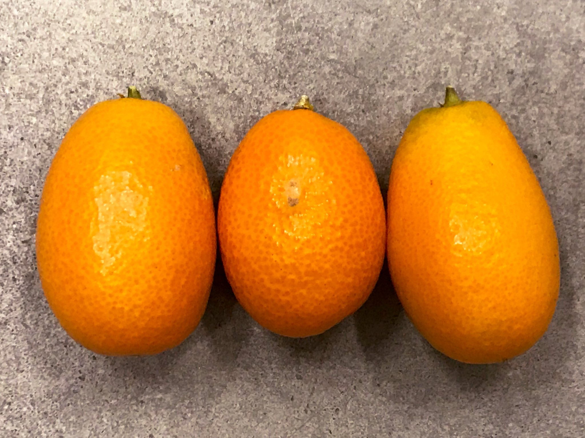
```

---

## Raw Data: X-rays &rarr; Image Processing

<div class="row">
  <div class="column" style="max-width:38%; color: Navy; font-size: 15px;">
    
    <p style="text-align: center;"> UCR Collaboration </p>
  </div>
  <div class="column" style="max-width:38%; color: Navy; font-size: 15px;">
    
    <p style="text-align: center;"> 3D X-Ray CT scan </p>
  </div>
  <div class="column" style="max-width:23%; color: Navy; font-size: 15px;">
    
    <p style="text-align: center;"> Raw </p>
  </div>
</div>

<div class="row" style="margin: 0 auto;">
  <div class="column" style="max-width:20%; color: Navy; font-size: 15px;">
    
    <p style="text-align: center;"> Spine </p>
  </div>
  <div class="column" style="max-width:20%; color: Navy; font-size: 15px;">
    
    <p style="text-align: center;"> Endocarp </p>
  </div>
  <div class="column" style="max-width:20%; color: Navy; font-size: 15px;">
    
    <p style="text-align: center;"> Rind </p>
  </div>
  <div class="column" style="max-width:20%; color: Navy; font-size: 15px;">
    
    <p style="text-align: center;"> Exocarp </p>
  </div>
  <div class="column" style="max-width:20%; color: Navy; font-size: 15px;">
    
    <p style="text-align: center;"><strong>Oil glands</strong></p>
  </div>
</div>

---

## Oil glands and the shape of fruit development

.pull-left[

<p style="font-size: 8px; text-align: right; color: Grey;"> Credits: <a href="https://www.boredpanda.com/life-cycles-pics/">BoredPanda</a></p>

Developing cycle of a lemon
]

.pull-right[

]

---

# Compare ~~apples~~ lemons to oranges

<div class="row" style="margin: 0 auto;">
  <div class="column" style="max-width:33%; color: Navy; font-size: 15px;">
    
    
  </div>
  <div class="column" style="max-width:33%; color: Navy; font-size: 15px;">
    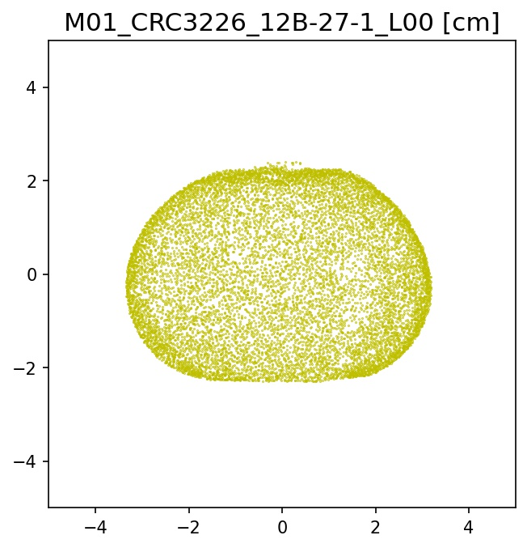
    
  </div>
  <div class="column" style="max-width:33%; color: Navy; font-size: 15px;">
    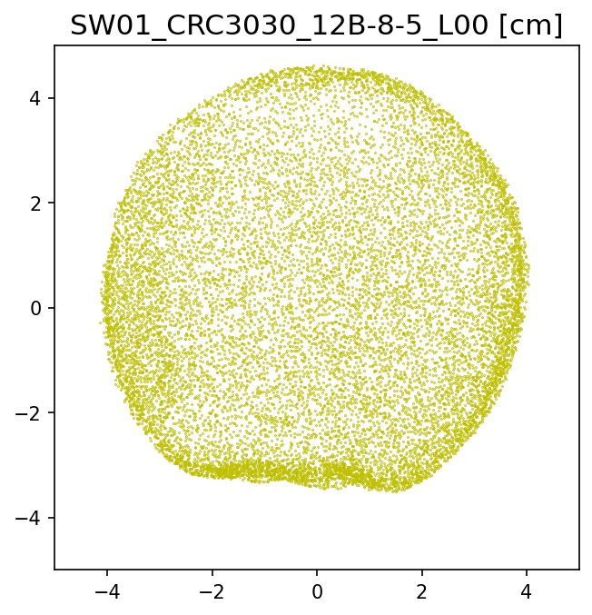
    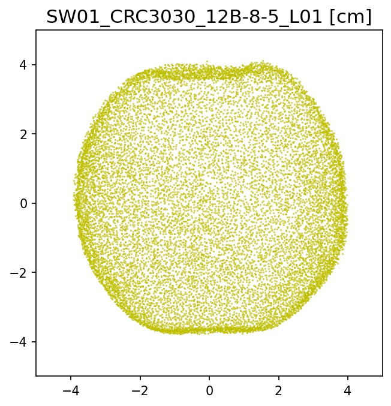
  </div>
</div>

---

background-image: url("../../citrus/figs/lambert_equal_area_N.gif")
background-size: 150px
background-position: 98% 1%

class: middle

## Citrus modeling: Sour and sweet orange

```{r, out.width=800, fig.align='center'}
knitr::include_graphics(c('../../citrus/figs/SR01_CRC3289_12B-19-9_L00_lambproj.jpg',
                          '../../citrus/figs/SW03_CRC1241-B_12B-4-3_L00_lambproj.jpg'))
```

---

class: inverse, center, middle

# But then, what distribution do oil glands follow?

## Spherical Kernel Density Estimates FTW

---


background-image: url("../ellipsoids/GarciaPortugues_2013.png")
background-size: 300px
background-position: 95% 3%

# Spherical KDE


- A taste of directional statistics

---

```{r, out.width=600, fig.align='center'}
knitr::include_graphics(c('../figs/P01C_L00_N.gif',
                          '../figs/M01_L00_N.gif'))
```

---


background-image: url("../../citrus/figs/ppp3.png")
background-size: 225px
background-position: 95% 3%

# Summary

.left-column[

```{r, out.width=150, fig.align='center'}
knitr::include_graphics(c('../../citrus/crc_pics/citrus_amblycarpa.jpg',
                          '../../citrus/figs/SR01_L01_black_exocarp.gif',
                          '../../citrus/figs/SW03_CRC1241-B_12B-4-3_L00_lambproj_v.jpg'))
```

]

.right-column[
- It is possible to **compare** ~~apples~~ limes to oranges, despite diversity in shapes and sizes.

- We can define the **distribution** of oil glands for most of the citrus.

- **First** time citrus shape has been examined using X-ray CT scans.

- AFAIK, this is also the **first** time directional statistics have been **applied** to plant biology.
]

---


background-image: url("../../img/phd_institutional_logos.jpg")
background-size: 500px
background-position: 95% 5%

class: inverse

# Thank you!

<div class="row">
  <div class="column" style="max-width:15%; font-size: 15px;">
    
    <p style="text-align: center; color: White">Liz Munch (MSU)</p>
    
    <p style="text-align: center; color: White">Tim Ophelders (Utrecht)</p>
    
    <p style="text-align: center; color: White">Michelle Quigley<br>(PSU)</p>
  </div>
  <div class="column" style="max-width:15%; font-size: 15px;">
    
    <p style="text-align: center; color: White">Dan Chitwood<br>(MSU)</p>
    
  <p style="text-align: center; color: White">Danelle Seymour<br>(UC Riverside)</p>
  </div>
  <div class="column" style="max-width:65%; font-size: 24px; line-height:1.25; margin-left:auto;margin-right:auto;">
  <p style="text-align: center; color: White"><strong>Email</strong>: <span style="color: Yellow">eah4d@missouri.edu</span></p>
  <p style="text-align: center; color: White"><strong>Slides</strong>: <span style="color: Yellow">ejamezquita.github.io</span></p>
  
  </div>
</div>
