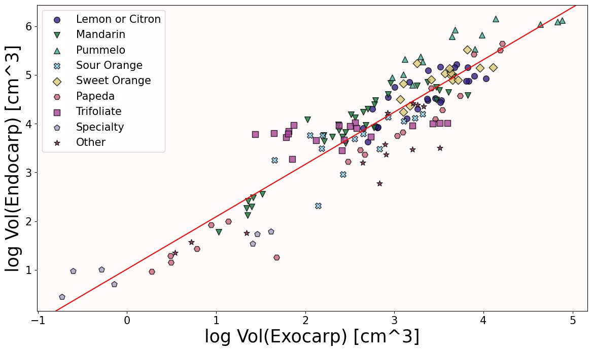
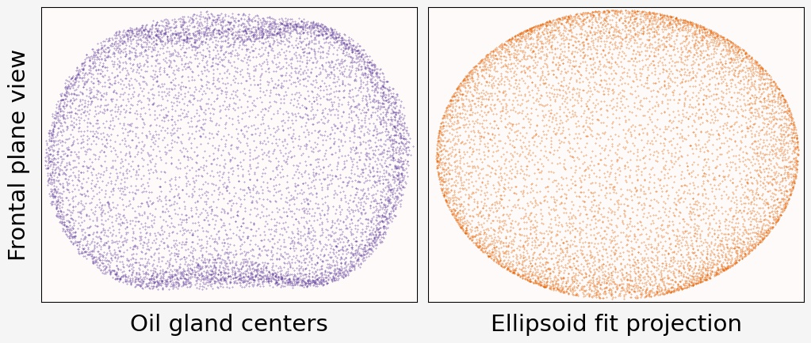

```{r setup, include=FALSE}
library(knitr)

# <!-- Copies an HTML dependency to a subdirectory of the given directory. The subdirectory name willbename-version(for example, "outputDir/jquery-1.11.0"). You may setoptions(htmltools.dir.version= FALSE)to suppress the version number in the subdirectory name. -->
options(htmltools.dir.version = FALSE)
knitr::opts_chunk$set(echo = FALSE)
knitr::opts_chunk$set(fig.align = 'center')
```
class: center

## When life gives you lemons, make lego blocks


<p style="font-size: 8px; text-align: right; color: Grey;"> Credits: <a href="https://doi.org/10.1038/nature25447">Wu <em>et al.</em> (2018)</a></p>

---

## Raw Data: X-rays &rarr; Image Processing

<div class="row">
  <div class="column" style="max-width:38%; color: Navy; font-size: 15px;">
    
    <p style="text-align: center;"> UCR Collaboration </p>
  </div>
  <div class="column" style="max-width:38%; color: Navy; font-size: 15px;">
    
    <p style="text-align: center;"> 3D X-Ray CT scan </p>
  </div>
  <div class="column" style="max-width:23%; color: Navy; font-size: 15px;">
    
    <p style="text-align: center;"> Raw </p>
  </div>
</div>

--

<div class="row" style="margin: 0 auto;">
  <div class="column" style="max-width:20%; color: Navy; font-size: 15px;">
    
    <p style="text-align: center;"> Spine </p>
  </div>
  <div class="column" style="max-width:20%; color: Navy; font-size: 15px;">
    
    <p style="text-align: center;"> Endocarp </p>
  </div>
  <div class="column" style="max-width:20%; color: Navy; font-size: 15px;">
    
    <p style="text-align: center;"> Rind </p>
  </div>
  <div class="column" style="max-width:20%; color: Navy; font-size: 15px;">
    
    <p style="text-align: center;"> Exocarp </p>
  </div>
  <div class="column" style="max-width:20%; color: Navy; font-size: 15px;">
    
    <p style="text-align: center;"> Oil glands</p>
  </div>
</div>

---

## Quantifying the shape of citrus and their oil glands

<div class="row" style="margin: 0 auto;">
  <div class="column" style="max-width:44%; color: Navy; font-size: 15px;">
    
    
    
  </div>
  <div class="column" style="max-width:54%; color: Navy; font-size: 15px;">
    
    
  </div>
</div>

---

background-image: url("../../cmse/figs/institutional_logos.jpg")
background-size: 500px
background-position: 95% 5%

class: inverse

# Thank you!

<div class="row">
  <div class="column" style="max-width:23%; font-size: 15px;">
    
    <p style="text-align: center; color: White">Liz Munch (MSU)</p>
    
    <p style="text-align: center; color: White">Tim Ophelders (Utrecht)</p>
  </div>
  <div class="column" style="max-width:23%; font-size: 15px;">
    
    <p style="text-align: center; color: White">Dan Chitwood<br>(MSU)</p>
    
    <p style="text-align: center; color: White">Michelle Quigley<br>(MSU)</p>
  </div>
  <div class="column" style="max-width:16%; font-size: 15px;">
  
  <p style="text-align: center; color: White">Danelle Seymour<br>(UC Riverside)</p>
  
  </div>
  <div class="column" style="width:10%; font-size: 24px;">
  </div>
  <div class="column" style="max-width:30%; font-size: 24px; line-height:1.25">
  <p style="text-align: center; color: White"><strong>Email</strong></p>
  <p style="text-align: center; color: Yellow">amezqui3@msu.edu</p>
  <p style="text-align: center; color: White"><strong>Website and slides</strong></p>
  <p style="text-align: center; color: Yellow">egr.msu.edu/~amezqui3</p>
  <p style="text-align: center; color: White"><strong>In preparation</strong></p>
  <p style="text-align: center; color: Yellow;">The shape of aroma: measuring and modeling citrus oil gland distribution</p>
  <p style="text-align: center; color: White; font-size:12px; line-height:1.1">Slides made in xaringan and rmarkdown</p>
  </div>
</div>

