```{r setup, include=FALSE}
library(knitr)
library(magrittr)

# <!-- Copies an HTML dependency to a subdirectory of the given directory. The subdirectory name willbename-version(for example, "outputDir/jquery-1.11.0"). You may setoptions(htmltools.dir.version= FALSE)to suppress the version number in the subdirectory name. -->
options(htmltools.dir.version = FALSE)
knitr::opts_chunk$set(echo = FALSE)
knitr::opts_chunk$set(fig.align = 'center')
```

background-image: url("../../img/endlessforms.png")
background-size: 150px
background-position: 89% 7%

class: inverse

# When life gives you lemons...

<div class="row">
  <div class="column" style="max-width:50%">
    <iframe width="375" height="210" src="https://www.youtube-nocookie.com/embed/khRS5AuleIM?controls=0" frameborder="0" allow="accelerometer; autoplay; encrypted-media; gyroscope; picture-in-picture" allowfullscreen></iframe>
    <iframe width="375" height="210" src="https://www.youtube-nocookie.com/embed/HAIaektvV3Q?controls=0" frameborder="0" allow="accelerometer; autoplay; encrypted-media; gyroscope; picture-in-picture" allowfullscreen></iframe>
  </div>
  <div class="column" style="max-width:50%">
    <iframe width="375" height="210" src="https://www.youtube-nocookie.com/embed/Xo2HULkkm3s?controls=0" frameborder="0" allow="accelerometer; autoplay; encrypted-media; gyroscope; picture-in-picture" allowfullscreen></iframe>
    <iframe width="375" height="210" src="https://www.youtube-nocookie.com/embed/EwTwSNrBuIo?controls=0" frameborder="0" allow="accelerometer; autoplay; encrypted-media; gyroscope; picture-in-picture" allowfullscreen></iframe>
  </div>
</div>

<p style="font-size: 24px; text-align: right; font-family: 'Yanone Kaffeesatz'">More X-ray CT 3D scans at <a href="https://www.youtube.com/@endlessforms6756">youtube.com/@endlessforms6756</a></p>

---

background-image: url("../../demat/figs/fam9_3.png")
background-size: 100px
background-position: 98% 2%

# From MX to MI to MO at MU

.left-column[

]

.right-column[
- 2013 - 2018 : Math @ at the Universidad de Guanajuato and CIMAT (Mexico).

- 2016 - 2018 : Bachelor thesis: **Math + Archaeology**. Use TDA to quantify and classify the shape of pre-Columbian masks found in the Templo Mayor in Mexico City.

- 2018 - 2023 : CMSE @ Michigan State University. **Came for the math. Stayed for the plants.**

- 2023 - present : PFFIE Postdoc Fellow @ Division of Plant Sciences & Department of Mathematics at Mizzou

]

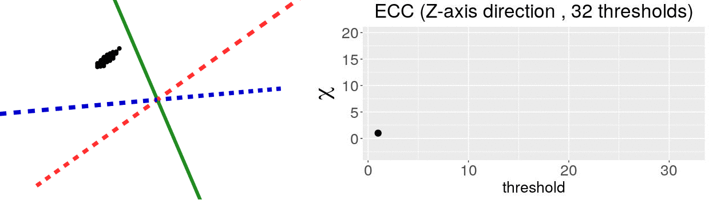

---

background-image: url("../../img/primary-logo-forestgreen.svg")
background-size: 100px
background-position: 98% 2%

# My main past projects

<div class="row" style="font-family: 'Yanone Kaffeesatz'; font-size:25px;">
  <div class="column" style="max-width:25%">
    <p style="text-align: center;">The shape of<br>adaptability</p>
    </img>
    </img>
    <p style="text-align: center; font-size:20px;">Topological Data Analysis<br>Euler Characteristic Transform</p>
  </div>
  <div class="column" style="max-width:25%">
    <p style="text-align: center;">The shape of<br>development</p>
    </img>
    </img>
    <p style="text-align: center; font-size:20px">Ellipsoidal modeling<br>Directional statistics</p>
  </div>
  <div class="column" style="max-width:25%">
    <p style="text-align: center;">The shape of<br>breeding</p>
    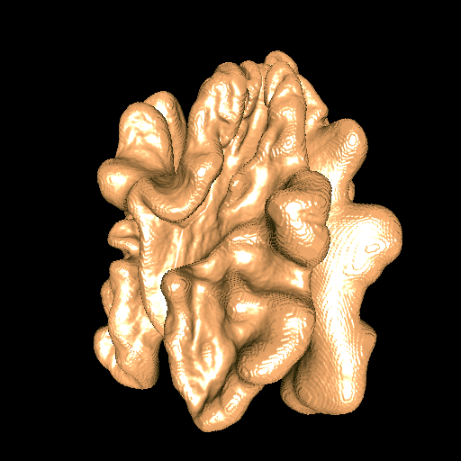</img>
    </img>
    <p style="text-align: center; font-size:20px">Allometry of multiple tissues<br>Convexity indices</p>
  </div>
  <div class="column" style="max-width:25%">
    <p style="text-align: center;">The shape of<br>omics</p>
    </img>
    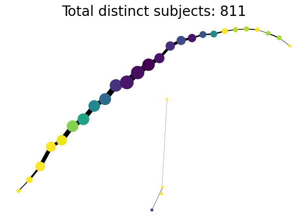</img>
    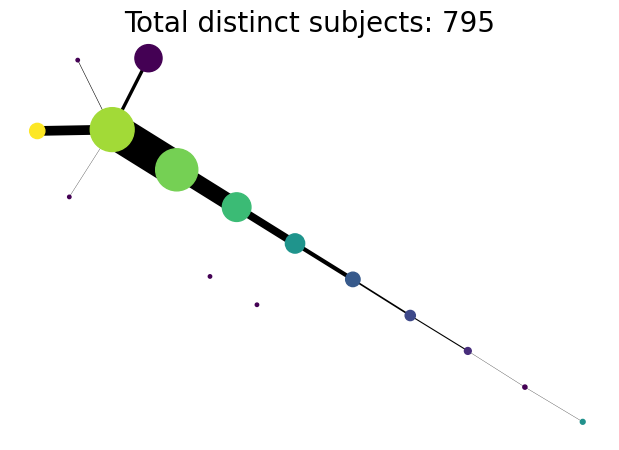</img>
    <p style="text-align: center; font-size:20px">Mapper<br>Spectral analysis</p>
  </div>
</div>

---

# Roadmap for today

.left-column[


]

.right-column[
1. Brief overview of citrus biology and cultural history

1. Experimental setup and quick results

1. Ellipsoidal approximation and directional statistics

The last 20 slides are a crash course into Topological Data Analysis.

Will **not** get there unless there is ample time.

]

---

class: inverse, middle, center

# More than just oranges

```{r, out.width=400}
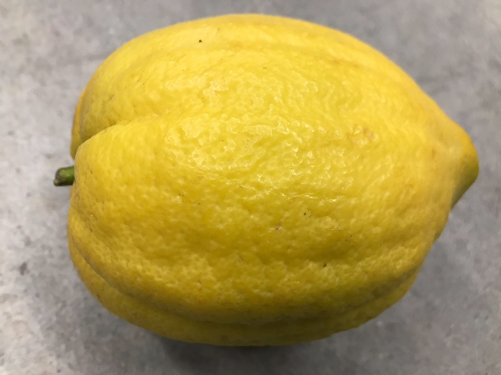
```

---

## Think of citrus as lego blocks


<p style="font-size: 8px; text-align: right; color: Grey;"> Credits: <a href="https://doi.org/10.1038/nature25447">Wu <em>et al.</em> (2018)</a></p>

---

background-image: url("../crc_pics/cvc3.jpg")
background-size: 350px
background-position: 100% 0%

## Citrus originated 8M* years ago

Originated in South and South East Asia, and Australia.

```{r, out.width=570, fig.align='center'}
knitr::include_graphics(c('../figs/precursor_citrus_geo_distribution.jpg'))
```
<p style="font-size: 8px; text-align: right; color: Grey;"> Credits: <a href="https://doi.org/10.1038/nature25447">Wu <em>et al.</em> (2018)</a></p>

---

background-image: url("../crc_pics/cvc2.jpg")
background-size: 850px
background-position: 50% 40%


## Genetic distances between citrus

```{r, out.width=550, fig.align='left'}
knitr::include_graphics(c('../figs/../figs/precursor_citrus_phylogenetic.jpg'))
```
<p style="font-size: 8px; text-align: center; color: Grey;"> Credits: <a href="https://doi.org/10.1038/nature25447">Wu <em>et al.</em> (2018)</a></p>

10* _fundamental_ citrus gave rise to all citrus diversity we see today

---

## Oil glands are closely linked to fruit development

.pull-left[
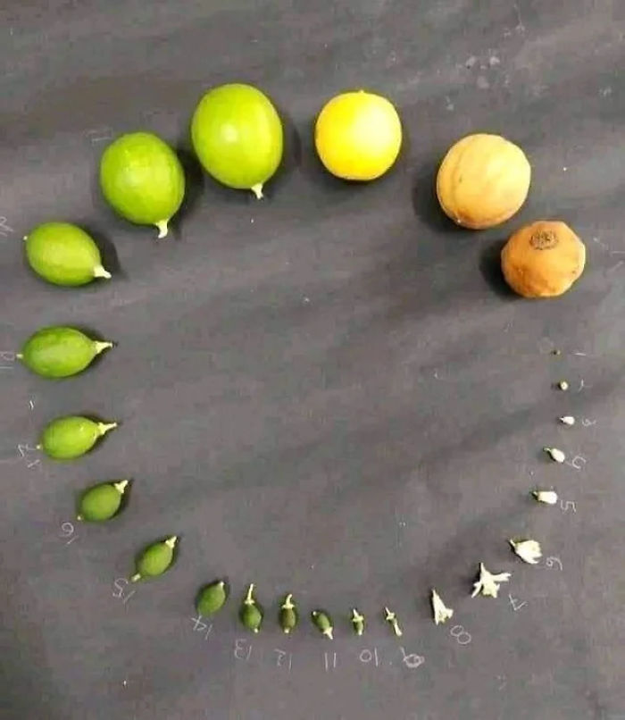
<p style="font-size: 8px; text-align: right; color: Grey;"> Credits: <a href="https://www.boredpanda.com/life-cycles-pics/">BoredPanda</a></p>

Developing cycle of a lemon
]

.pull-right[
<iframe width="560" height="300" src="https://static-movie-usa.glencoesoftware.com/webm/10.1073/956/d916befc88029defb1ecef6c4a2fd83db89428d9/pnas.1720809115.sm02.webm" frameborder="0" allowfullscreen></iframe>
<p style="font-size: 8px; text-align: right; color: Grey;"> Credits: <a href="https://doi.org/10.1073/pnas.1720809115">Smith <em>et al.</em> (2018)</a></p>

- Cross-sectional view of a navel orange peel bending to the point of jetting. 

- Huge perfume and food industry behind essential oils

]

---

class: inverse, middle, center

# Experimental setup

## And some quick results

```{r, out.width=400}
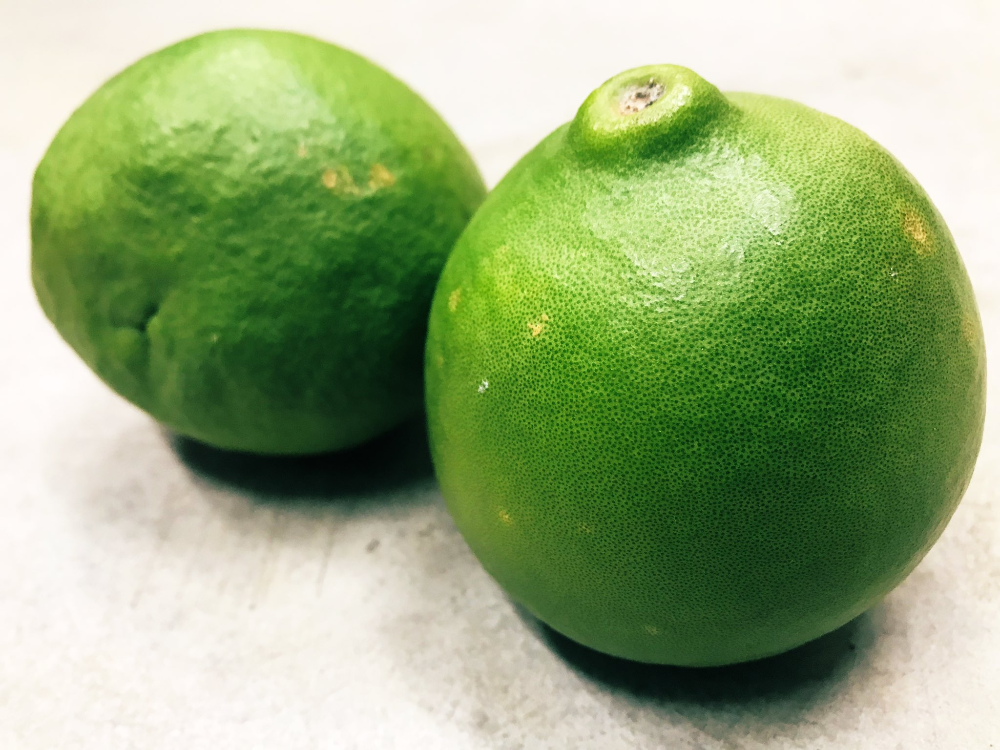
```

---

## Raw Data: X-rays &rarr; Image Processing

<div class="row">
  <div class="column" style="max-width:38%; color: Navy; font-size: 15px;">
    
    <p style="text-align: center;"> UCR Collaboration </p>
  </div>
  <div class="column" style="max-width:38%; color: Navy; font-size: 15px;">
    
    <p style="text-align: center;"> 3D X-Ray CT scan </p>
  </div>
  <div class="column" style="max-width:23%; color: Navy; font-size: 15px;">
    
    <p style="text-align: center;"> Raw </p>
  </div>
</div>

<div class="row" style="margin: 0 auto;">
  <div class="column" style="max-width:20%; color: Navy; font-size: 15px;">
    
    <p style="text-align: center;"> Spine </p>
  </div>
  <div class="column" style="max-width:20%; color: Navy; font-size: 15px;">
    
    <p style="text-align: center;"> Endocarp </p>
  </div>
  <div class="column" style="max-width:20%; color: Navy; font-size: 15px;">
    
    <p style="text-align: center;"> Rind </p>
  </div>
  <div class="column" style="max-width:20%; color: Navy; font-size: 15px;">
    
    <p style="text-align: center;"> Exocarp </p>
  </div>
  <div class="column" style="max-width:20%; color: Navy; font-size: 15px;">
    
    <p style="text-align: center;"> Oil glands</p>
  </div>
</div>

---

## The centers will be just fine

.pull-left[


- 58 species and 163 raw scans

- About 6K&rarr;20K individual oil glands detected

- Number in the right ballpark

- We have a point cloud in $\mathbb{R}^3$.
]

.pull-right[

<p style="font-size: 8px; text-align: right; color: Grey;"> Credits: <a href="https://doi.org/10.1006/anbo.2001.1546">Knight <em>et al.</em> (2001)</a></p>
]


---

# Allometry

+ Linear relationship between size-related measurements.

<div class="row" style="margin: 0 auto;">
  <div class="column" style="max-width:49%; color: Navy; font-size: 15px;">
    
    
  </div>
  <div class="column" style="max-width:49%; color: Navy; font-size: 15px;">
    
    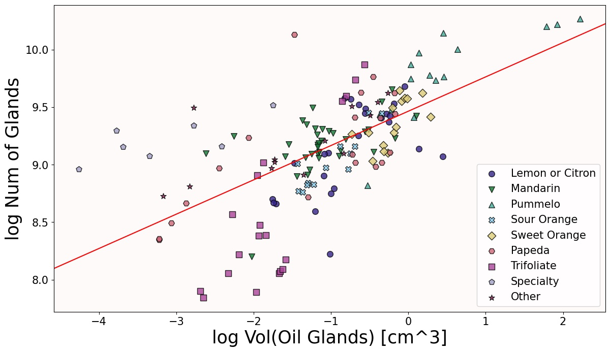
  </div>
</div>

+ Total number of glands seems to be decoupled

---

## Average distance from each gland to its $k$-th nearest neighbor


+ $\text{Avg.dist}(k) = \sqrt{Mk + B}$
+ Oil glands might be distributing themselves following **normal diffusion** mechanics
+ The **outliers** for citrus groups usually correspond to hybrids.

---

class: inverse, center, middle

# Citrus are quite spherical

## Ellipsoidal to be more precise

## Directional statistics to compare fruit surfaces

```{r, out.width=400}
knitr::include_graphics("../crc_pics/nagami_kumquat.jpg")
```

---

background-image: url("../ellipsoids/Li_and_Griffiths_2004.png")
background-size: 250px
background-position: 95% 3%

## Best ellipsoid fitting &mdash; least squares

- A general quadratic surface is defined by the equation

$$\eqalignno{ & ax^{2}+by^{2}+cz^{2}+2fxy+2gyz+2hzy\ \ \ \ \ \ \ \ \ &\hbox{(1)}\cr &+2px+2qy+2rz+d=0.}$$

With our observations $\{(x_i,y_i,z_i)\}_i$, 

$$
\begin{pmatrix}
x_1^2 & y_1^2 & z_1^2 & 2x_1y_1 & 2y_1z_1 & 2x_1z_1 & x_1 & y_1 & z_1 & 1\\
x_2^2 & y_2^2 & z_2^2 & 2x_2y_2 & 2y_2z_2 & 2x_2z_2 & x_2 & y_2 & z_2 & 1\\
\vdots& \vdots& \vdots& \vdots & \vdots & \vdots & \vdots & \vdots & \vdots \\
x_n^2 & y_n^2 & z_n^2 & 2x_ny_n & 2y_nz_n & 2x_nz_n & x_n & y_n & z_n & 1
\end{pmatrix}
\begin{pmatrix}
a \\ b \\ \vdots \\ d
\end{pmatrix}
=
\begin{pmatrix}
0 \\ 0 \\ \vdots \\ 0
\end{pmatrix}
$$
or
$$
\mathbf{D}\mathbf{v} = 0
$$

The solution to the system above can be obtained via Lagrange multipliers

$$\min_{\mathbf{v}\in\mathbb{R}^{10}}\left\|\mathbf{D}\mathbf{v}\right\|^2, \quad \mathrm{s.t.}\; \text{ some ellipsoid-specific conditions hold}$$

---

## Model the whole fruit as an ellipsoid

.pull-left[

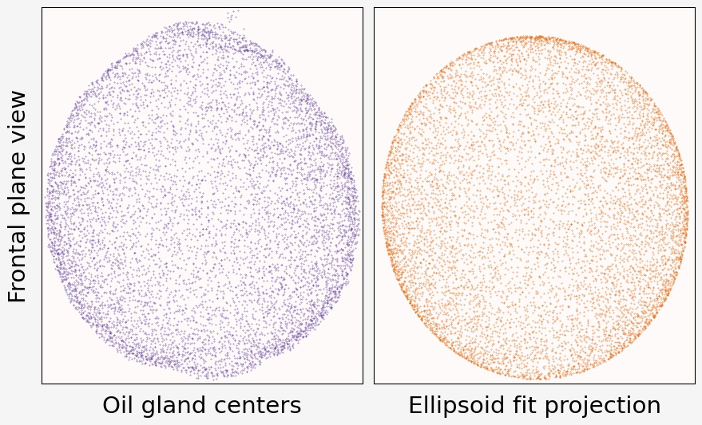
]

.pull-right[


]

---

background-image: url("../figs/lambert_equal_area_N.gif")
background-size: 150px
background-position: 98% 1%

## Citrus modeling: Sour orange


```{r, out.width=550, fig.align='center'}
knitr::include_graphics('../figs/SR01_CRC3289_12B-19-9_L00_geocentric_lazi.jpg')
```

---

background-image: url("../figs/lambert_equal_area_N.gif")
background-size: 150px
background-position: 98% 1%

## Citrus modeling: Pummelo

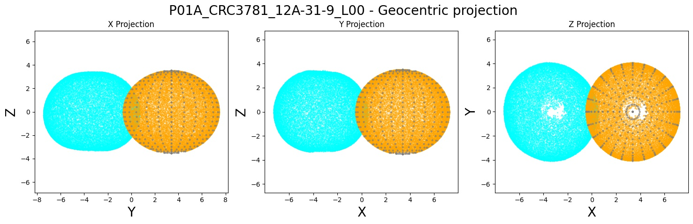

```{r, out.width=550, fig.align='center'}
knitr::include_graphics('../figs/P01A_CRC3781_12A-31-9_L00_geocentric_lazi.jpg')
```

---

background-image: url("../figs/lambert_equal_area_N.gif")
background-size: 150px
background-position: 98% 1%

## Citrus modeling: Mandarin


```{r, out.width=550, fig.align='center'}
knitr::include_graphics('../figs/M01_CRC3226_12B-27-1_L00_geocentric_lazi.jpg')
```

---

background-image: url("../figs/lambert_equal_area_N.gif")
background-size: 150px
background-position: 98% 1%

## Citrus modeling: Kumquat


```{r, out.width=550, fig.align='center'}
knitr::include_graphics('../figs/WR02_CRC3877_12B-44-13_L00_geocentric_lazi.jpg')
```

---

background-image: url("../../citrus/figs/lambert_equal_area_N.gif")
background-size: 150px
background-position: 98% 1%

## Citrus modeling: Finger lime


```{r, out.width=550, fig.align='center'}
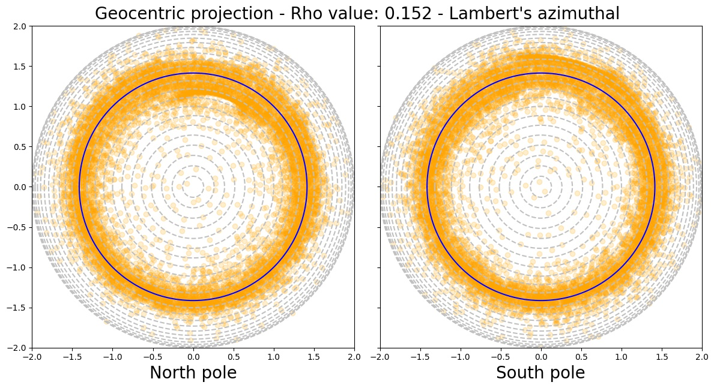
```

---

background-image: url("../ellipsoids/GarciaPortugues_etal_2020a.png")
background-size: 200px
background-position: 95% 3%

# Can we say something more?


---

# Uniform and rotationally symmetric spherical distributions


---

class: inverse, center, middle

# But then, what distribution do oil glands follow?

## Spherical Kernel Density Estimates FTW

```{r, out.width=400}
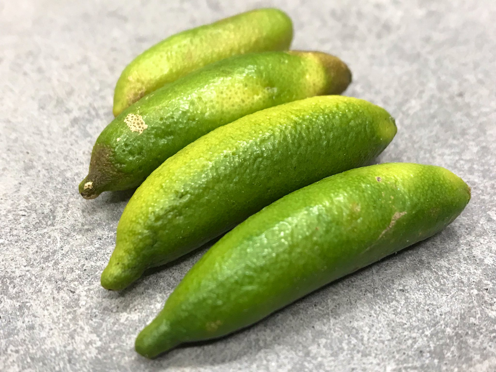
```

---

# Kernel Density Estimators


<p style="font-size: 8px; text-align: right; color: Grey;"> Credits: <a href="https://www.statsmodels.org/dev/examples/notebooks/generated/kernel_density.html">Statsmodels</a></p>

- The choice of bandwidth is crucial
- Large bandwidths tend to oversmooth
- Small bandwidths tend to overfit
- Plenty of literature on $\mathbb{R}$ on how to choose an adequate value

---

background-image: url("../ellipsoids/GarciaPortugues_2013.png")
background-size: 300px
background-position: 95% 3%

# Spherical KDE


- Oil glands of a papeda
- Red arrows indicate the most significant gradient values for the density function
- Concentration parameter $k$ is chosen to be optimal

---

background-image: url("../ellipsoids/Vuollo_and_Holmstrom_2018.png")
background-size: 300px
background-position: 95% 3%

# More exploratory analysis

## SphereSiZer: Pummelo


---

# Side view of a sweet orange


---

# Side view of a mandarin


---

# Side view of a kumquat


---

# Side view of a finger lime


---

background-image: url("../../citrus/figs/ppp3.png")
background-size: 225px
background-position: 95% 3%

# Summary

.left-column[

```{r, out.width=150, fig.align='center'}
knitr::include_graphics(c('../../citrus/crc_pics/citrus_amblycarpa.jpg',
                          '../../citrus/figs/SR01_L01_black_exocarp.gif',
                          '../../citrus/figs/SW03_CRC1241-B_12B-4-3_L00_lambproj_v.jpg'))
```

]

.right-column[
- It is possible to **compare** ~~apples~~ limes to oranges, despite diversity in shapes and sizes.

- We can define the non-parametrical **distribution** of oil glands for most of the citrus.

- **First** time citrus shape has been examined using X-ray CT scans.

- AFAIK, this is also the **first** time directional statistics have been **applied** to plant biology.
]

---


background-image: url("../../img/phd_institutional_logos.jpg")
background-size: 500px
background-position: 95% 5%

class: inverse

# Thank you!

<div class="row">
  <div class="column" style="max-width:23%; font-size: 15px;">
    
    <p style="text-align: center;">Liz Munch (MSU)</p>
    
    <p style="text-align: center;">Tim Ophelders (Utrecht)</p>
  </div>
  <div class="column" style="max-width:23%; font-size: 15px;">
    
    <p style="text-align: center;">Dan Chitwood<br>(MSU)</p>
    
    <p style="text-align: center;">Michelle Quigley<br>(MSU)</p>
  </div>
  <div class="column" style="max-width:16%; font-size: 15px;">
  
  <p style="text-align: center;">Danelle Seymour<br>(UC Riverside)</p>
  
  </div>
  <div class="column" style="width:10%; font-size: 24px;">
  </div>
  <div class="column" style="max-width:30%; font-size: 24px; line-height:1.25">
  <p style="text-align: center;"><strong>Email</strong></p>
  <p style="text-align: center; color: Blue">eah4d@missouri.edu</p>
  <p style="text-align: center;"><strong>Website and slides</strong></p>
  <p style="text-align: center; color: Blue">ejamezquita.github.io</p>
  
  </div>
</div>

---

class: inverse, center, middle

# Do I still have time?

```{r, out.width=300}
knitr::include_graphics("../crc_pics/cvc12.jpg")
```

---

class: inverse, center, middle

# Future topological directions

## A crash course in Topological Data Analysis

```{r, out.width=300}
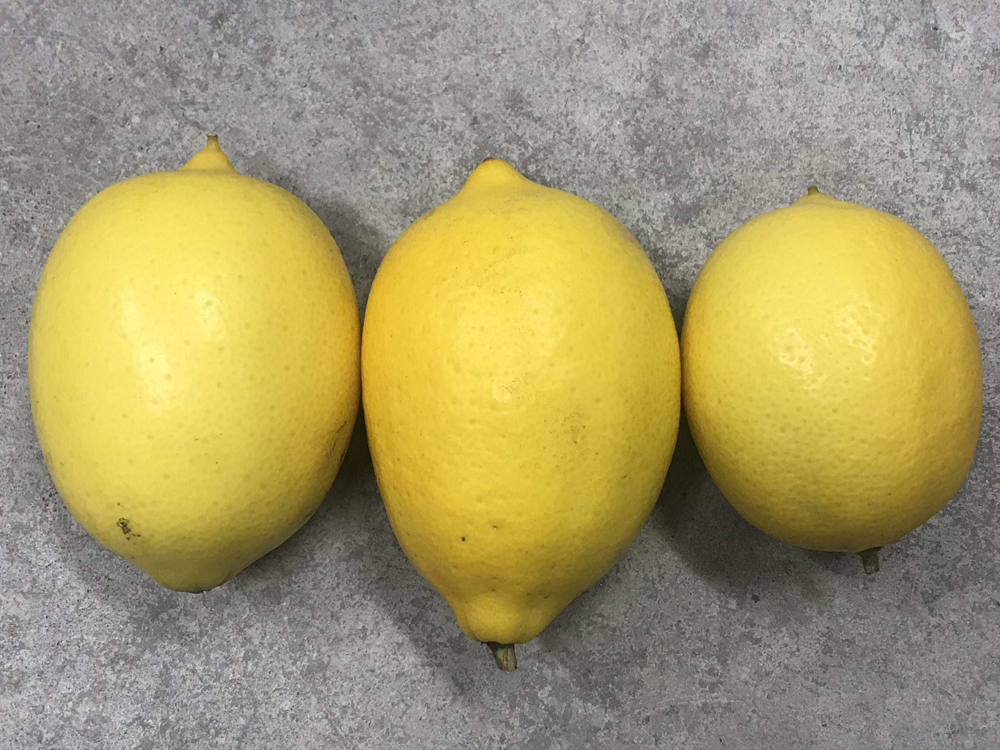
```

---

# 1st TDA Ingredient: Complexes

- Think the data as a collection of elementary building blocks ( _simplices_ )

Vertices | Edges | Faces | Tetrahedra
---------|-------|-------|-------
  0-dim  | 1-dim | 2-dim | 3-dim

- A collection of cells is a _simplicial complex_

- Count the number of topologically invariant features ( _holes_ ):

Connected components | Loops | Voids
---------------------|-------|-------
       0-dim         | 1-dim | 2-dim

- Example with 3 connected components, 1 loop, 1 voids

```{r, out.width=350}
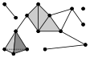
```

---

# 2nd TDA Ingredient: Filters

- Each cell is assigned a real value which defines how the complex is constructed.

- Observe how the number of topological features change as the complex grows.

.pull-left[
```{r, out.width="250px"}
knitr::include_graphics(c("../../barley/figs/eigcurv_filter.gif", "../../barley/figs/gaussian_density_filter.gif"))
```
]

.pull-right[
```{r, out.width="250px"}
knitr::include_graphics(c("../../barley/figs/eccentricity_filter.gif", "../../barley/figs/vrips_ver2.gif"))
```
]

---

```{r include=FALSE}
slides_info <- tibble::tibble(first  = formatC(0:7, digits=1, format='d', flag='0'))

slides_text <- glue::glue_data(
  slides_info,
  "
  background-image: url(\"../../tda/figs/vr1_{first}.svg\")
  background-size: 475px
  background-position: 50% 90%

  # A toy Vietoris-Rips filtration example
  
  - Consider a collection of vertices $\\{{v_\\lambda\\}}_{{\\lambda\\in\\Lambda}}$ and $r\\geq0$. 
  - The subset $\\{{v_0,\\ldots,v_n\\}}$ is a simplex in the $VR(r)$ simplicial complex iff
  $$d(v_i,v_j)\\leq r\\quad\\text{{ for all }}\\quad i,j\\in\\{{0,\\ldots,n\\}}.$$
  
  "
)
```

`r slides_text %>% paste(collapse = "\n---\n")`

---

background-image: url("../../tda/figs/barcode_vr1.svg")
background-size: 600px
background-position: 50% 90%
  
# Summarizing results in a barcode

.pull-left[
```{r, out.width=400}
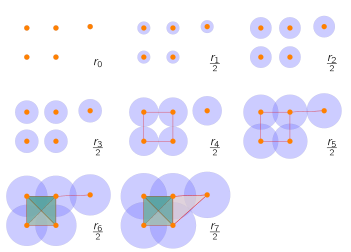
```
]

.pull-right[
- Five connected components are born from the get-go

- Four of them merge into one at $r_4$

- A hole is born with this merge

- This hole eventually is filled with triangles at $r_6$.
]

---

# Persistence diagrams


.pull-left[
```{r, out.width=400}
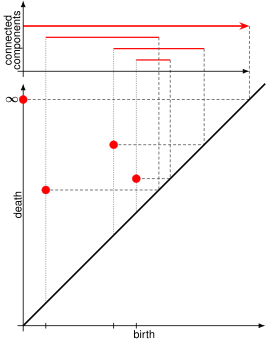
```
]

.pull-right[
- Consider $C_{i,j;q}$ all the $q$-classes that are born at time $i$ and die at time $j$

- The associated persistence diagram $\text{dgm}(\mathcal{F})$ is a multiset

$\text{dgm}(\mathcal{F}) = \bigcup_{q=0}^{n}\{(i,j) : \alpha_{i,j;q}\in C_{i,j;q}\}\cup\textrm{diag}$

]

---

background-image: url("../../tda/figs/bottleneck_diagram.svg")
background-size: 600px
background-position: 50% 90%

# Bottleneck distance and stability

- Consider $\text{dgm}_1$, $\text{dgm}_2$ two persistence diagrams. The *bottleneck distance$ between them is

$$d_B(\text{dgm}_1,\text{dgm}_2) = \inf_\gamma\sup_{p\in\text{dgm}_1}\|p-\gamma(p)\|_\infty.$$

- Where $\gamma$ is a bijection between the $q$-th $\text{dgm}_1$ and $\text{dgm}_2$

- **Persistence diagrams are stable under the bottleneck distance!**

---

### Quantify the distribution of oil glands using Persistent Homology

<div class="row">
  <div class="column" style="max-width:30%">
    
    
  </div>
  <div class="column" style="max-width:30%">
    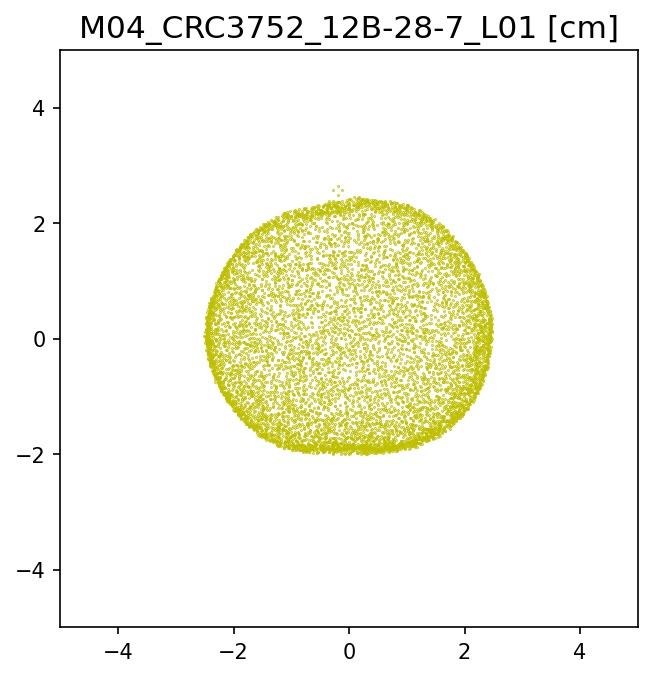
    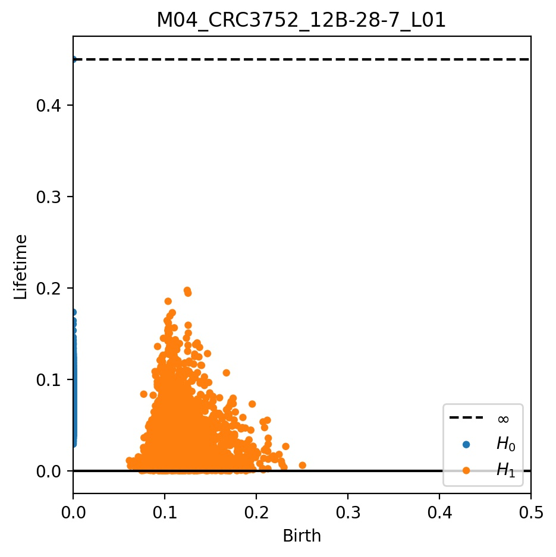
  </div>
  <div class="column" style="max-width:30%">
    
    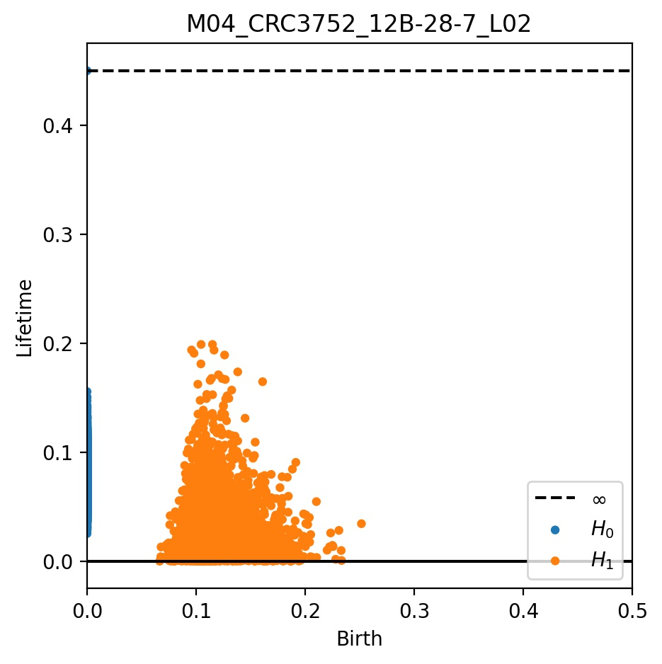
  </div>
</div>

Persistent Homology ( $H_0$ and $H_1$) computed with Ripser in `scikit-tda`.

---

### Quantify the distribution of oil glands using Persistent Homology

<div class="row">
  <div class="column" style="max-width:30%">
    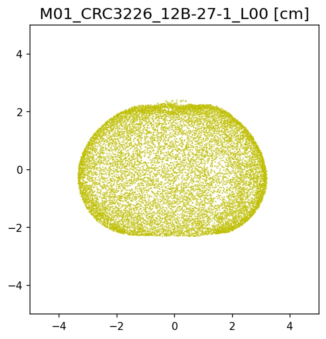
    
  </div>
  <div class="column" style="max-width:30%">
    
    
  </div>
  <div class="column" style="max-width:30%">
    
    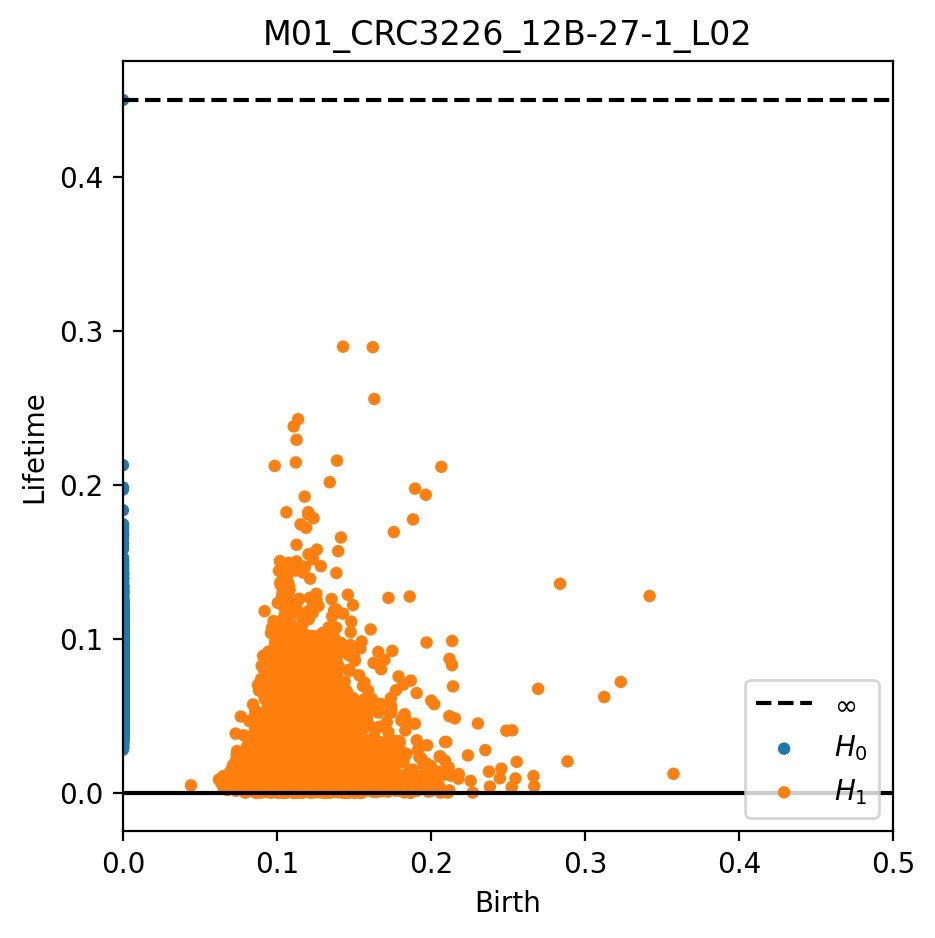
  </div>
</div>

Persistent Homology ( $H_0$ and $H_1$) computed with Ripser in `scikit-tda`.
---

### Quantify the distribution of oil glands using Persistent Homology

<div class="row">
  <div class="column" style="max-width:30%">
    
    
  </div>
  <div class="column" style="max-width:30%">
    
    
  </div>
  <div class="column" style="max-width:30%">
    
    
  </div>
</div>

Persistent Homology ( $H_0$ and $H_1$) computed with Ripser in `scikit-tda`.
---

### Quantify the distribution of oil glands using Persistent Homology

<div class="row">
  <div class="column" style="max-width:30%">
    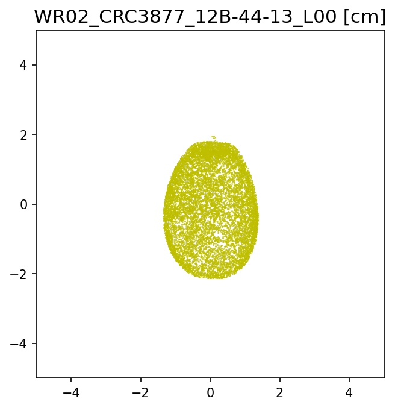
    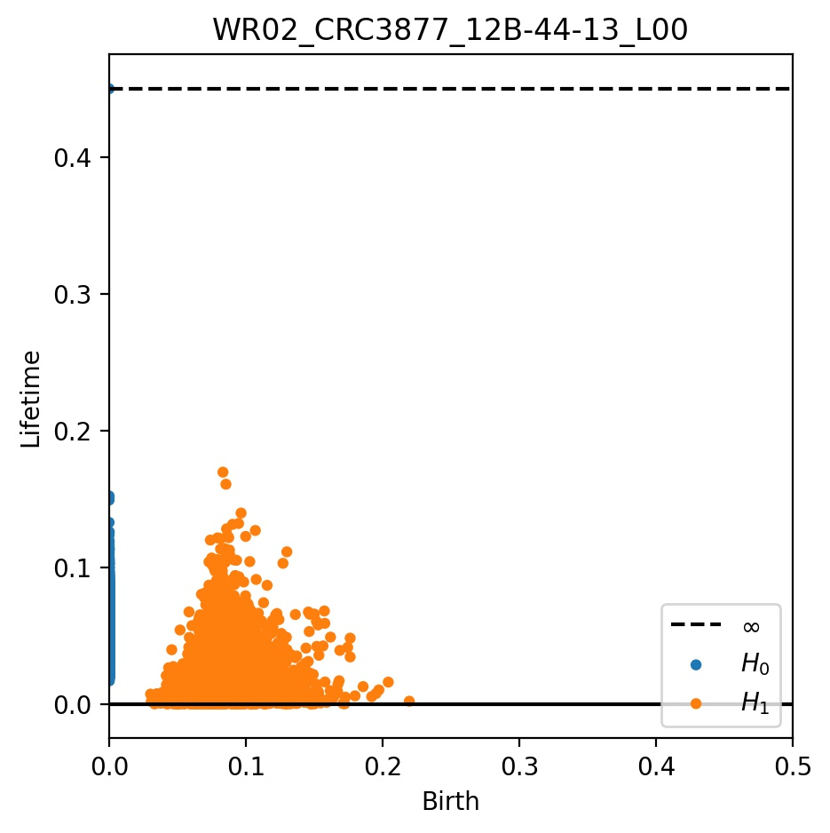
  </div>
  <div class="column" style="max-width:30%">
    
    
  </div>
  <div class="column" style="max-width:30%">
    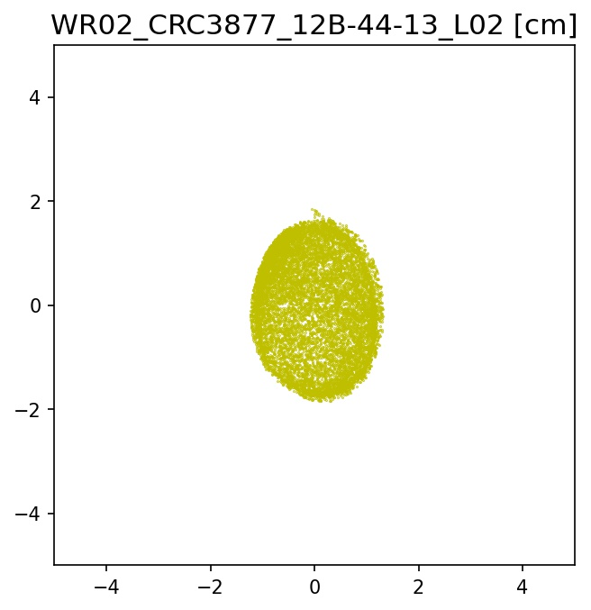
    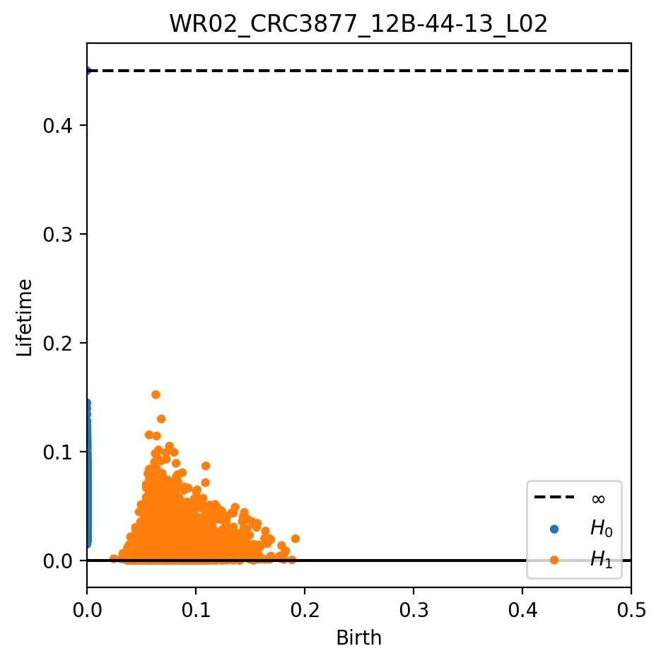
  </div>
</div>

Persistent Homology ( $H_0$ and $H_1$) computed with Ripser in `scikit-tda`.
---

### Quantify the distribution of oil glands using Persistent Homology

<div class="row">
  <div class="column" style="max-width:30%">
    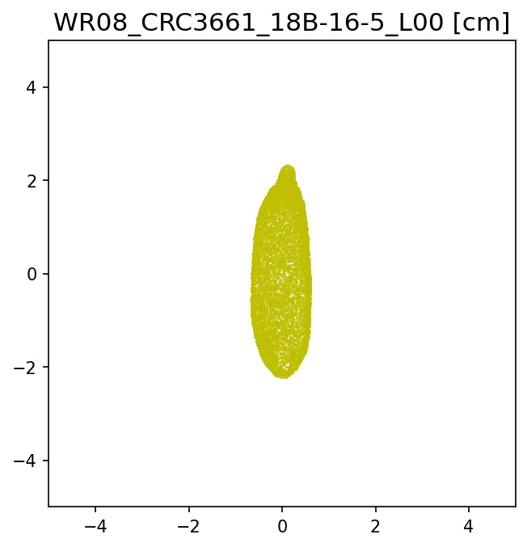
    
  </div>
  <div class="column" style="max-width:30%">
    
    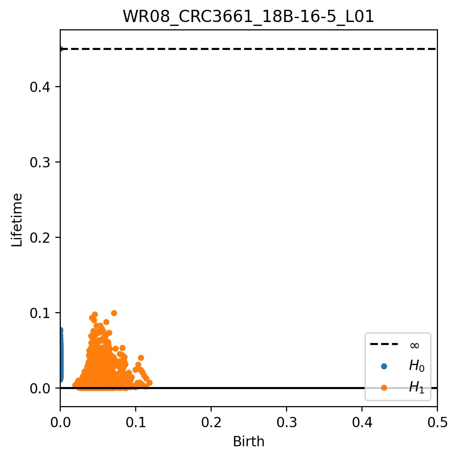
  </div>
  <div class="column" style="max-width:30%">
    
    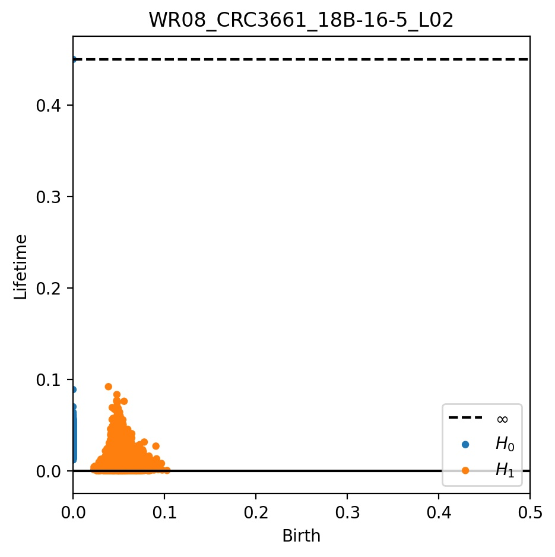
  </div>
</div>

Persistent Homology ( $H_0$ and $H_1$) computed with Ripser in `scikit-tda`.
