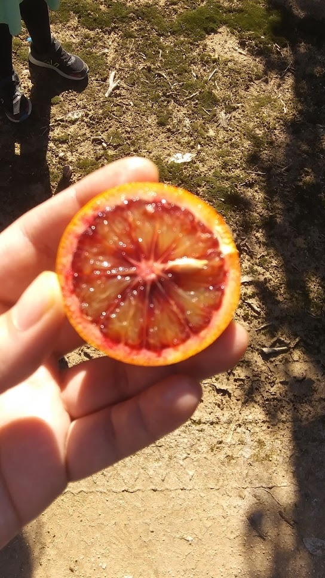
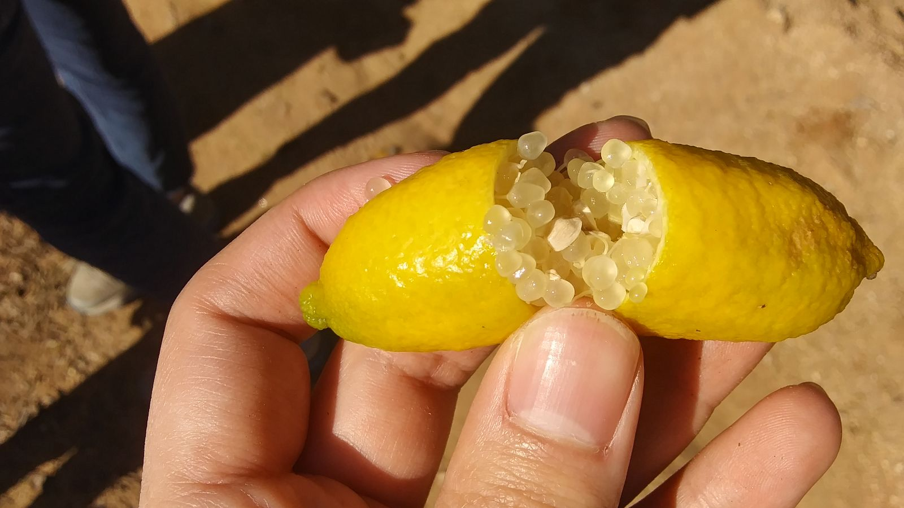
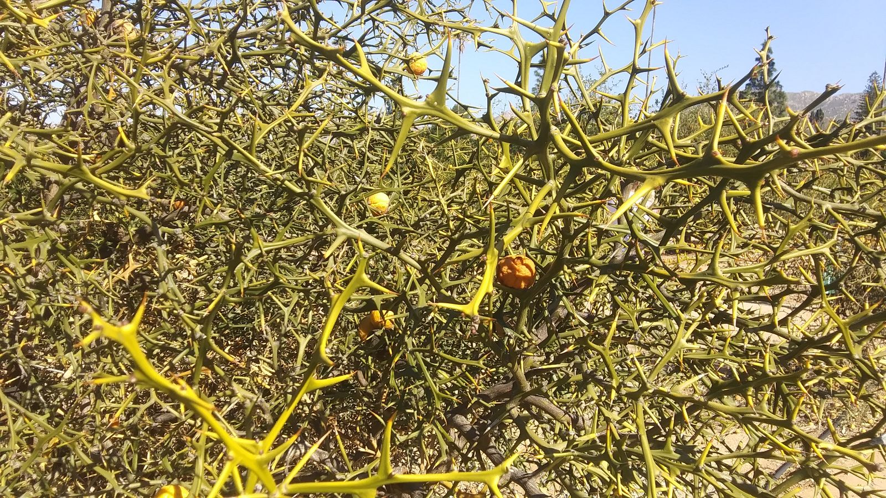
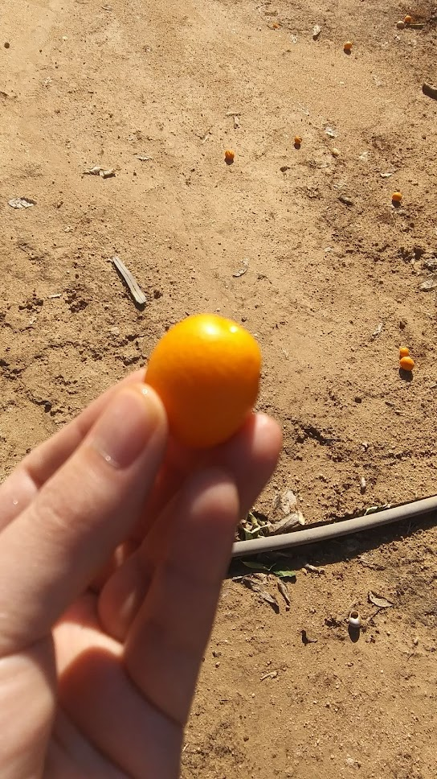
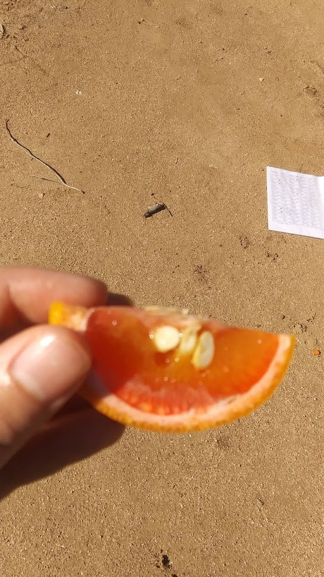

```{r setup, include=FALSE}
library(knitr)

# <!-- Copies an HTML dependency to a subdirectory of the given directory. The subdirectory name willbename-version(for example, "outputDir/jquery-1.11.0"). You may setoptions(htmltools.dir.version= FALSE)to suppress the version number in the subdirectory name. -->
options(htmltools.dir.version = FALSE)
knitr::opts_chunk$set(echo = FALSE)
knitr::opts_chunk$set(fig.align = 'center')
```

background-image: url(https://imagensemoldes.com.br/wp-content/uploads/2020/07/Imagem-Lego-PNG.png)
background-size: 300px
background-position: 100% 0%

## Los cítricos son como los legos


<p style="font-size: 8px; text-align: right; color: Grey;">Fuente: <a href="https://doi.org/10.1038/nature25447">Wu <em>et al.</em> (2018)</a></p>

---

class: inverse, middle, center

# Cuando la vida te da limones...

## No es parte de mi investigación

## (pero los cítricos son geniales en general)

```{r, out.width=400}
knitr::include_graphics("../crc_pics/south_coast_field_station_citron.jpg")
```

---

background-image: url("../crc_pics/palestine_sweet_lime.jpg")
background-size: 250px
background-position: 100% 0%


# Medicina occidental y nutrición

<div class="row">
  <div class="column" style="max-width:50%; font-size: 15px;">
    
  </div>
  <div class="column" style="max-width:50%; font-size: 15px;">
    
    
  </div>
</div>

---

background-image: url("../crc_pics/rubidoux_trifoliate.jpg")
background-size: 250px
background-position: 100% 0%

## El origen de la Mafia


<div class="row">
  <div class="column" style="max-width:50%; font-size: 15px;">
    
    
  </div>
  <div class="column" style="max-width:50%; font-size: 15px;">
    
  </div>
</div>

---

class: inverse, middle, center

# Ahora sí

## Algo de matemáticas

```{r, out.width=400}
knitr::include_graphics("../crc_pics/nagami_kumquat.jpg")
```

---

## Datos: Tomografías &rarr; Procesamiento de Imágenes

<div class="row">
  <div class="column" style="max-width:38%; color: Navy; font-size: 15px;">
    
    <p style="text-align: center;">Colaboración con UCR</p>
  </div>
  <div class="column" style="max-width:38%; color: Navy; font-size: 15px;">
    
    <p style="text-align: center;">Tomografías 3D</p>
  </div>
  <div class="column" style="max-width:23%; color: Navy; font-size: 15px;">
    
    <p style="text-align: center;">Original</p>
  </div>
</div>

<div class="row" style="margin: 0 auto;">
  <div class="column" style="max-width:20%; color: Navy; font-size: 15px;">
    
    <p style="text-align: center;">Centro</p>
  </div>
  <div class="column" style="max-width:20%; color: Navy; font-size: 15px;">
    
    <p style="text-align: center;">Carnaza</p>
  </div>
  <div class="column" style="max-width:20%; color: Navy; font-size: 15px;">
    
    <p style="text-align: center;">Rind</p>
  </div>
  <div class="column" style="max-width:20%; color: Navy; font-size: 15px;">
    
    <p style="text-align: center;">Cáscara</p>
  </div>
  <div class="column" style="max-width:20%; color: Navy; font-size: 15px;">
    
    <p style="text-align: center;"><strong>Glándulas</strong></p>
  </div>
</div>

---

## Glándulas de aceite y el desarrollo de la fruta

.pull-left[

<p style="font-size: 8px; text-align: right; color: Grey;"> Credits: <a href="https://www.boredpanda.com/life-cycles-pics/">BoredPanda</a></p>

Desarrollo de un limón
]

.pull-right[

]

---

background-image: url("../../citrus/figs/lambert_equal_area_N.gif")
background-size: 150px
background-position: 98% 1%


# Comparemos ~~peras y manzanas~~ limones y naranjas


```{r, out.width=800, fig.align='center'}
knitr::include_graphics(c('../../citrus/figs/SR01_CRC3289_12B-19-9_L00_lambproj.jpg',
                          '../../citrus/figs/SW03_CRC1241-B_12B-4-3_L00_lambproj.jpg'))
```

---

background-image: url("../../img/phd_institutional_logos.jpg")
background-size: 500px
background-position: 95% 5%

class: inverse

# ¡Muchas gracias!

<div class="row">
  <div class="column" style="max-width:15%; font-size: 15px;">
    
    <p style="text-align: center; color: White">Liz Munch (MSU)</p>
    
    <p style="text-align: center; color: White">Tim Ophelders (Utrecht)</p>
    
    <p style="text-align: center; color: White">Michelle Quigley<br>(PSU)</p>
  </div>
  <div class="column" style="max-width:15%; font-size: 15px;">
    
    <p style="text-align: center; color: White">Dan Chitwood<br>(MSU)</p>
    
  <p style="text-align: center; color: White">Danelle Seymour<br>(UC Riverside)</p>
  </div>
  <div class="column" style="max-width:65%; font-size: 24px; line-height:1.25; margin-left:auto;margin-right:auto;">
  <p style="text-align: center; color: White"><strong>Email</strong>: <span style="color: Yellow">eah4d@missouri.edu</span></p>
  <p style="text-align: center; color: White"><strong>Diapositivas</strong>: <span style="color: Yellow">ejamezquita.github.io</span></p>
  
  </div>
</div>

---

background-image: url(https://citrusvariety.ucr.edu/sites/default/files/IMG_8379_0.JPG)
background-size: 950px
background-position: 50% 0%

# Citrus Variety Collection @ UC Riverside

<div class="row">
  <div class="column" style="max-width:25%; font-size: 15px;">
    
    
    
  </div>
  <div class="column" style="max-width:25%; font-size: 15px;">
    
    
    
  </div>
  <div class="column" style="max-width:25%; font-size: 15px;">
    
    
    
  </div>
  <div class="column" style="max-width:25%; font-size: 15px;">
    
    
    
  </div>
</div>