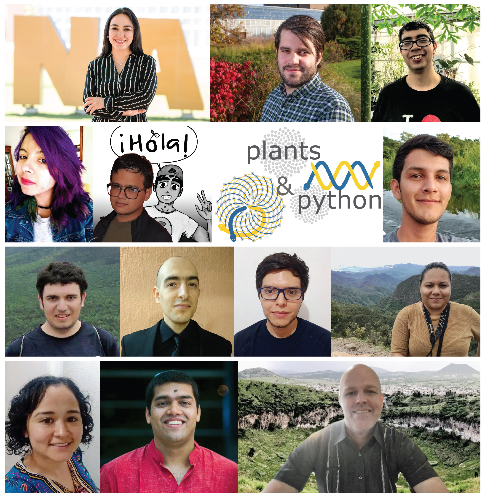
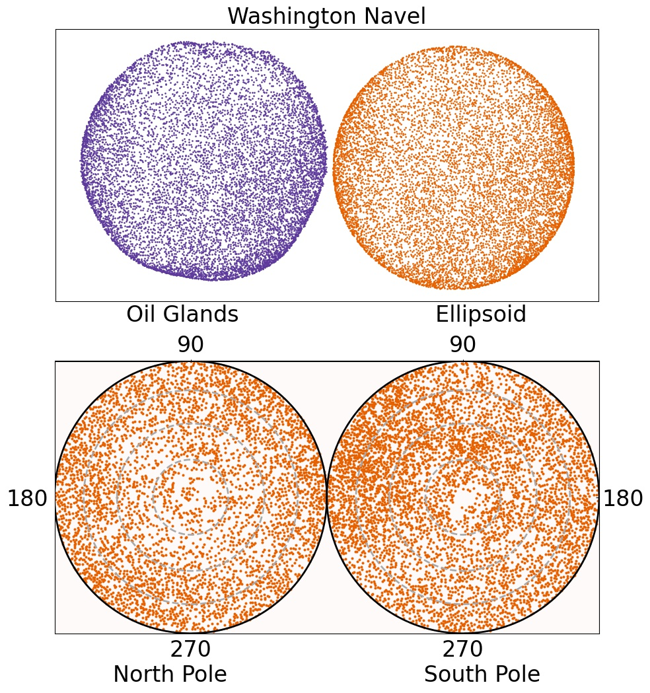
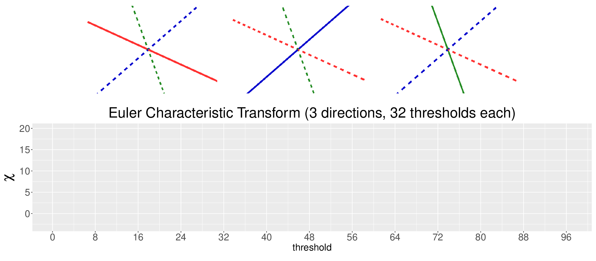
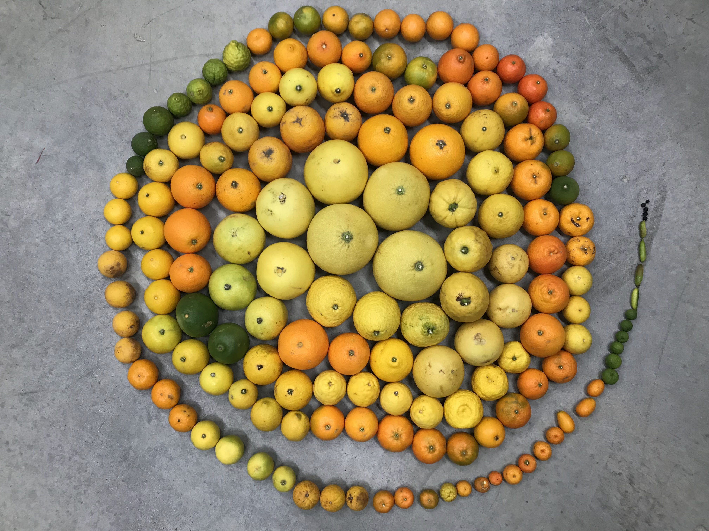

```{r setup, include=FALSE}
library(reticulate)
library(knitr)

options(htmltools.dir.version = FALSE)
knitr::opts_chunk$set(echo = FALSE)
knitr::opts_chunk$set(fig.align = 'center')
```

background-image: url("../../img/endlessforms.png")
background-size: 150px
background-position: 89% 7%

class: inverse

# Plant morphology

<div class="row">
  <div class="column" style="max-width:50%">
    <iframe width="375" height="210" src="https://www.youtube-nocookie.com/embed/oM9kAq0PBvw?controls=0" frameborder="0" allow="accelerometer; autoplay; encrypted-media; gyroscope; picture-in-picture" allowfullscreen></iframe>
    <iframe width="375" height="210" src="https://www.youtube-nocookie.com/embed/V39K58evWlU?controls=0" frameborder="0" allow="accelerometer; autoplay; encrypted-media; gyroscope; picture-in-picture" allowfullscreen></iframe>
  </div>
  <div class="column" style="max-width:50%">
    <iframe width="375" height="210" src="https://www.youtube-nocookie.com/embed/efF5PSvFQ2A?controls=0" frameborder="0" allow="accelerometer; autoplay; encrypted-media; gyroscope; picture-in-picture" allowfullscreen></iframe>
    <iframe width="375" height="210" src="https://www.youtube-nocookie.com/embed/qkOjHHuoUhA?controls=0" frameborder="0" allow="accelerometer; autoplay; encrypted-media; gyroscope; picture-in-picture" allowfullscreen></iframe>
  </div>
</div>
<p style="font-size: 24px; text-align: right; font-family: 'Yanone Kaffeesatz'">Check out more 3D X-ray CT scans at <a href="https://www.youtube.com/@endlessforms6756">youtube.com/@endlessforms6756</a></p>

---

background-image: url("https://gradschool.missouri.edu/wp-content/uploads/2019/02/MU_UnitSig_GraduateSchool_rgb_std_horiz.png")
background-size: 330px
background-position: 98% 2%

# From MX to MI to MO at MU

.left-column[

]

.right-column[
- 2013 - 2018 : Math @ at the Universidad de Guanajuato and CIMAT.

- 2016 - 2018 : Bachelor thesis: **Math + Archaeology**. Use TDA to quantify and classify the shape of pre-Columbian masks found in the Templo Mayor in Mexico City.

- 2018 - 2023 : CMSE @ MSU. **Came for the math. Stayed for the plants.**

- 2023 - ???? : PFFFD Postdoc Fellow @ Division of Plant Sciences at Mizzou in Columbia, MO
]

<p style="font-size:3px">&mdash;&mdash;&mdash;&mdash;&mdash;&mdash;&mdash;&mdash;&mdash;&mdash;&mdash;&mdash;&mdash;&mdash;&mdash;&mdash;&mdash;&mdash;&mdash;&mdash;&mdash;&mdash;&mdash;&mdash;&mdash;&mdash;&mdash;&mdash;&mdash;&mdash;&mdash;&mdash;&mdash;&mdash;&mdash;&mdash;&mdash;&mdash;&mdash;&mdash;&mdash;&mdash;&mdash;&mdash;&mdash;&mdash;&mdash;&mdash;&mdash;&mdash;&mdash;&mdash;&mdash;&mdash;&mdash;&mdash;&mdash;&mdash;&mdash;&mdash;&mdash;&mdash;&mdash;&mdash;&mdash;&mdash;&mdash;&mdash;&mdash;&mdash;&mdash;&mdash;&mdash;&mdash;&mdash;&mdash;&mdash;&mdash;&mdash;&mdash;&mdash;</p>

<div class="row">
  <div class="column" style="max-width:45%">
    
  </div>
  <div class="column" style="max-width:53%">
    
  </div>
</div>

---

background-image: url("../../cmse/figs/cmse logo file-01.svg")
background-size: 150px
background-position: 1% 50%

class: center

# My research: Crossing and merging bridges

<div class="row">
  <div class="column" style="width:15%">
  </div>
  <div class="column" style="max-width:15%">
    <a href="https://doi.org/10.1093/insilicoplants/diab033" target="_blank"></a>
  </div>
  <div class="column" style="max-width:18%">
    <a href="https://doi.org/10.1002/ppp3.10333" target="_blank"></a>
  </div>
  <div class="column" style="max-width:25%">
    
  </div>
  <div class="column" style="max-width:25%">
    
  </div>
</div>

<div class="row">
  <div class="column" style="width:15%">
  <p style="font-size:5px">&mdash;</p>
  </div>
  <div class="column" style="max-width:28%">
    <a href="https://plantsandpython.github.io/PlantsAndPython/00_Opening_page.html" target="_blank"></a>
  </div>
  <div class="column" style="max-width:50%">
    <a href="https://doi.org/10.1073/pnas.2217564120" target="_blank"></a>
  </div>
</div>

<div class="list" style="font-size: 10px; text-align: left;">
    <ul>
      <li>Marks <em>et al.</em> (2023) A critical analysis of plant science literature reveals ongoing inequities. DOI: <a href="https://doi.org/10.1073/pnas.2217564120" target="_blank">10.1101/2022.10.15.512190</a></li>
      <li><strong>A</strong> <em>et al.</em> (2022) The shape of aroma: measuring and modeling citrus oil gland distribution. DOI: <a href="https://doi.org/10.1002/ppp3.10333" target="_blank">10.1002/ppp3.10333</a></li>
      <li><strong>A</strong> <em>et al.</em> (2022) Genomics data analysis via spectral shape and topology. DOI: <a href="https://doi.org/10.48550/arXiv.2211.00938" target="_blank">10.48550/arXiv.2211.00938</a></li>
      <li>VanBuren<em>et al.</em> (2022) Teaching tools in plant biology. Plants and Python, coding from scratch in the plant sciences. DOI: <a href="https://doi.org/10.1093/plcell/koac187" target="_blank">10.1093/plcell/koac187</a>.</li>
      <li><strong>A</strong> <em>et al.</em> (2021) Measuring hidden phenotype: Quantifying the shape of barley seeds using the Euler Characteristic Transform. DOI: <a href="https://doi.org/10.1093/insilicoplants/diab033" target="_blank">10.1093/insilicoplants/diab033</a></li>
      <li><strong>A</strong> <em>et al.</em> (2020) The shape of things to come: Topological data analysis and biology, from molecules to organisms. DOI: <a href="https://doi.org/10.1002/dvdy.175" target="_blank">10.1002/dvdy.175</a></li>
    </ul>
</div>

---

# My main projects during my PhD

<div class="row" style="font-family: 'Yanone Kaffeesatz'; font-size:22px;">
  <div class="column" style="max-width:33%">
    <p style="line-height:0;text-align: center; font-size:28px">The shape of adaptability</p>
    </img>
    </img>
    <p style="text-align: center;">Topological Data Analysis</p>
    <p style="text-align: center;">Euler Characteristic Transform</p>
  </div>
  <div class="column" style="max-width:33%">
    <p style="line-height:0;font-size:28px;text-align: center;">The shape of development</p>
    </img>
    </img>
    <p style="text-align: center;">Ellipsoidal modeling</p>
    <p style="text-align: center;">Directional statistics</p>
  </div>
  <div class="column" style="max-width:33%">
    <p style="line-height:0;font-size:28px;text-align: center;">The shape of breeding</p>
    </img>
    </img>
    <p style="text-align: center;">Allometry of multiple tissues</p>
    <p style="text-align: center;">Convexity indices</p>
  </div>
</div>

---

class: inverse

## Evolution in real time &rarr; X-rays &rarr; Image Processing

<div class="row">
  <div class="column" style="max-width:41%; font-size: 15px;">
    
    <p style="text-align: center;">28 accessions around the world</p>
  </div>
  <div class="column" style="max-width:50%; font-size: 15px;">
    
    <p style="text-align: center;">58 generations in California</p>
  </div>
</div>

<div class="row">
  <div class="column" style="max-width:51%; font-size: 15px;">
    
    <p style="text-align: center;"> Proprietary X-Ray CT scan reconstruction </p>
  </div>
  <div class="column" style="max-width:17.5%; font-size: 15px;">
    
    <p style="text-align: center;"> 975 spikes </p>
  </div>
  <div class="column" style="max-width:20.5%; font-size: 15px;">
    
    <p style="text-align: center;"> 38,000 seeds </p>
  </div>
</div>

---

## The Euler Characteristic Curve (ECC)

```{r, out.width=650}
knitr::include_graphics("../../barley/figs/ecc_ver2.gif")
```

## The Euler Characteristic Transform (ECT)

```{r, out.width=650}

```

---

## The Euler Characteristic Curve (ECC)

```{r, out.width=650}
knitr::include_graphics("../../barley/figs/ecc_Z_32.png")
```

## The Euler Characteristic Transform (ECT)

```{r, out.width=650}
knitr::include_graphics("../../barley/figs/ect_ver2.gif")
```

---

# Quantify the shape of barley

**Goal:** Classify the **28** founding barley varieties solely by grain morphology information.

<style type="text/css">
.tg  {border-collapse:collapse;border-color:#93a1a1;border-spacing:0;margin:0px auto;}
.tg td{background-color:#fdf6e3;border-bottom-width:1px;border-color:#93a1a1;border-style:solid;border-top-width:1px;
  border-width:0px;color:#002b36;font-family:Arial, sans-serif;font-size:14px;overflow:hidden;padding:10px 5px;
  word-break:normal;}
.tg th{background-color:#657b83;border-bottom-width:1px;border-color:#93a1a1;border-style:solid;border-top-width:1px;
  border-width:0px;color:#fdf6e3;font-family:Arial, sans-serif;font-size:14px;font-weight:normal;overflow:hidden;
  padding:10px 5px;word-break:normal;}
.tg .tg-2bhk{background-color:#eee8d5;border-color:inherit;text-align:left;vertical-align:top}
.tg .tg-0pky{border-color:inherit;text-align:left;vertical-align:top}
.tg .tg-gyvr{background-color:#eee8d5;border-color:inherit;font-size:100%;text-align:left;vertical-align:top}
</style>
<table class="tg">
<thead>
  <tr>
    <th class="tg-0pky">Shape descriptors</th>
    <th class="tg-0pky">No. of descriptors</th>
    <th class="tg-0pky">F1</th>
  </tr>
</thead>
<tbody>
  <tr>
    <td class="tg-2bhk">Traditional</td>
    <td class="tg-2bhk">11</td>
    <td class="tg-2bhk">0.55 &plusmn; 0.019</td>
  </tr>
  <tr>
    <td class="tg-0pky">Topological</td>
    <td class="tg-0pky">12</td>
    <td class="tg-0pky">0.74 &plusmn; 0.016</td>
  </tr>
  <tr>
    <td class="tg-2bhk">Combined</td>
    <td class="tg-2bhk">23</td>
    <td class="tg-2bhk"><strong>0.86 &plusmn; 0.010</strong></td>
  </tr>
</tbody>
</table>

### What does topology actually measure?

.pull-left[
```{r, out.width=225}
knitr::include_graphics(c('../../barley/figs/discerning_directions.png'))#, '../figs/arrow_seed_09_0.gif'))
```
]

.pull-right[

]

---

class: inverse

## X-rays &rarr; Image Processing &rarr; Oil glands

<div class="row">
  <div class="column" style="max-width:37%; font-size: 15px;">
    
    <p style="text-align: center;">UCR Collaboration</p>
  </div>
  <div class="column" style="max-width:37%; font-size: 15px;">
    
    <p style="text-align: center;">3D X-Ray CT scan</p>
  </div>
  <div class="column" style="max-width:25%; font-size: 15px;">
    
    <p style="text-align: center;">Fruit development</p>
  </div>
</div>

<div class="row" style="font-size: 20px; font-family: 'Yanone Kaffeesatz'; margin: 0 auto;">
  <div class="column" style="max-width:20%;">
    
    <p style="text-align: center;"> Endocarp </p>
  </div>
  <div class="column" style="max-width:20%;">
    
    <p style="text-align: center; padding:5px 0;"> Rind </p>
  </div>
  <div class="column" style="max-width:20%;">
    
    <p style="text-align: center;"> Exocarp </p>
  </div>
  <div class="column" style="max-width:20%;">
    
    <p style="text-align: center;"> Oil glands</p>
  </div>
  <div class="column" style="max-width:20%;padding: 10px 0 0 20px;">
    <p>
      <li>53 different citrus species</li><br>
      <li>All fundamental lego blocks and several relatives and hybrids of interest</li><br>
      <li>166 individual fruits</li>
    </p>
  </div>
</div>

---

background-image: url("../../citrus/figs/lambert_equal_area_N.gif")
background-size: 150px
background-position: 98% 1%

class: middle

## Citrus modeling: Sour and sweet orange

```{r, out.width=800, fig.align='center'}
knitr::include_graphics(c('../../citrus/figs/SR01_CRC3289_12B-19-9_L00_lambproj.jpg',
                          '../../citrus/figs/SW03_CRC1241-B_12B-4-3_L00_lambproj.jpg'))
```

---

background-image: url("../../citrus/ellipsoids/GarciaPortugues_2013.png")
background-size: 150px
background-position: 95% 3%

# Spherical Kernel Density Estimators


- Oil glands of a papeda
- Red arrows indicate the most significant gradient values for the density function
- Concentration parameter $k$ is chosen to be optimal

---

class: inverse

# The wal(nu)tzing nutcracker!

<div class="row" style="font-family: 'Yanone Kaffeesatz'; margin: 0 auto; font-size:22px">
  <div class="column" style="max-width:25%;">
    
    <p style="text-align: center;">148 accessions</p>
  </div>
  <div class="column" style="max-width:42%;">
    
    <p style="text-align: center;">1301 walnuts scanned</p>
  </div>
  <div class="column" style="max-width:33%;">
    
    <p style="text-align: center;">Qualitative data for crackability</p>
  </div>
</div>

<div class="row" style="font-size: 22px; font-family: 'Yanone Kaffeesatz'; margin: 0 auto;">
  <div class="column" style="max-width:20%;">
    
    <p style="text-align: center; margin: 0.5ex;">Shell</p>
  </div>
  <div class="column" style="max-width:20%;">
    
    <p style="text-align: center;margin: 0.5ex; ">Air</p>
  </div>
  <div class="column" style="max-width:20%;">
    
    <p style="text-align: center;margin: 0.5ex; ">Packing tissue</p>
  </div>
  <div class="column" style="max-width:20%;">
    
    <p style="text-align: center;margin: 0.5ex;">Kernel</p>
  </div>
  <div class="column" style="max-width:20%; padding: 0 0 0 5px">
    <p style="margin:5px 0 0 0; text-align:left">
      &#9656;&ensp;Individuals separated manually<br>
      &#9656;&ensp;Tissues separated with watershed segmentation<br>
      &#9656;&ensp;38 traditional shape and size descriptors
    </p>
  </div>
</div>

---

## Allometry: $\;y = e^bV_N^m$ and correlations

Growth does **not** scale linearly but it follows a power law.

<div class="row" style="color: black; font-size: 20px; font-family: 'Yanone Kaffeesatz'; margin: 0 auto;">
  <div class="column" style="max-width:33%;">
    
    
    <p style="padding: 0 2ex 0 0;">Walnut changes dramatically after its diameter is larger than 1.6cm</p>
    <p style="margin: 1.1ex 0 0 0; padding: 0 2ex 0 0;">If nut volume increases by 2x, then kernel volume only increases by 1.8x</p>
    <p style="padding:0">There are biophysical constraints at play in walnut development</p>
  </div>
  <div class="column" style="max-width:66%;">
    
  </div>
</div>


---

## Correlation with traits of interest


---

class: inverse

## Other work

<div class="row" style="font-family: 'Yanone Kaffeesatz'; font-size:22px;">
  <div class="column" style="max-width:33%">
    <p style="text-align: center; font-size:28px">The shape of genomic profiles</p>
    </img>
    <p style="text-align: center;">Topological Data Analysis to analyze FPKM and RPKM profiles from patients</p>
    <p style="text-align: center;">Mapper to separate healthy from cancer</p>
  </div>
  <div class="column" style="max-width:33%">
    <p style="line-height:0;font-size:28px;text-align: center;">The shape of maize leaves</p>
    </img>
    </img>
    <p style="text-align: center;">Polynomial modeling</p>
  </div>
  <div class="column" style="max-width:33%">
    <p style="line-height:0;font-size:28px;text-align: center;">The shape of puzzles</p>
    </img>
    </img>
    <p style="text-align: center;">Betti curves to quantify cell patterns at the meristem</p>
  </div>
</div>


---


background-image: url("https://gradschool.missouri.edu/wp-content/uploads/2019/02/MU_UnitSig_GraduateSchool_rgb_std_horiz.png")
background-size: 330px
background-position: 98% 2%

## Future research at Mizzou

.pull-left[
The shape of maize roots

```{r, out.width=200}
knitr::include_graphics(c('../../psd/figs/Maiz_root_Dario.jpeg'))
```

The shape of dodder movement

```{r, out.width=300}
knitr::include_graphics(c('https://i.makeagif.com/media/11-28-2013/qmlphv.gif'))
```

]

.pull-right[
Dabbing into UAV imagery for sorghum high-throughput phenotyping


- David Mendoza Cozatl
- Robert Sharpe
- So-Yon Park
- Andrew Scaboo

]

---

background-image: url("../../tutorials/figs/plantspython22_01.png")
background-size: 225px
background-position: 99% 1%

# Plants & Python _a la_ Mizzou

.pull-left[


]

.pull-right[
- **Inspired by the current Plants & Python course @ MSU**

- Offered in hybrid format between MSU and UNAM

- **HRT 841**: Foundation in Computational and Plant Science

- **UNAM Temas Selectos**: Bioinformática y Minería de Datos con Python

- Freely available material in jupyter notebook format.

- Material in English and Spanish.
]


---

background-image: url("../../cmse/figs/institutional_logos.jpg")
background-size: 500px
background-position: 95% 1%

class: inverse

## Thank you!

<div class="row" style="margin-top: -25px;">
  <div class="column" style="max-width:17.5%; font-size: 13px;">
    
    <p style="text-align: center; color: White">Liz Munch<br>(MSU)</p>
    
    <p style="text-align: center; color: White">Tim Ophelders<br>(Utrecht)</p>
  </div>
  <div class="column" style="max-width:17.5%; font-size: 13px;">
    
    <p style="text-align: center; color: White">Dan Chitwood<br>(MSU)</p>
    
    <p style="text-align: center; color: White">Michelle Quigley<br>(MSU)</p>
    
    <p style="text-align: center; color: White">Pat Brown<br>(UC Davis)</p>
  </div>
  <div class="column" style="max-width:13%; font-size: 13px;">
  
  <p style="text-align: center; color: White">Dan Koenig<br>(UC Riverside)</p>
  
  <p style="text-align: center; color: White">Danelle Seymour<br>(UC Riverside)</p>
  
    <p style="text-align: center; color: White">Jacob Landis<br>(Cornell)</p>
  </div>
  <div class="column" style="width:10%; font-size: 24px;">
  </div>
  <div class="column" style="max-width:40%; font-size: 24px; line-height:1.25">
  <p style="text-align: center; color: White"><strong>Committee Members</strong></p>
  <p style="text-align: center; color: White; font-size: 18px;">Liz Munch<br>Dan Chitwood<br>José Perea<br>Addie Thompson</p>
  <p style="text-align: center; color: White"><strong>References</strong></p>
  <p style="color: White; font-size: 12px; text-align:left">
    <strong>A</strong> <em>et al.</em> (202?) The shape of walnuts, kernels, and domestication, in a nutshell. <em>In preparation</em>
  </p>
  <p style="color: White; font-size: 12px; text-align:left">
    <strong>A</strong> <em>et al.</em> (2022) The shape of aroma: measuring and modeling citrus oil gland distribution. <a href="https://doi.org/10.1002/ppp3.10333" target="_blank">DOI: 10.1002/ppp3.10333</a>
  </p>
  <p style="color: White; font-size: 12px; text-align:left">
    <strong>A</strong> <em>et al.</em> (2021) Measuring hidden phenotype: Quantifying the shape of barley seeds using the Euler Characteristic Transform. <a href="https://doi.org/10.1093/insilicoplants/diab033" target="_blank">DOI: 10.1093/insilicoplants/diab033</a>
  </p>
  <p style="color: White; font-size: 12px; text-align:left">
    <strong>A</strong> <em>et al.</em> (2020) The shape of things to come: Topological data analysis and biology, from molecules to organisms. <a href="https://doi.org/10.1002/dvdy.175" target="_blank">DOI: 10.1002/dvdy.175</a>
  </p>
    <p style="text-align: center; color: White; font-size:15px; line-height:1.1">Slides made in RStudio <a href="https://bookdown.org/yihui/rmarkdown/xaringan.html" target="_blank">xaringan</a>.</p>
  </div>
</div>
