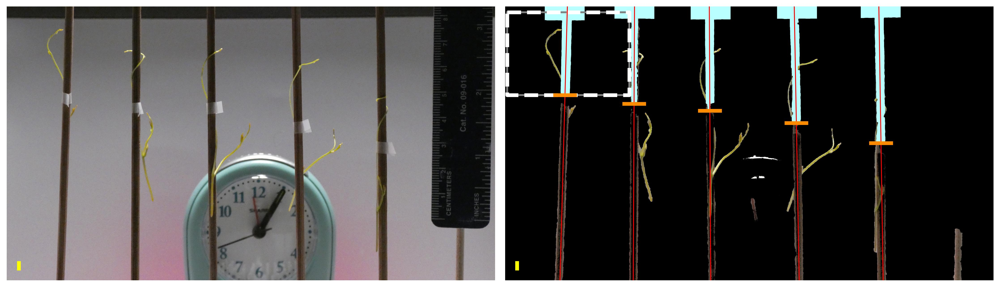
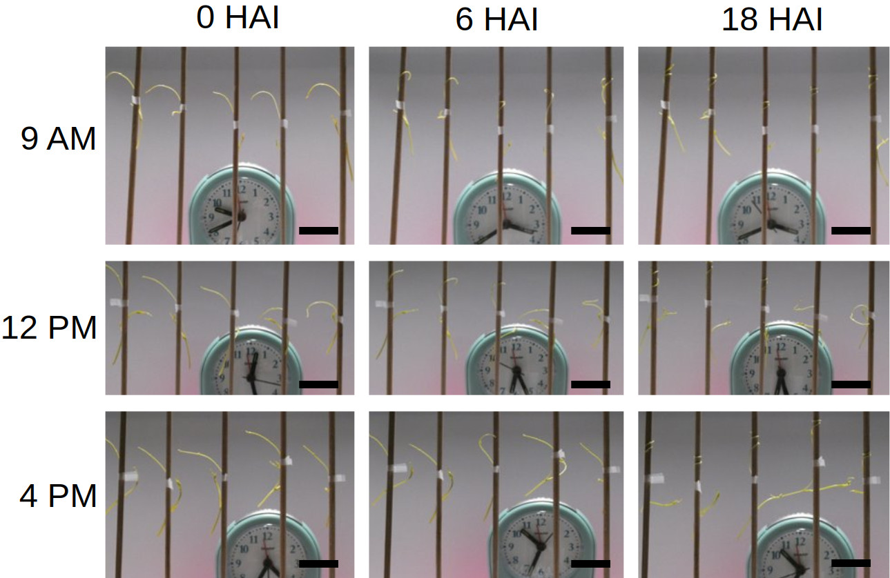
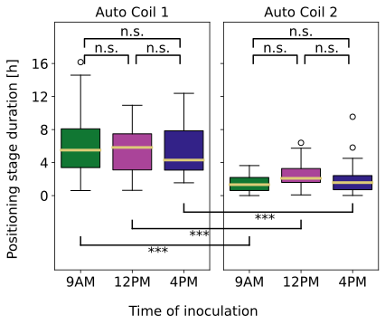
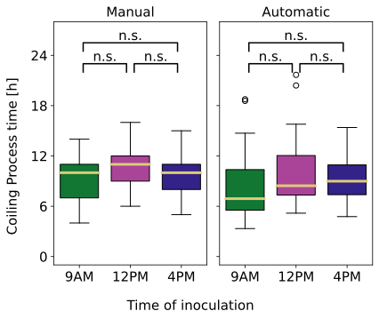
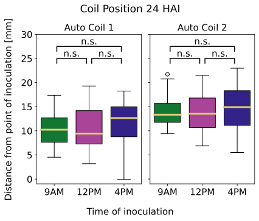

```{r setup, include=FALSE}
library(knitr)
library(magrittr)

options(htmltools.dir.version = FALSE)
knitr::opts_chunk$set(echo = FALSE)
knitr::opts_chunk$set(fig.align = 'center')
```

# _Cuscuta_ : The plant vampire diaries

```{r, out.width="700px"}
knitr::include_graphics(c('https://media.springernature.com/full/springer-static/image/art%3A10.1038%2Fs41467-018-04344-z/MediaObjects/41467_2018_4344_Fig1_HTML.jpg?as=webp'))
```
<p style="font-size: 10px; text-align: center; color: Grey;">Credits: <a href="https://doi.org/10.1038/s41467-018-04344-z">Vogel <em>et al.<em> (2018)</a></p>

---

# Haustoria: more intimate than Twilight


<p style="font-size: 10px; text-align: center; color: Grey;">Credits: <a href="https://doi.org/10.1093/jxb/erv482">Olsen <em>et al.<em> (2015)</a></p>

---

# Haustoria: more intimate than Twilight

```{r, out.width="650px"}
knitr::include_graphics(c('https://ars.els-cdn.com/content/image/1-s2.0-S1369526615000631-gr1_lrg.jpg'))
```

<p style="font-size: 10px; text-align: center; color: Grey;">Credits: <a href="https://doi.org/10.1016/j.pbi.2015.05.012">Kim and Westwood (2015)</a></p>


---

# Studying how a vampire plant wiggles

<video width="900" controls>
  <source src="../video/9am_Inc_Rep_3_redone.mp4" type="video/mp4">
</video>

- Study how _Cuscuta_ moves to ultimately stop it from attaching to crops in the first place.

---

class: inverse, center, middle

# Methods

## Image processing to automate video observation

---

# Image processing


- Mature _Cuscuta_ stem segments grown in greenhouse.
- Inoculated on skewers at 9AM, 12PM, and 4PM.
- 900 camera snapshots &times; 96 seconds = 24 hours.
- 5 skewers &times; 7 repetitions = 35 samples per time.

---

# Image processing


- Identify tapes (inoculation points)
- Identify skewers
- Linear approximation for the center of the skewers'

---

# Image processing


- Consider 5 subimages, one per skewer, from hereafter
- Discard the rest of the image

---

# Image processing



--


---

```{r include=FALSE, evaluate=FALSE}
slides_info <- tibble::tibble(first  = formatC(0:4, digits=0, format='d', flag='0'))

slides_text <- glue::glue_data(
  slides_info,
  "
  # Analyzing sub-images
  
  <div class=\"row\">
  <div class=\"column\" style=\"max-width:40%\">
    </img>
  </div>
  <div class=\"column\" style=\"max-width:30%\">
    </img>
  </div>
  <div class=\"column\" style=\"max-width:30%\">
    </img>
  </div>
  </div>
  "
)
```

`r slides_text %>% paste(collapse = "\n---\n")`

---

```{r include=FALSE, evaluate=FALSE}
slides_info <- tibble::tibble(first  = formatC(0:4, digits=1, format='d', flag='0'))

slides_text <- glue::glue_data(
  slides_info,
  "
  # Putting it all together
  
  <video width=\"900\" controls>
  <source src=\"../video/4pm_rep7_plant_{first}.mp4\" type=\"video/mp4\">
  </video>
  "
)
```

`r slides_text %>% paste(collapse = "\n---\n")`

---

# Automated phenotyping

```{r, out.width="700px"}
knitr::include_graphics(c('../figs/4pm_rep7_plant_02_posang.png',
                          '../figs/cuscuta_tracking.png'))
```

---

class: center, middle, inverse

# Results: The early dodder gets the host



---

# Differences: Coiling rate

```{r, out.width=500}
knitr::include_graphics(c('../figs/coil_percentage.svg'))
```

- The early dodder gets to coil

---

# Differences: Intiation and completion

```{r, out.width=575}
knitr::include_graphics(c('../figs/time_after_inoculation.svg',
                          '../figs/time_to_complete_coiling.svg'))
```


- Cuscuta at 4pm takes longer to get going and then to reach a stable position

---


background-image: url("../figs/time_btwn_initiation_and_completion.svg")
background-size: 350px
background-position: 50% 99%

# Some differences: angle and stabilization

<div class="row">
  <div class="column" style="max-width:50%">
    </img>
  </div>
  <div class="column" style="max-width:50%">
    </img>
  </div>
</div>

---

# No differences: process and position

<div class="row">
  <div class="column" style="max-width:50%">
    </img>
    </img>
  </div>
  <div class="column" style="max-width:50%">
    </img>
    </img>
  </div>
</div>

---

# No correlation beetween twisting and stabilization times


---

# Conclusions and future questions


- Cuscuta can tell time despite lacking photoreceptors.

- It prefers to act in the morning/early afternoon.

- Can we tease out more information out of the coiling angle?

- Overall, the automated image analysis criteria agreed with the main conclusions drawn from the manual observation criteria. 

- Our pipeline is ready to collect more data:

- Phenotype the wiggle itself under various environmental conditions?

---

background-image: url("../figs/acknowledgements.png")
background-size: 910px
background-position: 50% 50%

class: inverse

---

background-image: url("../../msucourses/figs/ipg_2024-3.jpg")
background-size: 910px
background-position: 50% 50%