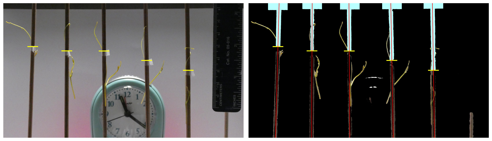
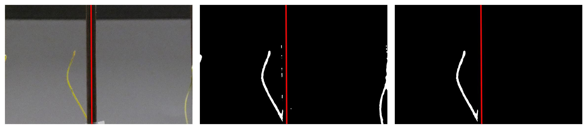
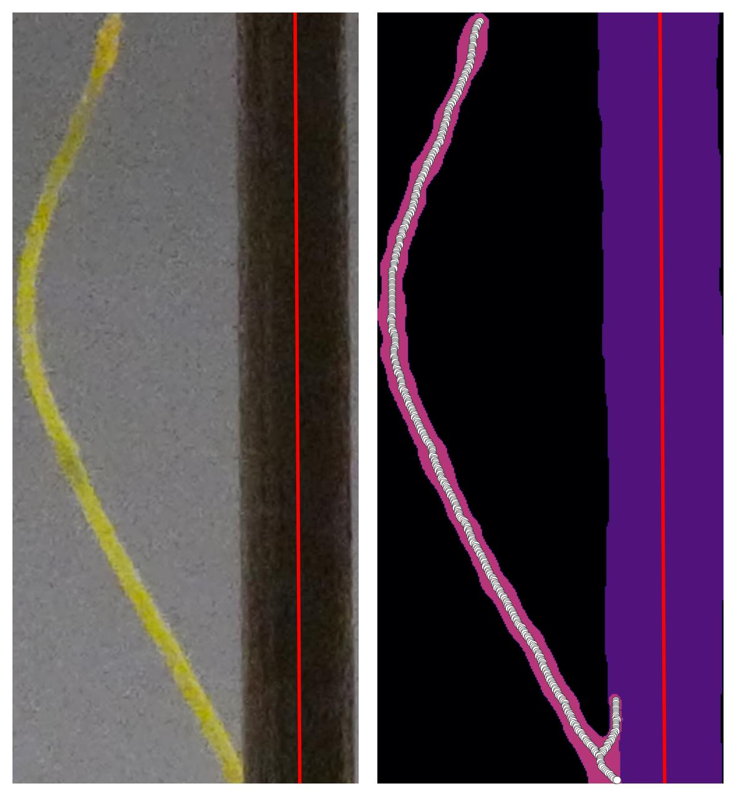
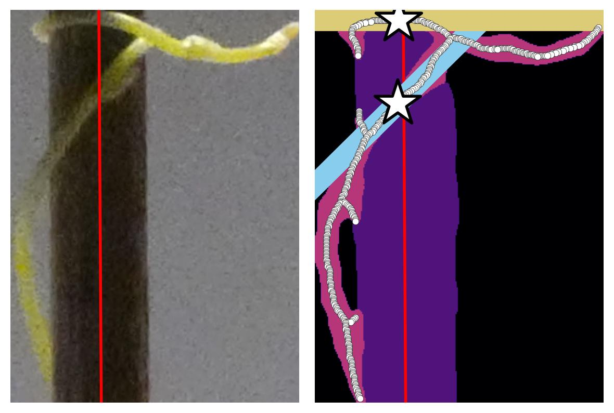
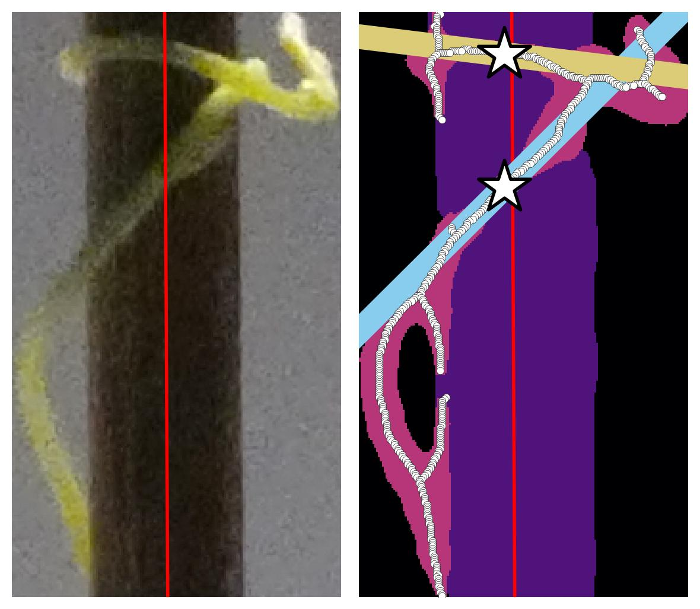

```{r setup, include=FALSE}
library(reticulate)
library(knitr)

options(htmltools.dir.version = FALSE)
knitr::opts_chunk$set(echo = FALSE)
knitr::opts_chunk$set(fig.align = 'center')
```

# A video says more than a 1000 images

<video width="900" controls>
  <source src="../video/4pm_rep7_plant_00.mp4" type="video/mp4">
</video>

---

# Image processing



--



---

## Isolating cuscuta to the best of our abilities

.pull-left[

]

.pull-right[


]

---

background-image: url("../figs/cuscuta_tracking.jpg")
background-size: 725px
background-position: 50% 92%

# Keep track of positions and angles