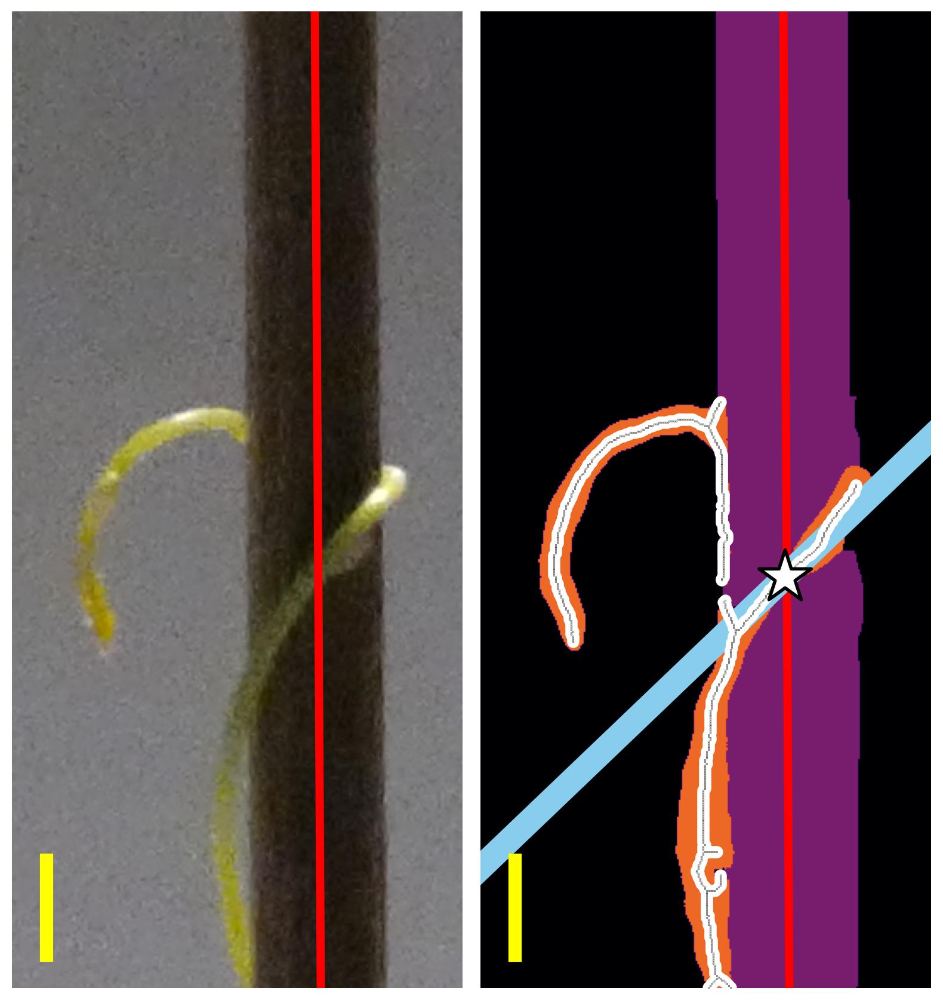

```{r setup, include=FALSE}
library(knitr)
library(magrittr)

options(htmltools.dir.version = FALSE)
knitr::opts_chunk$set(echo = FALSE)
knitr::opts_chunk$set(fig.align = 'center')
```

# Studying how a vampire plant wiggles

<video width="900" controls>
  <source src="../video/9am_Inc_Rep_3_redone.mp4" type="video/mp4">
</video>

---

# The early dodder gets the host


---

class: inverse, center, middle

# Image processing FTW

---

# Image processing


- Raw standstill image
- One every 96 seconds (900 images = 24 hours)

---

# Image processing


- Identify tapes (inoculation points)
- Identify skewers
- Linear approximation for the center of the skewers'

---

# Image processing


- Consider 5 subimages, one per skewer, from hereafter
- Discard the rest of the image

---

# Image processing


--


---

```{r include=FALSE, evaluate=FALSE}
slides_info <- tibble::tibble(first  = formatC(0:4, digits=0, format='d', flag='0'))

slides_text <- glue::glue_data(
  slides_info,
  "
  # Analyzing sub-images
  
  <div class=\"row\">
  <div class=\"column\" style=\"max-width:40%\">
    </img>
  </div>
  <div class=\"column\" style=\"max-width:30%\">
    </img>
  </div>
  <div class=\"column\" style=\"max-width:30%\">
    </img>
  </div>
  </div>
  "
)
```

`r slides_text %>% paste(collapse = "\n---\n")`

---

# Putting it all together

<video width="900" controls>
  <source src="../video/4pm_rep7_plant_00.mp4" type="video/mp4">
</video>

---

# Automated phenotyping


---

<div class="row">
  <div class="column" style="max-width:100%">
    </img>
  </div>
</div>

<div style="font-size:28px; font-family: 'Yanone Kaffeesatz'" class="row">
  <div class="column" style="width:25%;">
    <p style="text-align:center">
      </img>
      6.8 HAI
      </img>
      15.5 HAI
    </p>
  </div>
  <div class="column" style="width:25%;">
    <p style="text-align:center">
      </img>
      7.7 HAI
      </img>
      16.8 HAI
    </p>
  </div>
  <div class="column" style="width:25%;">
    <p style="text-align:center">
      </img>
      10.7 HAI
      </img>
      19.3 HAI
    </p>
  </div>
  <div class="column" style="width:25%;">
    <p style="text-align:center">
      </img>
      13.3 HAI
      </img>
      24.0 HAI
    </p>
  </div>
</div>

---


# Automated phenotyping


---

class: center, middle, inverse

# Results

---

# Manual vs Automated comparison


- 3 timepoints originally considered whenever doing manual video observation


- 6+ timepoints can be quickly extracted from the automated pipeline

---

# Differences: Coiling rate

```{r, out.width=500}
knitr::include_graphics(c('../figs/coil_percentage.svg'))
```

- The early dodder gets to coil

---

# Differences: Intiation and completion

```{r, out.width=575}
knitr::include_graphics(c('../figs/time_after_inoculation.svg',
                          '../figs/time_to_complete_coiling.svg'))
```


- Cuscuta at 4pm takes longer to get going and then to reach a stable position

---

# No differences: position

<div class="row">
  <div class="column" style="max-width:65%">
    </img>
  </div>
  <div class="column" style="max-width:35%">
    </img>
  </div>
</div>