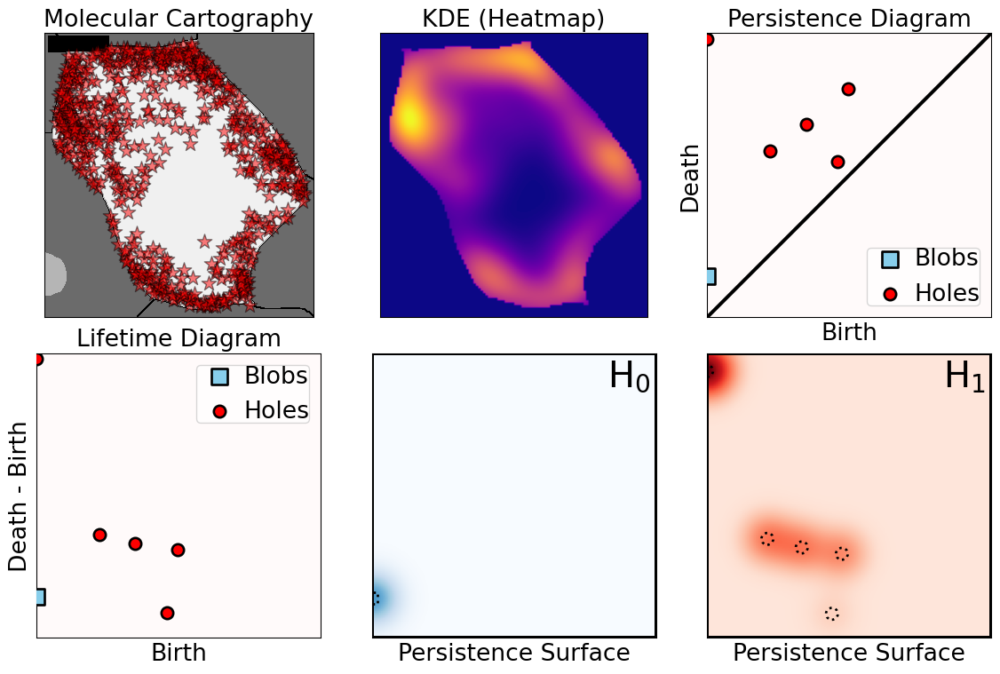
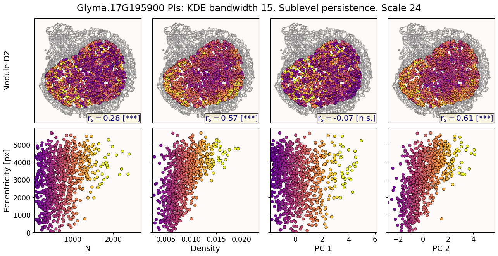

```{r setup, include=FALSE}
library(knitr)
library(magrittr)
genes = c('GLYMA_17G195900', 'GLYMA_05G092200')
options(htmltools.dir.version = FALSE)
knitr::opts_chunk$set(echo = FALSE)
knitr::opts_chunk$set(fig.align = 'center')
```

class: inverse, middle, center

# TDA applied to Plant Biology


---

background-image: url("../../barley/figs/seed.png")
background-size: 325px
background-position: 99% 99%

class: middle

# Roadmap for today

1. Biological context: genomics analysis to characterize cell type
   - Central dogma
   - mRNA localization

1. TDA to model mRNA localization patterns
   - Persistence images

1. Results
   - Modeling sub-cellular mRNA localizations

---

class: inverse, middle, center

# 1. A crash course in genomics analysis

## Characterizing cell types

---

# The Central Dogma and Gene Expression

.pull-left[


<p style="font-size: 10px; text-align: right; color: Grey;">Credits: <a href="https://doi.org/10.1242/bio.017178">Xu <em>et al.</em> (2016)</a></p>
]

.pull-right[

- Every cell in an organism has the same* DNA.
- But cells will only express a subset of genes depending on their type. 
- By knowing which genes are over/under-expressed, we can gather what makes each cell type unique and what are their exact functions.


]

---

# mRNA localization at a sub-cellular level

- Beyond gene expression counts: Spatial segregation and asymmetrical distribution of mRNA across the cytosol in the soybean nodule.

- Molecular Cartography&trade; data provided by the Libault Lab

.pull-left[

Infected soybean nodule cells. Glyma.05G092200 in green. Glyma.05G216000 in red.
]

.pull-right[

**Goals**: "How patterny is a pattern?"

- Quantify the spatial patterns followed by mRNA within individual cells.
- Mathematically model all observed mRNA sub-cellular distributions.
- *Use this mathematical model to differentiate cell types and genotypes.*

**Challenge**

- Develop a mathematical model that works for any cell size, orientation, shape, and dimension.

]

---

# Traditional model: Density of transcripts


But this characterization discards sub-cellular information!

---

# Same density, different patterns


- 97 genes (including 10 bacterial ones) &rarr; 2 genes
- 2938 cells &rarr; 918 infected ones.

**Subcellular transcript patterns &harr; spatial location of the cell within the nodule**

---

class: inverse, middle, center

# 2. Characterizing mRNA spatial patterns and distributions

## with Topological Data Analysis (TDA)

---


```{r include=FALSE, evaluate=FALSE}
slides_info <- tibble::tibble(first  = formatC(0:11, digits=1, format='d', flag='0'))

slides_text <- glue::glue_data(
  slides_info,
  "
  # Alternate model: Topological Data Analysis
  
  
  
  "
)
```

`r slides_text %>% paste(collapse = "\n---\n")`

---

# Mathematical motivation: stability

- [**Theorem (Cohen-Steiner, Edelsbrunner, Harer, 2007)**](https://doi.org/10.1007/s00454-006-1276-5): Given a nice enough topological space $\mathbb{X}$ and two nice enough filtration functions $f,g:\mathbb{X}\to\mathbb{R}$, then
$$d_B(\text{dgm}(f), \text{dgm}(g)) \leq \|f-g\|_\infty,$$

- where $d_B$ is the bottleneck distance.

- **Translation**: If the original complex wiggles a tiny bit, then the elements of its related persistence diagram will wiggle only a tiny bit as well.


## However

- Outside stable distances, it is hard to do anything interesting in the space of persistence diagrams.

- E.g.: there are no unique means!

- Hard to perform Machine Learning directly with persistence diagrams

---

# Rotate 45 degrees for ML ammenability



---

# TDA: From patterns to numbers


---

# Mathematical justifications

- **Definition:** Given two persistence diagrams $D_1, D_2$, for $1\leq p<\infty$, we define the *p-Wasserstein* distance between them as
$$W_p(D_1, D_2) := \inf_{\gamma:D_1\to D_2}\left(\sum_{u\in D_1} \left\| u-\gamma(u) \right\|_\infty^p\right)^{1/p},$$
where the infimum is over all possible bijections $\gamma: D_1\to D_2$.

- **Theorem [[Mileyko *et al* (2011)](https://doi.org/10.1088/0266-5611/27/12/124007)]:** For nice filtrations, the persistence diagrams are Wasserstein-stable under small perturbations of the data they summarize.

- **Theorem [[Adams *et al.* (2017)](http://jmlr.org/papers/v18/16-337.html)]:** The persistence image $I(D)$ of a persistence diagram $D$ with Gaussian distributions is stable with respect to the 1-Wasserstein distance between diagrams.

### If the overall shape/pattern is perturbed a little bit, then the resulting persistence images are perturbed only a little bit as well

---

class: inverse, middle, center

# 3. Results

## Do TDA for all cell-gene combinations

### One gene at a time vs multiple genes

---

# Focus on $H_1$ and $H_2$

```{r, out.width=500}
knitr::include_graphics(c('../figs/molecular_cartography_2x4.png'))
```

```{r, out.width=600}
knitr::include_graphics(c('../figs/persistence_images_2x4.png'))
```

---

background-image: url("../figs/bw25_scale32_-_PI_1_1_1_H1+2_cell_sample.png")
background-size: 620px
background-position: 75% 99%

# PCA on all topological descriptors

```{r, out.width=350, fig.align='left'}
knitr::include_graphics(c('../figs/bw25_both_scale16_-_PI_1_1_1_pca_H1+2_gridded.png'))
```

---

background-image: url("../figs/bw25_scale32_-_PI_1_1_1_H1+2_kde_sample.png")
background-size: 620px
background-position: 99% 50%

.left-column[

### PC 1
- Related to the number of distinct hotspots
- Correlated to transcript number and cell size

### PC 2
- Related to the heterogeneity of hotspots
- Correlated to transcript density

]

---

# Connecting PC 02 to the biological context



- Senescent cells exhibit a distinct transcriptomic spatial pattern compared to the rest of population.
- Loss of mRNA localization may be a lesser known contributor to cell senescence.

---

# We define a morphospace of transcriptomic patterns


# We then work "backward"

---

class: bottom

background-image: url("../figs/scale32_-_PI_1_1_1_H1+2_synthetic_30_clusters.jpg")
background-size: 900px
background-position: 50% 1%

```{r, out.width=600}
knitr::include_graphics(c('../figs/scale32_-_PI_1_1_1_H1+2_synthetic_pca_30_clusters.jpg'))
```

---

class: bottom

background-image: url("../figs/scale32_-_PI_1_1_1_H1+2_synthetic_varclusters.jpg")
background-size: 900px
background-position: 50% 1%

```{r, out.width=600}
knitr::include_graphics(c('../figs/scale32_-_PI_1_1_1_H1+2_synthetic_pca_varclusters.jpg'))
```

---

# Discussion and future directions

**Biologically speaking**

- Senescent cells exhibit a distinct transcriptomic spatial pattern compared to the rest.
- Loss of mRNA localization may be a lesser known contributor to cell senescence.
- *How does the **morphospace of patterns** change if we take into account more genes, more cell types, more tissues, and more mutants?*

**Mathematically speaking**

- Topological Data Analysis offers a robust way to encode the shape of patterns.
- Robust to differences in scale, underlying boundaries, or orientation.
- *Be much more **systematic** to generate and evaluate synthetic spatial patterns*


```{r, out.width=550}
knitr::include_graphics(c('../figs/D2_GLYMA_05G092200_z_kde_pd_suplevel_by_both_00512.jpg'))
```


---

# Software used

.pull-left[
- All the work has been done in python with mostly standard libries (`numpy`, `scikit-learn`, `matplotlib`, `pandas`, etc.)

- KDEs computed efficiently with [`KDEpy`](https://kdepy.readthedocs.io/en/latest/)

- Sublevel set filtration of images and persistence diagrams done with [`gudhi`](https://gudhi.inria.fr/)


]

.pull-right[
- Persistence Images computed with [`persim`](https://persim.scikit-tda.org/en/latest/)


]

---

class: inverse

# Thank you!

<div class="row">
  <div class="column" style="max-width:60%; font-size: 15px;">
    
  </div>
  <div class="column" style="max-width:40%; font-size: 24px; line-height:1.25">
  <p style="text-align: center;"><strong>Contact and slides:</strong></p>
  <p style="text-align: center;color:Blue">eah4d@missouri.edu</p>
  <p style="text-align: center;color:Blue">ejamezquita.github.io</p>
  </div>
</div>

<div class="row">
  <div class="column" style="max-width:35%; font-size: 20px;">
  <p style="font-size: 25px; text-align: center;"> Libault Lab (MU) </p>
    <ul>
      <li><strong>Marc Libault</strong></li>
      <li><strong>Sandra Thibivillers</strong></li>
      <li>Hengping Xu</li>
      <li>Sahand Amini</li>
      <li>Hong Fu</li>
      <li><strong>Sutton Tennant</strong></li>
      <li>Md Sabbir Hossain</li>
    <ul>
  </div>
  <div class="column" style="max-width:65%; font-size: 20px;">
  <p style="font-size: 25px; text-align: center;"> With help from:</p>
    <ul>
      <li>Sai Subash (Nebraska-Lincoln)</li>
      <li>Benjamin Smith (UC Berkeley)</li>
      <li>Sergio Cervantes-Perez (Arizona)</li>
      <li>Samik Bhattacharya (Resolve Biosciences)</li>
      <li>Jasper Kläver (Resolve Biosciences)</li>
    <ul>
  </div>
</div>

Manuscript under review