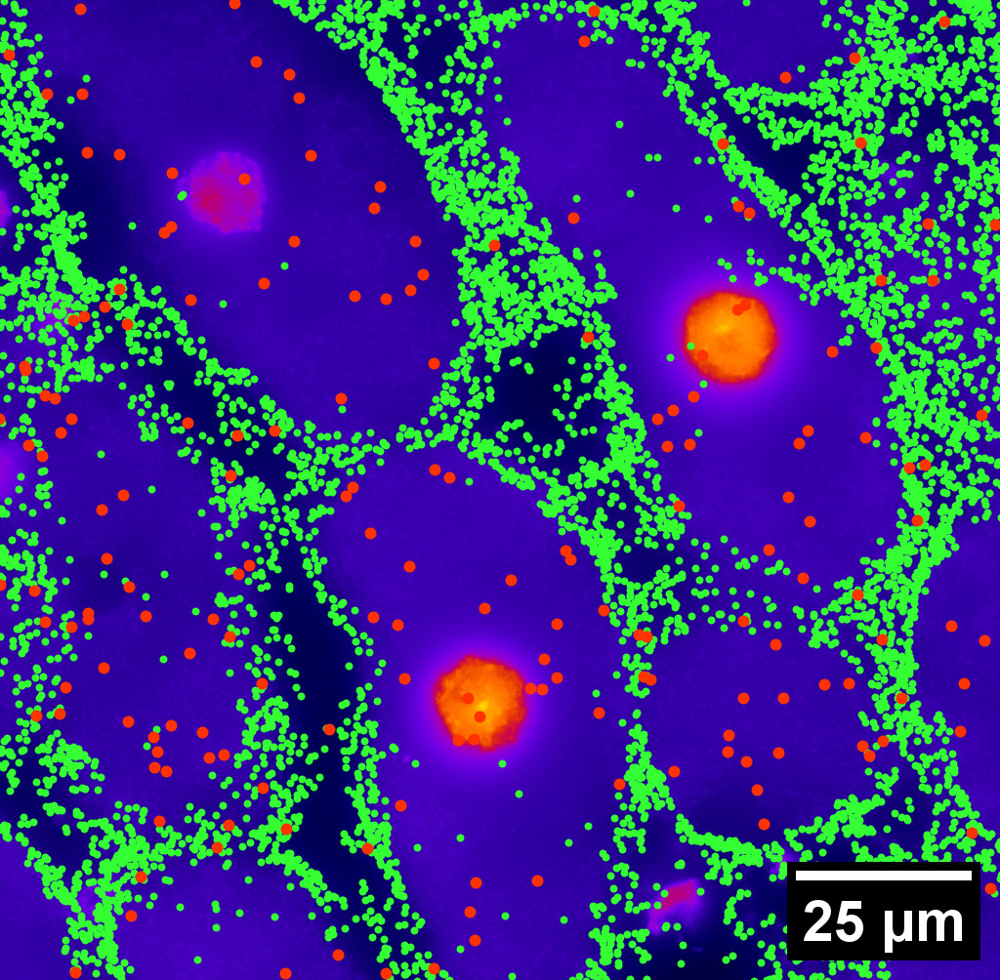

```{r setup, include=FALSE}
library(knitr)
library(magrittr)
genes = c('GLYMA_17G195900', 'GLYMA_05G092200')
options(htmltools.dir.version = FALSE)
knitr::opts_chunk$set(echo = FALSE)
knitr::opts_chunk$set(fig.align = 'center')
```

# mRNA localization FTW

- **Another regulational mechanism**: Spatial segregation and asymmetrical distribution of mRNA.

- Observed various spatial patterns across animal and plant species.

.pull-left[

Infected soybean nodule cells. Glyma.05G092200 in green. Glyma.05G216000 in red.
]

.pull-right[

- Energetically more efficient to transport mRNA than a whole protein

- Efficient protein complex assembly

- Prevent proteins from reaching the wrong cellular compartment

- Subcellular localization influences proteome architecture and adaptation

- mRNA can exert fuctions beyond the protein they encode
]

---

# Grand goal with Molecular Cartography&trade;


- 97 genes (including 10 bacterial ones) &rarr; 2 genes
- 2938 cells &rarr; 918 infected ones.

**Subcellular transcript patterns &harr; spatial location of the cell within the nodule**

---

# Traditional model: Density of transcripts


But these characterization discard subcellular information!

---

class: inverse, middle, center

# Alternate model: Topological Data Analysis


---

```{r include=FALSE, evaluate=FALSE}
slides_info <- tibble::tibble(first  = formatC(0:11, digits=1, format='d', flag='0'))

slides_text <- glue::glue_data(
  slides_info,
  "
  # TDA: Keep track of blobs and holes
  
  
  
  "
)
```

`r slides_text %>% paste(collapse = "\n---\n")`

---

background-image: url("../figs/bw25_scale32_-_PI_1_1_1_H1+2_cell_sample.png")
background-size: 620px
background-position: 75% 99%

# PCA on all topological descriptors

```{r, out.width=350, fig.align='left'}
knitr::include_graphics(c('../figs/bw25_both_scale16_-_PI_1_1_1_pca_H1+2_gridded.png'))
```

---

background-image: url("../figs/bw25_scale32_-_PI_1_1_1_H1+2_kde_sample.png")
background-size: 620px
background-position: 75% 99%

# Show me

```{r, out.width=350, fig.align='left'}
knitr::include_graphics(c('../figs/bw25_both_scale16_-_PI_1_1_1_pca_H1+2_gridded.png'))
```

---

# Connecting PC 02 to the biological context


- Senescent cells exhibit a distinct transcriptomic spatial pattern compared to the rest of population.
- Loss of mRNA localization may be a lesser known contributor to cell senescence.

---

# We define a morphospace of transcriptomic patterns


---

class: bottom

background-image: url("../figs/scale32_-_PI_1_1_1_H1+2_synthetic_30_clusters.jpg")
background-size: 900px
background-position: 50% 1%

# Working "backward"

--

```{r, out.width=600}
knitr::include_graphics(c('../figs/scale32_-_PI_1_1_1_H1+2_synthetic_pca_30_clusters.jpg'))
```

---

class: bottom

background-image: url("../figs/scale32_-_PI_1_1_1_H1+2_synthetic_varclusters.jpg")
background-size: 900px
background-position: 50% 1%

# Working "backward"

--

```{r, out.width=600}
knitr::include_graphics(c('../figs/scale32_-_PI_1_1_1_H1+2_synthetic_pca_varclusters.jpg'))
```

---

# Discussion

**Biologically speaking**

- Senescent cells exhibit a distinct transcriptomic spatial pattern compared to the rest of population.
- Loss of mRNA localization may be a lesser known contributor to cell senescence.

**Mathematically speaking**

- Topological Data Analysis offers a robust way to encode the *shape of patterns*
- Robust to differences in scale, underlying boundaries, or orientation
- Adaptable to other patterns: Canopy patterns, Cover crop patterns, Species spatial distributions?


---

class: inverse

# Thank you!

<div class="row">
  <div class="column" style="max-width:60%; font-size: 15px;">
    
  </div>
  <div class="column" style="max-width:40%; font-size: 24px; line-height:1.25">
  <p style="text-align: center;"><strong>Contact and slides:</strong></p>
  <p style="text-align: center;color:Blue">eah4d@missouri.edu</p>
  <p style="text-align: center;color:Blue">ejamezquita.github.io</p>
  </div>
</div>

<div class="row">
  <div class="column" style="max-width:35%; font-size: 20px;">
  <p style="font-size: 25px; text-align: center;"> Libault Lab (MU) </p>
    <ul>
      <li><strong>Marc Libault</strong></li>
      <li><strong>Sandra Thibivillers</strong></li>
      <li>Hengping Xu</li>
      <li>Sahand Amini</li>
      <li>Hong Fu</li>
      <li><strong>Sutton Tennant</strong></li>
      <li>Md Sabbir Hossain</li>
    <ul>
  </div>
  <div class="column" style="max-width:65%; font-size: 20px;">
  <p style="font-size: 25px; text-align: center;"> With help from:</p>
    <ul>
      <li>Sai Subash (Nebraska-Lincoln)</li>
      <li>Benjamin Smith (UC Berkeley)</li>
      <li>Samik Bhattacharya (Resolve Biosciences)</li>
      <li>Jasper Kläver (Resolve Biosciences)</li>
    <ul>
  </div>
</div>

---

# Software used

.pull-left[
- All the work has been done in python with mostly standard libries (`numpy`, `scikit-learn`, `matplotlib`, `pandas`, etc.)

- KDEs computed efficiently with [`KDEpy`](https://kdepy.readthedocs.io/en/latest/)

- Sublevel set filtration of images and persistence diagrams done with [`gudhi`](https://gudhi.inria.fr/)


]

.pull-right[
- Persistence Images computed with [`persim`](https://persim.scikit-tda.org/en/latest/)


]

---

# Second model: Peripherality


---

# This characterization has some issues

```{r, out.width=600}
knitr::include_graphics(c('../figs/peripherality_nodule_spatial.png', '../figs/peripherality_eccentricity_spatial.png'))
```

---

# Rotate 45 degrees for ML ammenability


---

# From patterns to numbers


---

# We actually work with 3D data

- We keep track of blobs $H_0$, holes $H_1$, and voids $H_2$


<p style="font-size: 10px; text-align: right; color: Grey;"> Credits: <a href="https://commons.wikimedia.org/wiki/File:Earth_Internal_Structure.svg">Wikipedia</a></p>


---

# Mathematical justifications

- **Definition:** Given two persistence diagrams $D_1, D_2$, for $1\leq p<\infty$, we define the *p-Wasserstein* distance between them as
$$W_p(D_1, D_2) := \inf_{\gamma:D_1\to D_2}\left(\sum_{u\in D_1} \left\| u-\gamma(u) \right\|_\infty^p\right)^{1/p},$$
where the infimum is over all possible bijections $\gamma: D_1\to D_2$.

- **Theorem [[Mileyko *et al* (2011)](https://doi.org/10.1088/0266-5611/27/12/124007)]:** For nice filtrations, the persistence diagrams are Wasserstein-stable under small perturbations of the data they summarize.

- **Theorem [[Adams *et al.* (2017)](http://jmlr.org/papers/v18/16-337.html)]:** The persistence image $I(D)$ of a persistence diagram $D$ with Gaussian distributions is stable with respect to the 1-Wasserstein distance between diagrams.

### If the overall shape/pattern is perturbed a little bit, then the resulting persistence images are perturbed only a little bit as well

---

# Do TDA for all cell-gene combinations

```{r, out.width=500}
knitr::include_graphics(c('../figs/molecular_cartography_2x4.png'))
```

```{r, out.width=600}
knitr::include_graphics(c('../figs/persistence_images_2x4.png'))
```

---


background-image: url("../figs/scale32_-_PI_1_1_1_H1+2_density13_pc02.png")
background-size: 600px
background-position: 50% 99%

# The PCs are capturing other information
