```{r setup, include=FALSE}
library(knitr)
library(magrittr)

options(htmltools.dir.version = FALSE)
knitr::opts_chunk$set(echo = FALSE)
knitr::opts_chunk$set(fig.align = 'center')
```

background-image: url("../figs/D2_molecular_cartography.jpg")
background-size: 600px
background-position: 99% 99%

# Molecular cartography

.left-column[
- 3.8M individual transcripts
- Coordinates $(x, y, z)$ for each of them
- Transcripts corresponding to 97 genes
- ~2400 cells in the nodule cross section
- Cross-sections from nodule and root soybean tissues
]

---

# Variety of transcript distribution

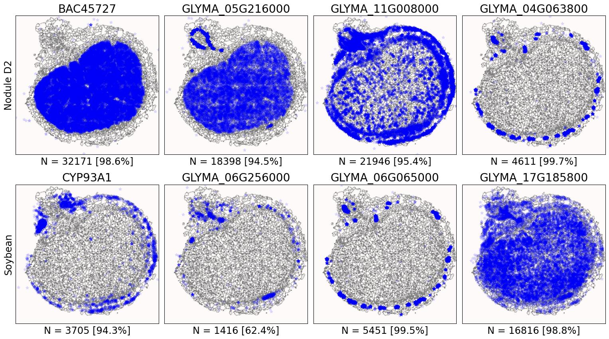

- Different cells, different shapes and sizes
- Beyond density: How to quantify and compare patterns?
- Patterns across the whole cross section? Patterns within cells?

---

class: inverse, middle, center

# Kernel Density Estimators (KDEs)

## The continuous version of a histogram

### Think of heatmaps

---

# KDE: Estimate an unknown probability density function


<p style="font-size: 8px; text-align: right; color: Grey;"> Credits: <a href="https://www.statsmodels.org/dev/examples/notebooks/generated/kernel_density.html">Statsmodels</a></p>

- Green is unknown
- We only know the samples (red points)

---

<p align="center">
<iframe width="800" height="600" src="https://mathisonian.github.io/kde/" title="KDEs">
</iframe>
</p>
<p style="font-size: 10px; text-align: right; color: Grey;">Credits: Matthew Conlen. <a href="https://mathisonian.github.io/kde/">Source</a></p>

---

# Caveat: Reflect the borders

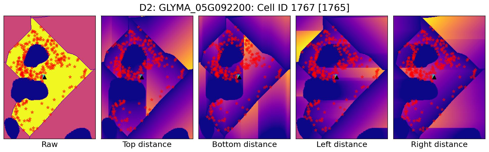

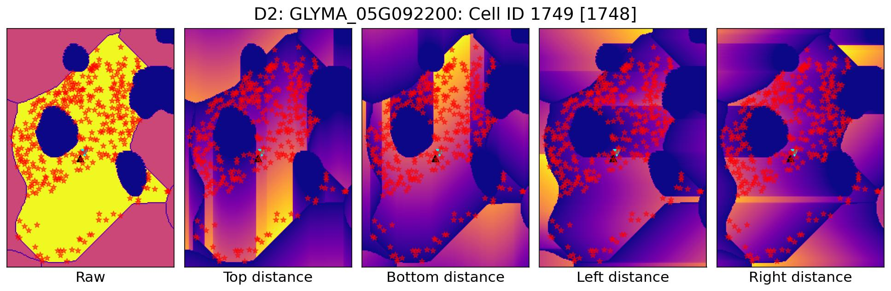

---

# KDEs: One per cell


```{r, out.width="700px"}
knitr::include_graphics(c('../figs/D2_GLYMA_05G092200_1767_1765_kde_correction.jpg',
                          '../figs/D2_GLYMA_05G092200_1749_1748_kde_correction.jpg'))
```

---

class: inverse, middle, center

# Quantify the shape of these heatmaps

## Detour into Topological Data Analysis (TDA) and statistical learning

---

```{r, out.width="825px", out.height="650px"}
knitr::include_graphics("https://geometrica.saclay.inria.fr/team/Fred.Chazal/Sophia2017/slidesSophia2017/PersistenceForTDA2.pdf")
```

---

# Bottleneck distance to measure topological similarity

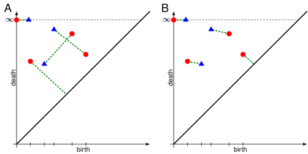

For persistence diagrams $D_1,D_2$, their bottleneck distance is

$$d_B(D_1,D_2) = \inf_{\gamma\in\Gamma}\sup_{p\in D_1}\left\|p - \gamma(p)\right\|_\infty$$

for $\Gamma$ the set of all bijections $\gamma:D_1\to D_2$.

---

# Multidimensional scaling (MDS)

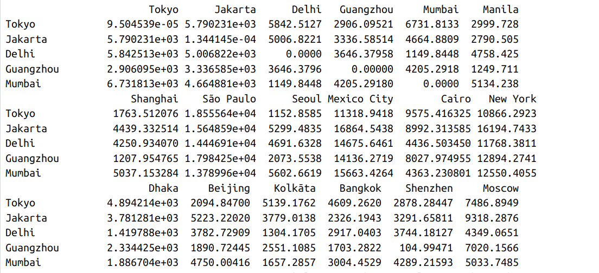

- Another form of dimension reduction

- We only have pairwise distances/similarities between points

- Optimization problem: We want to project them to 2D such that similar points remain close

---

background-image: url("../../demat/figs/mds_reconstructed.svg")
background-size: 800px
background-position: 50% 70%

# Using geodesic distances

---

# General TDA pipeline

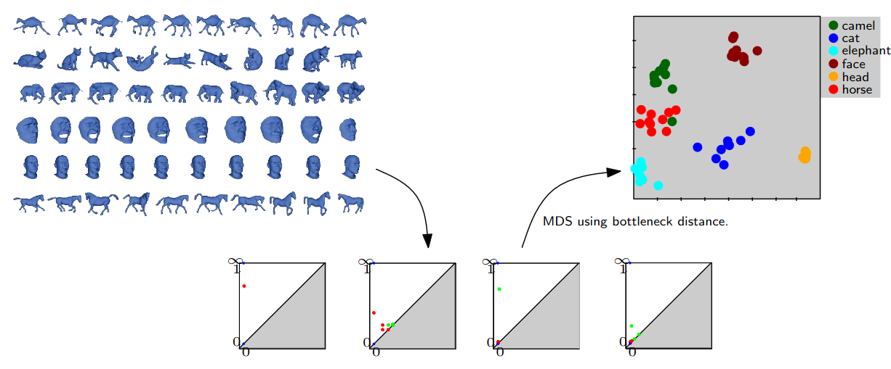
<p style="font-size: 10px; text-align: right; color: Grey;">Credits: Frédéric Chazal. <a href="https://geometrica.saclay.inria.fr/team/Fred.Chazal/Sophia2017/slidesSophia2017/PersistenceForTDA2.pdf">Source</a></p>

- Encode shapes and patterns as persistence diagrams via sublevel set persistence

- Similar shapes &rarr; Similar topological signatures &rarr; Similar points in MDS

---

class: inverse, middle, center

# Bringing it back to the transcriptome

## 1. Determine transcript distribution pattern via KDE

## 2. Use TDA to encode the shape of the pattern

## 3. Compute pairwise distances between patterns

## 4. Assess those distances in 2D
 

---

# Back to the transcriptome

.pull-left[
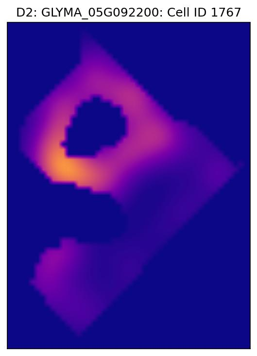

]

.pull-right[

- Normalize the KDE accordingly (per cell)

- Extract the topological shape signature of every KDE via sublevel set persistence

- Compare the similarities of these topological shape signatures


- &#8593;&#8593; ¡Remember: 2D this time! &#8593;&#8593;
]

---

background-image: url("../figs/D2_GLYMA_05G092200_1767_1765_sublevel_persistence_diagram.svg")
background-size: 305px
background-position: 10% 95%

# Sublevel set persistence

.pull-left[
```
[(1, (0.0, 192.0)),
 (1, (11.0, 72.0)),
 (1, (93.0, 106.0)),
 (1, (25.0, 36.0)),
 (1, (95.0, 105.0)),
 (1, (8.0, 13.0)),
 (1, (14.0, 18.0)),
 (0, (0.0, inf)),
 (0, (0.0, 76.0))]
 ```
]

.pull-right[
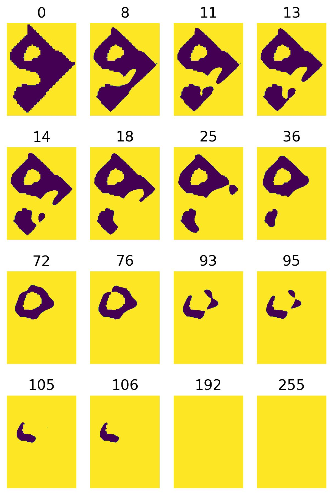
]

---

background-image: url("../figs/D2_GLYMA_05G092200_1749_1748_sublevel_persistence_diagram.svg")
background-size: 305px
background-position: 10% 95%

# Sublevel set persistence

.pull-left[
```
[(1, (0.0, 194.0)),
 (1, (94.0, 126.0)),
 (1, (21.0, 48.0)),
 (1, (22.0, 45.0)),
 (1, (119.0, 139.0)),
 (0, (0.0, inf)),
 (0, (0.0, 73.0)),
 (0, (4.0, 10.0))]
 ```
]

.pull-right[

]

---

# Sublevel set persistence

<div class="row" style="font-family: 'Yanone Kaffeesatz'">
  <div class="column" style="max-width:24%; font-size: 20px;">
    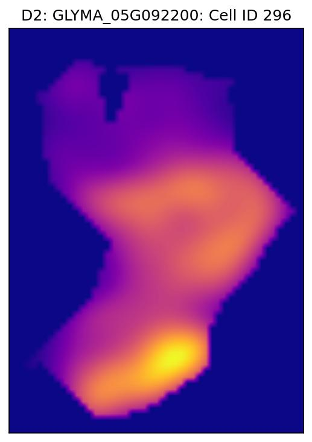
  </div>
  <div class="column" style="max-width:24%; font-size: 20px;">
    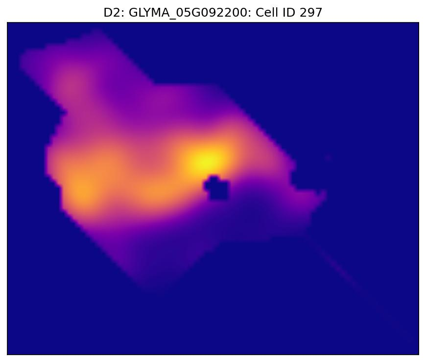
  </div>
  <div class="column" style="max-width:24%; font-size: 20px;">
    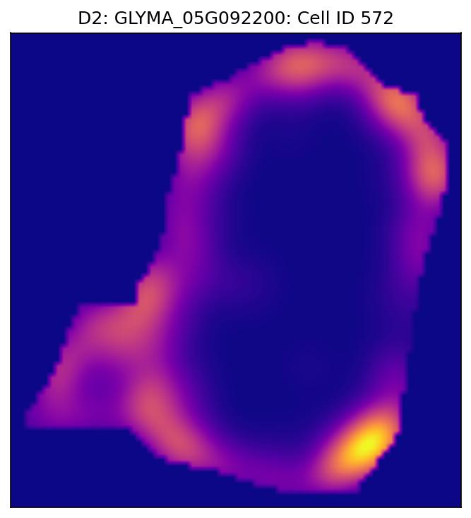
  </div>
    <div class="column" style="max-width:24%; font-size: 20px;">
    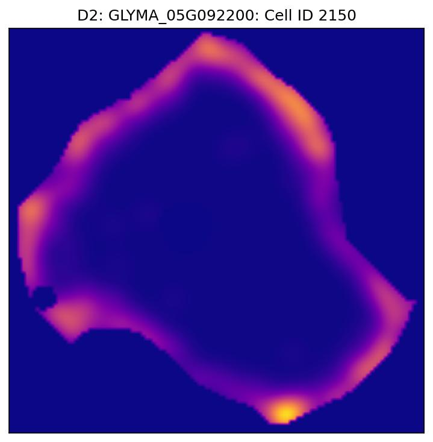
  </div>
</div>
<div class="row" style="font-family: 'Yanone Kaffeesatz'">
  <div class="column" style="max-width:24%; font-size: 20px;">
    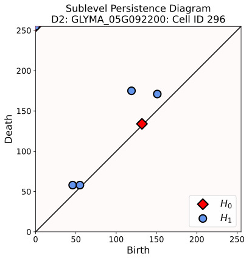
  </div>
  <div class="column" style="max-width:24%; font-size: 20px;">
    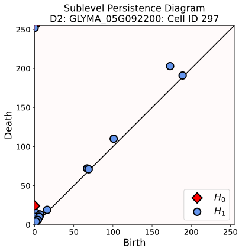
  </div>
  <div class="column" style="max-width:24%; font-size: 20px;">
    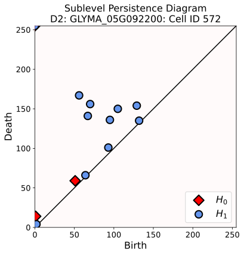
  </div>
    <div class="column" style="max-width:24%; font-size: 20px;">
    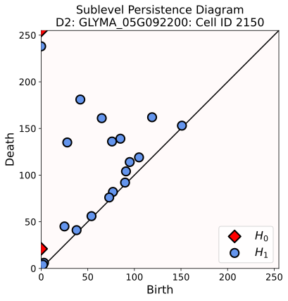
  </div>
</div>

---

# Putting it all together

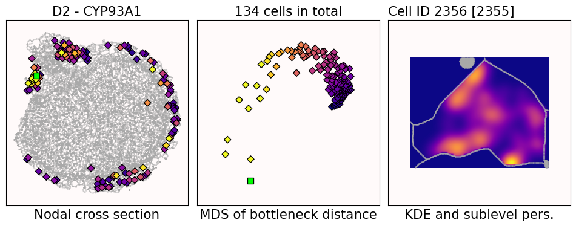

- Left: Cross-section
    - Brighter color &rarr; higher transcript density within cell's cytoplasm
- Center: MDS based on bottleneck distances of sublevel persistence diagrams
    - Corresponding coloring
- Right: KDE of the cell
    - Brighter color &rarr; higher transcript density wrt total cross section

---

# Putting it all together

<video width="900" controls>
  <source src="../videos/CYP93A1_-_sublevel_bottleneck.mp4" type="video/mp4">
</video>

---

# Putting it all together

<video width="900" controls>
  <source src="../videos/BAC51072_-_sublevel_bottleneck.mp4" type="video/mp4">
</video>

---

# Putting it all together

<video width="900" controls>
  <source src="../videos/GLYMA_02G003700_-_sublevel_bottleneck.mp4" type="video/mp4">
</video>

---

# Putting it all together

<video width="900" controls>
  <source src="../videos/GLYMA_05G092200_-_sublevel_bottleneck.mp4" type="video/mp4">
</video>

---

# To-do list

.left-column[
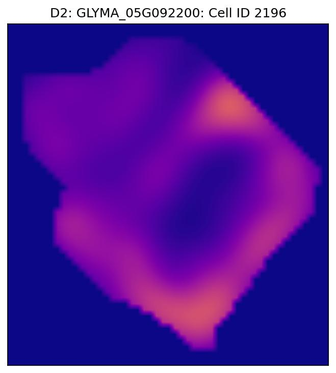
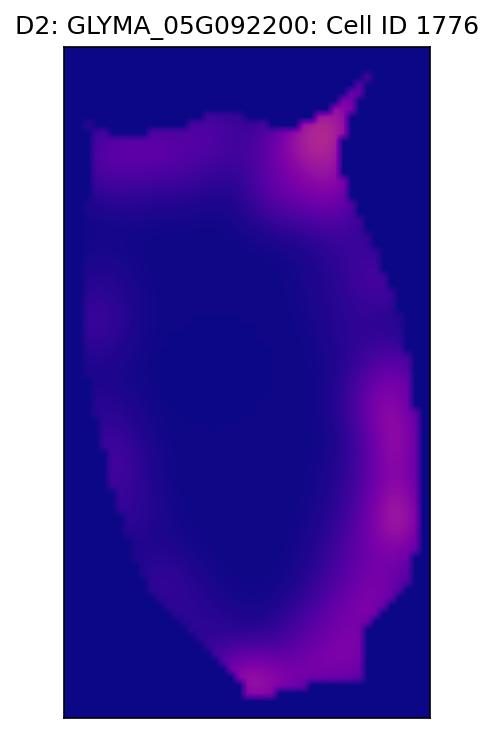
]

.right-column[
- Repeat the pipeline to use 3D data instead

- Compare how different transcripts are distributed within the same cell

- Analyze root tissue as well

- Compare how the same transcript tends to be distributed between different tissues

- Compare plant vs bacterial transcripts, especially at the infection zone
]

---

class: inverse

# Thank you!

<div class="row">
  <div class="column" style="max-width:23%; font-size: 15px;">
    
    <p style="text-align: center;">Marc Libault</p>
    
    <p style="text-align: center";>Sutton Tennant</p>
  </div>
  <div class="column" style="width:6%; font-size: 24px;">
  </div>
  <div class="column" style="max-width:30%; font-size: 24px; line-height:1.25">
  <p style="text-align: center;"><strong>Email</strong></p>
  <p style="text-align: center;color:Blue">eah4d@missouri.edu</p>
  <p style="text-align: center;"><strong>Website and slides</strong></p>
  <p style="text-align: center;color:Blue">ejamezquita.github.io</p>
  </div>
</div>