```{r setup, include=FALSE}
library(knitr)
library(magrittr)
genes = c('GLYMA_17G195900', 'GLYMA_05G216000', 'GLYMA_17G185800', 'GLYMA_05G203100', 'GLYMA_15G210100', 'GLYMA_05G092200')
options(htmltools.dir.version = FALSE)
knitr::opts_chunk$set(echo = FALSE)
knitr::opts_chunk$set(fig.align = 'center')
```

background-image: url("../figs/D2_molecular_cartography.jpg")
background-size: 600px
background-position: 99% 99%

# Molecular cartography

.left-column[
- 3.8M individual transcripts
- Coordinates $(x, y, z)$ for each of them
- Transcripts corresponding to 97 genes
- ~2400 cells in the nodule cross section
- Cross-sections from nodule and root soybean tissues
]

---

# Variety of transcript distribution


- Different cells, different shapes and sizes
- Beyond density: How to quantify and compare patterns?
- Patterns across the whole cross section? Patterns within cells?

---

class: inverse, middle, center

# Kernel Density Estimators (KDEs)

## The continuous version of a histogram

### Think of heatmaps

---

# Say we want to characterize the distribution of these points in 1D

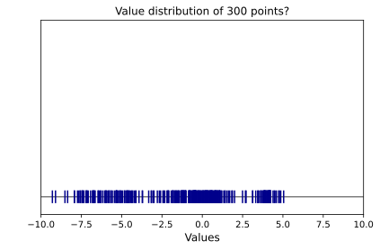

- We only know the samples (blue points)

---

# A histogram gets us a sense of distribution

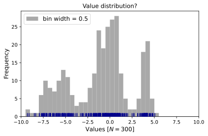

- We only know the samples (blue points)

---

# We usually read histograms as frequency tables

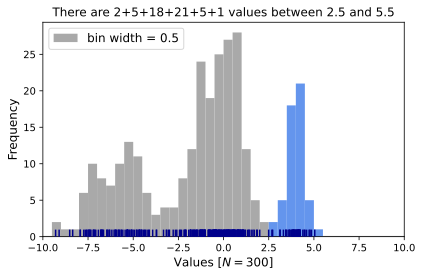

---

# But these histograms can also represent distribution densities

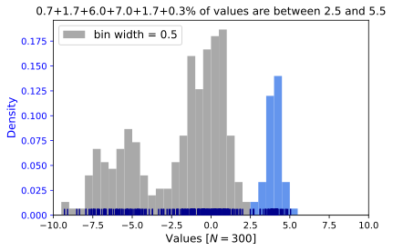

- The total gray area equals 1
- 100% of the points are represented in the histogram

---

# It is hard to do much with the histograms

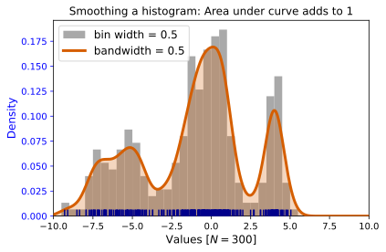

- A continuous approximation is mathematically better to perform meaningful statistics
- Kernel Density Estimate: KDE

---

# The width/number of bins does influence the shape of the histogram

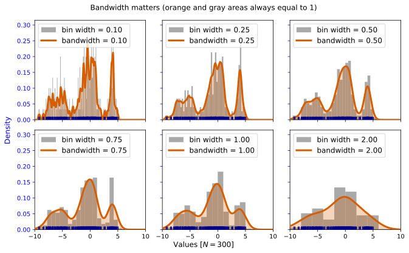

- Similarly, we can control the bandwidth parameter of the KDE to influence its shape
- Plenty of heuristics to define the "right" bandwidth
- But ultimately, "right" depends on the application in mind

---

# How to combine multiple KDEs?

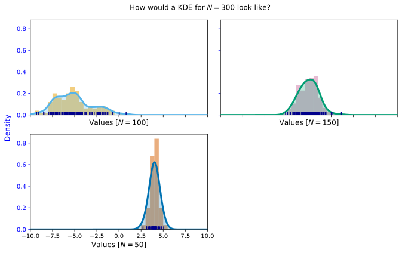

---

# How to combine multiple KDEs?

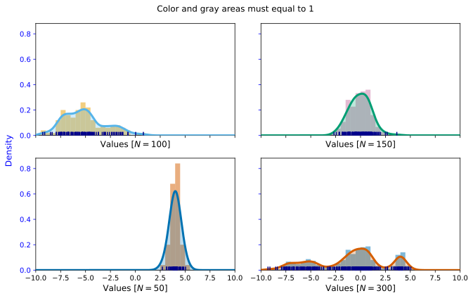

- The area below each curve must equal 1

---

# How to combine multiple KDEs?

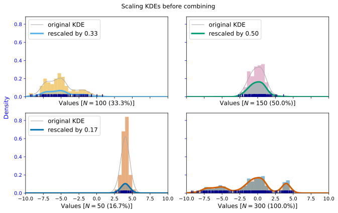

- Normalization depends on the total number of samples considered each time


---


class: inverse, middle, center

# Kernel Density Estimators (KDEs)

## The continuous version of a histogram

### Think of heatmaps

---

## KDEs: One per cell; reflect borders and nuclei


```{r, out.width="700px"}
knitr::include_graphics(c('../figs/D2_GLYMA_05G092200_1767_1765_kde_correction.jpg',
                          '../figs/D2_GLYMA_05G092200_1749_1748_kde_correction.jpg'))
```

---

# Normalize: What is 100%?

- Limit scope to just the 968 infected cells

- **By gene:** The sum of all transcripts of a fixed gene add to 100%
    - Each gene adds to 100% independent of the rest
    - Compares relative concentrations 

- **By cell AND gene:** The sum of all transcripts OF ALL genes add to 100%
    - Each gene adds to a certain percentage
    - The sum of all genes add to 100%
    - Compares absolute concentrations 

```
gene
GLYMA_17G195900    698882
GLYMA_05G216000     12919
GLYMA_17G185800     11462
GLYMA_05G203100      4116
GLYMA_15G210100     11688
GLYMA_05G092200    479091
```

---

class: inverse, middle, center

# Quantify the shape of these heatmaps

## Detour into Topological Data Analysis (TDA) and statistical learning

---

```{r include=FALSE, evaluate=FALSE}
slides_info <- tibble::tibble(first  = formatC(0:6, digits=1, format='d', flag='0'))

slides_text <- glue::glue_data(
  slides_info,
  "
  # Superlevel persistence
  
  
  
  "
)
```

`r slides_text %>% paste(collapse = "\n---\n")`

---

# Same idea for higher dimensions


<p style="font-size: 10px; text-align: right; color: Grey;">Credits: <a href="https://doi.org/10.1021/acs.jpcb.1c00904">Manuchehrfar <em>et al.</em> (2022)</a></p>

- KDEs and superlevel persistence can be computed easily for 2D and 3D data (and even higher dimensions)

---

```{r include=FALSE, evaluate=FALSE}
slides_info <- tibble::tibble(first  = genes)

slides_text <- glue::glue_data(
  slides_info,
  "
  ## Get a topological signature for every cell and gene
  
  
  
  "
)
```

`r slides_text %>% paste(collapse = "\n---\n")`

---

background-image: url("../figs/D2_GLYMA_05G216000_pd_suplevel_by_gene_01726.jpg")
background-size: 530px
background-position: 95% 42%

## Normalization matters when the cell has few transcripts

```{r, fig.align='left', out.width="530px"}
knitr::include_graphics(c('../figs/D2_GLYMA_05G216000_pd_suplevel_by_both_01726.jpg'))
```

- Normalizing by gene or by cell-gene produces KDEs of different heights

- These height differences are reflected in differences in persistence diagrams

- The diagram is essentially stretched out

---

background-image: url("../figs/D2_GLYMA_15G210100_pd_suplevel_by_gene_00557.jpg")
background-size: 530px
background-position: 95% 42%

## Normalization matters when the cell has few transcripts

```{r, fig.align='left', out.width="530px"}
knitr::include_graphics(c('../figs/D2_GLYMA_15G210100_pd_suplevel_by_both_00557.jpg'))
```

- Normalizing by gene or by cell-gene produces KDEs of different heights

- These height differences are reflected in differences in persistence diagrams

- The diagram is essentially stretched out

---

background-image: url("../figs/D2_GLYMA_05G216000_pd_suplevel_by_gene_00557.jpg")
background-size: 530px
background-position: 95% 42%

## Normalization matters when the cell has few transcripts

```{r, fig.align='left', out.width="530px"}
knitr::include_graphics(c('../figs/D2_GLYMA_05G216000_pd_suplevel_by_both_00557.jpg'))
```

- Normalizing by gene or by cell-gene produces KDEs of different heights

- These height differences are reflected in differences in persistence diagrams

- The diagram is essentially stretched out

---

background-image: url("../figs/D2_GLYMA_05G092200_pd_suplevel_by_gene_00579.jpg")
background-size: 530px
background-position: 95% 42%

## Not so much for genes with large number of transcripts

```{r, fig.align='left', out.width="530px"}
knitr::include_graphics(c('../figs/D2_GLYMA_05G092200_pd_suplevel_by_both_00579.jpg'))
```

- Look at the axes values: the diagram is essentially the same

---

background-image: url("../figs/D2_GLYMA_05G092200_pd_suplevel_by_gene_01692.jpg")
background-size: 530px
background-position: 95% 42%

## Not so much for genes with large number of transcripts

```{r, fig.align='left', out.width="530px"}
knitr::include_graphics(c('../figs/D2_GLYMA_05G092200_pd_suplevel_by_both_01692.jpg'))
```

- Look at the axes values: the diagram is essentially the same

---

background-image: url("../figs/D2_GLYMA_05G092200_pd_suplevel_by_gene_01726.jpg")
background-size: 530px
background-position: 95% 42%

## Not so much for genes with large number of transcripts

```{r, fig.align='left', out.width="530px"}
knitr::include_graphics(c('../figs/D2_GLYMA_05G092200_pd_suplevel_by_both_01726.jpg'))
```

- Normalizing by gene or by cell-gene produces KDEs of different heights

- These height differences are reflected in differences in persistence diagrams

---

# Wasserstein 1-distance

```{r, out.width="525px"}
knitr::include_graphics(c('../../tda/figs/bottleneck_diagram.svg'))
```

- Measure the topological similarity between two persistence diagrams $D_1,D_2$.

- Of all possible ways to match the points from $D_1$ to $D_2$ (or match to the diagonal), we want the one that minimizes the total sum of matching distances.

- In the caricature above, **B** is a much better matching than **A**.

- Mathematically speaking, the Wasserstein 1-distance is defined as:

$${W_1}(D_1,D_2) = \inf_{\gamma:D_1\to D_2}\left(\sum_{p\in D_1}\left\|p - \gamma(p)\right\|_{\infty}\right)$$

---

# Wasserstein 1-distance

.pull-left[
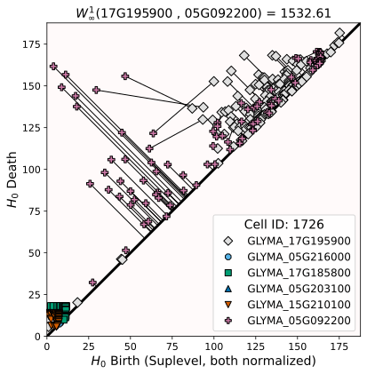
]

.pull-right[

]

- Measure the topological difference of transcript distribution of different genes within the same cell

- Comparing two genes at a time

---

# Normalization can affect the differences

.pull-left[
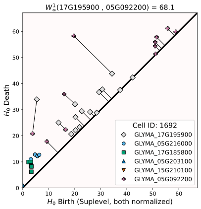
]

.pull-right[
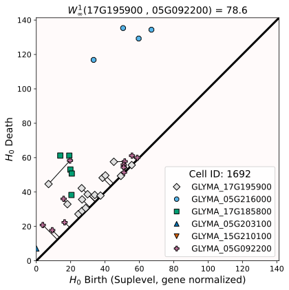
]

---

class: center, inverse, middle

# Normalizing by **both** cell and gene

## The sum of all transcripts of all genes of all infected cells add to 100%

The heatmaps corresponding to genes with low amounts of transcripts e.g. (`GLYMA_15G210100`) are essentially flattened and there's little than can be said about them

---

# Measure pair-wise differences

- For 6 genes, there are 15 possible different pairs

- Measure the Wasserstein distance within the same cell

- Unsurprisingly, 4 of them are quite close to each other because they are all flat.

- The most interesting differences happen between `GLYMA_05G092200` and `GLYMA_17G165900`

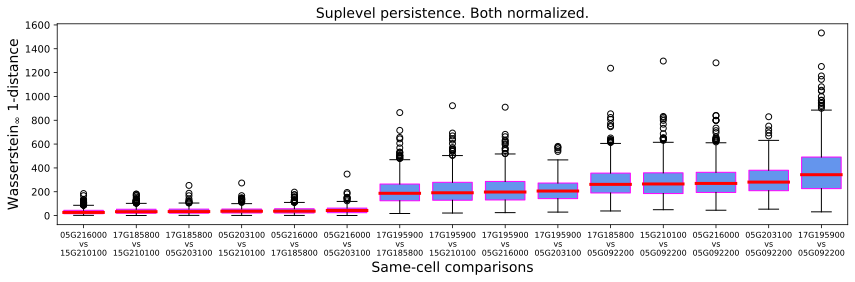

---

# Represent spatially these distances

- Taking the median difference of each pair of genes, we can represent these distance differences in 2D with an MDS (multidimensional scaling)

.pull-left[
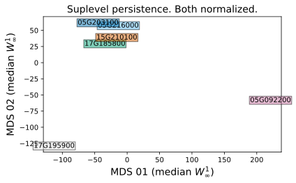
]

.pull-right[
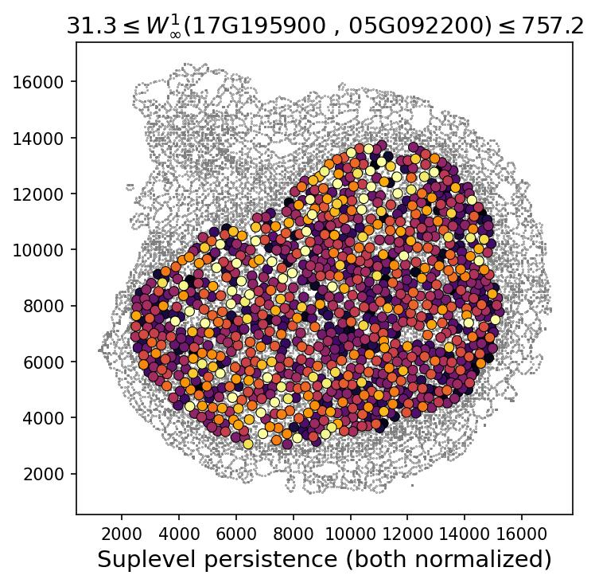
]

- Darker colors represent lower difference values

---

## But how do these distributions really look like?

---

class: inverse

# Thank you!

<div class="row">
  <div class="column" style="max-width:23%; font-size: 15px;">
    
    <p style="text-align: center;">Marc Libault</p>
    
    <p style="text-align: center";>Sutton Tennant</p>
  </div>
  <div class="column" style="width:6%; font-size: 24px;">
  </div>
  <div class="column" style="max-width:30%; font-size: 24px; line-height:1.25">
  <p style="text-align: center;"><strong>Email</strong></p>
  <p style="text-align: center;color:Blue">eah4d@missouri.edu</p>
  <p style="text-align: center;"><strong>Website and slides</strong></p>
  <p style="text-align: center;color:Blue">ejamezquita.github.io</p>
  </div>
</div>