```{r setup, include=FALSE}
library(knitr)
library(magrittr)
genes = c('GLYMA_17G195900', 'GLYMA_05G216000', 'GLYMA_17G185800', 'GLYMA_05G203100', 'GLYMA_15G210100', 'GLYMA_05G092200')
options(htmltools.dir.version = FALSE)
knitr::opts_chunk$set(echo = FALSE)
knitr::opts_chunk$set(fig.align = 'center')
```

background-image: url("../figs/D2_molecular_cartography.jpg")
background-size: 600px
background-position: 99% 99%

# Molecular cartography

.left-column[
- 3.8M individual transcripts
- Coordinates $(x, y, z)$ for each of them
- Transcripts corresponding to 97 genes
- ~2400 cells in the nodule cross section
- Cross-sections from nodule and root soybean tissues
]

---

# Variety of transcript distribution


- Different cells, different shapes and sizes
- Beyond density: How to quantify and compare patterns?
- Patterns across the whole cross section? Patterns within cells?

---

class: inverse, middle, center

# Kernel Density Estimators (KDEs)

## The continuous version of a histogram

### Think of heatmaps

---

# Say we want to characterize the distribution of these points in 1D


- We only know the samples (blue points)

---

# A histogram gets us a sense of distribution


- We only know the samples (blue points)

---

# We usually read histograms as frequency tables


---

# But these histograms can also represent distribution densities


- The total gray area equals 1
- 100% of the points are represented in the histogram

---

# It is hard to do much with the histograms


- A continuous approximation is mathematically better to perform meaningful statistics
- Kernel Density Estimate: KDE

---

# The width/number of bins does influence the shape of the histogram


- Similarly, we can control the bandwidth parameter of the KDE to influence its shape
- Plenty of heuristics to define the "right" bandwidth
- But ultimately, "right" depends on the application in mind

---

# How to combine multiple KDEs?


---

# How to combine multiple KDEs?


- The area below each curve must equal 1

---

# How to combine multiple KDEs?


- Normalization depends on the total number of samples considered each time


---


class: inverse, middle, center

# Kernel Density Estimators (KDEs)

## The continuous version of a histogram

### Think of heatmaps

---

## KDEs: One per cell; reflect borders and nuclei


```{r, out.width="700px"}
knitr::include_graphics(c('../figs/D2_GLYMA_05G092200_1767_1765_kde_correction.jpg',
                          '../figs/D2_GLYMA_05G092200_1749_1748_kde_correction.jpg'))
```

---

# Normalize: What is 100%?

- Limit scope to just the 968 infected cells

- **By gene:** The sum of all transcripts of a fixed gene add to 100%
    - Each gene adds to 100% independent of the rest
    - Compares relative concentrations 

- **By cell AND gene:** The sum of all transcripts OF ALL genes add to 100%
    - Each gene adds to a certain percentage
    - The sum of all genes add to 100%
    - Compares absolute concentrations 

```
gene
GLYMA_17G195900    698882
GLYMA_05G216000     12919
GLYMA_17G185800     11462
GLYMA_05G203100      4116
GLYMA_15G210100     11688
GLYMA_05G092200    479091
```

---

class: inverse, middle, center

# Quantify the shape of these heatmaps

## Detour into Topological Data Analysis (TDA) and statistical learning

---

```{r include=FALSE, evaluate=FALSE}
slides_info <- tibble::tibble(first  = formatC(0:6, digits=1, format='d', flag='0'))

slides_text <- glue::glue_data(
  slides_info,
  "
  # Superlevel persistence
  
  
  
  "
)
```

`r slides_text %>% paste(collapse = "\n---\n")`

---

# Same idea for higher dimensions


<p style="font-size: 10px; text-align: right; color: Grey;">Credits: <a href="https://doi.org/10.1021/acs.jpcb.1c00904">Manuchehrfar <em>et al.</em> (2022)</a></p>

- KDEs and superlevel persistence can be computed easily for 2D and 3D data (and even higher dimensions)

---

```{r include=FALSE, evaluate=FALSE}
slides_info <- tibble::tibble(first  = genes)

slides_text <- glue::glue_data(
  slides_info,
  "
  ## Get a topological signature for every cell and gene
  
  
  
  "
)
```

`r slides_text %>% paste(collapse = "\n---\n")`

---

background-image: url("../figs/D2_GLYMA_05G216000_pd_suplevel_by_gene_01726.jpg")
background-size: 530px
background-position: 95% 42%

## Normalization matters when the cell has few transcripts

```{r, fig.align='left', out.width="530px"}
knitr::include_graphics(c('../figs/D2_GLYMA_05G216000_pd_suplevel_by_both_01726.jpg'))
```

- Normalizing by gene or by cell-gene produces KDEs of different heights

- These height differences are reflected in differences in persistence diagrams

---

background-image: url("../figs/D2_GLYMA_15G210100_pd_suplevel_by_gene_00557.jpg")
background-size: 530px
background-position: 95% 42%

## Normalization matters when the cell has few transcripts

```{r, fig.align='left', out.width="530px"}
knitr::include_graphics(c('../figs/D2_GLYMA_15G210100_pd_suplevel_by_both_00557.jpg'))
```

- Normalizing by gene or by cell-gene produces KDEs of different heights

- These height differences are reflected in differences in persistence diagrams

---

background-image: url("../figs/D2_GLYMA_05G216000_pd_suplevel_by_gene_00557.jpg")
background-size: 530px
background-position: 95% 42%

## Normalization matters when the cell has few transcripts

```{r, fig.align='left', out.width="530px"}
knitr::include_graphics(c('../figs/D2_GLYMA_05G216000_pd_suplevel_by_both_00557.jpg'))
```

- Normalizing by gene or by cell-gene produces KDEs of different heights

- These height differences are reflected in differences in persistence diagrams

---

background-image: url("../figs/D2_GLYMA_05G092200_pd_suplevel_by_gene_00579.jpg")
background-size: 530px
background-position: 95% 42%

## Not so much for genes with large number of transcripts

```{r, fig.align='left', out.width="530px"}
knitr::include_graphics(c('../figs/D2_GLYMA_05G092200_pd_suplevel_by_both_00579.jpg'))
```

- Look at the axes

---


background-image: url("../figs/D2_GLYMA_05G092200_pd_suplevel_by_gene_01692.jpg")
background-size: 530px
background-position: 95% 42%

## Not so much for genes with large number of transcripts

```{r, fig.align='left', out.width="530px"}
knitr::include_graphics(c('../figs/D2_GLYMA_05G092200_pd_suplevel_by_both_01692.jpg'))
```

- Normalizing by gene or by cell-gene produces KDEs of different heights

- These height differences are reflected in differences in persistence diagrams

---

background-image: url("../figs/D2_GLYMA_05G092200_pd_suplevel_by_gene_01726.jpg")
background-size: 530px
background-position: 95% 42%

## Not so much for genes with large number of transcripts

```{r, fig.align='left', out.width="530px"}
knitr::include_graphics(c('../figs/D2_GLYMA_05G092200_pd_suplevel_by_both_01726.jpg'))
```

- Normalizing by gene or by cell-gene produces KDEs of different heights

- These height differences are reflected in differences in persistence diagrams

---

# Wasserstein 1-distance


Measure topological similarity

For persistence diagrams $D_1,D_2$, their Wasserstein 1-distance is

$$d_{W_1}(D_1,D_2) = \inf_{\gamma:D_1\to D_2}\left(\sum_{p\in D_1}\left\|p - \gamma(p)\right\|_{\infty}\right)$$

---

# Multidimensional scaling (MDS)


- Another form of dimension reduction

- We only have pairwise distances/similarities between points

- Optimization problem: We want to project them to 2D such that similar points remain close

---

background-image: url("../../demat/figs/mds_reconstructed.svg")
background-size: 800px
background-position: 50% 70%

# Using geodesic distances

---

# General TDA pipeline


<p style="font-size: 10px; text-align: right; color: Grey;">Credits: Frédéric Chazal. <a href="https://geometrica.saclay.inria.fr/team/Fred.Chazal/Sophia2017/slidesSophia2017/PersistenceForTDA2.pdf">Source</a></p>

- Encode shapes and patterns as persistence diagrams via sublevel set persistence

- Similar shapes &rarr; Similar topological signatures &rarr; Similar points in MDS

---

class: inverse, middle, center

# Bringing it back to the transcriptome

## 1. Determine transcript distribution pattern via KDE

## 2. Use TDA to encode the shape of the pattern

## 3. Compute pairwise distances between patterns

## 4. Assess those distances in 2D
 

---

# Back to the transcriptome

.pull-left[


]

.pull-right[

- Normalize the KDE accordingly (per cell)

- Extract the topological shape signature of every KDE via sublevel set persistence

- Compare the similarities of these topological shape signatures


- &#8593;&#8593; ¡Remember: 2D this time! &#8593;&#8593;
]

---

background-image: url("../figs/D2_GLYMA_05G092200_1767_1765_sublevel_persistence_diagram.svg")
background-size: 305px
background-position: 10% 95%

# Sublevel set persistence

.pull-left[
```
[(1, (0.0, 192.0)),
 (1, (11.0, 72.0)),
 (1, (93.0, 106.0)),
 (1, (25.0, 36.0)),
 (1, (95.0, 105.0)),
 (1, (8.0, 13.0)),
 (1, (14.0, 18.0)),
 (0, (0.0, inf)),
 (0, (0.0, 76.0))]
 ```
]

.pull-right[
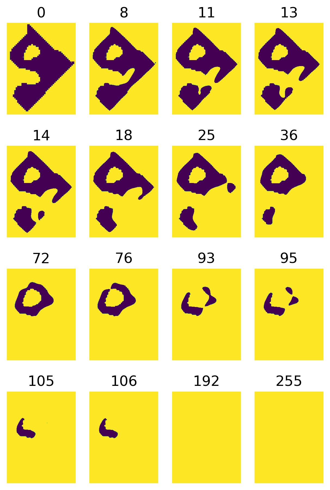
]

---

background-image: url("../figs/D2_GLYMA_05G092200_1749_1748_sublevel_persistence_diagram.svg")
background-size: 305px
background-position: 10% 95%

# Sublevel set persistence

.pull-left[
```
[(1, (0.0, 194.0)),
 (1, (94.0, 126.0)),
 (1, (21.0, 48.0)),
 (1, (22.0, 45.0)),
 (1, (119.0, 139.0)),
 (0, (0.0, inf)),
 (0, (0.0, 73.0)),
 (0, (4.0, 10.0))]
 ```
]

.pull-right[
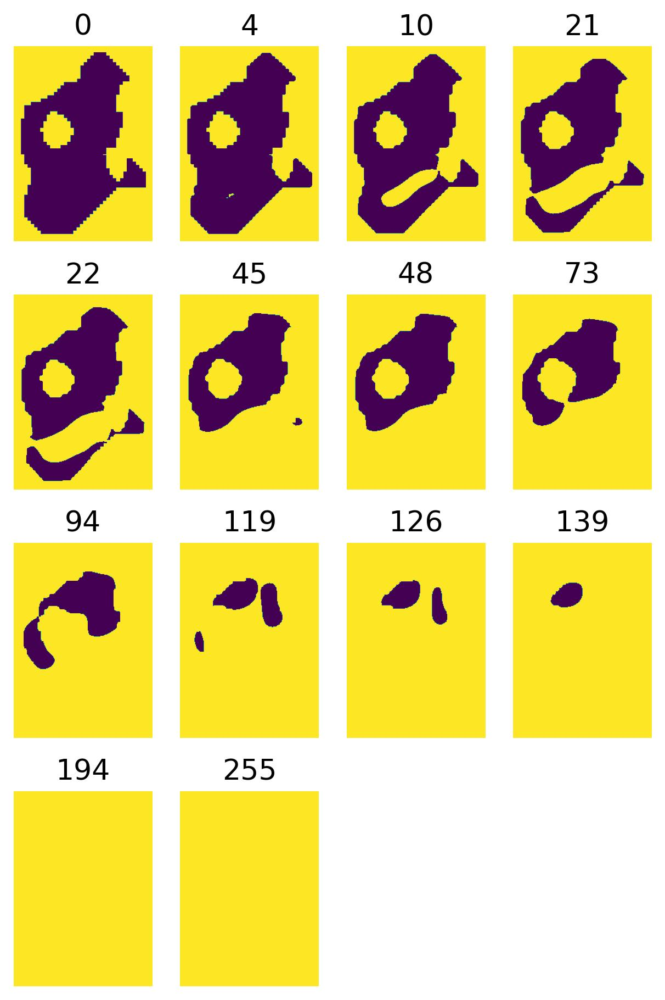
]

---

# Sublevel set persistence

<div class="row" style="font-family: 'Yanone Kaffeesatz'">
  <div class="column" style="max-width:24%; font-size: 20px;">
    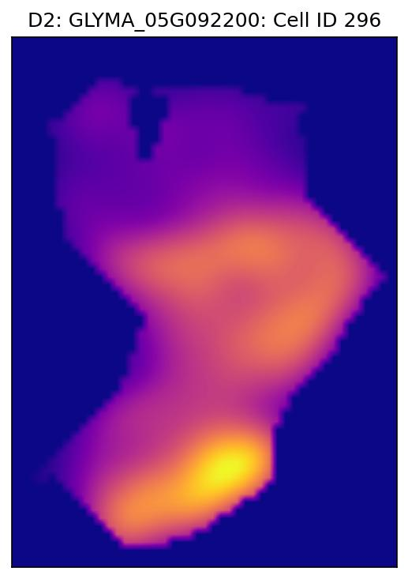
  </div>
  <div class="column" style="max-width:24%; font-size: 20px;">
    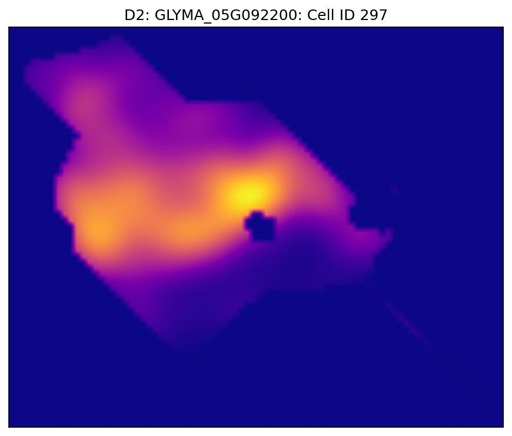
  </div>
  <div class="column" style="max-width:24%; font-size: 20px;">
    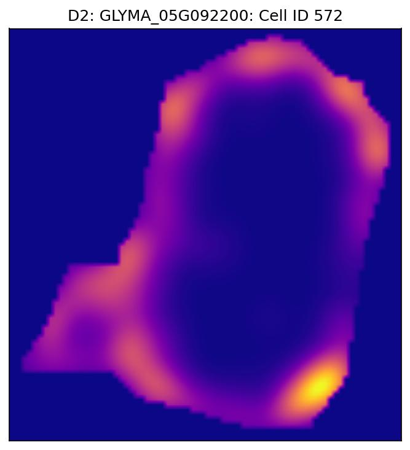
  </div>
    <div class="column" style="max-width:24%; font-size: 20px;">
    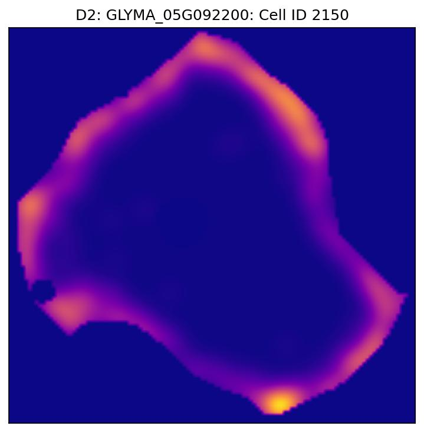
  </div>
</div>
<div class="row" style="font-family: 'Yanone Kaffeesatz'">
  <div class="column" style="max-width:24%; font-size: 20px;">
    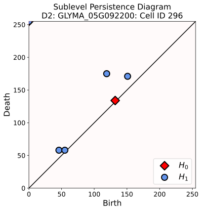
  </div>
  <div class="column" style="max-width:24%; font-size: 20px;">
    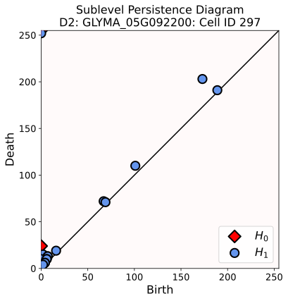
  </div>
  <div class="column" style="max-width:24%; font-size: 20px;">
    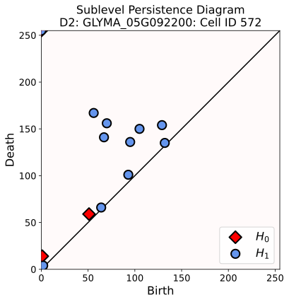
  </div>
    <div class="column" style="max-width:24%; font-size: 20px;">
    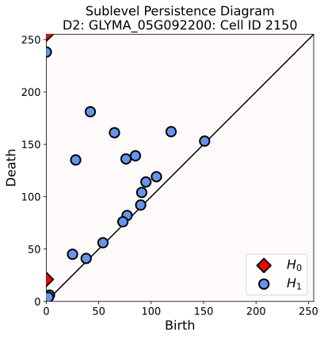
  </div>
</div>

---

# Putting it all together

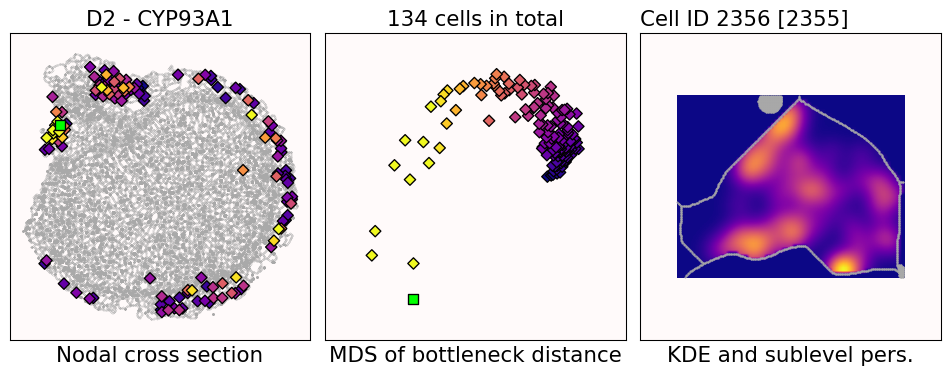

- Left: Cross-section
    - Brighter color &rarr; higher transcript density within cell's cytoplasm
- Center: MDS based on bottleneck distances of sublevel persistence diagrams
    - Corresponding coloring
- Right: KDE of the cell
    - Brighter color &rarr; higher transcript density wrt total cross section

---

# Putting it all together

<video width="900" controls>
  <source src="../videos/CYP93A1_-_sublevel_bottleneck.mp4" type="video/mp4">
</video>

---

# Putting it all together

<video width="900" controls>
  <source src="../videos/BAC51072_-_sublevel_bottleneck.mp4" type="video/mp4">
</video>

---

# Putting it all together

<video width="900" controls>
  <source src="../videos/GLYMA_02G003700_-_sublevel_bottleneck.mp4" type="video/mp4">
</video>

---

# Putting it all together

<video width="900" controls>
  <source src="../videos/GLYMA_05G092200_-_sublevel_bottleneck.mp4" type="video/mp4">
</video>

---

# To-do list

.left-column[

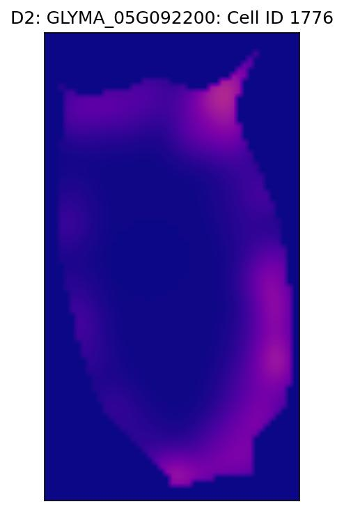
]

.right-column[
- Repeat the pipeline to use 3D data instead

- Compare how different transcripts are distributed within the same cell

- Analyze root tissue as well

- Compare how the same transcript tends to be distributed between different tissues

- Compare plant vs bacterial transcripts, especially at the infection zone
]

---

class: inverse

# Thank you!

<div class="row">
  <div class="column" style="max-width:23%; font-size: 15px;">
    
    <p style="text-align: center;">Marc Libault</p>
    
    <p style="text-align: center";>Sutton Tennant</p>
  </div>
  <div class="column" style="width:6%; font-size: 24px;">
  </div>
  <div class="column" style="max-width:30%; font-size: 24px; line-height:1.25">
  <p style="text-align: center;"><strong>Email</strong></p>
  <p style="text-align: center;color:Blue">eah4d@missouri.edu</p>
  <p style="text-align: center;"><strong>Website and slides</strong></p>
  <p style="text-align: center;color:Blue">ejamezquita.github.io</p>
  </div>
</div>