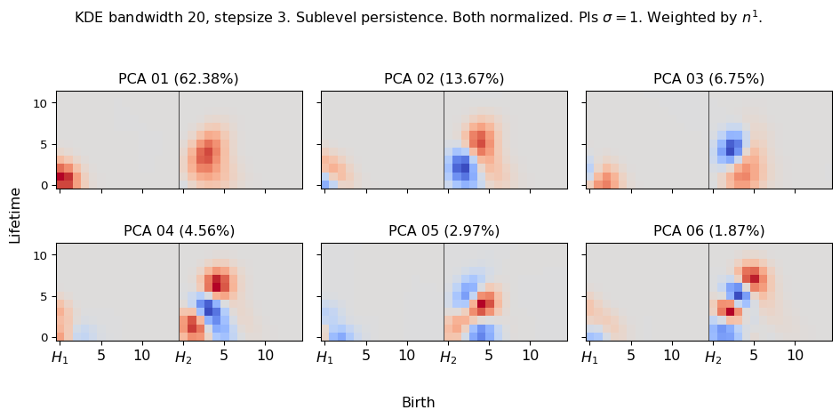

```{r setup, include=FALSE}
library(knitr)
library(magrittr)
genes = c('GLYMA_17G195900', 'GLYMA_05G216000', 'GLYMA_17G185800', 'GLYMA_05G203100', 'GLYMA_15G210100', 'GLYMA_05G092200')
options(htmltools.dir.version = FALSE)
knitr::opts_chunk$set(echo = FALSE)
knitr::opts_chunk$set(fig.align = 'center')
```


# Issue at hand: transcript distribution


- Different cells of different shapes and sizes
- Beyond density: How to quantify and compare patterns?
- Patterns across the whole cross section? Patterns within cells?

---

# Plan of attack

1. Make heatmaps of transcript distributions via Kernel Density Estimates (KDEs)

1. Quantify these heatmaps via Topological Data Analysis (TDA)

1. Featurize these topological signatures as Persistence Images

1. ????? [traditional data analysis]

1. Profit


---

class: inverse, middle, center

# [1] Kernel Density Estimators (KDEs)

## The continuous version of a histogram

### Think of heatmaps

[2] Quantify these heatmaps via Topological Data Analysis (TDA)

[3] Featurize these topological signatures as Persistence Images

[4] Traditional data analysis and results

---

# Approximate the underlying distribution with a KDE


- A continuous approximation is mathematically better to perform meaningful statistics
- Kernel Density Estimate: KDE

---

# The width/number of bins does influence the shape of the histogram


- Similarly, we can control the bandwidth parameter of the KDE to influence its shape
- Plenty of heuristics to define the "right" bandwidth
- But ultimately, "right" depends on the application in mind

---

## KDEs: 3D; one per cell; reflect borders and nuclei


```{r, out.width="700px"}
knitr::include_graphics(c('../figs/D2_GLYMA_05G092200_1767_1765_kde_correction.jpg',
                          '../figs/D2_GLYMA_05G092200_1749_1748_kde_correction.jpg'))
```

---

# Normalize: What is 100%?

- Limit scope to just the 968 infected cells

- **By gene:** The sum of all transcripts of a fixed gene add to 100%
    - Each gene adds to 100% independent of the rest
    - Compares relative concentrations 

- **By cell AND gene:** The sum of all transcripts OF ALL genes add to 100%
    - Each gene adds to a certain percentage
    - The sum of all genes add to 100%
    - Compares absolute concentrations 

```
gene
GLYMA_17G195900    698882
GLYMA_05G216000     12919
GLYMA_17G185800     11462
GLYMA_05G203100      4116
GLYMA_15G210100     11688
GLYMA_05G092200    479091
```

---

class: inverse, middle, center

[1] Estimate heatmaps via KDEs

# [2] Quantify the shape of these heatmaps

## Topological Data Analysis (TDA) and persistent homology

[3] Featurize these topological signatures as Persistence Images

[4] Traditional data analysis and results

---

```{r include=FALSE, evaluate=FALSE}
slides_info <- tibble::tibble(first  = formatC(0:6, digits=1, format='d', flag='0'))

slides_text <- glue::glue_data(
  slides_info,
  "
  # Sublevel filter &rarr; Persistence Diagrams
  
  
  
  "
)
```

`r slides_text %>% paste(collapse = "\n---\n")`

---

background-image: url("https://pubs.acs.org/cms/10.1021/acs.jpcb.1c00904/asset/images/large/jp1c00904_0001.jpeg")
background-size: 400px
background-position: 99% 1%

# Same for higher dims

.pull-left[

]

.pull-right[

]

---

class: inverse, middle, center

[1] Estimate heatmaps via KDEs

[2] Quantify these heatmaps via Topological Data Analysis (TDA)

# [3] Featurize these topological signatures as Persistence Images

## The space of persistence diagrams is weird

### So we move to a nicer, more familiar one

[4] Traditional data analysis and results

---

# Rotate $45^\circ$ for Persistence Images

```{r, out.width=650}
knitr::include_graphics(c('../figs/D2_GLYMA_05G092200_z_kde_pd_suplevel_by_both_02404.jpg',
                          '../figs/persistence_image_example_GLYMA_05G092200_2404.png'))
```


---

# A word on Persistence Images

.pull-left[

]

.pull-right[
- Think them as a KDE of the lifetime diagram *with extra steps*.

- More persistent points are heavier

- Points with 0 lifespan have 0 weight

- **Theorem:** Persistence Images are stable with respect to the 1-Wasserstein distance ([Adams *et al.* (2017)](http://jmlr.org/papers/v18/16-337.html))

- The topological signature now is a collection of pixel values

- Concatenate all dimensions into a single large vector

- We can now do standard statistics and machine learning with PIs as our input features!
]

---

# Persistence Images can be tuned


---

class: inverse, middle, center

[1] Estimate heatmaps via KDEs

[2] Quantify these heatmaps via Topological Data Analysis (TDA)

[3] Featurize these topological signatures as Persistence Images

# [4] Traditional data analysis and results

## An example of a pipeline

### Never underestimate the power of PCA

---

# Remember the setup

- Looking at 968 infected cells in soybean root

- Looking at $(x,y,z)$ spatial locations of all transcripts from 6 genes

- With KDEs, 3D heatmaps produced $968\times 6=5808$ times

- The *shape* of the heatmaps was then encoded into persistence diagrams using a sublevel set filtration

- These diagrams were then transformed into Persistence Images

- $H_1, H_2$ images were concatenated and used as features

- Modeling the transcripts patterns across genes and cells &larr; *You are here*

```{r, out.width="550px"}
knitr::include_graphics(c('../figs/D2_GLYMA_05G092200_z_kde_pd_suplevel_by_both_01306.jpg'))
```

---

class: inverse, middle, center

# Normalize by *both* gene and cell

## Consider both pattern and density

---

# Never underestimate PCA


---

# What is exactly used by PCA?



---

background-image: url("../figs/bw20_both_scale16_-_PI_1_1_1_pca_H1+2_PI_sample.png")
background-size: 900px
background-position: 50% 70%

# Show me

```{r, out.width=250, fig.align='left'}
knitr::include_graphics(c('../figs/bw20_both_scale16_-_PI_1_1_1_pca_H1+2_gridded.png'))
```

---

background-image: url("../figs/bw20_both_scale16_-_PI_1_1_1_pca_H1+2_cell_sample.png")
background-size: 620px
background-position: 75% 99%

# Show me

```{r, out.width=250, fig.align='left'}
knitr::include_graphics(c('../figs/bw20_both_scale16_-_PI_1_1_1_pca_H1+2_gridded.png'))
```

---

background-image: url("../figs/bw20_both_scale16_-_PI_1_1_1_pca_H1+2_kde_sample.png")
background-size: 620px
background-position: 75% 99%

# Show me

```{r, out.width=250, fig.align='left'}
knitr::include_graphics(c('../figs/bw20_both_scale16_-_PI_1_1_1_pca_H1+2_gridded.png'))
```

---

```{r include=FALSE, evaluate=FALSE}
  gene_list <- tibble::tibble(gene=c('17G195900', '05G092200'))
  pc_num <- tibble::tibble(pcnum=1:2)
  cell_kde <- tibble::tibble(ptype=c('kde','cell'))

  string_list <- vector(mode='list')
  idx <- 1
  for(i in 1:length(gene_list$gene)){
    string_list[[idx]] <- glue::glue(
      "
      # Spatial location: {gene_list$gene[i]}
      
      - Compare PC values vs eccentricity (average Euclidean distance)
      
      
      "
    )
    idx <- idx + 1
    for(j in 1:length(pc_num$pcnum)){
      for(k in 1:length(cell_kde$ptype)){
        string_list[[idx]] <- glue::glue(
        "
        background-image: url(\"../figs/bw20_both_scale16_-_PI_1_1_1_pca_H1+2_{cell_kde$ptype[k]}_0{pc_num$pcnum[j]}_GLYMA_{gene_list$gene[i]}.png\")
        background-size: 600px
        background-position: 50% 90%
        
        # {gene_list$gene[i]} : PC {pc_num$pcnum[j]}
        
        "
        )
        idx <- idx+1
      }
    }
  }
  
  slides_text <- unlist(string_list)
```

`r slides_text %>% paste(collapse = "\n---\n")`

---

class: inverse, middle, center

# Look at differences

## Between 17G195900 and 05G092200

---

background-image: url("../figs/bw20_both_scale16_-_PI_1_1_1_pca_H1+2_GLYMA_17G195900_vs_GLYMA_05G092200.png")
background-size: 700px
background-position: 50% 99%

# The most different distributions

---


```{r include=FALSE, evaluate=FALSE}
  pctype <- tibble::tibble(pcnum=c('1+2', 'L2'))
  
  string_list <- vector(mode='list')
  idx <- 1
  
  for(i in 1:length(pctype$pcnum)){
    for(j in 1:length(cell_kde$ptype)){
      string_list[[idx]] <- glue::glue(
      "
      
      # 17G195900 vs 05G092200
      
      
      
      "
      )
    idx <- idx + 1
    }
  }
  
  slides_text <- unlist(string_list)
```

`r slides_text %>% paste(collapse = "\n---\n")`


---

class: inverse, middle, center

# Normalize just by *gene*

## Highlight patterns themselves

---

# Never underestimate PCA


---

background-image: url("../figs/bw20_gene_scale16_-_PI_1_1_1_pca_H1+2_cell_sample.png")
background-size: 475px
background-position: 85% 99%

# Show me

```{r, out.width=250, fig.align='left'}
knitr::include_graphics(c('../figs/bw20_gene_scale16_-_PI_1_1_1_pca_H1+2_gridded.png'))
```

---

background-image: url("../figs/bw20_gene_scale16_-_PI_1_1_1_pca_H1+2_kde_sample.png")
background-size: 475px
background-position: 85% 99%

# Show me

```{r, out.width=250, fig.align='left'}
knitr::include_graphics(c('../figs/bw20_gene_scale16_-_PI_1_1_1_pca_H1+2_gridded.png'))
```

---

```{r include=FALSE, evaluate=FALSE}
  gene_list <- tibble::tibble(gene=c('05G216000', '17G185800', '05G203100', '15G210100'))

  string_list <- vector(mode='list')
  idx <- 1
  for(i in 1:length(gene_list$gene)){
    string_list[[idx]] <- glue::glue(
      "
      # Spatial location: {gene_list$gene[i]}
      
      - Compare PC values vs eccentricity (average Euclidean distance)
      
      
      "
    )
    idx <- idx + 1
    for(j in 1:length(pc_num$pcnum)){
      for(k in 1:length(cell_kde$ptype)){
        string_list[[idx]] <- glue::glue(
        "
        background-image: url(\"../figs/bw20_gene_scale16_-_PI_1_1_1_pca_H1+2_{cell_kde$ptype[k]}_0{pc_num$pcnum[j]}_GLYMA_{gene_list$gene[i]}.png\")
        background-size: 600px
        background-position: 50% 90%
        
        # {gene_list$gene[i]} : PC {pc_num$pcnum[j]}
        
        "
        )
        idx <- idx+1
      }
    }
  }
  
  slides_text <- unlist(string_list)
```

`r slides_text %>% paste(collapse = "\n---\n")`

---

class: inverse, middle, center

# Look at differences

## Normalize just by *gene*

### Highlight patterns themselves

---


```{r include=FALSE, evaluate=FALSE}
  gene_combo <- combn(gene_list$gene, 2)
  pctype <- tibble::tibble(pcnum=c('1+2', 'L2'))
  
  string_list <- vector(mode='list')
  idx <- 1
  
  for(k in 1:ncol(gene_combo)){
    string_list[[idx]] <- glue::glue(
      "
      background-image: url(\"../figs/bw20_gene_scale16_-_PI_1_1_1_pca_H1+2_GLYMA_{gene_combo[1,k]}_vs_GLYMA_{gene_combo[2,k]}.png\")
      background-size: 700px
      background-position: 50% 99%
      
      # {gene_combo[1,k]} vs {gene_combo[2,k]}
      "
    )
    idx <- idx + 1
    for(i in 2:length(pctype$pcnum)){
      for(j in 2:length(cell_kde$ptype)){
        string_list[[idx]] <- glue::glue(
        "
        
        # {gene_combo[1,k]} vs {gene_combo[2,k]}
        
        
        
        "
        )
      idx <- idx + 1
      }
    }
  }
  slides_text <- unlist(string_list)
```

`r slides_text %>% paste(collapse = "\n---\n")`


---

# Discussion

- Topological Data Analysis offers a robust way to encode the *shape of patterns*

- Robust to differences in scale, underlying boundaries, or orientation

- As long as you have a heatmap, you're good to go:
    
- Even if you don't, you can make one via KDEs from individual spatial coordinates
    - Climate patterns?
    - Canopy patterns?
    - Cover crop patterns?
    - Species spatial distribution?


---

# Software used

.pull-left[
- All the work has been done in python with mostly standard libries (`numpy`, `scikit-learn`, `matplotlib`, `pandas`, etc.)

- KDEs computed efficiently with [`KDEpy`](https://kdepy.readthedocs.io/en/latest/)

- Sublevel set filtration of images and persistence diagrams done with [`gudhi`](https://gudhi.inria.fr/)


]

.pull-right[
- Persistence Images computed with [`persim`](https://persim.scikit-tda.org/en/latest/)


]

---

class: inverse

# Thank you!

<div class="row">
  <div class="column" style="max-width:60%; font-size: 15px;">
    
  </div>
  <div class="column" style="width:6%; font-size: 24px;">
  </div>
  <div class="column" style="max-width:30%; font-size: 24px; line-height:1.25">
  <p style="text-align: center;"><strong>Email</strong></p>
  <p style="text-align: center;color:Blue">eah4d@missouri.edu</p>
  <p style="text-align: center;"><strong>Website and slides</strong></p>
  <p style="text-align: center;color:Blue">ejamezquita.github.io</p>
  </div>
</div>

<div class="row">
  <div class="column" style="max-width:35%; font-size: 20px;">
  <p style="font-size: 25px; text-align: center;"> Libault Lab (MU) </p>
    <ul>
      <li><strong>Marc Libault</strong></li>
      <li><strong>Sandra Thibivillers</strong></li>
      <li>Hengping Xu</li>
      <li>Sahand Amini</li>
      <li>Hong Fu</li>
      <li><strong>Sutton Tennant</strong></li>
      <li>Md Sabbir Hossain</li>
    <ul>
  </div>
  <div class="column" style="max-width:65%; font-size: 20px;">
  <p style="font-size: 25px; text-align: center;"> With help from </p>
    <ul>
      <li>Sai Subash (Nebraska-Lincoln)</li>
      <li>Benjamin Smith (UC Berkeley)</li>
      <li>Samik Bhattacharya (Resolve Biosciences)</li>
      <li>Jasper Kläver (Resolve Biosciences)</li>
    <ul>
  </div>
</div>