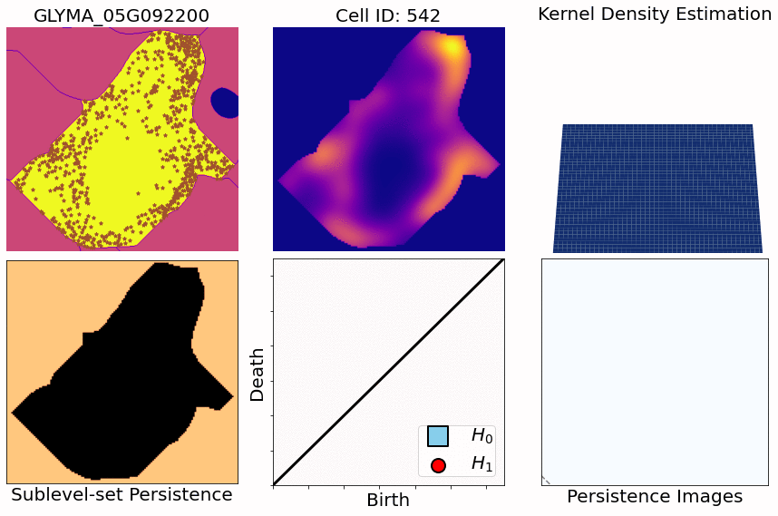

```{r setup, include=FALSE}
library(knitr)
library(magrittr)
genes = c('GLYMA_17G195900', 'GLYMA_05G216000', 'GLYMA_17G185800', 'GLYMA_05G203100', 'GLYMA_15G210100', 'GLYMA_05G092200')
options(htmltools.dir.version = FALSE)
knitr::opts_chunk$set(echo = FALSE)
knitr::opts_chunk$set(fig.align = 'center')
```

Erik Am&eacute;zquita &mdash; MS79: Characterizing Single-Cell Transcriptomic Signatures with TDA

# Different **genes** in different **cells** follow different **spatial patterns** of expression

.pull-left[


Some genes seem uniformly distributed
]

.pull-right[


Other genes are more ring-like
]

---

class: inverse, center

Erik Am&eacute;zquita &mdash; MS79: Characterizing Single-Cell Transcriptomic Signatures with TDA

# Understanding cell-gene **spatial patterns** will further our biological knowledge

```{r, out.width=300}
knitr::include_graphics("../figs/Infected_Cells_01G164600_green_05G092200_yellow.jpg")
```

--

# But how do we **quantify** these patterns?


---

Erik Am&eacute;zquita &mdash; MS79: Characterizing Single-Cell Transcriptomic Signatures with TDA

# We use **Topological Data Analysis** (TDA)!

