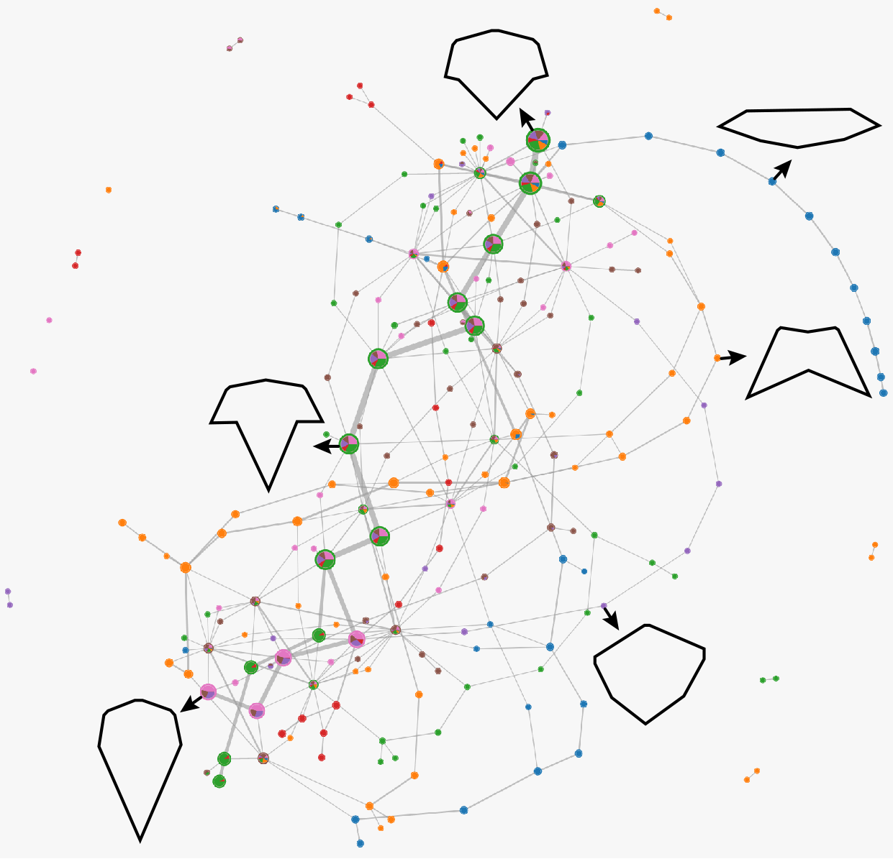
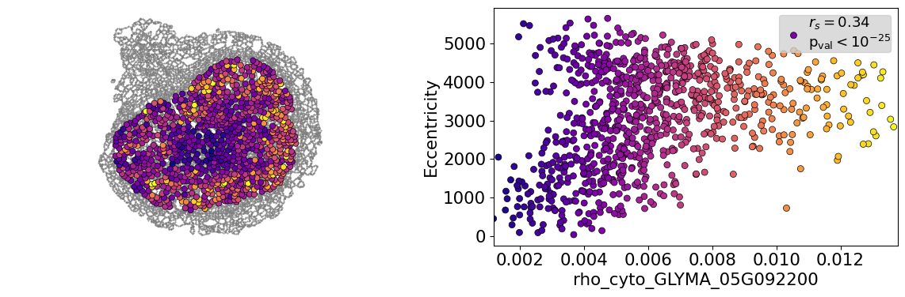
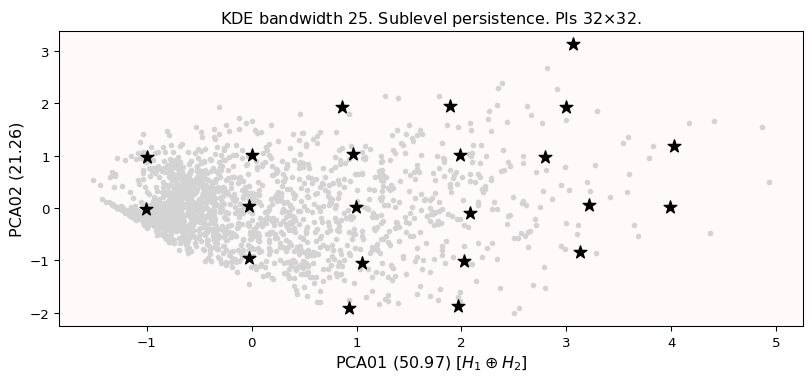

```{r setup, include=FALSE}
library(knitr)
library(magrittr)
genes = c('GLYMA_17G195900', 'GLYMA_05G092200')
options(htmltools.dir.version = FALSE)
knitr::opts_chunk$set(echo = FALSE)
knitr::opts_chunk$set(fig.align = 'center')
```

# Shape has data, and data has shape

<div class="row">
  <div class="column" style="max-width:19%">
    </img>
    </img>
  </div>
  <div class="column" style="max-width:39%">
    <iframe width="375" height="210" src="https://www.youtube-nocookie.com/embed/LxNSbrfq3kY?si=Qw9qv3Og1XcPIUyg" title="YouTube video player" frameborder="0" allow="accelerometer; autoplay; clipboard-write; encrypted-media; gyroscope; picture-in-picture; web-share" allowfullscreen></iframe>
    </img>
  </div>
  <div class="column" style="max-width:41%">
    </img>
    </img>
  </div>
</div>

---

# We use Topological Data Analysis (TDA)!


---

background-image: url("../../demat/figs/fam9_3.png")
background-size: 100px
background-position: 98% 2%

# From MX to MI to MO at MU

## I work across multiple disciplines and countries

.left-column[

]

.right-column[
- 2013 - 2018 : Licenciatura (Bachelor): Math @ at the Universidad de Guanajuato and CIMAT. Thesis focused on Topological Data Analysis.

- 2018 - 2023 : PhD: Computational Mathematics, Science, and Engineering @ Michigan State University. Dissertation: Exploring the mathematical shape of plants. **Came for the math. Stayed for the plants.**

- 2023 - Present : PFFIE Postdoc Fellow @ Division of Plant Science & Technology (80%) / Department of Mathematics (20%) at MU

]

---


# My research: Crossing and merging bridges

<div class="row">
  <div class="column" style="max-width:21%">
    <a href="https://doi.org/10.1002/ppj2.20095" target="_blank"></a>
  </div>
  <div class="column" style="max-width:20%">
    <a href="https://doi.org/10.1007/s00299-024-03337-1" target="_blank"></a>
  </div>
  <div class="column" style="max-width:21%">
    <a href="https://doi.org/10.1002/ppj2.20095" target="_blank"></a>
  </div>
  <div class="column" style="max-width:30%">
    <a href="https://doi.org/10.1371/journal.pone.0284820" target="_blank"></a>
  </div>
</div>

<div class="row">
  <div class="column" style="max-width:50%">
    
    
  </div>
  <div class="column" style="max-width:40%">
    <a href="https://doi.org/10.1101/2022.10.15.512190" target="_blank"></a>
  </div>
</div>

<div class="list" style="font-size: 10px; text-align: left;">
    <ul>
      <li>M. Bentelspacher, <strong>E.J.A.</strong>, S. Adhikari, J. Barros, S.Y. Park (2024) The early dodder gets the host: Decoding the coiling patterns of Cuscuta campestris with automated image processing.</li>
      <li><strong>E.J.A</strong>, M.Y. Quigley, P.J. Brown, E. Munch, D.H. Chitwood (2024) Allometry and volumes in a nutshell: Analyzing walnut morphology using three-dimensional X-ray computed tomography.</li>
      <li><strong>E.J.A.</strong>, F. Nasrin, K.M. Storey, M. Yoshizawa (2023) Genomics data analysis via spectral shape and topology.</li>
      <li>S.A. Cervantes-Pérez <em>et al.</em> (2024) Tabula Glycine: The whole-soybean single-cell resolution transcriptome atlas. Submitted.</li>
      <li>Z. Ji, <strong>E.J.A</strong>, L. Newton, D.H. Chitwood, A.M. Thompson (2024) From hand measurements to high throughput phenotyping: understanding maize canopy structure and predicting yield. Submitted.</li>
    </ul>
</div>

---

# Phenotyping the shape of things to come

<div class="row" style="font-family: 'Yanone Kaffeesatz'; font-size:22px;">
  <div class="column" style="max-width:33%">
    <p style="line-height:0;text-align: center; font-size:28px">Phenotyping patterns</p>
    </img>
    </img>
    <p style="text-align: center;">mRNA sub-cellular localization in soybean nodule cells.</p>
  </div>
  <div class="column" style="max-width:33%">
    <p style="line-height:0;font-size:28px;text-align: center;">Phenotyping movement</p>
    </img>
    </img>
    <p style="text-align: center;">Tracking and describing <i>Cuscuta campestris</i> circumnutation</p>
  </div>
  <div class="column" style="max-width:33%">
    <p style="line-height:0;font-size:28px;text-align: center;">Phenotyping data</p>
    </img>
    </img>
    <p style="text-align: center;">Reducing <strong>and</strong> clustering high-dimensional omics data</p>
  </div>
</div>

---

class: inverse, middle, center

# 1. Characterizing spatial patterns and distributions

## with Topological Data Analysis (TDA)

### The significance of detecting connected components and holes

---

# mRNA localization FTW

- **Another regulational mechanism**: Spatial segregation and asymmetrical distribution of mRNA.

- Observed various spatial patterns across animal and plant species.

.pull-left[

Infected soybean nodule cells. Glyma.05G092200 in green. Glyma.05G216000 in red.
]

.pull-right[

- Energetically more efficient to transport mRNA than a whole protein

- Efficient protein complex assembly

- Prevent proteins from reaching the wrong cellular compartment

- Subcellular localization influences proteome architecture and adaptation

- mRNA can exert fuctions beyond the protein they encode
]

---

# Grand goal with Molecular Cartography&trade;


- 97 genes (including 10 bacterial ones) &rarr; 2 genes
- 2938 cells &rarr; 918 infected ones.

**Subcellular transcript patterns &harr; spatial location of the cell within the nodule**

---

# Traditional model: Density of transcripts




But this characterization discards sub-cellular information!

---

class: inverse, middle, center

# Alternate model: Topological Data Analysis


---

```{r include=FALSE, evaluate=FALSE}
slides_info <- tibble::tibble(first  = formatC(0:11, digits=1, format='d', flag='0'))

slides_text <- glue::glue_data(
  slides_info,
  "
  # TDA: Keep track of blobs and holes
  
  
  
  "
)
```

`r slides_text %>% paste(collapse = "\n---\n")`

---

background-image: url("../figs/bw25_scale32_-_PI_1_1_1_H1+2_cell_sample.png")
background-size: 620px
background-position: 75% 99%

# PCA on all topological descriptors

```{r, out.width=350, fig.align='left'}
knitr::include_graphics(c('../figs/bw25_both_scale16_-_PI_1_1_1_pca_H1+2_gridded.png'))
```

---

background-image: url("../figs/bw25_scale32_-_PI_1_1_1_H1+2_kde_sample.png")
background-size: 620px
background-position: 75% 99%

# Show me

```{r, out.width=350, fig.align='left'}
knitr::include_graphics(c('../figs/bw25_both_scale16_-_PI_1_1_1_pca_H1+2_gridded.png'))
```

---

# Connecting PC 02 to the biological context


- Senescent cells exhibit a distinct transcriptomic spatial pattern compared to the rest of population.
- Loss of mRNA localization may be a lesser known contributor to cell senescence.

---

# We define a morphospace of transcriptomic patterns



# We then work "backward"

---

class: bottom

background-image: url("../figs/scale32_-_PI_1_1_1_H1+2_synthetic_30_clusters.jpg")
background-size: 900px
background-position: 50% 1%

```{r, out.width=600}
knitr::include_graphics(c('../figs/scale32_-_PI_1_1_1_H1+2_synthetic_pca_30_clusters.jpg'))
```

---

class: bottom

background-image: url("../figs/scale32_-_PI_1_1_1_H1+2_synthetic_varclusters.jpg")
background-size: 900px
background-position: 50% 1%

```{r, out.width=600}
knitr::include_graphics(c('../figs/scale32_-_PI_1_1_1_H1+2_synthetic_pca_varclusters.jpg'))
```

---

# Discussion

**Biologically speaking**

- Senescent cells exhibit a distinct transcriptomic spatial pattern compared to the rest of population.
- Loss of mRNA localization may be a lesser known contributor to cell senescence.

**Mathematically speaking**

- Topological Data Analysis offers a robust way to encode the *shape of patterns*
- Robust to differences in scale, underlying boundaries, or orientation
- Adaptable to other patterns: Canopy patterns, Cover crop patterns, Species spatial distributions?

```{r, out.width=550}
knitr::include_graphics(c('../figs/D2_GLYMA_05G092200_z_kde_pd_suplevel_by_both_00512.jpg'))
```

---

class: center, inverse, middle

# 2. Tracking how a vampire plant wiggles

```{r, out.width=400}
knitr::include_graphics(c('../../cuscuta/figs/bentelspacher_etal2024.png'))
```

---

# _Cuscuta_ : a vegetarian plant

```{r, out.width="700px"}
knitr::include_graphics(c('https://media.springernature.com/full/springer-static/image/art%3A10.1038%2Fs41467-018-04344-z/MediaObjects/41467_2018_4344_Fig1_HTML.jpg?as=webp'))
```
<p style="font-size: 10px; text-align: center; color: Grey;">Credits: <a href="https://doi.org/10.1038/s41467-018-04344-z">Vogel <em>et al.<em> (2018)</a></p>

---

# Snapshots taken every 96 secs for 24h

<video width="900" controls>
  <source src="../../cuscuta/video/9am_Inc_Rep_3_redone.mp4" type="video/mp4">
</video>

- Study how _Cuscuta_ moves to ultimately stop it from attaching to crops in the first place.

---

# Putting it all together
  
<video width="900" controls>
  <source src="../../cuscuta/video/4pm_rep7_plant_01.mp4" type="video/mp4">
</video>

---

# Automated phenotyping

```{r, out.width="700px"}
knitr::include_graphics(c('../../cuscuta/figs/4pm_rep7_plant_02_posang.png',
                          '../../cuscuta/figs/cuscuta_tracking.png'))
```

---

# Differences: Intiation and completion

```{r, out.width=575}
knitr::include_graphics(c('../../cuscuta/figs/time_after_inoculation.svg',
                          '../../cuscuta/figs/time_to_complete_coiling.svg'))
```


- Cuscuta at 4pm takes longer to get going and then to reach a stable position

---

# Discussion


**Biologically speaking**

- Cuscuta can tell time despite lacking photoreceptors.
- It prefers to act in the morning/early afternoon.

**Computationally speaking**

- Overall, the automated image analysis criteria agreed with the main conclusions drawn from the manual observation criteria. 
- Our pipeline is ready to collect more data
- Phenotype the wiggle itself under various environmental conditions?

---

background-image: url("../../cuscuta/figs/cuscuta_coords.jpg")
background-size: 450px
background-position: 95% 25%

# Future directions

.pull-left[
- F
- F
- F
- F
- F
- F
- F
- F
- F
- F
]


---

class: center, middle inverse

# 3. Phenotyping data itself

## Omics data analysis with topology

```{r, out.width=400, fig.align='center'}
knitr::include_graphics('../../nasrin/figs/amezquita_etal_2023.png')
```

---

# Setup

- FPKM counts of RNAseq data from human lung tissue &rarr; 19,648 genes
    - 314 healthy samples (GTEx)
    - 500 cancerous samples (TCGA)

- Considered Z-scores drawn from a Gaussian Mixture Model (GMM).


---

# With tSNE/UMAP we can split the data

- tSNE (or UMAP) separates healthy vs cancerous samples (blue vs red)
   - (a): Using FPKM
   - (b): Using GMM Z-scores


## Can we go from clusters to continua?

---

background-image: url("../../tda/figs/mapper_b_00.svg")
background-size: 725px
background-position: 50% 95%

# Mapper 

## Topological summary: exploration and visualization

- We start with **lots** of data points $X$ in a **high-dimensional** space

- We want just a **handful** of points in a **low-dimensional** space that roughly preserve the original **shape**

---

background-image: url("../../tda/figs/mapper_c_complete.svg")
background-size: 525px
background-position: 50% 99%

# Mapper in a single picture

---

# Notice that cancerous samples are split

.pull-left[


]

.pull-right[
- Mapper produced mostly strand-like graphs regardless of parameters used

- Position Index for each subject: 
    - **`-1`**: subject is part of the 13 leftmost nodes
    - **`+1`**: subject is part of the 13 rightmost nodes

- Healthy subjects tend to stay at the center

- Cancerous samples are distributed at both ends
]

---

# Biological significance


---

# Future perspectives and Conclusions

.pull-left[
Maintained python libraries to compute mapper

- [Giotto-tda](https://github.com/giotto-ai/giotto-tda)
- [KeplerMapper](https://kepler-mapper.scikit-tda.org/en/latest/)


Data visualization to inspire new research

]

.pull-right[
Plenty of untapped potential in plant genomics


Agnostic to any kind of omics data
]


---

background-image: url("https://bondlsc.missouri.edu/wp-content/uploads/2015/02/sanborn-620x413.jpg")
background-size: 500px
background-position: 50% 95%

class: inverse, center

# 4. Potential future directions

## TDA to bridge the genotype-phenotype gap

## TDA to bridge the biology-mathematics gap

### Mizzou, NextGen, and the IPG have all the resources needed to make sense of data in a high-throughput manner

---

# Comprehensive root phenotyping

.pull-left[


Potential collaborators @ Mizzou

- Felix Fritschi
- David Mendoza-Cozatl
- Jacob Washburn (USDA)

Potential collaborators around MO

- Erin Chambers (SLU)
- Tao Ju (WUSTL)
- Mao Li & Chris Topp (Danforth)

]

.pull-right[
```{r, out.width=225}
knitr::include_graphics(c('../../psd/figs/Maiz_root_Dario.jpeg'))
```
<p style="font-size: 10px; text-align: right; color: Grey;"> Credits: Mendoza-Cozatl</p>


<p style="font-size: 10px; text-align: right; color: Grey;"> Credits: <a href="https://doi.org/10.1186/s13007-021-00829-z">Zeng <em>et al.</em> (2021)</a></p>

]

---

## Fungal network features as functional traits

.pull-left[


<p style="font-size: 10px; text-align: right; color: Grey;"> Credits: <a href="https://www.slcu.cam.ac.uk/news/new-method-quantify-arbuscular-mycorrhizal-fungi-amf-colonisation-plant-roots">SLCU</a></p>

Quantify arbuscular mycorrhizal fungi (AMF) colonisation patterns of plant roots.

Potential collaborators @ Mizzou

- Heike Buecking
- Gary Stacey

External potential collaborators

- Mason Porter (UCLA)

]

.pull-right[

<p style="font-size: 10px; text-align: right; color: Grey;"> Credits: <a href="https://doi.org/10.1093/comnet/cnv034">Hoon Lee <em>et al.</em> (2017)</a></p>
]


---

# Quantifying the shape of cellular patterns

.pull-left[


The **Molecular Cytology Core** at the **Bond Life Science Center** offers state-of-the-art microscopy imaging and resources.

Potential collaborators @ Mizzou

- Ron Mittler
- Melvin Oliver
- Robert Sharp

External potential collaborators

- Pau Formosa-Jordan (MPIPZ)

]

.pull-right[

```{r, out.width=250}
knitr::include_graphics(c('../../psd/figs/pavement_plasma.jpg', '../../psd/figs/bw_pavement_geometry_area.gif'))
```

]

---

# Omics networks also have shape!

.pull-left[


The **Genomics Technology Core**, the **Gehrke Proteomics Center**, and the **Metabolomics Center** will provide detailed omics network data, from which further structure can be inferred.

Potential collaborators @ MU


- Ruthie Angelovici
- Trupti Joshi
- Andrew Scaboo

]

.pull-right[


<p style="font-size: 10px; text-align: right; color: Grey;"> Credits: <a href="https://doi.org/10.1101/2022.09.07.506951">Palande <em>et al.</em> (2022)</a></p>

]

---

# The intricacies of protein shape

.pull-left[


The **Electron Microscopy Core** at the **NextGen Precision Health building** offers state-of-the-art Cryo-EM resources for protein imaging.

Potential collaborators @ MU

- Jianlin Cheng
- Brian Mooney
- Dong Xu

]

.pull-right[


<p style="font-size: 10px; text-align: right; color: Grey;"> Credits: <a href="https://doi.org/10.1371/journal.pcbi.1010045">Tang <em>et al.</em> (2022)</a></p>


]

---

background-image: url("../../tutorials/figs/PlantsPythonQR.jpg")
background-size: 350px
background-position: 50% 95%

class: inverse, center

# Plants & Python

## Large amounts of data require large amounts of people

## Freely available at [bit.ly/plantspython](https://plantsandpython.github.io/PlantsAndPython/00_Opening_page.html)


---

background-image: url("https://plantsandpython.github.io/PlantsAndPython/_images/plants_python_logo.jpg")
background-size: 180px
background-position: 99% 1%

## Python taught especifically for plant biologists

<p align="center">
<iframe width="800" height="500" src="https://plantsandpython.github.io/PlantsAndPython/00_Opening_page.html" title="Plants and Python">
</iframe>
</p>
<p style="font-size: 8px; text-align: right; color: Grey;"><a href="https://plantsandpython.github.io/PlantsAndPython/00_Opening_page.html">Original link</a></p>

---

background-image: url("../../tutorials/figs/plantspython22_02.png")
background-size: 180px
background-position: 99% 1%

# Hybrid class format

.pull-left[

- Offered in hybrid format between MSU and UNAM

- 3-credit course during Fall semester

- **HRT 841**: Foundation in Computational and Plant Science

- **UNAM Temas Selectos**: Bioinformática y Minería de Datos con Python

- Freely available material in jupyter notebook format.

- Material in English and Spanish.

]

.pull-right[


]


---

## Empower students to lead cutting-edge research

.pull-left[
Large amounts of data require large amounts of people

Build off SPIP (Small Plant Imaging Platform) a hands-on class experience.

MU's Engineering and Information Technology Program hosts faculty with advanced pedagogical knowledge and skills to enrich the project.

Potential collaborators @ MU

- Brian Maurer
- Dale Musser
- Jon Stemmle

]

.pull-right[

Plants&Python 2019
```{r, out.width=250}
knitr::include_graphics(c('https://bsapubs.onlinelibrary.wiley.com/cms/asset/d5c10e59-0479-4be0-a19e-fddb0ef49ef0/aps311404-fig-0004-m.jpg'))
```
<p style="font-size: 10px; text-align: right; color: Grey;"> Credits: <a href="https://doi.org/10.1002/aps3.11404">Bryson <em>et al.</em> (2020)</a></p>

Plants&Python 2020
```{r, out.width=250}
knitr::include_graphics(c('https://www.biorxiv.org/content/biorxiv/early/2022/09/09/2022.09.07.506951/F1.large.jpg?width=800&height=600&carousel=1'))
```
<p style="font-size: 10px; text-align: right; color: Grey;"> Credits: <a href="https://doi.org/10.1101/2022.09.07.506951">Palande <em>et al.</em> (2022)</a></p>
]

---


background-image: url("../../img/phd_institutional_logos.jpg")
background-size: 500px
background-position: 95% 1%

class: inverse

## Thank you!

<div class="row" style="margin-top: -25px;">
  <div class="column" style="max-width:19.5%; font-size: 13px;">
    
    <p style="text-align: center; color: White">Liz Munch<br>(MSU)</p>
    
    <p style="text-align: center; color: White">Tim Ophelders<br>(Utrecht)</p>
    
    <p style="text-align: center; color: White">Jacob Landis<br>(Cornell)</p>
  </div>
  <div class="column" style="max-width:19.5%; font-size: 13px;">
    
    <p style="text-align: center; color: White">Dan Chitwood<br>(MSU)</p>
    
    <p style="text-align: center; color: White">Michelle Quigley<br>(MSU)</p>
    
  </div>
  <div class="column" style="max-width:14%; font-size: 13px;">
  
  <p style="text-align: center; color: White">Dan Koenig<br>(UC Riverside)</p>
  
  <p style="text-align: center; color: White">Danelle Seymour<br>(UC Riverside)</p>
  <p style="text-align: left; color: Yellow; font-size:24px; line-height: 1em;">&larr; Grab &larr; these &larr; slides</p>
  </div>
  <div class="column" style="width:10%; font-size: 24px;">
  </div>
  <div class="column" style="max-width:30%; font-size: 24px; line-height:1.25">
  <p style="text-align: center; color: White"><strong>Email</strong></p>
  <p style="text-align: center; color: Yellow">amezqui3@msu.edu</p>
  <p style="text-align: center; color: White"><strong>Slides</strong></p>
  <p style="text-align: center; color: Yellow">bit.ly/mu_22</p>
  <p style="text-align: center; color: White"><strong>References</strong></p>
  <p style="text-align: center; color: White; font-size: 12px; text-align:left">
    <strong>E.A.</strong> <em>et al.</em> (2022) The shape of aroma: measuring and modeling citrus oil gland distribution. <a href="https://doi.org/10.1002/ppp3.10333" target="_blank">DOI: 10.1002/ppp3.10333</a>
  </p>
  <p style="text-align: center; color: White; font-size: 12px; text-align:left">
    <strong>E.A.</strong> <em>et al.</em> (2021) Measuring hidden phenotype: Quantifying the shape of barley seeds using the Euler Characteristic Transform. <a href="https://doi.org/10.1093/insilicoplants/diab033" target="_blank">DOI: 10.1093/insilicoplants/diab033</a>
  </p>
  <p style="text-align: center; color: White; font-size: 12px; text-align:left">
    VanBuren, R. <em>et al.</em> (2022) Plants & Python: A series of lessons in coding, plant biology, computation, and bioinformatics. <a href="https://doi.org/10.1093/plcell/koac187" target="_blank">DOI: 10.1093/plcell/koac187</a>
  </p>
    <p style="text-align: center; color: White; font-size:15px; line-height:1.1">Slides made in <a href="https://bookdown.org/yihui/rmarkdown/xaringan.html" target="_blank">xaringan</a>.</p>
  </div>
</div>
