```{r setup, include=FALSE}
library(knitr)
library(magrittr)
genes = c('GLYMA_17G195900', 'GLYMA_05G092200')
options(htmltools.dir.version = FALSE)
knitr::opts_chunk$set(echo = FALSE)
knitr::opts_chunk$set(fig.align = 'center')
```

# Shape has data, and data has shape

<div class="row">
  <div class="column" style="max-width:19%">
    </img>
    </img>
  </div>
  <div class="column" style="max-width:39%">
    <iframe width="375" height="210" src="https://www.youtube-nocookie.com/embed/LxNSbrfq3kY?si=Qw9qv3Og1XcPIUyg" title="YouTube video player" frameborder="0" allow="accelerometer; autoplay; clipboard-write; encrypted-media; gyroscope; picture-in-picture; web-share" allowfullscreen></iframe>
    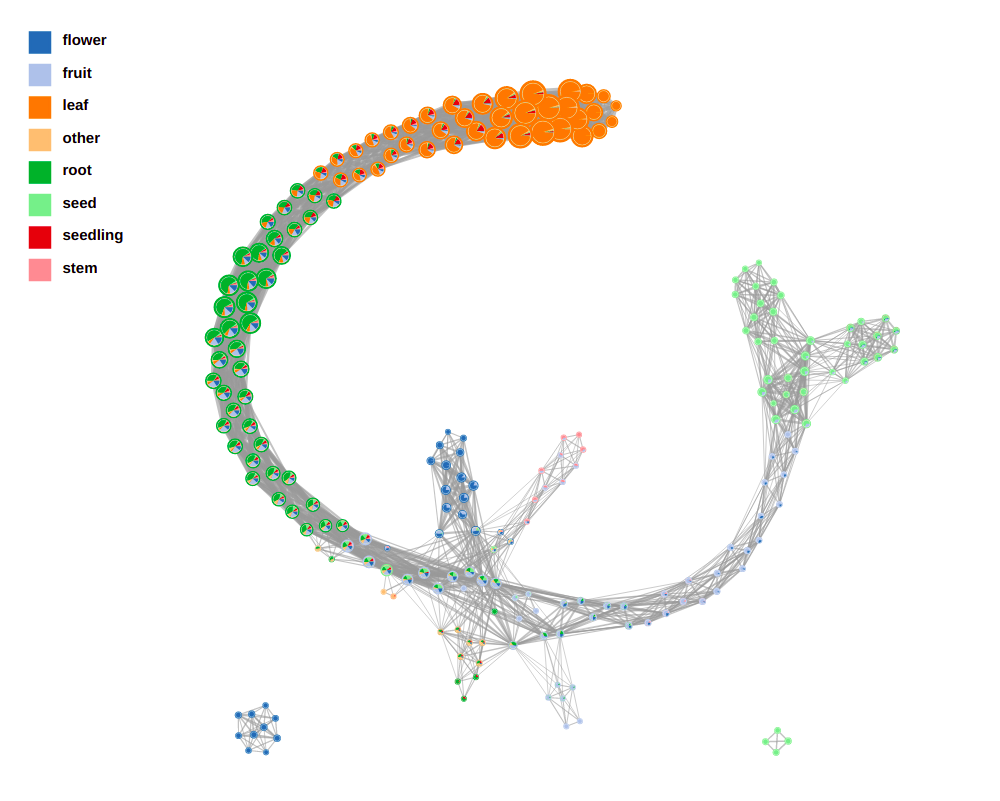</img>
  </div>
  <div class="column" style="max-width:41%">
    </img>
    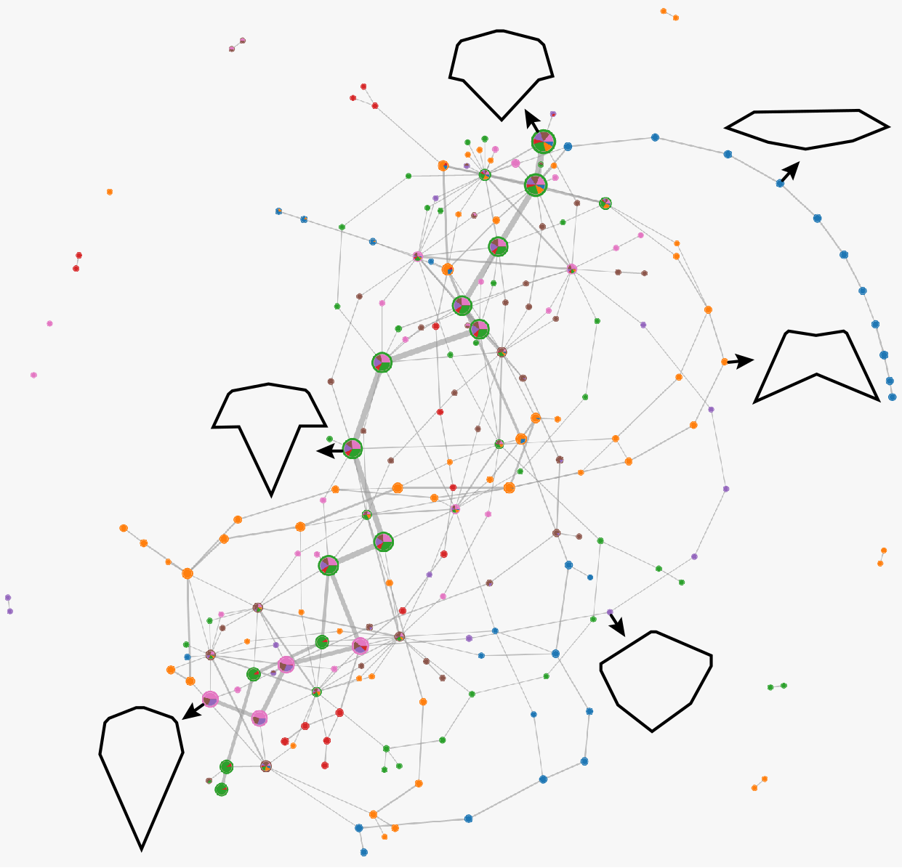</img>
  </div>
</div>

---

# We use Topological Data Analysis (TDA)!


---

background-image: url("../../demat/figs/fam9_3.png")
background-size: 100px
background-position: 98% 2%

# From MX to MI to MO at MU

.left-column[
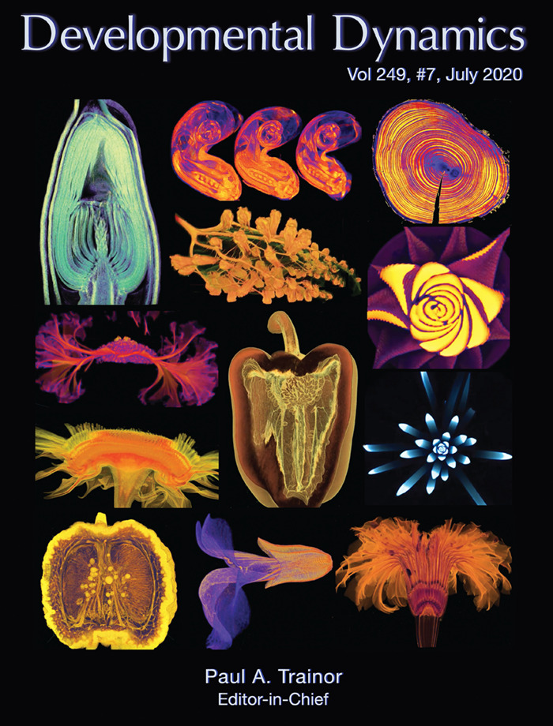
]

.right-column[
- 2013 - 2018 : Licenciatura (Bachelor): Math @ at the Universidad de Guanajuato and CIMAT. Thesis focused on Topological Data Analysis.

- 2018 - 2023 : PhD: Computational Mathematics, Science, and Engineering @ Michigan State University. **Came for the math. Stayed for the plants.**

- 2023 - Present : PFFIE Postdoc Fellow @ Division of Plant Science & Department of Mathematics at Mizzou

]

---

class: inverse, middle, center

# Topological Data Analysis

## A primer

---

# 1st TDA Ingredient: Complexes

- Think the data as a collection of elementary building blocks ( _simplices_ )

Vertices | Edges | Faces | Tetrahedra
---------|-------|-------|-------
  0-dim  | 1-dim | 2-dim | 3-dim

- A collection of cells is a _simplicial complex_

- Count the number of topologically invariant features ( _holes_ ):

Connected components | Loops | Voids
---------------------|-------|-------
       0-dim         | 1-dim | 2-dim

- Example with 3 connected components, 1 loop, 1 voids

```{r, out.width=350}
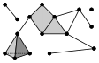
```

---

# 2nd TDA Ingredient: Filters

- Each cell is assigned a real value which defines how the complex is constructed.

- Observe how the number of topological features change as the complex grows.

.pull-left[
```{r, out.width="250px"}
knitr::include_graphics(c("../../barley/figs/eigcurv_filter.gif", "../../barley/figs/gaussian_density_filter.gif"))
```
]

.pull-right[
```{r, out.width="250px"}
knitr::include_graphics(c("../../barley/figs/eccentricity_filter.gif", "../../barley/figs/vrips_ver2.gif"))
```
]

---

# Ye olde simplicial homology *with* time

- A *filtration* of simplicial complex $\mathbf K$ is a collection of nested subcomplexes $\mathbf K_0\subset\mathbf K_0\subset\ldots\subset\mathbf K_m=\mathbf K$.

```{r, out.width=400}
knitr::include_graphics("https://www.frontiersin.org/files/Articles/637684/fphys-12-637684-HTML/image_m/fphys-12-637684-g003.jpg")
```

- We have canonical inclusions $\iota_{i,j}:\mathbf K_i\to\mathbf K_j$.

- We see that $\iota_{i,k} = \iota_{j,k}\circ\iota_{i,j}$ for any $0\leq i\leq j\leq k\leq m$.

- (Abusing notation) These correspond to inclusions $\iota_{i,j}:H_q(\mathbf K_i)\to H_q(\mathbf K_j)$ for $q=0,1,2,\ldots$.

- The $(i,j)$-th persistent $q$-th homology group is $H_{i,j;q}(\mathbf K) = \text{Im}\,(\iota_{i,j})$.

- It's dimension is the $(i,j)$-th persistent $q$-th Betti number, $\beta_{i,j;q}(\mathbf K)$.

- A class $\alpha\in H_q(\mathbf K_i)$ *is born* at time $i$ if $\alpha\notin H_{i-1,i;q}(\mathbf K)$.

- This class $\alpha\in H_q(\mathbf K_j)$ *dies* at time $j+1$ if $\iota_{j,j+1}(\alpha)\in H_{i,j;q}(\mathbf K)$.

---

class: inverse, middle, center

# An example later will make this much clearer

---

# TDA + Biology in the literature

<div class="row">
  <div class="column" style="max-width:25%">
    
    
    <p style="font-size: 10px; text-align: right; color: Grey;"> Credits: <a href="https://doi.org/10.1016/j.media.2019.03.014">Qaiser <em>et al.</em> (2019)</a></p>
  </div>
  <div class="column" style="max-width:25%">
    
    
    <p style="font-size: 10px; text-align: right; color: Grey;"> Credits: <a href="https://doi.org/10.1073/pnas.1313480110">Chan <em>et al.</em> (2013)</a></p>
  </div>
  <div class="column" style="max-width:22%">
    
    
    
    <p style="font-size: 10px; text-align: right; color: Grey;"> Credits: <a href="https://doi.org/10.1515/sagmb-2015-0057">Kovacev-Nikolic <em>et al.</em> (2016)</a></p>
  </div>
  <div class="column" style="max-width:28%">
    
    <p style="font-size: 10px; text-align: right; color: Grey;"> Credits: <a href="https://doi.org/10.1007/978-3-030-20867-7_7">Chitwood <em>et al.</em> (2019)</a></p>
  </div>
</div>

<div class="row" style="font-family: 'Yanone Kaffeesatz'; font-size:25px;">
  <div class="column" style="width:25%;">
    <p style="text-align: center;">Holes</p>
    <p style="text-align: center;">&darr;</p>
    <p style="text-align: center;">Cancerous tissue</p>
  </div>
  <div class="column" style="width:25%;">
    <p style="text-align: center;">Holes</p>
    <p style="text-align: center;">&darr;</p>
    <p style="text-align: center;">Horizontal Reassortment</p>
  </div>
  <div class="column" style="width:25%;">
    <p style="text-align: center;">Holes</p>
    <p style="text-align: center;">&darr;</p>
    <p style="text-align: center;">Open/closed conformations</p>
  </div>
  <div class="column" style="width:25%;">
    <p style="text-align: center;">Components</p>
    <p style="text-align: center;">&darr;</p>
    <p style="text-align: center;">Panicle structure</p>
  </div>
</div>

---

class: inverse, middle, center

# [1] mRNA localization

# Molecular Cartography&trade; 

### &amp; 

# Kernel Density Estimators (KDEs)

[2] Quantify these heatmaps via Topological Data Analysis (TDA)

[3] Link back to biological context

---

# mRNA localization FTW

- **Another regulational mechanism**: Spatial segregation and asymmetrical distribution of mRNA.

- Observed various spatial patterns across animal and plant species.

.pull-left[
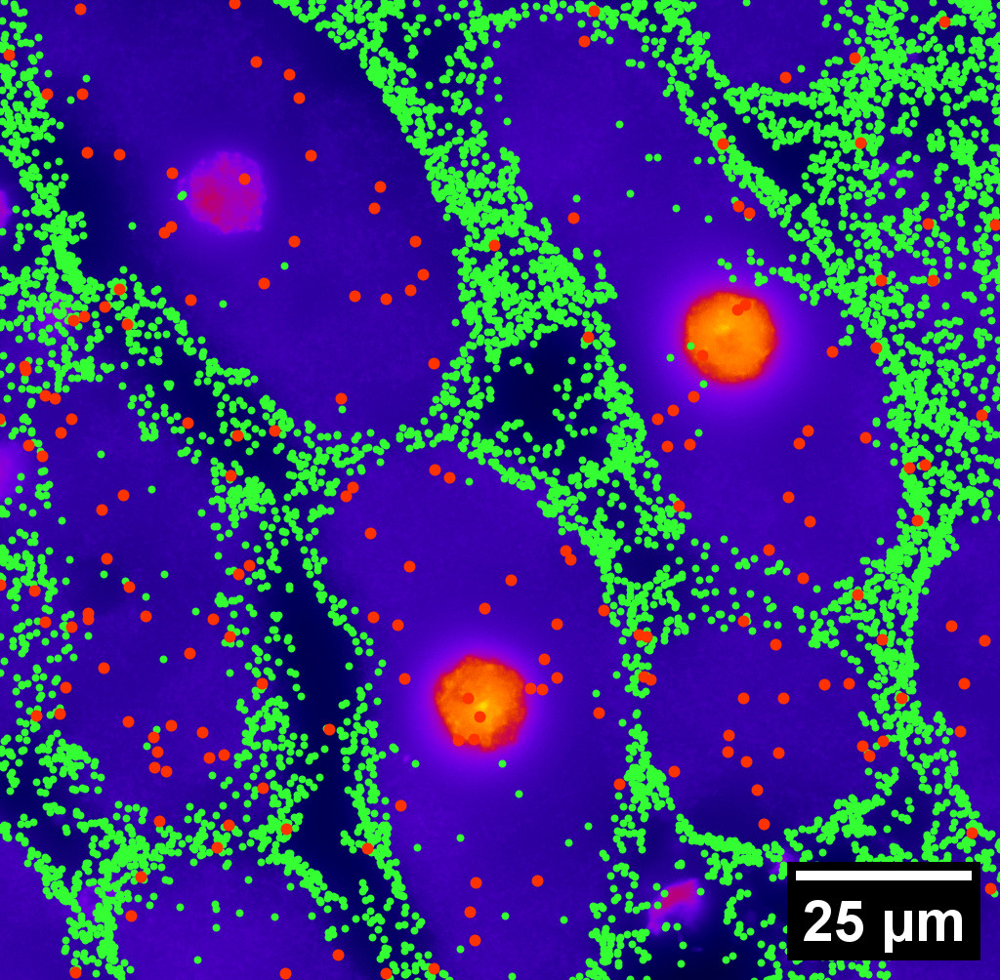
Infected soybean nodule cells. Glyma.05G092200 in green. Glyma.05G216000 in red.
]

.pull-right[

- Energetically more efficient to transport mRNA than a whole protein

- Efficient protein complex assembly

- Prevent proteins from reaching the wrong cellular compartment

- Subcellular localization influences proteome architecture and adaptation

- mRNA can exert fuctions beyond the protein they encode
]

---

# Molecular Cartography&trade;

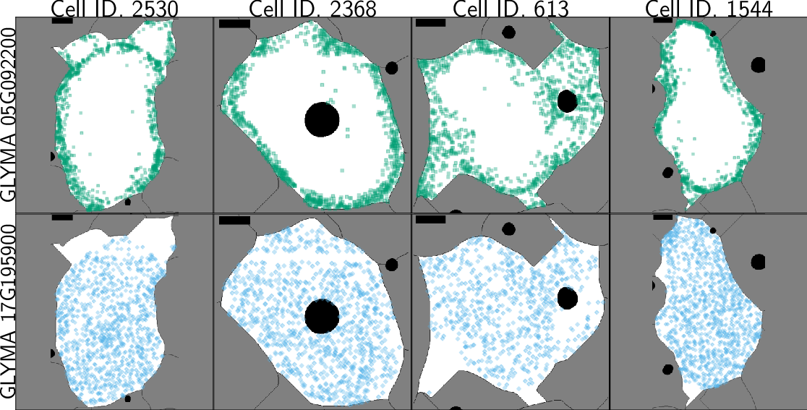

- Soybean nodule 10&micro;m thick cross-sections.
- (X,Y,Z) coordinates for 3.7M+ cytosolic transcripts.
- 97 genes (including 10 bacterial ones) &rarr; 2 genes
- 2938 cells &rarr; 918 infected ones.
- Considered 918 &times; 2 = 1836 cell-gene pairs

---

# Kernel Density Estimations (KDEs)

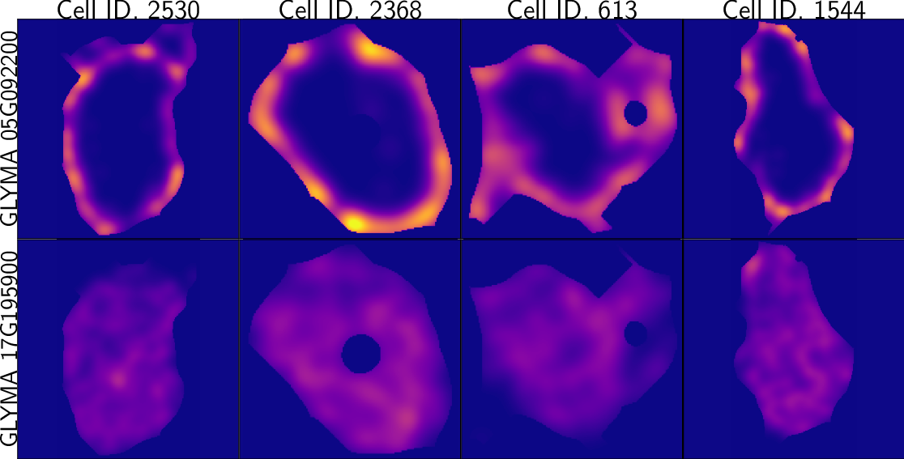

- **Normalize by cell AND gene:** The sum of all transcripts OF ALL genes add to 100%
    - Each gene adds to a certain percentage
    - The sum of all genes add to 100%
    - Compares absolute concentrations 
---


class: inverse, middle, center

[1] Molecular Cartography&trade; &amp; Kernel Density Estimations

# [2] Quantify the shape of these heatmaps

## Topological Data Analysis (TDA) and persistent homology

[3] Link back to biological context

---

# Keep track of blobs $H_0$ and holes $H_1$

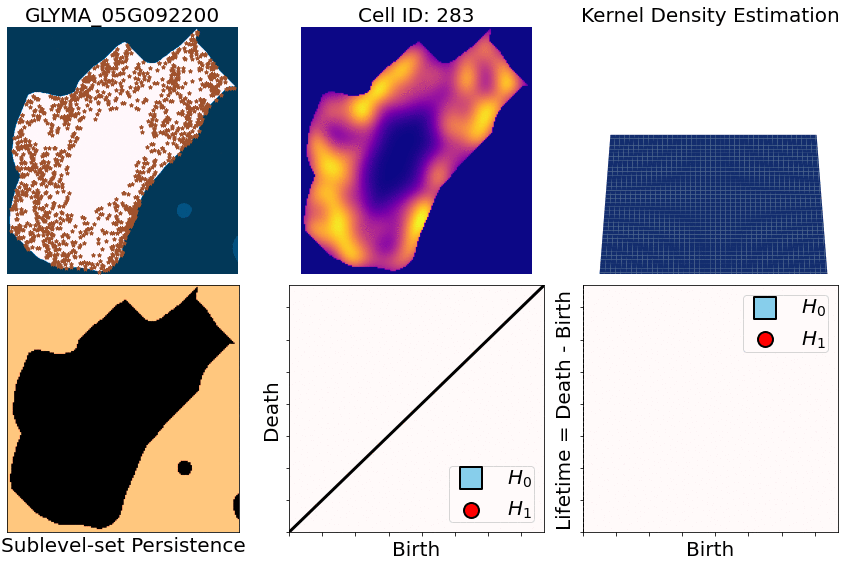

---

```{r include=FALSE, evaluate=FALSE}
slides_info <- tibble::tibble(first  = formatC(0:11, digits=1, format='d', flag='0'))

slides_text <- glue::glue_data(
  slides_info,
  "
  # Walking through an example
  
  
  
  "
)
```

`r slides_text %>% paste(collapse = "\n---\n")`

---

# Mathematical motivation: stability

- [**Theorem (Cohen-Steiner, Edelsbrunner, Harer, 2007)**](https://doi.org/10.1007/s00454-006-1276-5): Given a nice enough topological space $\mathbb{X}$ and two nice enough filtration functions $f,g:\mathbb{X}\to\mathbb{R}$, then
$$d_B(\text{dgm}(f), \text{dgm}(g)) \leq \|f-g\|_\infty,$$

- where $d_B$ is the bottleneck distance.

- **Translation**: If the original complex wiggles a tiny bit, then the elements of its related persistence diagram will wiggle only a tiny bit as well.


## However

- Outside stable distances, it is hard to do anything interesting in the space of persistence diagrams.

- E.g.: there are no unique means!

- Hard to perform Machine Learning directly with persistence diagrams

---

# Rotate 45 degrees for ML ammenability

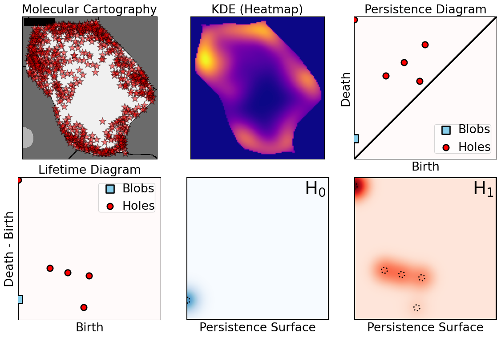

---

# From patterns to numbers

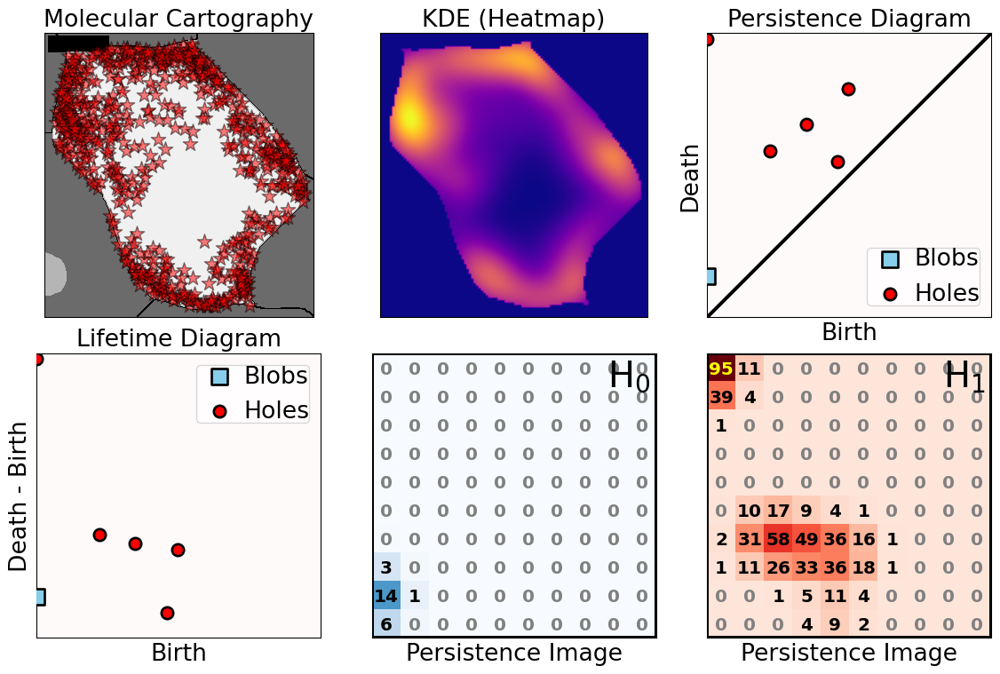

---

# We actually work with 3D data

- We keep track of blobs $H_0$, holes $H_1$, and voids $H_2$


<p style="font-size: 10px; text-align: right; color: Grey;"> Credits: <a href="https://commons.wikimedia.org/wiki/File:Earth_Internal_Structure.svg">Wikipedia</a></p>


---

# Mathematical justifications

- **Definition:** Given two persistence diagrams $D_1, D_2$, for $1\leq p<\infty$, we define the *p-Wasserstein* distance between them as
$$W_p(D_1, D_2) := \inf_{\gamma:D_1\to D_2}\left(\sum_{u\in D_1} \left\| u-\gamma(u) \right\|_\infty^p\right)^{1/p},$$
where the infimum is over all possible bijections $\gamma: D_1\to D_2$.

- **Theorem [[Mileyko *et al* (2011)](https://doi.org/10.1088/0266-5611/27/12/124007)]:** For nice filtrations, the persistence diagrams are Wasserstein-stable under small perturbations of the data they summarize.

- **Theorem [[Adams *et al.* (2017)](http://jmlr.org/papers/v18/16-337.html)]:** The persistence image $I(D)$ of a persistence diagram $D$ with Gaussian distributions is stable with respect to the 1-Wasserstein distance between diagrams.

### If the overall shape/pattern is perturbed a little bit, then the resulting persistence images are perturbed only a little bit as well

---

class: inverse, middle, center

[1] Molecular Cartography&trade; &amp; Kernel Density Estimations

[2] Quantify the shape of these heatmaps

# [3] Link back to biological context

## Never underestimate the power of PCA

---

# Do TDA for all cell-gene combinations

```{r, out.width=500}
knitr::include_graphics(c('../figs/molecular_cartography_2x4.png'))
```

```{r, out.width=600}
knitr::include_graphics(c('../figs/persistence_images_2x4.png'))
```

---

background-image: url("../figs/bw25_scale32_-_PI_1_1_1_H1+2_cell_sample.png")
background-size: 620px
background-position: 75% 99%

# PCA on all topological descriptors

```{r, out.width=350, fig.align='left'}
knitr::include_graphics(c('../figs/bw25_both_scale16_-_PI_1_1_1_pca_H1+2_gridded.png'))
```

---

background-image: url("../figs/bw25_scale32_-_PI_1_1_1_H1+2_kde_sample.png")
background-size: 620px
background-position: 75% 99%

# Show me

```{r, out.width=350, fig.align='left'}
knitr::include_graphics(c('../figs/bw25_both_scale16_-_PI_1_1_1_pca_H1+2_gridded.png'))
```

---

# Relate back to the biological context

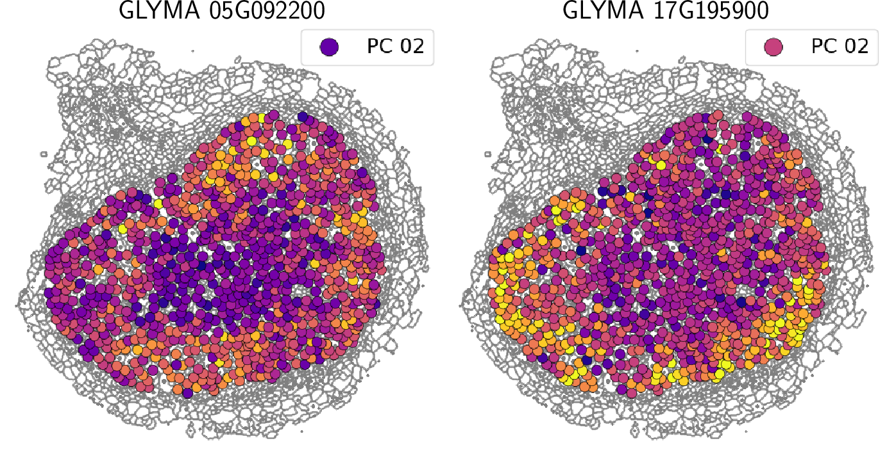

- Senescent cells exhibit a distinct transcriptomic spatial pattern compared to the rest of population.
- Loss of mRNA localization may be a lesser known contributor to cell senescence.

---

background-image: url("../figs/eccentricity_root_nodule.png")
background-size: 600px
background-position: 50% 95%

# Connecting features to eccentricity


---

background-image: url("../figs/eccentricity_root_nodule.png")
background-size: 300px
background-position: 99% 1%

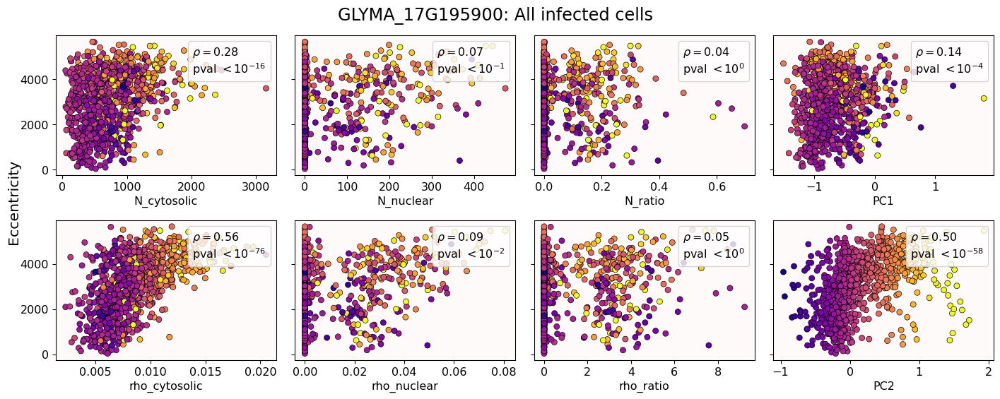

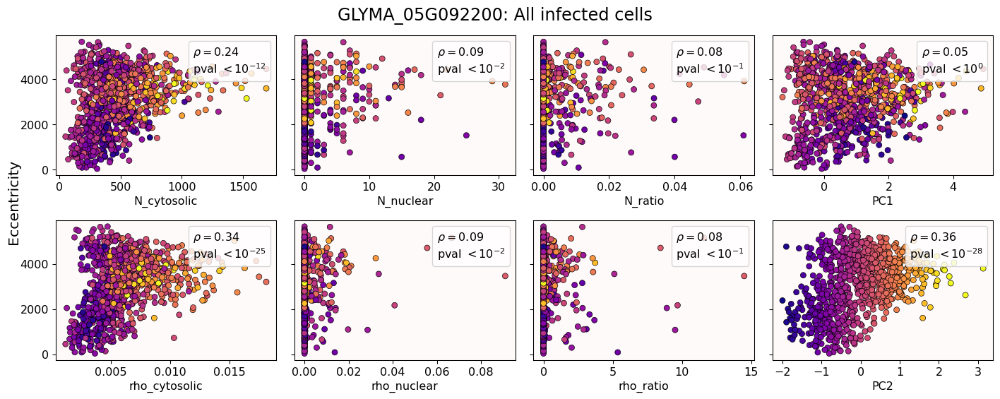

---

# What are the PCs measuring?

.pull-left[
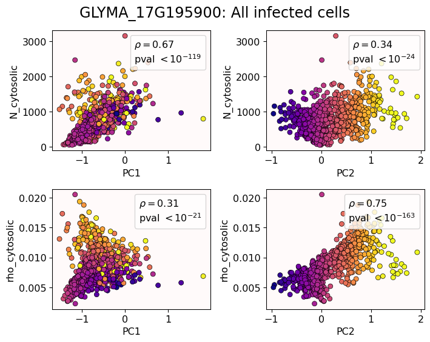
]

.pull-right[
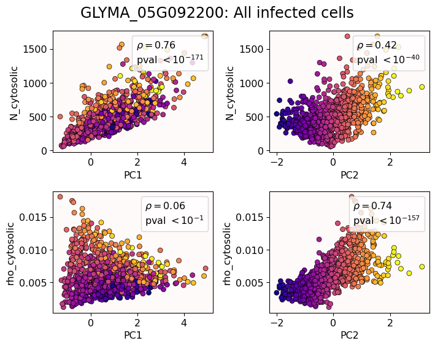
]

--

## Did I just spent a whole math degree to recompute sample size and transcriptomic density?

---

background-image: url("../figs/scale32_-_PI_1_1_1_H1+2_density13_pc02.png")
background-size: 600px
background-position: 50% 99%

# The PCs are capturing other information

---

# We define a morphospace of transcriptomic patterns

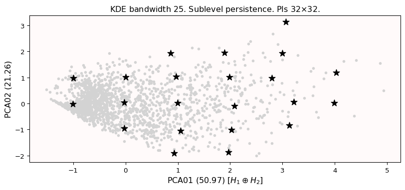

---

class: bottom

background-image: url("../figs/scale32_-_PI_1_1_1_H1+2_synthetic_30_clusters.jpg")
background-size: 900px
background-position: 50% 1%

# Working "backward"

--

```{r, out.width=600}
knitr::include_graphics(c('../figs/scale32_-_PI_1_1_1_H1+2_synthetic_pca_30_clusters.jpg'))
```

---

class: bottom

background-image: url("../figs/scale32_-_PI_1_1_1_H1+2_synthetic_varclusters.jpg")
background-size: 900px
background-position: 50% 1%

# Working "backward"

--

```{r, out.width=600}
knitr::include_graphics(c('../figs/scale32_-_PI_1_1_1_H1+2_synthetic_pca_varclusters.jpg'))
```

---

# Discussion

- Topological Data Analysis offers a robust way to encode the *shape of patterns*

- Robust to differences in scale, underlying boundaries, or orientation

- As long as you have a heatmap, you're good to go: more traditional FISH
    
- Even if you don't, you can make one via KDEs from individual spatial coordinates
    - Climate patterns?
    - Canopy patterns?
    - Cover crop patterns?
    - Species spatial distribution?


---

# Software used

.pull-left[
- All the work has been done in python with mostly standard libries (`numpy`, `scikit-learn`, `matplotlib`, `pandas`, etc.)

- KDEs computed efficiently with [`KDEpy`](https://kdepy.readthedocs.io/en/latest/)

- Sublevel set filtration of images and persistence diagrams done with [`gudhi`](https://gudhi.inria.fr/)


]

.pull-right[
- Persistence Images computed with [`persim`](https://persim.scikit-tda.org/en/latest/)


]

---

class: inverse

# Thank you!

<div class="row">
  <div class="column" style="max-width:60%; font-size: 15px;">
    
  </div>
  <div class="column" style="max-width:40%; font-size: 24px; line-height:1.25">
  <p style="text-align: center;"><strong>Contact and slides:</strong></p>
  <p style="text-align: center;color:Blue">eah4d@missouri.edu</p>
  <p style="text-align: center;color:Blue">ejamezquita.github.io</p>
  </div>
</div>

<div class="row">
  <div class="column" style="max-width:35%; font-size: 20px;">
  <p style="font-size: 25px; text-align: center;"> Libault Lab (MU) </p>
    <ul>
      <li><strong>Marc Libault</strong></li>
      <li><strong>Sandra Thibivillers</strong></li>
      <li>Hengping Xu</li>
      <li>Sahand Amini</li>
      <li>Hong Fu</li>
      <li><strong>Sutton Tennant</strong></li>
      <li>Md Sabbir Hossain</li>
    <ul>
  </div>
  <div class="column" style="max-width:65%; font-size: 20px;">
  <p style="font-size: 25px; text-align: center;"> With help from:</p>
    <ul>
      <li>Sai Subash (Nebraska-Lincoln)</li>
      <li>Benjamin Smith (UC Berkeley)</li>
      <li>Samik Bhattacharya (Resolve Biosciences)</li>
      <li>Jasper Kläver (Resolve Biosciences)</li>
    <ul>
  </div>
</div>
