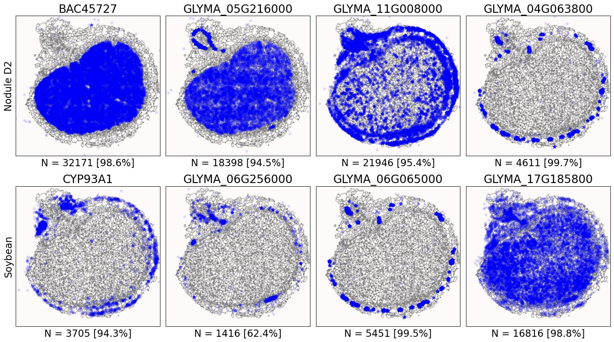
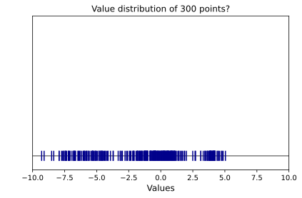
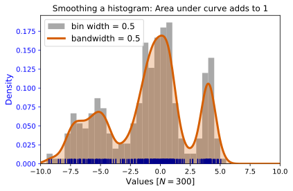
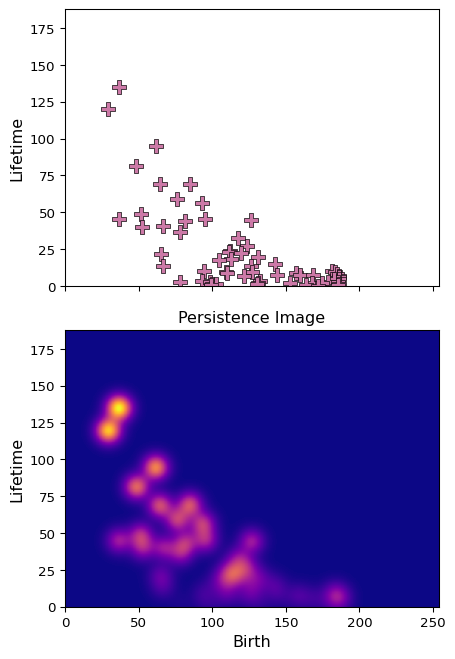

```{r setup, include=FALSE}
library(knitr)
library(magrittr)
genes = c('GLYMA_17G195900', 'GLYMA_05G216000', 'GLYMA_17G185800', 'GLYMA_05G203100', 'GLYMA_15G210100', 'GLYMA_05G092200')
options(htmltools.dir.version = FALSE)
knitr::opts_chunk$set(echo = FALSE)
knitr::opts_chunk$set(fig.align = 'center')
```

# Patterns, patterns everywhere!

<div class="row" style="font-size: 22px; font-family: 'Yanone Kaffeesatz'; margin: 0 auto;">
  <div class="column" style="max-width:33%;">
    
    
    <p style="text-align: center;">Quantify/Describe</a>
  </div>
  <div class="column" style="max-width:33%;">
    
    
    <p style="text-align: center;">Compare/Contrast</a>
  </div>
  <div class="column" style="max-width:33%;">
    
    
    <p style="text-align: center;">Model/Predict</a>
  </div>
</div>
<p style="font-size: 10px; text-align: right; color: Grey;">Credits: <a href="https://www.landsat.com/aerial-photography/missouri/">Landsat.com</a> and <a href="https://www.atlas.moherp.org/missouri/">MO Herpetological Atlas Project</a></p>
---

# Issue at hand: transcript distribution



- Different cells of different shapes and sizes
- Beyond density: How to quantify and compare patterns?
- Patterns across the whole cross section? Patterns within cells?

---

# Plan of attack

1. Make heatmaps of transcript distributions via Kernel Density Estimates (KDEs)

1. Quantify these heatmaps via Topological Data Analysis (TDA)

1. Featurize these topological signatures as Persistence Images

1. ????? [traditional data analysis]

1. Profit


---

class: inverse, middle, center

# [1] Kernel Density Estimators (KDEs)

## The continuous version of a histogram

### Think of heatmaps

[2] Quantify these heatmaps via Topological Data Analysis (TDA)

[3] Featurize these topological signatures as Persistence Images

[4] Traditional data analysis and results

---

# Say we want to characterize the distribution of these points in 1D



- We only know the samples (blue points)

---

# A histogram gives us a sense of distribution


- The total gray area equals 1
- 100% of the points are represented in the histogram

---

# Approximate the underlying distribution with a KDE



- A continuous approximation is mathematically better to perform meaningful statistics
- Kernel Density Estimate: KDE

---

# The width/number of bins does influence the shape of the histogram


- Similarly, we can control the bandwidth parameter of the KDE to influence its shape
- Plenty of heuristics to define the "right" bandwidth
- But ultimately, "right" depends on the application in mind

---

## KDEs: 3D; one per cell; reflect borders and nuclei


```{r, out.width="700px"}
knitr::include_graphics(c('../figs/D2_GLYMA_05G092200_1767_1765_kde_correction.jpg',
                          '../figs/D2_GLYMA_05G092200_1749_1748_kde_correction.jpg'))
```


---

class: inverse, middle, center

[1] Estimate heatmaps via KDEs

# [2] Quantify the shape of these heatmaps

## Topological Data Analysis (TDA) and persistent homology

[3] Featurize these topological signatures as Persistence Images

[4] Traditional data analysis and results

---

```{r include=FALSE, evaluate=FALSE}
slides_info <- tibble::tibble(first  = formatC(0:6, digits=1, format='d', flag='0'))

slides_text <- glue::glue_data(
  slides_info,
  "
  # Sublevel filter &rarr; Persistence Diagrams
  
  
  
  "
)
```

`r slides_text %>% paste(collapse = "\n---\n")`

---

# Same idea for higher dimensions


<p style="font-size: 10px; text-align: right; color: Grey;">Credits: <a href="https://doi.org/10.1021/acs.jpcb.1c00904">Manuchehrfar <em>et al.</em> (2022)</a></p>

# Distance between persistence diagrams

$${W^q}(D_1,D_2) = \left[\inf_{\gamma:D_1\to D_2} \sum_{p\in D_1}\left\|p - \gamma(p)\right\|^q_{\infty}\right]^{1/q}$$

- **Theorem:** The bottleneck and Wasserstein distances are stable ([Cohen-Steiner *et al.* (2007)](https://doi.org/10.1007/s00454-006-1276-5), [Cohen-Steiner *et al.* (2010)](https://doi.org/10.1007/s10208-010-9060-6)). 

---


```{r include=FALSE, evaluate=FALSE}
genes_low <- c(885)
genes_mid <- c(1306)
genes_high <- c(1702)
geness <- c(genes_low, genes_mid, genes_high)
geness <- base::formatC(geness, digits=4, format='d', flag='0')

w1_low <- c(38.44)
w1_mid <- c(343.77)
w1_high <- c(1080.96)
w1 <- c(w1_low, w1_mid, w1_high)

slides_info <- tibble::tibble(first=geness, third=w1)

slides_text <- glue::glue_data(
  slides_info,
  "
  background-image: url(\"../figs/D2_ws1d_infty_suplevel_by_both_{first}.svg\")
  background-size: 200px
  background-position: 99% 55%
  
  ## Compare two different persistence diagrams
  
  </img>
  <br>
  </img>
  
  $W_1(\\text{{GLYMA_17G195900, GLYMA_05G092200}) = {third}$

  
  "
)
```

`r slides_text %>% paste(collapse = "\n---\n")`


---

class: inverse, middle, center

[1] Estimate heatmaps via KDEs

[2] Quantify these heatmaps via Topological Data Analysis (TDA)

# [3] Featurize these topological signatures as Persistence Images

## The space of persistence diagrams is weird

### So we move to a nicer, more familiar one

[4] Traditional data analysis and results

---

# Rotate $45^\circ$ for Persistence Images

```{r, out.width=650}
knitr::include_graphics(c('../figs/D2_GLYMA_05G092200_z_kde_pd_suplevel_by_both_02404.jpg',
                          '../figs/persistence_image_example_GLYMA_05G092200_2404.png'))
```


---

# A word on Persistence Images

.pull-left[

]

.pull-right[
- Think them as a KDE of the lifetime diagram *with extra steps*.

- More persistent points are heavier

- Points with 0 lifespan have 0 weight

- **Theorem:** Persistence Images are stable with respect to the 1-Wasserstein distance ([Adams *et al.* (2017)](http://jmlr.org/papers/v18/16-337.html))

- The topological signature now is a collection of pixel values

- Concatenate all dimensions into a single large vector

- We can now do standard statistics and machine learning with PIs as our input features!
]

---

# Persistence Images can be tuned


---

class: inverse, middle, center

[1] Estimate heatmaps via KDEs

[2] Quantify these heatmaps via Topological Data Analysis (TDA)

[3] Featurize these topological signatures as Persistence Images

# [4] Traditional data analysis and results

## An example of a pipeline

### Never underestimate the power of PCA

---

# Remember the setup

- Looking at 968 individual cells in soybean root

- Looking at $(x,y,z)$ spatial locations of all transcripts from 6 genes

- With KDEs, we produced 3D heatmaps for all the $968\times 6=5808$ cases

- The *shape* of the heatmaps was then encoded into persistence diagrams using a sublevel set filtration ( $H_1, H_2$ )

- These diagrams were then transformed into Persistence Images

- All the dimensions were concatenated and used as features in a standard exploratory pipeline

- Modeling the transcripts patterns across genes and cells &larr; *You are here*


---

# Never underestimate PCA


---

# What is exactly used by PCA?


---

background-image: url("../figs/../figs/scale16_-_PI_1_1_1_pca_H1+2_cell_sample.png")
background-size: 775px
background-position: 50% 99%

# Show me

```{r, out.width=250, fig.align='left'}
knitr::include_graphics(c('../figs/scale16_-_PI_1_1_1_pca_H1+2_gridded.png'))
```

---

background-image: url("../figs/../figs/scale16_-_PI_1_1_1_pca_H1+2_kde_sample.png")
background-size: 775px
background-position: 50% 99%

# Show me

```{r, out.width=250, fig.align='left'}
knitr::include_graphics(c('../figs/scale16_-_PI_1_1_1_pca_H1+2_gridded.png'))
```

---

# Relate patterns to spatial location


---

# Differentiate patterns within cells


---

# Discussion

- Topological Data Analysis offers a robust way to encode the *shape of patterns*

- Robust to differences in scale, underlying boundaries, or orientation

- As long as you have a heatmap, you're good to go:
    
- Even if you don't, you can make one via KDEs from individual spatial coordinates
    - Climate patterns?
    - Canopy patterns?
    - Cover crop patterns?
    - Species spatial distribution?


---

# Software used

.pull-left[
- All the work has been done in python with mostly standard libries (`numpy`, `scikit-learn`, `matplotlib`, `pandas`, etc.)

- KDEs computed efficiently with [`KDEpy`](https://kdepy.readthedocs.io/en/latest/)

- Sublevel set filtration of images and persistence diagrams done with [`gudhi`](https://gudhi.inria.fr/)


]

.pull-right[
- Persistence Images computed with [`persim`](https://persim.scikit-tda.org/en/latest/)


]

---

class: inverse

# Thank you!

<div class="row">
  <div class="column" style="max-width:60%; font-size: 15px;">
    
  </div>
  <div class="column" style="width:6%; font-size: 24px;">
  </div>
  <div class="column" style="max-width:30%; font-size: 24px; line-height:1.25">
  <p style="text-align: center;"><strong>Email</strong></p>
  <p style="text-align: center;color:Blue">eah4d@missouri.edu</p>
  <p style="text-align: center;"><strong>Website and slides</strong></p>
  <p style="text-align: center;color:Blue">ejamezquita.github.io</p>
  </div>
</div>

<div class="row">
  <div class="column" style="max-width:35%; font-size: 20px;">
  <p style="font-size: 25px; text-align: center;"> Libault Lab (MU) </p>
    <ul>
      <li><strong>Marc Libault</strong></li>
      <li><strong>Sandra Thibivillers</strong></li>
      <li>Hengping Xu</li>
      <li>Sahand Amini</li>
      <li>Hong Fu</li>
      <li><strong>Sutton Tennant</strong></li>
      <li>Md Sabbir Hossain</li>
    <ul>
  </div>
  <div class="column" style="max-width:65%; font-size: 20px;">
  <p style="font-size: 25px; text-align: center;"> With help from </p>
    <ul>
      <li>Sai Subash (Nebraska-Lincoln)</li>
      <li>Benjamin Smith (UC Berkeley)</li>
      <li>Samik Bhattacharya (Resolve Biosciences)</li>
      <li>Jasper Kläver (Resolve Biosciences)</li>
    <ul>
  </div>
</div>