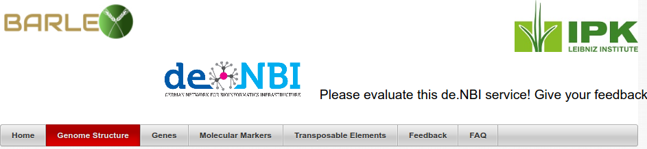
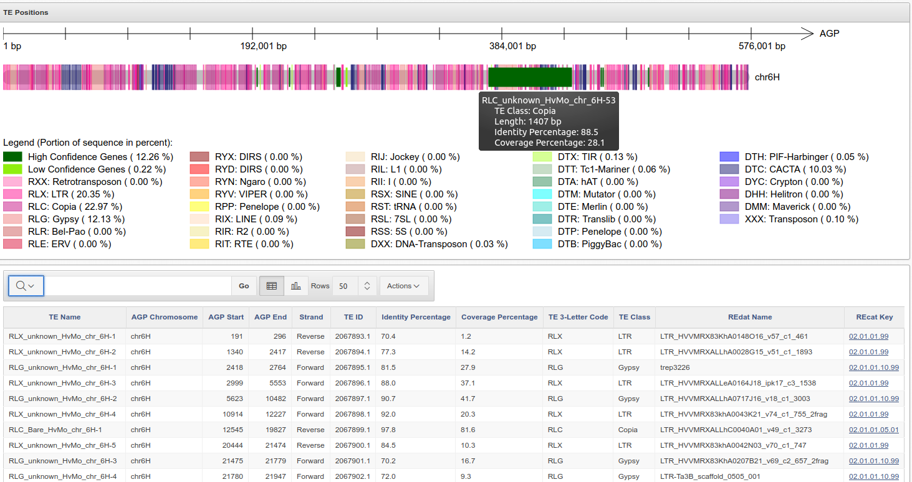
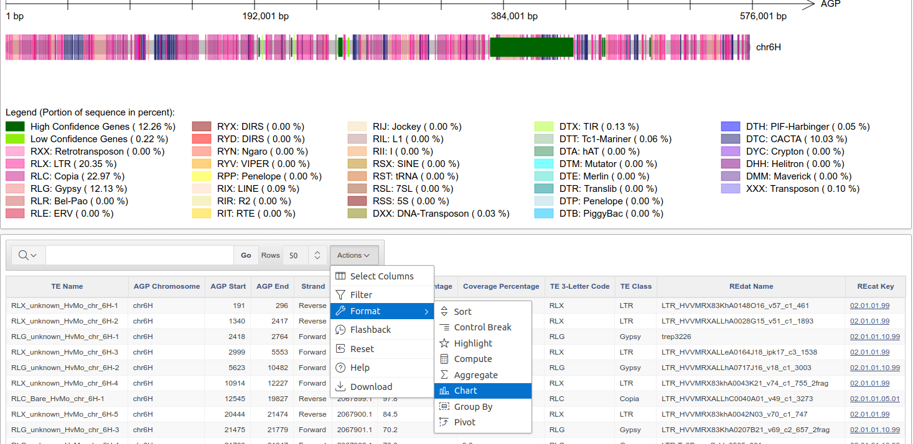
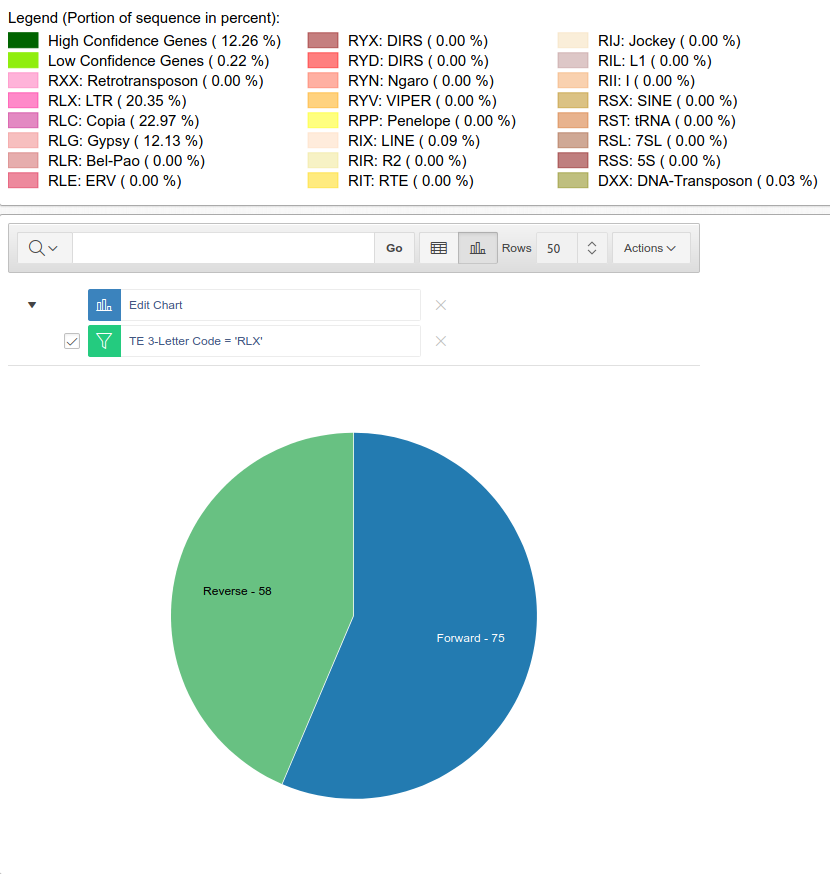
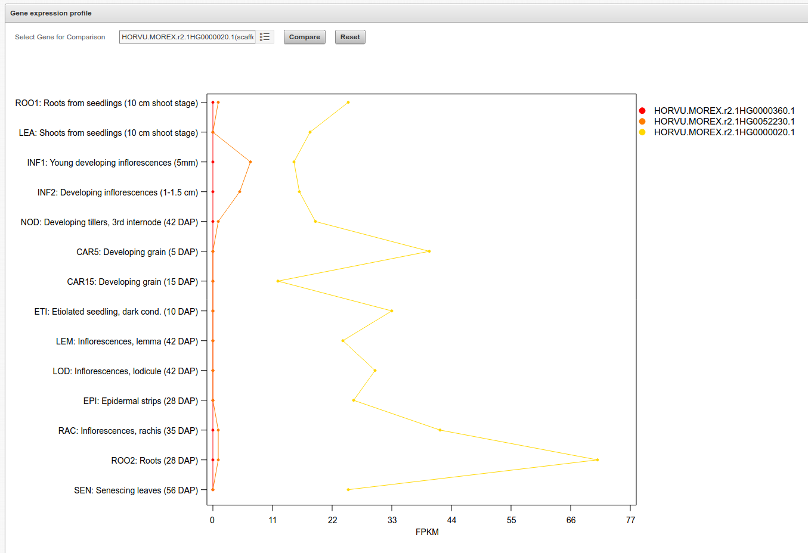
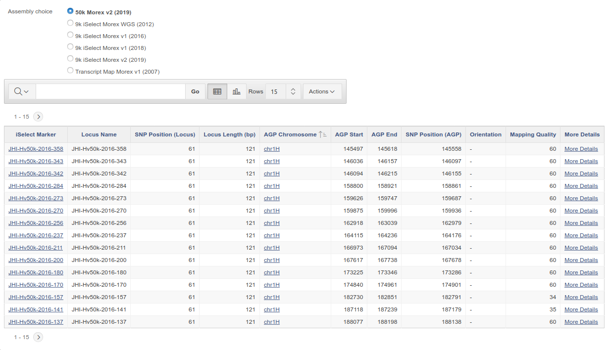
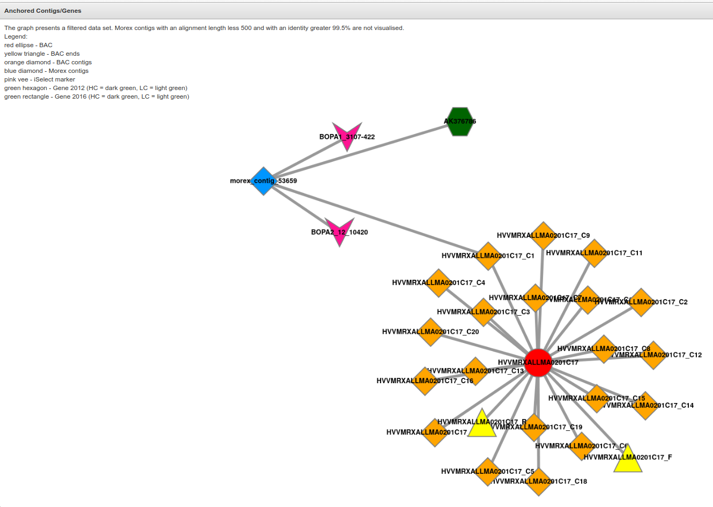
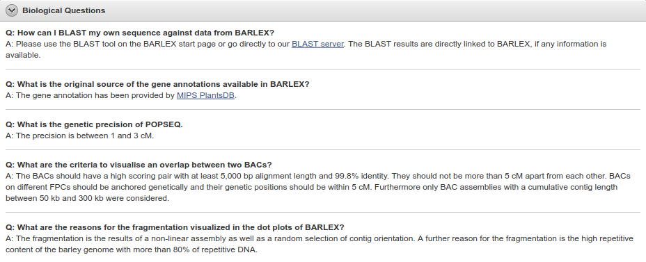
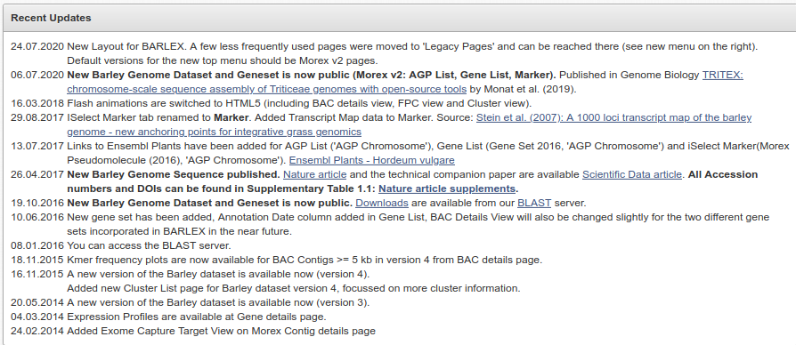

```{r setup, include=FALSE}
library(reticulate)
library(knitr)

# <!-- Copies an HTML dependency to a subdirectory of the given directory. The subdirectory name willbename-version(for example, "outputDir/jquery-1.11.0"). You may setoptions(htmltools.dir.version= FALSE)to suppress the version number in the subdirectory name. -->
options(htmltools.dir.version = FALSE)
knitr::opts_chunk$set(echo = FALSE)
knitr::opts_chunk$set(fig.align = 'center')
```

# What is the BARLEX?

> A web-based application to access the developing genomic infrastructure of barley.

--

```{r header}

```

--

- Includes _Legacy Pages_ with BAC assembly information.

--

- Link to the [IPK Barley BLAST Server](https://webblast.ipk-gatersleben.de/barley_ibsc/)

--

- Much more than meets the eye at first sight.

---

# Highlights: Genome Viewer

```{r}

```

---

# Highlights: Interactive Tables

```{r}

```

---
# Highlights: Interactive Tables

```{r, out.width='500px'}

```

---

# Highlights: Gene Profile

```{r, out.width='500px'}

```

---

# Highlights: Molecular Markers

```{r, out.width='500px'}

```

---

# Highlights: Legacy: BAC Assembly

```{r, out.width='500px'}

```

---
# What was missing from the BARLEX?

- Graphs cannot be downloaded: FAQ explicitly says to use screenshots
- Gene annotation interative tables cannot be downloaded
- Interactive tables have limited features whenever you seek more fine tuned queries
    - The tables treat number as strings
    
--

- **LOTS** of acronyms without direct reference

--

- A few dead links here and there
    - The BARLEX link in the main paper is dead
    
--

- No obvious contact email
    - There is a feedback mailbox, though
    - _But it seems you need a username_

--
- FAQ is limited

---
#  Documentation

```{r}

```

--

- For the rest, refer to the papers linked at the home page

---
#  Load speed for pages

- Overall the site feels snappy
- Table filtering is pretty quick
- BLAST is reasonable (a few seconds)

---
# Up to date?

- **Yes**

--

```{r update}

```


---
# Response time to inquiries

- Wrote a feedback message regarding one possible bug: I can't download the gene interactive tables.
- I haven't heard back at the moment

---
# BARLEX for a naïve grad student? 

- Maybe
- The learning curve seems steep

---
# Bottom line

- Design is simple yet aesthetically pleasing
- Large number of features to do basic exploration

--
- Everything is about barley
- Everything is about _Golden Promise_
- Syteny with other grasses would be nice

--
- A rough map of database is available
- The underlying SQL database script is available as well
- An API to automate data retrieval would be nice

--

- The URL is weird [https://apex.ipk-gatersleben.de/apex/f?p=284:10::::::](https://apex.ipk-gatersleben.de/apex/f?p=284:10::::::)
- It doesn't match the original [Colmsee et al (2015) paper](http://dx.doi.org/10.1016/j.molp.2015.03.009)

---

class: inverse, center, middle

## Slides made with RMarkdown + Xaringan