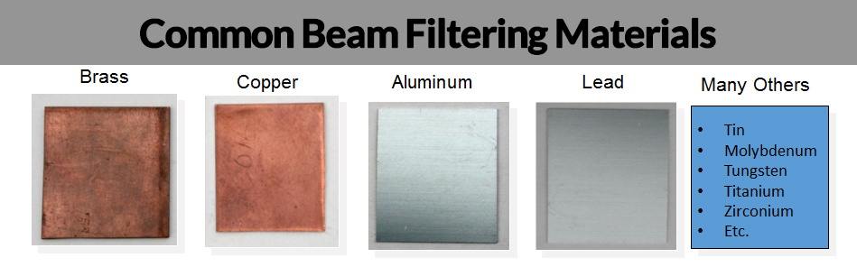

```{r setup, include=FALSE}
library(knitr)

# <!-- Copies an HTML dependency to a subdirectory of the given directory. The subdirectory name willbename-version(for example, "outputDir/jquery-1.11.0"). You may setoptions(htmltools.dir.version= FALSE)to suppress the version number in the subdirectory name. -->
options(htmltools.dir.version = FALSE)
knitr::opts_chunk$set(echo = FALSE)
knitr::opts_chunk$set(fig.align = 'center')
```

class: inverse, center, middle

# Flashback

## X-ray tomography

## Beer's law

---

# Monochromatic sources

$${N}_{\textrm{out}}({x}) = {N}_{\textrm{in}}\exp({-\mu}{x})$$

---

# Monochromatic sources

$${N}_{\textrm{out}}({x}) = {N}_{\textrm{in}} \exp(-{\overbrace{\mu}^{\textrm{attenuation coefficient}} \underbrace{x}_{\textrm{thickness}}})$$
--

- We assume a single, monochromatic X-ray beam

- That is, all photons in the beam have the exact same energy

--

- $\mu$ is not constant: it depends on the material

$${N}_{\textrm{out}} = {N}_{\textrm{in}}\exp\left(-\int_L\mu(x,y)d\ell\right)$$
--

- Equivalently

$$m_L = \int_L\mu(x,y)d\ell = \log\frac{{N}_{\textrm{in}}}{{N}_{\textrm{out}}}$$
--

- No scatter

- Narrow beam

- No partial volume effect

---

class: inverse, center, middle

# Reality check

---

# Beam hardening

- In reality, we have to consider a large range of photon energies

--

- Low energies are preferentially absorbed

--

- Beam becomes richer in high energy photons as it goes through the first object layers

--

- Average energy of detected photons is larger than the average energy of the incident photons.

--


---

# Polychromatic sources

- Attenuation due to the tissue at some point will be different for rays from different directions.

$$p_L = \int S_{\textrm{in}}(E)\exp\left[-\int\mu(x,y,E)d\ell\right]dE$$
---

# Polychromatic sources

- Attenuation due to the tissue at some point will be different for rays from different directions.

$$p_L = \int \overbrace{S_{\textrm{in}}(E)}^{\textrm{photon density}}\exp\overbrace{\left[-\int\mu(x,y,E)d\ell\right]}^{\textrm{energy dependence}}dE$$
--

- $S_{\textrm{in}}(E)dE$ is the total number of incident photons in the energy range $[E, E+\Delta E]$.

--

- Detector sensitivity also plays a role in real life.

---

# Polychromatic sources

- Attenuation due to the tissue at some point will be different for rays from different directions.

$$p_L = \int \overbrace{S_{\textrm{in}}(E)}^{\textrm{photon density}}\exp\overbrace{\left[-\int\mu(x,y,E)d\ell\right]}^{\textrm{energy dependence}}dE$$

- $S_{\textrm{in}}(E)dE$ is the total number of incident photons in the energy range $[E, E+\Delta E]$.

- ~~Detector sensitivity also plays a role in real life.~~ Assume constant sensitivity.

---

# Beam-hardening conundrum

- We measure $p_L$ but we can only solve $\mu$ in $\int_L\mu(x,y)d\ell$.

--

- If left unaddressed, we have severe artifacts whenever there are two materials with very different densities


---

class: inverse, center, middle

# What to do, then?

## Multiple solutions have been proposed since the late 70s

## Preprocessing and Postprocessing

---

# Force monochromacity

- Pre-harden the beam by placing a filter in front of the source


--

- Lose sensitivity of soft materials

--

- Expose the object/patient to a higher radiation dose

---

# Preprocessing: Linearization

- We want $\{m_L\}$ but we only have $\{p_L\}$ observations

--

- Use a correction function $f(p_L) \approx m_L$ (usually a low degree polynomial) as a preprocessing step

--

- If the assumption of photons being monoenergetic were indeed valid, a ray integral for an homogeneous material would be given by 
$$\mu\underbrace{\ell}_{\textrm{thickness}} = \log\frac{N_{\textrm{in}}}{N_{\textrm{out}}}$$
--

- That is, $\log\frac{N_{\textrm{in}}}{N_{\textrm{out}}}$ is linearly proportional to absorber thickness.

--

- Experimentally computed for one reference material, and we assume that the behavior is similar for other materials

---

# Preprocessing: Linearization


--

- Good for soft tissue; bad whenever bone/metal are present

---

# Postprocessing: Multimaterial linearization

- Do an initial reconstruction 

--

- Segment different materials

--

- Linearization for different materials

---

# Dual-energy technique

- Split the material and energy dependencies

$$\mu(x,y,E) = \overbrace{\varphi(x,y)\Phi(E)}^{\textrm{photoelectric effect}} + \overbrace{\theta(x,y)\Theta(E)}^{\textrm{Compton scatter}}$$

- $\Phi(E)={{1/E^3}\over {1/E_0^3}}$ with $E_0$ the reference energy (usually $E_0=70$keV).

- $\Theta(E)={{f_{{\rm KN}}(E)}\over {f_{{\rm KN}}(E_0)}}$ where $f_{\rm KN}$ is the Klein-Nishima equation.

--

- Thus the polychromatic descriptor is

$$p_L = \int S_{\textrm{in}}(E)\exp\left[-A_1\Phi(E) + A_2\Theta(E)\right]dE$$

- $A_1 = \int_L \phi(x,y) d\ell$ and $A_2 = \int_L \theta(x,y) d\ell$

--

- Determine $A_1$ and $A_2$

--

- Determine $\varphi(x,y)$ and $\theta(x,y)$

--

- Determine $\mu$ at any enery free from beam hardening!

---

# Dual-energy technique

- Use two different source spectra

$$I_1 = \int S_{1}(E)\exp\left[-A_1\Phi(E) + A_2\Theta(E)\right]dE$$
$$I_2 = \int S_{2}(E)\exp\left[-A_1\Phi(E) + A_2\Theta(E)\right]dE$$
--

- Use split detectors

- Do alternating voltages

--


---

# Iterative reconstruction models

- The idea was sort-of discussed in previous classes

--

- IMPACT: Iterative Maximum likelihood Polychromatic Algorithm for CT

--

- *Given* a set of measurements $\{y_i\}_{i=1}^I$
- *Find* a distribution of inear attenuation coefficients $\{\mu_j\}_{j=1}^J$ such that they maximize the loglikehood

$${\rm L} = \underbrace{\sum_{i=1}^I\,}_{\textrm{projections}} \left(y_i \cdot \ln (\underbrace{\hat{y}_i}) - \underbrace{\hat{y}_i}_{\textrm{expected no. of photons given }\mu_j}\right)$$
--

- $y_i$ assumed to be a Poisson realization of $\hat y_i$.

$$\hat{y}_i=\underbrace{b_i}_{\textrm{blank scan}} \cdot \exp\left({-}\underbrace{\sum_{j=1}^J}_{\textrm{pixels}}\,\overbrace{l_{ij}}^{\textrm{intersection length}} \mu_j\right)$$

---
# Iterative reconstruction models

- More general by considering energy dependency

- Split $\mu$ into photoelectric effect and Compton scatter components

- Assume the materials behave linearly 

$$\hat{y}_i=\overbrace{\sum_{k=1}^{K}}^{\textrm{energies}}\, b_{ik} \cdot \exp\left({-}\sum_{j=1}^J l_{ij} \left[\phi(\mu_j) \cdot \Phi_k + \theta(\mu_j) \cdot \Theta_k\right]\right)$$

--

Update step

$$\mu^{n+1}_j = \mu^{n}_j + \Delta\mu^{n}_j$$
$$\Delta\mu^{n}_j =\, {{\phi'_j \cdot {\displaystyle \sum_{i=1}^I}\, l_{ij} e_i Y^\Phi_i + \theta'_j \cdot {\displaystyle \sum_{i=1}^I}\, l_{ij} e_i Y^\Theta_i}\over {\phi'_j \cdot {\displaystyle \sum_{i=1}^I}\, l_{ij} M_i + \theta'_j \cdot {\displaystyle \sum_{i=1}^I}\, l_{ij} N_i}}$$

---
class: inverse, center, middle

# Results reported in literature

---

# Dual energy in medical settings 

<iframe src="../pdf/Pessis_etal2013.pdf#toolbar=0" width="100%" height="500px">
</iframe>

---

# Dual energy in medical settings 

<iframe src="../pdf/Kaza_etal2012.pdf#toolbar=0" width="100%" height="500px">
</iframe>

---

# Industrial setting

<iframe src="../pdf/Cao_etal2018.pdf#toolbar=0" width="100%" height="500px">
</iframe>

---
class: inverse, center, middle

# Thanks!

---

# Reference material

- W. Cao, T. Sun, G. Fardell, B. Price, and W. Dewulf (2018), "Comparative performance assessment of beam hardening correction algorithms applied on simulated data sets". _Journal of Microscopy_, 272: 229-241. doi: 10.1111/jmi.12746

- B. De Man, J. Nuyts, P. Dupont, G. Marchal and P. Suetens (2001) "An iterative maximum-likelihood polychromatic algorithm for CT," in _IEEE Transactions on Medical Imaging_, vol. 20, no. 10, pp. 999-1008, doi: 10.1109/42.959297.

- G. T. Herman and S. S. Trivedi (1983) "A Comparative Study of Two Postreconstruction Beam Hardening Correction Methods," in _IEEE Transactions on Medical Imaging_, vol. 2, no. 3, pp. 128-135, doi: 10.1109/TMI.1983.4307626.

- A. C. Kak and M. Slaney (1988) _Principles of Computerized Tomographic Imaging_, IEEE Press. Chapter 4.

- R. K. Kaza, J. F. Platt, R. H. Cohan, E. M. Caoili, M. M. Al-Hawary, and A. Wasnik (2012) "Dual-Energy CT with Single- and Dual-Source Scanners: Current Applications in Evaluating the Genitourinary Tract" _RadioGraphics_ 32:2, 353-369, doi:10.1148/rg.322115065

- E. Pessis, R. Campagna, J-M. Sverzut, F. Bach, M. Rodallec, H. Guerini, A. Feydy, and J-L. Drapé (2013) "Virtual Monochromatic Spectral Imaging with Fast Kilovoltage Switching: Reduction of Metal Artifacts at CT" _RadioGraphics_ 33:2, 573-583 , doi: 10.1148/rg.332125124