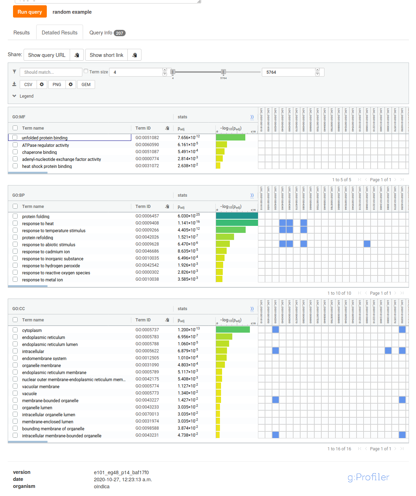

```{r setup, include=FALSE}
library(reticulate)
library(knitr)
library("RColorBrewer")
library("gplots")

# <!-- Copies an HTML dependency to a subdirectory of the given directory. The subdirectory name willbename-version(for example, "outputDir/jquery-1.11.0"). You may setoptions(htmltools.dir.version= FALSE)to suppress the version number in the subdirectory name. -->
options(htmltools.dir.version = FALSE)
knitr::opts_knit$set(root.dir = "/home/ejam/documents/webpage/courses/data/")
knitr::opts_chunk$set(echo = FALSE)
```

Download the homework files from D2L to a directory of your choice on your computer. You should get the `deseq.R` script and 4 counts files (with the `.counts.txt` extension). Edit the R script `setwd()` command to point to the directory where the homework files were downloaded and run the script in RStudio.

The script contains all the software installation commands but if you already installed the software during the lab you do not need to rerun those. You do need to load the library each time.

```{r read_files, include=FALSE}
myFiles <- list.files(pattern=utils::glob2rx("*counts.txt"), # Create a vector containing the names of your files
                      all.files=T, 
                      full.names=F)

myData <- lapply(myFiles, # Use list apply to apply the native R function read.table() to myFiles.
                 read.table, colClasses=c("character","numeric"), sep="\t")

names(myData) <- c("leaf_control_rep1", # Name the elements of myData.
                   "leaf_control_rep2", 
                   "leaf_heat_rep1", 
                   "leaf_heat_rep2")

rmLines <- function(x){ # This is a really quick and dirty solution. This is a function to select the first 39,049 lines.
  x <- x[1:39049,]
}

myData <- lapply(myData, rmLines) # Apply the rmLines() function to each object in the myData list.

nrow(myData$leaf_control_rep2) # Check to see how many lines there are in each element of myData now. There should be only 39,049.

counts <- data.frame(row.names=myData$leaf_control_rep1[,1],
                     leaf_control_rep1=myData$leaf_control_rep1[,2], 
                     leaf_control_rep2=myData$leaf_control_rep2[,2], 
                     leaf_heat_rep1=myData$leaf_heat_rep1[,2], 
                     leaf_heat_rep2=myData$leaf_heat_rep2[,2])

geneTotals <- rowSums(counts) # Evaluate the sum of each row and save to a new vector called geneTotals.

countsNonZero <- counts[geneTotals>0,] # Subset the rows where the geneTotal is greater than 0.

treatments <- as.factor(c(rep("ctrl", 2), rep("heat", 2)))
```

### How many genes have non-zero gene count totals? **(1 pt)**

```{r, echo=TRUE}
countsNonZero <- counts[geneTotals>0,]
nrow(countsNonZero)
```

We have `r nrow(countsNonZero)` genes with non-zero counts.

### Copy and paste the plot showing how fold change corresponds to the gene dispersion estimates below. Describe the general relationship between the dispersion estimate and fold change of individual genes. **(2 pt)**

```{r, include=FALSE}
library("DESeq2") # load the DESeq2 package. Needs to be done every time.

colData <- DataFrame(treatments) # treatments was our column labels organized as factors

dds <- DESeqDataSetFromMatrix(countsNonZero, 
                              colData=colData, 
                              design=formula(~treatments)) # Create the DESeq object from the counts matrix we made that has no non-expressed genes, uses the new colData object we made to label the tissues, and the same experimental design using treatments as the nominal categories.

dds <- DESeq(dds)

geneDispersion <- dds@rowRanges@elementMetadata@listData$dispGeneEst
treatmentsheat <- dds@rowRanges@elementMetadata@listData$treatments_heat_vs_ctrl
```

```{r, echo=TRUE}
plot(treatmentsheat, # See how fold change corresponds to dispersion.
     geneDispersion, col='firebrick1', cex = 0.7,
     xlab="Fold Change heat Expression Relative to Control", ylab="Gene Dispersion Estimate", pch=18)
```

We observe that the vast majority of genes report very low dispersion. Of those few genes that do report large dispersion, they are mostly with a fold change of $\pm5$ relative to control. Keep in mind that since we have only two replicates, we cannot say much about the plot in general. 

### Copy and paste the sample heatmap below. **(1 pt)**

```{r, include=FALSE}
rdds <- rlog(dds) # apply regularized logarithmic transformation to the gene counts.

hmcol <- colorRampPalette(brewer.pal(9,"PuRd"))(100)

distsRL <- dist(t(assay(rdds))) # Using the assay() function in DESeq you can extract the normalized count matrix, then use t() to transpose the matrix and calculate distance between rows of the matrix with dist()

mat <- as.matrix(distsRL)

rownames(mat)<- colnames(mat) <- with(colData(dds), 
                                      treatments)
```

```{r, echo=TRUE}
gplots::heatmap.2(mat, 
          trace="none", 
          col=rev(hmcol), 
          dendrogram="col", 
          density.info="none",
          margins=c(5,5))
```

### Copy and paste the volcano plot below. What do the red dots show? **(2 pt)**

```{r, include=FALSE}
dds_pv <- results(dds)

dds_pv <- dds_pv[!(is.na(dds_pv$padj)),] 

sigGenes <- as.data.frame(dds_pv[dds_pv$padj < 0.05, ])

write.table(sigGenes, file="significant_de_results.txt", quote=F, sep="\t", col.names=NA)
```

```{r, echo=TRUE}
plot(dds_pv$log2FoldChange, # Volcano plot
     -log10(dds_pv$padj), 
     pch=c(19,17)[(dds_pv$padj<0.01)+1], 
     cex=c(0.4,0.7)[(dds_pv$padj<0.01)+1], 
     col=c("saddlebrown", "red")[(dds_pv$padj<0.01)+1], 
     xlab="log2 Fold Change", 
     ylab="log10 P-value")
```

The red dots show all the genes with adjusted $p$-value larger than $0.01$. There are `r sum(dds_pv$padj<0.01)` significant genes in total.

#### Open the `significant_de_results.txt` file generated by the R code using Excel (columns are separated by tabs). The first column shows gene names of genes which showed significant differential expression between control and heat shock treatment. Delete `.MSUR7` from the ends of the gene names in Excel by highlighting the entire column and using “Find” (command F or ctrl F) and typing “.MSUR7” and replacing with nothing.

#### Go to http://biit.cs.ut.ee/gprofiler/gost to do a quick gene ontology enrichment. Enter the query list of genes from the Excel sheet with `.MSUR7` deleted. Change the organism to *Oryza sativa Indica Group* under Ensemble Genomes Plants. Click the Run Query button. After it runs, click on the button to select Ensemble ID for the gene id with the most GO terms. Re-run the query and answer the following questions.

### Go to the Detailed Results tab. Paste a screenshot of the Biological Process results table. **(1 pt)**

```{r include=T, fig.cap="gProfiler",fig.show='hold',fig.align='center'}

```

Go to the Results tab. Select the top three most significant GO terms.

### What are the descriptions for the top three GO terms? **(1 pt)**

ID | Source |  Term ID | Term Name        | padj (query_1)  
---|--------|----------|------------------|----------------
1  |  GO:BP |GO:0006457|protein folding   | $6.030\times10^{-25}$
2  |  GO:BP |GO:0009408|response to heat  | $1.141\times10^{-16}$
3  |  GO:CC |GO:0005737|cytoplasm         | $1.200\times10^{-13}$

### What ontology category do the top three GO terms belong to? **(1 pt)**

Two correspond to Biological Processes, while the other corresponds to Cellular Component.  

### Go back to your results sheet significant_de_results.txt and sort based on the “padj” column which contains adjusted p-values from smallest to largest. What are the top two most significant genes? **(1 pt)**

```{r, echo=TRUE}
# Rename the rows (gene names) by removing all the characters after the '.' char
rownames(sigGenes) <- base::gsub("\\..*","", rownames(sigGenes))

# Sort the 'padj' column from smallest to largest
# Based on its order, sort the rest of columns
sortedSigGenes <- sigGenes[base::order(sigGenes$padj, decreasing=FALSE),]
utils::head(sortedSigGenes, 5)
```
The top two significant genes are `r rownames(sortedSigGenes)[1:2]`

### Look up the top two significant genes on the [MSU rice website](http://rice.plantbiology.msu.edu/analyses_search_locus.shtml). What are the Gene Product Names for each? **(1 pt)**

- `r rownames(sortedSigGenes)[1]`: Gene Product Name:	expressed protein
- `r rownames(sortedSigGenes)[2]`: Gene Product Name:	transcription elongation factor 1, putative, expressed

### Sort `significant_de_results.txt` on log2FoldChange from largest to smallest. What are the top five genes with greatest positive fold change difference due to heat treatment? Write the gene names and look up the Gene Product Names from the MSU rice website. **(1 pt)**

```{r, echo=TRUE}
sortedSigGenes <- sigGenes[base::order(sigGenes$log2FoldChange, decreasing=TRUE),]
utils::head(sortedSigGenes, 5)
```

The top 5 genes with highest positive fold change difference due to heat treatment are:

- `r rownames(sortedSigGenes)[1]`: Gene Product Name:	expressed protein
- `r rownames(sortedSigGenes)[2]`: Gene Product Name:	transmembrane BAX inhibitor motif-containing protein, putative, expressed
- `r rownames(sortedSigGenes)[3]`: Gene Product Name:	hsp20/alpha crystallin family protein, putative, expressed
- `r rownames(sortedSigGenes)[4]`: Gene Product Name:	hsp20/alpha crystallin family protein, putative, expressed
- `r rownames(sortedSigGenes)[5]`: Gene Product Name:	hsp20/alpha crystallin family protein, putative, expressed

### Scroll to the bottom of the sorted list to see the five genes with the greatest negative fold change difference. Write the five gene names and look up the Gene Product Names from the MSU rice website. **(1 pt)**

```{r, echo=TRUE}
utils::tail(sortedSigGenes, 5)
```

The top 5 genes with highest positive fold change difference due to heat treatment are:

- `r rownames(sortedSigGenes)[nrow(sortedSigGenes)-4]`: 
Gene Product Name:	NADPH-dependent oxidoreductase, putative
- `r rownames(sortedSigGenes)[nrow(sortedSigGenes)-3]`: Gene Product Name:	photosystem I assembly protein ycf4, putative, expressed
- `r rownames(sortedSigGenes)[nrow(sortedSigGenes)-2]`: Gene Product Name:	ATP synthase C chain, putative, expressed
- `r rownames(sortedSigGenes)[nrow(sortedSigGenes)-1]`: Gene Product Name:	OsFBX285 - F-box domain containing protein, expressed
- `r rownames(sortedSigGenes)[nrow(sortedSigGenes)]`  : Gene Product Name:	ATP-dependent Clp protease proteolytic subunit, putative, expressed

### Write your biological interpretation of the results. Refer to the information found on the rice genome website pages you visited in the above questions. What kind of genes are being upregulated in response to heat stress? What kind of genes are being downregulated in response to heat stress? **(2 pt)**

By looking at the detailed GO results (and dowloading the information as a CSV file), we see a number of heat-stress related terms. 

**Upregulated genes**

```{r, engine = 'bash', echo=TRUE}
grep -iF LOC_Os05g38280 gProfiler_oindica.csv | awk -F, '{print $1,$2,$4}'
```

```{r, engine = 'bash', echo=TRUE}
grep -iF LOC_Os03g53400 gProfiler_oindica.csv | awk -F, '{print $1,$2,$4}'
```

```{r, engine = 'bash', echo=TRUE}
grep -iF LOC_Os01g04380 gProfiler_oindica.csv | awk -F, '{print $1,$2,$4}'
```

```{r, engine = 'bash', echo=TRUE}
grep -iF LOC_Os04g36750 gProfiler_oindica.csv | awk -F, '{print $1,$2,$4}'
```

```{r, engine = 'bash', echo=TRUE}
grep -iF LOC_Os01g04340 gProfiler_oindica.csv | awk -F, '{print $1,$2,$4}'
```

We observe that the 3 upregulated genes corresponding to the _hsp20/alpha crystallin family protein_ play an important role when it comes to heat response. There was no GO information available for the other two genes.

**Downregulated genes**

```{r, engine = 'bash', echo=TRUE}
grep -iF LOC_Os10g21402 gProfiler_oindica.csv | awk -F, '{print $1,$2,$4}'
```

```{r, engine = 'bash', echo=TRUE}
grep -iF LOC_Os06g39744 gProfiler_oindica.csv | awk -F, '{print $1,$2,$4}'
```
```{r, engine = 'bash', echo=TRUE}
grep -iF LOC_Os06g39744 gProfiler_oindica.csv | awk -F, '{print $1,$2,$4}'
```

```{r, engine = 'bash', echo=TRUE}
grep -iF LOC_Os08g20492 gProfiler_oindica.csv | awk -F, '{print $1,$2,$4}'
```

```{r, engine = 'bash', echo=TRUE}
grep -iF LOC_Os08g15270 gProfiler_oindica.csv | awk -F, '{print $1,$2,$4}'
```

However, when it comes to downregulated genes, we find no additional GO information. Looking at the gene product names, there seems to be something regarding ATP regulation.

### Bonus Question: Re-create the sorting from Question 10, this time using UNIX instead of Excel. Type the full UNIX command to sort significant_de_results.txt on log2FoldChange from largest to smallest and return the top five genes with greatest positive fold change difference. **(1 pt)**

Step by step:

1. Get the whole file with `cat`
1. Use an `if` statement in `awk` to preserve the header
    1. Print the first row as it is
    1. For the rest of rows, just keep the 1st and 3rd colums (gene name and log2FoldChange)
    1. For the first column, print only the sub-string that starts with the first character (remove the `.MSUR7` bit)
    1. Pipe the columns kept
1. In this case, the rest of the rows are sorted. Since we now only have two columns, we sort according to the 2nd column (log2FoldChange)
1. Just print the first 10 lines.

```{r, engine = 'bash', echo=TRUE}
cat significant_de_results.txt | awk 'NR<2{print $0;next}{print substr ($1,1,14),$3| "sort -k2,2nr"}' | head -n 10
```

