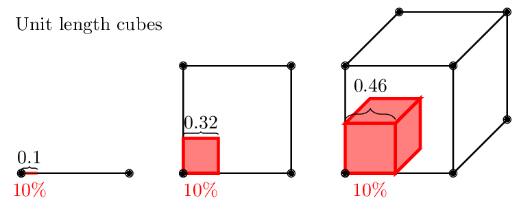
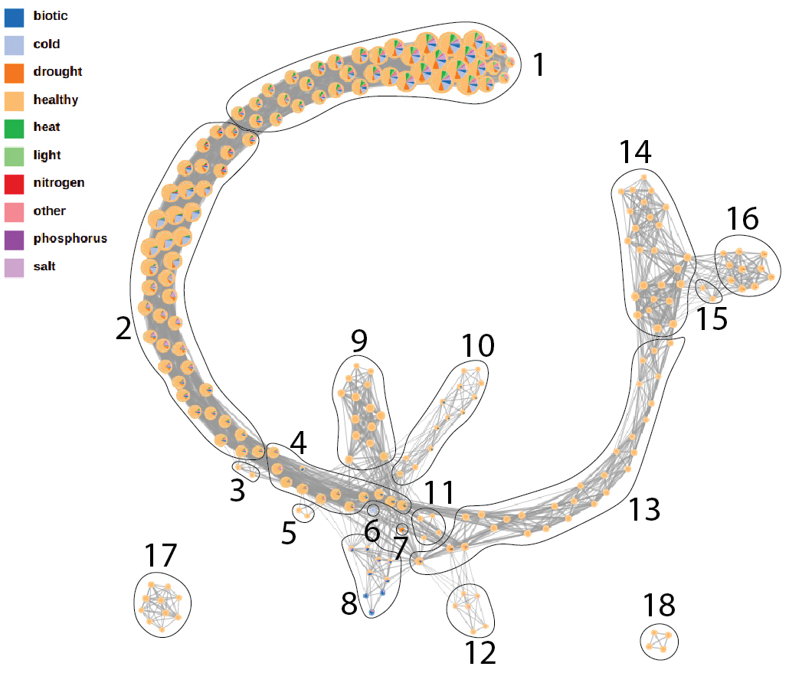
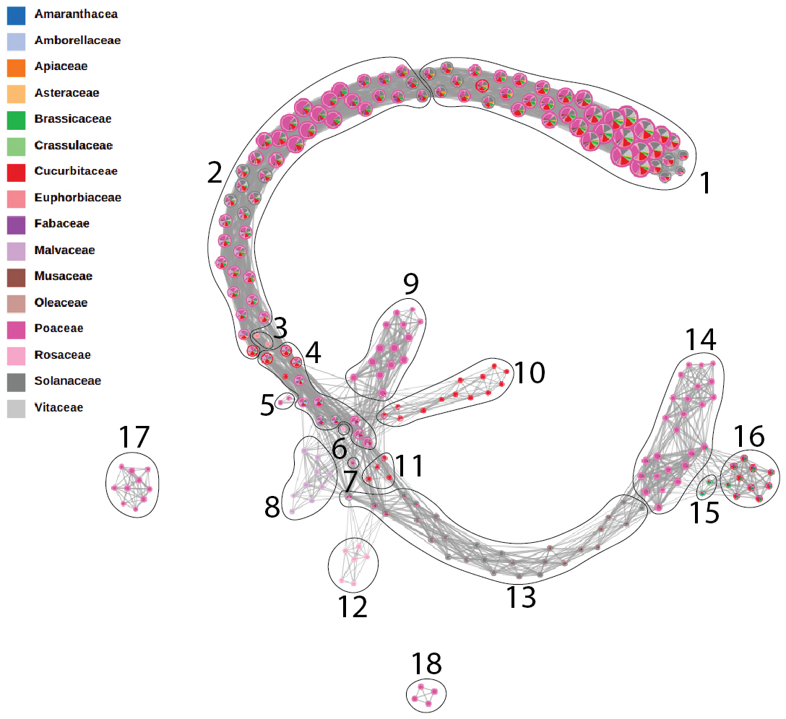
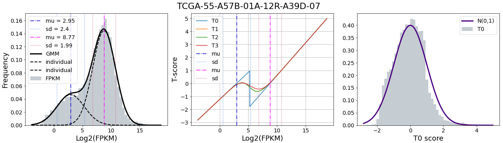
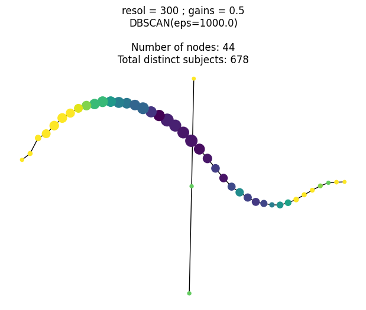

```{r setup, include=FALSE}
library(knitr)

# <!-- Copies an HTML dependency to a subdirectory of the given directory. The subdirectory name willbename-version(for example, "outputDir/jquery-1.11.0"). You may setoptions(htmltools.dir.version= FALSE)to suppress the version number in the subdirectory name. -->
options(htmltools.dir.version = FALSE)

knitr::opts_chunk$set(echo = FALSE)
```

## RNA-seq and the curse of high dimensionality

- High-dimensional spaces get really weird really fast

- The 10%  of a unit cube occupies almost the whole cube at high dimensions

- RNA-seq data lies in a 20,000-dimensional space.

- Reducing dimension is crucial to understand the data.


---

# Mapper vs t-SNE, PCA, and others

- They only take high-dimensional proximity into account.

- They discard shape structure in gene expression profiles. 


<p style="font-size: 9px; text-align: right; color: Grey;"> Credits: <a href="https://doi.org/10.1142/9789813279827_0032">Wang <em>et al.</em> (2018)</a></p>

---

# Capture intrinsic shape with Mapper

- Mapper captures the shape of data by representing data as topological networks. 

- Mapper is robust to noise and different platforms, while preserving the locality and data continuity.


<p style="font-size: 9px; text-align: right; color: Grey;"> Credits: <a href="https://doi.org/10.1142/9789813279827_0032">Wang <em>et al.</em> (2018)</a></p>

---

class: inverse, middle, center

# Mapper: a toy example

## A Topological Method for the Analysis of High Dimensional Data Sets

---

background-image: url("../../tda/figs/mapper_b_00.jpg")
background-size: 725px
background-position: 50% 95%

## Topological summary: exploration and visualization

- We start with **lots** of data points $X$ in a **high-dimensional** space

- We want just a **handful** of points in a **low-dimensional** space that roughly preserve the original **shape**

---

background-image: url("../../tda/figs/mapper_b_01.jpg")
background-size: 725px
background-position: 50% 95%

## Pick a filter function

- Assign every data point a real value: lens or filter function

- We pick *height* in this case

---

background-image: url("../../tda/figs/mapper_b_02.jpg")
background-size: 725px
background-position: 50% 95%

## Pick a number of bins and overlap percentages

- Split the filter values into a series of overlapping bins

- More bins &rarr; better topological resolution but risk of overfitting

---

background-image: url("../../tda/figs/mapper_b_03.jpg")
background-size: 725px
background-position: 50% 95%

## Consider the filter preimages and cluster

- Check which data points correspond to the first bin based on their filter values (the preimage)

---

background-image: url("../../tda/figs/mapper_b_04.jpg")
background-size: 725px
background-position: 50% 95%

## Consider the filter preimages and cluster

- Check which data points correspond to the first bin based on their filter values (the preimage)

- Cluster the data points in the preimage

---

background-image: url("../../tda/figs/mapper_b_05.jpg")
background-size: 725px
background-position: 50% 95%

## Consider the filter preimages and cluster

- Check which data points correspond to the first bin based on their filter values (the preimage)

- Cluster the data points in the preimage

- Each cluster will form an individual node in our mapper graph

---

background-image: url("../../tda/figs/mapper_b_06.jpg")
background-size: 725px
background-position: 50% 95%

## Consider the filter preimages and cluster

- Do the same for the next filter bin

---

background-image: url("../../tda/figs/mapper_b_07.jpg")
background-size: 725px
background-position: 50% 95%

## Consider the filter preimages and cluster

- Do the same for the next filter bin

- We have two clusters now

---

background-image: url("../../tda/figs/mapper_b_08.jpg")
background-size: 725px
background-position: 50% 95%

## Are there points shared in the overlap?

- Draw an edge between mapper nodes if their corresponding clusters share data points

- *Optional*: The edge thickness (weight) can be proportional to the number of shared points

---

background-image: url("../../tda/figs/mapper_b_09.jpg")
background-size: 725px
background-position: 50% 95%

## And so on and so forth

- Cluster the data points corresponding to the preimage of a filter bin

- Make nodes in the mapper graph

---

background-image: url("../../tda/figs/mapper_b_10.jpg")
background-size: 725px
background-position: 50% 95%

## And so on and so forth

- Cluster the data points corresponding to the preimage of a filter bin

- Make nodes in the mapper graph

- Draw edges whenever the clusters share points

---

background-image: url("../../tda/figs/mapper_b_11.jpg")
background-size: 725px
background-position: 50% 95%

## Mapper: several moving parts

- Filter function

- Number of bins

- Overlap percentage between bins

---

class: inverse, middle, center

# Mapper in genomics

## Brief literature survey

---

## Mapper to identify novel groups of breast cancer

- Different branches correspond to different molecular profiles and prognosis


<p style="font-size: 9px; text-align: right; color: Grey;"> Credits: <a href="https://doi.org/10.1073/pnas.1102826108">Nicolau <em>et al.</em> (2011)</a></p>

---

# Mapper to differentiate differentiation


<p style="font-size: 9px; text-align: right; color: Grey;"> Credits: <a href="https://doi.org/10.1038/nbt.3854">Rivzi <em>et al.</em> (2017)</a></p>

---

# Mapper in plants

<div class="row">
  <div class="column" style="max-width:42%">
    
    
  </div>
  <div class="column" style="max-width:42%">
    
    
  </div>
</div>

<p style="font-size: 9px; text-align: right; color: Grey;"> Credits: <a href="https://doi.org/10.1101/2022.09.07.506951">Palande <em>et al.</em> (2023)</a></p>

---

class: center, middle inverse

# Case study

## Lung cancer

```{r, out.width=400, fig.align='center'}
knitr::include_graphics('../figs/amezquita_etal_2023.png')
```

---

# Setup

- FPKM counts of RNAseq data from human lung tissue &rarr; 19,648 genes
    - 314 healthy samples (GTEx)
    - 500 cancerous samples (TCGA)

- We need to standardize the data across subjects: consider Z-scores.

- However, FPKM data tends to be bimodal 
    - Cuttoff can be determined with ChIP-seq

```{r, out.width=400, fig.align='center'}
knitr::include_graphics('https://media.springernature.com/full/springer-static/image/art%3A10.1186%2F1471-2164-14-778/MediaObjects/12864_2013_Article_5505_Fig1_HTML.jpg?as=webp')
```
<p style="font-size: 9px; text-align: right; color: Grey;"> Credits: <a href="https://doi.org/10.1186/1471-2164-14-778">Hart <em>et al.</em> (2013)</a></p>

---


# Setup

- FPKM counts of RNAseq data from human lung tissue &rarr; 19,648 genes
    - 314 healthy samples (GTEx)
    - 500 cancerous samples (TCGA)

- We need to standardize the data across subjects: consider Z-scores.

- However, FPKM data tends to be bimodal 
    - Fit two Gaussians instead of one to account for bimodality (GMM)


---

## Z-scores from a Gaussian Mixture Model (GMM)

Let $y$ be a random $p$-dimensional vector generated by a GMM of $K$ components:

$$f(y) = \sum_{k=1}^K \pi_k\varphi(y | \mu_k, \Sigma_k)$$

- According to Bayes' Theorem, the posterior probability $w_k=P(c=k|y)$ that $y$ belongs to the $k$-th class is given by

$$w_k = \frac{\pi_k\varphi_k(y)}{\sum_{k=1}^K\pi_k\varphi_k(y)}$$

$$T_0 = Z\cdot\mathbb{I}(\tilde{s}_1 = s_1) + (\tau^{-1}Z - \Delta_1)\cdot\mathbb{I}(\tilde{s}_1 > s_1) + (\tau Z + \tau\Delta_1)\cdot\mathbb{I}(\tilde{s}_1 < s_1)$$




---

# Filter function: mean correlation

- Filter by mean correlation (average of 814 correlation values)
  
- Vary the number of bins $60 \leq b \leq 110$

- Vary the overlap percentage $30 \leq p \leq 80$
    
- Color the mapper node based on the number of healthy subjects in the cluster
    - Bright yellow: 100% cancerous samples
    - Deep purple: 100% healthy samples

.pull-left[

]

.pull-right[

]

---

# Notice that cancerous samples are split

.pull-left[


]

.pull-right[
- Mapper produced mostly strand-like graphs regardless of parameters used

- Position Index for each subject: 
    - **`-1`**: subject is part of the 13 leftmost nodes
    - **`+1`**: subject is part of the 13 rightmost nodes

- Healthy subjects tend to stay at the center

- Cancerous samples are distributed at both ends
]

---

# This split cannot be captured with t-SNE!

- tSNE does a pretty good job separating healthy vs cancerous samples (purple vs yellow)

- However, finer structural details are lost
   - (a): Using FPKM
   - (b): Using GMM Z-scores


---

# Mathematical stability

- When varying several parameters, the cancerous samples exhibit a much different behavior on the mapper graph than the healthy subjects.

- Confidence intervals (black: superior limit, green: lower limit, red: average value)

```{r, out.width=500, fig.align='center'}
knitr::include_graphics('https://journals.plos.org/plosone/article/figure/image?size=large&id=10.1371/journal.pone.0284820.g010')
```

---

# Biological significance


---

# Conclusions

---

background-image: url("https://upload.wikimedia.org/wikipedia/commons/4/4a/University_of_Missouri_logo.svg")
background-size: 60px
background-position: 99% 1%

class: inverse

# Thank you!

<div class="row">
  <div class="column" style="max-width:15%; font-size: 15px;">
    </img>
    <p style="text-align: center;">Farzana Nasrin (Hawaii)</p>
  </div>
  <div class="column" style="max-width:15%; font-size: 15px;">
    </img>
    <p style="text-align: center;">Katie Storey (Lafayette)</p>
  </div>
  <div class="column" style="max-width:13.5%; font-size: 15px;">
    </img>
    <p style="text-align: center;">Masato Yoshizawa (Hawaii)</p>
  </div>
  <div class="column" style="width:6.5%; font-size: 24px;">
    <p></p>
  </div>
  <div class="column" style="max-width:50%; font-size: 24px; line-height:1.25">
    <p style="text-align: center;"><strong>Email</strong></p>
    <p style="text-align: center; color: Blue; font-family: monospace;">eah4d@missouri.edu</p>
    <p style="text-align: center;"><strong>Website and slides</strong></p>
    <p style="text-align: center; color: Blue; font-family: monospace;">ejamezquita.github.io</p>
  </div>
</div>

<div class="row">
  <div class="column" style="max-width:15%; font-size: 15px;">
    </img>
    <p style="text-align: center;">COBRE &mdash; P20GM125508</p>
  </div>
  <div class="column" style="max-width:12%; font-size: 15px;">
    </img>
  </div>
  <div class="column" style="width:23%; font-size: 15px;">
    <p>
      Vladislav Bukshtynov<br>
      Steven Ellis<br>
      Elin Farnell<br>
      Hwayeon Ryu<br>
      Sarah Tymochko
    </p>
  </div>
  <div class="column" style="max-width:50%; font-size: 24px; line-height:1.25">
    
  </div>
</div>

    