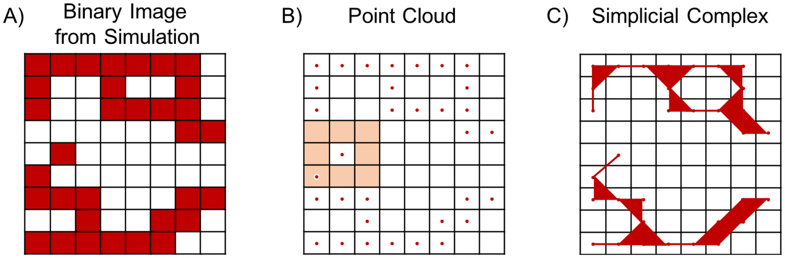
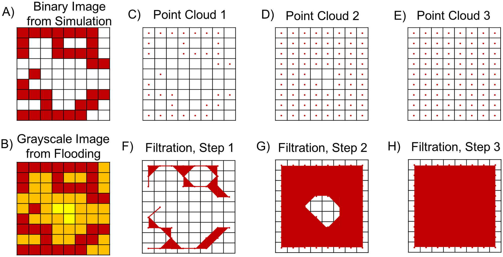
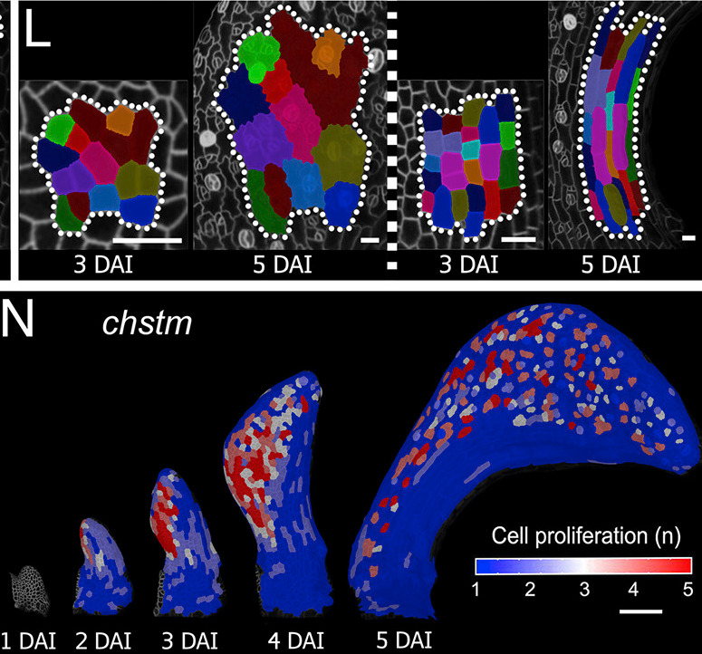
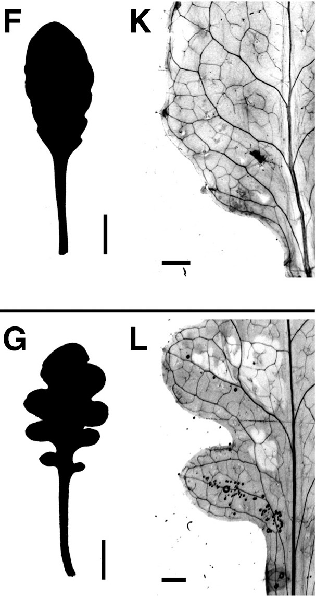

```{r setup, include=FALSE}
library(reticulate)
library(knitr)

options(htmltools.dir.version = FALSE)
knitr::opts_chunk$set(echo = FALSE)
knitr::opts_chunk$set(fig.align = 'center')
```

# Topological Data Analysis (TDA)

<div class="row">
  <div class="column" style="max-width:25%; font-size: 15px;">
    
    <p style="font-size: 25px; text-align: center; color: DarkRed;"> Raw Data </p>
    <ul>
      <li> micro-CT </li>
      <li> Point clouds </li>
      <li> Time series </li>
    <ul>
  </div>
  <div class="column" style="max-width:40%; padding: 0 25px 0 25px; font-size: 15px;">
    
    <p style="font-size: 23px; text-align: center; color: DarkRed;"> Topological Summary </p>
    <ul>
      <li> Euler Characteristic </li>
      <li> Persistence diagrams </li>
      <li> CROCKER plots </li>
    <ul>
  </div>
  <div class="column" style="max-width:35%; font-size: 15px;">
    
    <p style="font-size: 25px; text-align: center; color: DarkRed;"> Analysis </p>
    <ul>
      <li> Statistics </li>
      <li> Machine learning </li>
      <li> Classification/prediction </li>
    <ul>
  </div>
</div>

---

# 1st TDA Ingredient: Complexes

- Think the data as a collection of elementary building blocks ( _simplices_ )

Vertices | Edges | Faces | Tetrahedrons
---------|-------|-------|-------
  0-dim  | 1-dim | 2-dim | 3-dim

- A collection of cells is a _simplicial complex_

- Count the number of topological features ( _holes_ ):

Connected components | Loops | Voids
---------------------|-------|-------
       0-dim         | 1-dim | 2-dim

- Example with 2 connected components, 1 loop, 0 voids

```{r, out.width=600}

```
<p style="font-size: 10px; text-align: right; color: Grey;"> Credits: <a href="https://doi.org/10.1371/journal.pcbi.1009094">Nardini <em>et al.</em> (2021)</a></p>

---

# 2nd TDA Ingredient: Filters

- Each simplex is assigned a real value which defines how the complex is constructed.

- Observe how the number of topological features change as the complex grows.

.pull-left[
```{r, out.width="250px"}
knitr::include_graphics(c("../../barley/figs/eigcurv_filter.gif", "../../barley/figs/gaussian_density_filter.gif"))
```
]

.pull-right[
```{r, out.width="250px"}
knitr::include_graphics(c("../../barley/figs/eccentricity_filter.gif", "../../barley/figs/vrips_ver2.gif"))
```
]

---

# Combining both ingredients


<p style="font-size: 10px; text-align: right; color: Grey;"> Credits: <a href="https://doi.org/10.1371/journal.pcbi.1009094">Nardini <em>et al.</em> (2021)</a></p>

---

## Example 1: Image data &rarr; Grayside filter

### Detecting holes &rarr; detect/characterize cancerous tissue

.pull-left[

]

.pull-right[

]

<p style="font-size: 10px; text-align: right; color: Grey;"> Credits: <a href="https://doi.org/10.1016/j.media.2019.03.014">Qaiser <em>et al.</em> (2019)</a></p>

---

## Image data &rarr; Multiple ways to filter

### Quantify cell fate-map morphologies

.pull-left[

<p style="font-size: 10px; text-align: right; color: Grey;"> Credits: <a href="https://doi.org/10.1016/j.cell.2019.05.011">Kierzkowski <em>et al.</em> (2019)</a></p>
]

.pull-right[

<p style="font-size: 10px; text-align: right; color: Grey;"> Credits: <a href="https://doi.org/10.1016/j.media.2019.03.014">Qaiser <em>et al.</em> (2019)</a></p>
]

---

## Image data &rarr; Multiple ways to filter

### Quantify cell fate-map morphologies

.pull-left[

<p style="font-size: 10px; text-align: right; color: Grey;"> Credits: <a href="https://doi.org/10.1016/j.cell.2019.05.011">Kierzkowski <em>et al.</em> (2019)</a></p>
]

.pull-right[
- Growth amount

- Anisotropy

- Cell proliferation

- Cell size

- Stomatal density

- Lobeyness
]

---

### Multiple TDA ways to characterize and compare shape

```{r, out.width="650px"}
knitr::include_graphics(c("../figs/guzel_etal_2022_f7.png"))
```
<p style="font-size: 10px; text-align: right; color: Grey;"> Credits: <a href="https://arxiv.org/abs/2206.03973">Güzel <em>et al.</em> (2022)</a></p>

```{r, out.width="650px"}
knitr::include_graphics(c("../figs/kierzkowski_etal_2019_f4_no.jpg"))
```
<p style="font-size: 10px; text-align: right; color: Grey;"> Credits: <a href="https://doi.org/10.1016/j.cell.2019.05.011">Kierzkowski <em>et al.</em> (2019)</a></p>

---

background-image: url("../figs/guzel_etal_2022_f12.png")
background-size: 600px
background-position: 50% 60%

## Keep track of temporal data &rarr; CROCKER plot

<p style="font-size: 10px; text-align: right; color: Grey;"> Credits: <a href="https://arxiv.org/abs/2204.06321">Güzel <em>et al.</em> (2022)</a></p>

---

background-image: url("../figs/guzel_etal_2022_f12.png")
background-size: 600px
background-position: 50% 60%

## Keep track of temporal data &rarr; CROCKER plots

```{r, out.width="800px"}
knitr::include_graphics(c("../figs/kierzkowski_etal_2019_f4_no.jpg"))
```

---

## Other ways, other morphologies &rarr; River beads

.pull-left[

<p style="font-size: 10px; text-align: right; color: Grey;"> Credits: <a href="https://doi.org/10.1016/j.cell.2019.05.011">Kierzkowski <em>et al.</em> (2019)</a></p>
]

.pull-right[


<p style="font-size: 10px; text-align: right; color: Grey;"> Credits: <a href="https://doi.org/10.1029/2019JF005206">Hiatt <em>et al.</em> (2019)</a></p>
]