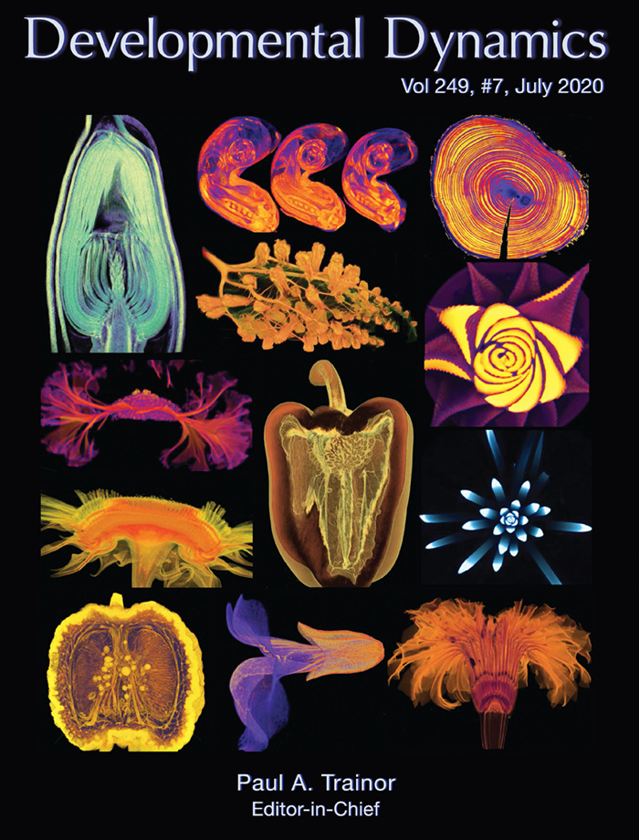
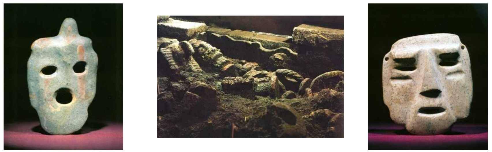
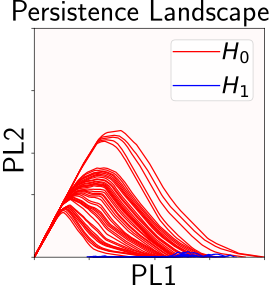
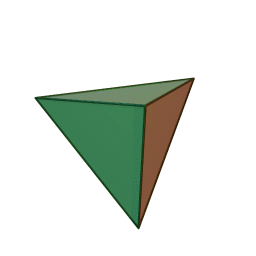
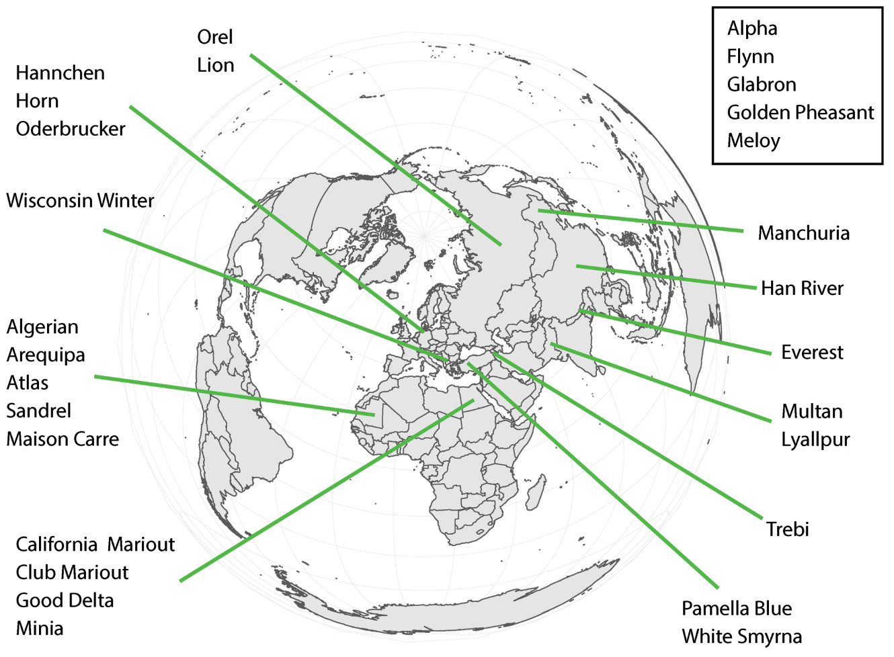
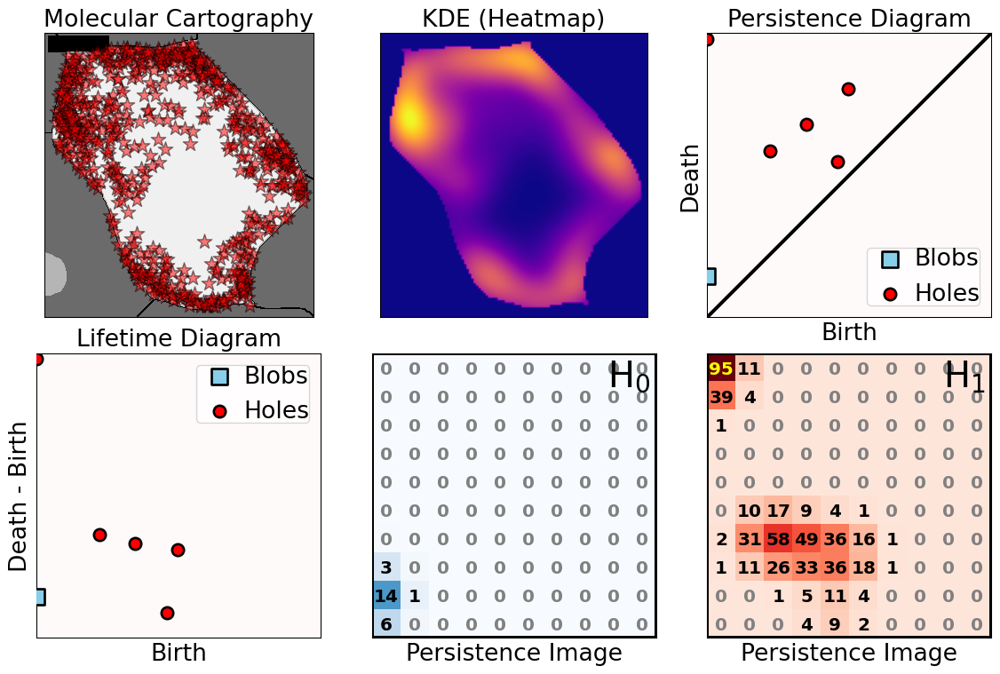
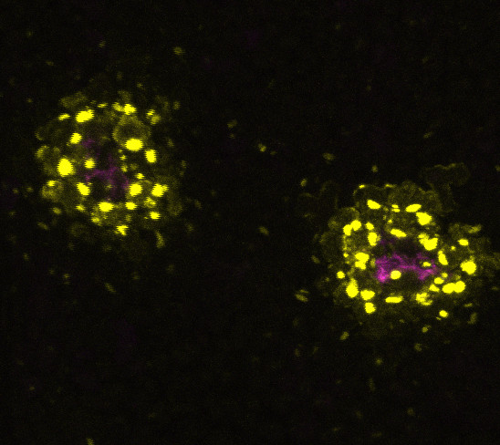
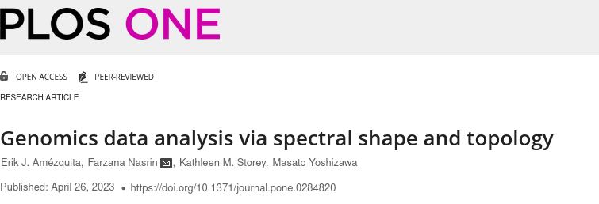

```{r setup, include=FALSE}
library(knitr)
library(magrittr)
genes = c('GLYMA_17G195900', 'GLYMA_05G092200')
options(htmltools.dir.version = FALSE)
knitr::opts_chunk$set(echo = FALSE)
knitr::opts_chunk$set(fig.align = 'center')
```

background-image: url("../../demat/figs/fam9_3.png")
background-size: 100px
background-position: 98% 2%

# Hoja de Vida: MX&rarr;MI&rarr;MO y MU

## Trabajando a través de disciplinas y países

.left-column[

]

.right-column[
- 2013 - 2018 : Licenciatura: Mathemáticas @ Universidad de Guanajuato y CIMAT. 
- 2018 - 2023 : PhD: Computational Mathematics, Science &amp; Engineering @ Michigan State University 
- 2023 - 2025 : ~~PFFFD~~ ~~PFFIE~~ PFF Postdoctoral Fellow: Plant Science / Mathematics @ University of Missouri.
- 2025 - present: Assistant Professor: Plant Science / Math @ University of Missouri. 
]

---

background-image: url("../../demat/figs/ecg_results.png")
background-size: 700px
background-position: 50% 80%

# Licenciatura &rarr; ATD &oplus; Arqueología

Análisis Topológico de Datos para la clasificación de máscaras precolombinas (INAH)

--

.pull-left[

```{r, out.width=310}
knitr::include_graphics("../../demat/figs/barrett_poster-1.jpg")
```
]

--

.pull-right[


```{r, eval=FALSE, echo=TRUE}
*- Lecciones de vida para 
* trabajo interdisciplinario
* a futuro.
  
*- Siempre hay que incluir
* en todos los paso a los 
* expertos disciplinarios

*- Ser humilde y aprender
* lo básico de otras ramas
```
]

---

# ATD &oplus; Arqueología: va de nuez

.pull-left[



<p style="font-size: 10px; text-align: center; color: Grey;">Credits: <a href="http://mediateca.inah.gob.mx/repositorio/islandora/object/tesis%3A4497">Olmedo Vera and Gonz&aacute;lez (1986)</a></p>
]

.pull-right[

]

---

class: inverse, center, middle

# Soy un matemático por formación, un científico de datos por necesidad, y un biólogo por ~~colaboración~~ ósmosis

```{r, out.width=400}
knitr::include_graphics("../../biology/figs/osmosis-in-plant-cell.png")
```

---

background-image: url("../../arabidopsis/figs/PFig1.png")
background-size: 900px
background-position: 50% 70%

# Cuantificación de formas &oplus; Botánica

- Cuantificando la intuición
- Intuyendo la cuantificación

---

# MSU: De matemático a biólogo vegetal

<div class="row" style="font-family: 'Yanone Kaffeesatz'; font-size:22px;">
  <div class="column" style="max-width:33%">
    <p style="line-height:0;text-align: center; font-size:28px">La forma de adaptarse</p>
    </img>
    </img>
    <p style="text-align: center;">Análisis Topológico de Datos</p>
    <p style="text-align: center;">Euler Characteristic Transform</p>
  </div>
  <div class="column" style="max-width:33%">
    <p style="line-height:0;font-size:28px;text-align: center;">La forma de desarrollarse</p>
    </img>
    </img>
    <p style="text-align: center;">Modelado de elipsoides</p>
    <p style="text-align: center;">Estadística direccional</p>
  </div>
  <div class="column" style="max-width:33%">
    <p style="line-height:0;font-size:28px;text-align: center;">La forma de domesticarse</p>
    </img>
    </img>
    <p style="text-align: center;">Allometría de tejidos</p>
    <p style="text-align: center;">Índices de convexidad</p>
  </div>
</div>

---

# Mizzou: Morfología más allá de las formas

<div class="row" style="font-family: 'Yanone Kaffeesatz'; font-size:22px;">
  <div class="column" style="max-width:33%">
    <p style="line-height:0;text-align: center; font-size:28px">Fenotipando patrones</p>
    </img>
    </img>
    <p style="text-align: center;">Localización espacial de ARNm en nódulos de soya</p>
  </div>
  <div class="column" style="max-width:33%">
    <p style="line-height:0;font-size:28px;text-align: center;">Fenotipando movimiento</p>
    </img>
    </img>
    <p style="text-align: center;">Describiendo la circumnutación de <i>Cuscuta campestris</i></p>
  </div>
  <div class="column" style="max-width:33%">
    <p style="line-height:0;font-size:28px;text-align: center;">Fenotipando datos</p>
    </img>
    </img>
    <p style="text-align: center;">Reduciendo <strong>y</strong> agrupando datos genómicos en dimensiones altas</p>
  </div>
</div>

---


class: inverse, middle, center

# El shock cultural de cambiar de disciplinas has sido muchísimo mayor al de cambiar de países

```{r, out.width=500}
knitr::include_graphics("../../img/homotopy_botany.png")
```

# Pero es divertido

---

background-image: url("../../barley/figs/seed.png")
background-size: 325px
background-position: 99% 99%

class: middle

# Orden del día

1. Fenotipando formas: semillas de cebada
   - Euler Characteristic Transform

1. Fenotipando patrones: localización de ARNm en soya
   - Sublevel set persistence
   - Imágenes de persistence

1. Fenotipando datos: RNAseq de tejido pulmonar
   - Mapper
   
1. Proyectos en progreso y ATD a futuro

---

class: inverse, middle, center

# Fenotipando las formas

## ¿Qué tan _morfológica_ &nbsp; es una morfología?

```{r, out.width=500}
knitr::include_graphics("../../barley/figs/amezquita_etal_2021.png")
```

---

# Topología: La característica de Euler $\chi$

$$\begin{align} \chi &= \#(\text{Vértices}) - \#(\text{Aristas}) + \#(\text{Caras}) \\ &= \#(\text{Componentes conexas}) - \#(\text{Ciclos}) + \#(\text{Vacíos}). \end{align}$$

<div class="row">
  <div class="column" style="width:5%">
  </div>
  <div class="column" style="max-width:30%">
    
  </div>
  <div class="column" style="max-width:30%">
    
  </div>
  <div class="column" style="max-width:30%">
    
  </div>
  <div class="column" style="width:5%">
  </div>
</div>

<div class="row">
  <div class="column" style="width:5%">
  </div>
  <div class="column" style="max-width:30%">
    
  </div>
  <div class="column" style="max-width:30%">
    
  </div>
  <div class="column" style="max-width:30%">
    <p style="padding: 50px 0 0 10px; font-size: 48px; text-align: center; color: #18453B; line-height: 1.25; font-family: 'Yanone Kaffeesatz';"> V - A + C = 2</p>
  </div>
  <div class="column" style="width:5%">
  </div>
</div>

---

background-image: url("../../barley/figs/ecc_ver2.gif")
background-size: 750px
background-position: 50% 25%

# La Curva de Característica de Euler (ECC)

<br><br><br><br><br><br><br><br><br><br><br>

<hr>

Para los matemáticos en la sala:

- Consideremos un complejo simplicial/celular $X\subset\mathbb{R}^d$
- Y una dirección unitaria $\nu\in S^{d-1}$
- Y el subcomplejo con todas las células debajo de la altura  $h$ in la dirección $\nu$
$$X(\nu)_h =\{\Delta \in X\::\:\langle x,\nu\rangle\leq h\text{ para todo }x\in\Delta\}.$$
- La curva de característica de Euler (ECC) en dirección $\nu$ se define como $$\{\chi(X(\nu)_h)\}_{h\in\mathbb{R}}.$$
---

background-image: url("../../barley/figs/ect_ver2.gif")
background-size: 800px
background-position: 50% 42%

## La Transformada de Característica de Euler (ECT)

- Repetimos y concatenamos para todas las direcciones posibles.


<br><br><br><br><br><br><br><br><br><br><br><br><br><br><br>

<hr>

$$
\begin{split}
ECT(X):\; & S^{d-1} \to \mathbb{Z}^{\mathbb{R}}\\
&\nu\mapsto\{\chi(X(\nu)_h)\}_{h\in\mathbb{R}}.
\end{split}
$$

- [**Teorema** (Turner, Mukherjee, Boyer 2014) & (Curry, Mukherjee, Turner, 2022)](http://arxiv.org/abs/1805.09782):  La ECT is inyectiva con una cota finita en el número necesario de direcciones.

---

class: inverse

<div class="row">
  <div class="column" style="max-width:44%">
    <a href="https://cereal.interreg-npa.eu/subsites/CEREAL/Barley_cultivation-Norway_Presentation_2018.pdf" target="_blank"></a>
    <a href="https://www.resilience.org/stories/2020-03-09/the-last-crop-before-the-desert/" target="_blank"></a>
    <a href="https://www.doi.org/10.1007/978-1-4419-0465-2_2168" target="_blank"></a>
  </div>
  <div class="column" style="max-width:44%">
    <a href="https://www.bloomberg.com/news/articles/2020-09-13/iraq-to-offer-first-ever-barley-exports-as-rains-yield-surplus" target="_blank"></a>
    <a href="https://www.tibettravel.org/tibetan-culture/highland-barley.html" target="_blank"></a>
    <div class="row">
      <div class="column" style="max-width:46%">
        
      </div>
      <div class="column" style="max-width:55%">
        
      </div>
    </div>
  </div>
  <div class="column" style="max-width:8%; font-size: 15px;">
    <p style="text-align: center; font-size: 30px; line-height: 1em;"><strong>Cebada a lo largo del mundo</strong></p>
    <p>28 variantes cebada</p>
    <p>Traídas California en 1929</p>
    <p>Evolución artificial por 58 generaciones</p>
    <p>975 espigas escaneadas</p>
    <p>38,000 semillas analizadas</p>
  </div>
</div>

---

# Aprendizaje de máquina supervisado

**Meta:** Clasificar las **28** variantes de cébada usando solo la morfología de sus semillas.

```{r, out.width=750, fig.align='center'}
knitr::include_graphics('../../demat/figs/supervised_learning.png')
```


---

# Cuantificando la forma de la cebada

**Meta:** Clasificar las **28** variantes de cébada usando solo la morfología de sus semillas.

<style type="text/css">
.tg  {border-collapse:collapse;border-color:#93a1a1;border-spacing:0;margin:0px auto;}
.tg td{background-color:#fdf6e3;border-bottom-width:1px;border-color:#93a1a1;border-style:solid;border-top-width:1px;
  border-width:0px;color:#002b36;font-family:Arial, sans-serif;font-size:14px;overflow:hidden;padding:10px 5px;
  word-break:normal;}
.tg th{background-color:#657b83;border-bottom-width:1px;border-color:#93a1a1;border-style:solid;border-top-width:1px;
  border-width:0px;color:#fdf6e3;font-family:Arial, sans-serif;font-size:14px;font-weight:normal;overflow:hidden;
  padding:10px 5px;word-break:normal;}
.tg .tg-2bhk{background-color:#eee8d5;border-color:inherit;text-align:left;vertical-align:top}
.tg .tg-0pky{border-color:inherit;text-align:left;vertical-align:top}
.tg .tg-gyvr{background-color:#eee8d5;border-color:inherit;font-size:100%;text-align:left;vertical-align:top}
</style>
<table class="tg">
<thead>
  <tr>
    <th class="tg-0pky">Morfología</th>
    <th class="tg-0pky"># de descriptores</th>
    <th class="tg-0pky">F1</th>
  </tr>
</thead>
<tbody>
  <tr>
    <td class="tg-2bhk">Tradicional</td>
    <td class="tg-2bhk">11</td>
    <td class="tg-2bhk">0.55 &plusmn; 0.019</td>
  </tr>
  <tr>
    <td class="tg-0pky">Topológica</td>
    <td class="tg-0pky">12</td>
    <td class="tg-0pky">0.74 &plusmn; 0.016</td>
  </tr>
  <tr>
    <td class="tg-2bhk">Combinada</td>
    <td class="tg-2bhk">23</td>
    <td class="tg-2bhk"><strong>0.86 &plusmn; 0.010</strong></td>
  </tr>
</tbody>
</table>

### ¿Qué mide la topología?

.pull-left[
```{r, out.width=225}
knitr::include_graphics(c('../../barley/figs/discerning_directions.png'))#, '../figs/arrow_seed_09_0.gif'))
```
]

.pull-right[

]

---

# En territorio semi-supervisado


---

# En territorio semi-supervisado

- Usamos 100% de las semillas $(F_0)$ como entrenamiento

- Clasificamos la progenie $F_{58}$: enriquecimiento ADN (genotipo) &harr; forma (fenotipo)

.pull-left[

]

.pull-right[

]

---

background-image: url("../figs/amezquita_etal_2021.png")
background-size: 300px
background-position: 98% 2%


# En resumen

.left-column[
```{r, out.width=150, fig.align='center'}
knitr::include_graphics(c('../../barley/figs/S017_L3_1.gif', '../../barley/figs/ecc_X.gif'))
```
]

.right-column[
- **ATD** describe información morfológica **sutil** que no es obvia a primera vista.

- Los mejore resultados ocurren cuando se **combinan** descriptores morfológicos tradicionales y topológicos.

- La dinámica **genética** poblacional es similar a la observada con descriptores **morfológicos**.

- Fenotipar es más barato (en general) que genotipar.
]


---

# Color me rooted and phenotyped!

.pull-left[


Persistent intensity peak color
]

.pull-right[


Soybean root phenotyping across years

]


---

class: inverse, middle, center

# Fenotipando patrones

## ¿Qué tan *patrónico* es un patrón?

```{r, out.width=600}
knitr::include_graphics("../../mcarto/figs/sutton_etal_2025.png")
```

---

# Localización a escala subcelular

- Más allá de niveles de expresión: segregación espacial y distribución asimétrica de ARNm a lo largo del citosol en el nódulo de la soya.

- Datos de Molecular Cartography&trade; en colaboración con el Laboratorio Libault.

.pull-left[

Células del nódulo de soya. Glyma.05G092200 en verde; Glyma.05G216000 en rojo.
]

.pull-right[

**Meta**: "¿Que tán patrónico es el patrón?"

- Cuantificar los patrones espaciales de ARNm dentro de cada célula.
- Modelar y agrupar matemáticamente todos los patrones observados
- *Usar dicho modelo para diferenciar tipos de células y genotipos.*

**Desafío**

- Desarrollar un modelo matemático de patrones que es robusto ante cambios de tamaños, orientación y dimensiones de células.


]

---

# Mismo nivel de expresión, pero no patrón


**Patrónes transcriptómicos subcelulares &harr; Localización espacial de la célula dentro del nódulo**

---

```{r include=FALSE, evaluate=FALSE}
slides_info <- tibble::tibble(first  = formatC(0:11, digits=1, format='d', flag='0'))

slides_text <- glue::glue_data(
  slides_info,
  "
  # ATD: islas y agujeros
  
  
  
  "
)
```

`r slides_text %>% paste(collapse = "\n---\n")`

---

# Rotar 45 grados para AM


---

# ATD: De patrones a números



---


# ATD con 900 células y 2 genes

```{r, out.width=500}
knitr::include_graphics(c('../../mcarto/figs/molecular_cartography_2x4.png'))
```

```{r, out.width=600}
knitr::include_graphics(c('../../mcarto/figs/persistence_images_2x4.png'))
```

---

background-image: url("../../mcarto/figs/bw25_scale32_-_PI_1_1_1_H1+2_cell_sample.png")
background-size: 620px
background-position: 75% 99%

# PCA con los descriptores topológicos

```{r, out.width=350, fig.align='left'}
knitr::include_graphics(c('../../mcarto/figs/bw25_both_scale16_-_PI_1_1_1_pca_H1+2_gridded.png'))
```

---

background-image: url("../../mcarto/figs/bw25_scale32_-_PI_1_1_1_H1+2_kde_sample.png")
background-size: 620px
background-position: 99% 50%

.left-column[

# PC 1
- Relacionado al número de puntos distintos de concentración.
- Correlacionado con el número de ARNms y el tamaño de la célula.

# PC 2
- Relacionado a la heterogeneidad de los puntos de concentración. 
- Correlacionado a la densidad de ARNms

]

---

# El contexto biológico de PC 02


- Células senescientes exhiben patrones transcriptómicos espaciales distintos comparados con el resto de las células.
- Patrones más difusos y homogéneos de ARNm pueden contribuir a la senescencia de la célula en primer lugar.

---

# Definimos un morfo-espacio de patrones transcriptómicos


# Y después podemos irnos "pa'trás"

---

class: bottom

background-image: url("../../mcarto/figs/scale32_-_PI_1_1_1_H1+2_synthetic_30_clusters.jpg")
background-size: 900px
background-position: 50% 1%

```{r, out.width=600}
knitr::include_graphics(c('../../mcarto/figs/scale32_-_PI_1_1_1_H1+2_synthetic_pca_30_clusters.jpg'))
```

---

class: bottom

background-image: url("../../mcarto/figs/scale32_-_PI_1_1_1_H1+2_synthetic_varclusters.jpg")
background-size: 900px
background-position: 50% 1%

```{r, out.width=600}
knitr::include_graphics(c('../../mcarto/figs/scale32_-_PI_1_1_1_H1+2_synthetic_pca_varclusters.jpg'))
```

---

# Resumen

- La homogeneización de patrones transcriptómicos puede contribuir a la senescencia de las células.

- ¿Cómo cambiaría el morfoespacio de patrones si considermos más genes, más células, más tejidos, y más mutantes?

- ATD puede cuantificar patrones de una manera robusta a cambios de tamaño, orientación, dimensionalidad y contornos

- Relativamente fácil extender nuesto análisis si hubiesen más datos disponibles. 

```{r, out.width=550}
knitr::include_graphics(c('../../mcarto/figs/D2_GLYMA_05G092200_z_kde_pd_suplevel_by_both_00512.jpg'))
```

---


# Patrones en pavimento y en batallas

.pull-left[

```{r, out.width=280, fig.align='center'}
knitr::include_graphics(c('../../psd/figs/adjacency_filtration_WT2.png'))
```


Giant cells in pavement cells. 

]

.pull-right[



Spatial transcriptomics of a battlefield

]


---

class: inverse, middle, center

# Fenotipando datos

## La forma de los datos -ómicos y de biología molecular

```{r, out.width=750, fig.align='center'}

```

---

background-image: url("../../nasrin/figs/mapper_vs_tsne_half.png")
background-size: 450px
background-position: 10% 90%


# Problema: Datos en dimensiones muy altas

- Conteos FPKM de datos RNAseq tejido pulmonar humano &rarr; 19,648 genes
    - 314 muestras saludables (GTEx)
    - 500 muestras cancerosas (TCGA)

- t-SNE (o UMAP) separa muestras saludables de cancerosas (azul vs rojo)
   
.pull-right[

**Pregunta:**

"¿Los datos RNAseq están organizados con cierta estructura?"

- ¿Habrán subgrupos de cancer que ignoramos?
- ¿Podemos ir de agrupamientos a continuos?
- ¿Cuál es la base biológica de dicho continuo?

]


---

background-image: url("../../tda/figs/mapper_b_00.svg")
background-size: 725px
background-position: 50% 95%

# Mapper 

## Resumen topológico: exploración y visualización

- Empezamos con **muchos** puntos/muestras en **altas dimensiones**.

- Queremos solo **unos cuantos** puntos en un espacio de **dimensión baja** que preserven la **estructura** original de altas dimensiones.

---

background-image: url("../../tda/figs/mapper_c_complete.svg")
background-size: 525px
background-position: 50% 99%

# Mapper en una única caricatura

---

# Mapper y datos de cáncer pulmonar

.pull-left[


]

.pull-right[
- Mapper produjo estructuras lineales para la mayoría de parametros usados.

- Las muestras saludables tienden a permanecer en el centro

- Las muestras cancerosas tienden a estar divididas en ambos extremos de la línea

- Las muestras saludables cerca de los extremos pueden estar en riesgo

- __Modelo predictivo__: Un continuo que indica el riesgo de desarrollar cancer pulmonar __y__ el subtipo de cancer.

]

---

# Interpretación biológica: GO Analysis


---

# En resumen

.pull-left[
- Visualización de datos que puede ayudarnos a enfocar nuestra investigación.

- Mapper puede hallar subgrupos nuevos y revelar sutilezas.

- Metodo agnóstico a cualquier tipo de datos -ómicos

- Mapper todavía es poco usado, en especial en biología vegetal: oportunidad de trabajo novedoso.


]

.pull-right[


]


---


background-image: url("../../nasrin/figs/rice_mapper_2025-11-20.png")
background-size: 905px
background-position: 50% 90%

# Liderando la resistencia con mapper

- RNASeq data de muestras de arroz: control e infección bacterial
- Agrupando genes expresados diferencialmente para entender inmunidad


---


background-image: url("https://plantsandpython.github.io/PlantsAndPython/_images/plants_python_logo.jpg")
background-size: 180px
background-position: 99% 1%

class: inverse, center, middle

# Formando a la siguiente generación de científicos interdisciplinarios

## Un gran número de datos requieren un gran número de personas

<p style="font-size: 2.25em; text-align: center; color: Blue;">ejamezquita.github.io/plnt_sci2500</p>

---

## Diagramas de persistencia

<p align="center">
<iframe width="800" height="550" src="../../tutorials/slides/tda_distances_pca_pipeline.html" title="persistence diagrams">
</iframe>
</p>

---

## Mapper sin saber como programar

<p align="center">
<iframe width="800" height="550" src="../../tutorials/slides/inital_mapper_pipeline.html" title="mapper">
</iframe>
</p>


---

## PLNT_SCI 2500: Clase formal de Python

<p align="center">
<iframe width="800" height="550" src="https://ejamezquita.github.io/plnt_sci2500/" title="PLNT SCI 2500">
</iframe>
</p>


---

## PLNT_SCI 2500: Clase formal de Python

<p align="center">
<iframe width="800" height="550" src="../../tutorials/plnt_2500/SanchezOvando_et_al_2025.html" title="Day14">
</iframe>
</p>


---


background-image: url("https://upload.wikimedia.org/wikipedia/commons/4/4a/University_of_Missouri_logo.svg")
background-size: 60px
background-position: 99% 1%

class: inverse

## ¡Gracias por escuchar!

.pull-left[

**Barley seeds &oplus; ECT**

- Liz Munch
- Dan Chitwood
- Michelle Quigley
- Tim Ophelders
- Jacob Landis
- Dan Koenig

**mRNA sub-cellular localization**

- Sutton Tennant
- Sandra Thibivillers
- Sai Subhash
- Benjamin Smith
- Samik Bhattacharya
- Jasper Kläver
- Marc Libault

**Mapper for lung cancer**

- Farzana Nasrain
- Katie Storey
- Masato Yoshizawa


]

.pull-right[

**Collaboration of the IPG network**

- Ethan Lenhardt
- Sophia Knehans
- Roberto Herrera
- David Braun

**Other ongoing TDA projects**

- Laura Martins
- Mather Khan
- David Mendoza-Cozatl
- Jie Zhu
- Felix Fritschi
- Jose Costa Netto
- Tim Duff
- Olivia Fisk
- Gloria Asare
- Ajay Gupta
- Bing Yang
- Tyler Mitts
- Colin Nichols


**More details**

<p style="font-size: 20px; text-align: center; color: Blue;">ejamezquita.github.io/plnt_sci2500</p>
<p style="font-size: 20px; text-align: center; color: Blue;">eah4d@missouri.edu</p>

]


---

# Más sobre la ECT

- Fácil de calcular: suma alternante

- Complejos simpliciales *distintos* corresponden ECTs *distintas*.

- [**Theorem _(ibid)_**](https://arxiv.org/abs/1310.1030): La ECT es una estadística que resume toda la información morfológica.

There is elusive math research on computationally efficient reconstruction algorithms:
- [Turner, Mukherjee, Curry (2021)](https://arxiv.org/abs/1805.09782): Finite number of directions
- [Betthauser (2018)](https://people.clas.ufl.edu/peterbubenik/files/Betthauser_Thesis.pdf): 2D reconstruction
- [Fasy, Micka, Millman, Schenfisch, Williams (2022)](https://arxiv.org/abs/1912.12759): 3D reconstruction
- [Crawford, Monod, Chen, Mukherjee, Rabadan (2020)](https://doi.org/10.1080/01621459.2019.1671198): Smooth ECT
- [Jiang, Kurtek, Needham (2020)](https://openaccess.thecvf.com/content_CVPRW_2020/papers/w50/Jiang_The_Weighted_Euler_Curve_Transform_for_Shape_and_Image_Analysis_CVPRW_2020_paper.pdf): Weighted ECT

```{r, out.width="500px"}
knitr::include_graphics(c("../../arabidopsis/figs/ect_col-0_pot0_leaf0.gif"))
```

---

background-image: url("../../tutorials/figs/knehansIPG.jpg")
background-size: 470px
background-position: 0% 85%

# Since we're talking about networks

.pull-right[
**Studying the people that study plants**

- Academic social network analysis inspired by the IPG (Interdisciplinary Plant Group) at the University of Missouri

- Expanded data collection for all 51 land-grant institutions

- Weighted graph:
    - Plant faculty: nodes
    - No. of papers together: edge
    
- Does collaboration/interdisciplinarity lead to better academic outcomes?

- How to quantify collaboration/interdisciplinarity?

w/ Roberto Herrera, Sophia Knehans, David Braun
]
