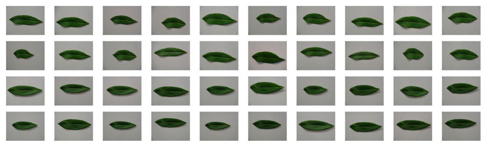

```{r setup, include=FALSE}
library(reticulate)
library(knitr)

# <!-- Copies an HTML dependency to a subdirectory of the given directory. The subdirectory name willbename-version(for example, "outputDir/jquery-1.11.0"). You may setoptions(htmltools.dir.version= FALSE)to suppress the version number in the subdirectory name. -->
options(htmltools.dir.version = FALSE)
knitr::opts_chunk$set(echo = FALSE)
knitr::opts_chunk$set(fig.align = 'center')
```
class: inverse

# Hot takes

- Spent a couple of days reading [Patrangenaru _et al._ (2018)](https://doi.org/10.1007/s13171-018-0137-7).

--

- It feels like two different papers put into one. 

--

- The first half is TDA: points close to the diagonal in a persistent diagram encode **geometric** information.

--

- The second half goes hard into DASS (Data Analysis of Sample Spaces), so I will not really go into details here

--

- However, last year I dabbled into GMM (Geometric Modern Morphometrics), which (I think) is closely related

--

- The conclusion basically says _Here are two different ways to describe the objects depending if you care about the shape (TDA) or landmark position (Frechet means)._

--

- Back to the more familiar TDA realm, I also spent some time going through [Bubenik _et al_ (2020)](https://doi.org/10.1088/1361-6420/ab4ac0).


- Explores the idea that persistent landscapes capture curvature, a geometric property.

---

class: inverse, center, middle

# A morphometrics detour

## Slides by [Thomas Fletcher (Utah)](https://tomfletcher.github.io/GeometryOfData/lectures/L09-ShapeManifolds.pdf)

---

```{r morphometrics, out.width="825px", out.height="650px"}
knitr::include_graphics("https://tomfletcher.github.io/GeometryOfData/lectures/L09-ShapeManifolds.pdf")
```

---

# Object Data Analysis

- Objects represented as points on some manifold or stratified space

--

### Three steps to do ODA

1. Understand the object space of images of continuous functions from planar graphs to 3D.

--

1. Estimate points in the object space.

--

1. Perform statistical analysis in the object space.

---

# Use TDA instead: Persistence landscapes

- TDA provides summaries that are Lipschitz stable

- Vietoris-Rips filtration + Persistence landscapes

--

- Metric equivalence of the object space and its image

--

- Vector space as a proxy for statistical analysis in the object space.

--

### Paradigm shift

- Short bars are geometric signal and carry important nuanced shape information

- Long bars are outliers and are best if ignored

--

[Slides](https://people.clas.ufl.edu/peterbubenik/files/abacus_1.pdf) from [Peter Bubenik](https://icerm.brown.edu/materials/Slides/tri17-1-gtd/Persistence_Landscapes_and_the_Geometry_of_Data_]_Peter_Bubenik,_University_of_Florida.pdf)

---

```{r bubenik1, out.width="825px", out.height="650px"}
knitr::include_graphics("https://people.clas.ufl.edu/peterbubenik/files/abacus_1.pdf")
```

---

class: inverse, middle, center

# Death vectors and Persistence Landscapes

## Leaf application

---

background-image: url("../figs/patrangenaru_2018-11.jpg")
background-size: 675px
background-position: 50% 90%

# Two different leaves from the same tree

- 20 pictures of the same leaf, taken from different points of view.

- No statistical differences were found with traditional geometric tools.

```{r, out.width="675px"}

```
---

background-image: url("../figs/patrangenaru_2018-12.jpg")
background-size: 675px
background-position: 50% 90%

# Sample 4300 (?) points from the border

- Some boundary pixels are noise &rarr; persistent connected components.

- Small bars &rarr; shape nuances that characterize the leaf shape.

---

# Death Vectors and Persistence Landscapes

```{r, out.width="525px"}
knitr::include_graphics(c("../figs/patrangenaru_2018-07.jpg", "../figs/patrangenaru_2018-08.jpg"))
```

---

# Shape signature for every image

```{r, out.width="750px"}
knitr::include_graphics(c("../figs/patrangenaru_2018-13.jpg"))
```

---

# SVM Classification

- Death Vector for $H_0$: $R^{4300}$ descriptor

- Persistent Landscape for $H_1$: Consider the first $\lambda_1, \ldots, \lambda_{60}$ landscape functions.

- Discretize them with a grid a values $0.0, 0.1, 0.2, \ldots, 39.9, 40.0$ (?)

- Produce $60\times401=24060$-dimensional vectors.

- Concatenate both signals to account for the whole shape.

--

- Remove the three most persistent death points

- Remove the first 20 landscape functions

--

- 90% classification accuracy with 10-fold cross validation. (90/10 training/test)

---

class: middle, center, inverse

# Understanding curvature via persistence

## Based on [Bubenik _et al_ (2020)](https://doi.org/10.1088/1361-6420/ab4ac0)

### Slides from [here](https://people.clas.ufl.edu/peterbubenik/files/abacus_3.pdf)

---

# Main results

**Theorem 1**: Let $p(K)$ denote the maximum (Čech) persistence for three points on a surface of constant curvature $K$ with pairwise distances at most some fixed constant. Then $p(K)$ is an invertible function.

--

**Theorem 13**: Suppose $T$ is not an equilateral triangle. Then there exists an equilateral triangle $T'$ such that $b(T') = b(T)$ and $d(T') > d(T)$.

**Theorem 14**. Let $T_{K,a}$ be an equilateral triangle in $M_K$ with side length $a$.
$$p(T_{K,a}) = 
\begin{cases} 
\frac2{a\sqrt{-K}}\sinh^{-1}\left(\frac2{\sqrt3}\sinh\left(\frac{a\sqrt{-K}}2\right)\right) & K<0,\\
\frac2{\sqrt3} & K=0,\\
\frac2{a\sqrt K}\sin^{-1}\left(\frac2{\sqrt3}\sin\left(\frac{a\sqrt K}2\right)\right) & K>0.
\end{cases}$$

**Corollary 15**. Let $a>0$. Let $p_a(K)$ denote the persistence of an equilateral triangle of side length a in a surface of constant curvature $K$. Then $p_a(K)$ is a continuous and increasing function.

---

```{r bubenik2, out.width="825px", out.height="650px"}
knitr::include_graphics("https://people.clas.ufl.edu/peterbubenik/files/abacus_3.pdf")
```

---

## Regression results

- For $K\in\{-2.00,-1.96,\ldots,1.96,2.00\}$, sample 1000 points from the unit disk in the surface of constant curvature $K$ uniformly with respect to the area measure.

- Compute VR-persistence landscape and death vector

- Repeat sampling 100 times to obtain the average death vector and persistence landscape

- Concatenate both $H_0$ and $H_1$ related vectors

- Use these 50 curvature signals as training data

--

- Pick uniformly $K\in[-2,2]$ and compute the average death vector and persistence landscape.

---

## Regression results

```{r, out.width="750px"}
knitr::include_graphics(c("../figs/bubenik_2020-07.jpg"))
```
