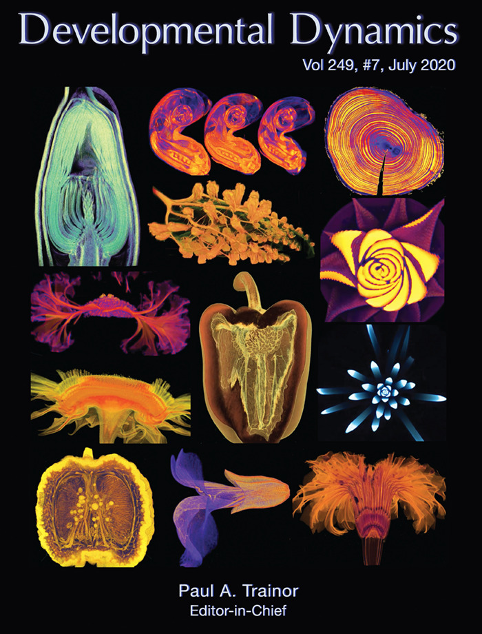
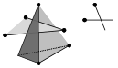

```{r setup, include=FALSE}
library(tibble)
library(magrittr)
library(glue)
library(knitr)

# <!-- Copies an HTML dependency to a subdirectory of the given directory. The subdirectory name willbename-version(for example, "outputDir/jquery-1.11.0"). You may setoptions(htmltools.dir.version= FALSE)to suppress the version number in the subdirectory name. -->
options(htmltools.dir.version = FALSE)
knitr::opts_chunk$set(echo = FALSE)
knitr::opts_chunk$set(fig.align = 'center')
```

class: inverse

# Shape has data, and data has shape

<div class="row">
  <div class="column" style="max-width:19%">
    </img>
    </img>
  </div>
  <div class="column" style="max-width:39%">
    <iframe width="375" height="210" src="https://www.youtube-nocookie.com/embed/LxNSbrfq3kY?si=Qw9qv3Og1XcPIUyg" title="YouTube video player" frameborder="0" allow="accelerometer; autoplay; clipboard-write; encrypted-media; gyroscope; picture-in-picture; web-share" allowfullscreen></iframe>
    </img>
  </div>
  <div class="column" style="max-width:41%">
    </img>
    </img>
  </div>
</div>

---

background-image: url("../../demat/figs/fam9_3.png")
background-size: 100px
background-position: 98% 2%

# From MX to MI to MO at MU

.left-column[

]

.right-column[
- 2013 - 2018 : Math @ at the Universidad de Guanajuato and CIMAT.

- 2016 - 2018 : Bachelor thesis: **Math + Archaeology**. Use TDA to quantify and classify the shape of pre-Columbian masks found in the Templo Mayor in Mexico City.

- 2018 - 2023 : CMSE @ Michigan State University. **Came for the math. Stayed for the plants.**

- 2023 - ???? : PFFIE Postdoc Fellow @ Division of Plant Sciences & Department of Mathematics at Mizzou

]

&mdash;&mdash;&mdash;&mdash;&mdash;

<div class="row">
  <div class="column" style="max-width:49%">
    <iframe width="375" height="210" src="https://www.youtube-nocookie.com/embed/oM9kAq0PBvw?controls=0" frameborder="0" allow="accelerometer; autoplay; encrypted-media; gyroscope; picture-in-picture" allowfullscreen></iframe>
  </div>
  <div class="column" style="max-width:49%">
    <iframe width="375" height="210" src="https://www.youtube-nocookie.com/embed/V39K58evWlU?controls=0" frameborder="0" allow="accelerometer; autoplay; encrypted-media; gyroscope; picture-in-picture" allowfullscreen></iframe>
  </div>
</div>

---

# Roadmap for today

- **I promise you the bulk of slides are just stills from time-lapses**

- It is impossible to cover all there is to know about Topological Data Analysis in a single session

- Go over some basic lingo and applications

- Leave plenty of pointers

- Slides available

---

class: inverse, middle, center

# 1. Motivating Persistence

## Single-linkage clustering

---

background-image: url("../figs/circs2kiss_just_points.svg")
background-size: 500px
background-position: 50% 95%

# How many connected componets you see?

- Infer the underlying topology of a *sampled* finite metric space

- Beyond the naive discrete topology

---

background-image: url("../figs/circs2kiss_just_points.svg")
background-size: 500px
background-position: 50% 95%

# Single linkage clustering of $X$

- For $R\geq0$, consider the relation $\sim_R$
$$x\sim_Rx'\Leftrightarrow d(x,x')\leq R.$$
- Let $\simeq_R$ be the equivalence relation generated by $\sim_R$.
- The equivalence classes under $\simeq_R$ partition $X$ into connected components
- Different $R$s can generate different partitions

- *"What is the right $R$?"*: Ill-posed question

---

```{r include=FALSE}
slides_info <- tibble::tibble(first  = formatC(0:19, digits=2, format='d', flag='0'))

slides_text <- glue::glue_data(
  slides_info,
  "
  background-image: url(\"../figs/circs2kiss_vr0_{first}.svg\")
  background-size: 800px
  background-position: 50% 75%

  # Compatibility accross changes in $R$

  $$x\\sim_Rx'\\Leftrightarrow d(x,x')\\leq R.$$

  - If $R\\leq R'$, then the partition $X_R$ by $\\simeq_R$ is coarser than the partition $X_{{R'}}$ by $\\simeq_{{R'}}$
  "
)
```

`r slides_text %>% paste(collapse = "\n---\n")`

---

# Definition: Persistent set

- A *persistent set* is a family of sets $\{X_R\}_{R\in\mathbb{R}}$ together with set maps
$$\varphi_R^{R'}\;:\;X_R\to X_{R'}\quad\text{for all}\quad R\leq R',$$
- so that
$$\varphi_{R'}^{R''}\varphi_{R}^{R'} = \varphi_{R}^{R''}\quad\text{for all}\quad R\leq R'\leq R''.$$

- The $X_R$s can be simplicial complexes, vector spaces, topological spaces, etc. 

---

class: inverse, center, middle

# Persistent Homology

## Your good, ol' simplicial homology but parameterized by $\mathbb{R}_{\geq0}$.

---

# Basic Simplicial Homology

- Take $\mathbf v_0, \ldots,\mathbf v_d\in\mathbb{R}^d$ vertices in  general position.
		
- The *d-simplex* is the convex hull of these vertices:
$$S_d:=\left\{\sum_{i=0}^d\lambda_i\mathbf v_i\,:\,\lambda_i\geq0,\;\sum_{i=0}^d\lambda=1\right\}$$

```{r, out.width=600}

```

- Simplices as $\sigma = (\mathbf v_0, \mathbf v_1, \ldots, \mathbf v_d)$.

- Refer to $\tau = (\mathbf v_0, \mathbf v_1, \ldots,\mathbf v_{d-1})$ as a face of $\sigma$.

---

# Simplicial complexes

- A simplicial complex is a collection of nicely glued simplices.
    - Every simplex comes will all its faces.
    - Any two neighboring simplices share a whole face.

.pull-left[
```{r, out.width=400}
knitr::include_graphics("../figs/complex-good.svg")
```

Good complex
]

.pull-right[
```{r, out.width=400}

```

Bad complex
]

- The dimension of a simplicial complex is the dimension of its highest dimensional simplex.
